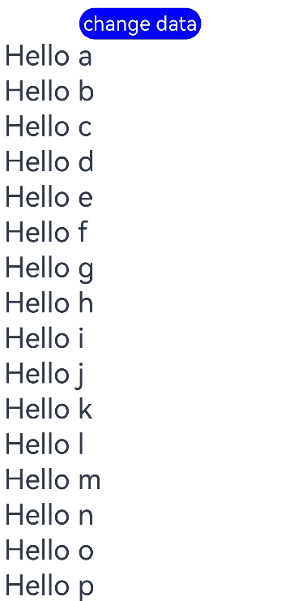

# LazyForEach: Lazy Data Loading
<!--Kit: ArkUI-->
<!--Subsystem: ArkUI-->
<!--Owner: @maorh-->
<!--Designer: @keerecles-->
<!--Tester: @TerryTsao-->
<!--Adviser: @zhang_yixin13-->

## Overview

**LazyForEach**, supported since API version 7, enables dynamic rendering of child components from a data source. It iterates through the data source on demand, creating components during each iteration. When **LazyForEach** is used within scrollable containers, the framework creates components based on the visible area and recycles off-screen components to optimize memory usage.<br>
This guide covers [basic features](#basic-features), [advanced features](#advanced-features), and [implementation notes](#implementation-notes) about **LazyForEach**. The [Initial Rendering](#initial-rendering) section provides a straightforward example to help you get started quickly.<br>
For details about the related APIs, see [LazyForEach](../../reference/apis-arkui/arkui-ts/ts-rendering-control-lazyforeach.md).

> **NOTE**
>
> In scenarios involving a large number of child components, **LazyForEach**, when combined with techniques such as cached list items, dynamic preloading, and component reuse, can significantly improve scrolling frame rates while reducing memory usage. For best practices, see [Optimizing Frame Loss for Long List Loading](https://developer.huawei.com/consumer/en/doc/best-practices/bpta-best-practices-long-list).
> The [Repeat](./arkts-new-rendering-control-repeat.md) component also provides the iterative rendering capability. Compared with **LazyForEach**, **Repeat** listens for data source changes based on state management, which is more convenient. In addition, **Repeat** supports child component reuse, improving the UI rendering efficiency. Therefore, **Repeat** is recommended. You can migrate the existing **LazyForEach** component to the **Repeat** component by referring to [Migrating from LazyForEach to Repeat](./arkts-lazyforeach-repeat-migration-guide.md).

## Constraints

- **LazyForEach** must be used within a container component. Only the following components support lazy loading with configurable **cachedCount** (to load only the visible portion plus a small buffer of data before and after): [List](../../reference/apis-arkui/arkui-ts/ts-container-list.md), [ListItemGroup](../../reference/apis-arkui/arkui-ts/ts-container-listitemgroup.md), [Grid](../../reference/apis-arkui/arkui-ts/ts-container-grid.md), [Swiper](../../reference/apis-arkui/arkui-ts/ts-container-swiper.md), and [WaterFlow](../../reference/apis-arkui/arkui-ts/ts-container-waterflow.md). Other components load all data at once. The parent component supporting lazy loading calculates the number of child components to render in the visible area based on its own and the children's dimensions. If height or width values are missing, lazy loading may fail in certain scenarios. For details, see [Lazy Loading Failure](#lazy-loading-failure).
- **LazyForEach** uses the generated key value to determine whether to refresh child components. Components with unchanged key values will not be refreshed.
- A container component may contain only one **LazyForEach**. For example, in a **List** component, avoid mixing **ListItem**, **ForEach**, **LazyForEach**, or multiple **LazyForEach** components simultaneously.
- Each iteration of **LazyForEach** must generate exactly one child component. The child component generator function should return a single root component.
- Generated child components must be valid within the parent container component of **LazyForEach**.
- **LazyForEach** can be used within **if/else** statements and may itself contain such statements.
- The key generation function must produce unique values for each data item. Duplicate key values will cause rendering issues.
- **LazyForEach** must be updated through a **DataChangeListener** object (for details, see [LazyForEach](../../reference/apis-arkui/arkui-ts/ts-rendering-control-lazyforeach.md)). Reassigning **dataSource** (first parameter) causes an exception. If **dataSource** uses a state variable, changes to the state variable will not trigger UI refresh in **LazyForEach**.
- For optimal rendering performance, ensure the **onDataChange** API of **DataChangeListener** generates new key values different from previous ones to trigger component re-rendering.
- **LazyForEach** can be combined with [\@Reusable](../state-management/arkts-reusable.md) to enable node reuse. For details, see [List Scrolling with LazyForEach](../state-management/arkts-reusable.md#list-scrolling-with-lazyforeach).
- **LazyForEach** also supports integration with [\@ReusableV2](../state-management/arkts-new-reusableV2.md). For details, see [Using in LazyForEach](../state-management/arkts-new-reusableV2.md#using-in-lazyforeach).
- When child nodes of **LazyForEach** leave both the visible and preload areas, they are not destroyed or recycled immediately. **LazyForEach** performs destruction and recycling during idle periods.

## Basic Features

### Setting Up a Data Source

To enable **LazyForEach** to manage data updates, you must implement the [IDataSource](../../reference/apis-arkui/arkui-ts/ts-rendering-control-lazyforeach.md#idatasource) API. This implementation serves as the data source of **LazyForEach** and handles [DataChangeListener](../../reference/apis-arkui/arkui-ts/ts-rendering-control-lazyforeach.md#datachangelistener) management for notifying data changes.

The core implementation requires the following APIs from **IDataSource**: [totalCount](../../reference/apis-arkui/arkui-ts/ts-rendering-control-lazyforeach.md#totalcount), [getData](../../reference/apis-arkui/arkui-ts/ts-rendering-control-lazyforeach.md#getdata), [registerDataChangeListener](../../reference/apis-arkui/arkui-ts/ts-rendering-control-lazyforeach.md#registerdatachangelistener), and [unregisterDataChangeListener](../../reference/apis-arkui/arkui-ts/ts-rendering-control-lazyforeach.md#unregisterdatachangelistener). For details, see [BasicDataSource sample code](#basicdatasource-sample-code). When data changes occur, call the listener API to trigger **LazyForEach** updates. For update procedures, see [Data Update](#data-update).

### Key Generation Rules

During **LazyForEach** rendering, the system generates a unique, persistent key for each item to identify the owing component. When the key changes, the ArkUI framework considers that the array element has been replaced or modified and creates a component based on the new key.

**LazyForEach** provides the **keyGenerator** parameter for custom key generation. If this parameter is undefined, the framework uses the default function: **(item: Object, index: number) => { return viewId + '-' + index.toString(); }**, where **viewId** is compiler-generated and consistent within the same **LazyForEach** component.

The key must meet the following requirements:
1. Uniqueness: Each data item must have a distinct key.
2. Consistency: Keys must remain unchanged for unmodified data items.

These requirements ensure correct and efficient child component updates. Violations may cause rendering anomalies or performance degradation.

### Component Creation Rules

After the key generation rules are determined, the **itemGenerator** function – the second parameter in **LazyForEach** – creates a component for each array item of the data source based on the rules. Component creation involves two scenarios: [initial rendering](#initial-rendering) and [date updates](#data-update) in non-initial rendering.

### Initial Rendering

When implementing **LazyForEach**, you must provide three elements: the data source, a key generation function, and a component creation function. Ensure the key generation function produces distinct keys for each data item.<br>
During initial rendering, **LazyForEach** generates unique keys for all data source items based on the key generation rules and creates corresponding components for each.

If node creation in the preload area is time-consuming, the framework distributes creation tasks across multiple frames.

For details about the code of **BasicDataSource**, see [BasicDataSource Implementation for the String Array](#basicdatasource-implementation-for-the-string-array).

<!-- @[initial_rendering](https://gitcode.com/openharmony/applications_app_samples/blob/master/code/DocsSample/ArkUISample/RenderingControl/entry/src/main/ets/pages/RenderingLazyForeach/InitialRendering.ets) -->

``` TypeScript
import { hilog } from '@kit.PerformanceAnalysisKit';
/** For details about the BasicDataSource implementation of the String array, see the sample code at the end of this topic. **/
import { BasicDataSource } from './BasicDataSource';
const TAG = '[Sample_RenderingControl]';
const DOMAIN = 0xF811;

class InitialDataSource extends BasicDataSource {
  private dataArray: string[] = [];

  public totalCount(): number {
    return this.dataArray.length;
  }

  public getData(index: number): string {
    return this.dataArray[index];
  }

  public pushData(data: string): void {
    this.dataArray.push(data);
    this.notifyDataAdd(this.dataArray.length - 1);
  }
}

@Entry
@Component
struct InitialRendering {
  private data: InitialDataSource = new InitialDataSource();

  aboutToAppear() {
    for (let i = 0; i <= 20; i++) {
      this.data.pushData(`Hello ${i}`);
    }
  }

  build() {
    List({ space: 3 }) {
      LazyForEach(this.data, (item: string) => {
        ListItem() {
          Row() {
            Text(item).fontSize(50)
              .onAppear(() => {
                hilog.info(DOMAIN, TAG, 'appear: ${item}');
              })
          }.margin({ left: 10, right: 10 })
        }
      }, (item: string) => item)
    }
    .cachedCount(5)
  }
}
```

In the preceding code, the return value of the **keyGenerator** function is **item**. During iterative rendering, **LazyForEach** generates keys in the sequence of **Hello 0**, **Hello 1**, ..., **Hello 20** for the array item of the data source, creates the corresponding **ListItem** child components and render them on the GUI.

The figure below shows the effect.

**Initial Rendering of LazyForEach** 


**Error Case: Rendering Anomalies Due to Duplicate Key Values**

When identical keys are generated for different data items, framework behavior becomes unpredictable. In the following example, **LazyForEach** renders data items with duplicate keys. During scrolling, when **LazyForEach** preloads components about to enter or leave the viewport, the new components share keys with previously destroyed components. This key collision may cause the framework to reuse incorrect cached components, resulting in rendering issues.

For details about the code of **BasicDataSource**, see [BasicDataSource Implementation for the String Array](#basicdatasource-implementation-for-the-string-array).

```ts
/** For details about the BasicDataSource implementation of the string array, see the sample code at the end of this topic. **/
import { BasicDataSource } from './BasicDataSource';

class MyDataSource extends BasicDataSource {
  private dataArray: string[] = [];

  public totalCount(): number {
    return this.dataArray.length;
  }

  public getData(index: number): string {
    return this.dataArray[index];
  }

  public pushData(data: string): void {
    this.dataArray.push(data);
    this.notifyDataAdd(this.dataArray.length - 1);
  }
}

@Entry
@Component
struct MyComponent {
  private data: MyDataSource = new MyDataSource();

  aboutToAppear() {
    for (let i = 0; i <= 20; i++) {
      this.data.pushData(`Hello ${i}`);
    }
  }

  build() {
    List({ space: 3 }) {
      LazyForEach(this.data, (item: string) => {
        ListItem() {
          Row() {
            Text(item).fontSize(50)
              .onAppear(() => {
                console.info(`appear: ${item}`);
              })
          }.margin({ left: 10, right: 10 })
        }
      }, (item: string) => `same key`) // The custom key generation function returns identical keys for all items.
    }.cachedCount(5)
  }
}
```

The figure below shows the effect.

**LazyForEach Rendering with Duplicate Keys** 


To resolve this issue, modify the key generation function of **LazyForEach** to produce unique keys for each data item.

<!-- @[initial_rendering_two](https://gitcode.com/openharmony/applications_app_samples/blob/master/code/DocsSample/ArkUISample/RenderingControl/entry/src/main/ets/pages/RenderingLazyForeach/InitialRendering2.ets) -->

``` TypeScript
LazyForEach(this.data, (item: string) => {
  ListItem() {
    Row() {
      Text(item).fontSize(50)
        .onAppear(() => {
          hilog.info(DOMAIN, TAG, 'appear: ${item}');
        })
    }.margin({ left: 10, right: 10 })
  }
}, (item: string, index: number) => `${item}-${index}`) // The customize the key generation function generates unique keys.
```

The corrected implementation produces the following rendering behavior.

**LazyForEach Rendering with Unique Keys** 


### Data Update

When the **LazyForEach** data source changes and requires re-rendering, you must call the corresponding listener APIs to instruct **LazyForEach** to update its data. Supported data update operations include adding, deleting, swapping, modifying individual items, and batch modifications. Below are code samples for key operations.

**Adding Data**

For details about the code of **BasicDataSource**, see [BasicDataSource Implementation for the String Array](#basicdatasource-implementation-for-the-string-array).

<!-- @[add_data](https://gitcode.com/openharmony/applications_app_samples/blob/master/code/DocsSample/ArkUISample/RenderingControl/entry/src/main/ets/pages/RenderingLazyForeach/AddingData.ets) -->

``` TypeScript
/** For details about the BasicDataSource implementation of the String array, see the sample code at the end of this topic. **/
import { BasicDataSource } from './BasicDataSource';

class MyDataSource extends BasicDataSource {
  private dataArray: string[] = [];

  public totalCount(): number {
    return this.dataArray.length;
  }

  public getData(index: number): string {
    return this.dataArray[index];
  }

  public pushData(data: string): void {
    this.dataArray.push(data);
    this.notifyDataAdd(this.dataArray.length - 1);
  }
}

@Entry
@Component
struct AddingData {
  private data: MyDataSource = new MyDataSource();

  aboutToAppear() {
    for (let i = 0; i <= 20; i++) {
      this.data.pushData(`Hello ${i}`);
    }
  }

  build() {
    Scroll(){
      List({ space: 3 }) {
        LazyForEach(this.data, (item: string) => {
          ListItem() {
            Row() {
              Text(item).fontSize(50)
                .onAppear(() => {
                })
            }.margin({ left: 10, right: 10 })
          }
          .onClick(() => {
            // Add a new item on click.
            this.data.pushData(`Hello ${this.data.totalCount()}`);
          })
        }, (item: string) => item)
      }
      .cachedCount(5)
    }
  }
}
```

When a **LazyForEach** child component is clicked, the data source's **pushData** method is invoked. This method appends data to the end of the data source and calls **notifyDataAdd**, which triggers **listener.onDataAdd** to notify **LazyForEach** of the addition. Upon receiving this notification, **LazyForEach** creates a new child component at the specified index.

The figure below shows the effect.

**Adding Data to LazyForEach** 


**Deleting Data**

For details about the code of **BasicDataSource**, see [BasicDataSource Implementation for the String Array](#basicdatasource-implementation-for-the-string-array).

<!-- @[delete_data](https://gitcode.com/openharmony/applications_app_samples/blob/master/code/DocsSample/ArkUISample/RenderingControl/entry/src/main/ets/pages/RenderingLazyForeach/DataDeletion.ets) -->

``` TypeScript
import { hilog } from '@kit.PerformanceAnalysisKit';
/** For details about the BasicDataSource implementation of the String array, see the sample code at the end of this topic. **/
import { BasicDataSource } from './BasicDataSource';
const TAG = '[Sample_RenderingControl]';
const DOMAIN = 0xF811;

class DataDeletionSource extends BasicDataSource {
  private dataArray: string[] = [];

  public totalCount(): number {
    return this.dataArray.length;
  }

  public getData(index: number): string {
    return this.dataArray[index];
  }

  public getAllData(): string[] {
    return this.dataArray;
  }

  public pushData(data: string): void {
    this.dataArray.push(data);
  }

  public deleteData(index: number): void {
    this.dataArray.splice(index, 1);
    this.notifyDataDelete(index);
  }
}

@Entry
@Component
struct DataDeletion {
  private data: DataDeletionSource = new DataDeletionSource();

  aboutToAppear() {
    for (let i = 0; i <= 20; i++) {
      this.data.pushData(`Hello ${i}`);
    }
  }

  build() {
    List({ space: 3 }) {
      LazyForEach(this.data, (item: string, index: number) => {
        ListItem() {
          Row() {
            Text(item).fontSize(50)
              .onAppear(() => {
                hilog.info(DOMAIN, TAG, 'appear: ${item}');
              })
          }.margin({ left: 10, right: 10 })
        }
        .onClick(() => {
          // Delete a child component on click.
          this.data.deleteData(this.data.getAllData().indexOf(item));
        })
      }, (item: string) => item)
    }
    .cachedCount(5)
  }
}
```

When a **LazyForEach** child component is clicked, the data source's **deleteData** method is invoked. This removes the data at the corresponding index and invokes **notifyDataDelete**, which triggers **listener.onDataDelete** to instruct **LazyForEach** to remove the child component at that position.

The figure below shows the effect.

**Deleting Data from LazyForEach** 


**Swapping Data**

For details about the code of **BasicDataSource**, see [BasicDataSource Implementation for the String Array](#basicdatasource-implementation-for-the-string-array).

<!-- @[swap_data](https://gitcode.com/openharmony/applications_app_samples/blob/master/code/DocsSample/ArkUISample/RenderingControl/entry/src/main/ets/pages/RenderingLazyForeach/SwappingData.ets) -->

``` TypeScript
import { hilog } from '@kit.PerformanceAnalysisKit';
/** For details about the BasicDataSource implementation of the String array, see the sample code at the end of this topic. **/
import { BasicDataSource } from './BasicDataSource';
const TAG = '[Sample_RenderingControl]';
const DOMAIN = 0xF811;

class SwappingDataSource extends BasicDataSource {
  private dataArray: string[] = [];

  public totalCount(): number {
    return this.dataArray.length;
  }

  public getData(index: number): string {
    return this.dataArray[index];
  }

  public getAllData(): string[] {
    return this.dataArray;
  }

  public pushData(data: string): void {
    this.dataArray.push(data);
  }

  public moveData(from: number, to: number): void {
    let temp: string = this.dataArray[from];
    this.dataArray[from] = this.dataArray[to];
    this.dataArray[to] = temp;
    this.notifyDataMove(from, to);
  }
}

@Entry
@Component
struct SwappingData {
  private moved: number[] = [];
  private data: SwappingDataSource = new SwappingDataSource();

  aboutToAppear() {
    for (let i = 0; i <= 20; i++) {
      this.data.pushData(`Hello ${i}`);
    }
  }

  build() {
    List({ space: 3 }) {
      LazyForEach(this.data, (item: string, index: number) => {
        ListItem() {
          Row() {
            Text(item).fontSize(50)
              .onAppear(() => {
                hilog.info(DOMAIN, TAG, 'appear: ${item}');
              })
          }.margin({ left: 10, right: 10 })
        }
        .onClick(() => {
          this.moved.push(this.data.getAllData().indexOf(item));
          if (this.moved.length === 2) {
            // Swap items on click.
            this.data.moveData(this.moved[0], this.moved[1]);
            this.moved = [];
          }
        })
      }, (item: string) => item)
    }
    .cachedCount(5)
  }
}
```

When a **LazyForEach** child component is first clicked, its index is stored in the **moved** array. When a second component is clicked, the data source's **moveData** method is invoked, which swaps the data positions and calls **notifyDataMove**. This triggers **listener.onDataMove**, instructing **LazyForEach** to swap the child components at the specified positions.

The figure below shows the effect.

**Swapping Data in LazyForEach** 


**Modifying Individual Data Items**

For details about the code of **BasicDataSource**, see [BasicDataSource Implementation for the String Array](#basicdatasource-implementation-for-the-string-array).

<!-- @[change_individual_data](https://gitcode.com/openharmony/applications_app_samples/blob/master/code/DocsSample/ArkUISample/RenderingControl/entry/src/main/ets/pages/RenderingLazyForeach/ModifyingIndividualDataItems.ets) -->

``` TypeScript
import { hilog } from '@kit.PerformanceAnalysisKit';
/** For details about the BasicDataSource implementation of the String array, see the sample code at the end of this topic. **/
import { BasicDataSource } from './BasicDataSource';
const TAG = '[Sample_RenderingControl]';
const DOMAIN = 0xF811;

class ModifyingDataSource extends BasicDataSource {
  private dataArray: string[] = [];

  public totalCount(): number {
    return this.dataArray.length;
  }

  public getData(index: number): string {
    return this.dataArray[index];
  }

  public pushData(data: string): void {
    this.dataArray.push(data);
  }

  public changeData(index: number, data: string): void {
    this.dataArray.splice(index, 1, data);
    this.notifyDataChange(index);
  }
}

@Entry
@Component
struct ModifyingIndividualDataItems {
  private data: ModifyingDataSource = new ModifyingDataSource();

  aboutToAppear() {
    for (let i = 0; i <= 20; i++) {
      this.data.pushData(`Hello ${i}`);
    }
  }

  build() {
    List({ space: 3 }) {
      LazyForEach(this.data, (item: string, index: number) => {
        ListItem() {
          Row() {
            Text(item).fontSize(50)
              .onAppear(() => {
                hilog.info(DOMAIN, TAG, 'appear: ${item}');
              })
          }.margin({ left: 10, right: 10 })
        }
        .onClick(() => {
          this.data.changeData(index, item + '00');
        })
      }, (item: string) => item)
    }
    .cachedCount(5)
  }
}
```

When a **LazyForEach** child component is clicked, the data source's **changeData** method updates the corresponding data item This method calls **notifyDataChange**, which triggers **listener.onDataChange** to notify the **LazyForEach** component of the data change. **LazyForEach** then rebuilds the child component at the corresponding index.

The figure below shows the effect.

**Modifying Individual Data Items in LazyForEach** 


**Modifying Multiple Data Items**

For details about the code of **BasicDataSource**, see [BasicDataSource Implementation for the String Array](#basicdatasource-implementation-for-the-string-array).

<!-- @[change_multiple_data](https://gitcode.com/openharmony/applications_app_samples/blob/master/code/DocsSample/ArkUISample/RenderingControl/entry/src/main/ets/pages/RenderingLazyForeach/ModifyingMultipleDataItems.ets) -->

``` TypeScript
import { hilog } from '@kit.PerformanceAnalysisKit';
/** For details about the BasicDataSource implementation of the String array, see the sample code at the end of this topic. **/
import { BasicDataSource } from './BasicDataSource';
const TAG = '[Sample_RenderingControl]';
const DOMAIN = 0xF811;

class ModifyingMultiSourceEleven extends BasicDataSource {
  private dataArray: string[] = [];

  public totalCount(): number {
    return this.dataArray.length;
  }

  public getData(index: number): string {
    return this.dataArray[index];
  }

  public pushData(data: string): void {
    this.dataArray.push(data);
  }

  public reloadData(): void {
    this.notifyDataReload();
  }

  public modifyAllData(): void {
    this.dataArray = this.dataArray.map((item: string) => {
      return item + '0';
    });
  }
}

@Entry
@Component
struct ModifyingMultipleDataItems {
  private data: ModifyingMultiSourceEleven = new ModifyingMultiSourceEleven();

  aboutToAppear() {
    for (let i = 0; i <= 20; i++) {
      this.data.pushData(`Hello ${i}`);
    }
  }

  build() {
    List({ space: 3 }) {
      LazyForEach(this.data, (item: string, index: number) => {
        ListItem() {
          Row() {
            Text(item).fontSize(50)
              .onAppear(() => {
                hilog.info(DOMAIN, TAG, 'appear: ${item}');
              })
          }.margin({ left: 10, right: 10 })
        }
        .onClick(() => {
          this.data.modifyAllData();
          this.data.reloadData();
        })
      }, (item: string) => item)
    }
    .cachedCount(5)
  }
}
```

When any **LazyForEach** child component is clicked, the data source's **modifyAllData** method transforms all data items, followed by invoking **reloadData**. This triggers **notifyDataReload**, which calls **listener.onDataReloaded** to instruct **LazyForEach** to refresh all child components. During this process, **LazyForEach** compares key values between original and new data items: Items with unchanged keys are reused from cache; items with modified keys are rebuilt.

The figure below shows the effect.

**Modifying Multiple Data Items in LazyForEach** 


**Precisely Modifying Data in Batches**

For details about the code of **BasicDataSource**, see [BasicDataSource Implementation for the String Array](#basicdatasource-implementation-for-the-string-array).

<!-- @[precisely_modifying_data](https://gitcode.com/openharmony/applications_app_samples/blob/master/code/DocsSample/ArkUISample/RenderingControl/entry/src/main/ets/pages/RenderingLazyForeach/PreciselyModifyingData.ets) -->

``` TypeScript
import { hilog } from '@kit.PerformanceAnalysisKit';
/** For details about the BasicDataSource implementation of the String array, see the sample code at the end of this topic. **/
import { BasicDataSource } from './BasicDataSource';
const TAG = '[Sample_RenderingControl]';
const DOMAIN = 0xF811;

class PreciseModifyingDataSource extends BasicDataSource {
  private dataArray: string[] = [];

  public totalCount(): number {
    return this.dataArray.length;
  }

  public getData(index: number): string {
    return this.dataArray[index];
  }

  public operateData(): void {
    this.dataArray.splice(4, 0, this.dataArray[1]);
    this.dataArray.splice(1, 1);
    let temp = this.dataArray[4];
    this.dataArray[4] = this.dataArray[6];
    this.dataArray[6] = temp;
    this.dataArray.splice(8, 0, 'Hello 1', 'Hello 2');
    this.dataArray.splice(12, 2);
    this.notifyDatasetChange([
      { type: DataOperationType.MOVE, index: { from: 1, to: 3 } },
      { type: DataOperationType.EXCHANGE, index: { start: 4, end: 6 } },
      { type: DataOperationType.ADD, index: 8, count: 2 },
      { type: DataOperationType.DELETE, index: 10, count: 2 }]);
  }

  public init(): void {
    this.dataArray.splice(0, 0, 'Hello a', 'Hello b', 'Hello c', 'Hello d', 'Hello e', 'Hello f', 'Hello g', 'Hello h',
      'Hello i', 'Hello j', 'Hello k', 'Hello l', 'Hello m', 'Hello n', 'Hello o', 'Hello p', 'Hello q', 'Hello r');
  }
}

@Entry
@Component
struct PreciselyModifyingData {
  private data: PreciseModifyingDataSource = new PreciseModifyingDataSource();

  aboutToAppear() {
    this.data.init();
  }

  build() {
    Column() {
      Text('change data')
        .fontSize(10)
        .backgroundColor(Color.Blue)
        .fontColor(Color.White)
        .borderRadius(50)
        .padding(5)
        .onClick(() => {
          this.data.operateData();
        })
      List({ space: 3 }) {
        LazyForEach(this.data, (item: string, index: number) => {
          ListItem() {
            Row() {
              Text(item).fontSize(35)
                .onAppear(() => {
                  hilog.info(DOMAIN, TAG, 'appear: ${item}');
                })
            }.margin({ left: 10, right: 10 })
          }

        }, (item: string) => item + new Date().getTime())
      }
      .cachedCount(5)
    }
  }
}
```

The **onDatasetChange** API allows you to notify **LazyForEach** at a time to add, delete, move, and exchange data. In the preceding scenario, after **change data** is clicked, multiple operations are executed simultaneously: The second item moves to the fourth, the fifth and seventh items exchange positions, items **"Hello 1"** and **"Hello 2"** are inserted starting at the ninth position, and two items are deleted beginning at the eleventh position. 

**Modifying Data in Batches in LazyForEach** 
  

In this approach, array modification is performed through direct value assignment rather than using **splice()**. The resulting **operations** values are derived by comparing the original and modified arrays.

For details about the code of **BasicDataSource**, see [BasicDataSource Implementation for the String Array](#basicdatasource-implementation-for-the-string-array).

<!-- @[precisely_modifying_data_two](https://gitcode.com/openharmony/applications_app_samples/blob/master/code/DocsSample/ArkUISample/RenderingControl/entry/src/main/ets/pages/RenderingLazyForeach/PreciselyModifyingData2.ets) -->

``` TypeScript
import { hilog } from '@kit.PerformanceAnalysisKit';
/** For details about the BasicDataSource implementation of the String array, see the sample code at the end of this topic. **/
import { BasicDataSource } from './BasicDataSource';
const TAG = '[Sample_RenderingControl]';
const DOMAIN = 0xF811;

class PreciselyModifyingSource extends BasicDataSource {
  private dataArray: string[] = [];

  public totalCount(): number {
    return this.dataArray.length;
  }

  public getData(index: number): string {
    return this.dataArray[index];
  }

  public operateData(): void {
    this.dataArray =
      ['Hello x', 'Hello 1', 'Hello 2', 'Hello b', 'Hello c', 'Hello e', 'Hello d', 'Hello f', 'Hello g', 'Hello h'];
    this.notifyDatasetChange([
      { type: DataOperationType.CHANGE, index: 0 },
      { type: DataOperationType.ADD, index: 1, count: 2 },
      { type: DataOperationType.EXCHANGE, index: { start: 3, end: 4 } },
    ]);
  }

  public init(): void {
    this.dataArray = ['Hello a', 'Hello b', 'Hello c', 'Hello d', 'Hello e', 'Hello f', 'Hello g', 'Hello h'];
  }
}

@Entry
@Component
struct PreciselyModifyingDataTwo {
  private data: PreciselyModifyingSource = new PreciselyModifyingSource();

  aboutToAppear() {
    this.data.init();
  }

  build() {
    Column() {
      Text('Multi-Data Change')
        .fontSize(10)
        .backgroundColor(Color.Blue)
        .fontColor(Color.White)
        .borderRadius(50)
        .padding(5)
        .onClick(() => {
          this.data.operateData();
        })
      List({ space: 3 }) {
        LazyForEach(this.data, (item: string, index: number) => {
          ListItem() {
            Row() {
              Text(item).fontSize(35)
                .onAppear(() => {
                  hilog.info(DOMAIN, TAG, 'appear: ${item}');
                })
            }.margin({ left: 10, right: 10 })
          }
        }, (item: string) => item + new Date().getTime())
      }
      .cachedCount(5)
    }
  }
}
```

**Modifying Data in Batches in LazyForEach** 
  

Key usage considerations:

1. Do not combine **onDatasetChange** with other data operation APIs within the same update cycle.
2. For the **operations** parameter passed to **onDatasetChange**, the index of each operation is calculated based on the original array (before modification). As a result, the index in **operations** does not always align with the index in **Datasource**, and the index must not be a negative number.

   Example analysis:

   ```ts
   // Array before modification.
   ['Hello a','Hello b','Hello c','Hello d','Hello e','Hello f','Hello g','Hello h','Hello i','Hello j','Hello k','Hello l','Hello m','Hello n','Hello o','Hello p','Hello q','Hello r']
   // Array after modification.
   ['Hello a','Hello c','Hello d','Hello b','Hello g','Hello f','Hello e','Hello h','Hello 1','Hello 2','Hello i','Hello j','Hello m','Hello n','Hello o','Hello p','Hello q','Hello r']
   ```

   **Hello b** moves from index 2 to index 4. Therefore, the first **operation** is written in **type: DataOperationType.MOVE, index: { from: 1, to: 3 } }**.

   **Hello e** (at index 4) and **Hello g** (at index 6) swap positions. Therefore, the second **operation** is written in **{ type: DataOperationType.EXCHANGE, index: { start: 4, end: 6 } }**.

   **Hello 1** and **Hello 2** are inserted after **Hello h** (at index 7) in the original array. Therefore, the third **operation** is written in **{ type: DataOperationType.ADD, index: 8, count: 2 }**.

   **Hello k** (at index 10) and **Hello l** (at index 11) are deleted in the original array. Therefore, the fourth **operation** is written in **{ type: DataOperationType.DELETE, index: 10, count: 2 }**.

3. When data is processed in batches within the same **onDatasetChange** callback, if multiple **DataOperation** instances target the same index, only the first **DataOperation** will take effect.
4. In operations where you specify keys on your own, **LazyForEach** does not call the key generator to obtain keys. As such, make sure the specified keys are correct.
5. If the operation set includes a reload operation, all other operations in the set are ignored.

## Advanced Features

### Modifying Data Sub-Properties Using State Management V1

When **LazyForEach** is used for UI re-rendering, traditional data item changes require destroying and rebuilding the entire child component. This approach becomes inefficient with complex component structures. To address this, the framework provides the [\@Observed and \@ObjectLink](../state-management/arkts-observed-and-objectlink.md) mechanism for fine-grained property observation, enabling targeted component re-rendering and improved rendering performance. You can select a re-rendering mode that better suits your needs.

For details about the **GenericBasicDataSource** implementation, see [BasicDataSource Implementation for Generic Arrays](#basicdatasource-implementation-for-generic-arrays).

<!-- @[changing_data_sub_properties](https://gitcode.com/openharmony/applications_app_samples/blob/master/code/DocsSample/ArkUISample/RenderingControl/entry/src/main/ets/pages/RenderingLazyForeach/ChangingDataSubproperties.ets) -->

``` TypeScript
/** For details about the GenericBasicDataSource implementation, see the BasicDataSource Implementation for Generic Arrays section. **/
import { GenericBasicDataSource } from './GenericBasicDataSource';

class MySubDataSource extends GenericBasicDataSource<StringData> {
  private dataArray: StringData[] = [];

  public totalCount(): number {
    return this.dataArray.length;
  }

  public getData(index: number): StringData {
    return this.dataArray[index];
  }

  public pushData(data: StringData): void {
    this.dataArray.push(data);
    this.notifyDataAdd(this.dataArray.length - 1);
  }
}

@Observed
class StringData {
  public message: string;

  constructor(message: string) {
    this.message = message;
  }
}

@Entry
@Component
struct ChangingDataSubproperties {
  private data: MySubDataSource = new MySubDataSource();

  aboutToAppear() {
    for (let i = 0; i <= 20; i++) {
      this.data.pushData(new StringData(`Hello ${i}`));
    }
  }

  build() {
    List({ space: 3 }) {
      LazyForEach(this.data, (item: StringData, index: number) => {
        ListItem() {
          ChangingDataSubpropertiesChildComponent({ data: item })
        }
        .onClick(() => {
          item.message += '0';
        })
      }, (item: StringData, index: number) => index.toString())
    }
    .cachedCount(5)
  }
}

@Component
struct ChangingDataSubpropertiesChildComponent {
  @ObjectLink data: StringData;

  build() {
    Row() {
      Text(this.data.message).fontSize(50)
        .onAppear(() => {
        })
    }.margin({ left: 10, right: 10 })
  }
}
```

When a **LazyForEach** item is clicked to modify **item.message**, the @ObjectLink decorator in **ChangingDataSubpropertiesChildComponent** enables sub-property observation. Only the **Text(this.data.message)** component is re-rendered, avoiding complete **ListItem** reconstruction.

**Changing Data Sub-Properties in LazyForEach** 


### Modifying Data Sub-Properties Using State Management V2

State management V2 introduces the [\@ObservedV2 and \@Trace](../state-management/arkts-new-observedV2-and-trace.md) decorators to enable deep property observation. Combined with [\@Local](../state-management/arkts-new-local.md) and [\@Param](../state-management/arkts-new-param.md) decorators, this allows precise control over component re-rendering scopes, ensuring only components using modified properties are re-rendered.

**Observing Nested Class Properties**

For details about the **GenericBasicDataSource** implementation, see [BasicDataSource Implementation for Generic Arrays](#basicdatasource-implementation-for-generic-arrays).

<!-- @[observing_nested_class_properties](https://gitcode.com/openharmony/applications_app_samples/blob/master/code/DocsSample/ArkUISample/RenderingControl/entry/src/main/ets/pages/RenderingLazyForeach/ObservingNestedClassProperties.ets) -->    

``` TypeScript
/** For details about the GenericBasicDataSource implementation, see the BasicDataSource Implementation for Generic Arrays section. **/
import { GenericBasicDataSource } from './GenericBasicDataSource';

class PropertiesDataSource extends GenericBasicDataSource<ClassPropertiesStringData> {
  private dataArray: ClassPropertiesStringData[] = [];

  public totalCount(): number {
    return this.dataArray.length;
  }

  public getData(index: number): ClassPropertiesStringData {
    return this.dataArray[index];
  }

  public pushData(data: ClassPropertiesStringData): void {
    this.dataArray.push(data);
    this.notifyDataAdd(this.dataArray.length - 1);
  }
}

class ClassPropertiesStringData {
  public firstLayer: FirstLayer;

  constructor(firstLayer: FirstLayer) {
    this.firstLayer = firstLayer;
  }
}

class FirstLayer {
  public secondLayer: SecondLayer;

  constructor(secondLayer: SecondLayer) {
    this.secondLayer = secondLayer;
  }
}

class SecondLayer {
  public thirdLayer: ThirdLayer;

  constructor(thirdLayer: ThirdLayer) {
    this.thirdLayer = thirdLayer;
  }
}

@ObservedV2
class ThirdLayer {
  @Trace public fourthLayer: string;

  constructor(fourthLayer: string) {
    this.fourthLayer = fourthLayer;
  }
}

@Entry
@ComponentV2
struct ObservingNestedClassProperties {
  private data: PropertiesDataSource = new PropertiesDataSource();

  aboutToAppear() {
    for (let i = 0; i <= 20; i++) {
      this.data.pushData(new ClassPropertiesStringData(new FirstLayer(new SecondLayer(new ThirdLayer(`Hello ${i}`)))));
    }
  }

  build() {
    List({ space: 3 }) {
      LazyForEach(this.data, (item: ClassPropertiesStringData, index: number) => {
        ListItem() {
          Text(item.firstLayer.secondLayer.thirdLayer.fourthLayer).fontSize(50)
            .onClick(() => {
              item.firstLayer.secondLayer.thirdLayer.fourthLayer += '!';
            })
        }
      }, (item: ClassPropertiesStringData, index: number) => index.toString())
    }
    .cachedCount(5)
  }
}
```

@ObservedV2 and @Trace are used to decorate classes and their properties. Using them together enables deep observation of the decorated elements. In the example, these decorators observe the changes of multi-level nested properties and trigger re-rendering only for components dependent on the modified properties. When the child component **Text** is clicked to change the innermost @Trace decorated property of the nested class, only the components that depend on the property are re-rendered.

**Observing Component Internal State**

For details about the **GenericBasicDataSource** implementation, see [BasicDataSource Implementation for Generic Arrays](#basicdatasource-implementation-for-generic-arrays).

<!-- @[observing_component_internal_state](https://gitcode.com/openharmony/applications_app_samples/blob/master/code/DocsSample/ArkUISample/RenderingControl/entry/src/main/ets/pages/RenderingLazyForeach/ObservingComponentInternalState.ets) -->    

``` TypeScript
/** For details about the GenericBasicDataSource implementation, see the BasicDataSource Implementation for Generic Arrays section. **/
import { GenericBasicDataSource } from './GenericBasicDataSource';

class MyStateDataSource extends GenericBasicDataSource<StateStringData> {
  private dataArray: StateStringData[] = [];

  public totalCount(): number {
    return this.dataArray.length;
  }

  public getData(index: number): StateStringData {
    return this.dataArray[index];
  }

  public pushData(data: StateStringData): void {
    this.dataArray.push(data);
    this.notifyDataAdd(this.dataArray.length - 1);
  }
}

@ObservedV2
class StateStringData {
  @Trace public message: string;

  constructor(message: string) {
    this.message = message;
  }
}

@Entry
@ComponentV2
struct ObservingComponentInternalState {
  data: MyStateDataSource = new MyStateDataSource();

  aboutToAppear() {
    for (let i = 0; i <= 20; i++) {
      this.data.pushData(new StateStringData(`Hello ${i}`));
    }
  }

  build() {
    List({ space: 3 }) {
      LazyForEach(this.data, (item: StateStringData, index: number) => {
        ListItem() {
          Row() {
            Text(item.message).fontSize(50)
              .onClick(() => {
                // Modifying the @Trace decorated variable in the @ObservedV2 class triggers Text component re-rendering.
                item.message += '!';
              })
            ObservingComponentChildComponent()
          }
        }
      }, (item: StateStringData, index: number) => index.toString())
    }
    .cachedCount(5)
  }
}

@ComponentV2
struct ObservingComponentChildComponent {
  @Local message: string = '?';

  build() {
    Row() {
      Text(this.message).fontSize(50)
        .onClick(() => {
          // Modifying the @Local decorated variable triggers Text component re-rendering.
          this.message += '?';
        })
    }
  }
}
```

@Local enables the variable changes in the custom component to be observable. The variable must be initialized within the component. In the example, when you click the **Text** component to change **item.message**, the variable is updated and the component that uses the variable is re-rendered. When the @Local decorated variable **message** in **ObservingComponentChildComponent** changes, the child component can also be re-rendered.

**Receiving External Input**

For details about the **GenericBasicDataSource** implementation, see [BasicDataSource Implementation for Generic Arrays](#basicdatasource-implementation-for-generic-arrays).

<!-- @[receiving_external_input](https://gitcode.com/openharmony/applications_app_samples/blob/master/code/DocsSample/ArkUISample/RenderingControl/entry/src/main/ets/pages/RenderingLazyForeach/ReceivingExternalInput.ets) -->    

``` TypeScript
/** For details about the GenericBasicDataSource implementation, see the BasicDataSource Implementation for Generic Arrays section. **/
import { GenericBasicDataSource } from './GenericBasicDataSource';

class MyInputDataSource extends GenericBasicDataSource<InputStringData> {
  private dataArray: InputStringData[] = [];

  public totalCount(): number {
    return this.dataArray.length;
  }

  public getData(index: number): InputStringData {
    return this.dataArray[index];
  }

  public pushData(data: InputStringData): void {
    this.dataArray.push(data);
    this.notifyDataAdd(this.dataArray.length - 1);
  }
}

@ObservedV2
class InputStringData {
  @Trace public message: string;

  constructor(message: string) {
    this.message = message;
  }
}

@Entry
@ComponentV2
struct ReceivingExternalInput {
  data: MyInputDataSource = new MyInputDataSource();

  aboutToAppear() {
    for (let i = 0; i <= 20; i++) {
      this.data.pushData(new InputStringData(`Hello ${i}`));
    }
  }

  build() {
    List({ space: 3 }) {
      LazyForEach(this.data, (item: InputStringData, index: number) => {
        ListItem() {
          ReceivingExternalInputChildComponent({ data: item.message })
            .onClick(() => {
              item.message += '!';
            })
        }
      }, (item: InputStringData, index: number) => index.toString())
    }
    .cachedCount(5)
  }
}

@ComponentV2
struct ReceivingExternalInputChildComponent {
  @Param @Require data: string = '';

  build() {
    Row() {
      Text(this.data).fontSize(50)
    }
  }
}
```

The @Param decorator enables child components to receive external input parameters, establishing data synchronization between parent and child components. When creating a child component in **ReceivingExternalInput**, pass **item.message** and bind it to the @Param decorated variable **data**. Clicking the component in **ListItem** modifies **item.message**, propagating the data change from the parent component to the child component and triggering re-rendering of the child component.

### Drag-and-Drop Sorting
When **LazyForEach** is used within a **List** component with the [onMove](../../reference/apis-arkui/arkui-ts/ts-universal-attributes-drag-sorting.md#onmove) event configured, drag-and-drop sorting functionality is enabled. When the drag gesture is released, if any item's position changes, the **onMove** event is triggered, which reports the original index and target index of the relocated item. In the **onMove** event, modify the data source based on the reported indexes. When modifying the data source in this scenario, there is no need to invoke **DataChangeListener** APIs to notify about the data changes.

For details about the code of **BasicDataSource**, see [BasicDataSource Implementation for the String Array](#basicdatasource-implementation-for-the-string-array).

<!-- @[drag_sorting](https://gitcode.com/openharmony/applications_app_samples/blob/master/code/DocsSample/ArkUISample/RenderingControl/entry/src/main/ets/pages/RenderingLazyForeach/DragandDropSorting.ets) -->

``` TypeScript
/** For details about the BasicDataSource implementation of the String array, see the sample code at the end of this topic. **/
import { BasicDataSource } from './BasicDataSource';

class DragAndDropDataSource extends BasicDataSource {
  private dataArray: string[] = [];

  public totalCount(): number {
    return this.dataArray.length;
  }

  public getData(index: number): string {
    return this.dataArray[index];
  }

  public moveDataWithoutNotify(from: number, to: number): void {
    let tmp = this.dataArray.splice(from, 1);
    this.dataArray.splice(to, 0, tmp[0]);
  }

  public pushData(data: string): void {
    this.dataArray.push(data);
    this.notifyDataAdd(this.dataArray.length - 1);
  }
}

@Entry
@Component
struct DragandDropSorting {
  private data: DragAndDropDataSource = new DragAndDropDataSource();

  aboutToAppear(): void {
    for (let i = 0; i < 100; i++) {
      this.data.pushData(i.toString());
    }
  }

  build() {
    Row() {
      List() {
        LazyForEach(this.data, (item: string) => {
          ListItem() {
            Text(item.toString())
              .fontSize(16)
              .textAlign(TextAlign.Center)
              .size({ height: 100, width: '100%' })
          }.margin(10)
          .borderRadius(10)
          .backgroundColor('#FFFFFFFF')
        }, (item: string) => item)
          .onMove((from: number, to: number) => {
            this.data.moveDataWithoutNotify(from, to);
          })
      }
      .width('100%')
      .height('100%')
      .backgroundColor('#FFDCDCDC')
    }
  }
}
```

**Effect of Drag-and-Drop Sorting in LazyForEach** 


## Implementation Notes

### Unexpected Rendering Results

For details about the code of **BasicDataSource**, see [BasicDataSource Implementation for the String Array](#basicdatasource-implementation-for-the-string-array).

```ts
/** For details about the BasicDataSource implementation of the string array, see the sample code at the end of this topic. **/
import { BasicDataSource } from './BasicDataSource';

class MyDataSource extends BasicDataSource {
  private dataArray: string[] = [];

  public totalCount(): number {
    return this.dataArray.length;
  }

  public getData(index: number): string {
    return this.dataArray[index];
  }

  public pushData(data: string): void {
    this.dataArray.push(data);
    this.notifyDataAdd(this.dataArray.length - 1);
  }

  public deleteData(index: number): void {
    this.dataArray.splice(index, 1);
    this.notifyDataDelete(index);
  }
}

@Entry
@Component
struct MyComponent {
  private data: MyDataSource = new MyDataSource();

  aboutToAppear() {
    for (let i = 0; i <= 20; i++) {
      this.data.pushData(`Hello ${i}`);
    }
  }

  build() {
    List({ space: 3 }) {
      LazyForEach(this.data, (item: string, index: number) => {
        ListItem() {
          Row() {
            Text(item).fontSize(50)
              .onAppear(() => {
                console.info(`appear: ${item}`);
              })
          }.margin({ left: 10, right: 10 })
        }
        .onClick(() => {
          // Delete a child component on click.
          this.data.deleteData(index);
        })
      }, (item: string) => item)
    }.cachedCount(5)
  }
}
```

**Unexpected Data Deletion by LazyForEach** 


When child components are clicked to be deleted, there may be cases where the deleted child component is not the one clicked. This occurs because after a child component is deleted, the indexes of subsequent data items decrease by 1, but the originally assigned indexes in the **itemGenerator** are not updated accordingly, leading to unexpected deletion behavior.

The following shows the corrected code snippet:

For details about the code of **BasicDataSource**, see [BasicDataSource Implementation for the String Array](#basicdatasource-implementation-for-the-string-array).

<!-- @[unexpected_rendering_results](https://gitcode.com/openharmony/applications_app_samples/blob/master/code/DocsSample/ArkUISample/RenderingControl/entry/src/main/ets/pages/RenderingLazyForeach/UnexpectedRenderingResults.ets) -->

``` TypeScript
import { hilog } from '@kit.PerformanceAnalysisKit';
/** For details about the BasicDataSource implementation of the String array, see the sample code at the end of this topic. **/
import { BasicDataSource } from './BasicDataSource';
const TAG = '[Sample_RenderingControl]';
const DOMAIN = 0xF811;

class UnexpectedDataSource extends BasicDataSource {
  private dataArray: string[] = [];

  public totalCount(): number {
    return this.dataArray.length;
  }

  public getData(index: number): string {
    return this.dataArray[index];
  }

  public pushData(data: string): void {
    this.dataArray.push(data);
    this.notifyDataAdd(this.dataArray.length - 1);
  }

  public deleteData(index: number): void {
    this.dataArray.splice(index, 1);
    this.notifyDataDelete(index);
  }

  public reloadData(): void {
    this.notifyDataReload();
  }
}

@Entry
@Component
struct UnexpectedRenderingResults {
  private data: UnexpectedDataSource = new UnexpectedDataSource();

  aboutToAppear() {
    for (let i = 0; i <= 20; i++) {
      this.data.pushData(`Hello ${i}`);
    }
  }

  build() {
    List({ space: 3 }) {
      LazyForEach(this.data, (item: string, index: number) => {
        ListItem() {
          Row() {
            Text(item).fontSize(50)
              .onAppear(() => {
                hilog.info(DOMAIN, TAG, 'appear: ${item}');
              })
          }.margin({ left: 10, right: 10 })
        }
        .onClick(() => {
          // Delete a child component on click.
          this.data.deleteData(index);
          // Reset the indexes of all child components.
          this.data.reloadData();
        })
      }, (item: string, index: number) => item + index.toString())
    }
    .cachedCount(5)
  }
}
```

After a data item is deleted, the **reloadData** method is called to rebuild the subsequent data items to update the indexes. Use the **reloadData** method to rebuild a data item, you should ensure that the data item can generate a new key. **item + index.toString()** is used to rebuild the data items following the deleted data item. If **item + Date.now().toString()** is used instead, all data items generate new keys. As a result, all data items are rebuilt. This method has the same effect, but the performance is slightly poor.

**Fixing Unexpected Data Deletion in LazyForEach** 


### Image Flickering During Re-renders

For details about the **GenericBasicDataSource** implementation, see [BasicDataSource Implementation for Generic Arrays](#basicdatasource-implementation-for-generic-arrays).

```ts
/** For details about the GenericBasicDataSource implementation, see the BasicDataSource Implementation for Generic Arrays section. **/
import { GenericBasicDataSource } from './GenericBasicDataSource';

class MyDataSource extends GenericBasicDataSource<StringData> {
  private dataArray: StringData[] = [];

  public totalCount(): number {
    return this.dataArray.length;
  }

  public getData(index: number): StringData {
    return this.dataArray[index];
  }

  public pushData(data: StringData): void {
    this.dataArray.push(data);
    this.notifyDataAdd(this.dataArray.length - 1);
  }

  public reloadData(): void {
    this.notifyDataReload();
  }
}

class StringData {
  message: string;
  imgSrc: Resource;

  constructor(message: string, imgSrc: Resource) {
    this.message = message;
    this.imgSrc = imgSrc;
  }
}

@Entry
@Component
struct MyComponent {
  private moved: number[] = [];
  private data: MyDataSource = new MyDataSource();

  aboutToAppear() {
    for (let i = 0; i <= 20; i++) {
      // 'app.media.img' is only an example. Replace it with the actual one in use. Otherwise, the imageSource instance fails to be created, and subsequent operations cannot be performed.
      this.data.pushData(new StringData(`Hello ${i}`, $r('app.media.img')));
    }
  }

  build() {
    List({ space: 3 }) {
      LazyForEach(this.data, (item: StringData, index: number) => {
        ListItem() {
          Column() {
            Text(item.message).fontSize(50)
              .onAppear(() => {
                console.info(`appear: ${item.message}`);
              })
            Image(item.imgSrc)
              .width(500)
              .height(200)
          }.margin({ left: 10, right: 10 })
        }
        .onClick(() => {
          item.message += '00';
          this.data.reloadData();
        })
      }, (item: StringData, index: number) => item.message) // Key values depend on the message property.
    }.cachedCount(5)
  }
}
```

**Unwanted Image Flickering with LazyForEach** 


In the example, when a list item is clicked, only the **message** property of the item is changed. However, because the key value changes, the entire list item is re-created. As the **Image** component is updated asynchronously, flickering occurs. The solution is to maintain consistent key values and use @ObjectLink with @Observed to refresh only the **Text** child component independently.

The following shows the corrected code snippet:

For details about the **GenericBasicDataSource** implementation, see [BasicDataSource Implementation for Generic Arrays](#basicdatasource-implementation-for-generic-arrays).

<!-- @[image_flickering_during_rerenders](https://gitcode.com/openharmony/applications_app_samples/blob/master/code/DocsSample/ArkUISample/RenderingControl/entry/src/main/ets/pages/RenderingLazyForeach/ImageFlickeringDuringRerenders.ets) -->    

``` TypeScript
import { hilog } from '@kit.PerformanceAnalysisKit';
/** For details about the GenericBasicDataSource implementation, see the BasicDataSource Implementation for Generic Arrays section. **/
import { GenericBasicDataSource } from './GenericBasicDataSource';
const TAG = '[Sample_RenderingControl]';
const DOMAIN = 0xF811;

class FliceringDataSource extends GenericBasicDataSource<ImageFliceringStringData> {
  private dataArray: ImageFliceringStringData[] = [];

  public totalCount(): number {
    return this.dataArray.length;
  }

  public getData(index: number): ImageFliceringStringData {
    return this.dataArray[index];
  }

  public pushData(data: ImageFliceringStringData): void {
    this.dataArray.push(data);
    this.notifyDataAdd(this.dataArray.length - 1);
  }
}

// The @Observed class decorator and @ObjectLink are used for two-way data synchronization in scenarios involving nested objects or arrays.
@Observed
class ImageFliceringStringData {
  public message: string;
  public imgSrc: Resource;

  constructor(message: string, imgSrc: Resource) {
    this.message = message;
    this.imgSrc = imgSrc;
  }
}

@Entry
@Component
struct ImageFlickeringDuringRerenders {
  private data: FliceringDataSource = new FliceringDataSource();

  aboutToAppear() {
    for (let i = 0; i <= 20; i++) {
      // 'app.media.img' is only an example. Replace it with the actual one in use. Otherwise, the imageSource instance fails to be created, and subsequent operations cannot be performed.
      this.data.pushData(new ImageFliceringStringData(`Hello ${i}`, $r('app.media.img')));
    }
  }

  build() {
    List({ space: 3 }) {
      LazyForEach(this.data, (item: ImageFliceringStringData, index: number) => {
        ListItem() {
          ImageFlickeringChildComponent({ data: item })
        }
        .onClick(() => {
          item.message += '0';
        })
      }, (item: ImageFliceringStringData, index: number) => index.toString()) // Key values are independent of the message property.
    }
    .cachedCount(5)
  }
}

@Component
struct ImageFlickeringChildComponent {
  // Use state variables instead of LazyForEach APIs to drive UI re-render.
  @ObjectLink data: ImageFliceringStringData;

  build() {
    Column() {
      Text(this.data.message).fontSize(50)
        .onAppear(() => {
          hilog.info(DOMAIN, TAG, 'appear: ${this.data.message}');
        })
      Image(this.data.imgSrc)
        .width(500)
        .height(200)
    }.margin({ left: 10, right: 10 })
  }
}
```

**Fixing Unwanted Image Flickering with LazyForEach** 


### UI Not Re-rendered When @ObjectLink Property Is Changed

For details about the **GenericBasicDataSource** implementation, see [BasicDataSource Implementation for Generic Arrays](#basicdatasource-implementation-for-generic-arrays).

```ts
/** For details about the GenericBasicDataSource implementation, see the BasicDataSource Implementation for Generic Arrays section. **/
import { GenericBasicDataSource } from './GenericBasicDataSource';

class MyDataSource extends GenericBasicDataSource<StringData> {
  private dataArray: StringData[] = [];

  public totalCount(): number {
    return this.dataArray.length;
  }

  public getData(index: number): StringData {
    return this.dataArray[index];
  }

  public pushData(data: StringData): void {
    this.dataArray.push(data);
    this.notifyDataAdd(this.dataArray.length - 1);
  }
}

@Observed
class StringData {
  message: NestedString;

  constructor(message: NestedString) {
    this.message = message;
  }
}

@Observed
class NestedString {
  message: string;

  constructor(message: string) {
    this.message = message;
  }
}

@Entry
@Component
struct MyComponent {
  private moved: number[] = [];
  private data: MyDataSource = new MyDataSource();

  aboutToAppear() {
    for (let i = 0; i <= 20; i++) {
      this.data.pushData(new StringData(new NestedString(`Hello ${i}`)));
    }
  }

  build() {
    List({ space: 3 }) {
      LazyForEach(this.data, (item: StringData, index: number) => {
        ListItem() {
          ChildComponent({ data: item })
        }
        .onClick(() => {
          item.message.message += '0';
        })
      }, (item: StringData, index: number) => item.message.message + index.toString())
    }.cachedCount(5)
  }
}

@Component
struct ChildComponent {
  @ObjectLink data: StringData;

  build() {
    Row() {
      Text(this.data.message.message).fontSize(50)
        .onAppear(() => {
          console.info(`appear: ${this.data.message.message}`);
        })
    }.margin({ left: 10, right: 10 })
  }
}
```

**UI Not Re-rendered When @ObjectLink Property Is Changed** 


The @ObjectLink decorator can only observe changes to direct sub-properties of its bound object and cannot listen for deeply nested properties. As a result, component re-rendering can only be triggered by modifying these direct sub-properties. For details, see [@Observed and @ObjectLink Decorators: Observing Property Changes in Nested Class Objects](../state-management/arkts-observed-and-objectlink.md).

The following shows the corrected code snippet:

For details about the **GenericBasicDataSource** implementation, see [BasicDataSource Implementation for Generic Arrays](#basicdatasource-implementation-for-generic-arrays).

<!-- @[ui_not_rerendered](https://gitcode.com/openharmony/applications_app_samples/blob/master/code/DocsSample/ArkUISample/RenderingControl/entry/src/main/ets/pages/RenderingLazyForeach/UINotRerenderedWhenObjectLinkIsChanged.ets) -->    

``` TypeScript
/** For details about the GenericBasicDataSource implementation, see the BasicDataSource Implementation for Generic Arrays section. **/
import { GenericBasicDataSource } from './GenericBasicDataSource';

class UINoteRenderingSource extends GenericBasicDataSource<UINoteRenderingStringData> {
  private dataArray: UINoteRenderingStringData[] = [];

  public totalCount(): number {
    return this.dataArray.length;
  }

  public getData(index: number): UINoteRenderingStringData {
    return this.dataArray[index];
  }

  public pushData(data: UINoteRenderingStringData): void {
    this.dataArray.push(data);
    this.notifyDataAdd(this.dataArray.length - 1);
  }
}

@Observed
class UINoteRenderingStringData {
  public message: NestedString;

  constructor(message: NestedString) {
    this.message = message;
  }
}

@Observed
class NestedString {
  public message: string;

  constructor(message: string) {
    this.message = message;
  }
}

@Entry
@Component
struct UINotRerenderedWhenObjectLinkIsChanged {
  private moved: number[] = [];
  private data: UINoteRenderingSource = new UINoteRenderingSource();

  aboutToAppear() {
    for (let i = 0; i <= 20; i++) {
      this.data.pushData(new UINoteRenderingStringData(new NestedString(`Hello ${i}`)));
    }
  }

  build() {
    List({ space: 3 }) {
      LazyForEach(this.data, (item: UINoteRenderingStringData, index: number) => {
        ListItem() {
          UINotRerenderedChildComponent({ data: item })
        }
        .onClick(() => {
          // The member variables decorated by @ObjectLink can only listen for the changes of their sub-properties. The in-depth nested properties cannot be observed.
          item.message = new NestedString(item.message.message + '0');
        })
      }, (item: UINoteRenderingStringData, index: number) => item.message.message + index.toString())
    }
    .cachedCount(5)
  }
}

@Component
struct UINotRerenderedChildComponent {
  @ObjectLink data: UINoteRenderingStringData;

  build() {
    Row() {
      Text(this.data.message.message).fontSize(50)
    }.margin({ left: 10, right: 10 })
  }
}
```

**UI Update After the ObjectLink Property Is Fixed** 


### Screen Flickering
Invoking the **onDataReloaded** method within the **List** component's **onScrollIndex** callback can cause visible screen flickering during scrolling operations.

For details about the code of **BasicDataSource**, see [BasicDataSource Implementation for the String Array](#basicdatasource-implementation-for-the-string-array).

```ts
/** For details about the BasicDataSource implementation of the string array, see the sample code at the end of this topic. **/
import { BasicDataSource } from './BasicDataSource';

class MyDataSource extends BasicDataSource {
  private dataArray: string[] = [];

  public totalCount(): number {
    return this.dataArray.length;
  }

  public getData(index: number): string {
    return this.dataArray[index];
  }

  public pushData(data: string): void {
    this.dataArray.push(data);
    this.notifyDataAdd(this.dataArray.length - 1);
  }

  operateData(): void {
    const totalCount = this.dataArray.length;
    const batch = 5;
    for (let i = totalCount; i < totalCount + batch; i++) {
      this.dataArray.push(`Hello ${i}`);
    }
    this.notifyDataReload();
  }
}

@Entry
@Component
struct MyComponent {
  private moved: number[] = [];
  private data: MyDataSource = new MyDataSource();

  aboutToAppear() {
    for (let i = 0; i <= 10; i++) {
      this.data.pushData(`Hello ${i}`);
    }
  }

  build() {
    List({ space: 3 }) {
      LazyForEach(this.data, (item: string, index: number) => {
        ListItem() {
          Row() {
            Text(item)
              .width('100%')
              .height(80)
              .backgroundColor(Color.Gray)
              .onAppear(() => {
                console.info(`appear: ${item}`);
              })
          }.margin({ left: 10, right: 10 })
        }
      }, (item: string) => item)
    }.cachedCount(10)
    .onScrollIndex((start, end, center) => {
      if (end === this.data.totalCount() - 1) {
        console.info('scroll to end');
        this.data.operateData();
      }
    })
  }
}
```

**Screen Flickering When the List Is Scrolled to the Bottom** 


Replacing **onDataReloaded** by **onDatasetChange** cannot only fix this issue but can improve load performance.

For details about the code of **BasicDataSource**, see [BasicDataSource Implementation for the String Array](#basicdatasource-implementation-for-the-string-array).

<!-- @[screen_flickering_in_list](https://gitcode.com/openharmony/applications_app_samples/blob/master/code/DocsSample/ArkUISample/RenderingControl/entry/src/main/ets/pages/RenderingLazyForeach/ScreenFlickeringInList.ets) -->

``` TypeScript
import { hilog } from '@kit.PerformanceAnalysisKit';
/** For details about the BasicDataSource implementation of the String array, see the sample code at the end of this topic. **/
import { BasicDataSource } from './BasicDataSource';
const TAG = '[Sample_RenderingControl]';
const DOMAIN = 0xF811;

class ScreenFliceringDataSource extends BasicDataSource {
  private dataArray: string[] = [];

  public totalCount(): number {
    return this.dataArray.length;
  }

  public getData(index: number): string {
    return this.dataArray[index];
  }

  public pushData(data: string): void {
    this.dataArray.push(data);
    this.notifyDataAdd(this.dataArray.length - 1);
  }

  operateData(): void {
    const totalCount = this.dataArray.length;
    const batch = 5;
    for (let i = totalCount; i < totalCount + batch; i++) {
      this.dataArray.push(`Hello ${i}`);
    }
    // Replace notifyDataReload.
    this.notifyDatasetChange([{ type: DataOperationType.ADD, index: totalCount - 1, count: batch }]);
  }
}

@Entry
@Component
struct ScreenFlickeringInList {
  private moved: number[] = [];
  private data: ScreenFliceringDataSource = new ScreenFliceringDataSource();

  aboutToAppear() {
    for (let i = 0; i <= 10; i++) {
      this.data.pushData(`Hello ${i}`);
    }
  }

  build() {
    List({ space: 3 }) {
      LazyForEach(this.data, (item: string, index: number) => {
        ListItem() {
          Row() {
            Text(item)
              .width('100%')
              .height(80)
              .backgroundColor(Color.Gray)
              .onAppear(() => {
                hilog.info(DOMAIN, TAG, 'appear: ${item}');
              })
          }.margin({ left: 10, right: 10 })
        }
      }, (item: string) => item)
    }
    .cachedCount(10)
    .onScrollIndex((start, end, center) => {
      if (end === this.data.totalCount() - 1) {
        this.data.operateData();
      }
    })
  }
}
```

**Smooth Scrolling Without Screen Flickering After optimization** 


### Component Reuse Rendering Exception

Using @Reusable with [\@ComponentV2](../state-management/arkts-create-custom-components.md#componentv2) causes abnormal component rendering behavior.

For details about the **GenericBasicDataSource** implementation, see [BasicDataSource Implementation for Generic Arrays](#basicdatasource-implementation-for-generic-arrays).

```ts
/** For details about the GenericBasicDataSource implementation, see the BasicDataSource Implementation for Generic Arrays section. **/
import { GenericBasicDataSource } from './GenericBasicDataSource';

class MyDataSource extends GenericBasicDataSource<StringData> {
  private dataArray: StringData[] = [];

  public totalCount(): number {
    return this.dataArray.length;
  }

  public getData(index: number): StringData {
    return this.dataArray[index];
  }

  public pushData(data: StringData): void {
    this.dataArray.push(data);
    this.notifyDataAdd(this.dataArray.length - 1);
  }
}


class StringData {
  message: string;

  constructor(message: string) {
    this.message = message;
  }
}

@Entry
@ComponentV2
struct MyComponent {
  data: MyDataSource = new MyDataSource();

  aboutToAppear() {
    for (let i = 0; i <= 30; i++) {
      this.data.pushData(new StringData(`Hello${i}`));
    }
  }

  build() {
    List({ space: 3 }) {
      LazyForEach(this.data, (item: StringData, index: number) => {
        ListItem() {
          ChildComponent({ data: item })
            .onAppear(() => {
              console.info(`onAppear: ${item.message}`);
            })
        }
      }, (item: StringData, index: number) => index.toString())
    }.cachedCount(5)
  }
}

@Reusable
@Component
struct ChildComponent {
  @State data: StringData = new StringData('');

  aboutToAppear(): void {
    console.info(`aboutToAppear: ${this.data.message}`);
  }

  aboutToRecycle(): void {
    console.info(`aboutToRecycle: ${this.data.message}`);
  }

  // Update data for the reused component.
  aboutToReuse(params: Record<string, ESObject>): void {
    this.data = params.data as StringData;
    console.info(`aboutToReuse: ${this.data.message}`);
  }

  build() {
    Row() {
      Text(this.data.message).fontSize(50)
    }
  }
}
```

In the following scenario, using an @Reusable decorated component (**ChildComponent**) within a **LazyForEach** list contained in the @ComponentV2 decorated component (**MyComponent**) results in rendering failure. The log shows that the **onAppear** event is triggered, but the **aboutToAppear** lifecycle method is not executed.

To resolve the issue, replace@ComponentV2 with [\@Component](../state-management/arkts-create-custom-components.md#component). After the fix, when scrolling causes component nodes to be removed from the render tree, the reusable **ChildComponent** is added to the component reuse cache rather than being destroyed, triggering the **aboutToRecycle** lifecycle callback with corresponding log output. During subsequent list scrolling when new nodes enter the viewport, reusable components are retrieved from the cache and added back to the node tree, triggering **aboutToReuse** to refresh component data with logged confirmation.

### Component Re-Rendering Failure

You need to define a proper function for key generation and return a key associated with the target data. When the target data changes, **LazyForEach** re-renders the corresponding component only after identifying the key change.

For details about the code of **BasicDataSource**, see [BasicDataSource Implementation for the String Array](#basicdatasource-implementation-for-the-string-array).

```ts
/** For details about the BasicDataSource implementation of the string array, see the sample code at the end of this topic. **/
import { BasicDataSource } from './BasicDataSource';

class MyDataSource extends BasicDataSource {
  private dataArray: string[] = [];

  public totalCount(): number {
    return this.dataArray.length;
  }

  public getData(index: number): string {
    return this.dataArray[index];
  }

  public pushData(data: string): void {
    this.dataArray.push(data);
    this.notifyDataAdd(this.dataArray.length - 1);
  }

  public updateAllData(): void {
    this.dataArray = this.dataArray.map((item: string) => item + `!`);
    this.notifyDataReload();
  }
}

@Entry
@Component
struct MyComponent {
  private data: MyDataSource = new MyDataSource();

  aboutToAppear() {
    for (let i = 0; i <= 20; i++) {
      this.data.pushData(`Hello ${i}`);
    }
  }

  build() {
    Column() {
      Button(`update all`)
        .onClick(() => {
          this.data.updateAllData();
        })
      List({ space: 3 }) {
        LazyForEach(this.data, (item: string) => {
          ListItem() {
            Text(item).fontSize(50)
          }
        })
      }.cachedCount(5)
    }
  }
}
```

**Component Not Re-Rendering After Data Update** 


**LazyForEach** depends on the generated key to determine whether to re-render the child component. If the key is not changed during data update, **LazyForEach** does not re-render the corresponding component. For example, if the key generation function is not defined, the key is related only to the component index and the key remains unchanged during data update.

<!-- @[define_key](https://gitcode.com/openharmony/applications_app_samples/blob/master/code/DocsSample/ArkUISample/RenderingControl/entry/src/main/ets/pages/RenderingLazyForeach/ComponentRerenderingFailure.ets) -->

``` TypeScript
LazyForEach(this.data, (item: string) => {
  ListItem() {
    Text(item).fontSize(50)
  }
}, (item: string) => item) // Define the key generation function.
```

**Successful Component Re-Rendering After Key Generation Function Correction** 


### Lazy Loading Failure

The parent component supporting lazy loading calculates the number of child components to render in the visible area based on its own and the children's dimensions. If height or width values are missing, lazy loading may fail in certain scenarios. In the following example, within a vertical layout, child components lack explicit height during initial rendering, causing the system to create components for all data items instead of lazily loading them.

For details about the code of **BasicDataSource**, see [BasicDataSource Implementation for the String Array](#basicdatasource-implementation-for-the-string-array).

```ts
/** For details about the BasicDataSource implementation of the string array, see the sample code at the end of this topic. **/
import { BasicDataSource } from './BasicDataSource';

class MyDataSource extends BasicDataSource {
  public dataArray: string[] = [];

  public totalCount(): number {
    return this.dataArray.length;
  }

  public getData(index: number): string {
    return this.dataArray[index];
  }

  public pushData(data: string): void {
    this.dataArray.push(data);
    this.notifyDataAdd(this.dataArray.length - 1);
  }
}

@Entry
@Component
struct MyComponent {
  private data: MyDataSource = new MyDataSource();

  aboutToAppear() {
    for (let i = 0; i <= 100; i++) {
      this.data.pushData(``);
    }
  }

  build() {
    List() {
      LazyForEach(this.data, (item: string, index: number) => {
        ChildComponent({ message: item, index: index })
        // The child component lacks explicit height, causing full rendering.
        // .height(60)
      }, (item: string, index: number) => item + index)
    }
    .cachedCount(2)
  }
}

@Component
struct ChildComponent {
  message: string = ``;
  index: number = -1;

  aboutToAppear(): void {
    console.info(`about to appear ${this.index}`);
  }

  build() {
    Text(this.message).fontSize(50)
  }
}
```

In the preceding example, the **ChildComponent** child component's **message** variable is initialized as an empty string, causing the **Text** component with empty content to calculate to 0 height. Without an explicit height setting (such as **.height(60)**), all child components measure 0 in height. When the parent **List** component calculates the visible area based on component heights, it interprets all child components as being within the visible area. Consequently, the lazy loading mechanism is bypassed, and components for all data items are created during initial rendering (as verified by the **aboutToAppear** logs).

Apply an explicit height to child components to ensure the parent component can accurately calculate the visible range and enable proper lazy loading behavior (as verified by the **aboutToAppear** logs output by the nodes in visible area and preload area).

<!-- @[set_default_height](https://gitcode.com/openharmony/applications_app_samples/blob/master/code/DocsSample/ArkUISample/RenderingControl/entry/src/main/ets/pages/RenderingLazyForeach/LazyLoadingFailure.ets) -->

``` TypeScript
LazyForEach(this.data, (item: string, index: number) => {
  ChildComponent({ message: item, index: index })
  // Set the default height of the child component. Lazy loading takes effect during the initial rendering.
    .height(60)
}, (item: string, index: number) => item + index)
```

## BasicDataSource Sample Code

### BasicDataSource Implementation for the String Array

<!-- @[basic_data_source_string](https://gitcode.com/openharmony/applications_app_samples/blob/master/code/DocsSample/ArkUISample/RenderingControl/entry/src/main/ets/pages/RenderingLazyForeach/BasicDataSource.ets) -->    

``` TypeScript
// BasicDataSource.ets
// BasicDataSource implements the IDataSource API to manage listeners and notify LazyForEach of data updates.
export class BasicDataSource implements IDataSource {
  private listeners: DataChangeListener[] = [];
  private originDataArray: string[] = [];

  public totalCount(): number {
    return this.originDataArray.length;
  }

  public getData(index: number): string {
    return this.originDataArray[index];
  }

  // Called by the framework to register a listener with the LazyForEach data source.
  registerDataChangeListener(listener: DataChangeListener): void {
    if (this.listeners.indexOf(listener) < 0) {
      this.listeners.push(listener);
    }
  }

  // Called by the framework to unregister the listener from the LazyForEach data source.
  unregisterDataChangeListener(listener: DataChangeListener): void {
    const pos = this.listeners.indexOf(listener);
    if (pos >= 0) {
      this.listeners.splice(pos, 1);
    }
  }

  // Notify LazyForEach that all child components need to be reloaded.
  notifyDataReload(): void {
    this.listeners.forEach(listener => {
      listener.onDataReloaded();
    });
  }

  // Notify LazyForEach that a child component needs to be added for the data item with the specified index.
  notifyDataAdd(index: number): void {
    this.listeners.forEach(listener => {
      listener.onDataAdd(index);
      // Method 2: listener.onDatasetChange([{type: DataOperationType.ADD, index: index}]);
    });
  }

  // Notify LazyForEach that the data item with the specified index has changed and the child component needs to be rebuilt.
  notifyDataChange(index: number): void {
    this.listeners.forEach(listener => {
      listener.onDataChange(index);
      // Method 2: listener.onDatasetChange([{type: DataOperationType.CHANGE, index: index}]);
    });
  }

  // Notify LazyForEach that the child component needs to be deleted from the data item with the specified index.
  notifyDataDelete(index: number): void {
    this.listeners.forEach(listener => {
      listener.onDataDelete(index);
      // Method 2: listener.onDatasetChange([{type: DataOperationType.DELETE, index: index}]);
    });
  }

  // Notify LazyForEach that data needs to be swapped between the from and to positions.
  notifyDataMove(from: number, to: number): void {
    this.listeners.forEach(listener => {
      listener.onDataMove(from, to);
      // Method 2: listener.onDatasetChange(
      //         [{type: DataOperationType.EXCHANGE, index: {start: from, end: to}}]);
    });
  }

  notifyDatasetChange(operations: DataOperation[]): void {
    this.listeners.forEach(listener => {
      listener.onDatasetChange(operations);
    });
  }
}
```

### BasicDataSource Implementation for Generic Arrays

<!-- @[generic_basic_data_source](https://gitcode.com/openharmony/applications_app_samples/blob/master/code/DocsSample/ArkUISample/RenderingControl/entry/src/main/ets/pages/RenderingLazyForeach/GenericBasicDataSource.ets) -->

``` TypeScript
// GenericBasicDataSource.ets
// GenericBasicDataSource implements the IDataSource API to manage listeners and notify LazyForEach of data updates.
export class GenericBasicDataSource<T> implements IDataSource {
  private listeners: DataChangeListener[] = [];
  private originDataArray: T[] = [];

  public totalCount(): number {
    return this.originDataArray.length;
  }

  public getData(index: number): T {
    return this.originDataArray[index];
  }

  // Called by the framework to register a listener with the LazyForEach data source.
  registerDataChangeListener(listener: DataChangeListener): void {
    if (this.listeners.indexOf(listener) < 0) {
      this.listeners.push(listener);
    }
  }

  // Called by the framework to unregister the listener from the LazyForEach data source.
  unregisterDataChangeListener(listener: DataChangeListener): void {
    const pos = this.listeners.indexOf(listener);
    if (pos >= 0) {
      this.listeners.splice(pos, 1);
    }
  }

  // Notify LazyForEach that all child components need to be reloaded.
  notifyDataReload(): void {
    this.listeners.forEach(listener => {
      listener.onDataReloaded();
    });
  }

  // Notify LazyForEach that a child component needs to be added for the data item with the specified index.
  notifyDataAdd(index: number): void {
    this.listeners.forEach(listener => {
      listener.onDataAdd(index);
    });
  }

  // Notify LazyForEach that the data item with the specified index has changed and the child component needs to be rebuilt.
  notifyDataChange(index: number): void {
    this.listeners.forEach(listener => {
      listener.onDataChange(index);
    });
  }

  // Notify LazyForEach that the child component needs to be deleted from the data item with the specified index.
  notifyDataDelete(index: number): void {
    this.listeners.forEach(listener => {
      listener.onDataDelete(index);
    });
  }

  // Notify LazyForEach that data needs to be swapped between the from and to positions.
  notifyDataMove(from: number, to: number): void {
    this.listeners.forEach(listener => {
      listener.onDataMove(from, to);
    });
  }

  notifyDatasetChange(operations: DataOperation[]): void {
    this.listeners.forEach(listener => {
      listener.onDatasetChange(operations);
    });
  }
}
```
