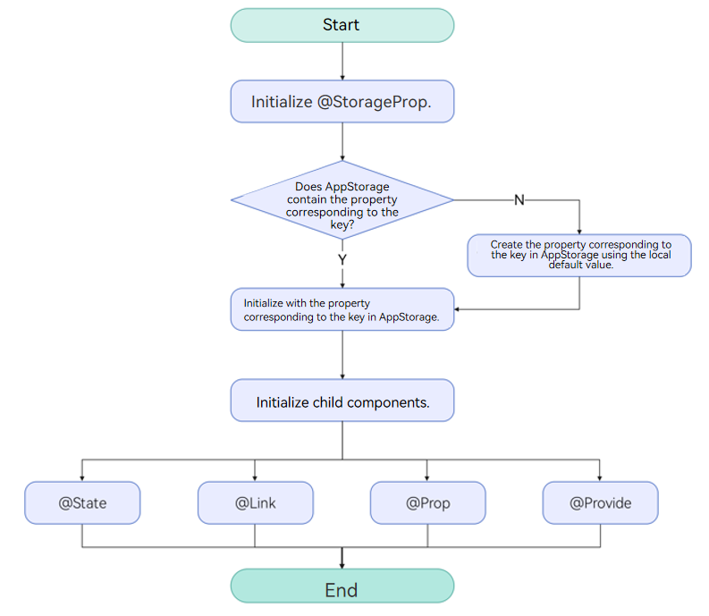
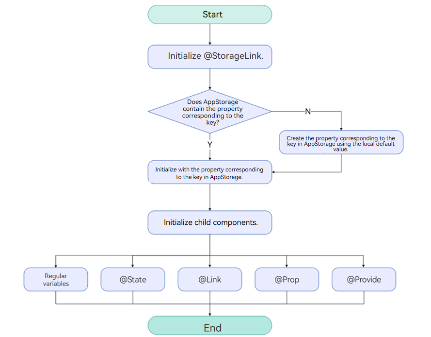
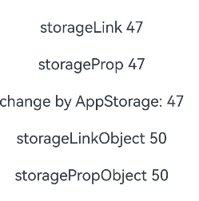
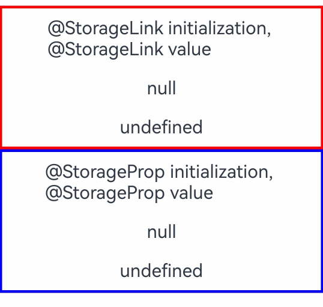
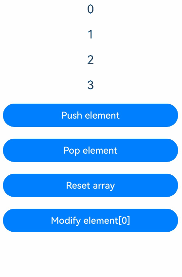
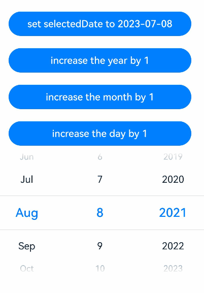
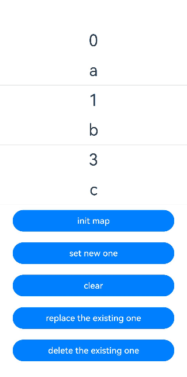
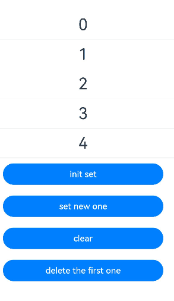
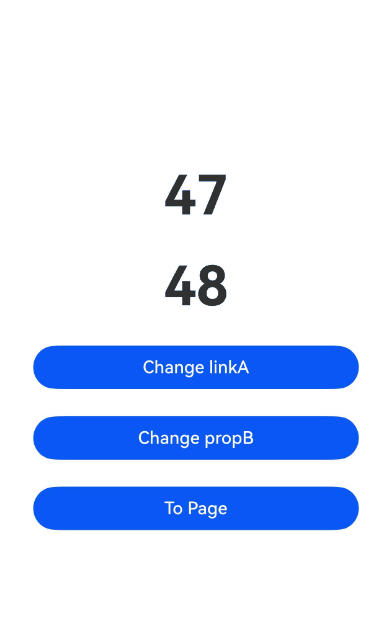

# AppStorage: Storing Application-wide UI State

<!--Kit: ArkUI-->
<!--Subsystem: ArkUI-->
<!--Owner: @jiyujia926-->
<!--Designer: @zhangboren-->
<!--Tester: @TerryTsao-->
<!--Adviser: @zhang_yixin13-->
<!-- md-trans-meta sourceCommit=3efb4ba336409dd0731ba011e1e227786db57fa2 translatedAt=2026-07-22T02:01:56.474Z pushedAt=2026-07-22T03:22:00.948Z -->

Before reading this document, it is recommended that you review the [State Management Overview](./arkts-state-management-overview.md) to understand the role of AppStorage within the state management framework.

AppStorage is a global UI state storage center bound to the application process. Created by the UI framework at application launch, it stores UI state data in runtime memory to enable application-level global state sharing.

Serving as the application's "central hub," AppStorage acts as the intermediary bridge between persistent data ([PersistentStorage](arkts-persiststorage.md)), environment variables ([Environment](arkts-environment.md)), and UI interactions. Its primary value lies in providing you with cross-ability UI state sharing capabilities.

AppStorage provides APIs for manual create, retrieve, update, delete (CRUD) operations outside custom components. For details, see [AppStorage API Reference](../../reference/apis-arkui/arkui-ts/ts-state-management.md#appstorage). For best practices, see [State Management](https://developer.huawei.com/consumer/en/doc/best-practices/bpta-status-management).

> **NOTE**
>
> For details about UI decoupling, status management, and status sharing and synchronization between multiple components, see [StateStore-based Global State Management](https://developer.huawei.com/consumer/en/doc/best-practices/bpta-global-state-management-state-store).
>
> For data processing that does not involve UI component synchronization, see [Persisting User Preferences (ArkTS)](https://developer.huawei.com/consumer/en/doc/harmonyos-guides/data-persistence-by-preferences)

## Overview

AppStorage is a singleton created at application startup, serving as the central repository for application-wide UI state data. This state data is accessible at the application level. AppStorage maintains all properties throughout the application lifecycle.

Properties are accessed through unique string keys. They can be synchronized with UI components and accessed within the application's service logic. AppStorage enables UI state sharing among multiple [UIAbility](../../reference/apis-ability-kit/js-apis-app-ability-uiAbility.md) instances within the application's [main thread](../../application-models/thread-model-stage.md).

Properties in AppStorage support two-way synchronization and offer extended features, such as data persistence (see [PersistentStorage](arkts-persiststorage.md)). These UI states are implemented through service logic and decoupled from the UI. To use these UI states in the UI, the [@StorageProp](#storageprop) and [@StorageLink](#storagelink) decorators are required.

## \@StorageProp

[@StorageProp](../../reference/apis-arkui/arkui-ts/ts-state-management-storageprop.md#storageprop) establishes unidirectional data synchronization with the corresponding attribute in AppStorage.

> **NOTE**
>
> This decorator can be used in atomic services since API version 11.

### Usage Rules

| \@StorageProp Decorator| Description                                                        |
| ----------------------- | ------------------------------------------------------------ |
| Parameters             | Constant string, which is mandatory. The string must be enclosed in quotation marks.<br>**NOTE**<br>Using **null** and **undefined** as keys will implicitly convert them to their corresponding string representations. This usage is not recommended.               |
| Allowed Decorated Variable Types      | Object, class, string, number, boolean, enum types, and arrays of these types.<br/>API version 12 and later supports [Map](#decorating-variables-of-the-map-type), [Set](#decorating-variables-of-the-set-type), [Date](#decorating-variables-of-the-date-type), undefined, and null types, as well as union types of these types. For examples, see [Using Union Types in AppStorage](#using-union-types-in-appstorage).<br/>For nested type scenarios, see [Observed Changes and Behavior](#observed-changes-and-behavior). <br/>**NOTE**<br/>The variable type must be specified. It is recommended to use the same type as the corresponding attribute in AppStorage. Otherwise, implicit type conversion may occur, causing abnormal app behavior.|
| Disallowed variable types               | Function.|
| Synchronization type               | One-way: from the property in AppStorage to the component variable.<br>The component variable can be changed locally, but an update from AppStorage will overwrite local changes.|
| Initial value for the decorated variable     | Local initialization is mandatory. If the property does not exist in AppStorage, the initial value is used to initialize the property and store it into AppStorage.|

### Variable Transfer/Access Rules

| Transfer/Access     | Description                                      |
| ---------- | ---------------------------------------- |
| Initialization and update from the parent component| Prohibited. Only initialization using the property corresponding to the key in AppStorage is supported. If the corresponding key does not exist, initialization uses the local default value.|
| Child component initialization    | Supported. Can be used to initialize variables decorated with [\@State](./arkts-state.md), [\@Link](./arkts-link.md), [\@Prop](./arkts-prop.md), or [\@Provide](./arkts-provide-and-consume.md).|
| Access from outside the component | Not supported.                                      |

  **Figure 1** \@StorageProp initialization rule 



### Observed Changes and Behavior

**Observed Changes**

- When the decorated variable is of the Boolean, string, or number type, its value change can be observed.

- When the decorated data type is class or Object, the overall object assignment and property changes can be observed (for details, see [Using AppStorage from Inside the UI](#using-appstorage-from-inside-the-ui)).

- When the decorated object is an array, you can observe the changes of adding, deleting, and updating array units.

- When the decorated object is of the Date type, the following changes can be observed: (1) complete **Date** object reassignment; (2) property changes caused by calling **setFullYear**, **setMonth**, **setDate**, **setHours**, **setMinutes**, **setSeconds**, **setMilliseconds**, **setTime**, **setUTCFullYear**, **setUTCMonth**, **setUTCDate**, **setUTCHours**, **setUTCMinutes**, **setUTCSeconds**, or **setUTCMilliseconds**. For details, see [Decorating Variables of the Date Type](#decorating-variables-of-the-date-type).

- When the decorated object is of the **Map** type, the following changes can be observed: (1) complete **Map** object reassignment; (2) changes caused by calling **set**, **clear**, or **delete**. For details, see [Decorating Variables of the Map Type](#decorating-variables-of-the-map-type).

- When the decorated object is of the **Set** type, the following changes can be observed: (1) complete **Set** object reassignment; (2) changes caused by calling **add**, **clear**, or **delete**. For details, see [Decorating Variables of the Set Type](#decorating-variables-of-the-set-type).

**Framework Behavior**

1. When a variable decorated with \@StorageProp(key) is modified, the change will not be written back to the corresponding property in AppStorage. The change will trigger a re-render of the custom component and only applies to the private member variable of the current component. Other data bound to the same key will not be synchronized.

2. When the property corresponding to the given key in AppStorage changes, all variables decorated with \@StorageProp(key) will be synchronized and updated, and any local changes will be overwritten.

## \@StorageLink

[@StorageLink](../../reference/apis-arkui/arkui-ts/ts-state-management-storagelink.md#storagelink) establishes bidirectional data synchronization with the corresponding attribute in AppStorage.

> **NOTE**
>
> This decorator can be used in atomic services since API version 11.

### Usage Rules

| \@StorageLink Decorator| Description                                                        |
| ----------------------- | ------------------------------------------------------------ |
| Parameters             | key: constant string, which is mandatory. The string must be enclosed in quotation marks.<br>**NOTE**<br>Using **null** and **undefined** as keys will implicitly convert them to their corresponding string representations. This usage is not recommended.                 |
| Allowed variable types     | Object, class, string, number, Boolean, enum, and array of these types.<br>API version 12 and later: Map, Set, Date, undefined, null, and union types of these types. For details, see [Using Union Types in AppStorage](#using-union-types-in-appstorage).<br>For details about the scenarios of nested objects, see [Observed Changes and Behavior](#observed-changes-and-behavior-1).<br>**NOTE**<br>The variable type must be specified. Whenever possible, use the same type as that of the corresponding property in AppStorage. Otherwise, implicit type conversion occurs, causing application behavior exceptions.|
| Disallowed variable types               | Function.|
| Synchronization type               | Two-way: from the property in AppStorage to the custom component variable and vice versa|
| Initial value for the decorated variable     | Local initialization is mandatory. If the property does not exist in AppStorage, the initial value is used to initialize the property and store it into AppStorage.|

### Variable Transfer/Access Rules

| Transfer/Access     | Description                                      |
| ---------- | ---------------------------------------- |
| Initialization and update from the parent component| Forbidden.                                     |
| Child component initialization    | Supported. The decorated variable can be used to initialize a regular variable or an \@State, \@Link, \@Prop, or \@Provide decorated variable in the child component.|
| Whether external access is supported | Not supported.                                      |

  **Figure 2** \@StorageLink initialization rule 



### Observed Changes and Behavior

**Observed Changes**

- When the decorated variable is of the Boolean, string, or number type, its value change can be observed.

- When the decorated data type is class or Object, the overall object assignment and property changes can be observed. (For details, see [Using AppStorage from Inside the UI](#using-appstorage-from-inside-the-ui).)

- When the decorated object is an array, the changes of adding, deleting, and updating array units can be observed. For details, see [Decorating Variables of the Array Type](#decorating-variables-of-the-array-type).

- When the decorated object is of the **Date** type, the following changes can be observed: (1) complete **Date** object reassignment; (2) property changes caused by calling **setFullYear**, **setMonth**, **setDate**, **setHours**, **setMinutes**, **setSeconds**, **setMilliseconds**, **setTime**, **setUTCFullYear**, **setUTCMonth**, **setUTCDate**, **setUTCHours**, **setUTCMinutes**, **setUTCSeconds**, or **setUTCMilliseconds**. For details, see [Decorating Variables of the Date Type](#decorating-variables-of-the-date-type).

- When the decorated object is of the **Map** type, the following changes can be observed: (1) complete **Map** object reassignment; (2) changes caused by calling **set**, **clear**, or **delete**. For details, see [Decorating Variables of the Map Type](#decorating-variables-of-the-map-type).

- When the decorated object is of the **Set** type, the following changes can be observed: (1) complete **Set** object reassignment; (2) changes caused by calling **add**, **clear**, or **delete**. For details, see [Decorating Variables of the Set Type](#decorating-variables-of-the-set-type).

**Framework Behavior**

1. Changes to variables decorated with \@StorageLink(key) are automatically written back to the corresponding property in AppStorage.

2. When the value of a key in AppStorage changes, all data bound to that key (including both two-way binding with \@StorageLink and one-way binding with \@StorageProp) will be synchronized.

3. The data decorated by @StorageLink(key) is a state variable. Its changes are not only synchronized to AppStorage but also trigger re-rendering of the custom component.

## Constraints

1. The parameter of \@StorageProp and \@StorageLink must be of the string type. Otherwise, an error is reported during compilation.

   ```ts
   AppStorage.setOrCreate('propA', 47);

   // Incorrect usage, which causes a compilation error.
   @StorageProp() storageProp: number = 1;
   @StorageLink() storageLink: number = 2;

   // Correct usage.
   @StorageProp('propA') storageProp: number = 1;
   @StorageLink('propA') storageLink: number = 2;
    ```

2. @StorageProp and @StorageLink do not support decorating variables of the Function type. Before API version 23, the app will encounter an error at runtime.

   Since API version 23, relevant validation has been added during app compilation. Decorating a Function-type variable with @StorageProp or @StorageLink will prompt an ERROR. The @StorageProp or @StorageLink decorator should be removed from Function-type variables in the code.

3. When using AppStorage together with [PersistentStorage](arkts-persiststorage.md) and [Environment](arkts-environment.md), pay attention to the following:

   (1) After a property is created in AppStorage, calling PersistentStorage.[persistProp](../../reference/apis-arkui/arkui-ts/ts-state-management.md#persistprop10) will use the existing value in AppStorage and overwrite the property with the same name in PersistentStorage. Therefore, the reverse calling order is recommended. For a counterexample, see [Accessing a Property in AppStorage Before PersistentStorage](arkts-persiststorage.md#accessing-a-property-in-appstorage-before-persistentstorage).

   (2) If a property has already been created in AppStorage, calling **Environment.**[envProp](../../reference/apis-arkui/arkui-ts/ts-state-management.md#envprop10) to create a property with the same name will fail. Because AppStorage already has a property with the same name, the environment variable will not be written to AppStorage. Therefore, it is recommended not to use preset environment variable names in AppStorage.

   ```ts
   AppStorage.setOrCreate('languageCode', 'en');
   // The result is false.
   let result = Environment.envProp('languageCode','en'); 
   ```

4. Changes to variables decorated with state decorators will trigger UI re-rendering. If a variable is modified only for message passing (not for UI updates), using the [emitter](../../reference/apis-basic-services-kit/js-apis-emitter.md) is recommended. For the example, see [Avoiding @StorageLink for Event Notification](#avoiding-storagelink-for-event-notification).

5. AppStorage is shared within the same process. Since the UIAbility and <!--Del-->[<!--DelEnd-->UIExtensionAbility<!--Del-->](../../application-models/uiextensionability-sys.md)<!--DelEnd--> run in separate processes, the UIExtensionAbility does not share the AppStorage of the main process.

## When to Use

### Using AppStorage and LocalStorage in Application Logic

AppStorage is implemented as a singleton, with all its APIs exposed as static methods. How these APIs work resembles the non-static APIs of [LocalStorage](./arkts-localstorage.md).

```ts
AppStorage.setOrCreate('propA', 47);

let storage: LocalStorage = new LocalStorage();
storage.setOrCreate('propA',17);
let propA: number | undefined = AppStorage.get('propA'); // propA in AppStorage == 47, propA in LocalStorage == 17
let link1: SubscribedAbstractProperty<number> = AppStorage.link('propA'); // link1.get() == 47
let link2: SubscribedAbstractProperty<number> = AppStorage.link('propA'); // link2.get() == 47
let prop: SubscribedAbstractProperty<number> = AppStorage.prop('propA'); // prop.get() == 47

link1.set(48); // Two-way synchronization: link1.get() == link2.get() == prop.get() == 48
prop.set(1); // One-way synchronization: prop.get() == 1; but link1.get() == link2.get() == 48
link1.set(49); // Two-way synchronization: link1.get() == link2.get() == prop.get() == 49

storage.get<number>('propA') // == 17
storage.set('propA', 101);
storage.get<number>('propA') // == 101

AppStorage.get<number>('propA') // == 49
link1.get() // == 49
link2.get() // == 49
prop.get() // == 49
```

### Using AppStorage from Inside the UI

@StorageLink is used in conjunction with AppStorage to establish two-way data synchronization through properties in AppStorage.

@StorageProp works in conjunction with AppStorage to establish one-way data synchronization using properties stored in AppStorage.

<!-- @[appstorage_page_two](https://gitcode.com/openharmony/applications_app_samples/blob/master/code/DocsSample/ArkUISample/AppStorage/entry/src/main/ets/pages/PageTwo.ets) --> 

``` TypeScript
import { hilog } from '@kit.PerformanceAnalysisKit';

const DOMAIN = 0x0001;
const TAG: string = '[SampleAppStorage]';

class Data {
  public code: number;

  constructor(code: number) {
    this.code = code;
  }
}

AppStorage.setOrCreate('propA', 47);
AppStorage.setOrCreate('propB', new Data(50));
let storage = new LocalStorage();
storage.setOrCreate('linkA', 48);
storage.setOrCreate('linkB', new Data(100));

@Entry(storage)
@Component
struct TestStorageProp {
  @StorageLink('propA') storageLink: number = 1;
  @StorageProp('propA') storageProp: number = 1;
  @StorageLink('propB') storageLinkObject: Data = new Data(1);
  @StorageProp('propB') storagePropObject: Data = new Data(1);

  build() {
    Column({ space: 20 }) {
      // StorageLink establishes a two-way synchronization with AppStorage; local changes will be synchronized back to the value of key 'propA' in AppStorage.
      Text(`storageLink ${this.storageLink}`)
        .fontSize(20)
        .margin(10)
        .onClick(() => {
          this.storageLink += 1;
        })

      // @StorageProp establishes a one-way synchronization with AppStorage; local changes will not be synchronized back to the value of key 'propA' in AppStorage.
      // However, the value can be updated via AppStorage's set/setOrCreate.
      Text(`storageProp ${this.storageProp}`)
        .fontSize(20)
        .margin(10)
        .onClick(() => {
          this.storageProp += 1;
        })

      // Although AppStorage APIs can obtain values, they do not have the capability to refresh the UI (the value change can be seen in logs).
      // A connection with the custom component can only be established to refresh the UI by relying on @StorageLink/@StorageProp.
      Text(`change by AppStorage: ${AppStorage.get<number>('propA')}`)
        .fontSize(20)
        .margin(10)
        .onClick(() => {
          hilog.info(DOMAIN, TAG, `Appstorage.get: ${AppStorage.get<number>('propA')}`);
          AppStorage.set<number>('propA', 100);
        })

      Text(`storageLinkObject ${this.storageLinkObject.code}`)
        .fontSize(20)
        .margin(10)
        .onClick(() => {
          this.storageLinkObject.code += 1;
        })

      Text(`storagePropObject ${this.storagePropObject.code}`)
        .fontSize(20)
        .margin(10)
        .onClick(() => {
          this.storagePropObject.code += 1;
        })
    }
    .width('100%')
  }
}
```



### Using Union Types in AppStorage

In the following example, the type of variable linkA is number | null, and the type of variable linkB is number | undefined. The [Text](../arkts-common-components-text-display.md) component initially displays **null** and **undefined** respectively. After a tap, they switch to numbers, and after another tap, they switch back to **null** and **undefined**.

<!-- @[appstorage_page_three](https://gitcode.com/openharmony/applications_app_samples/blob/master/code/DocsSample/ArkUISample/AppStorage/entry/src/main/ets/pages/PageThree.ets) -->  

``` TypeScript
@Component
struct StorageLinkComponent {
  @StorageLink('linkA') linkA: number | null = null;
  @StorageLink('linkB') linkB: number | undefined = undefined;

  build() {
    Column() {
      Text('@StorageLink initialization, @StorageLink value')
        .fontSize(20)
        .margin(10)
      // When linkA is null, tapping switches it to 1; when linkA is 1, tapping switches it to null.
      Text(`${this.linkA}`)
        .fontSize(20)
        .margin(10)
        .onClick(() => {
          this.linkA ? this.linkA = null : this.linkA = 1;
        })
      Text(`${this.linkB}`)
        .fontSize(20)
        .margin(10)
        .onClick(() => {
          this.linkB ? this.linkB = undefined : this.linkB = 1;
        })
    }
    .borderWidth(3).borderColor(Color.Red)
    .width('100%')
  }
}

@Component
struct StoragePropComponent {
  @StorageProp('propA') propA: number | null = null;
  @StorageProp('propB') propB: number | undefined = undefined;

  build() {
    Column() {
      Text('@StorageProp initialization, @StorageProp value')
        .fontSize(20)
        .margin(10)
      Text(`${this.propA}`)
        .fontSize(20)
        .margin(10)
        .onClick(() => {
          this.propA ? this.propA = null : this.propA = 1;
        })
      Text(`${this.propB}`)
        .fontSize(20)
        .margin(10)
        .onClick(() => {
          this.propB ? this.propB = undefined : this.propB = 1;
        })
    }
    .borderWidth(3).borderColor(Color.Blue)
    .width('100%')
  }
}

@Entry
@Component
struct TestPageStorageLink {
  build() {
    Row() {
      Column() {
        StorageLinkComponent()
        StoragePropComponent()
      }
      .width('100%')
    }
    .height('100%')
  }
}
```



### Decorating Variables of the Array Type

In the following example, the type of message decorated by @StorageLink is `number[]`. After the button is clicked, the value of message changes, and the view refreshes accordingly.

<!-- @[appstorage_page_one](https://gitcode.com/openharmony/applications_app_samples/blob/master/code/DocsSample/ArkUISample/AppStorage/entry/src/main/ets/pages/PageOne.ets) --> 

``` TypeScript
@Entry
@Component
struct ArraySample {
  @StorageLink('array') message: number[] = [0, 1, 2, 3];

  build() {
    Column() {
      ForEach(this.message, (item: number) => {
        Text(`${item}`)
          .fontSize(20)
          .margin(10)
      })
      // Push an array element to trigger a UI refresh.
      Button('Push element')
        .width(300)
        .margin(10)
        .onClick(() => {
          this.message.push(4);
        })
      // Pop an array element to trigger a UI refresh.
      Button('Pop element')
        .width(300)
        .margin(10)
        .onClick(() => {
          this.message.pop();
        })
      // Reassign the entire array to trigger a UI refresh.
      Button('Reset array')
        .width(300)
        .margin(10)
        .onClick(() => {
          this.message = [9, 8, 7, 6];
        })
      // Modify element[0] to trigger a UI refresh.
      Button('Modify element[0]')
        .width(300)
        .margin(10)
        .onClick(() => {
          this.message[0] = 10;
        })
    }
    .width('100%')
  }
}
```



### Decorating Variables of the Date Type

> **NOTE**
>
> AppStorage supports the Date type since API version 12.

In the following example, the type of selectedDate decorated by @StorageLink is **Date**. After the button is clicked, the value of **selectedDate** changes, and the UI is re-rendered.

<!-- @[appstorage_page_four](https://gitcode.com/openharmony/applications_app_samples/blob/master/code/DocsSample/ArkUISample/AppStorage/entry/src/main/ets/pages/PageFour.ets) -->  

``` TypeScript
@Entry
@Component
struct DateSample {
  @StorageLink('date') selectedDate: Date = new Date('2021-08-08');

  build() {
    Column() {
      Button('set selectedDate to 2023-07-08')
        .width(300)
        .margin(10)
        .onClick(() => {
          AppStorage.setOrCreate('date', new Date('2023-07-08'));
        })
      // Tap the button to update the year data in selectedDate and trigger a view refresh.
      Button('increase the year by 1')
        .width(300)
        .margin(10)
        .onClick(() => {
          this.selectedDate.setFullYear(this.selectedDate.getFullYear() + 1);
        })
      Button('increase the month by 1')
        .width(300)
        .margin(10)
        .onClick(() => {
          this.selectedDate.setMonth(this.selectedDate.getMonth() + 1);
        })
      Button('increase the day by 1')
        .width(300)
        .margin(10)
        .onClick(() => {
          this.selectedDate.setDate(this.selectedDate.getDate() + 1);
        })
      DatePicker({
        start: new Date('1970-1-1'),
        end: new Date('2100-1-1'),
        selected: $$this.selectedDate
      })
    }.width('100%')
  }
}
```



### Decorating Variables of the Map Type

> **NOTE**
>
> AppStorage supports the Map type since API version 12.

In this example, the **message** variable decorated with @StorageLink is of the Map\<number, string\> type. After the button is clicked, the value of **message** changes, and the UI is re-rendered.

<!-- @[appstorage_page_five](https://gitcode.com/openharmony/applications_app_samples/blob/master/code/DocsSample/ArkUISample/AppStorage/entry/src/main/ets/pages/PageFive.ets) -->  

``` TypeScript
@Entry
@Component
struct MapSample {
  @StorageLink('map') message: Map<number, string> = new Map([[0, 'a'], [1, 'b'], [3, 'c']]);

  build() {
    Row() {
      Column() {
        ForEach(Array.from(this.message.entries()), (item: [number, string]) => {
          Text(`${item[0]}`)
            .fontSize(30)
            .margin(10)
          Text(`${item[1]}`)
            .fontSize(30)
            .margin(10)
          Divider()
        })
        // Tap the button to initialize the message.
        Button('init map')
          .width(300)
          .margin(10)
          .onClick(() => {
            this.message = new Map([[0, 'a'], [1, 'b'], [3, 'c']]);
          })
        Button('set new one')
          .width(300)
          .margin(10)
          .onClick(() => {
            this.message.set(4, 'd');
          })
        Button('clear')
          .width(300)
          .margin(10)
          .onClick(() => {
            this.message.clear();
          })
        Button('replace the existing one')
          .width(300)
          .margin(10)
          .onClick(() => {
            this.message.set(0, 'aa');
          })
        Button('delete the existing one')
          .width(300)
          .margin(10)
          .onClick(() => {
            AppStorage.get<Map<number, string>>('map')?.delete(0);
          })
      }
      .width('100%')
    }
    .height('100%')
  }
}
```



### Decorating Variables of the Set Type

> **NOTE**
>
> AppStorage supports the Set type since API version 12.

In this example, the **memberSet** variable decorated with @StorageLink is of the Set\<number\> type. After the button is clicked, the value of **memberSet** changes, and the UI is re-rendered.

<!-- @[appstorage_page_six](https://gitcode.com/openharmony/applications_app_samples/blob/master/code/DocsSample/ArkUISample/AppStorage/entry/src/main/ets/pages/PageSix.ets) -->  

``` TypeScript
@Entry
@Component
struct SetSample {
  @StorageLink('set') memberSet: Set<number> = new Set([0, 1, 2, 3, 4]);

  build() {
    Row() {
      Column() {
        ForEach(Array.from(this.memberSet.entries()), (item: [number, number]) => {
          Text(`${item[0]}`)
            .fontSize(30)
            .margin(10)
          Divider()
        })
        // Tap the button to initialize memberSet.
        Button('init set')
          .width(300)
          .margin(10)
          .onClick(() => {
            this.memberSet = new Set([0, 1, 2, 3, 4]);
          })
        Button('set new one')
          .width(300)
          .margin(10)
          .onClick(() => {
            AppStorage.get<Set<number>>('set')?.add(5);
          })
        Button('clear')
          .width(300)
          .margin(10)
          .onClick(() => {
            this.memberSet.clear();
          })
        Button('delete the first one')
          .width(300)
          .margin(10)
          .onClick(() => {
            this.memberSet.delete(0);
          })
      }
      .width('100%')
    }
    .height('100%')
  }
}
```



### Sharing the AppStorage Across Multiple Pages

In the following example, the Index and Page pages share the linkA data through the same global AppStorage object. If the value of the linkA is modified in one page, the updated value can be obtained in the other page.

<!-- @[appstorage_Index](https://gitcode.com/openharmony/applications_app_samples/blob/master/code/DocsSample/ArkUISample/AppStorage/entry/src/main/ets/pages/Index.ets) -->  

``` TypeScript
AppStorage.setOrCreate('linkA', 47)
AppStorage.setOrCreate('propB', 48)

@Entry
@Component
struct Index {
  @StorageLink('linkA') linkA: number = 1; // Bidirectional data synchronization with AppStorage
  @StorageProp('propB') propB: number = 1; // Unidirectional data synchronization with AppStorage
  pageStack: NavPathStack = new NavPathStack();

  build() {
    Navigation(this.pageStack) {
      Row() {
        Column({ space: 5 }) {
          Text(`${this.linkA}`)
            .fontSize(50)
            .fontWeight(FontWeight.Bold)
            .margin(10)
          Text(`${this.propB}`)
            .fontSize(50)
            .fontWeight(FontWeight.Bold)
            .margin(10)
          Button('Change linkA')
            .width(300)
            .margin(10)
            .onClick(() => {
              // Refresh the UI. The modification will be synchronized back to AppStorage.
              this.linkA++;
            })
          Button('Change propB')
            .width(300)
            .margin(10)
            .onClick(() => {
              // Refresh the UI. The modification will not be synchronized back to AppStorage.
              this.propB++;
            })
          Button('To Page')
            .width(300)
            .margin(10)
            .onClick(() => {
              this.pageStack.pushPathByName('Page', null);
            })
        }
        .width('100%')
      }
      .height('100%')
    }
  }
}
```

<!-- @[appstorage_Page](https://gitcode.com/openharmony/applications_app_samples/blob/master/code/DocsSample/ArkUISample/AppStorage/entry/src/main/ets/pages/Page.ets) -->  

``` TypeScript
@Builder
export function PageBuilder() {
  Page()
}

// Share an AppStorage object globally.
@Component
struct Page {
  @StorageLink('linkA') linkA: number = 2; // Bidirectional data synchronization with AppStorage
  @StorageProp('propB') propB: number = 2; // Unidirectional data synchronization with AppStorage
  pageStack: NavPathStack = new NavPathStack();

  build() {
    NavDestination() {
      Row() {
        Column({ space: 5 }) {
          Text(`${this.linkA}`)
            .fontSize(50)
            .fontWeight(FontWeight.Bold)
            .margin(10)
          Text(`${this.propB}`)
            .fontSize(50)
            .fontWeight(FontWeight.Bold)
            .margin(10)
          Button('Change linkA')
            .width(300)
            .margin(10)
            .onClick(() => {
              // Refresh the UI. The modification will be synchronized back to AppStorage.
              this.linkA++;
            })
          Button('Change propB')
            .width(300)
            .margin(10)
            .onClick(() => {
              // Refresh the UI. The modification will not be synchronized back to AppStorage.
              this.propB++;
            })
          Button('Back Index')
            .width(300)
            .margin(10)
            .onClick(() => {
              this.pageStack.pop();
            })
        }
        .width('100%')
      }
    }
    .onReady((context: NavDestinationContext) => {
      this.pageStack = context.pathStack;
    })
  }
}
```

When using Navigation, you need to manually add the system route table file src/main/resources/base/profile/router_map.json and add "routerMap": "$profile:router_map" to module.json5.

```json
{
  "routerMap": [
    {
      "name": "Page",
      "pageSourceFile": "src/main/ets/pages/Page.ets",
      "buildFunction": "PageBuilder",
      "data": {
        "description": "AppStorage example"
      }
    }
  ]
}
```



## AppStorage Usage Recommendations

### Avoiding @StorageLink for Event Notification

For performance considerations, using the two-way synchronization mechanism between @StorageLink and AppStorage for event notification is not recommended: (1) Variables in AppStorage may be bound to components across multiple pages, while event notifications typically do not need to be broadcast to all these components. (2) When @StorageLink decorated variables are used in UI, changes trigger component re-renders, causing performance overhead even when no visual updates are required.

In the sample code, the tap event in `TapImage` triggers a change of the property corresponding to `tapIndex` in `AppStorage`. Since `@StorageLink` is bidirectionally synchronized, the modification is synchronized back to `AppStorage`, so all custom components bound to `tapIndex` in `AppStorage` can perceive the change of `tapIndex`. After the change of `tapIndex` is detected using [`@Watch`](./arkts-watch.md), the state variable `tapColor` is modified, thereby triggering a UI refresh. (Here, `tapIndex` is not directly bound to the UI, so the change of `tapIndex` does not directly trigger a UI refresh.)

When using this mechanism to implement event notification, ensure that the variables in AppStorage are not directly bound to the UI, and control the complexity of the @Watch function. If the @Watch function takes too long to execute, it will affect the UI refresh efficiency.

<!-- @[appstorage_page_seven](https://gitcode.com/openharmony/applications_app_samples/blob/master/code/DocsSample/ArkUISample/AppStorage/entry/src/main/ets/pages/ViewData.ets) -->   

``` TypeScript
import { hilog } from '@kit.PerformanceAnalysisKit';

const DOMAIN = 0x0001;
const TAG: string = '[SampleAppStorage]';

class ViewData {
  public title: string;
  public uri: Resource;
  public color: Color = Color.Black;

  constructor(title: string, uri: Resource) {
    this.title = title;
    this.uri = uri;
  }
}

@Entry
@Component
struct Gallery {
  // Replace $r('app.media.startIcon') with the actual resource file.
  dataList: Array<ViewData> =
    [new ViewData('flower', $r('app.media.startIcon')), new ViewData('OMG', $r('app.media.startIcon')),
      new ViewData('OMG', $r('app.media.startIcon'))];
  scroller: Scroller = new Scroller();

  build() {
    Column() {
      Grid(this.scroller) {
        ForEach(this.dataList, (item: ViewData, index?: number) => {
          GridItem() {
            TapImage({
              uri: item.uri,
              index: index
            })
          }.aspectRatio(1)

        }, (item: ViewData, index?: number) => {
          return JSON.stringify(item) + index;
        })
      }.columnsTemplate('1fr 1fr')
    }
    .width('100%')
  }
}

@Component
export struct TapImage {
  @StorageLink('tapIndex') @Watch('onTapIndexChange') tapIndex: number = -1;
  @State tapColor: Color = Color.Black;
  index: number = 0;
  uri: Resource = {
    id: 0,
    type: 0,
    moduleName: '',
    bundleName: ''
  };

  // Check whether the component is selected.
  onTapIndexChange() {
    if (this.tapIndex >= 0 && this.index === this.tapIndex) {
      hilog.info(DOMAIN, TAG, `tapindex: ${this.tapIndex}, index: ${this.index}, red`);
      this.tapColor = Color.Red;
    } else {
      hilog.info(DOMAIN, TAG, `tapindex: ${this.tapIndex}, index: ${this.index}, black`);
      this.tapColor = Color.Black;
    }
  }

  build() {
    Column() {
      Image(this.uri)
        .objectFit(ImageFit.Cover)
        .onClick(() => {
          this.tapIndex = this.index;
        })
        .border({ width: 5, style: BorderStyle.Dotted, color: this.tapColor })
    }

  }
}
```

Compared with using the bidirectional synchronization mechanism of @StorageLink to implement event notification, developers can use [emit](../../reference/apis-basic-services-kit/js-apis-emitter.md#emitteremit) to subscribe to an event and receive event callbacks, which reduces overhead and enhances code readability.

> **NOTE**
>
> The **emit** API is not available in DevEco Studio Previewer.

<!-- @[appstorage_page_eight](https://gitcode.com/openharmony/applications_app_samples/blob/master/code/DocsSample/ArkUISample/AppStorage/entry/src/main/ets/pages/PageEight.ets) --> 

``` TypeScript
import { emitter } from '@kit.BasicServicesKit';
import { hilog } from '@kit.PerformanceAnalysisKit';

const DOMAIN = 0x0001;
const TAG: string = '[SampleAppStorage]';

let nextId: number = 0;

class ViewData {
  public title: string;
  public uri: Resource;
  public color: Color = Color.Black;
  public id: number;

  constructor(title: string, uri: Resource) {
    this.title = title;
    this.uri = uri;
    this.id = nextId++;
  }
}

@Entry
@Component
struct Gallery {
  // Replace $r('app.media.startIcon') with the actual resource file.
  dataList: Array<ViewData> =
    [new ViewData('flower', $r('app.media.startIcon')), new ViewData('OMG', $r('app.media.startIcon')),
      new ViewData('OMG', $r('app.media.startIcon'))];
  scroller: Scroller = new Scroller();
  private preIndex: number = -1;

  build() {
    Column() {
      Grid(this.scroller) {
        ForEach(this.dataList, (item: ViewData) => {
          GridItem() {
            TapImage({
              uri: item.uri,
              index: item.id
            })
          }.aspectRatio(1)
          .onClick(() => {
            if (this.preIndex === item.id) {
              return;
            }
            let innerEvent: emitter.InnerEvent = { eventId: item.id };
            // Selected: from black to red
            let eventData: emitter.EventData = {
              data: {
                'colorTag': 1
              }
            };
            emitter.emit(innerEvent, eventData);

            if (this.preIndex != -1) {
              hilog.info(DOMAIN, TAG, `preIndex: ${this.preIndex}, index: ${item.id}, black`);
              let innerEvent: emitter.InnerEvent = { eventId: this.preIndex };
              // Deselected: from red to black
              let eventData: emitter.EventData = {
                data: {
                  'colorTag': 0
                }
              };
              emitter.emit(innerEvent, eventData);
            }
            this.preIndex = item.id;
          })
        }, (item: ViewData) => JSON.stringify(item))
      }.columnsTemplate('1fr 1fr')
    }

  }
}

@Component
export struct TapImage {
  @State tapColor: Color = Color.Black;
  index: number = 0;
  uri: Resource = {
    id: 0,
    type: 0,
    moduleName: '',
    bundleName: ''
  };

  onTapIndexChange(colorTag: emitter.EventData) {
    if (colorTag.data != null) {
      this.tapColor = colorTag.data.colorTag ? Color.Red : Color.Black;
    }
  }

  aboutToAppear() {
    // Define the event ID.
    let innerEvent: emitter.InnerEvent = { eventId: this.index };
    emitter.on(innerEvent, data => {
      this.onTapIndexChange(data);
    });
  }

  aboutToDisappear(): void {
    let innerEvent: emitter.InnerEvent = { eventId: this.index };
    emitter.off(innerEvent.eventId);
  }

  build() {
    Column() {
      Image(this.uri)
        .objectFit(ImageFit.Cover)
        .border({ width: 5, style: BorderStyle.Dotted, color: this.tapColor })
    }
  }
}
```

The preceding notification logic is simple. It can be simplified into a ternary expression as follows:

<!-- @[appstorage_page_nine](https://gitcode.com/openharmony/applications_app_samples/blob/master/code/DocsSample/ArkUISample/AppStorage/entry/src/main/ets/pages/Gallery.ets) -->   

``` TypeScript

class ViewData {
  public title: string;
  public uri: Resource;
  public color: Color = Color.Black;

  constructor(title: string, uri: Resource) {
    this.title = title;
    this.uri = uri;
  }
}

@Entry
@Component
struct Gallery {
  // Replace $r('app.media.startIcon') with the actual resource file.
  dataList: Array<ViewData> =
    [new ViewData('flower', $r('app.media.startIcon')), new ViewData('OMG', $r('app.media.startIcon')),
      new ViewData('OMG', $r('app.media.startIcon'))];
  scroller: Scroller = new Scroller();

  build() {
    Column() {
      Grid(this.scroller) {
        ForEach(this.dataList, (item: ViewData, index?: number) => {
          GridItem() {
            TapImage({
              uri: item.uri,
              index: index
            })
          }.aspectRatio(1)

        }, (item: ViewData, index?: number) => {
          return JSON.stringify(item) + index;
        })
      }.columnsTemplate('1fr 1fr')
    }
    .width('100%')
  }
}

@Component
export struct TapImage {
  @StorageLink('tapIndex') tapIndex: number = -1;
  index: number = 0;
  uri: Resource = {
    id: 0,
    type: 0,
    moduleName: '',
    bundleName: ''
  };

  build() {
    Column() {
      Image(this.uri)
        .objectFit(ImageFit.Cover)
        .onClick(() => {
          this.tapIndex = this.index;
        })
        .border({
          width: 5,
          style: BorderStyle.Dotted,
          color: (this.tapIndex >= 0 && this.index === this.tapIndex) ? Color.Red : Color.Black
        })
    }
  }
}
```

### Notes on Update Rules When @StorageProp Is Used with AppStorage APIs

When updating a key's value using the **setOrCreate**/**set** API, if the value is the same, **setOrCreate** will not notify @StorageLink/@StorageProp to update. However, because @StorageProp itself has a data copy, changing the value will not synchronize it to AppStorage. This may lead you to mistakenly believe that the value has been changed through AppStorage, when in fact @StorageProp has not been notified to update the value. An example is shown below.

<!-- @[appstorage_page_ten](https://gitcode.com/openharmony/applications_app_samples/blob/master/code/DocsSample/ArkUISample/AppStorage/entry/src/main/ets/pages/PageTen.ets) --> 

``` TypeScript
import { hilog } from '@kit.PerformanceAnalysisKit';

const DOMAIN = 0x0001;
const TAG: string = '[SampleAppStorage]';
AppStorage.setOrCreate('propA', false);

@Entry
@Component
struct PageStorageProp {
  @StorageProp('propA') @Watch('onChange') propA: boolean = false;

  onChange() {
    hilog.info(DOMAIN, TAG, `propA change`);
  }

  aboutToAppear(): void {
    this.propA = true;
  }

  build() {
    Column() {
      Text(`${this.propA}`)
        .fontSize(20)
        .margin(10)
      Button('change')
        .width(300)
        .margin(10)
        .onClick(() => {
          AppStorage.setOrCreate('propA', false);
          // Output the current value of this.propA.
          hilog.info(DOMAIN, TAG, `propA: ${this.propA}`);
        })
    }
    .width('100%')
  }
}
```


In the preceding example, the value of **propA** has been changed to **true** locally before the click event, while the value stored in AppStorage remains **false**. When the click event attempts to update the value of **propA** to **false** through the **setOrCreate** API, no synchronization is triggered because the value in AppStorage is already **false** (matching the new value). As a result, the value of the @StorageProp decorated variable remains **true**.

To achieve synchronization, there are two approaches:

1. Change \@StorageProp to \@StorageLink.

2. Use **AppStorage.setOrCreate('propA', true)** to change the local value.