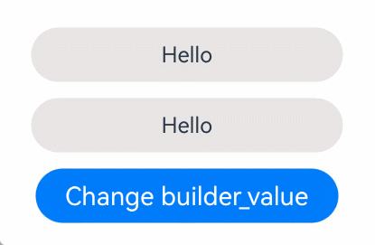
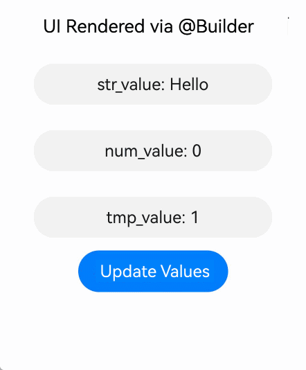
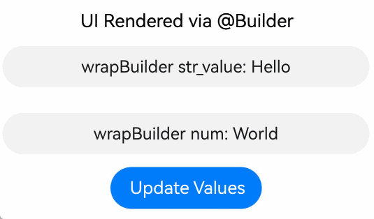

# \@Builder Decorator: Custom Builder Function
<!--Kit: ArkUI-->
<!--Subsystem: ArkUI-->
<!--Owner: @zhangboren-->
<!--Designer: @zhangboren-->
<!--Tester: @TerryTsao-->
<!--Adviser: @zhang_yixin13-->

ArkUI provides the \@Builder decorator that is a lightweight UI element reuse mechanism. This decorator has a fixed internal UI structure and passes the data only to the user. You can abstract reusable UI elements into functions and call the functions in the build function.

Functions decorated with \@Builder are also called custom builder functions.

Before reading this topic, you are advised to read [Basic Syntax Overview](./arkts-basic-syntax-overview.md), [Declarative UI Description](./arkts-declarative-ui-description.md), and [Creating a Custom Component](./arkts-create-custom-components.md).

The main differences between the @Builder decorator and the @Component decorator in terms of functions and usage are as follows:

1. The @Builder decorator is used to encapsulate reusable UI structures and improve development efficiency by extracting repeated layout code. This decorator strictly prohibits the definition of state variables or the use of lifecycle functions. Data interaction must be implemented through parameter transfer or access to the state variables of the component to which the decorator belongs.

2. In the ArkUI framework, the @Component decorator is the core mechanism for encapsulating complex UI components. It allows you to build reusable composite UIs by combining multiple basic components. This decorator not only supports the definition of internal state variables, but also manages the lifecycle of components.

> **NOTE**
>
> This decorator can be used in ArkTS widgets since API version 9.
>
> This decorator can be used in atomic services since API version 11.


## How to Use

The \@Builder decorator can be used in two ways: private custom builder function defined in a custom component (#Private Custom Builder Function) and global custom builder function defined globally (#Global Custom Builder Function).

### Private Custom Builder Function

Example:

```ts
@Entry
@Component
struct BuilderDemo {
  @Builder
  showTextBuilder() {
    // @Builder decorates this function so that it can configure and build the Text component in chain calling mode.
    Text('Hello World')
      .fontSize(30)
      .fontWeight(FontWeight.Bold)
  }

  @Builder
  showTextValueBuilder(param: string) {
    Text(param)
      .fontSize(30)
      .fontWeight(FontWeight.Bold)
  }

  build() {
    Column() {
      // Without parameter.
      this.showTextBuilder()
      // With a parameter.
      this.showTextValueBuilder('Hello @Builder')
    }
  }
}
```

Usage:

- One or more @Builder functions can be defined in a custom component. These functions are treated as private and special member functions of the owning component.

- Private custom builder functions can be called in custom components, **build()**, and other custom builder functions.

- In a custom component, this refers to the current component. The state variables of the component can be accessed in the custom build function. You are advised to use this to access the state variables of the component instead of passing the variables through parameters.

### Global Custom Builder Function

Example:

```ts
@Builder
function showTextBuilder() {
  Text('Hello World')
    .fontSize(30)
    .fontWeight(FontWeight.Bold)
}
@Entry
@Component
struct BuilderDemo {
  build() {
    Column() {
      showTextBuilder()
    }
  }
}
```

- If the component state variable does not change, you are advised to use the global custom build function.

- Global custom build functions can be called in the build function and other custom build functions.


## Parameter Passing Rules

For custom builder functions, parameters can be passed [by value](#by-value-parameter-passing) and [by reference](#by-reference-parameter-passing). Both of them must comply with the following rules:

- The parameter type of the function decorated by \@Builder cannot be undefined or null, and the expression that returns undefined or null is not allowed.

- All parameters must be immutable inside the \@Builder decorated function body.

- The custom builder function body follows the same [syntax rules](arkts-create-custom-components.md#build) as **build()**.

- The parameter is passed by reference only when one parameter is passed and the parameter is directly passed as an object literal. In other cases, the parameter is passed by value.

### By-Value Parameter Passing

By default, parameters in the \@Builder decorated functions are passed by value. In this case, when the passed parameter is a state variable, its change does not cause UI re-rendering in the \@Builder function. Therefore, for state variables, you are advised to use [by-reference parameter passing](#by-reference-parameter-passing) instead.

```ts
@Builder function overBuilder(paramA1: string) {
  Row() {
    Text(`UseStateVarByValue: ${paramA1} `)
  }
}
@Entry
@Component
struct Parent {
  @State label: string = 'Hello';
  build() {
    Column() {
      overBuilder(this.label)
    }
  }
}
```

### By-Reference Parameter Passing

In by-reference parameter passing, state variables can be passed, and the change of these state variables causes the UI re-rendering in the \@Builder function.

```ts
class Tmp {
  paramA1: string = '';
}

@Builder
function overBuilder(params: Tmp) {
  Row() {
    Text(`UseStateVarByReference: ${params.paramA1} `)
  }
}

@Entry
@Component
struct Parent {
  @State label: string = 'Hello';

  build() {
    Column() {
      // When the overBuilder component is called in the parent component,
      // pass this.label to the overBuilder component by reference.
      overBuilder({ paramA1: this.label })
      Button('Click me').onClick(() => {
        // After you click "Click me", the UI text changes from "Hello" to "ArkUI".
        this.label = 'ArkUI';
      })
    }
  }
}
```

## Constraints

1. If [MutableBinding](../../reference/apis-arkui/js-apis-StateManagement.md#mutablebindingt20) is not used in the function decorated by \@Builder, the parameter value cannot be modified. If the parameter value is modified, UI refresh is not triggered. If [by-reference parameter passing](#by-reference-parameter-passing) is used and only one parameter is passed, a runtime error is thrown when the internal attributes of the parameter are modified. MutableBinding helps you modify parameter values in a function decorated with \@Builder. For details, see [Changing the Input Parameters in the \@Builder Decorated Function](#changing-the-input-parameters-in-the-builder-decorated-function).

2. \@Builder triggers dynamic UI rendering only when it is passed by reference and only one parameter is passed. For details, see [By-Reference Parameter Passing](#by-reference-parameter-passing).

3. If two or more parameters are passed to \@Builder, dynamic UI rendering is not triggered. For details, see [Multiple Parameters in @Builder](#multiple-parameters-in-builder).

4. If the parameters passed to \@Builder contain both value-based and reference-based parameters, dynamic UI rendering is not triggered. For details, see [Multiple Parameters in @Builder](#multiple-parameters-in-builder)

5. \@Builder triggers dynamic UI rendering only when its parameters are passed in the form of object literals. For details, see [Multiple Parameters in @Builder](#multiple-parameters-in-builder).


## Use Scenarios

### Using Custom Builder Function in Custom Component

Create a private @Builder function and use this.builder() in Column. Update builder_value through the aboutToAppear lifecycle function and button click event to implement dynamic UI rendering.

```ts
@Entry
@Component
struct PrivateBuilder {
  @State builder_value: string = 'Hello';

  @Builder
  builder() {
    Column() {
      Text(this.builder_value)
        .width(230)
        .height(40)
        .backgroundColor('#ffeae5e5')
        .borderRadius(20)
        .margin(12)
        .textAlign(TextAlign.Center)
    }
  }

  aboutToAppear(): void {
    setTimeout(() => {
      this.builder_value = 'Hello World';
    }, 2000);
  }

  build() {
    Row() {
      Column() {
        Text(this.builder_value)
          .width(230)
          .height(40)
          .backgroundColor('#ffeae5e5')
          .borderRadius(20)
          .textAlign(TextAlign.Center)
        this.builder()
        Button('Change builder_value')
          .onClick(() => {
            this.builder_value = 'builder_value clicked';
          })
      }
      .height('100%')
      .width('100%')
    }
  }
}
```
Effect



### Global Custom Builder Function

Create a global @Builder function and call it in the column using overBuilder(). When passing parameters, you can use the object literal format. Regardless of whether the type is simple or complex, any change in the value will trigger the refresh of the UI.

```ts
class ChildTmp {
  val: number = 1;
}

class Tmp {
  str_value: string = 'Hello';
  num_value: number = 0;
  tmp_value: ChildTmp = new ChildTmp();
  arrayTmp_value: Array<ChildTmp> = [];
}

@Builder
function overBuilder(param: Tmp) {
  Column() {
    Text(`str_value: ${param.str_value}`)
      .width(230)
      .height(40)
      .margin(12)
      .backgroundColor('#0d000000')
      .fontColor('#e6000000')
      .borderRadius(20)
      .textAlign(TextAlign.Center)
    Text(`num_value: ${param.num_value}`)
      .width(230)
      .height(40)
      .margin(12)
      .backgroundColor('#0d000000')
      .fontColor('#e6000000')
      .borderRadius(20)
      .textAlign(TextAlign.Center)
    Text(`tmp_value: ${param.tmp_value.val}`)
      .width(230)
      .height(40)
      .margin(12)
      .backgroundColor('#0d000000')
      .fontColor('#e6000000')
      .borderRadius(20)
      .textAlign(TextAlign.Center)
    ForEach(param.arrayTmp_value, (item: ChildTmp) => {
      ListItem() {
        Text(`arrayTmp_value: ${item.val}`)
          .width(230)
          .height(40)
          .margin(12)
          .backgroundColor('#0d000000')
          .fontColor('#e6000000')
          .borderRadius(20)
          .textAlign(TextAlign.Center)
      }
    }, (item: ChildTmp) => JSON.stringify(item))
  }
}

@Entry
@Component
struct Parent {
  @State objParam: Tmp = new Tmp();

  build() {
    Column() {
      Text('UI Rendered via @Builder')
        .fontSize(20)
        .margin(12)
      overBuilder({
        str_value: this.objParam.str_value,
        num_value: this.objParam.num_value,
        tmp_value: this.objParam.tmp_value,
        arrayTmp_value: this.objParam.arrayTmp_value
      })
      Button('Update Values').onClick(() => {
        this.objParam.str_value = 'Hello World';
        this.objParam.num_value = 1;
        this.objParam.tmp_value.val = 8;
        const child_value: ChildTmp = {
          val: 2
        }
        this.objParam.arrayTmp_value.push(child_value);
      })
    }
    .height('100%')
    .width('100%')
  }
}
```
Effect



### Changing the Variables Decorated by the Decorator Triggers UI Re-rendering

In this scenario, @Builder defines the **Text** component layout but does not handle dynamic UI updates. UI re-rendering occurs when decorator-observed values change, not through @Builder's reactive capabilities.

```ts
class Tmp {
  str_value: string = 'Hello';
}

@Entry
@Component
struct Parent {
  @State objParam: Tmp = new Tmp();
  @State label: string = 'World';

  @Builder
  privateBuilder() {
    Column() {
      Text(`wrapBuilder str_value: ${this.objParam.str_value}`)
        .width(350)
        .height(40)
        .margin(12)
        .backgroundColor('#0d000000')
        .fontColor('#e6000000')
        .borderRadius(20)
        .textAlign(TextAlign.Center)
      Text(`wrapBuilder num: ${this.label}`)
        .width(350)
        .height(40)
        .margin(12)
        .backgroundColor('#0d000000')
        .fontColor('#e6000000')
        .borderRadius(20)
        .textAlign(TextAlign.Center)
    }
  }

  build() {
    Column() {
      Text('UI Rendered via @Builder')
        .fontSize(20)
      this.privateBuilder()
      Button('Update Values').onClick(() => {
        this.objParam.str_value = 'str_value Hello World';
        this.label = 'label Hello World';
      })
    }
    .height('100%')
    .width('100%')
  }
}
```
Effect



### Using a Function Decorated with @Builder as CustomBuilder

When the parameter type is CustomBuilder, you can pass the defined @Builder function. CustomBuilder is actually of the Function(() => any) or void type, and @Builder is also of the Function type. Therefore, you can pass @Builder to achieve a specific effect.
When a global @Builder function is passed as CustomBuilder, the this context needs to be bound. You can directly call the global @Builder function, and the compilation toolchain automatically generates the code for binding the this context.

```ts
@Builder
function overBuilder() {
  Row() {
    Text('Global Builder')
      .fontSize(30)
      .fontWeight(FontWeight.Bold)
  }
}

@Entry
@Component
struct customBuilderDemo {
  @State arr: number[] = [0, 1, 2, 3, 4];

  @Builder
  privateBuilder() {
    Row() {
      Text('Local Builder')
        .fontSize(30)
        .fontWeight(FontWeight.Bold)
    }
  }

  build() {
    Column() {
      List({ space: 10 }) {
        ForEach(this.arr, (item: number) => {
          ListItem() {
            Text(`${item}`)
              .width('100%')
              .height(100)
              .fontSize(16)
              .textAlign(TextAlign.Center)
              .borderRadius(10)
              .backgroundColor(0xFFFFFF)
          }
          .swipeAction({
            start: {
              builder: overBuilder() // The compiler toolchain automatically binds the this context.
            },
            end: {
              builder: () => {
                // When the local @Builder is called in the arrow function, the this context is automatically bound, without the need of the compilation toolchain.
                this.privateBuilder()
              }
            }
          })
        }, (item: number) => JSON.stringify(item))
      }
    }
  }
}
```


### Nested \@Builder Functions

Invoke a custom component or other \@Builder functions in the \@Builder function to implement nested \@Builder functions. To implement the dynamic UI update function of the innermost \@Builder, the \@Builder function must be invoked by reference at each layer. $$ is not a mandatory parameter. You can change it to another name.

```ts
class Tmp {
  paramA1: string = '';
}

@Builder
function parentBuilder($$: Tmp) {
  Row() {
    Column() {
      Text(`parentBuilder===${$$.paramA1}`)
        .width(300)
        .height(40)
        .margin(10)
        .backgroundColor('#0d000000')
        .fontColor('#e6000000')
        .borderRadius(20)
        .textAlign(TextAlign.Center)
      HelloComponent({ message: $$.paramA1 })
      childBuilder({ paramA1: $$.paramA1 })
    }
  }
}

@Component
struct HelloComponent {
  @Prop message: string = '';

  build() {
    Row() {
      Text(`HelloComponent===${this.message}`)
        .width(300)
        .height(40)
        .margin(10)
        .backgroundColor('#0d000000')
        .fontColor('#e6000000')
        .borderRadius(20)
        .textAlign(TextAlign.Center)
    }
  }
}

@Builder
function childBuilder($$: Tmp) {
  Row() {
    Column() {
      Text(`childBuilder===${$$.paramA1}`)
        .width(300)
        .height(40)
        .margin(10)
        .backgroundColor('#0d000000')
        .fontColor('#e6000000')
        .borderRadius(20)
        .textAlign(TextAlign.Center)
      HelloChildComponent({ message: $$.paramA1 })
      grandsonBuilder({ paramA1: $$.paramA1 })
    }
  }
}

@Component
struct HelloChildComponent {
  @Prop message: string = '';

  build() {
    Row() {
      Text(`HelloChildComponent===${this.message}`)
        .width(300)
        .height(40)
        .margin(10)
        .backgroundColor('#0d000000')
        .fontColor('#e6000000')
        .borderRadius(20)
        .textAlign(TextAlign.Center)
    }
  }
}

@Builder
function grandsonBuilder($$: Tmp) {
  Row() {
    Column() {
      Text(`grandsonBuilder===${$$.paramA1}`)
        .width(300)
        .height(40)
        .margin(10)
        .backgroundColor('#0d000000')
        .fontColor('#e6000000')
        .borderRadius(20)
        .textAlign(TextAlign.Center)
      HelloGrandsonComponent({ message: $$.paramA1 })
    }
  }
}

@Component
struct HelloGrandsonComponent {
  @Prop message: string;

  build() {
    Row() {
      Text(`HelloGrandsonComponent===${this.message}`)
        .width(300)
        .height(40)
        .margin(10)
        .backgroundColor('#0d000000')
        .fontColor('#e6000000')
        .borderRadius(20)
        .textAlign(TextAlign.Center)
    }
  }
}

@Entry
@Component
struct Parent {
  @State label: string = 'Hello';

  build() {
    Column() {
      parentBuilder({ paramA1: this.label })
      Button('Click me').onClick(() => {
        this.label = 'ArkUI';
      })
    }
    .height('100%')
    .width('100%')
  }
}
```
Effect


### \@Builder Function Combined with the V2 Decorator

The class object instance decorated by [@ObservedV2](./arkts-new-observedV2-and-trace.md) and [@Trace](./arkts-new-observedV2-and-trace.md) has the capability of deeply observing attribute changes. In a custom component decorated with @ComponentV2, when the global or local Builder is called and parameters are passed in value passing mode, modifying the object attribute decorated with @Trace can trigger UI refresh.
```ts
@ObservedV2
class Info {
  @Trace name: string;
  @Trace age: number;

  constructor(name: string, age: number) {
    this.name = name;
    this.age = age;
  }
}

@Builder
function overBuilder(param: Info) {
  Column() {
    Text(`Global @Builder name: ${param.name}`)
    Text(`Global @Builder age: ${param.age}`)
  }
  .width(230)
  .height(40)
  .margin(10)
  .padding({ left: 20 })
  .backgroundColor('#0d000000')
  .borderRadius(20)
}

@ComponentV2
struct ChildPage {
  @Require @Param childInfo: Info;

  build() {
    Column() {
      // The value passing mode must be used. If the reference passing mode is used, the ArkTS syntax will be intercepted.
      overBuilder(this.childInfo)
    }
  }
}

@Entry
@ComponentV2
struct ParentPage {
  info1: Info = new Info('Tom', 25);
  info2: Info = new Info('Tom', 25);

  @Builder
  privateBuilder() {
    Column() {
      Text(`Local @Builder name: ${this.info1.name}`)
      Text(`Local @Builder age: ${this.info1.age}`)
    }
    .width(230)
    .height(40)
    .margin(10)
    .backgroundColor('#0d000000')
    .borderRadius(20)
  }

  build() {
    Column() {
      Flex() {
        Column() {
          Text(`info1: ${this.info1.name}  ${this.info1.age}`) // Text1
          Text(`info2: ${this.info2.name}  ${this.info2.age}`) // Text2
        }
      }
      .width(230)
      .height(40)
      .margin(10)
      .padding({ left: 60 })
      .backgroundColor('#0d000000')
      .borderRadius(20)

      // Call the local @Builder.
      this.privateBuilder()
      // Call the global @Builder. The value transfer mode must be used. If the reference transfer mode is used, the ArkTS syntax will be intercepted.
      overBuilder(this.info2)
      ChildPage({ childInfo: this.info1 }) // Call the custom component.
      ChildPage({ childInfo: this.info2 }) // Call the custom component.
      Button('change info1&info2')
        .onClick(() => {
          this.info1.name = 'Cat'; // Change the name value of info1 displayed in Text1.
          this.info1.age = 18; // Change the age value of info1 displayed in Text1.
          this.info2.name = 'Cat'; // Change the name value of info2 displayed in Text2.
          this.info2.age = 18; // Change the value of age in info2 displayed by Text2.
        })
    }
    .height('100%')
    .width('100%')
  }
}
```


When parameters are passed to @Builder by reference, if the parameters are objects decorated with @Local, the overall assignment of the objects will trigger UI refresh in @Builder.

```ts
class Info {
  name: string = 'Tom';
  age: number = 25;
}

@Builder
function overBuilder(param: Info) {
  Column() {
    Text(`Global @Builder name: ${param.name}`)
    Text(`Global @Builder age: ${param.age}`)
  }
  .width(230)
  .height(40)
  .margin(10)
  .padding({ left: 20 })
  .backgroundColor('#0d000000')
  .borderRadius(20)
}

@ComponentV2
struct ChildPage {
  @Require @Param childInfo: Info;

  build() {
    Column() {
      // By-reference parameter passing is used.
      overBuilder({ name: this.childInfo.name, age: this.childInfo.age })
    }
  }
}

@Entry
@ComponentV2
struct ParentPage {
  info1: Info = { name: 'Tom', age: 25 };
  @Local info2: Info = { name: 'Tom', age: 25 };

  @Builder
  privateBuilder() {
    Column() {
      Text(`Local @Builder name: ${this.info1.name}`)
      Text(`Local @Builder age: ${this.info1.age}`)
    }
    .width(230)
    .height(40)
    .margin(10)
    .backgroundColor('#0d000000')
    .borderRadius(20)
  }

  build() {
    Column() {
      Flex() {
        Column() {
          Text(`info1: ${this.info1.name}  ${this.info1.age}`) // Text1
          Text(`info2: ${this.info2.name}  ${this.info2.age}`) // Text2
        }
      }
      .width(230)
      .height(40)
      .margin(10)
      .padding({ left: 60 })
      .backgroundColor('#0d000000')
      .borderRadius(20)

      // Call the local @Builder.
      this.privateBuilder()
      // Call the global @Builder. Here, by-reference parameter passing is used.
      overBuilder({ name: this.info2.name, age: this.info2.age })
      ChildPage({ childInfo: this.info1 }) // Call the custom component.
      ChildPage({ childInfo: this.info2 }) // Call the custom component.
      Button('change info1&info2')
        .onClick(() => {
          this.info1 = { name: 'Cat', age: 18}; // Text1 is not re-rendered because no decorator is used to listen for value changes.
          this.info2 = { name: 'Cat', age: 18}; // Text2 is re-rendered because a decorator is used to listen for value changes.
        })
    }
    .height('100%')
    .width('100%')
  }
}
```


### Global \@Builder Reused Across Components

In cross-component scenarios, the global \@Builder is called to transfer parameters by reference, implementing dynamic UI refresh.

```ts
class Tmp {
  componentName: string = 'Child';
}

@Builder
function itemBuilder(params: Tmp) {
  Column() {
    Text(`Builder ===${params.componentName}`)
      .width(300)
      .height(40)
      .margin(10)
      .backgroundColor('#0d000000')
      .fontColor('#e6000000')
      .borderRadius(20)
      .textAlign(TextAlign.Center)
  }
}

@Entry
@Component
struct ReusablePage {
  @State switchFlag: boolean = true;

  build() {
    Column() {
      if (this.switchFlag) {
        ReusableChildPage({ message: 'Child' })
      } else {
        ReusableChildTwoPage({ message: 'ChildTwo' })
      }
      Button('Click me')
        .onClick(() => {
          this.switchFlag = !this.switchFlag;
        })
    }
    .height('100%')
    .width('100%')
  }
}

@Reusable
@Component
struct ReusableChildPage {
  @State message: string = 'Child';

  aboutToReuse(params: Record<string, ESObject>): void {
    console.info('Recycle ====Child');
    this.message = params.message;
  }

  build() {
    Column() {
      Text(`ReusableChildPage ===${this.message}`)
        .width(300)
        .height(40)
        .margin(10)
        .backgroundColor('#0d000000')
        .fontColor('#e6000000')
        .borderRadius(20)
        .textAlign(TextAlign.Center)
      itemBuilder({ componentName: this.message })
    }
  }
}

@Reusable
@Component
struct ReusableChildTwoPage {
  @State message: string = 'ChildTwo';

  aboutToReuse(params: Record<string, ESObject>): void {
    console.info('Recycle ====ChildTwo');
    this.message = params.message;
  }

  build() {
    Column() {
      Text(`ReusableChildTwoPage ===${this.message}`)
        .width(300)
        .height(40)
        .margin(10)
        .backgroundColor('#0d000000')
        .fontColor('#e6000000')
        .borderRadius(20)
        .textAlign(TextAlign.Center)
      itemBuilder({ componentName: this.message })
    }
  }
}
```
Effect


### \@Builder Supports State Variable Refresh

From API version 20 onwards, you can use the UIUtils.makeBinding() function, Binding class, and MutableBinding class to refresh state variables in the \@Builder function. For details, see [State Management API Reference](../../reference/apis-arkui/js-apis-StateManagement.md#makebinding20).

```ts
import { Binding, MutableBinding, UIUtils } from '@kit.ArkUI';

@ObservedV2
class ClassA {
  @Trace props: string = 'Hello';
}

@Builder
function CustomButton(num1: Binding<number>, num2: MutableBinding<number>) {
  Row() {
    Column() {
      Text(`number1 === ${num1.value},  number2 === ${num2.value}`)
        .width(300)
        .height(40)
        .margin(10)
        .backgroundColor('#0d000000')
        .fontColor('#e6000000')
        .borderRadius(20)
        .textAlign(TextAlign.Center)

      Button(`only change number2`)
        .onClick(() => {
          num2.value += 1;
        })
    }
  }
}

@Builder
function CustomButtonObj(obj1: MutableBinding<ClassA>) {
  Row() {
    Column() {
      Text(`props === ${obj1.value.props}`)
        .width(300)
        .height(40)
        .margin(10)
        .backgroundColor('#0d000000')
        .fontColor('#e6000000')
        .borderRadius(20)
        .textAlign(TextAlign.Center)

      Button(`change props`)
        .onClick(() => {
          obj1.value.props += 'Hi';
        })
    }
  }
}

@Entry
@ComponentV2
struct Single {
  @Local number1: number = 5;
  @Local number2: number = 12;
  @Local classA: ClassA = new ClassA();

  build() {
    Column() {
      Button(`change both number1 and number2`)
        .onClick(() => {
          this.number1 += 1;
          this.number2 += 2;
        })
      Text(`number1 === ${this.number1}`)
        .width(300)
        .height(40)
        .margin(10)
        .backgroundColor('#0d000000')
        .fontColor('#e6000000')
        .borderRadius(20)
        .textAlign(TextAlign.Center)
      Text(`number2 === ${this.number2}`)
        .width(300)
        .height(40)
        .margin(10)
        .backgroundColor('#0d000000')
        .fontColor('#e6000000')
        .borderRadius(20)
        .textAlign(TextAlign.Center)
      CustomButton(
        UIUtils.makeBinding<number>(() => this.number1),
        UIUtils.makeBinding<number>(
          () => this.number2,
          (val: number) => {
            this.number2 = val;
          })
      )
      Text(`classA.props === ${this.classA.props}`)
        .width(300)
        .height(40)
        .margin(10)
        .backgroundColor('#0d000000')
        .fontColor('#e6000000')
        .borderRadius(20)
        .textAlign(TextAlign.Center)
      CustomButtonObj(
        UIUtils.makeBinding<ClassA>(
          () => this.classA,
          (val: ClassA) => {
            this.classA = val;
          })
      )
    }
    .width('100%')
    .height('100%')
    .alignItems(HorizontalAlign.Center)
    .justifyContent(FlexAlign.Center)
  }
}
```
Effect


## FAQs

### Multiple Parameters in @Builder

When @Builder functions have two or more parameters, UI re-rendering is not triggered by value changes, even when parameters are passed via object literals.

**Incorrect Usage**

```ts
class GlobalTmp {
  str_value: string = 'Hello';
}

@Builder function overBuilder(param: GlobalTmp, num: number) {
  Column() {
    Text(`str_value: ${param.str_value}`)
    Text(`num: ${num}`)
  }
}

@Entry
@Component
struct Parent {
  @State objParam: GlobalTmp = new GlobalTmp();
  @State num: number = 0;
  build() {
    Column() {
      Text('UI Rendered via @Builder')
        .fontSize(20)
      // Two parameters are used, which is incorrect.
      overBuilder({str_value: this.objParam.str_value}, this.num)
      Line()
        .width('100%')
        .height(10)
        .backgroundColor('#000000').margin(10)
      Button('Update Values').onClick(() => {
        this.objParam.str_value = 'Hello World';
        this.num = 1;
      })
    }
  }
}
```

**Incorrect Usage**

```ts
class GlobalTmp {
  str_value: string = 'Hello';
}
class SecondTmp {
  num_value: number = 0;
}
@Builder function overBuilder(param: GlobalTmp, num: SecondTmp) {
  Column() {
    Text(`str_value: ${param.str_value}`)
    Text(`num: ${num.num_value}`)
  }
}

@Entry
@Component
struct Parent {
  @State strParam: GlobalTmp = new GlobalTmp();
  @State numParam: SecondTmp = new SecondTmp();
  build() {
    Column() {
      Text('UI Rendered via @Builder')
        .fontSize(20)
      // Two parameters are used, which is incorrect.
      overBuilder({str_value: this.strParam.str_value}, {num_value: this.numParam.num_value})
      Line()
        .width('100%')
        .height(10)
        .backgroundColor('#000000').margin(10)
      Button('Update Values').onClick(() => {
        this.strParam.str_value = 'Hello World';
        this.numParam.num_value = 1;
      })
    }
  }
}
```

\@Builder functions accept only one parameter, which must be passed as an object literal. Changes to this parameter's value trigger UI re-rendering.

**Correct Usage**

```ts
class GlobalTmp {
  str_value: string = 'Hello';
  num_value: number = 0;
}
@Builder function overBuilder(param: GlobalTmp) {
  Column() {
    Text(`str_value: ${param.str_value}`)
    Text(`num: ${param.num_value}`)
  }
}

@Entry
@Component
struct Parent {
  @State objParam: GlobalTmp = new GlobalTmp();
  build() {
    Column() {
      Text('UI Rendered via @Builder')
        .fontSize(20)
      overBuilder({str_value: this.objParam.str_value, num_value: this.objParam.num_value})
      Line()
        .width('100%')
        .height(10)
        .backgroundColor('#000000').margin(10)
      Button('Update Values').onClick(() => {
        this.objParam.str_value = 'Hello World';
        this.objParam.num_value = 1;
      })
    }
  }
}
```

### Dynamic Re-rendering with @ComponentV2

In @ComponentV2 decorated components, combine @ObservedV2 and @Trace decorators to enable UI re-rendering through value-based change detection.

**Incorrect Usage**

Using primitive data types in @ComponentV2 decorated components fails to trigger UI re-rendering.

```ts
@ObservedV2
class ParamTmp {
  @Trace count : number = 0;
}

@Builder
function renderNumber(paramNum: number) {
  Text(`paramNum : ${paramNum}`)
    .fontSize(30)
    .fontWeight(FontWeight.Bold)
}

@Entry
@ComponentV2
struct PageBuilder {
  @Local class_value: ParamTmp = new ParamTmp();
  // Using primitive data type cannot trigger UI re-rendering.
  @Local num_value: number = 0;
  private progressTimer: number = -1;

  aboutToAppear(): void {
    this.progressTimer = setInterval(() => {
      if (this.class_value.count < 100) {
        this.class_value.count += 5;
        this.num_value += 5;
      } else {
        clearInterval(this.progressTimer);
      }
    }, 500);
  }

  build() {
    Column() {
      renderNumber(this.num_value)
    }
    .width('100%')
    .height('100%')
    .padding(50)
  }
}
```

**Correct Usage**

Only properties decorated with @Trace within @ObservedV2 decorated classes can trigger UI re-rendering in @ComponentV2 decorated components.

```ts
@ObservedV2
class ParamTmp {
  @Trace count : number = 0;
}

@Builder
function renderText(param: ParamTmp) {
  Column() {
    Text(`param : ${param.count}`)
      .fontSize(20)
      .fontWeight(FontWeight.Bold)
  }
}

@Builder
function renderMap(paramMap: Map<string,number>) {
  Text(`paramMap : ${paramMap.get('name')}`)
    .fontSize(20)
    .fontWeight(FontWeight.Bold)
}

@Builder
function renderSet(paramSet: Set<number>) {
  Text(`paramSet : ${paramSet.size}`)
    .fontSize(20)
    .fontWeight(FontWeight.Bold)
}

@Builder
function renderNumberArr(paramNumArr: number[]) {
  Text(`paramNumArr : ${paramNumArr[0]}`)
    .fontSize(20)
    .fontWeight(FontWeight.Bold)
}

@Entry
@ComponentV2
struct PageBuilder {
  @Local builderParams: ParamTmp = new ParamTmp();
  @Local map_value: Map<string,number> = new Map();
  @Local set_value: Set<number> = new Set([0]);
  @Local numArr_value: number[] = [0];
  private progressTimer: number = -1;

  aboutToAppear(): void {
    this.progressTimer = setInterval(() => {
      if (this.builderParams.count < 100) {
        this.builderParams.count += 5;
        this.map_value.set('name', this.builderParams.count);
        this.set_value.add(this.builderParams.count);
        this.numArr_value[0] = this.builderParams.count;
      } else {
        clearInterval(this.progressTimer);
      }
    }, 500);
  }

  @Builder
  localBuilder() {
    Column() {
      Text(`localBuilder : ${this.builderParams.count}`)
        .fontSize(20)
        .fontWeight(FontWeight.Bold)
    }
  }

  build() {
    Column() {
      this.localBuilder()
      Text(`builderParams :${this.builderParams.count}`)
        .fontSize(20)
        .fontWeight(FontWeight.Bold)
      renderText(this.builderParams)
      renderText({ count: this.builderParams.count })
      renderMap(this.map_value)
      renderSet(this.set_value)
      renderNumberArr(this.numArr_value)
    }
    .width('100%')
    .height('100%')
  }
}
```

### Component Creation in \@Builder Prevents Parameter Update Propagation

When a custom component (**HelloComponent**) is created within an @Builder function, modifying values in class object parameters does not trigger UI re-rendering.

**Incorrect Usage**

```ts
class Tmp {
  name: string = 'Hello';
  age: number = 16;
}

@Builder
function parentBuilder(params: Tmp) {
  Row() {
    Column() {
      Text(`parentBuilder===${params.name}===${params.age}`)
        .fontSize(20)
        .fontWeight(FontWeight.Bold)
      // This method does not pass by reference. The UI does not refresh due to incorrect usage.
      HelloComponent({ info: params })
    }
  }
}

@Component
struct HelloComponent {
  @Prop info: Tmp = new Tmp();

  build() {
    Row() {
      Text(`HelloComponent===${this.info.name}===${this.info.age}`)
        .fontSize(20)
        .fontWeight(FontWeight.Bold)
    }
  }
}

@Entry
@Component
struct ParentPage {
  @State nameValue: string = 'Zhang San';
  @State ageValue: number = 18;

  build() {
    Column() {
      parentBuilder({ name: this.nameValue, age: this.ageValue })
      Button('Click me')
        .onClick(() => {
          // Modifying the content here does not cause changes in HelloComponent.
          this.nameValue = 'Li Si';
          this.ageValue = 20;
        })
    }
    .height('100%')
    .width('100%')
  }
}
```

Create the custom component HelloComponent in the parentBuilder function, pass the parameter as an object literal, and modify the value in the object. The UI triggers the refresh function.

**Correct Usage**

```ts
class Tmp {
  name: string = 'Hello';
  age: number = 16;
}

@Builder
function parentBuilder(params: Tmp) {
  Row() {
    Column() {
      Text(`parentBuilder===${params.name}===${params.age}`)
        .fontSize(20)
        .fontWeight(FontWeight.Bold)
      // Split the entire object into simple types. This is a reference transfer mode. Changing the attribute can trigger UI refresh.
      HelloComponent({ childName: params.name, childAge: params.age })
    }
  }
}

@Component
struct HelloComponent {
  @Prop childName: string = '';
  @Prop childAge: number = 0;

  build() {
    Row() {
      Text(`HelloComponent===${this.childName}===${this.childAge}`)
        .fontSize(20)
        .fontWeight(FontWeight.Bold)
    }
  }
}

@Entry
@Component
struct ParentPage {
  @State nameValue: string = 'Zhang San';
  @State ageValue: number = 18;

  build() {
    Column() {
      parentBuilder({ name: this.nameValue, age: this.ageValue })
      Button('Click me')
        .onClick(() => {
          // Modifying the content here causes changes in HelloComponent.
          this.nameValue = 'Li Si';
          this.ageValue = 20;
        })
    }
    .height('100%')
    .width('100%')
  }
}
```

### Calling the \@Builder Function or Method Outside the UI Statement Affects the Normal Refresh of Nodes

After the \@Builder method is assigned to a variable or array, it cannot be used in the UI method, and the node display is abnormal during refresh.

**Incorrect Usage**
```ts
@Entry
@Component
struct BackGround {
  @Builder
  myImages() {
    Column() {
      //Load the image resource named startIcon from the media directory of the application. 'app.media.startIcon' is only an example.
      Image($r('app.media.startIcon')).width('100%').height('100%')
    }
  };

  @Builder
  myImages2() {
    Column() {
      Image($r('app.media.startIcon')).width('100%').height('100%')
    }
  };

  private Bg_list: Array<CustomBuilder> =[this.myImages(), this.myImages2()]; // Incorrect usage. Do not call the @Builder method outside the UI method.

  @State bg_builder: CustomBuilder = this.myImages(); // Incorrect usage. Do not call the @Builder method outside the UI method.
  @State bg_Color: ResourceColor = Color.Orange;
  @State bg_Color2: ResourceColor = Color.Orange;
  @State index: number = 0;

  build() {
    Column({space: 10}) {
      Text('1').width(100).height(50)
      Text('2').width(100).height(50)
      Text('3').width(100).height(50)

      Text('4-1').width(100).height(50).fontColor(this.bg_Color)
      Text('5-1').width(100).height(50)
      Text('4-2').width(100).height(50)
      Text('5-2').width(100).height(50)
      Stack() {
        Column(){
          Text('Vsync2')
        }
        .size({ width: '100%', height: '100%' })
        .border({ width: 1, color: Color.Black })
      }
      .size({ width: 100, height: 80 })
      .backgroundColor('#ffbbd4bb')

      Button('change').onClick((event: ClickEvent) => {
        this.index = 1;
        this.bg_Color = Color.Red;
        this.bg_Color2 = Color.Red;
      })
    }
    .margin(10)
  }
}
```
Do not assign the \@Builder method to a variable or array and then use it in the UI method.

**Correct Usage**
```ts
@Entry
@Component
struct BackGround {
  @Builder
  myImages() {
    Column() {
      Image($r('app.media.startIcon')).width('100%').height('100%')
    }
  }

  @Builder
  myImages2() {
    Column() {
      Image($r('app.media.startIcon')).width('100%').height('100%')
    }
  }

  @State bg_Color: ResourceColor = Color.Orange;
  @State bg_Color2: ResourceColor = Color.Orange;
  @State index: number = 0;

  build() {
    Column({ space: 10 }) {
      Text('1').width(100).height(50)
      Text('2').width(100).height(50).background(this.myImages) // Directly transfer the @Builder method.
      Text('3').width(100).height(50).background(this.myImages()) // Directly call the @Builder method.

      Text('4-1').width(100).height(50).fontColor(this.bg_Color)
      Text('5-1').width(100).height(50)
      Text('4-2').width(100).height(50)
      Text('5-2').width(100).height(50)
      Stack() {
        Column() {
          Text('Vsync2')
        }
        .size({ width: '100%', height: '100%' })
        .border({ width: 1, color: Color.Black })
      }
      .size({ width: 100, height: 80 })
      .backgroundColor('#ffbbd4bb')

      Button('change').onClick((event: ClickEvent) => {
        this.index = 1;
        this.bg_Color = Color.Red;
        this.bg_Color2 = Color.Red;
      })
    }
    .margin(10)
  }
}
```

### MutableBinding Not Passed to the Set Accessor in the \@Builder Method

MutableBinding is used when the \@Builder method is defined. During construction, the set accessor is not passed to the MutableBinding parameter. Triggering the set accessor will cause a runtime error.

**Incorrect Usage**
```ts
import { UIUtils, Binding, MutableBinding } from '@kit.ArkUI';
@ObservedV2
class GlobalTmp {
  @Trace str_value: string = 'Hello';
}

@Builder
function builderWithTwoParams(param1: Binding<GlobalTmp>, param2: MutableBinding<number>) {
  Column() {
    Text(`str_value: ${param1.value.str_value}`)
    Button(`num: ${param2.value}`)
      .onClick(()=>{
        param2.value += 1; // Clicking the button triggers the set accessor, which causes a runtime error.
      })
  }.borderWidth(1)
}

@Entry
@ComponentV2
struct MakeBindingTest {
  @Local globalTmp: GlobalTmp = new GlobalTmp();
  @Local num: number = 0;

  build() {
    Column() {
      Text(`${this.globalTmp.str_value}`)
      builderWithTwoParams(UIUtils.makeBinding(() => this.globalTmp),
        UIUtils.makeBinding<number>(() => this.num)) // No SetterCallback is passed when MutableBinding parameters are constructed.
      Button('Update Values').onClick(() => {
        this.globalTmp.str_value = 'Hello World 2025';
        this.num = 1;
      })
    }
  }
}
```
For details about the usage specifications of MutableBinding, see [State Management API Documentation](../../reference/apis-arkui/js-apis-StateManagement.md#mutablebindingt20).

**Correct Usage**
```ts
import { UIUtils, Binding, MutableBinding } from '@kit.ArkUI';

@ObservedV2
class GlobalTmp {
  @Trace str_value: string = 'Hello';
}

@Builder
function builderWithTwoParams(param1: Binding<GlobalTmp>, param2: MutableBinding<number>) {
  Column() {
    Text(`str_value: ${param1.value.str_value}`)
    Button(`num: ${param2.value}`)
      .onClick(() => {
        param2.value += 1; // The value attribute of the MutableBinding parameter is modified.
      })
  }.borderWidth(1)
}

@Entry
@ComponentV2
struct MakeBindingTest {
  @Local globalTmp: GlobalTmp = new GlobalTmp();
  @Local num: number = 0;

  build() {
    Column() {
      Text(`${this.globalTmp.str_value}`)
      builderWithTwoParams(UIUtils.makeBinding(() => this.globalTmp),
        UIUtils.makeBinding<number>(() => this.num,
          val => {
            this.num = val;
          }))
      Button('Update Values').onClick(() => {
        this.globalTmp.str_value = 'Hello World 2025';
        this.num = 1;
      })
    }
  }
}
```

### Changing the Input Parameters in the \@Builder Decorated Function

If [MutableBinding](../../reference/apis-arkui/js-apis-StateManagement.md#mutablebindingt20) is not used, the parameter value modified in the function decorated by \@Builder does not take effect and may cause a runtime error.

**Incorrect Usage**
```ts
@Builder
function MyGlobalBuilder(value: string) {
  Column() {
    Text(`MyGlobalBuilder: ${value} `)
      .fontSize(16)
      .onClick(() => {
        // Modify the parameter in the @Builder function that transfers simple types by value. The UI does not refresh, but no crash occurs.
        value = 'value change';
      })
  }.borderWidth(1)
}

interface Temp {
  paramA: string;
}

@Builder
function overBuilder(param: Temp) {
  Row() {
    Column() {
      Button(`overBuilder === ${param.paramA}`)
        .onClick(() => {
          // Incorrect. Do not modify the attributes of the object type parameter in the function decorated by @Builder. Otherwise, a crash occurs and the UI does not refresh.
          param.paramA = 'Yes';
        })
      Button('change')
        .onClick(() => {
          // Incorrect. Do not modify the reference of the object type parameter in the function decorated by @Builder. Otherwise, the UI does not refresh, but no crash occurs.
          param = { paramA: 'change trial' };
        })
    }
  }
}

@Entry
@Component
struct Parent {
  @State label: string = 'Hello';
  @State message1: string = 'Value Passing';

  @Builder
  extendBlank() {
    Row() {
      Blank()
    }
    .height(20)
  }

  build() {
    Column() {
      // Passing by reference can implement UI update when parameters change, but parameters cannot be modified in the @Builder function.
      overBuilder({ paramA: this.label });
      this.extendBlank();
      Button('click me')
        .onClick(() => {
          this.label = 'ArkUI';
        })
      this.extendBlank();
      MyGlobalBuilder(this.message1);
    }
  }
}
```
Proper use of [MutableBinding](../../reference/apis-arkui/js-apis-StateManagement.md#mutablebindingt20) helps developers modify parameter values in the function decorated with \@Builder.

**Correct Usage**
```ts
import { UIUtils, MutableBinding } from '@kit.ArkUI';

// Use MutableBinding to modify parameter values in the function decorated with @Builder.
@Builder
function MyGlobalBuilderMod(str: MutableBinding<string>) {
  Column() {
    Text(`Mod--MyGlobalBuilder: ${str.value}`)
      .fontSize(16)
      .onClick(() => {
        str.value = 'value change mod';
      })
  }
}

interface Temp {
  paramA: string;
}

// Use MutableBinding to modify parameter values in the function decorated with @Builder.
@Builder
function overBuilderMod(param: MutableBinding<Temp>) {
  Column() {
    Button(`Mod--overBuilder === ${param.value.paramA}`)
      .onClick(() => {
        param.value.paramA = 'Yes';
      })
    Button(`change`)
      .onClick(() => {
        param.value = { paramA: 'trialOne' };
      })
  }
}

@Entry
@Component
struct Parent {
  @State label: string = 'Hello';
  @State message1: string = 'Value Passing';
  @State objectOne: Temp = {
    paramA: this.label
  };

  @Builder
  extendBlank() {
    Row() {
      Blank()
    }
    .height(20)
  }

  build() {
    Column() {
      // When MutableBinding is used, object literals cannot be passed. You need to extract the literal object as a state variable first.
      overBuilderMod(
        UIUtils.makeBinding<Temp>(
          () => this.objectOne,
          value => {
            this.objectOne = value; // SetterCallback must be passed. Otherwise, a runtime error occurs when the function is triggered.
          }
        )
      )
      this.extendBlank();
      Button('click me')
        .onClick(() => {
          this.objectOne.paramA = 'ArkUI';
        })
      this.extendBlank();
      MyGlobalBuilderMod(
        UIUtils.makeBinding<string>(
          () => this.message1,
          value => {
            this.message1 = value; // SetterCallback must be passed. Otherwise, a runtime error occurs when the function is triggered.
          }
        )
      );
    }
  }
}
```

### Executing the @Builder Function in the @Watch Function

Executing the @Builder function in the @Watch function will cause UI refresh exceptions.

**Incorrect Usage**
```ts
@Entry
@Component
struct Child {
  @Provide @Watch('provideWatch') content: string = 'Index: hello world';

  @Builder
  watchBuilder(content: string) {
    Row() {
      Text(`${content}`)
    }
  }

  provideWatch() {
    this.watchBuilder(this.content); // Incorrect. Do not use @Builder in @Watch.
  }

  build() {
    Column() {
      Button(`content value: ${this.content}`)
        .onClick(() => {
          this.content += '_world';
        })
      this.watchBuilder(this.content);
    }
  }
}
```
UI exceptions may occur on buttons. Do not use @Builder in @Watch.

**Correct Usage**
```ts
@Entry
@Component
struct Child {
  @Provide @Watch('provideWatch') content: string = 'Index: hello world';

  @Builder
  watchBuilder(content: string) {
    Row() {
      Text(`${content}`)
    }
  }

  provideWatch() {
    console.info(`content value has changed.`);
  }

  build() {
    Column() {
      Button(`content value: ${this.content}`)
        .onClick(() => {
          this.content += '_world';
        })
      this.watchBuilder(this.content);
    }
  }
}
```
