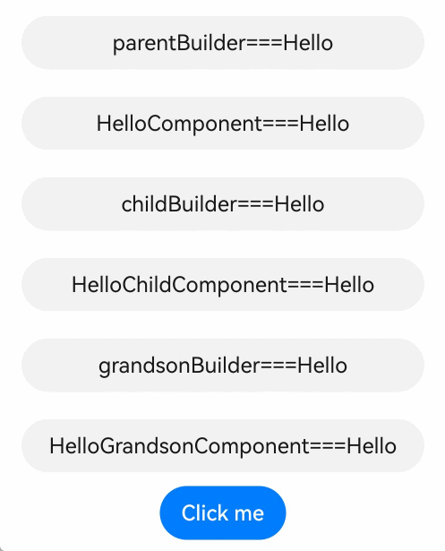
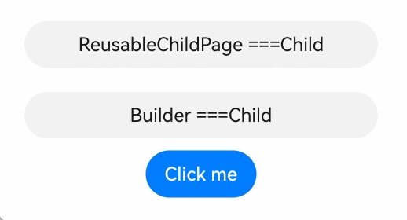
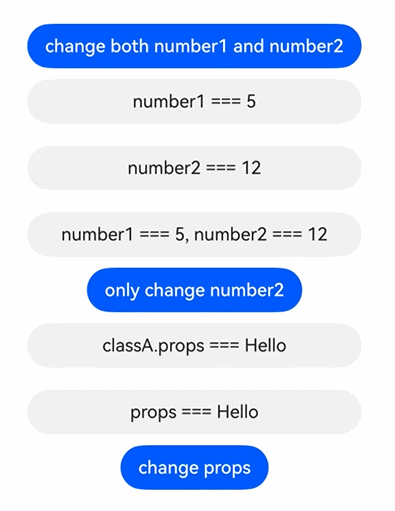

# \@Builder Decorator: Custom Builder Function
<!--Kit: ArkUI-->
<!--Subsystem: ArkUI-->
<!--Owner: @zhangboren-->
<!--Designer: @zhangboren-->
<!--Tester: @TerryTsao-->
<!--Adviser: @zhang_yixin13-->

ArkUI provides a lightweight UI element reuse mechanism \@Builder. The internal UI structure of ArkUI is fixed and only data is transferred with the user. Developers can abstract UI elements that are repeatedly used as functions and call them in the build function.

Functions decorated by \@Builder are also called custom build functions.

Before reading this topic, you are advised to read [Basic Syntax Overview](./arkts-basic-syntax-overview.md), [Declarative UI Description](./arkts-declarative-ui-description.md), and [Creating a Custom Component](./arkts-create-custom-components.md).

The differences between the @Builder decorator and [@Component decorator](./arkts-create-custom-components.md#component) in functions and usage are as follows:

1. The @Builder decorator is used to encapsulate reusable UI structures and extract repeated layout code to improve development efficiency. It is strictly prohibited to define [state variable](./arkts-state-management-glossary.md#state-variables) or use [lifecycle function](../../reference/apis-arkui/arkui-ts/ts-custom-component-lifecycle.md) in the decorator. Data interaction must be completed through parameter transfer or access to the state variable of the component to which the decorator belongs.

2. In the ArkUI framework, the @Component decorator is the core mechanism for encapsulating complex UI components. It allows developers to combine multiple basic components to build a reusable composite UI. This decorator not only supports the definition of internal state variables, but also manages the lifecycle of components.

> **NOTE**
>
> The initial APIs of this module are supported since API version 7.
>
> This decorator can be used in ArkTS widgets since API version 9.
>
> This decorator can be used in atomic services since API version 11.


## How to Use

The \@Builder decorator can be used in two modes: as a [private custom builder function](#private-custom-builder-function) within a custom component, or as a [global custom builder function](#global-custom-builder-function) defined at global scope.

### Private Custom Builder Function

The following is an example:

<!-- @[private_custom_constructor](https://gitcode.com/openharmony/applications_app_samples/blob/master/code/DocsSample/ArkUISample/BuilderComponent/entry/src/main/ets/pages/PrivateCustomConstructor.ets) -->

``` TypeScript
@Entry
@Component
struct BuilderDemo {
  @Builder
  showTextBuilder() {
    // @Builder decorates this function so that the Text component can be configured and built in chain mode.
    Text('Hello World')
      .fontSize(30)
      .fontWeight(FontWeight.Bold)
  }

  @Builder
  showTextValueBuilder(param: string) {
    Text(param)
      .fontSize(30)
      .fontWeight(FontWeight.Bold)
  }

  build() {
    Column() {
      // Without parameter.
      this.showTextBuilder()
      // With a parameter.
      this.showTextValueBuilder('Hello @Builder')
    }
  }
}
```

Invocation pattern:

- One or more @Builder functions can be defined in a custom component. These functions are treated as private and special member functions of the owning component.

- Private custom builder functions can be called in custom components, **build()**, and other custom builder functions.

- In a custom component, **this** indicates the component to which the component belongs. The status variables of the component can be accessed in the custom build function. It is recommended that **this** be used to access the status variable of the component instead of being transferred through parameters.

### Global Custom Builder Function

The following is an example:

<!-- @[global_custom_constructor](https://gitcode.com/openharmony/applications_app_samples/blob/master/code/DocsSample/ArkUISample/BuilderComponent/entry/src/main/ets/pages/GlobalCustomConstructor.ets) --> 

``` TypeScript
@Builder
function showTextBuilder() {
  Text('Hello World')
    .fontSize(30)
    .fontWeight(FontWeight.Bold)
}

@Entry
@Component
struct BuilderSample {
  build() {
    Column() {
      showTextBuilder()
    }
  }
}
```

- If the component status variable does not change, you are advised to use the global custom build function.

- Global custom build functions can be called in the **build** function and other custom build functions.


## Parameter Passing Rules

Parameters for custom builder functions can be passed [by callback](#passing-parameters-by-callback), [by reference](#by-reference-parameter-passing), or [by value](#by-value-parameter-passing). The following rules must be followed:

- The parameter type of the function decorated by \@Builder cannot be undefined, null, or an expression that returns undefined or null.

- All parameters must be immutable inside the custom builder function decorated by \@Builder.

- The custom builder function body follows the same [syntax rules](arkts-create-custom-components.md#build-1) as **build()**.

- The UI components in the \@Builder function can be updated during callback-based transfer and reference-based transfer. Passing by reference takes effect only when one parameter is passed and the parameter is directly passed to the object literal. If there are multiple parameters, the UI component in the @Builder function cannot be refreshed.

- When a reference is passed, the attribute of the parameter cannot be modified in the @Builder function. However, when **UIUtils.makeBinding** is used and the write callback is passed, the attribute can be modified in the @Builder function and synchronized to the component that calls the @Builder function.

### Passing Parameters by Callback

From API version 20, you can use the **UIUtils.makeBinding()** function, the **Binding** class, and the **MutableBinding** class to refresh status variables in the \@Builder function. For details, see [State Variables Can Be Refreshed in the \@Builder](#state-variables-can-be-refreshed-in-the-builder).

Use **UIUtils.makeBinding()** to wrap the callback function for reading status variables and transfer the callback function as a parameter to the @Builder function. The UI component in the @Builder function can be refreshed. The callback function of the write status variable transferred in **UIUtils.makeBinding()** can further transfer the parameter changes in @Builder to the component that calls the Builder function.

<!-- @[by_makebinding_parameter_passing](https://gitcode.com/openharmony/applications_app_samples/blob/master/code/DocsSample/ArkUISample/BuilderComponent/entry/src/main/ets/pages/ParameterMakeBinding.ets) -->

``` TypeScript
import { Binding, MutableBinding, UIUtils } from '@kit.ArkUI';

@Builder
function customButton(num1: Binding<number>, num2: MutableBinding<number>) {
  Row() {
    Column() {
      Text(`number1: ${num1.value}, number2: ${num2.value}`)
      Button(`only change number2`)
        .onClick(() => {
          // Assign a value of the MutableBinding type and transfer the modification to the parent component.
          num2.value += 1;
        })
    }
  }
}

@Entry
@ComponentV2
struct ParameterMakeBinding {
  @Local number1: number = 5;
  @Local number2: number = 12;

  build() {
    Column() {
      customButton(
        // Use makeBinding to pass parameters. The read callback needs to be passed. The Binding type is returned. The UI of the component in @Builder can be refreshed.
        UIUtils.makeBinding<number>(() => this.number1),
        // The MutableBinding type is returned when the write callback is passed to makeBinding. The UI of the component in @Builder can be refreshed and the attribute modification can be synchronized.
        UIUtils.makeBinding<number>(
          () => this.number2,
          (val: number) => {
            this.number2 = val;
          })
      )
    }
  }
}
```

### By-Reference Parameter Passing

In by-reference parameter passing, state variables can be passed, and the change of these state variables causes the UI re-rendering in the \@Builder function.

<!-- @[by_reference_parameter_passing](https://gitcode.com/openharmony/applications_app_samples/blob/master/code/DocsSample/ArkUISample/BuilderComponent/entry/src/main/ets/pages/ParameterReference.ets) -->

``` TypeScript
class Tmp {
  public paramA1: string = '';
}

@Builder
function overBuilderByReference(params: Tmp) {
  Row() {
    Text(`UseStateVarByReference: ${params.paramA1} `)
  }
}

@Entry
@Component
struct ParameterReference {
  @State label: string = 'Hello';

  build() {
    Column() {
      // When the overBuilderByReference component is called in the parent component:
      // Transfer this.label to the overBuilderByReference component by reference.
      overBuilderByReference({ paramA1: this.label })
      Button('Click me').onClick(() => {
        // After you click "Click me", the UI text changes from "Hello" to "ArkUI".
        this.label = 'ArkUI';
      })
    }
  }
}
```

### By-Value Parameter Passing

By default, parameters in the \@Builder decorated functions are passed by value. If the transferred parameter is a status variable, the change of the status variable does not cause the UI update in the \@Builder function. Therefore, when using state variables, you are advised to use [Passing Parameters By Callback](#passing-parameters-by-callback) or [Passing Parameters By Reference](#by-reference-parameter-passing).

<!-- @[by_value_parameter_passing](https://gitcode.com/openharmony/applications_app_samples/blob/master/code/DocsSample/ArkUISample/BuilderComponent/entry/src/main/ets/pages/ParameterValue.ets) -->

``` TypeScript
@Builder
function overBuilderByValue(paramA1: string) {
  Row() {
    Text(`UseStateVarByValue: ${paramA1} `)
  }
}

@Entry
@Component
struct ParameterValue {
  @State label: string = 'Hello';

  build() {
    Column() {
      overBuilderByValue(this.label)
    }
  }
}
```

## Constraints

1. \@If [MutableBinding](../../reference/apis-arkui/js-apis-stateManagement.md#mutablebindingt20) is not used in a function decorated by Builder, the parameter value cannot be modified. The modification does not trigger UI update. If [passing parameters by reference](#by-reference-parameter-passing) and only one parameter is passed, modifying the internal attributes of the parameter will throw a runtime error. You can use MutableBinding to modify parameter values in the function decorated by \@Builder. For details, see [Changing the Input Parameters in the \@Builder Decorated Function](#changing-the-input-parameters-in-the-builder-decorated-function).

2. The dynamic UI rendering is triggered only when the \@Builder passes parameters by reference and only one parameter is passed. For details, see [By-Reference Parameter Passing](#by-reference-parameter-passing).

3. If two or more parameters are passed to \@Builder, dynamic UI rendering will not be triggered. For details, see [Multiple Parameters in @Builder](#multiple-parameters-in-builder).

4. If the parameters passed to \@Builder contain both value passing and reference passing, dynamic UI rendering will not be triggered. For details, see [Multiple Parameters in @Builder](#multiple-parameters-in-builder).

5. If the parameters passed to \@Builder are not passed as an object literal, dynamic UI rendering will not be triggered. For details, see [Multiple Parameters in @Builder](#multiple-parameters-in-builder).


## Use Cases

### Using Custom Builder Function in Custom Component

Create a private **@Builder** function and use **this.builder()** to call the function in **Column**. Update **builderValue** through the [aboutToAppear](../../reference/apis-arkui/arkui-ts/ts-custom-component-lifecycle.md#abouttoappear) lifecycle function and button click event, implementing dynamic UI rendering.

<!-- @[using_custom_builder_function_in_custom_component](https://gitcode.com/openharmony/applications_app_samples/blob/master/code/DocsSample/ArkUISample/BuilderComponent/entry/src/main/ets/pages/InCustomComponent.ets) -->

``` TypeScript
@Entry
@Component
struct PrivateBuilder {
  @State builderValue: string = 'Hello';

  @Builder
  builder() {
    Column() {
      Text(this.builderValue)
        .width(230)
        .height(40)
        .backgroundColor('#ffeae5e5')
        .borderRadius(20)
        .margin(12)
        .textAlign(TextAlign.Center)
    }
  }

  aboutToAppear(): void {
    setTimeout(() => {
      this.builderValue = 'Hello World';
    }, 2000);
  }

  build() {
    Row() {
      Column() {
        Text(this.builderValue)
          .width(230)
          .height(40)
          .backgroundColor('#ffeae5e5')
          .borderRadius(20)
          .textAlign(TextAlign.Center)
        this.builder()
        Button('Click to change the builderValue')
          .onClick(() => {
            this.builderValue = 'builderValue was clicked';
          })
      }
      .height('100%')
      .width('100%')
    }
  }
}
```
Effect


### Global Custom Builder Function

Create a global **@Builder** function and call it in **overBuilder()** mode in **Column**. When transferring parameters, you can use the object literal form. Any change of the value will trigger the refresh of the UI, regardless of the simple or complex type.

<!-- @[global_custom_builder_function](https://gitcode.com/openharmony/applications_app_samples/blob/master/code/DocsSample/ArkUISample/BuilderComponent/entry/src/main/ets/pages/GlobalCustomBuilder.ets) --> 

``` TypeScript
class ChildTmp {
  public val: number = 1;
}

class ParamTmp {
  public strValue: string = 'Hello';
  public numValue: number = 0;
  public tmpValue: ChildTmp = new ChildTmp();
  public arrayTmpValue: Array<ChildTmp> = [];
}

@Builder
function overBuilder(param: ParamTmp) {
  Column() {
    Text(`strValue: ${param.strValue}`)
      .width(230)
      .height(40)
      .margin(12)
      .backgroundColor('#0d000000')
      .fontColor('#e6000000')
      .borderRadius(20)
      .textAlign(TextAlign.Center)
    Text(`numValue: ${param.numValue}`)
      .width(230)
      .height(40)
      .margin(12)
      .backgroundColor('#0d000000')
      .fontColor('#e6000000')
      .borderRadius(20)
      .textAlign(TextAlign.Center)
    Text(`tmpValue: ${param.tmpValue.val}`)
      .width(230)
      .height(40)
      .margin(12)
      .backgroundColor('#0d000000')
      .fontColor('#e6000000')
      .borderRadius(20)
      .textAlign(TextAlign.Center)
    ForEach(param.arrayTmpValue, (item: ChildTmp) => {
      ListItem() {
        Text(`arrayTmpValue: ${item.val}`)
          .width(230)
          .height(40)
          .margin(12)
          .backgroundColor('#0d000000')
          .fontColor('#e6000000')
          .borderRadius(20)
          .textAlign(TextAlign.Center)
      }
    }, (item: ChildTmp) => JSON.stringify(item))
  }
}

@Entry
@Component
struct ParentDemo {
  @State objParam: ParamTmp = new ParamTmp();

  build() {
    Column() {
      Text('UI Rendered via @Builder')
        .fontSize(20)
        .margin(12)
      // Call the global @Builder function overBuilder.
      overBuilder({
        strValue: this.objParam.strValue,
        numValue: this.objParam.numValue,
        tmpValue: this.objParam.tmpValue,
        arrayTmpValue: this.objParam.arrayTmpValue
      })
      Button('Update Values').onClick(() => {
        this.objParam.strValue = 'Hello World';
        this.objParam.numValue = 1;
        this.objParam.tmpValue.val = 8;
        const childValue: ChildTmp = {
          val: 2
        }
        this.objParam.arrayTmpValue.push(childValue);
      })
    }
    .height('100%')
    .width('100%')
  }
}
```
Effect


### Changing the Variables Decorated by the Decorator Triggers UI Re-rendering

In this scenario, @Builder defines the **Text** component layout but does not handle dynamic UI updates. UI re-rendering occurs when decorator-observed values change, not through @Builder's reactive capabilities.

<!-- @[changing_by_the_decorator_triggers_ui_rerendering](https://gitcode.com/openharmony/applications_app_samples/blob/master/code/DocsSample/ArkUISample/BuilderComponent/entry/src/main/ets/pages/ChangingByDecorator.ets) -->

``` TypeScript
class ChildrenTmp {
  public strValue: string = 'Hello';
}

@Entry
@Component
struct ParentSample {
  @State objParam: ChildrenTmp = new ChildrenTmp();
  @State label: string = 'World';

  @Builder
  privateBuilder() {
    Column() {
      Text(`wrapBuilder strValue: ${this.objParam.strValue}`)
        .width(350)
        .height(40)
        .margin(12)
        .backgroundColor('#0d000000')
        .fontColor('#e6000000')
        .borderRadius(20)
        .textAlign(TextAlign.Center)
      Text(`wrapBuilder num: ${this.label}`)
        .width(350)
        .height(40)
        .margin(12)
        .backgroundColor('#0d000000')
        .fontColor('#e6000000')
        .borderRadius(20)
        .textAlign(TextAlign.Center)
    }
  }

  build() {
    Column() {
      Text('UI Rendered via @Builder')
        .fontSize(20)
      this.privateBuilder()
      Button('Update Values').onClick(() => {
        this.objParam.strValue = 'strValue Hello World';
        this.label = 'label Hello World';
      })
    }
    .height('100%')
    .width('100%')
  }
}
```
Effect


### Using Functions Decorated with @Builder as CustomBuilder Types

When the parameter type is [CustomBuilder](../../reference/apis-arkui/arkui-ts/ts-types.md#custombuilder8), the defined @Builder function can be passed. **CustomBuilder** is actually of the **Function(() => any)** or **void** type, and @Builder is also of the **Function** type. Therefore, a specific effect can be implemented by transferring **@Builder**.

When the global @Builder function is transferred as the **CustomBuilder** type, the **this** context needs to be bound. You can directly call the global @Builder function. The compilation tool chain automatically generates the code bound to the this context.

<!-- @[using_function_decorated_with_builder_as_custom_builder](https://gitcode.com/openharmony/applications_app_samples/blob/master/code/DocsSample/ArkUISample/BuilderComponent/entry/src/main/ets/pages/AsCustomBuilder.ets) -->

``` TypeScript
@Builder
function overBuilderDemo() {
  Row() {
    Text('Global Builder')
      .fontSize(30)
      .fontWeight(FontWeight.Bold)
  }
}

@Entry
@Component
struct customBuilderDemo {
  @State arr: number[] = [0, 1, 2, 3, 4];

  @Builder
  privateBuilder() {
    Row() {
      Text('Private Builder')
        .fontSize(30)
        .fontWeight(FontWeight.Bold)
    }
  }

  build() {
    Column() {
      List({ space: 10 }) {
        ForEach(this.arr, (item: number) => {
          ListItem() {
            Text(`${item}`)
              .width('100%')
              .height(100)
              .fontSize(16)
              .textAlign(TextAlign.Center)
              .borderRadius(10)
              .backgroundColor(0xFFFFFF)
          }
          .swipeAction({
            start: {
              builder: overBuilderDemo() // The compilation toolchain automatically binds this context.
            },
            end: {
              builder: () => {
                // When the local @Builder is called in the arrow function, the this context is automatically bound and does not need to be processed by the compilation toolchain.
                this.privateBuilder()
              }
            }
          })
        }, (item: number) => JSON.stringify(item))
      }
    }
  }
}
```
Effect


### Multi-Layer \@Builder Function Nesting

Invoke customized components or other \@Builder functions in the \@Builder function to implement nested use of multiple \@Builders. To implement the dynamic UI refresh function of the \@Builder at the innermost layer, the \@Builder must be called by reference at each layer. Here, **$$** is not a mandatory parameter. You can replace it with another name.

<!-- @[nested_builder_functions](https://gitcode.com/openharmony/applications_app_samples/blob/master/code/DocsSample/ArkUISample/BuilderComponent/entry/src/main/ets/pages/NestedBuilderFunctions.ets) --> 

``` TypeScript
class ThisTmp {
  public paramA1: string = '';
}

@Builder
function parentBuilder($$: ThisTmp) {
  Row() {
    Column() {
      Text(`parentBuilder===${$$.paramA1}`)
        .width(300)
        .height(40)
        .margin(10)
        .backgroundColor('#0d000000')
        .fontColor('#e6000000')
        .borderRadius(20)
        .textAlign(TextAlign.Center)
      // Call the custom component HelloComponent.
      HelloComponent({ message: $$.paramA1 })
      // Call the global @Builder function childBuilder.
      childBuilder({ paramA1: $$.paramA1 })
    }
  }
}

@Component
struct HelloComponent {
  @Prop message: string = '';

  build() {
    Row() {
      Text(`HelloComponent===${this.message}`)
        .width(300)
        .height(40)
        .margin(10)
        .backgroundColor('#0d000000')
        .fontColor('#e6000000')
        .borderRadius(20)
        .textAlign(TextAlign.Center)
    }
  }
}

@Builder
function childBuilder($$: ThisTmp) {
  Row() {
    Column() {
      Text(`childBuilder===${$$.paramA1}`)
        .width(300)
        .height(40)
        .margin(10)
        .backgroundColor('#0d000000')
        .fontColor('#e6000000')
        .borderRadius(20)
        .textAlign(TextAlign.Center)
      // Call the custom component HelloChildComponent.
      HelloChildComponent({ message: $$.paramA1 })
      // Call the global @Builder function grandsonBuilder.
      grandsonBuilder({ paramA1: $$.paramA1 })
    }
  }
}

@Component
struct HelloChildComponent {
  @Prop message: string = '';

  build() {
    Row() {
      Text(`HelloChildComponent===${this.message}`)
        .width(300)
        .height(40)
        .margin(10)
        .backgroundColor('#0d000000')
        .fontColor('#e6000000')
        .borderRadius(20)
        .textAlign(TextAlign.Center)
    }
  }
}

@Builder
function grandsonBuilder($$: ThisTmp) {
  Row() {
    Column() {
      Text(`grandsonBuilder===${$$.paramA1}`)
        .width(300)
        .height(40)
        .margin(10)
        .backgroundColor('#0d000000')
        .fontColor('#e6000000')
        .borderRadius(20)
        .textAlign(TextAlign.Center)
      // Call the custom component HelloGrandsonComponent.
      HelloGrandsonComponent({ message: $$.paramA1 })
    }
  }
}

@Component
struct HelloGrandsonComponent {
  @Prop message: string;

  build() {
    Row() {
      Text(`HelloGrandsonComponent===${this.message}`)
        .width(300)
        .height(40)
        .margin(10)
        .backgroundColor('#0d000000')
        .fontColor('#e6000000')
        .borderRadius(20)
        .textAlign(TextAlign.Center)
    }
  }
}

@Entry
@Component
struct ParentExample {
  @State label: string = 'Hello';

  build() {
    Column() {
      // Call the global @Builder function parentBuilder.
      parentBuilder({ paramA1: this.label })
      Button('Click me').onClick(() => {
        this.label = 'ArkUI';
      })
    }
    .height('100%')
    .width('100%')
  }
}
```
Effect



### \@Builder Function Union V2 Decorator

Class object instances decorated by [@ObservedV2](./arkts-new-observedV2-and-trace.md) and [@Trace](./arkts-new-observedV2-and-trace.md) have the capability of deeply observing attribute changes. In a custom component decorated by @ComponentV2, when the global builder or local builder is called and parameters are transferred in value transfer mode, modifying the object attributes decorated by @Trace can trigger UI refresh.
<!-- @[builder_function_combined_with_the_v2_decorator](https://gitcode.com/openharmony/applications_app_samples/blob/master/code/DocsSample/ArkUISample/BuilderComponent/entry/src/main/ets/pages/BuilderCombined.ets) -->

``` TypeScript
@ObservedV2
class Info {
  @Trace public name: string;
  @Trace public age: number;

  constructor(name: string, age: number) {
    this.name = name;
    this.age = age;
  }
}

@Builder
function overBuilderTest(param: Info) {
  Column() {
    Text(`Global@Builder name: ${param.name}`)
    Text(`Global@Builder age: ${param.age}`)
  }
  .width(230)
  .height(40)
  .margin(10)
  .padding({ left: 20 })
  .backgroundColor('#0d000000')
  .borderRadius(20)
}

@ComponentV2
struct ChildPage {
  @Require @Param childInfo: Info;

  build() {
    Column() {
      // The value must be transferred. If the reference transfer mode is used, the request will be intercepted by the ArkTS syntax.
      overBuilderTest(this.childInfo)
    }
  }
}

@Entry
@ComponentV2
struct ParentPage {
  info1: Info = new Info('Tom', 25);
  info2: Info = new Info('Tom', 25);

  @Builder
  privateBuilder() {
    Column() {
      Text(`Private@Builder name: ${this.info1.name}`)
      Text(`Private@Builder age: ${this.info1.age}`)
    }
    .width(230)
    .height(40)
    .margin(10)
    .backgroundColor('#0d000000')
    .borderRadius(20)
  }

  build() {
    Column() {
      Flex() {
        Column() {
          Text(`info1: ${this.info1.name}  ${this.info1.age}`) // Text1
          Text(`info2: ${this.info2.name}  ${this.info2.age}`) // Text2
        }
      }
      .width(230)
      .height(40)
      .margin(10)
      .padding({ left: 60 })
      .backgroundColor('#0d000000')
      .borderRadius(20)

      // Call the local @Builder.
      this.privateBuilder()
      // Call the global @Builder. The value must be transferred. If the value is transferred by reference, it will be intercepted by the ArkTS syntax.
      overBuilderTest(this.info2)
      ChildPage({ childInfo: this.info1 }) // Call the custom component.
      ChildPage({ childInfo: this.info2 }) // Call the custom component.
      Button('change info1&info2')
        .onClick(() => {
          this.info1.name = 'Cat'; // Change the name value of info1 displayed in Text1.
          this.info1.age = 18; // Change the age value of info1 displayed in Text1.
          this.info2.name = 'Cat'; // Change the name value of info2 displayed in Text2.
          this.info2.age = 18; // Change the age value of info2 displayed in Text2.
        })
    }
    .height('100%')
    .width('100%')
  }
}
```
Effect


When a parameter is transferred to @Builder by reference, if the parameter is an object decorated by @Local, assigning a value to the object will trigger UI update in @Builder.

<!-- @[builder_function_combined_with_the_v2_decorator_and_local](https://gitcode.com/openharmony/applications_app_samples/blob/master/code/DocsSample/ArkUISample/BuilderComponent/entry/src/main/ets/pages/BuilderCombinedLocal.ets) -->

``` TypeScript
class LocalInfo {
  public name: string = 'Tom';
  public age: number = 25;
}

@Builder
function overBuilderLocal(param: LocalInfo) {
  Column() {
    Text(`Global@Builder name: ${param.name}`)
    Text(`Global@Builder age: ${param.age}`)
  }
  .width(230)
  .height(40)
  .margin(10)
  .padding({ left: 20 })
  .backgroundColor('#0d000000')
  .borderRadius(20)
}

@ComponentV2
struct ChildLocalPage {
  @Require @Param childLocalInfo: LocalInfo;

  build() {
    Column() {
      // By-reference parameter passing is used.
      overBuilderLocal({ name: this.childLocalInfo.name, age: this.childLocalInfo.age })
    }
  }
}

@Entry
@ComponentV2
struct ParentLocalPage {
  LocalInfo1: LocalInfo = { name: 'Tom', age: 25 };
  @Local LocalInfo2: LocalInfo = { name: 'Tom', age: 25 };

  @Builder
  privateBuilder() {
    Column() {
      Text(`Private@Builder name: ${this.LocalInfo1.name}`)
      Text(`Private@Builder age: ${this.LocalInfo1.age}`)
    }
    .width(230)
    .height(40)
    .margin(10)
    .backgroundColor('#0d000000')
    .borderRadius(20)
  }

  build() {
    Column() {
      Flex() {
        Column() {
          Text(`LocalInfo1: ${this.LocalInfo1.name}  ${this.LocalInfo1.age}`) // Text1
          Text(`LocalInfo2: ${this.LocalInfo2.name}  ${this.LocalInfo2.age}`) // Text2
        }
      }
      .width(230)
      .height(40)
      .margin(10)
      .padding({ left: 60 })
      .backgroundColor('#0d000000')
      .borderRadius(20)

      // Call the local @Builder.
      this.privateBuilder()
      // Call the global @Builder. Here, the reference transfer mode is used.
      overBuilderLocal({ name: this.LocalInfo2.name, age: this.LocalInfo2.age })
      ChildLocalPage({ childLocalInfo: this.LocalInfo1 }) // Invoke the custom component.
      ChildLocalPage({ childLocalInfo: this.LocalInfo2 }) // Invoke the custom component.
      Button('change LocalInfo1&LocalInfo2')
        .onClick(() => {
          this.LocalInfo1 = { name: 'Cat', age: 18 }; // Text1 is not re-rendered because no decorator is used to listen for value changes.
          this.LocalInfo2 = { name: 'Cat', age: 18 }; // Text2 is re-rendered because a decorator is used to listen for value changes.
        })
    }
    .height('100%')
    .width('100%')
  }
}
```
Effect


### Global @Builder Reused Across Components

In the cross-component scenario, the global \@Builder is called to transfer parameters by reference to implement the dynamic UI update function.

<!-- @[global_builder_reused_across_components](https://gitcode.com/openharmony/applications_app_samples/blob/master/code/DocsSample/ArkUISample/BuilderComponent/entry/src/main/ets/pages/AcrossComponents.ets) --> 

``` TypeScript
class ReusableTmp {
  public componentName: string = 'Child';
}

@Builder
function itemBuilder(params: ReusableTmp) {
  Column() {
    Text(`Builder ===${params.componentName}`)
      .width(300)
      .height(40)
      .margin(10)
      .backgroundColor('#0d000000')
      .fontColor('#e6000000')
      .borderRadius(20)
      .textAlign(TextAlign.Center)
  }
}

@Entry
@Component
struct ReusablePage {
  @State switchFlag: boolean = true;

  build() {
    Column() {
      if (this.switchFlag) {
        // Invoke the customized component ReusableChildPage.
        ReusableChildPage({ message: 'Child' })
      } else {
        // Invoke the customized component ReusableChildTwoPage.
        ReusableChildTwoPage({ message: 'ChildTwo' })
      }
      Button('Click me')
        .onClick(() => {
          this.switchFlag = !this.switchFlag;
        })
    }
    .height('100%')
    .width('100%')
  }
}

@Reusable
@Component
struct ReusableChildPage {
  @State message: string = 'Child';

  aboutToReuse(params: Record<string, ESObject>): void {
    console.info('Recycle ====Child');
    this.message = params.message;
  }

  build() {
    Column() {
      Text(`ReusableChildPage ===${this.message}`)
        .width(300)
        .height(40)
        .margin(10)
        .backgroundColor('#0d000000')
        .fontColor('#e6000000')
        .borderRadius(20)
        .textAlign(TextAlign.Center)
      // Invoke the global @Builder function itemBuilder.
      itemBuilder({ componentName: this.message })
    }
  }
}

@Reusable
@Component
struct ReusableChildTwoPage {
  @State message: string = 'ChildTwo';

  aboutToReuse(params: Record<string, ESObject>): void {
    console.info('Recycle ====ChildTwo');
    this.message = params.message;
  }

  build() {
    Column() {
      Text(`ReusableChildTwoPage ===${this.message}`)
        .width(300)
        .height(40)
        .margin(10)
        .backgroundColor('#0d000000')
        .fontColor('#e6000000')
        .borderRadius(20)
        .textAlign(TextAlign.Center)
      // Invoke the global @Builder function itemBuilder.
      itemBuilder({ componentName: this.message })
    }
  }
}
```
Effect



### State Variables Can Be Refreshed in the \@Builder

From API version 20, you can use the **UIUtils.makeBinding()** function, the **Binding** class, and the **MutableBinding** class to refresh state variables in the \@Builder function. For details, see [state management APIs](../../reference/apis-arkui/js-apis-stateManagement.md#makebinding20).

<!-- @[builder_supports_state_variable_refresh](https://gitcode.com/openharmony/applications_app_samples/blob/master/code/DocsSample/ArkUISample/BuilderComponent/entry/src/main/ets/pages/BuilderSupports.ets) --> 

``` TypeScript
import { Binding, MutableBinding, UIUtils } from '@kit.ArkUI';

@ObservedV2
class ClassA {
  @Trace public props: string = 'Hello';
}

@Builder
function customButton(num1: Binding<number>, num2: MutableBinding<number>) {
  Row() {
    Column() {
      Text(`number1 === ${num1.value},  number2 === ${num2.value}`)
        .width(300)
        .height(40)
        .margin(10)
        .backgroundColor('#0d000000')
        .fontColor('#e6000000')
        .borderRadius(20)
        .textAlign(TextAlign.Center)

      Button(`only change number2`)
        .onClick(() => {
          num2.value += 1;
        })
    }
  }
}

@Builder
function customButtonObj(obj1: MutableBinding<ClassA>) {
  Row() {
    Column() {
      Text(`props === ${obj1.value.props}`)
        .width(300)
        .height(40)
        .margin(10)
        .backgroundColor('#0d000000')
        .fontColor('#e6000000')
        .borderRadius(20)
        .textAlign(TextAlign.Center)

      Button(`change props`)
        .onClick(() => {
          obj1.value.props += 'Hi';
        })
    }
  }
}

@Entry
@ComponentV2
struct Single {
  @Local number1: number = 5;
  @Local number2: number = 12;
  @Local classA: ClassA = new ClassA();

  build() {
    Column() {
      Button(`change both number1 and number2`)
        .onClick(() => {
          this.number1 += 1;
          this.number2 += 2;
        })
      Text(`number1 === ${this.number1}`)
        .width(300)
        .height(40)
        .margin(10)
        .backgroundColor('#0d000000')
        .fontColor('#e6000000')
        .borderRadius(20)
        .textAlign(TextAlign.Center)
      Text(`number2 === ${this.number2}`)
        .width(300)
        .height(40)
        .margin(10)
        .backgroundColor('#0d000000')
        .fontColor('#e6000000')
        .borderRadius(20)
        .textAlign(TextAlign.Center)
      // Call the global @Builder function customButton.
      customButton(
        UIUtils.makeBinding<number>(() => this.number1), // Use the UIUtils.makeBinding() function to update the status variables in the @Builder function.
        UIUtils.makeBinding<number>(
          () => this.number2,
          (val: number) => {
            this.number2 = val;
          })
      )
      Text(`classA.props === ${this.classA.props}`)
        .width(300)
        .height(40)
        .margin(10)
        .backgroundColor('#0d000000')
        .fontColor('#e6000000')
        .borderRadius(20)
        .textAlign(TextAlign.Center)
      // Call the global @Builder function customButtonObj.
      customButtonObj(
        UIUtils.makeBinding<ClassA>( // Use the UIUtils.makeBinding () function to refresh state variables in the @Builder function.
          () => this.classA,
          (val: ClassA) => {
            this.classA = val;
          })
      )
    }
    .width('100%')
    .height('100%')
    .alignItems(HorizontalAlign.Center)
    .justifyContent(FlexAlign.Center)
  }
}
```
Effect



## FAQs

### Multiple Parameters in @Builder

When @Builder functions have two or more parameters, UI re-rendering is not triggered by value changes, even when parameters are passed via object literals.

**Incorrect Usage**

<!-- @[multiple_parameters_in_builder_incorrect_usage_1](https://gitcode.com/openharmony/applications_app_samples/blob/master/code/DocsSample/ArkUISample/BuilderComponent/entry/src/main/ets/pages/MultipleIncorrectUsage1.ets) --> 

``` TypeScript
class GlobalTmp1 {
  public strValue: string = 'Hello';
}

@Builder
function overBuilder1(param: GlobalTmp1, num: number) {
  Column() {
    Text(`strValue: ${param.strValue}`)
    Text(`num: ${num}`)
  }
}

@Entry
@Component
struct Parent1 {
  @State objParam: GlobalTmp1 = new GlobalTmp1();
  @State num: number = 0;

  build() {
    Column() {
      Text('UI Rendered via @Builder')
        .fontSize(20)
      // Two parameters are used, which is incorrect.
      overBuilder1({ strValue: this.objParam.strValue }, this.num)
      Line()
        .width('100%')
        .height(10)
        .backgroundColor('#000000').margin(10)
      Button('Update Values').onClick(() => {
        this.objParam.strValue = 'Hello World';
        this.num = 1;
      })
    }
  }
}
```

**Incorrect Usage**

<!-- @[multiple_parameters_in_builder_incorrect_usage_2](https://gitcode.com/openharmony/applications_app_samples/blob/master/code/DocsSample/ArkUISample/BuilderComponent/entry/src/main/ets/pages/MultipleIncorrectUsage2.ets) --> 

``` TypeScript
class GlobalTmp2 {
  public strValue: string = 'Hello';
}

class SecondTmp {
  public numValue: number = 0;
}

@Builder
function overBuilder2(param: GlobalTmp2, num: SecondTmp) {
  Column() {
    Text(`strValue: ${param.strValue}`)
    Text(`num: ${num.numValue}`)
  }
}

@Entry
@Component
struct Parent2 {
  @State strParam: GlobalTmp2 = new GlobalTmp2();
  @State numParam: SecondTmp = new SecondTmp();

  build() {
    Column() {
      Text('UI Rendered via @Builder')
        .fontSize(20)
      // Two parameters are used, which is incorrect.
      overBuilder2({ strValue: this.strParam.strValue }, { numValue: this.numParam.numValue })
      Line()
        .width('100%')
        .height(10)
        .backgroundColor('#000000').margin(10)
      Button('Update Values').onClick(() => {
        this.strParam.strValue = 'Hello World';
        this.numParam.numValue = 1;
      })
    }
  }
}
```

\@Builder functions accept only one parameter, which must be passed as an object literal. Changes to this parameter's value trigger UI re-rendering.

**Correct Usage**

<!-- @[multiple_parameters_in_builder_correct_usage](https://gitcode.com/openharmony/applications_app_samples/blob/master/code/DocsSample/ArkUISample/BuilderComponent/entry/src/main/ets/pages/MultipleCorrectUsage.ets) --> 

``` TypeScript
class GlobalTmp3 {
  public strValue: string = 'Hello';
  public numValue: number = 0;
}

@Builder
function overBuilder3(param: GlobalTmp3) {
  Column() {
    Text(`strValue: ${param.strValue}`)
    Text(`num: ${param.numValue}`)
  }
}

@Entry
@Component
struct Parent3 {
  @State objParam: GlobalTmp3 = new GlobalTmp3();

  build() {
    Column() {
      Text('UI Rendered via @Builder')
        .fontSize(20)
      // Input a parameter. This is a correct usage.
      overBuilder3({ strValue: this.objParam.strValue, numValue: this.objParam.numValue })
      Line()
        .width('100%')
        .height(10)
        .backgroundColor('#000000').margin(10)
      Button('Update Values').onClick(() => {
        this.objParam.strValue = 'Hello World';
        this.objParam.numValue = 1;
      })
    }
  }
}
```

### Dynamic Re-rendering with @ComponentV2

In @ComponentV2 decorated components, combine @ObservedV2 and @Trace decorators to enable UI re-rendering through value-based change detection.

**Incorrect Usage**

Using primitive data types in @ComponentV2 decorated components fails to trigger UI re-rendering.

<!-- @[dynamic_rerendering_with_component_v2_incorrect_usage](https://gitcode.com/openharmony/applications_app_samples/blob/master/code/DocsSample/ArkUISample/BuilderComponent/entry/src/main/ets/pages/DynamicIncorrectUsage.ets) -->

``` TypeScript
@ObservedV2
class ParamTemp {
  @Trace public count : number = 0;
}

@Builder
function renderNumber(paramNum: number) {
  Text(`paramNum : ${paramNum}`)
    .fontSize(30)
    .fontWeight(FontWeight.Bold)
}

@Entry
@ComponentV2
struct PageBuilderIncorrectUsage {
  @Local classValue: ParamTemp = new ParamTemp();
  // Using primitive data type cannot trigger UI re-rendering.
  @Local numValue: number = 0;
  private progressTimer: number = -1;

  aboutToAppear(): void {
    this.progressTimer = setInterval(() => {
      if (this.classValue.count < 100) {
        this.classValue.count += 5;
        this.numValue += 5;
      } else {
        clearInterval(this.progressTimer);
      }
    }, 500);
  }

  build() {
    Column() {
      renderNumber(this.numValue)
    }
    .width('100%')
    .height('100%')
    .padding(50)
  }
}
```

**Correct Usage**

In a custom component decorated by @ComponentV2, only the ParamTmpClass class decorated by @ObservedV2 and the count attribute decorated by @Trace can trigger UI refresh.

<!-- @[dynamic_rerendering_with_component_v2_correct_usage](https://gitcode.com/openharmony/applications_app_samples/blob/master/code/DocsSample/ArkUISample/BuilderComponent/entry/src/main/ets/pages/DynamicCorrectUsage.ets) --> 

``` TypeScript
@ObservedV2
class ParamTmpClass {
  @Trace public count: number = 0;
}

@Builder
function renderText(param: ParamTmpClass) {
  Column() {
    Text(`param : ${param.count}`)
      .fontSize(20)
      .fontWeight(FontWeight.Bold)
  }
}

@Builder
function renderMap(paramMap: Map<string, number>) {
  Text(`paramMap : ${paramMap.get('name')}`)
    .fontSize(20)
    .fontWeight(FontWeight.Bold)
}

@Builder
function renderSet(paramSet: Set<number>) {
  Text(`paramSet : ${paramSet.size}`)
    .fontSize(20)
    .fontWeight(FontWeight.Bold)
}

@Builder
function renderNumberArr(paramNumArr: number[]) {
  Text(`paramNumArr : ${paramNumArr[0]}`)
    .fontSize(20)
    .fontWeight(FontWeight.Bold)
}

@Entry
@ComponentV2
struct PageBuilderCorrectUsage {
  @Local builderParams: ParamTmpClass = new ParamTmpClass();
  @Local mapValue: Map<string, number> = new Map();
  @Local setValue: Set<number> = new Set([0]);
  @Local numArrValue: number[] = [0];
  private progressTimer: number = -1;

  aboutToAppear(): void {
    this.progressTimer = setInterval(() => {
      if (this.builderParams.count < 100) {
        this.builderParams.count += 5;
        this.mapValue.set('name', this.builderParams.count);
        this.setValue.add(this.builderParams.count);
        this.numArrValue[0] = this.builderParams.count;
      } else {
        clearInterval(this.progressTimer);
      }
    }, 500);
  }

  @Builder
  localBuilder() {
    Column() {
      Text(`localBuilder : ${this.builderParams.count}`)
        .fontSize(20)
        .fontWeight(FontWeight.Bold)
    }
  }

  build() {
    Column() {
      this.localBuilder()
      Text(`builderParams :${this.builderParams.count}`)
        .fontSize(20)
        .fontWeight(FontWeight.Bold)
      renderText(this.builderParams)
      renderText({ count: this.builderParams.count })
      renderMap(this.mapValue)
      renderSet(this.setValue)
      renderNumberArr(this.numArrValue)
    }
    .width('100%')
    .height('100%')
  }
}
```

### Component Creation in \@Builder Prevents Parameter Update Propagation

Create the customized component HelloComponent1 in the parentBuilder1 function, transfer the class object as the parameter, and change the value in the object. The UI does not trigger the refresh function.

**Incorrect Usage**

<!-- @[builder_parameter_update_propagation_incorrect_usage](https://gitcode.com/openharmony/applications_app_samples/blob/master/code/DocsSample/ArkUISample/BuilderComponent/entry/src/main/ets/pages/BuilderIncorrectUsage.ets) -->

``` TypeScript
class Tmp4 {
  public name: string = 'Hello';
  public age: number = 16;
}

@Builder
function parentBuilder1(params: Tmp4) {
  Row() {
    Column() {
      Text(`parentBuilder1===${params.name}===${params.age}`)
        .fontSize(20)
        .fontWeight(FontWeight.Bold)
      // This is not a reference-based transfer mode. The usage is incorrect. As a result, the UI is not refreshed.
      HelloComponent1({ info: params })
    }
  }
}

@Component
struct HelloComponent1 {
  @Prop info: Tmp4 = new Tmp4();

  build() {
    Row() {
      Text(`HelloComponent1===${this.info.name}===${this.info.age}`)
        .fontSize(20)
        .fontWeight(FontWeight.Bold)
    }
  }
}

@Entry
@Component
struct ParentPage1 {
  @State nameValue: string = 'Zhang San';
  @State ageValue: number = 18;

  build() {
    Column() {
      parentBuilder1({ name: this.nameValue, age: this.ageValue })
      Button('Click me')
        .onClick(() => {
          // The modification does not cause the change of HelloComponent1.
          this.nameValue = 'Li Si';
          this.ageValue = 20;
        })
    }
    .height('100%')
    .width('100%')
  }
}
```

Create the customized component HelloComponent2 in the parentBuilder2 function, transfer the parameter in the object literal format, and change the value in the object. The UI triggers the refresh function.

**Correct Usage**

<!-- @[builder_parameter_update_propagation_correct_usage](https://gitcode.com/openharmony/applications_app_samples/blob/master/code/DocsSample/ArkUISample/BuilderComponent/entry/src/main/ets/pages/BuilderCorrectUsage.ets) -->

``` TypeScript
class Tmp5 {
  public name: string = 'Hello';
  public age: number = 16;
}

@Builder
function parentBuilder2(params: Tmp5) {
  Row() {
    Column() {
      Text(`parentBuilder2===${params.name}===${params.age}`)
        .fontSize(20)
        .fontWeight(FontWeight.Bold)
      // Split the entire object into simple types, which is transferred by reference. Modifying attributes can trigger UI refresh.
      HelloComponent2({ childName: params.name, childAge: params.age })
    }
  }
}

@Component
struct HelloComponent2 {
  @Prop childName: string = '';
  @Prop childAge: number = 0;

  build() {
    Row() {
      Text(`HelloComponent2===${this.childName}===${this.childAge}`)
        .fontSize(20)
        .fontWeight(FontWeight.Bold)
    }
  }
}

@Entry
@Component
struct ParentPage2 {
  @State nameValue: string = 'Zhang San';
  @State ageValue: number = 18;

  build() {
    Column() {
      parentBuilder2({ name: this.nameValue, age: this.ageValue })
      Button('Click me')
        .onClick(() => {
          // Modifying the content here will cause the change of HelloComponent2.
          this.nameValue = 'Li Si';
          this.ageValue = 20;
        })
    }
    .height('100%')
    .width('100%')
  }
}
```

### Invoking the \@Builder function or method outside the UI statement affects the normal refreshing of the node.

When the \@Builder method assigns a value to a variable or array, the method cannot be used in the UI method, and the node display is abnormal during refresh.

**Incorrect Usage**
<!-- @[calling_builder_outside_incorrect_usage](https://gitcode.com/openharmony/applications_app_samples/blob/master/code/DocsSample/ArkUISample/BuilderComponent/entry/src/main/ets/pages/OutsideIncorrectUsage.ets) --> 

``` TypeScript
@Entry
@Component
struct BackGround1 {
  @Builder
  myImages() {
    Column() {
      // Load the image resource named startIcon from the media directory of the application. 'app.media.startIcon' is only an example. Replace it with the actual one.
      Image($r('app.media.startIcon')).width('100%').height('100%')
    }
  };

  @Builder
  myImages2() {
    Column() {
      // Load the image resource named startIcon from the media directory of the application. 'app.media.startIcon' is only an example. Replace it with the actual one.
      Image($r('app.media.startIcon')).width('100%').height('100%')
    }
  };

  private bgList: Array<CustomBuilder> = [this.myImages(), this.myImages2()]; // Incorrect usage. Do not invoke the @Builder method outside the UI method.
  @State bgBuilder: CustomBuilder = this.myImages(); // Incorrect usage. Do not call the @Builder method outside the UI method.
  @State bgColor: ResourceColor = Color.Orange;
  @State bgColor2: ResourceColor = Color.Orange;
  @State index: number = 0;

  build() {
    Column({ space: 10 }) {
      Text('1').width(100).height(50)
      Text('2').width(100).height(50)
      Text('3').width(100).height(50)

      Text('4-1').width(100).height(50).fontColor(this.bgColor)
      Text('5-1').width(100).height(50)
      Text('4-2').width(100).height(50)
      Text('5-2').width(100).height(50)
      Stack() {
        Column() {
          Text('Vsync2')
        }
        .size({ width: '100%', height: '100%' })
        .border({ width: 1, color: Color.Black })
      }
      .size({ width: 100, height: 80 })
      .backgroundColor('#ffbbd4bb')

      Button('change').onClick((event: ClickEvent) => {
        this.index = 1;
        this.bgColor = Color.Red;
        this.bgColor2 = Color.Red;
      })
    }
    .margin(10)
  }
}
```
The \@Builder method cannot be used in UI methods after it is assigned to a variable or array. You should avoid using the \@Builder method after it is assigned to a variable or array.

**Correct Usage**
<!-- @[calling_builder_outside_correct_usage](https://gitcode.com/openharmony/applications_app_samples/blob/master/code/DocsSample/ArkUISample/BuilderComponent/entry/src/main/ets/pages/OutsideCorrectUsage.ets) --> 

``` TypeScript
@Entry
@Component
struct BackGround2 {
  @Builder
  myImages() {
    Column() {
      // Load the image resource named startIcon from the media directory of the application. 'app.media.startIcon' is only an example. Replace it with the actual one.
      Image($r('app.media.startIcon')).width('100%').height('100%')
    }
  }

  @Builder
  myImages2() {
    Column() {
      // Load the image resource named startIcon from the media directory of the application. 'app.media.startIcon' is only an example. Replace it with the actual one.
      Image($r('app.media.startIcon')).width('100%').height('100%')
    }
  }

  @State bgColor: ResourceColor = Color.Orange;
  @State bgColor2: ResourceColor = Color.Orange;
  @State index: number = 0;

  build() {
    Column({ space: 10 }) {
      Text('1').width(100).height(50)
      Text('2').width(100).height(50).background(this.myImages) // Directly pass the @Builder method.
      Text('3').width(100).height(50).background(this.myImages()) // Directly calls the @Builder method.

      Text('4-1').width(100).height(50).fontColor(this.bgColor)
      Text('5-1').width(100).height(50)
      Text('4-2').width(100).height(50)
      Text('5-2').width(100).height(50)
      Stack() {
        Column() {
          Text('Vsync2')
        }
        .size({ width: '100%', height: '100%' })
        .border({ width: 1, color: Color.Black })
      }
      .size({ width: 100, height: 80 })
      .backgroundColor('#ffbbd4bb')

      Button('change').onClick((event: ClickEvent) => {
        this.index = 1;
        this.bgColor = Color.Red;
        this.bgColor2 = Color.Red;
      })
    }
    .margin(10)
  }
}
```

### The Set Accessor Is Not Passed When MutableBinding Is Used in the \@Builder Method

When MutableBinding is used in the \@Builder method definition, the set accessor is not passed to the MutableBinding type parameter during construction. As a result, a runtime error occurs when the set accessor is triggered.

**Incorrect Usage**
<!-- @[not_passed_set_accessor_builder_incorrect_usage](https://gitcode.com/openharmony/applications_app_samples/blob/master/code/DocsSample/ArkUISample/BuilderComponent/entry/src/main/ets/pages/AccessorIncorrectUsage.ets) --> 

``` TypeScript
import { UIUtils, Binding, MutableBinding } from '@kit.ArkUI';

@ObservedV2
class GlobalTmp1 {
  @Trace public strValue: string = 'Hello';
}

@Builder
function builderWithTwoParams1(param1: Binding<GlobalTmp1>, param2: MutableBinding<number>) {
  Column() {
    Text(`strValue: ${param1.value.strValue}`)
    Button(`num: ${param2.value}`)
      .onClick(() => {
        param2.value += 1; // Click the button to trigger the set accessor, which causes a runtime error.
      })
  }.borderWidth(1)
}

@Entry
@ComponentV2
struct MakeBindingTest1 {
  @Local GlobalTmp1: GlobalTmp1 = new GlobalTmp1();
  @Local num: number = 0;

  build() {
    Column() {
      Text(`${this.GlobalTmp1.strValue}`)
      builderWithTwoParams1(UIUtils.makeBinding(() => this.GlobalTmp1),
        UIUtils.makeBinding<number>(() => this.num)) // SetterCallback is not passed when a parameter of the MutableBinding type is constructed.
      Button('Update Values').onClick(() => {
        this.GlobalTmp1.strValue = 'Hello World 2025';
        this.num = 1;
      })
    }
  }
}
```
For details about how to use MutableBinding, see [MutableBinding](../../reference/apis-arkui/js-apis-stateManagement.md#mutablebindingt20).

**Correct Usage**
<!-- @[not_passed_set_accessor_builder_correct_usage](https://gitcode.com/openharmony/applications_app_samples/blob/master/code/DocsSample/ArkUISample/BuilderComponent/entry/src/main/ets/pages/AccessorCorrectUsage.ets) -->

``` TypeScript
import { UIUtils, Binding, MutableBinding } from '@kit.ArkUI';

@ObservedV2
class GlobalTmp2 {
  @Trace public strValue: string = 'Hello';
}

@Builder
function builderWithTwoParams2(param1: Binding<GlobalTmp2>, param2: MutableBinding<number>) {
  Column() {
    Text(`strValue: ${param1.value.strValue}`)
    Button(`num: ${param2.value}`)
      .onClick(() => {
        param2.value += 1; // The value attribute of the MutableBinding parameter is modified.
      })
  }.borderWidth(1)
}

@Entry
@ComponentV2
struct MakeBindingTest2 {
  @Local GlobalTmp2: GlobalTmp2 = new GlobalTmp2();
  @Local num: number = 0;

  build() {
    Column() {
      Text(`${this.GlobalTmp2.strValue}`)
      builderWithTwoParams2(UIUtils.makeBinding(() => this.GlobalTmp2),
        UIUtils.makeBinding<number>(() => this.num,
          val => {
            this.num = val;
          }))
      Button('Update Values').onClick(() => {
        this.GlobalTmp2.strValue = 'Hello World 2025';
        this.num = 1;
      })
    }
  }
}
```

### Changing the Input Parameters in the \@Builder Decorated Function

If [MutableBinding](../../reference/apis-arkui/js-apis-stateManagement.md#mutablebindingt20) is not used, the modification of parameter values in the function decorated by \@Builder does not take effect and may cause runtime errors.

**Incorrect Usage**
<!-- @[changing_input_parameters_builder_incorrect_usage](https://gitcode.com/openharmony/applications_app_samples/blob/master/code/DocsSample/ArkUISample/BuilderComponent/entry/src/main/ets/pages/ChangingIncorrectUsage.ets) -->

``` TypeScript
@Builder
function myGlobalBuilder(value: string) {
  Column() {
    Text(`myGlobalBuilder: ${value} `)
      .fontSize(16)
      .onClick(() => {
        // Modify parameters in the @Builder function of the simple type transferred by value. The UI does not refresh but does not exit unexpectedly.
        value = 'value change';
      })
  }.borderWidth(1)
}

interface TempMod1 {
  paramA: string;
}

@Builder
function overBuilderMod1(param: TempMod1) {
  Row() {
    Column() {
      Button(`overBuilderMod1 === ${param.paramA}`)
        .onClick(() => {
          // Incorrect format. The attributes of object type parameters cannot be modified in the function decorated by @Builder. As a result, the system crashes and the UI is not refreshed.
          param.paramA = 'Yes';
        })
      Button('change')
        .onClick(() => {
          // Incorrect format. The reference of the object type parameter cannot be modified in the function decorated by @Builder. The UI does not refresh but does not exit unexpectedly.
          param = { paramA: 'change trial' };
        })
    }
  }
}

@Entry
@Component
struct ParentMod1 {
  @State label: string = 'Hello';
  @State message1: string = 'Value Passing';

  @Builder
  extendBlank() {
    Row() {
      Blank()
    }
    .height(20)
  }

  build() {
    Column() {
      // Passing by reference can implement UI refresh when parameters change, but parameters cannot be modified in the @Builder function.
      overBuilderMod1({ paramA: this.label });
      this.extendBlank();
      Button('click me')
        .onClick(() => {
          this.label = 'ArkUI';
        })
      this.extendBlank();
      myGlobalBuilder(this.message1);
    }
  }
}
```
Correct use of [MutableBinding](../../reference/apis-arkui/js-apis-stateManagement.md#mutablebindingt20) helps developers modify parameter values in functions decorated by \@Builder.

**Correct Usage**
<!-- @[changing_input_parameters_builder_correct_usage](https://gitcode.com/openharmony/applications_app_samples/blob/master/code/DocsSample/ArkUISample/BuilderComponent/entry/src/main/ets/pages/ChangingCorrectUsage.ets) -->

``` TypeScript
import { UIUtils, MutableBinding } from '@kit.ArkUI';

// Use MutableBinding to modify parameter values in the @Builder decorated function.
@Builder
function myGlobalBuilderMod(str: MutableBinding<string>) {
  Column() {
    Text(`Mod--MyGlobalBuilder: ${str.value}`)
      .fontSize(16)
      .onClick(() => {
        str.value = 'value change mod';
      })
  }
}

interface TempMod2 {
  paramA: string;
}

// Use MutableBinding to modify parameter values in the function decorated by @Builder.
@Builder
function overBuilderMod2(param: MutableBinding<TempMod2>) {
  Column() {
    Button(`Mod--overBuilder === ${param.value.paramA}`)
      .onClick(() => {
        param.value.paramA = 'Yes';
      })
    Button(`change`)
      .onClick(() => {
        param.value = { paramA: 'trialOne' };
      })
  }
}

@Entry
@Component
struct ParentMod2 {
  @State label: string = 'Hello';
  @State message1: string = 'Value Passing';
  @State objectOne: TempMod2 = {
    paramA: this.label
  };

  @Builder
  extendBlank() {
    Row() {
      Blank()
    }
    .height(20)
  }

  build() {
    Column() {
      // When MutableBinding is used, the object literal cannot be transferred. You need to extract the literal object as a state variable first.
      overBuilderMod2(
        UIUtils.makeBinding<TempMod2>(
          () => this.objectOne,
          value => {
            this.objectOne = value; // SetterCallback must be transferred. Otherwise, a runtime error occurs when this function is triggered.
          }
        )
      )
      this.extendBlank();
      Button('click me')
        .onClick(() => {
          this.objectOne.paramA = 'ArkUI';
        })
      this.extendBlank();
      myGlobalBuilderMod(
        UIUtils.makeBinding<string>(
          () => this.message1,
          value => {
            this.message1 = value; // SetterCallback must be transferred. Otherwise, a runtime error occurs when this function is triggered.
          }
        )
      );
    }
  }
}
```

### Execute the \@Builder function in the \@Watch function.

If the \@Builder function is executed in the [\@Watch](./arkts-watch.md) function, the UI refresh is abnormal.

**Incorrect Usage**
<!-- @[executing_builder_function_watch_incorrect_usage](https://gitcode.com/openharmony/applications_app_samples/blob/master/code/DocsSample/ArkUISample/BuilderComponent/entry/src/main/ets/pages/WatchIncorrectUsage.ets) -->

``` TypeScript
@Entry
@Component
struct Child1 {
  @Provide @Watch('provideWatch') content: string = 'Index: hello world';

  @Builder
  watchBuilder(content: string) {
    Row() {
      Text(`${content}`)
    }
  }

  provideWatch() {
    this.watchBuilder(this.content); // Incorrect format. Use the @Builder function in the @Watch function.
  }

  build() {
    Column() {
      Button(`content value: ${this.content}`)
        .onClick(() => {
          this.content += '_world';
        })
      this.watchBuilder(this.content);
    }
  }
}
```
The UI of the button may be abnormal. Therefore, you need to avoid using the \@Builder function in the \@Watch function.

**Correct Usage**
<!-- @[executing_builder_function_watch_correct_usage](https://gitcode.com/openharmony/applications_app_samples/blob/master/code/DocsSample/ArkUISample/BuilderComponent/entry/src/main/ets/pages/WatchCorrectUsage.ets) -->

``` TypeScript
@Entry
@Component
struct Child2 {
  @Provide @Watch('provideWatch') content: string = 'Index: hello world';

  @Builder
  watchBuilder(content: string) {
    Row() {
      Text(`${content}`)
    }
  }

  provideWatch() {
    console.info(`content value has changed.`);
  }

  build() {
    Column() {
      Button(`content value: ${this.content}`)
        .onClick(() => {
          this.content += '_world';
        })
      this.watchBuilder(this.content);
    }
  }
}
```
