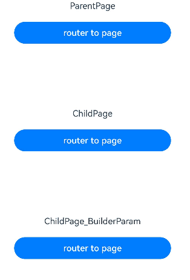

# \@BuilderParam Decorator: Referencing the \@Builder Function
<!--Kit: ArkUI-->
<!--Subsystem: ArkUI-->
<!--Owner: @zhangboren-->
<!--Designer: @zhangboren-->
<!--Tester: @TerryTsao-->
<!--Adviser: @zhang_yixin13-->

When you create a custom component and need to add specific functions (such as page redirection) to it, embedding event methods in the component will add these functions to all instances of the custom component. To solve this problem, ArkUI introduces the \@BuilderParam decorator. \@BuilderParam is used to decorate variables pointing to the \@Builder method. When initializing a custom component, you can use different methods (such as parameter modification, trailing closure, and borrowing arrow functions) to pass parameters to the custom build function decorated by \@BuilderParam. In the custom component, call \@BuilderParam to add specific functions to the component.

Before reading this topic, you are advised to read [\@Builder](./arkts-builder.md).

> **NOTE**
>
> This decorator can be used in ArkTS widgets since API version 9.
>
> This decorator can be used in atomic services since API version 11.


## Usage Rules


### Initializing \@BuilderParam Decorated Methods

An \@BuilderParam decorated method can be initialized only by an \@Builder function reference.

- Local initialization with the owning component's custom \@Builder function reference or a global \@Builder function reference

  ```ts
  @Builder
  function overBuilder() {
  }
  
  @Component
  struct Child {
    @Builder
    doNothingBuilder() {
    }
  
    // Use the custom build function of the custom component to initialize the method decorated by \@BuilderParam.
    @BuilderParam customBuilderParam: () => void = this.doNothingBuilder;
    // Use the global custom build function to initialize the method decorated by \@BuilderParam.
    @BuilderParam customOverBuilderParam: () => void = overBuilder;
  
    build() {
    }
  }
  ```

- Initialization from the parent component

  ```ts
  @Component
  struct Child {
    @Builder
    customBuilder() {
    }
  
    @BuilderParam customBuilderParam: () => void = this.customBuilder;
  
    build() {
      Column() {
        this.customBuilderParam()
      }
    }
  }

  @Entry
  @Component
  struct Parent {
    @Builder
    componentBuilder() {
      Text(`Parent builder `)
    }
  
    build() {
      Column() {
        Child({ customBuilderParam: this.componentBuilder })
      }
    }
  }
  ```
  **Figure 1** Example effect

  


- **this** in the function body must point to the correct object.

  Example:

    ```ts
    @Component
    struct Child {
      label: string = 'Child';
    
      @Builder
      customBuilder() {
      }
    
      @Builder
      customChangeThisBuilder() {
      }
    
      @BuilderParam customBuilderParam: () => void = this.customBuilder;
      @BuilderParam customChangeThisBuilderParam: () => void = this.customChangeThisBuilder;
    
      build() {
        Column() {
          this.customBuilderParam()
          this.customChangeThisBuilderParam()
        }
      }
    }

    @Entry
    @Component
    struct Parent {
      label: string = 'Parent';
    
      @Builder
      componentBuilder() {
        Text(`${this.label}`)
      }
    
      build() {
        Column() {
          // When this.componentBuilder() is called, this points to the Parent component decorated by the @Entry. That is, the value of the label variable is 'Parent'.
          this.componentBuilder()
          Child({
            // Pass this.componentBuilder to @BuilderParam customBuilderParam of the Child component. this points to the Child, that is, the value of the label variable is 'Child'.
            customBuilderParam: this.componentBuilder,
            // Pass ():void=>{this.componentBuilder()} to @BuilderParam customChangeThisBuilderParam of the Child component.
            // this of the arrow function points to the host object, so the value of the label variable is 'Parent'.
            customChangeThisBuilderParam: (): void => {
              this.componentBuilder()
            }
          })
        }
      }
    }
    ```
  **Figure 2** Example effect

  


## Constraints

- \@BuilderParam decorated variables can be initialized only by using the \@Builder function. For details, see [Initialized Value of @BuilderParam Must Be @Builder](#initialized-value-of-builderparam-must-be-builder).

- When the @Require and \@BuilderParam decorators are used together, the latter must be initialized. For details, see [Using @Require and @BuilderParam Together](#using-require-and-builderparam-together).

- In the scenario where a custom component is followed by a closure, the child component has only one \@BuilderParam to receive the closure, and the method decorated by this \@BuilderParam cannot have parameters. For details, see [Component Initialization Through Trailing Closure](#component-initialization-through-trailing-closure).

## Use Cases

### Component Initialization Through Parameters

The method decorated by \@BuilderParam must match the type of the \@Builder method it points to.

```ts
class Tmp {
  label: string = '';
}

@Builder
function overBuilder($$: Tmp) {
  Text($$.label)
    .width('100%')
    .height(50)
    .backgroundColor(Color.Green)
}

@Component
struct Child {
  label: string = 'Child';

  @Builder
  customBuilder() {
  }

  // Without parameters. The pointed customBuilder does not carry parameters either.
  @BuilderParam customBuilderParam: () => void = this.customBuilder;
  // With parameters. The pointed overBuilder also carries parameters.
  @BuilderParam customOverBuilderParam: ($$: Tmp) => void = overBuilder;

  build() {
    Column() {
      this.customBuilderParam()
      this.customOverBuilderParam({ label: 'global Builder label' })
    }
  }
}

@Entry
@Component
struct Parent {
  label: string = 'Parent';

  @Builder
  componentBuilder() {
    Text(`${this.label}`)
  }

  build() {
    Column() {
      this.componentBuilder()
      Child({ customBuilderParam: this.componentBuilder, customOverBuilderParam: overBuilder })
    }
  }
}
```
**Figure 3** Example effect


### Component Initialization Through Trailing Closure

In a custom component, the \@BuilderParam decorated attribute can be initialized using a trailing closure. During initialization, a large curly brace ({}) must be placed after the component to form a tail closure.

> **NOTE**
>
>  - In this scenario, the custom component has only one attribute decorated with \@BuilderParam.
> 
>  - In this scenario, the custom component does not support common attributes.

You can pass the content in the trailing closure to \@BuilderParam as an \@Builder decorated method.

Example 1:

```ts
@Component
struct CustomContainer {
  @Prop header: string = '';

  @Builder
  closerBuilder() {
  }

  // Use the tail closure {} (method decorated by @Builder) of the parent component to initialize the method decorated by @BuilderParam of the child component.
  @BuilderParam closer: () => void = this.closerBuilder;

  build() {
    Column() {
      Text(this.header)
        .fontSize(30)
      this.closer()
    }
  }
}

@Builder
function specificParam(label1: string, label2: string) {
  Column() {
    Text(label1)
      .fontSize(30)
    Text(label2)
      .fontSize(30)
  }
}

@Entry
@Component
struct CustomContainerUser {
  @State text: string = 'header';

  build() {
    Column() {
      // Create the CustomContainer component. During initialization, append a pair of braces ({}) to the component name to form a trailing closure.
      // Used as the parameter passed to CustomContainer @BuilderParam closer: () => void.
      CustomContainer({ header: this.text }) {
        Column() {
          specificParam('testA', 'testB')
        }.backgroundColor(Color.Yellow)
        .onClick(() => {
          this.text = 'changeHeader';
        })
      }
    }
  }
}
```
**Figure 4** Example effect


You can use the global or local \@Builder to initialize the method decorated by \@BuilderParam in the custom component decorated by \@ComponentV2 through the tail closure.

Example 2:

```ts
@ComponentV2
struct ChildPage {
  @Require @Param message: string = '';

  @Builder
  customBuilder() {
  }

  @BuilderParam customBuilderParam: () => void = this.customBuilder;

  build() {
    Column() {
      Text(this.message)
        .fontSize(30)
        .fontWeight(FontWeight.Bold)
      this.customBuilderParam()
    }
  }
}

const builder_value: string = 'Hello World';

@Builder
function overBuilder() {
  Row() {
    Text(`Global Builder: ${builder_value}`)
      .fontSize(20)
      .fontWeight(FontWeight.Bold)
  }
}

@Entry
@ComponentV2
struct ParentPage {
  @Local label: string = 'Parent Page';

  @Builder
  componentBuilder() {
    Row() {
      Text(`Local Builder:${this.label}`)
        .fontSize(20)
        .fontWeight(FontWeight.Bold)
    }
  }

  build() {
    Column() {
      ChildPage({ message: this.label }) {
        Column() { // Use the local @Builder and follow the component with a pair of braces ({}) to form a trailing closure to initialize the method decorated by @BuilderParam.
          this.componentBuilder();
        }
      }

      Line()
        .width('100%')
        .height(10)
        .backgroundColor('#000000').margin(10)
      ChildPage ({ message: this.label }) { // Use the global @Builder and follow the component with a pair of braces ({}) to form a trailing closure to initialize the method decorated by @BuilderParam.
        Column() {
          overBuilder();
        }
      }
    }
  }
}
```

### Using \@BuilderParam to Isolate the Calls of Multiple Components to the \@Builder Redirection Logic

When the system component encapsulated by \@Builder contains the redirection logic, all custom components that call \@Builder have the redirection function. To disable the redirection function of a specific component, you can use \@BuilderParam to isolate the redirection logic.

> **NOTE**
>
> In the sample code, the Navigation component is used for navigation. For details about the implementation logic, see the [Navigation](../arkts-navigation-navigation.md) guide.

```ts
import { HelloWorldPageBuilder } from './helloworld';

class navigationParams {
  pathStack: NavPathStack = new NavPathStack();
  boo: boolean = true;
}

@Builder
function navigationAction(params: navigationParams) {
  Column() {
    Navigation(params.pathStack) {
      Button('router to page', { stateEffect: true, type: ButtonType.Capsule })
        .width('80%')
        .height(40)
        .margin(20)
        .onClick(() => {
          // Modify the @BuilderParam parameter to determine whether to perform redirection.
          if (params.boo) {
            params.pathStack.pushPath({ name: 'HelloWorldPage' });
          } else {
            console.info('@BuilderParam setting does not jump');
          }
        })
    }
    .navDestination(HelloWorldPageBuilder)
    .hideTitleBar(true)
    .height('100%')
    .width('100%')
  }
  .height('25%')
  .width('100%')
}

@Entry
@Component
struct ParentPage {
  @State info: navigationParams = new navigationParams();

  build() {
    Column() {
      Text('ParentPage')
      navigationAction({ pathStack: this.info.pathStack, boo: true })
      ChildPageOne()
      ChildPage_BuilderParam({ eventBuilder: navigationAction })
    }
    .height('100%')
    .width('100%')
  }
}

@Component
struct ChildPageOne {
  @State info: navigationParams = new navigationParams();

  build() {
    Column() {
      Text('ChildPage')
      navigationAction({ pathStack: this.info.pathStack, boo: true })
    }
  }
}

@Component
struct ChildPage_BuilderParam {
  @State info: navigationParams = new navigationParams();
  @BuilderParam eventBuilder: (param: navigationParams) => void = navigationAction;

  build() {
    Column() {
      Text('ChildPage_BuilderParam')
      // Modify the transferred global @Builder parameters to disable the redirection function.
      this.eventBuilder({ pathStack: this.info.pathStack, boo: false })
    }
  }
}
```

```ts
// helloworld.ets
@Builder
export function HelloWorldPageBuilder() {
  HelloWorldPage()
}

@Component
struct HelloWorldPage {
  @State message: string = 'Hello World';
  @State pathStack: NavPathStack = new NavPathStack();

  build() {
    NavDestination() {
      Column() {
        Text(this.message)
          .fontSize(20)
          .fontWeight(FontWeight.Bold)
      }
    }
    .height('100%')
    .width('100%')
  }
}
```

**router_map.json**
This file is stored in the resources/base/profile directory of the project.
```ts
{
  "routerMap": [
    {
      "name": "HelloWorldPage",
      "buildFunction": "HelloWorldPageBuilder",
      "pageSourceFile": "src/main/ets/pages/helloworld.ets"
    }
  ]
}
```
**module.json5**
This file is located in the root directory of the application module, for example, entry/src/main/module.json5.

```ts
{
  "module": {
    "routerMap": "$profile:router_map",
    ......
  }
}   
```

**Figure 5** Example effect



### \@BuilderParam Initialization Through Global and Local \@Builder

In a custom component, the variable decorated with \@BuilderParam is used to receive the content passed by the parent component through \@Builder for initialization. Because the \@Builder of the parent component can use the arrow function to change the current this direction, the variable decorated with \@BuilderParam displays different content.

```ts
@Component
struct ChildPage {
  label: string = 'Child Page';

  @Builder
  customBuilder() {
  }

  @BuilderParam customBuilderParam: () => void = this.customBuilder;
  @BuilderParam customChangeThisBuilderParam: () => void = this.customBuilder;

  build() {
    Column() {
      this.customBuilderParam()
      this.customChangeThisBuilderParam()
    }
  }
}

const builder_value: string = 'Hello World';

@Builder
function overBuilder() {
  Row() {
    Text(`Global Builder: ${builder_value}`)
      .fontSize(20)
      .fontWeight(FontWeight.Bold)
  }
}

@Entry
@Component
struct ParentPage {
  label: string = 'Parent Page';

  @Builder
  componentBuilder() {
    Row() {
      Text(`Local Builder:${this.label}`)
        .fontSize(20)
        .fontWeight(FontWeight.Bold)
    }
  }

  build() {
    Column() {
      // When this.componentBuilder() is called, this points to the ParentPage component decorated by the @Entry. Therefore, the value of the label variable is 'Parent Page'.
      this.componentBuilder()
      ChildPage({
        // Pass this.componentBuilder to @BuilderParam customBuilderParam of the ChildPage component. this points to ChildPage, that is, the value of the label variable is 'Child Page'.
        customBuilderParam: this.componentBuilder,
        // Pass ():void=>{this.componentBuilder()} to @BuilderParam customChangeThisBuilderParam of the ChildPage component.
        // this of the arrow function points to the host object, so the value of the label variable is 'Parent Page'.
        customChangeThisBuilderParam: (): void => {
          this.componentBuilder()
        }
      })
      Line()
        .width('100%')
        .height(10)
        .backgroundColor('#000000').margin(10)
      // When the global overBuilder() is called, this points to the entire current page. Therefore, the displayed content is 'Hello World'.
      overBuilder()
      ChildPage({
        // Pass the global overBuilder to @BuilderParam customBuilderParam of the ChildPage component. this points to the entire current page, that is, the displayed content is 'Hello World'.
        customBuilderParam: overBuilder,
        // Pass the global overBuilder to @BuilderParam customChangeThisBuilderParam of the ChildPage component. this points to the entire current page, that is, the displayed content is 'Hello World'.
        customChangeThisBuilderParam: overBuilder
      })
    }
  }
}
```
**Figure 6** Example effect


### Using @BuilderParam in a @ComponentV2 Decorated Custom Component

Use the global or local @Builder to initialize the @BuilderParam attribute in the custom component decorated with @ComponentV2.

```ts
@ComponentV2
struct ChildPage {
  @Param label: string = 'Child Page';

  @Builder
  customBuilder() {
  }

  @BuilderParam customBuilderParam: () => void = this.customBuilder;
  @BuilderParam customChangeThisBuilderParam: () => void = this.customBuilder;

  build() {
    Column() {
      this.customBuilderParam()
      this.customChangeThisBuilderParam()
    }
  }
}

const builder_value: string = 'Hello World';

@Builder
function overBuilder() {
  Row() {
    Text(`Global Builder: ${builder_value}`)
      .fontSize(20)
      .fontWeight(FontWeight.Bold)
  }
}

@Entry
@ComponentV2
struct ParentPage {
  @Local label: string = 'Parent Page';

  @Builder
  componentBuilder() {
    Row() {
      Text(`Local Builder:${this.label}`)
        .fontSize(20)
        .fontWeight(FontWeight.Bold)
    }
  }

  build() {
    Column() {
      // When this.componentBuilder() is called, this points to the ParentPage component decorated by the @Entry. Therefore, the value of the label variable is 'Parent Page'.
      this.componentBuilder()
      ChildPage({
        // Pass this.componentBuilder to @BuilderParam customBuilderParam of the ChildPage component. this points to ChildPage, that is, the value of the label variable is 'Child Page'.
        customBuilderParam: this.componentBuilder,
        // Pass ():void=>{this.componentBuilder()} to @BuilderParam customChangeThisBuilderPara of the ChildPage component.
        // this of the arrow function points to the host object, so the value of the label variable is 'Parent Page'.
        customChangeThisBuilderParam: (): void => {
          this.componentBuilder()
        }
      })
      Line()
        .width('100%')
        .height(5)
        .backgroundColor('#000000').margin(10)
      // When the global overBuilder() is called, this points to the entire current page. Therefore, the displayed content is 'Hello World'.
      overBuilder()
      ChildPage({
        // Pass the global overBuilder to @BuilderParam customBuilderParam of the ChildPage component. this points to the entire current page, that is, the displayed content is 'Hello World'.
        customBuilderParam: overBuilder,
        // Pass the global overBuilder to @BuilderParam customChangeThisBuilderParam of the ChildPage component. this points to the entire current page, that is, the displayed content is 'Hello World'.
        customChangeThisBuilderParam: overBuilder
      })
    }
  }
}
```
Figure 7 Example effect


## FAQs

### UI Re-rendering Fails When Content Is Changed

When the custom component ChildPage is called, the \@Builder parameter is transferred through this.componentBuilder. this points to the internal part of the custom component. Therefore, when the value of label is changed in the parent component, ChildPage cannot detect the change.

**Incorrect Usage**

```ts
@Component
struct ChildPage {
  @State label: string = 'Child Page';

  @Builder
  customBuilder() {
  }

  @BuilderParam customChangeThisBuilderParam: () => void = this.customBuilder;

  build() {
    Column() {
      this.customChangeThisBuilderParam()
    }
  }
}

@Entry
@Component
struct ParentPage {
  @State label: string = 'Parent Page';

  @Builder
  componentBuilder() {
    Row() {
      Text(`Builder :${this.label}`)
        .fontSize(20)
        .fontWeight(FontWeight.Bold)
    }
  }

  build() {
    Column() {
      ChildPage({
        // this points to the ChildPage component.
        customChangeThisBuilderParam: this.componentBuilder
      })
      Button('Click to change label')
        .onClick(() => {
          this.label = 'Hello World';
        })
    }
  }
}
```

Use the arrow function to transfer \@Builder to the custom component ChildPage. The value of this points to the parent component ParentPage. When the value of label is changed in the parent component, ChildPage detects the change and renders the UI again.

**Correct Usage**

```ts
@Component
struct ChildPage {
  @State label: string = 'Child Page';

  @Builder
  customBuilder() {
  }

  @BuilderParam customChangeThisBuilderParam: () => void = this.customBuilder;

  build() {
    Column() {
      this.customChangeThisBuilderParam()
    }
  }
}

@Entry
@Component
struct ParentPage {
  @State label: string = 'Parent Page';

  @Builder
  componentBuilder() {
    Row() {
      Text(`Builder :${this.label}`)
        .fontSize(20)
        .fontWeight(FontWeight.Bold)
    }
  }

  build() {
    Column() {
      ChildPage({
        customChangeThisBuilderParam: () => {
          this.componentBuilder()
        }
      })
      Button('Click to change label')
        .onClick(() => {
          this.label = 'Hello World';
        })
    }
  }
}
```

### Using @Require and @BuilderParam Together

The variables decorated by the \@Require decorator need to be initialized. If the variables are not initialized, a compilation error is reported.

**Incorrect Usage**

```ts
@Builder
function globalBuilder() {
  Text('Hello World')
}

@Entry
@Component
struct CustomBuilderDemo {
  build() {
    Column() {
      // No value is assigned to ChildBuilder. An error is reported during compilation or editing.
      ChildPage()
    }
  }
}

@Component
struct ChildPage {
  @Require @BuilderParam ChildBuilder: () => void = globalBuilder;

  build() {
    Column() {
      this.ChildBuilder()
    }
  }
}
```

The variables decorated by \@Require must be initialized from external systems.

**Correct Usage**

```ts
@Builder
function globalBuilder() {
  Text('Hello World')
}

@Entry
@Component
struct CustomBuilderDemo {
  build() {
    Column() {
      ChildPage({ ChildBuilder: globalBuilder })
    }
  }
}

@Component
struct ChildPage {
  @Require @BuilderParam ChildBuilder: () => void = globalBuilder;

  build() {
    Column() {
      this.ChildBuilder()
    }
  }
}
```

### Initialized Value of @BuilderParam Must Be @Builder

When the \@State decorator is used to decorate a variable and the \@BuilderParam and ChildBuilder variables of the child component are initialized, an error message is displayed during compilation.

**Incorrect Usage**

```ts
@Builder
function globalBuilder() {
  Text('Hello World')
}

@Entry
@Component
struct CustomBuilderDemo {
  @State message: string = '';

  build() {
    Column() {
      // ChildBuilder receives the variable decorated by @State. An error is reported during compilation or editing.
      ChildPage({ ChildBuilder: this.message })
    }
  }
}

@Component
struct ChildPage {
  @BuilderParam ChildBuilder: () => void = globalBuilder;

  build() {
    Column() {
      this.ChildBuilder()
    }
  }
}
```

Use the globalBuilder() method decorated by the global \@Builder to initialize the ChildBuilder variable decorated by the \@BuilderParam of the child component. No error is reported during compilation, and the function is normal.

**Correct Usage**

```ts
@Builder function globalBuilder() {
  Text('Hello World')
}
@Entry
@Component
struct CustomBuilderDemo {
  build() {
    Column() {
      ChildPage({ChildBuilder: globalBuilder})
    }
  }
}

@Component
struct ChildPage {
  @BuilderParam ChildBuilder: () => void = globalBuilder;
  build() {
    Column() {
      this.ChildBuilder()
    }
  }
}
```
