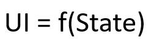
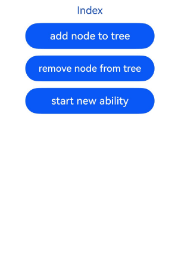

# Creating a Custom Component

<!--Kit: ArkUI-->
<!--Subsystem: ArkUI-->
<!--Owner: @jiyujia926; @xin11112-->
<!--Designer: @zhangboren-->
<!--Tester: @TerryTsao-->
<!--Adviser: @zhang_yixin13-->
<!-- md-trans-meta sourceCommit=3efb4ba336409dd0731ba011e1e227786db57fa2 translatedAt=2026-07-22T02:01:19.975Z pushedAt=2026-07-22T06:47:45.774Z -->

In ArkUI, components refer to the elements displayed on the UI. They fall into two categories: built-in components (provided by the ArkUI framework out of the box) and custom components (defined by developers). When developing UIs, you need to not only combine and use system components, but also consider factors such as code reusability, separation of business logic from the UI, and future version evolution. Creating custom components, which encapsulate UI elements and service logic, serves as a critical step in achieving this goal.

Custom components offer the following features:

- Combinability: You can combine built-in components and other components, as well as their attributes and methods.

- Reusability: Custom components can be reused across different components, serving as distinct instances in various parent components or containers.

- Data-driven update: When these state variables change, UI re-rendering is triggered.

>**NOTE**
>
>Starting from API version 24, you can enable custom components to support cross-[Ability](../../reference/apis-ability-kit/js-apis-app-ability-ability.md) migration by configuring the [metadata](./../../quick-start/module-configuration-file.md#metadata) in the [module.json5 configuration file](./../../quick-start/module-configuration-file.md) of your application project. The configuration method is as follows: Add [name](./../../quick-start/module-configuration-file.md#metadata) as **enableCustomComponentCrossAbility** and [value](./../../quick-start/module-configuration-file.md#metadata) as **true**. Since custom components provide UIAbility, the term ability here specifically refers to [UIAbility](../../reference/apis-ability-kit/js-apis-app-ability-uiAbility.md). For details, see [Cross-Ability Migration of Custom Components](#cross-ability-migration-of-custom-components).

## Basic Usage of Custom Components

The following example shows the basic usage of a custom component.

<!-- @[HelloComponent_Hello](https://gitcode.com/openharmony/applications_app_samples/blob/master/code/DocsSample/ArkUISample/createCustomComponents/entry/src/main/ets/component/ParentComponent.ets) -->  

``` TypeScript
@Component
struct HelloComponent {
  @State message: string = 'Hello, World!';

  build() {
    // The HelloComponent custom component combines the Row and Text built-in components.
    Row() {
      Text(this.message)
        .fontSize(20)
        .margin(10)
        .onClick(() => {
          // The change of the state variable message drives the UI to be re-rendered. As a result, the text changes from "Hello, World!" to "Hello, ArkUI!".
          this.message = 'Hello, ArkUI!';
        })
    }
    .height('100%')
  }
}
```

> **NOTE**
>
> To reference a custom component in another file, use the keyword **export** to export the component and then use **import** to import it to the target file.

Multiple **HelloComponent** instances can be created in **build()** of other custom components. In this way, **HelloComponent** is reused across those components.

<!-- @[ArkUI_message](https://gitcode.com/openharmony/applications_app_samples/blob/master/code/DocsSample/ArkUISample/createCustomComponents/entry/src/main/ets/component/ParentComponent.ets) -->   

``` TypeScript
@Entry
@Component
struct ParentComponent {
  build() {
    Column() {
      // Create HelloComponent multiple times to reuse the custom component.
      Text('ArkUI message')
        .fontSize(20)
        .margin(10)
      HelloComponent({ message: 'Hello World!' })
      Divider()
      HelloComponent({ message: 'Hello ArkTS!' })
    }
    .width('100%')
  }
}
```


To fully understand the preceding example, a knowledge of the following concepts is essential:

- [Creating a Custom Component](#creating-a-custom-component)
  - [Basic Usage of Custom Components](#basic-usage-of-custom-components)
  - [Basic Structure of a Custom Component](#basic-structure-of-a-custom-component)
    - [struct](#struct)
    - [@Entry](#entry)
    - [@Component](#component)
    - [@ComponentV2](#componentv2)
    - [build()](#build)
    - [@Reusable](#reusable)
    - [@ReusableV2](#reusablev2)
  - [Member Functions/Variables](#member-functionsvariables)
  - [Rules for Custom Component Parameters](#rules-for-custom-component-parameters)
  - [build() Implementation Rules](#build-implementation-rules)
  - [Universal Style of a Custom Component](#universal-style-of-a-custom-component)
  - [Cross-Ability Migration of Custom Components](#cross-ability-migration-of-custom-components)
  - [Constraints](#constraints)
    - [V1 Custom Components Do Not Support Static Code Blocks](#v1-custom-components-do-not-support-static-code-blocks)
    - [Mixing @Component and @ComponentV2](#mixing-component-and-componentv2)

## Basic Structure of a Custom Component

### struct

The definition of a custom component must start with the \@Component struct followed by the component name, and then component body enclosed by curly brackets. No inheritance is allowed. You can omit the **new** operator when instantiating a struct.

  > **NOTE**
  >
  > The name assigned to a class, function, or custom component must be different from the name of any built-in component.

### \@Entry

A custom component decorated with [@Entry](../../reference/apis-arkui/arkui-ts/ts-universal-entry.md#entry) serves as the entry to a [UI page](../arkts-router-to-navigation.md#page-structure). A single UI page can have only one @Entry decorated custom component as the page entry.

  > **NOTE**
  >
  > This decorator can be used in ArkTS widgets since API version 9.
  >
  > Since API version 10, the \@Entry decorator accepts an optional [LocalStorage](../../reference/apis-arkui/arkui-ts/ts-state-management.md#localstorage9) parameter or an optional EntryOptions<sup>10+</sup> parameter.
  >
  > This decorator can be used in atomic services since API version 11.

  <!-- @[Entry_UI_page](https://gitcode.com/openharmony/applications_app_samples/blob/master/code/DocsSample/ArkUISample/createCustomComponents/entry/src/main/ets/component/Entry.ets) -->  

  ``` TypeScript
  @Entry
  @Component
  struct MyComponent {
    // ...
  }
  ```

**EntryOptions<sup>10+</sup>**

  Describes the named route options.

  <!--Table: 20%; 20%; 10%; 10%; 40%-->

  | Name  | Type  | Read-Only| Optional| Description                                                        |
  | ------ | ------ | ---- | ------------------------------------------------------------ | ------------------------------------------------------------ |
  | routeName | string | No| Yes| Name of the target named route.|
  | storage | [LocalStorage](arkts-localstorage.md) | No| Yes| Storage of the page-level UI state. If no value is passed, the framework creates a new LocalStorage instance as the default value.|
  | useSharedStorage<sup>12+</sup> | boolean | No| Yes| Whether to use the LocalStorage instance passed by [loadContent](../../reference/apis-arkui/arkts-apis-window-WindowStage.md#loadcontent9). The default value is **false**. **true**: Use the shared [LocalStorage](arkts-localstorage.md) instance. **false**: Do not use the shared [LocalStorage](arkts-localstorage.md) instance.|

  > **NOTE**
  >
  > When **useSharedStorage** is set to **true** and **storage** is assigned a value, the value of **useSharedStorage** has a higher priority.

  <!-- @[routeName_myPage](https://gitcode.com/openharmony/applications_app_samples/blob/master/code/DocsSample/ArkUISample/createCustomComponents/entry/src/main/ets/component/RouteName.ets) -->  

  ``` TypeScript
  @Entry({ routeName: 'myPage' })
  @Component
  struct MyComponent {
    // ...
  }
  ```

### \@Component

A struct decorated with [@Component](../../reference/apis-arkui/arkui-ts/ts-custom-component-decorator-component.md#component) is a V1 custom component, which can use the capabilities of [state management V1](./arkts-state-management-overview.md#state-management-v1) decorators.

  > **NOTE**
  >
  > This decorator can be used in ArkTS widgets since API version 9.
  > 
  > Since API version 11, \@Component can accept a [ComponentOptions parameter](../../reference/apis-arkui/arkui-ts/ts-custom-component-parameter.md#componentoptions).
  >
  > This decorator can be used in atomic services since API version 11.

  <!-- @[Component_data_structure](https://gitcode.com/openharmony/applications_app_samples/blob/master/code/DocsSample/ArkUISample/createCustomComponents/entry/src/main/ets/component/Component.ets) -->   

  ``` TypeScript
  @Component
  struct MyComponent {
    // ...
  }
  ```

### \@ComponentV2

A struct decorated with [@ComponentV2](../../reference/apis-arkui/arkui-ts/ts-custom-component-decorator-componentv2.md#componentv2) is a V2 custom component, which can use the capabilities of [state management V2](./arkts-state-management-overview.md#state-management-v2) decorators.
> **NOTE**
>
> The @ComponentV2 decorator is supported since API version 12.
>
> Since API version 12, this decorator is supported in atomic services.
>
> Since API version 23, this decorator is supported in ArkTS widgets.

Similar to the [\@Component decorator](#component), the @ComponentV2 decorator decorates custom components with the following specifications:

- In custom components decorated with \@ComponentV2, only new state variable decorators can be used, including [\@Local](arkts-new-local.md), [\@Param](arkts-new-param.md), [\@Once](arkts-new-once.md), [\@Event](arkts-new-event.md), [\@Provider](arkts-new-provider-and-consumer.md), and [\@Consumer](arkts-new-provider-and-consumer.md).

- Custom components decorated with \@ComponentV2 do not support existing component capabilities such as [LocalStorage](arkts-localstorage.md).

- \@ComponentV2 and \@Component cannot be used on the same struct.

- \@ComponentV2 supports an optional [ComponentOptions parameter](../../reference/apis-arkui/arkui-ts/ts-custom-component-parameter.md#componentoptions) to implement the [component freezing function](arkts-custom-components-freezeV2.md).

- A basic \@ComponentV2 decorated custom component should contain the following parts:

    <!-- @[ComponentV2_page_componentV2](https://gitcode.com/openharmony/applications_app_samples/blob/master/code/DocsSample/ArkUISample/wrapbuilder/entry/src/main/ets/pages/PageComponentV2.ets) -->  

    ``` TypeScript
    @Entry
    @ComponentV2 // Decorator
    struct ComponentV2Test { // Struct-declared data structure
      @Local message: string = 'Hello World';
      build() { // UI defined in build
        RelativeContainer() {
          Text(this.message)
            .id('HelloWorld')
            // Replace $r('app.float.page_text_font_size') with the resource file you use.
            .fontSize($r('app.float.page_text_font_size'))
            .fontWeight(FontWeight.Bold)
            .alignRules({
              center: { anchor: '__container__', align: VerticalAlign.Center },
              middle: { anchor: '__container__', align: HorizontalAlign.Center }
            })
            .onClick(() => {
              this.message = 'Welcome';
            })
        }
        .height('100%')
        .width('100%')
      }
    }
    ```


Unless otherwise specified, a custom component decorated with \@ComponentV2 maintains the same behavior as a custom component decorated with \@Component.

### build()

The **build()** function is used to define the declarative UI description of a custom component. Every custom component must define a **build()** function.

  <!-- @[Declarative_UI_description](https://gitcode.com/openharmony/applications_app_samples/blob/master/code/DocsSample/ArkUISample/createCustomComponents/entry/src/main/ets/component/BuildFunction.ets) -->   

  ``` TypeScript
  @Component
  struct MyComponent {
    build() {
      // ...
    }
  }
  ```

### \@Reusable

Using @Reusable to decorate V1 custom components makes them reusable. For details, see [\@Reusable Decorator: Reusing Components](./arkts-reusable.md#use-scenarios).

  > **NOTE**
  >
  > This decorator can be used in ArkTS widgets since API version 10.

  <!-- @[Reusable_MyComponent](https://gitcode.com/openharmony/applications_app_samples/blob/master/code/DocsSample/ArkUISample/createCustomComponents/entry/src/main/ets/component/Reusable.ets) --> 

  ``` TypeScript
  @Reusable
  @Component
  struct MyComponent {
    // ...
  }
  ```

### \@ReusableV2

Using \@ReusableV2 to decorate V2 custom components makes them reusable. For details, see [\@Reusable V2 Decorator: Reusing V2 Components](./arkts-new-reusableV2.md#use-cases).

  > **NOTE**
  >
  > This decorator can be used in atomic services since API version 18.

  ``` TypeScript
  @ReusableV2
  @ComponentV2
  struct MyComponent {
    // ...
  }
  ```

## Member Functions/Variables

In addition to the mandatory **build()**, a custom component may implement other member functions with the following restrictions:

- Member functions of a custom component can only be accessed from within the component. Avoid declaring them as static functions.

A custom component can also implement member variables with the following restrictions:

- Member variables of a custom component can only be accessed from within the component. Avoid declaring them as static variables.

- Local initialization is optional for some member variables and mandatory for others. For details about whether local initialization or initialization from the parent component is required, see [State Management](arkts-state-management-overview.md).

## Rules for Custom Component Parameters

The initialization rules for member variables of a custom component vary depending on the decorator used. The rules for each decorator are shown in the following table.

**Initialization Rules for @Component Member Variables**

| Variable Type | Local Initialization | Passed from Parent Component |
|---------|-----------|-------------|
| Regular variable | Mandatory | Optional. If a non-**undefined** value is passed, the passed value is used; otherwise, the local default value is used. |
| [@State](arkts-state.md) | Mandatory | Optional. If a non-**undefined** value is passed, the passed value is used; otherwise, the local default value is used. |
| [@Prop](arkts-prop.md) | Optional | Optional. Mandatory when no local default value is provided. If a non-**undefined** value is passed, the passed value is used; otherwise, the local default value is used. |
| [@Link](arkts-link.md) | Not supported | Mandatory. A state variable must be passed. |
| [@ObjectLink](arkts-observed-and-objectlink.md) | Not supported | Mandatory. An instance of a class decorated with [@Observed](arkts-observed-and-objectlink.md) must be passed (complex types can be passed since API version 19). |
| [@Provide](arkts-provide-and-consume.md) | Mandatory | Optional. If a non-undefined value is passed, the passed value is used; otherwise, the local default value is used. |
| [@Consume](arkts-provide-and-consume.md) | Not supported (optional since API version 20) | Not supported. Initialized by matching @Provide via alias or variable name. |
| [@StorageProp](arkts-appstorage.md) | Mandatory | Not supported. Initialized via the corresponding key in [AppStorage](arkts-appstorage.md). |
| [@StorageLink](arkts-appstorage.md) | Mandatory | Not supported. Initialized via the corresponding key in [AppStorage](arkts-appstorage.md). |
| [@LocalStorageProp](arkts-localstorage.md) | Mandatory | Not supported. Initialized via the corresponding key in [LocalStorage](arkts-localstorage.md). |
| [@LocalStorageLink](arkts-localstorage.md) | Mandatory | Not supported. Initialized via the corresponding key in [LocalStorage](arkts-localstorage.md). |

**Initialization Rules for @ComponentV2 Member Variables**

| Variable Type | Local Initialization | Passed from Parent Component |
|---------|-----------|-------------|
| Regular variable | Mandatory | Not supported. |
| [@Local](arkts-new-local.md) | Mandatory | Not supported. |
| [@Param](arkts-new-param.md) | Optional | Optional. Mandatory when no local default value is provided. If a value is passed, the passed value is used; otherwise, the local default value is used. |
| [@Event](arkts-new-event.md) | Optional | Optional. When no local default value is provided and no value is passed from the parent component, an empty function is automatically generated as the default callback. |
| [@Provider](arkts-new-provider-and-consumer.md) | Mandatory | Not supported. |
| [@Consumer](arkts-new-provider-and-consumer.md) | Mandatory | Not supported. Initialized by matching @Provider via alias or variable name. |

The following example uses a regular variable to demonstrate how to initialize parameters of a custom component in the build method. For usage examples of other decorators, refer to their respective documentation.

<!-- @[Parameter_specification](https://gitcode.com/openharmony/applications_app_samples/blob/master/code/DocsSample/ArkUISample/createCustomComponents/entry/src/main/ets/component/ParameterSpecification.ets) -->  

``` TypeScript
@Component
struct MyComponent {
  countDownFrom: number = 0;
  color: Color = Color.Blue;

  build() {
    Column() {
      Text(`${this.countDownFrom}`)
        .fontSize(20)
        .margin(10)
        .backgroundColor(this.color)
    }
    .width('100%')
  }
}

@Entry
@Component
struct ParentComponent {
  private someColor: Color = Color.Pink;

  build() {
    Column() {
      // Create an instance of MyComponent and initialize its countDownFrom variable with the value 10 and its color variable with the value this.someColor.
      MyComponent({ countDownFrom: 10, color: this.someColor })
    }
    .width('100%')
  }
}
```


In the following example, a function in the parent component is passed to the child component and called therein.

<!-- @[Function_passing](https://gitcode.com/openharmony/applications_app_samples/blob/master/code/DocsSample/ArkUISample/createCustomComponents/entry/src/main/ets/component/ParentFunction.ets)  --> 

``` TypeScript
@Entry
@Component
struct Parent {
  @State cnt: number = 0;
  submit: () => void = () => {
    this.cnt++;
  };

  build() {
    Column() {
      Text(`${this.cnt}`)
        .fontSize(20)
        .margin(10)
      // Pass the function in the parent component to the child component.
      Son({ submitArrow: this.submit })
    }
    .width('100%')
  }
}

@Component
struct Son {
  submitArrow?: () => void;

  build() {
    Row() {
      Button('add')
        .width(300)
        .margin(10)
        .onClick(() => {
          if (this.submitArrow) {
            this.submitArrow()
          }
        })
    }
    .height('100%')
  }
}
```


## build() Implementation Rules

Whatever declared in **build()** are called UI descriptions. UI descriptions must comply with the following rules:

- For an @Entry decorated custom component, exactly one root node is required under the **build()** function, and it must be a container component. **ForEach** is not allowed as the root node. For an @Component decorated custom component, exactly one root node is required under the **build()** function, and it can be a non-container component. **ForEach** is not allowed as the root node.

  <!-- @[build_function](https://gitcode.com/openharmony/applications_app_samples/blob/master/code/DocsSample/ArkUISample/createCustomComponents/entry/src/main/ets/component/MyComponentBuild.ets) --> 

  ``` TypeScript
  @Entry
  @Component
  struct MyComponent {
    build() {
      // Exactly one root component is required, and it must be a container component.
      Row() {
        ChildComponent()
      }
      .height('100%')
    }
  }
  
  @Component
  struct ChildComponent {
    build() {
      // Exactly one root component is required, and it is not necessarily a container component.
      // Replace $r('app.media.startIcon') with the actual resource file.
      Image($r('app.media.startIcon'))
    }
  }
  ```

- Local variable declaration is not allowed. The following example should be avoided:

  ```ts
  build() {
    // Avoid: declaring a local variable.
    let num: number = 1;
  }
  ```

- **console.info** can be used in the UI description only when it is in a method or function. The following example should be avoided:

  ```ts
  build() {
    // Avoid: using console.info directly in UI description.
    console.info('print debug log');
  }
  ```

- Creation of a local scope is not allowed. The following example should be avoided:

  ```ts
  build() {
    // Avoid: creating a local scope.
    {
      // ...
    }
  }
  ```

- Calling a method not decorated by \@Builder is not allowed. However, the return value of such methods can be used as parameters of system components. Refer to the code snippet below.

  ```ts
  @Component
  struct ParentComponent {
    doSomeCalculations() {
    }
    build() {
      Column() {
        // Avoid: calling a method not decorated by @Builder.
        this.doSomeCalculations();
      }
    }
  }
  ```

  <!-- @[Builder_decoration](https://gitcode.com/openharmony/applications_app_samples/blob/master/code/DocsSample/ArkUISample/createCustomComponents/entry/src/main/ets/component/BuilderMethod.ets) -->  

  ``` TypeScript
  @Component
  struct ParentComponent {
    calcTextValue(): string {
      return 'Hello World';
    }
  
    @Builder
    doSomeRender() {
      Text(`Hello World`)
        .fontSize(20)
        .margin(10)
    }
  
    build() {
      Column() {
        // Prefer: Call a @Builder decorated method.
        this.doSomeRender()
        // Prefer: Pass the return value of a TS method as the parameter.
        Text(this.calcTextValue())
          .fontSize(20)
          .margin(10)
      }
      .width('100%')
    }
  }
  ```

- The **switch** syntax is not allowed. If conditional judgment is required, use the [if](../rendering-control/arkts-rendering-control-ifelse.md) statement. Refer to the code snippet below.

  ```ts
  build() {
    Column() {
      // Avoid: using the switch syntax.
      switch (expression) {
        case 1:
          Text('...')
            .fontSize(20)
            .margin(10)
          break;
        case 2:
          Image('...')
          break;
        default:
          Text('...')
            .fontSize(20)
            .margin(10)
          break;
      }
    }
    .width('100%')
  }
  ```

  <!-- @[switch_syntax](https://gitcode.com/openharmony/applications_app_samples/blob/master/code/DocsSample/ArkUISample/createCustomComponents/entry/src/main/ets/component/If.ets) -->  

  ``` TypeScript
  build() {
    Column() {
      // Correct usage: Use if.
      if (this.expression == 1) {
        Text('...')
      } else if (this.expression == 2) {
        Image('...')
      } else {
        Text('...')
      }
    }
  }
  ```

- Expressions are not allowed. Use the **if** component instead. Refer to the code snippet below.

  ```ts
  build() {
    Column() {
      // Avoid: expressions.
      (this.aVar > 10) ? Text('...') : Image('...')
    }
  }
  ```

  <!-- @[if_component](https://gitcode.com/openharmony/applications_app_samples/blob/master/code/DocsSample/ArkUISample/createCustomComponents/entry/src/main/ets/component/ModuleComponent.ets) -->  

  ``` TypeScript
  build() {
    Column() {
      // Positive example: Use if for judgment.
      if (this.aVar > 10) {
        Text('...')
      } else {
        Image('...')
      }
    }
  }
  ```

- Directly changing a state variable is not allowed. The following example should be avoided.

  ```ts
  @Component
  struct MyComponent {
    @State textColor: Color = Color.Yellow;
    @State columnColor: Color = Color.Green;
    @State count: number = 1;
    build() {
      Column() {
        // Avoid directly changing the value of count in the Text component.
        Text(`${this.count++}`)
          .width(50)
          .height(50)
          .fontColor(this.textColor)
          .onClick(() => {
            this.columnColor = Color.Red;
          })
        Button("change textColor").onClick(() =>{
          this.textColor = Color.Pink;
        })
      }
      .backgroundColor(this.columnColor)
    }
  }
  ```

  In ArkUI state management, UI re-render is driven by state.



Therefore, state variables must not be directly modified in the **build()** function or @Builder method of a custom component, as this may cause the risk of cyclic re-rendering. ``Text(`${this.count++}`)`` has different effects under full update and minimal update:

- Full update (API version 8 and earlier): ArkUI may fall into an infinite re-rendering loop, because each rendering of the **Text** component changes the app state, which triggers the next round of rendering. When `this.columnColor` changes, the entire **build()** function is executed. Consequently, the text bound to ``Text(`${this.count++}`)`` also changes. Each re-rendering of ``Text(`${this.count++}`)`` updates the `this.count` state variable, leading to a new round of **build()** execution, thus causing an infinite loop.

- Minimal update (API version 9 and later): When `this.columnColor` is updated, only the **Column** component is updated, and the **Text** component is not updated. Only when `this.textColor` changes is the entire **Text** component updated, and all its attribute functions are executed. Therefore, ``Text(`${this.count++}`)`` is observed to increment. Since the UI is currently updated on a per-component basis, if an attribute of a component changes, the entire component is updated. The overall update chain is: `this.textColor = Color.Pink` → the entire Text component is updated → `this.count++` → the entire Text component is updated again. Note that this approach causes the Text component to be rendered twice during the initial rendering, which affects performance.

The behavior of modifying the app state in the **build()** function may be more subtle than the example above, for instance:

- Modifying state variables within @Builder, [@Extend](arkts-extend.md), or [@Styles](arkts-style.md) methods.

- Modifying app state variables in functions called during parameter computation, for example, ``Text(`${this.calcLabel()}`)``.

- Modifying the current array: **sort()** changes the array **this.arr**, and the subsequent **filter()** method returns a new array.

    ```ts
    // Incorrect usage:
    @State arr : Array<...> = [ ... ];
    ForEach(this.arr.sort().filter(...), 
      item => { 
      // ...
    })
    ```

    ``` TypeScript
    // Prefer: Call filter before sort() to return a new array. In this way, sort() does not change this.arr.
    ForEach(this.arr.filter((item, index) => index >= 2).sort(),
      (item: number) => {
        // ...
      });
    ```

  To address this issue, see FAQs [appfreeze Due to State Variable Changes in the build Function](./arkts-state-management-faq-inner-component.md#appfreeze-due-to-state-variable-changes-in-the-build-function)

## Universal Style of a Custom Component

The universal style of a custom component is configured by the chain call.

<!-- @[Custom_style](https://gitcode.com/openharmony/applications_app_samples/blob/master/code/DocsSample/ArkUISample/createCustomComponents/entry/src/main/ets/component/MyComponentStyle.ets) -->   

``` TypeScript
@Component
struct ChildComponent {
  build() {
    Button(`Hello World`)
      .width('90%')
      .margin(10)
  }
}

@Entry
@Component
struct MyComponent {
  build() {
    Row() {
      / / Property settings to the ChildComponent instead of Button in ChildComponent.
      ChildComponent()
        .width(300)
        .height(300)
        .backgroundColor(Color.Pink)
    }
    .height('100%')
  }
}
```


> **NOTE**
>
> When ArkUI applies styles to a custom component, it is equivalent to wrapping **ChildComponent** with an invisible container component. These styles are set on the container component, not directly on the **Button** component of **ChildComponent**. The rendering result shows that the pink background color is not directly applied to the **Button**, but to the invisible container component where the **Button** resides.

## Cross-Ability Migration of Custom Components

Before API version 24, custom components did not support cross-ability migration. After a custom component instance moved across abilities, changing its state variables would not trigger a UI component refresh. Note that before the system is upgraded to API version 24, even if **enableCustomComponentCrossAbility** is set to **true** in **module.json5**, this feature will not take effect.

Starting from API version 24, you can enable custom components to support cross-ability migration by configuring the **metadata** tag in the **module.json5** configuration file of your application project. The configuration method is as follows.

<!-- @[EnableCustomComponentCrossAbility_config](https://gitcode.com/openharmony/applications_app_samples/blob/master/code/DocsSample/ArkUISample/EnableCustomComponentCrossAbility/entry/src/main/module.json5) -->  

``` JSON5
"metadata": [
  {
    "name": "enableCustomComponentCrossAbility",
    "value": "true"
  }
]
```

Note:

1. You are not advised to asynchronously modify state variables in a migrating component during the **onBackground** phase of the original ability. At that time, state variables can be assigned, but the refresh of associated components will not be triggered.

2. Only custom components in the component tree can be migrated. Custom components that are not attached to the component tree will not be migrated. For example, in scenarios where [OH_ArkUI_GetNodeHandleFromNapiValue](../../reference/apis-arkui/capi-native-node-napi-h.md#oh_arkui_getnodehandlefromnapivalue) is used to obtain an [ArkUI_NodeHandle](../../reference/apis-arkui/capi-arkui-nativemodule-arkui-node8h.md), if the parameter received by **OH_ArkUI_GetNodeHandleFromNapiValue** is [ComponentContent](../../reference/apis-arkui/js-apis-arkui-ComponentContent.md), the obtained **ArkUI_NodeHandle** is the first [FrameNode](../../reference/apis-arkui/js-apis-arkui-frameNode.md) node in the subtree of **ComponentContent**. Custom components skipped in between are not in the component tree and cannot be migrated.

<!-- @[EnableCustomComponentCrossAbility_EntryAbility](https://gitcode.com/openharmony/applications_app_samples/blob/master/code/DocsSample/ArkUISample/EnableCustomComponentCrossAbility/entry/src/main/ets/entryability/EntryAbility.ets) -->  

``` TypeScript
import { UIAbility } from '@kit.AbilityKit';
import { hilog } from '@kit.PerformanceAnalysisKit';
import { window } from '@kit.ArkUI';

const DOMAIN = 0x0000;

export default class EntryAbility extends UIAbility {
  onWindowStageCreate(windowStage: window.WindowStage): void {
    windowStage.loadContent('pages/Index', (err) => {
      if (err.code) {
        hilog.error(DOMAIN, 'testTag', 'Failed to load the content. Cause: %{public}s', JSON.stringify(err));
        return;
      }
      hilog.info(DOMAIN, 'testTag', 'Succeeded in loading the content.');
    });
  }

  onBackground(): void {
    // You are not advised to asynchronously modify the state variable in the component to be migrated in the onBackground phase.
    hilog.info(DOMAIN, 'testTag', '%{public}s', 'Ability onBackground');
  }
}
```

In the following example:

1. Click **Button('add node to tree')** to create a **BuilderNode** and mount it to **NodeContainer**.

2. Click **Button('remove node from tree')** to remove the **BuilderNode** from **NodeContainer**.

3. Click **Button('start new ability')** to start the ExtraAbility.

4. Click **Button('add node to tree')** in **ExtraIndex** to mount the **BuilderNode** to the **NodeContainer** in the **ExtraIndex**.

   - When the custom component **ComponentUnderBuilderNode** is mounted to a new ability, it instructs the custom component of the ability to update the ID of the ability instance to which it belongs.

   - Click **Button('change message')** in the custom component **ComponentUnderBuilderNode** to change the value of the state variable **message**, which triggers the **@Watch('messageUpdate')** callback and UI refresh.

The following example includes the process of creating a new ability. For details, see [startAbility](../../reference/apis-ability-kit/js-apis-inner-application-uiAbilityContext.md#startability).

<!-- @[EnableCustomComponentCrossAbility_Index](https://gitcode.com/openharmony/applications_app_samples/blob/master/code/DocsSample/ArkUISample/EnableCustomComponentCrossAbility/entry/src/main/ets/pages/Index.ets) -->  

``` TypeScript
import { MyNodeController } from './MyNodeController';
import { hilog } from '@kit.PerformanceAnalysisKit';
import { common, Want } from '@kit.AbilityKit';
import { BusinessError } from '@kit.BasicServicesKit';

const DOMAIN = 0x0000;

@Entry
@Component
struct Index {
  private nodeController: MyNodeController = new MyNodeController();

  startNewAbility() {
    const want: Want = {
      bundleName: 'com.example.enablecustomcomponentcrossability',
      abilityName: 'ExtraAbility'
    };

    try {
      const context = this.getUIContext()?.getHostContext() as common.UIAbilityContext;
      context.startAbility(want, (err: BusinessError) => {
        if (err.code) {
          hilog.error(DOMAIN, 'testTag', `startAbility failed, code is ${err.code}, message is ${err.message}`);
          return;
        }
        hilog.info(DOMAIN, 'testTag', 'startAbility succeed');
      });
    } catch (err) {
      hilog.error(DOMAIN, 'testTag',
        `startAbility failed, code is ${(err as BusinessError).code}, message is ${(err as BusinessError).message}`);
    }
  }

  build() {
    Column({ space: 10 }) {
      Text('Index')
      // Create a globalBuilderNode and mount its nodes to the placeholder node of NodeContainer.
      Button('add node to tree').width(200).onClick(() => {
        this.nodeController.addBuilderNode();
      })
      // Remove the nodes of globalBuilderNode from the placeholder node of NodeContainer.
      Button('remove node from tree').width(200).onClick(() => {
        this.nodeController.removeBuilderNode();
      })
      // Start a new ability.
      Button('start new ability').width(200).onClick(() => {
        this.startNewAbility();
      })
      NodeContainer(this.nodeController).backgroundColor('#FFEEF0')
    }
    .width('100%')
    .height('100%')
  }
}
```

<!-- @[EnableCustomComponentCrossAbility_MyNodeController](https://gitcode.com/openharmony/applications_app_samples/blob/master/code/DocsSample/ArkUISample/EnableCustomComponentCrossAbility/entry/src/main/ets/pages/MyNodeController.ets) -->  

``` TypeScript
import { BuilderNode, FrameNode, NodeController } from '@kit.ArkUI';
import { hilog } from '@kit.PerformanceAnalysisKit';

const DOMAIN = 0x0000;

let globalBuilderNode: BuilderNode<[]> | undefined = undefined;

export class MyNodeController extends NodeController {
  private rootNode: FrameNode | null = null;
  private uiContext: UIContext | null = null;

  makeNode(uiContext: UIContext): FrameNode | null {
    this.rootNode = new FrameNode(uiContext);
    this.uiContext = uiContext;
    return this.rootNode;
  }

  addBuilderNode(): void {
    if (!globalBuilderNode && this.uiContext) {
      globalBuilderNode = new BuilderNode(this.uiContext);
      globalBuilderNode.build(wrapBuilder<[]>(buildComponent), undefined);
    }
    if (this.rootNode && globalBuilderNode) {
      this.rootNode.appendChild(globalBuilderNode.getFrameNode());
    }
  }

  removeBuilderNode(): void {
    if (this.rootNode && globalBuilderNode) {
      this.rootNode.removeChild(globalBuilderNode.getFrameNode());
    }
  }

  disposeNode(): void {
    if (this.rootNode && globalBuilderNode) {
      globalBuilderNode.dispose();
      globalBuilderNode = undefined;
    }
  }
}

@Builder
function buildComponent() {
  Column() {
    ComponentUnderBuilderNode()
  }
}

@Component
struct ComponentUnderBuilderNode {
  @State @Watch('messageUpdate') message: string = 'hello';

  messageUpdate() {
    hilog.info(DOMAIN, 'testTag', `ComponentUnderBuilderNode message change ${this.message}`);
  }

  build() {
    Column() {
      Text(`message: ${this.message}`)
      // Change the value of message to trigger the @Watch ('messageUpdate') callback and refresh the Text component.
      Button('change message').onClick(() => {
        this.message += ' world';
      })
    }
  }
}
```

<!-- @[EnableCustomComponentCrossAbility_ExtraAbility](https://gitcode.com/openharmony/applications_app_samples/blob/master/code/DocsSample/ArkUISample/EnableCustomComponentCrossAbility/entry/src/main/ets/extraability/ExtraAbility.ets) -->   

``` TypeScript
import { UIAbility } from '@kit.AbilityKit';
import { hilog } from '@kit.PerformanceAnalysisKit';
import { window } from '@kit.ArkUI';

const DOMAIN = 0x0000;

export default class ExtraAbility extends UIAbility {

  onWindowStageCreate(windowStage: window.WindowStage): void {
    windowStage.loadContent('pages/ExtraIndex', (err) => {
      if (err.code) {
        // If ExtraIndex fails to be loaded, an error message is displayed.
        hilog.error(DOMAIN, 'testTag', 'Failed to load the content. Cause: %{public}s', JSON.stringify(err));
        return;
      }
      hilog.info(DOMAIN, 'testTag', 'Succeeded in loading the content.');
    });
  }
}
```

<!-- @[EnableCustomComponentCrossAbility_ExtraIndex](https://gitcode.com/openharmony/applications_app_samples/blob/master/code/DocsSample/ArkUISample/EnableCustomComponentCrossAbility/entry/src/main/ets/pages/ExtraIndex.ets) -->  

``` TypeScript
import { MyNodeController } from './MyNodeController';

@Entry
@Component
struct ExtraIndex {
  private nodeController: MyNodeController = new MyNodeController();

  build() {
    Column({ space: 10 }) {
      Text('ExtraIndex')
      // Attach the nodes under globalBuilderNode as children of the placeholder node of NodeContainer.
      Button('add node to tree').width(200).onClick(() => {
        this.nodeController.addBuilderNode();
      })
      // Remove the nodes of globalBuilderNode from the placeholder node of NodeContainer.
      Button('remove node from tree').width(200).onClick(() => {
        this.nodeController.removeBuilderNode();
      })
      // Destroy nodes under globalBuilderNode.
      Button('dispose node').width(200).onClick(() => {
        this.nodeController.disposeNode();
      })
      NodeContainer(this.nodeController).backgroundColor('#FFEEF0')
    }
    .width('100%')
    .height('100%')
  }
}
```



## Constraints

### V1 Custom Components Do Not Support Static Code Blocks

Static code blocks are used to initialize static attributes.

- When you write static code blocks in a custom component decorated with \@Component or \@CustomDialog, the code will not be executed. From API version 22, the verification of static code blocks is added, and a compilation warning is displayed, indicating that the static code block does not take effect.

  <!-- @[Static_code_V1](https://gitcode.com/openharmony/applications_app_samples/blob/master/code/DocsSample/ArkUISample/createCustomComponents/entry/src/main/ets/component/StaticCodeV1.ets) -->   

  ``` TypeScript
  @Component
  struct MyComponent {
    static a: string = '';
    // The static block does not take effect, and the value of a is still an empty string.
    static {
      this.a = 'hello world';
    }
    // ...
  }
  ```

- It is supported in the custom component decorated with \@ComponentV2.

  <!-- @[Static_code_V2](https://gitcode.com/openharmony/applications_app_samples/blob/master/code/DocsSample/ArkUISample/createCustomComponents/entry/src/main/ets/component/StaticCodeV2.ets) -->   

  ``` TypeScript
  @ComponentV2
  struct MyComponent {
    static a: string = '';
    // The static block takes effect, and the value of a changes to hello world.
    static {
      this.a = 'hello world';
    }
    // ...
  }
  ```

### Mixing @Component and @ComponentV2

For details about how to mix \@Component decorated custom components with \@ComponentV2 decorated custom components, <!--RP1-->see [Mixed Use of State Management V1 and V2](./arkts-v1-v2-mixusage-before-api-version.md)<!--RP1End-->.

ts-custom-component-decorator-component.md