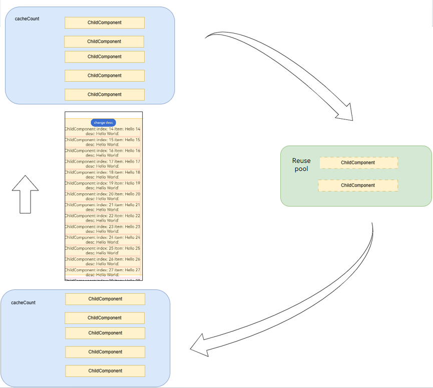

# Freezing a Custom Component (V1)
<!--Kit: ArkUI-->
<!--Subsystem: ArkUI-->
<!--Owner: @liwenzhen3-->
<!--Designer: @s10021109-->
<!--Tester: @TerryTsao-->
<!--Adviser: @zhang_yixin13-->

Freezing a custom component is designed to optimize the performance of complex UI pages, especially for scenarios where multiple page stacks, long lists, or grid layouts are involved. When a state variable is bound to multiple UI components, the change of the state variable may trigger a large number of component updates. As a result, the page freezes and the response is delayed. To improve the refresh performance of such heavy-load UIs, you are advised to use the custom component freezing function.

The component freezing function is a performance optimization mechanism. It freezes the refresh capability of components in the inactive state. When a component is in the inactive state, the UI of the component is not re-rendered even if the status variable bound to the component changes. This reduces the refresh load in complex UI scenarios.

Before reading this topic, you are advised to read [Creating a Custom Component](./arkts-create-custom-components.md) to learn about the basic syntax.

> **NOTE**
>
> Custom component freezing is supported since API version 11.
>
> Since API version 18, custom components can be frozen and used together.
> 
> Since API version 20, you can set the [inheritFreezeOptions](../../reference/apis-arkui/js-apis-arkui-builderNode.md#inheritfreezeoptions20) API of [BuilderNode](../../reference/apis-arkui/js-apis-arkui-builderNode.md) to true to inherit freezing capability. For details, see [BuilderNode Object Freeze Inheritance](../../reference/apis-arkui/js-apis-arkui-builderNode.md#inheritfreezeoptions20).


## **Overview**

Principles of freezing a component are as follows:
1. Set the [freezeWhenInactive](../../reference/apis-arkui/arkui-ts/ts-custom-component-parameter.md#componentoptions) attribute to activate the component freezing mechanism.
2. After component freezing is enabled, the system re-renders only the active custom components. This allows the UI framework to narrow the re-render scope to the (active) custom components visible to users, improving re-render efficiency in complex UI scenarios.
3. When an inactive custom component becomes active, the state management framework performs necessary re-render operations to ensure correct UI display.

In short, component freezing aims to optimize UI re-render performance on complex UIs. When there are multiple invisible custom components, such as multiple page stacks, long lists, or grids, you can freeze the components to re-render visible custom components as required, and the re-render of the invisible custom components is delayed until they become visible.

Note that the active or inactive state of a component is not equivalent to its visibility. Component freezing applies only to the following scenarios:

1. [Page routing](../../reference/apis-arkui/js-apis-router.md): The top page in the stack is active, while pages not on top are inactive.
2. [TabContent](../../reference/apis-arkui/arkui-ts/ts-container-tabcontent.md): Only the custom components in the currently displayed TabContent are in the active state. Other custom components are in the inactive state.
3. [LazyForEach](../../reference/apis-arkui/arkui-ts/ts-rendering-control-lazyforeach.md): Only the custom components in the currently displayed LazyForEach are in the active state, and the components of the cache node are in the inactive state.
4. [Navigation](../../reference/apis-arkui/arkui-ts/ts-basic-components-navigation.md): The user-defined components in the currently displayed NavDestination are in the active state, and other NavDestination components that are not displayed are in the inactive state. Note that the active/inactive state in this document refers to the active/inactive state of a frozen component, which is different from the [onActive](../../reference/apis-arkui/arkui-ts/ts-basic-components-navdestination.md#onactive17) and [onInactive](../../reference/apis-arkui/arkui-ts/ts-basic-components-navdestination.md#oninactive17) in the [NavDestination](../../reference/apis-arkui/arkui-ts/ts-basic-components-navdestination.md) component.
5. Component reuse: The component that enters the reuse pool is in the inactive state, and the node attached from the reuse pool is in the active state.
6. Mixed use: For example, if **LazyForEach** is used under **TabContent**, all nodes in **LazyForEach** of API version 17 or earlier are set to the active state since when switching tabs. Since API version 18, only the on-screen nodes of **LazyForEach** are set to the active state, and other nodes are set to the inactive state.

## Use Scenarios

### Defining Page Routes

> **NOTE**
>
> While this example demonstrates page navigation and routing using **router** APIs, you are advised to use the **Navigation** component instead, which offers enhanced functionality and greater customization flexibility. For details, see the use cases of [Navigation](#navigation).

When page 1 navigates to page 2 using **router.pushUrl**, it enters the hidden state, where updating its state variables will not trigger UI re-rendering.

For details, see the following.


Page 1:
<!-- @[arkts_custom_components_freeze1](https://gitcode.com/openharmony/applications_app_samples/blob/master/code/DocsSample/ArkUISample/CustomComponentsFreeze/entry/src/main/ets/View/Page1.ets) -->

``` TypeScript
import { hilog } from '@kit.PerformanceAnalysisKit';
const DOMAIN = 0x0001;
const TAG = 'FreezeChild';
const STORAGE_LINK_INITIAL_VALUE = 47;

@Entry
@Component({ freezeWhenInactive: true })
struct PageOne {
  @StorageLink('PropA') @Watch('first') storageLink: number = STORAGE_LINK_INITIAL_VALUE;

  first() {
    hilog.info(DOMAIN, TAG, 'first page ' + `${this.storageLink}`);
  }

  build() {
    Column() {
      Text(`From first Page ${this.storageLink}`).fontSize(50)
      Button('first page storageLink + 1').fontSize(30)
        .onClick(() => {
          this.storageLink += 1;
        })
      Button('go to next page').fontSize(30)
        .onClick(() => {
          // The URL transferred here needs to be replaced by the developer.
          this.getUIContext().getRouter().pushUrl({ url: 'View/PageTwo' }, (err: Error) => {
            if (err) {
              hilog.error(DOMAIN, TAG, 'pushUrl failed. Cause: %{public}s', JSON.stringify(err));
            }
          });
        })
    }
  }
}
```

Page 2:
<!-- @[arkts_custom_components_freeze2](https://gitcode.com/openharmony/applications_app_samples/blob/master/code/DocsSample/ArkUISample/CustomComponentsFreeze/entry/src/main/ets/View/PageTwo.ets) -->

``` TypeScript
import { hilog } from '@kit.PerformanceAnalysisKit';
const DOMAIN = 0x0001;
const TAG = 'FreezeChild';

@Entry
@Component({ freezeWhenInactive: true })
struct PageTwo {
  @StorageLink('PropA') @Watch('second') storageLink: number = 1;

  second() {
    hilog.info(DOMAIN, TAG, 'second page: ' + `${this.storageLink}`);
  }

  build() {
    Column() {
      Text(`second Page ${this.storageLink}`).fontSize(50)
      Button('back')
        .onClick(() => {
          this.getUIContext().getRouter().back();
        })
      Button('second page storageLink + 2').fontSize(30)
        .onClick(() => {
          this.storageLink += 2;
        })
    }
  }
}
```

In the preceding example:

1. When **first page storageLink + 1** is clicked, the storageLink status variable changes, and the first method registered by [@Watch](./arkts-watch.md) is called.

2. When **go to next page** on page 1 is clicked, page 2 is displayed. Page 1 is hidden, and its status changes from active to inactive.

3. When **this.storageLink2 += 2** is clicked on page 2, only the second method registered by @Watch on page 2 is called back because the status variable of page 1 is frozen.

4. When **back** on page 2 is clicked, page 2 is destroyed, the status of page 1 changes from inactive to active, the status variable frozen in inactive is refreshed, and the first method registered by @Watch on page 1 is called again.


### TabContent

Freezes the TabContent that is currently invisible in Tabs. Modifying the status variable does not trigger the update of the frozen component.

Note that when the tab is rendered for the first time, only the TabContent that is being displayed is created. After all TabContents are switched, all TabContents are created.

For details, see the following.


<!-- @[arkts_custom_components_freeze3](https://gitcode.com/openharmony/applications_app_samples/blob/master/code/DocsSample/ArkUISample/CustomComponentsFreeze/entry/src/main/ets/View/TabContentTest.ets) -->

``` TypeScript
import { hilog } from '@kit.PerformanceAnalysisKit';
const DOMAIN = 0x0001;
const TAG = 'FreezeChild';

@Entry
@Component
struct TabContentTest {
  @State @Watch('onMessageUpdated') message: number = 0;
  private data: number[] = [0, 1];

  onMessageUpdated() {
    hilog.info(DOMAIN, TAG, `TabContent message callback func ${this.message}`);
  }

  build() {
    Row() {
      Column() {
        Button('change message').onClick(() => {
          this.message++;
        })
        Tabs() {
          ForEach(this.data, (item: number) => {
            TabContent() {
              FreezeChild({ message: this.message, index: item })
            }.tabBar(`tab${item}`)
          }, (item: number) => item.toString())
        }
      }
      .width('100%')
    }
    .height('100%')
  }
}

@Component({ freezeWhenInactive: true })
struct FreezeChild {
  @Link @Watch('onMessageUpdated') message: number;
  index: number = 0;

  onMessageUpdated() {
    hilog.info(DOMAIN, TAG, `FreezeChild message callback func ${this.message}, index: ${this.index}`);
  }

  build() {
    Text('message' + `${this.message}, index: ${this.index}`)
      .fontSize(50)
      .fontWeight(FontWeight.Bold)
  }
}
```

In the preceding example:

1. When **change message** is clicked, the value of **message** changes, and the @Watch decorated **onMessageUpdated** method of the **TabContent** component being displayed is called.

2. When **tab1** in **TabBar** is clicked to navigate to another **TabContent** component, the component switches from inactive to active, triggering the corresponding **onMessageUpdated** callback registered via @Watch.

3. When **change message** is clicked again, the value of **message** changes, and only the @Watch decorated **onMessageUpdated** method of the **TabContent** component being displayed is called.


### LazyForEach

Freezes the custom components cached in LazyForEach. Modifying status variables does not trigger the update of the cache components.
<!-- @[arkts_custom_components_freeze4](https://gitcode.com/openharmony/applications_app_samples/blob/master/code/DocsSample/ArkUISample/CustomComponentsFreeze/entry/src/main/ets/View/LazyforEachTest.ets) -->

``` TypeScript
import { hilog } from '@kit.PerformanceAnalysisKit';
const DOMAIN = 0x0001;
const TAG = 'FreezeChild';

// Basic implementation of IDataSource used to listening for data.
class BasicDataSource implements IDataSource {
  private listeners: DataChangeListener[] = [];
  private originDataArray: string[] = [];

  public totalCount(): number {
    return 0;
  }

  public getData(index: number): string {
    return this.originDataArray[index];
  }

  // This method is called by the framework to register a listener to the LazyForEach data source.
  registerDataChangeListener(listener: DataChangeListener): void {
    if (this.listeners.indexOf(listener) < 0) {
      hilog.info(DOMAIN, TAG, 'add listener');
      this.listeners.push(listener);
    }
  }

  // This method is called by the framework to remove the listener from the LazyForEach data source.
  unregisterDataChangeListener(listener: DataChangeListener): void {
    const pos = this.listeners.indexOf(listener);
    if (pos >= 0) {
      hilog.info(DOMAIN, TAG, 'remove listener');
      this.listeners.splice(pos, 1);
    }
  }

  // Notify LazyForEach that all child components need to be reloaded.
  notifyDataReload(): void {
    this.listeners.forEach(listener => {
      listener.onDataReloaded();
    })
  }

  // Notify LazyForEach that a child component needs to be added for the data item with the specified index.
  notifyDataAdd(index: number): void {
    this.listeners.forEach(listener => {
      listener.onDataAdd(index);
    })
  }

  // Notify LazyForEach that the data item with the specified index has changed and the child component needs to be rebuilt.
  notifyDataChange(index: number): void {
    this.listeners.forEach(listener => {
      listener.onDataChange(index);
    })
  }

  // Notify LazyForEach that the child component needs to be deleted from the data item with the specified index.
  notifyDataDelete(index: number): void {
    this.listeners.forEach(listener => {
      listener.onDataDelete(index);
    })
  }
}

class MyDataSource extends BasicDataSource {
  private dataArray: string[] = [];

  public totalCount(): number {
    return this.dataArray.length;
  }

  public getData(index: number): string {
    return this.dataArray[index];
  }

  public addData(index: number, data: string): void {
    this.dataArray.splice(index, 0, data);
    this.notifyDataAdd(index);
  }

  public pushData(data: string): void {
    this.dataArray.push(data);
    this.notifyDataAdd(this.dataArray.length - 1);
  }
}

@Entry
@Component
struct LazyforEachTest {
  private data: MyDataSource = new MyDataSource();
  @State @Watch('onMessageUpdated') message: number = 0;

  onMessageUpdated() {
    hilog.info(DOMAIN, TAG, `LazyforEach message callback func ${this.message}`);
  }

  aboutToAppear() {
    for (let i = 0; i <= 20; i++) {
      this.data.pushData(`Hello ${i}`);
    }
  }

  build() {
    Column() {
      Button('change message').onClick(() => {
        this.message++;
      })
      List({ space: 3 }) {
        LazyForEach(this.data, (item: string) => {
          ListItem() {
            FreezeChild({ message: this.message, index: item })
          }
        }, (item: string) => item)
      }.cachedCount(5).height(500)
    }
  }
}

@Component({ freezeWhenInactive: true })
struct FreezeChild {
  @Link @Watch('onMessageUpdated') message: number;
  index: string = '';

  aboutToAppear() {
    hilog.info(DOMAIN, TAG, `FreezeChild aboutToAppear index: ${this.index}`);
  }

  onMessageUpdated() {
    hilog.info(DOMAIN, TAG, `FreezeChild message callback func ${this.message}, index: ${this.index}`);
  }

  build() {
    Text('message' + `${this.message}, index: ${this.index}`)
      .width('90%')
      .height(160)
      .backgroundColor(0xAFEEEE)
      .textAlign(TextAlign.Center)
      .fontSize(30)
      .fontWeight(FontWeight.Bold)
  }
}
```

In the preceding example:

1. When **change message** is clicked, the value of **message** changes, the @Watch decorated **onMessageUpdated** method of the list items being displayed is called, and the method registered by @Watch on the cache node is not triggered. (If the component is not frozen, the @Watch decorated **onMessageUpdated** method of the ListItem and cachecount cache nodes will be triggered.)

2. When a list item moves from outside the list content area into the list content area, it switches from inactive to active, and the corresponding @Watch decorated **onMessageUpdated** method is called.

3. When **change message** is clicked again, the value of **message** changes, and only the @Watch decorated **onMessageUpdated** method of the list items being displayed is called.


### Navigation

When a **NavDestination** component becomes invisible, its child custom components enter an inactive state. In this state, modifying state variables does not trigger UI re-rendering of these components. When return to this page, its child custom components are restored to the active state and the @Watch callback is triggered to re-render the page.

In the following example, **NavigationContentMsgStack** is set to the inactive state, which does not respond to the change of the state variables, and does not trigger component re-rendering.
<!-- @[arkts_custom_components_freeze5](https://gitcode.com/openharmony/applications_app_samples/blob/master/code/DocsSample/ArkUISample/CustomComponentsFreeze/entry/src/main/ets/View/MyNavigationTestStack.ets) -->

``` TypeScript
import { hilog } from '@kit.PerformanceAnalysisKit';
const DOMAIN = 0x0001;
const TAG = 'FreezeChild';
const PAGE_ONE_INDEX = 1;
const PAGE_TWO_INDEX = 2;
const PAGE_THREE_INDEX = 3;

@Entry
@Component
struct MyNavigationTestStack {
  @Provide('pageInfo') pageInfo: NavPathStack = new NavPathStack();
  @State @Watch('info') message: number = 0;
  @State logNumber: number = 0;

  info() {
    hilog.info(DOMAIN, TAG, `freeze-test MyNavigation message callback ${this.message}`);
  }

  @Builder
  PageMap(name: string) {
    if (name === 'pageOne') {
      PageOneStack({ message: this.message, logNumber: this.logNumber })
    } else if (name === 'pageTwo') {
      PageTwoStack({ message: this.message, logNumber: this.logNumber })
    } else if (name === 'pageThree') {
      PageThreeStack({ message: this.message, logNumber: this.logNumber })
    }
  }

  build() {
    Column() {
      Button('change message')
        .onClick(() => {
          this.message++;
        })
      Navigation(this.pageInfo) {
        Column() {
          Button('Next Page', { stateEffect: true, type: ButtonType.Capsule })
            .width('80%')
            .height(40)
            .margin(20)
            .onClick(() => {
              this.pageInfo.pushPath({ name: 'pageOne' }); // Push the navigation destination page specified by name to the navigation stack.
            })
        }
      }.title('NavIndex')
      .navDestination(this.PageMap)
      .mode(NavigationMode.Stack)
    }
  }
}

@Component
struct PageOneStack {
  @Consume('pageInfo') pageInfo: NavPathStack;
  @State index: number = PAGE_ONE_INDEX;
  @Link message: number;
  @Link logNumber: number;

  build() {
    NavDestination() {
      Column() {
        NavigationContentMsgStack({ message: this.message, index: this.index, logNumber: this.logNumber })
        Text('cur stack size:' + `${this.pageInfo.size()}`)
          .fontSize(30)
          .fontWeight(FontWeight.Bold)
        Button('Next Page', { stateEffect: true, type: ButtonType.Capsule })
          .width('80%')
          .height(40)
          .margin(20)
          .onClick(() => {
            this.pageInfo.pushPathByName('pageTwo', null);
          })
        Button('Back Page', { stateEffect: true, type: ButtonType.Capsule })
          .width('80%')
          .height(40)
          .margin(20)
          .onClick(() => {
            this.pageInfo.pop();
          })
      }.width('100%').height('100%')
    }.title('pageOne')
    .onBackPressed(() => {
      this.pageInfo.pop();
      return true;
    })
  }
}

@Component
struct PageTwoStack {
  @Consume('pageInfo') pageInfo: NavPathStack;
  @State index: number = PAGE_TWO_INDEX;
  @Link message: number;
  @Link logNumber: number;

  build() {
    NavDestination() {
      Column() {
        NavigationContentMsgStack({ message: this.message, index: this.index, logNumber: this.logNumber })
        Text('cur stack size:' + `${this.pageInfo.size()}`)
          .fontSize(30)
          .fontWeight(FontWeight.Bold)
        Button('Next Page', { stateEffect: true, type: ButtonType.Capsule })
          .width('80%')
          .height(40)
          .margin(20)
          .onClick(() => {
            this.pageInfo.pushPathByName('pageThree', null);
          })
        Button('Back Page', { stateEffect: true, type: ButtonType.Capsule })
          .width('80%')
          .height(40)
          .margin(20)
          .onClick(() => {
            this.pageInfo.pop();
          })
      }.width('100%').height('100%')
    }.title('pageTwo')
    .onBackPressed(() => {
      this.pageInfo.pop();
      return true;
    })
  }
}

@Component
struct PageThreeStack {
  @Consume('pageInfo') pageInfo: NavPathStack;
  @State index: number = PAGE_THREE_INDEX;
  @Link message: number;
  @Link logNumber: number;

  build() {
    NavDestination() {
      Column() {
        NavigationContentMsgStack({ message: this.message, index: this.index, logNumber: this.logNumber })
        Text('cur stack size:' + `${this.pageInfo.size()}`)
          .fontSize(30)
          .fontWeight(FontWeight.Bold)
        Button('Next Page', { stateEffect: true, type: ButtonType.Capsule })
          .width('80%')
          .height(40)
          .margin(20)
          .onClick(() => {
            this.pageInfo.pushPathByName('pageOne', null);
          })
        Button('Back Page', { stateEffect: true, type: ButtonType.Capsule })
          .width('80%')
          .height(40)
          .margin(20)
          .onClick(() => {
            this.pageInfo.pop();
          })
      }.width('100%').height('100%')
    }.title('pageThree')
    .onBackPressed(() => {
      this.pageInfo.pop();
      return true;
    })
  }
}

@Component({ freezeWhenInactive: true })
struct NavigationContentMsgStack {
  @Link @Watch('info') message: number;
  @Link index: number;
  @Link logNumber: number;

  info() {
    hilog.info(DOMAIN, TAG, `freeze-test NavigationContent message callback ${this.message}`);
    hilog.info(DOMAIN, TAG, `freeze-test ---- called by content ${this.index}`);
    this.logNumber++;
  }

  build() {
    Column() {
      Text('msg:' + `${this.message}`)
        .fontSize(30)
        .fontWeight(FontWeight.Bold)
      Text('log number:' + `${this.logNumber}`)
        .fontSize(30)
        .fontWeight(FontWeight.Bold)
    }
  }
}
```


In the preceding example:

1. When **change message** is clicked, the value of **message** changes, and the @Watch decorated **info** method of the **MyNavigationTestStack** component being displayed is called.

2. When **Next Page** is clicked, the page is switched to **PageOne** and the **PageOneStack** node is created.

3. When **change message** is clicked again, the value of **message** changes, triggering only the @Watch decorated **info** method of the **NavigationContentMsgStack** child component in **PageOneStack**.

4. When **Next Page** is clicked, the page is switched to **PageTwo** and the **PageTwoStack** node is created.

5. When **change message** is clicked again, the value of **message** changes, triggering only the @Watch decorated **info** method of the **NavigationContentMsgStack** child component in **PageTwoStack**.

6. When **Next Page** is clicked, the page is switched to **PageThree** and the **PageThreeStack** node is created.

7. When **change message** is clicked again, the value of **message** changes, triggering only the @Watch decorated **info** method of the **NavigationContentMsgStack** child component in **PageThreeStack**.

8. Click **Back Page** to return to **PageTwo**. In this case, only the **info** method registered by @Watch in the **NavigationContentMsgStack** child component of **PageTwoStack** is triggered.

9. Click **Back Page** again to return to **PageOne**. In this case, only the info method registered by @Watch in the **NavigationContentMsgStack** child component of **PageOneStack** is triggered.

10. When **Back Page** is clicked again, the initial page is displayed, and no method is called.


### Component Reuse

[Components reuse](./arkts-reusable.md) existing nodes in the cache pool instead of creating new nodes to optimize UI performance and improve application smoothness. Although the nodes in the reuse pool are not displayed in the UI component tree, the change of the state variable still triggers the UI re-render. To solve the problem that components in the reuse pool are re-rendered abnormally, you can perform component freezing.

**Mixed Use of Component Reuse, if, and Component Freezing**

The following example shows that when the state variable bound to the **if** component changes to **false**, the detach of **ChildComponent** is triggered. Because **ChildComponent** is marked as component reuse, it is not destroyed but enters the reuse pool, in this case, if the component freezing is enabled at the same time, the component will not be re-rendered in the reuse pool.
<!-- @[arkts_custom_components_freeze6](https://gitcode.com/openharmony/applications_app_samples/blob/master/code/DocsSample/ArkUISample/CustomComponentsFreeze/entry/src/main/ets/View/ComponentReuse.ets) -->

``` TypeScript
import { hilog } from '@kit.PerformanceAnalysisKit';
const DOMAIN = 0x0001;
const TAG = 'FreezeChild';

@Reusable
@Component({ freezeWhenInactive: true })
struct ChildComponent {
  @Link @Watch('descChange') desc: string;
  @State count: number = 0;

  descChange() {
    hilog.info(DOMAIN, TAG, `ChildComponent messageChange ${this.desc}`);
  }

  aboutToReuse(params: Record<string, ESObject>): void {
    this.count = params.count as number;
  }

  aboutToRecycle(): void {
    hilog.info(DOMAIN, TAG, `ChildComponent has been recycled`);
  }

  build() {
    Column() {
      Text(`ChildComponent desc: ${this.desc}`)
        .fontSize(20)
      Text(`ChildComponent count ${this.count}`)
        .fontSize(20)
    }.border({ width: 2, color: Color.Pink })
  }
}

@Entry
@Component
struct Page {
  @State desc: string = 'Hello World';
  @State flag: boolean = true;
  @State count: number = 0;

  build() {
    Column() {
      Button(`change desc`).onClick(() => {
        this.desc += '!';
      })
      Button(`change flag`).onClick(() => {
        this.count++;
        this.flag = !this.flag;
      })
      if (this.flag) {
        ChildComponent({ desc: this.desc, count: this.count })
      }
    }
    .height('100%')
  }
}
```

In the preceding example:

1. Click **change flag** and change the value of **flag** to **false**.
    -  When **ChildComponent** marked with \@Reusable is detached, it is not destroyed. Instead, it enters the reuse pool, triggers the **aboutToRecycle** lifecycle, and sets the component state to inactive.
    - **ChildComponent** also enables component freezing. When **ChildComponent** is in the inactive state, it does not respond to any UI re-render caused by state variable changes.
2. Click **change desc** to trigger the change of the member variable **desc** of **Page**.
    - **desc **is decorated by \@State, and its changes are notified to desc decorated by its child component **ChildComponent** [\@Link](./arkts-link.md).
    - However, **ChildComponent** is in the inactive state and the component freezing is enabled. Therefore, the change does not trigger the callback of @Watch('descChange') and the re-render of the ChildComponent UI. If component freezing is not enabled, the current @Watch('descChange') callback is returned immediately, and **ChildComponent** in the reuse pool is re-rendered accordingly.
3. Click **change flag** again and change the value of **flag** to **true**.
    - **ChildComponent** is attached to the component tree from the reuse pool.
    - Return the **aboutToReuse** lifecycle callback and synchronize the latest **count** value to **ChildComponent**. **desc** is synchronized from [@State](./arkts-state.md) to @Link. Therefore, you do not need to manually assign a value to **aboutToReuse**.
    - Set **ChildComponent** to the active state and re-render the component that is not re-rendered when **ChildComponent** is inactive, for example, **Text (ChildComponent desc: ${this.desc})**.

**Mixed Use of LazyForEach, Component Reuse, and Component Freezing**

In the scrolling scenario of a long list with a large amount of data, you can use **LazyForEach** to create components as required. In addition, you can reuse components to reduce the overhead caused by component creation and destruction during scrolling. However, if you set [reuseId](../../reference/apis-arkui/arkui-ts/ts-universal-attributes-reuse-id.md#reuseid) based on the reuse type or set **cacheCount** to a large value to ensure the sliding performance, the reuse pool or LazyForEach may cache a large number of nodes. In this case, if you trigger the re-render of all subnodes in **List**, the number of re-renders is too large. In this case, you can freeze the component.
<!-- @[arkts_custom_components_freeze7](https://gitcode.com/openharmony/applications_app_samples/blob/master/code/DocsSample/ArkUISample/CustomComponentsFreeze/entry/src/main/ets/View/ComponentReuse1.ets) -->

``` TypeScript
import { hilog, hiTraceMeter } from '@kit.PerformanceAnalysisKit';
const DOMAIN = 0x0001;
const TAG = 'FreezeChild';

// Basic implementation of IDataSource used to listening for data.
class BasicDataSource implements IDataSource {
  private listeners: DataChangeListener[] = [];
  private originDataArray: string[] = [];

  public totalCount(): number {
    return 0;
  }

  public getData(index: number): string {
    return this.originDataArray[index];
  }

  // This method is called by the framework to register a listener to the LazyForEach data source.
  registerDataChangeListener(listener: DataChangeListener): void {
    if (this.listeners.indexOf(listener) < 0) {
      hilog.info(DOMAIN, TAG, 'add listener');
      this.listeners.push(listener);
    }
  }

  // This method is called by the framework to remove the listener from the LazyForEach data source.
  unregisterDataChangeListener(listener: DataChangeListener): void {
    const pos = this.listeners.indexOf(listener);
    if (pos >= 0) {
      hilog.info(DOMAIN, TAG, 'remove listener');
      this.listeners.splice(pos, 1);
    }
  }

  // Notify LazyForEach that all child components need to be reloaded.
  notifyDataReload(): void {
    this.listeners.forEach(listener => {
      listener.onDataReloaded();
    });
  }

  // Notify LazyForEach that a child component needs to be added for the data item with the specified index.
  notifyDataAdd(index: number): void {
    this.listeners.forEach(listener => {
      listener.onDataAdd(index);
    });
  }

  // Notify LazyForEach that the data item with the specified index has changed and the child component needs to be rebuilt.
  notifyDataChange(index: number): void {
    this.listeners.forEach(listener => {
      listener.onDataChange(index);
    });
  }

  // Notify LazyForEach that the child component needs to be deleted from the data item with the specified index.
  notifyDataDelete(index: number): void {
    this.listeners.forEach(listener => {
      listener.onDataDelete(index);
    });
  }

  // Notify LazyForEach that data needs to be swapped between the from and to positions.
  notifyDataMove(from: number, to: number): void {
    this.listeners.forEach(listener => {
      listener.onDataMove(from, to);
    });
  }
}

class MyDataSource extends BasicDataSource {
  private dataArray: string[] = [];

  public totalCount(): number {
    return this.dataArray.length;
  }

  public getData(index: number): string {
    return this.dataArray[index];
  }

  public addData(index: number, data: string): void {
    this.dataArray.splice(index, 0, data);
    this.notifyDataAdd(index);
  }

  public pushData(data: string): void {
    this.dataArray.push(data);
    this.notifyDataAdd(this.dataArray.length - 1);
  }
}

@Reusable
@Component({freezeWhenInactive: true})
struct ChildComponent {
  @Link @Watch('descChange') desc: string;
  @State item: string = '';
  @State index: number = 0;

  descChange() {
    hilog.info(DOMAIN, TAG, `ChildComponent messageChange ${this.desc}`);
  }

  aboutToReuse(params: Record<string, ESObject>): void {
    this.item = params.item;
    this.index = params.index;
  }

  aboutToRecycle(): void {
    hilog.info(DOMAIN, TAG, `ChildComponent has been recycled`);
  }

  build() {
    Column() {
      Text(`ChildComponent index: ${this.index} item: ${this.item}`)
        .fontSize(20)
      Text(`desc: ${this.desc}`)
        .fontSize(20)
    }.border({width: 2, color: Color.Pink})
  }
}

@Entry
@Component
struct Page {
  @State desc: string = 'Hello World';
  private data: MyDataSource = new MyDataSource();

  aboutToAppear() {
    for (let i = 0; i < 50; i++) {
      this.data.pushData(`Hello ${i}`);
    }
  }

  build() {
    Column() {
      Button(`change desc`).onClick(() => {
        hiTraceMeter.startTrace('change desc', 1);
        this.desc += '!';
        hiTraceMeter.finishTrace('change desc', 1);
      })
      List({ space: 3 }) {
        LazyForEach(this.data, (item: string, index: number) => {
          ListItem() {
            ChildComponent({index: index, item: item, desc: this.desc}).reuseId(index % 10 < 5 ? '1': '0')
          }
        }, (item: string) => item)
      }.cachedCount(5)
    }
    .height('100%')
  }
}
```

In the preceding example:

1. Swipe the list to the position whose index is 14. There are 15 **ChildComponent** in the visible area on the current page.
2. During swiping:
    - **ChildComponent** in the upper part of the list is swiped out of the visible area. In this case, **ChildComponent** enters the cache area of LazyForEach and is set to inactive. After the component slides out of the **LazyForEach** cache area, the component is not destructed and enters the reuse pool because the component is marked for reuse. In this case, the component is set to inactive again.
    - The cache node of **LazyForEach** at the bottom of the list enters the list. In this case, the system attempts to create a node to enter the cache of **LazyForEach**. If a node that can be reused is found, the system takes out the existing node from the reuse pool and triggers the **aboutToReuse** lifecycle callback, in this case, the node enters the cache area of **LazyForEach** and the state of the node is still inactive.
3. Click **change desc** to trigger the change of the member variable **desc** of **Page**.
    - The change of \@State decorated **desc** will be notified to \@Link decorated **desc** of **ChildComponent**.
    - **ChildComponent** in the invisible area is in the inactive state, and the component freezing is enabled. Therefore, this change triggers the @Watch('descChange') callback of the 15 nodes in the visible area and re-renders these nodes. Nodes cached in **LazyForEach** and the reuse pool are not re-rendered, and the \@Watch callback is not triggered.
    

For details, see the following.



You can listen for the changes by \@Trace, only 15 **ChildComponent** nodes are re-rendered.


**Mixed Use of LazyForEach, if, Component Reuse, and Component Freezing**

The following scenario shows the mixed use of LazyForEach, if, component reuse, and component freezing. Under the same parent custom component, reusable nodes may enter the reuse pool in different ways. For example:
- Detaching from the cache area of LazyForEach by swiping.
- Notifying the subnodes to detach by switching the if condition.
<!-- @[arkts_custom_components_freeze8](https://gitcode.com/openharmony/applications_app_samples/blob/master/code/DocsSample/ArkUISample/CustomComponentsFreeze/entry/src/main/ets/View/ComponentReuse2.ets) -->

``` TypeScript
import { hilog, hiTraceMeter } from '@kit.PerformanceAnalysisKit';
const DOMAIN = 0x0001;
const TAG = 'FreezeChild';

class BasicDataSource implements IDataSource {
  private listeners: DataChangeListener[] = [];
  private originDataArray: string[] = [];

  public totalCount(): number {
    return 0;
  }

  public getData(index: number): string {
    return this.originDataArray[index];
  }

  // This method is called by the framework to register a listener to the LazyForEach data source.
  registerDataChangeListener(listener: DataChangeListener): void {
    if (this.listeners.indexOf(listener) < 0) {
      hilog.info(DOMAIN, TAG, 'add listener');
      this.listeners.push(listener);
    }
  }

  // This method is called by the framework to remove the listener from the LazyForEach data source.
  unregisterDataChangeListener(listener: DataChangeListener): void {
    const pos = this.listeners.indexOf(listener);
    if (pos >= 0) {
      hilog.info(DOMAIN, TAG, 'remove listener');
      this.listeners.splice(pos, 1);
    }
  }

  // Notify LazyForEach that all child components need to be reloaded.
  notifyDataReload(): void {
    this.listeners.forEach(listener => {
      listener.onDataReloaded();
    });
  }

  // Notify LazyForEach that a child component needs to be added for the data item with the specified index.
  notifyDataAdd(index: number): void {
    this.listeners.forEach(listener => {
      listener.onDataAdd(index);
    });
  }

  // Notify LazyForEach that the data item with the specified index has changed and the child component needs to be rebuilt.
  notifyDataChange(index: number): void {
    this.listeners.forEach(listener => {
      listener.onDataChange(index);
    });
  }

  // Notify LazyForEach that the child component needs to be deleted from the data item with the specified index.
  notifyDataDelete(index: number): void {
    this.listeners.forEach(listener => {
      listener.onDataDelete(index);
    });
  }

  // Notify LazyForEach that data needs to be swapped between the from and to positions.
  notifyDataMove(from: number, to: number): void {
    this.listeners.forEach(listener => {
      listener.onDataMove(from, to);
    });
  }
}

class MyDataSource extends BasicDataSource {
  private dataArray: string[] = [];

  public totalCount(): number {
    return this.dataArray.length;
  }

  public getData(index: number): string {
    return this.dataArray[index];
  }

  public addData(index: number, data: string): void {
    this.dataArray.splice(index, 0, data);
    this.notifyDataAdd(index);
  }

  public pushData(data: string): void {
    this.dataArray.push(data);
    this.notifyDataAdd(this.dataArray.length - 1);
  }
}

@Reusable
@Component({ freezeWhenInactive: true })
struct ChildComponent {
  @Link @Watch('descChange') desc: string;
  @State item: string = '';
  @State index: number = 0;

  descChange() {
    hilog.info(DOMAIN, TAG, `ChildComponent messageChange ${this.desc}`);
  }

  aboutToReuse(params: Record<string, ESObject>): void {
    this.item = params.item;
    this.index = params.index;
  }

  aboutToRecycle(): void {
    hilog.info(DOMAIN, TAG, `ChildComponent has been recycled`);
  }

  build() {
    Column() {
      Text(`ChildComponent index: ${this.index} item: ${this.item}`)
        .fontSize(20)
      Text(`desc: ${this.desc}`)
        .fontSize(20)
    }.border({ width: 2, color: Color.Pink })
  }
}

@Entry
@Component
struct Page {
  @State desc: string = 'Hello World';
  @State flag: boolean = true;
  private data: MyDataSource = new MyDataSource();

  aboutToAppear() {
    for (let i = 0; i < 50; i++) {
      this.data.pushData(`Hello ${i}`);
    }
  }

  build() {
    Column() {
      Button(`change desc`).onClick(() => {
        hiTraceMeter.startTrace('change desc', 1);
        this.desc += '!';
        hiTraceMeter.finishTrace('change desc', 1);
      })
      Button(`change flag`).onClick(() => {
        hiTraceMeter.startTrace('change flag', 1);
        this.flag = !this.flag;
        hiTraceMeter.finishTrace('change flag', 1);
      })
      List({ space: 3 }) {
        LazyForEach(this.data, (item: string, index: number) => {
          ListItem() {
            ChildComponent({ index: index, item: item, desc: this.desc }).reuseId(index % 10 < 5 ? '1' : '0')
          }
        }, (item: string) => item)
      }
      .cachedCount(5)
      .height('60%')
      if (this.flag) {
        ChildComponent({ index: -1, item: 'Hello', desc: this.desc }).reuseId('1')
      }
    }
    .height('100%')
  }
}
```


In the preceding example:

1. When you swipe the list to the position whose index is 14, there are 10 **ChildComponent**s in the visible area on the page, among which nine are subnodes of **LazyForEach** and one is a subnode of **if**.
2. Click **change flag**. The **if** condition is changed to **false**, and its subnode **ChildComponent** enters the reuse pool. Nine nodes are displayed on the page.
3. In this case, the nodes detached through **LazyForEach** or **if** all enter the reuse pool under the **Page** node.
4. Click **change desc** to update only the nine **ChildComponent** nodes on the page. For details, see figures below.
5. Click **change flag** again. The **if** condition changes to **true**, and **ChildComponent** is attached from the reuse pool to the component tree again. The state of **ChildComponent** changes to active.
6. Click **change desc** again. The nodes attached through **if** and **LazyForEach** from the reuse pool can be re-rendered.

Trace for component freezing enabled


Trace for component freezing disabled


### Mixed Component Usage

When scenarios that support component freezing are used together, the freezing behavior varies according to the API version. Set the component freezing flag for the parent component. In API version 17 or earlier, when the parent component is unfrozen, all nodes of its child components are unfrozen. Since API version 18, when the parent component is unfrozen, only the on-screen nodes of the child component are unfrozen. 

**Mixed Use of Navigation and TabContent**

The sample code is as follows:
<!-- @[arkts_custom_components_freeze9](https://gitcode.com/openharmony/applications_app_samples/blob/master/code/DocsSample/ArkUISample/CustomComponentsFreeze/entry/src/main/ets/View/ComponentMixing.ets) -->    

``` TypeScript
// index.ets
import { hilog } from '@kit.PerformanceAnalysisKit';
const DOMAIN = 0x0001;
const TAG = 'FreezeChild';
const TAB_STATE_INITIAL_VALUE = 47;

@Component
struct ChildOfParamComponent {
  @Prop @Watch('onChange') childVal: number;

  onChange() {
    hilog.info(DOMAIN, TAG, `Appmonitor ChildOfParamComponent: childVal changed:${this.childVal}`);
  }

  build() {
    Column() {
      Text(`Child Param: ${this.childVal}`)
    }
  }
}

@Component
struct ParamComponent {
  @Prop @Watch('onChange') paramVal: number;

  onChange() {
    hilog.info(DOMAIN, TAG, `Appmonitor ParamComponent: paramVal changed:${this.paramVal}`);
  }

  build() {
    Column() {
      Text(`val: ${this.paramVal}`)
      ChildOfParamComponent({ childVal: this.paramVal })
    }
  }
}

@Component
struct DelayComponent {
  @Prop @Watch('onChange') delayVal: number;

  onChange() {
    hilog.info(DOMAIN, TAG, `Appmonitor ParamComponent: delayVal changed:${this.delayVal}`);
  }

  build() {
    Column() {
      Text(`Delay Param: ${this.delayVal}`)
    }
  }
}

@Component({ freezeWhenInactive: true })
struct TabsComponent {
  private controller: TabsController = new TabsController();
  @State @Watch('onChange') tabState: number = TAB_STATE_INITIAL_VALUE;

  onChange() {
    hilog.info(DOMAIN, TAG, `Appmonitor TabsComponent: tabState changed:${this.tabState}`);
  }

  build() {
    Column({ space: 10 }) {
      Button(`Incr state ${this.tabState}`)
        .fontSize(25)
        .onClick(() => {
          hilog.info(DOMAIN, TAG, 'Button increment state value');
          this.tabState = this.tabState + 1;
        })
      Tabs({ barPosition: BarPosition.Start, index: 0, controller: this.controller }) {
        TabContent() {
          ParamComponent({ paramVal: this.tabState })
        }.tabBar('Update')
        TabContent() {
          DelayComponent({ delayVal: this.tabState })
        }.tabBar('DelayUpdate')
      }
      .vertical(false)
      .scrollable(true)
      .barMode(BarMode.Fixed)
      .barWidth(400)
      .barHeight(150)
      .animationDuration(400)
      .width('100%')
      .height(200)
      .backgroundColor(0xF5F5F5)
    }
  }
}

@Entry
@Component
struct MyNavigationTestStack {
  @Provide('pageInfo') pageInfo: NavPathStack = new NavPathStack();

  @Builder
  PageMap(name: string) {
    if (name === 'pageOne') {
      PageOneStack()
    } else if (name === 'pageTwo') {
      PageTwoStack()
    }
  }

  build() {
    Column() {
      Navigation(this.pageInfo) {
        Column() {
          Button('Next Page', { stateEffect: true, type: ButtonType.Capsule })
            .width('80%')
            .height(40)
            .margin(20)
            .onClick(() => {
              this.pageInfo.pushPath({ name: 'pageOne' }); // Push the navigation destination page specified by name to the navigation stack.
            })
        }
      }.title('NavIndex')
      .navDestination(this.PageMap)
      .mode(NavigationMode.Stack)
    }
  }
}

@Component
struct PageOneStack {
  @Consume('pageInfo') pageInfo: NavPathStack;

  build() {
    NavDestination() {
      Column() {
        TabsComponent()
        Button('Next Page', { stateEffect: true, type: ButtonType.Capsule })
          .width('80%')
          .height(40)
          .margin(20)
          .onClick(() => {
            this.pageInfo.pushPathByName('pageTwo', null);
          })
      }.width('100%').height('100%')
    }.title('pageOne')
    .onBackPressed(() => {
      this.pageInfo.pop();
      return true;
    })
  }
}

@Component
struct PageTwoStack {
  @Consume('pageInfo') pageInfo: NavPathStack;

  build() {
    NavDestination() {
      Column() {
        Button('Back Page', { stateEffect: true, type: ButtonType.Capsule })
          .width('80%')
          .height(40)
          .margin(20)
          .onClick(() => {
            this.pageInfo.pop();
          })
      }.width('100%').height('100%')
    }.title('pageTwo')
    .onBackPressed(() => {
      this.pageInfo.pop();
      return true;
    })
  }
}
```


Final effect


Click **Next Page** to enter the **pageOne** page. There are two tabs on the page and the **Update** tab is displayed by default. Enable component freezing. If the **Tabcontent** tab is not selected, the state variable is not refreshed.

Click **Incr state** to query **Appmonitor** in the log. Three records are displayed.


Switch to the **DelayUpdate** tab and click **Incr state** to query **Appmonitor** in the log. Two records are displayed. The state variable in the **DelayUpdate** tab does not refresh the state variable related to the **Update** tab.


For API version 17 or earlier:

Click **Next page** to enter the next page and then return. The tab is **DelayUpdate** by default. Click **Incr state** to query **Appmonitor** in the log and four records are displayed. When the page route is returned, all tabs of **Tabcontent** are unfrozen.


For API version 18 or later:

Click **Next page** to enter the next page and then return. The tab is **DelayUpdate** by default. Click **Incr state** to query **Appmonitor** in the log and two records are displayed. When the page route is returned, only the nodes with the corresponding tabs are unfrozen.


**Page and LazyForEach**

When **Navigation** and **TabContent** are used together, the child nodes of **TabContent** are unlocked because the child component is recursively unfrozen from the parent component when the previous page is displayed. In addition, the page lifecycle **OnPageShow** shows a similar behavior. **OnPageShow** sets the root node of the current page to the active state. As a subnode of the page, **TabContent** is also set to the active state. When the screen is turned off or on, the page lifecycles **OnPageHide** and **OnPageShow** are triggered respectively. Therefore, when **LazyForEach** is used on the page, manual screen-off and screen-on can also implement the page routing effect. The sample code is as follows:
<!-- @[arkts_custom_components_freeze10](https://gitcode.com/openharmony/applications_app_samples/blob/master/code/DocsSample/ArkUISample/CustomComponentsFreeze/entry/src/main/ets/View/ComponentMixing1.ets) --> 

``` TypeScript
import { hilog } from '@kit.PerformanceAnalysisKit';
const DOMAIN = 0x0001;
const TAG = 'FreezeChild';

// Basic implementation of IDataSource used to listening for data.
class BasicDataSource implements IDataSource {
  private listeners: DataChangeListener[] = [];
  private originDataArray: string[] = [];

  public totalCount(): number {
    return 0;
  }

  public getData(index: number): string {
    return this.originDataArray[index];
  }

  // This method is called by the framework to register a listener to the LazyForEach data source.
  registerDataChangeListener(listener: DataChangeListener): void {
    if (this.listeners.indexOf(listener) < 0) {
      hilog.info(DOMAIN, TAG, 'add listener');
      this.listeners.push(listener);
    }
  }

  // This method is called by the framework to remove the listener from the LazyForEach data source.
  unregisterDataChangeListener(listener: DataChangeListener): void {
    const pos = this.listeners.indexOf(listener);
    if (pos >= 0) {
      hilog.info(DOMAIN, TAG, 'remove listener');
      this.listeners.splice(pos, 1);
    }
  }

  // Notify LazyForEach that all child components need to be reloaded.
  notifyDataReload(): void {
    this.listeners.forEach(listener => {
      listener.onDataReloaded();
    });
  }

  // Notify LazyForEach that a child component needs to be added for the data item with the specified index.
  notifyDataAdd(index: number): void {
    this.listeners.forEach(listener => {
      listener.onDataAdd(index);
    });
  }

  // Notify LazyForEach that the data item with the specified index has changed and the child component needs to be rebuilt.
  notifyDataChange(index: number): void {
    this.listeners.forEach(listener => {
      listener.onDataChange(index);
    });
  }

  // Notify LazyForEach that the child component needs to be deleted from the data item with the specified index.
  notifyDataDelete(index: number): void {
    this.listeners.forEach(listener => {
      listener.onDataDelete(index);
    });
  }

  // Notify LazyForEach that data needs to be swapped between the from and to positions.
  notifyDataMove(from: number, to: number): void {
    this.listeners.forEach(listener => {
      listener.onDataMove(from, to);
    });
  }
}

class MyDataSource extends BasicDataSource {
  private dataArray: string[] = [];

  public totalCount(): number {
    return this.dataArray.length;
  }

  public getData(index: number): string {
    return this.dataArray[index];
  }

  public addData(index: number, data: string): void {
    this.dataArray.splice(index, 0, data);
    this.notifyDataAdd(index);
  }

  public pushData(data: string): void {
    this.dataArray.push(data);
    this.notifyDataAdd(this.dataArray.length - 1);
  }
}

@Reusable
@Component({ freezeWhenInactive: true })
struct ChildComponent {
  @State desc: string = '';
  @Link @Watch('sumChange') sum: number;

  sumChange() {
    hilog.info(DOMAIN, TAG, `sum: Change ${this.sum}`);
  }

  aboutToReuse(params: Record<string, Object>): void {
    this.desc = params.desc as string;
    this.sum = params.sum as number;
  }

  aboutToRecycle(): void {
    hilog.info(DOMAIN, TAG, `ChildComponent has been recycled`);
  }

  build() {
    Column() {
      Divider()
        .color('#ff11acb8')
      Text(`subcomponent: ${this.desc}`)
        .fontSize(30)
        .fontWeight(30)
      Text(`${this.sum}`)
        .fontSize(30)
        .fontWeight(30)
    }
  }
}

@Entry
@Component({ freezeWhenInactive: true })
struct Page {
  private data: MyDataSource = new MyDataSource();
  @State sum: number = 0;
  @State desc: string = '';

  aboutToAppear() {
    for (let index = 0; index < 20; index++) {
      this.data.pushData(index.toString());
    }
  }

  build() {
    Column() {
      Button(`add sum`).onClick(() => {
        this.sum++;
      })
        .fontSize(30)
        .margin(20)
      List() {
        LazyForEach(this.data, (item: string) => {
          ListItem() {
            ChildComponent({ desc: item, sum: this.sum })
          }
          .width('100%')
          .height(100)
        }, (item: string) => item)
      }.cachedCount(5)
    }
    .height('100%')
    .width('100%')
  }
}
```


As described in the mixed use scenario, the nodes of **LazyForEach** include the on-screen node and **cachedCount** node.


Swipe down **LazyForEach** to add nodes to **cachedCount**. Click **add sum** to search for the log "sum: Change." and eight records are displayed.


For API version 17 or earlier:

Turn off and on the screen to trigger **OnPageShow** and then click **add sum**. The displayed number is the sum of the number of nodes on the screen and the number of cachedCount.


Since API version 18:

Turn off and on the screen to trigger **OnPageShow** and then click **add sum**. Only the number of on-screen nodes is displayed, and the **cachedCount** nodes are not unfrozen.


## Constraints

### **BuilderNode Cannot Inherit Parent Component Freezing**

In versions earlier than API version 20, BuilderNode cannot inherit the parent component freezing. The **FreezeBuildNode** example below demonstrates the constraint for using a [BuilderNode](../../reference/apis-arkui/js-apis-arkui-builderNode.md) with component freezing. When a BuilderNode is used within a frozen component hierarchy, its imperative mounting mechanism conflicts with the functionality of component freezing, which relies on parent-child relationships. As a result, the child components of the BuilderNode remain active, regardless of their parent's frozen state.

In API version 20 and later, you can set inheritFreezeOptions of BuilderNode to true to inherit the freezing capability of BuilderNode. For details, see [BuilderNode Object Freeze Inheritance](../../reference/apis-arkui/js-apis-arkui-builderNode.md#inheritfreezeoptions20).
<!-- @[arkts_custom_components_freeze11](https://gitcode.com/openharmony/applications_app_samples/blob/master/code/DocsSample/ArkUISample/CustomComponentsFreeze/entry/src/main/ets/View/Constraints.ets) -->

``` TypeScript
import { BuilderNode, FrameNode, NodeController, UIContext } from '@kit.ArkUI';
import { hilog } from '@kit.PerformanceAnalysisKit';
const DOMAIN = 0x0001;
const TAG = 'FreezeChild';

// Define a Params class to pass parameters.
class Params {
  public index: number = 0;

  constructor(index: number) {
    this.index = index;
  }
}

// Define a BuildNodeChild component that contains a message attribute and an index attribute.
@Component
struct BuildNodeChild {
  @StorageProp('buildNodeTest') @Watch('onMessageUpdated') message: string = 'hello world';
  @State index: number = 0;

  // Call this method when message is updated.
  onMessageUpdated() {
    hilog.info(DOMAIN, TAG, `FreezeBuildNode builderNodeChild message callback func ${this.message},index:${this.index}`);
  }

  build() {
    Text(`buildNode Child message: ${this.message}`).fontSize(30)
  }
}

// Define a buildText function that receives a Params parameter and constructs a Column component.
@Builder
function buildText(params: Params) {
  Column() {
    BuildNodeChild({ index: params.index })
  }
}

// Define a TextNodeController class that is inherited from NodeController.
class TextNodeController extends NodeController {
  private textNode: BuilderNode<[Params]> | null = null;
  private index: number = 0;

  // The constructor receives an index parameter.
  constructor(index: number) {
    super();
    this.index = index;
  }

  // Create and return a FrameNode.
  makeNode(context: UIContext): FrameNode | null {
    this.textNode = new BuilderNode(context);
    this.textNode.build(wrapBuilder<[Params]>(buildText), new Params(this.index));
    return this.textNode.getFrameNode();
  }
}

// Define an index component that contains a message attribute and a data array.
@Entry
@Component
struct Index {
  @StorageLink('buildNodeTest') message: string = 'hello';
  private data: number[] = [0, 1];

  build() {
    Row() {
      Column() {
        Button('change').fontSize(30)
          .onClick(() => {
            this.message += 'a';
          })
        Tabs() {
          ForEach(this.data, (item: number) => {
            TabContent() {
              FreezeBuildNode({ index: item })
            }.tabBar(`tab${item}`)
          }, (item: number) => item.toString())
        }
      }
    }
    .width('100%')
    .height('100%')
  }
}

// Define a FreezeBuildNode component that contains a message attribute and an index attribute.
@Component({ freezeWhenInactive: true })
struct FreezeBuildNode {
  @StorageProp('buildNodeTest') @Watch('onMessageUpdated') message: string = '1111';
  @State index: number = 0;

  // Call this method when message is updated.
  onMessageUpdated() {
    hilog.info(DOMAIN, TAG, `FreezeBuildNode message callback func ${this.message}, index: ${this.index}`);
  }

  build() {
    NodeContainer(new TextNodeController(this.index))
      .width('100%')
      .height('100%')
      .backgroundColor('#FFF0F0F0')
  }
}
```


In the preceding example:

When **change** is clicked, the value of **message** is changed. The onMessageUpdated method registered by @Watch in the TabContent component that is being displayed is triggered. Unexpected: For **TabContent** components that are not being displayed, the @Watch decorated **onMessageUpdated** callbacks of child components under the BuilderNode are also triggered, indicating that these components are not frozen.


