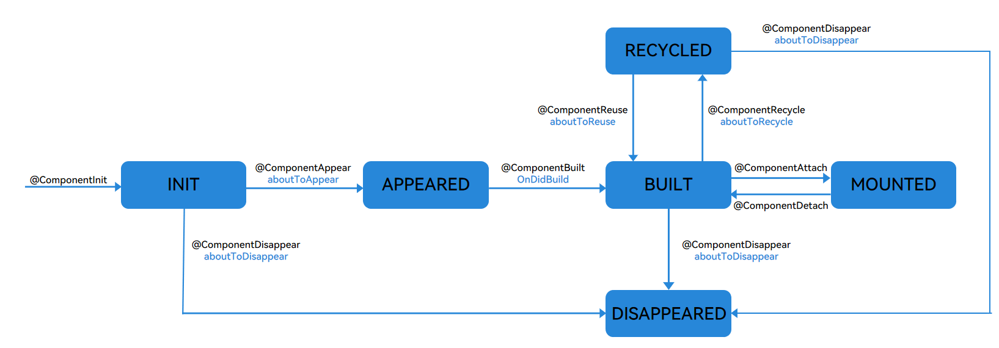
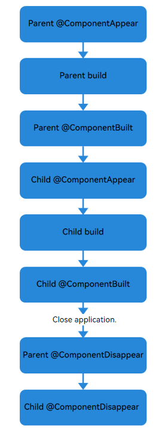

# Lifecycle of a Custom Component (Recommended)
<!--Kit: ArkUI-->
<!--Subsystem: ArkUI-->
<!--Owner: @seaside_wu1; @xin11112-->
<!--Designer: @chenbenzhi-->
<!--Tester: @TerryTsao-->
<!--Adviser: @zhang_yixin13-->

## Overview

The existing [custom component lifecycle](./arkts-page-custom-components-lifecycle.md) callback function is triggered only by events. In some specific cases, the triggering sequence of the custom component lifecycle callback function does not meet the expectation. For example, [aboutToDisappear will call aboutToAppear by mistake in specific cases, or aboutToReuse will be called by mistake when a component is not expanded and reused](#differences-between-lifecycle-callback-functions). The lifecycle callback function of the new custom component is restricted by the [state machine](../../reference/apis-arkui/arkui-ts/ts-custom-component-new-lifecycle.md#customcomponentlifecyclestate). The time when the lifecycle callback function is called meets the expectation.

Lifecycle of a custom component, that is, the lifecycle of a custom component decorated by [@Component](arkts-create-custom-components.md#component) or [@ComponentV2](./arkts-create-custom-components.md#componentv2). Since API version 23, the following lifecycle decorators are provided:

- [\@ComponentInit](../../reference/apis-arkui/arkui-ts/ts-custom-component-new-lifecycle.md#componentinit): The function decorated by \@Componentinit is executed when the custom component is about to be constructed. You can register listening and modify non-state variables in this function.

- [\@ComponentAppear](../../reference/apis-arkui/arkui-ts/ts-custom-component-new-lifecycle.md#componentappear): When a component is about to appear, the function decorated by the decorator is called back. The function is executed after a new instance of the custom component is created and before the build function is executed.

- [\@ComponentBuilt](../../reference/apis-arkui/arkui-ts/ts-custom-component-new-lifecycle.md#componentbuilt): After the build function triggered by the first component rendering is executed, the decorator function is called back. This function will not be called back when the component is rendered again. You can implement functions that do not affect the actual UI, such as data reporting, in this phase.

- [\@ComponentDisappear](../../reference/apis-arkui/arkui-ts/ts-custom-component-new-lifecycle.md#componentdisappear): The function decorated by the decorator is executed before the custom component is destructed. You are not advised to change state variables in the functions decorated by \@ComponentDisappear. Especially, the modification of the @Link variable may cause unstable application behavior.

- [\@ComponentAttach](../../reference/apis-arkui/arkui-ts/ts-custom-component-new-lifecycle.md#componentattach): The function decorated by the decorator is executed after the custom component is mounted to the main tree. In this phase, you can implement some functions that do not affect the actual UI, for example, event data reporting.

- [\@ComponentDetach](../../reference/apis-arkui/arkui-ts/ts-custom-component-new-lifecycle.md#componentdetach): The function decorated by the decorator is executed after the custom component is separated from the primary tree. You can use this callback for actions that do not affect the UI, such as initializing non-state variables.

- [\@ComponentReuse](../../reference/apis-arkui/arkui-ts/ts-custom-component-new-lifecycle.md#componentreuse): When a reusable custom component is added from the cache to the node tree, the decorator decorated function is called to receive the construction input parameters of the component. At last, the function decorated by **\@ComponentReuse** recursively traverses all child components, and the **\@ComponentReuse** decorated function in each reused child component will be called.

- [\@ComponentRecycle](../../reference/apis-arkui/arkui-ts/ts-custom-component-new-lifecycle.md#componentrecycle): This function is triggered after a component is reclaimed. The necessary reclaim operations defined in the application are performed first, and then the function decorated by this decorator is called. At last, the function decorated by **\@ComponentRecycle** recursively traverses all child components, and the **\@ComponentRecycle** decorated function in each recycled child component will be called.

The lifecycle of a custom component is restricted by the state machine. The following figure shows the process.



### Custom Component Creation and Rendering

1. Custom component creation: An instance of a custom component is created by the ArkUI framework.

2. Initialization of custom component member variables: The member variables are initialized with locally defined defaults or component constructor parameters. The initialization happens in the document order, which is the order in which the member variables are defined.

3. On initial render, the **build** function of the built-in component is executed for rendering. If the child component is a custom component, the rendering creates an instance of the child component. During initial render, the framework records the mapping between state variables and components. When a state variable changes, the framework drives the related components to update.

### Custom Component Deletion

For example, if the branch of the if component changes or the number of arrays in the ForEach loop rendering changes, the component is removed.

1. Before a component is deleted, the lifecycle function of the \@ComponentDisappear decorator is called, indicating that the node is to be destroyed. The component deletion mechanism of ArkUI is as follows:<br>(1) The backend component is directly removed from the component tree and destroyed.<br>(2) The reference to the destroyed component is released from the frontend components.<br>(3) The Ark Engine garbage collects the destroyed component.

2. The custom component and its variables will be deleted. If the component has synchronous variables (such as [@Link](arkts-link.md), [@Prop](arkts-prop.md), and [@StorageLink](arkts-appstorage.md#storagelink)), the component is deregistered from the [Data Source](arkts-state-management-glossary.md#data-source)

## Constraints

1. \@ComponentInit, \@ComponentAppear, \@ComponentBuilt, \@ComponentDisappear, \@ComponentAttach, \@ComponentDetach, \@ComponentReuse, and \@ComponentRecycle can be used only in structs decorated by \@Component or \@ComponentV2. Otherwise, a warning is reported during compilation.

2. Functions decorated by \@ComponentInit, \@ComponentAppear, \@ComponentBuilt, \@ComponentDisappear, \@ComponentAttach, \@ComponentDetach, and \@ComponentRecycle cannot have input parameters. Otherwise, a warning is reported during compilation.

3. In the struct decorated by @Component, state variables cannot be changed in the function decorated by \@ComponentInit. Otherwise, the system crashes during running. In the struct decorated by @ComponentV2, state variables can be changed in the function decorated by \@ComponentInit.

4. In the struct decorated by \@Component, the function decorated by \@ComponentReuse can have no input parameter or have one input parameter. Otherwise, a warning is reported during compilation.

5. In the struct decorated by \@ComponentV2, the function decorated by \@ComponentReuse cannot have input parameters. Otherwise, a warning is reported during compilation.

6. The struct that uses [NavDestination](../arkts-navigation-architecture.md#navdestination-subpage-container) does not trigger the behavior of the upper and lower main trees, therefore, the functions decorated by \@ComponentAttach and \@ComponentDetach do not trigger callbacks.

## When to Use

### Nesting of Custom Components

The following example describes the invoking time sequence of the lifecycle of a custom component when the custom component is nested:

``` TypeScript
import { hilog } from '@kit.PerformanceAnalysisKit';
import { ComponentAppear, ComponentBuilt, ComponentDisappear } from '@kit.ArkUI';

@Entry
@Component
struct Index {
  @State show: boolean = true;
  @State btnColor: string = '#FF007DFF';
  build() {
    Column() {
      Button('delete Parent And Child')
        .margin(20)
        .backgroundColor(this.btnColor)
        .onClick(() => {
          this.show = !this.show;
        })
      if (this.show) {
        Parent()
      }
    }
  }
}
@Component
struct Parent {
  @State showChild: boolean = true;
  @State btnColor: string = '#FF007DFF';
  // ComponentAppear in the component lifecycle. After the parent creates an instance and before the build function is executed, myAppear is called back.
  @ComponentAppear
  myAppear() {
    hilog.info(0x0000, 'testTag', 'Parent myAppear');
  }
  // The component life cycle is ComponentBuilt. The myBuilt function is called after the build function (triggered by the initial rendering of the parent) finishes executing.
  @ComponentBuilt
  myBuilt() {
    hilog.info(0x0000, 'testTag', 'Parent myBuilt');
  }
  // The component life cycle is ComponentDisappear. The myDisappear function is called back before the Parent is destructed and destroyed.
  @ComponentDisappear
  myDisappear() {
    hilog.info(0x0000, 'testTag', 'Parent myDisappear');
  }

  build() {
    Column() {
      // When this.showChild is true, create the Child child component and invoke Child myAppear.
      if (this.showChild) {
        Child()
      }
      Button('delete Child')
        .margin(20)
        .backgroundColor(this.btnColor)
        .onClick(() => {
          // When this.showChild is false, delete the Child child component and invoke Child myDisappear.
          // When this.showChild is true, add the Child component and invoke Child myAppear.
          this.showChild = !this.showChild;
        })
    }
  }
}

@Component
struct Child {
  @State title: string = 'Hello World';
  @ComponentDisappear
  myDisappear() {
    hilog.info(0x0000, 'testTag', 'Child myDisappear');
  }
  @ComponentBuilt
  myBuilt() {
    hilog.info(0x0000, 'testTag', 'Child myBuilt');
  }
  @ComponentAppear
  myAppear() {
    hilog.info(0x0000, 'testTag', 'Child myAppear');
  }

  build() {
    Text(this.title)
      .fontSize(50)
      .margin(20)
      .onClick(() => {
        this.title = 'Hello ArkUI';
      })
  }
}
```

In the preceding example, the Index page contains two custom components: Parent and Child. The Parent component and its child component Child declare the functions (myAppear/myBuilt/myDisappear) of the custom component lifecycle decorator.

- The initialization process of application cold start is as follows: **Parent myAppear** --&gt; **Parent build** --&gt; **Parent myBuilt** --&gt; **Child myAppear** --&gt; **Child build** --&gt; **Child myBuilt**. The lazy expansion feature of the custom component is reflected here. That is, the parent component executes myAppear of the child component only after executing myBuilt. The log information is as follows:

```ts
Parent myAppear
Parent myBuilt
Child myAppear
Child myBuilt
```

- Click the button, change the value of showChild to false, delete the Child component, and execute the Child myDisappear function.

- If you click the button, change the value of show to **false**, or directly exit the application, the **Parent myDisappear** --&gt; **Child myDisappear** lifecycle is triggered. In this case, the customized components are deleted from the parent component to the child component. The log information is as follows:

```ts
Parent myDisappear
Child myDisappear
```

- When the app is minimized or the app enters the background, the current index page is not destroyed. Therefore, the myDisappear method of the component is not executed.

- If the default value of showChild is false, the initialization process of the application cold start is **Parent myAppear** --&gt; **Parent build** --&gt; **Parent myBuilt**. The log information is as follows:

```ts
Parent myAppear
Parent myBuilt
```
- If the default value of showChild is false and you click the button to change the value of show to false or directly exit the application, only the Parent myDisappear function is executed.

- If the default value of showChild is false, click the button, change the value of showChild to true, and add the Child component. The process is **Child myAppear** --&gt; **Child build** --&gt; **Child myBuilt**. The log information is as follows:

```ts
Child myAppear
Child myBuilt
```
When **showchild** is set to the default value true, the lifecycle of this example is as follows:



### Recycling and Reuse of Customized Components and Upper and Lower Main Trees

The following example describes the lifecycle invoking time sequence of recycling and reuse and upper and lower main trees when a custom component is used.

```ts
import { ComponentInit, ComponentAppear, ComponentBuilt, ComponentAttach, ComponentDetach, ComponentDisappear, ComponentReuse, ComponentRecycle } from '@kit.ArkUI';
import { hilog } from '@kit.PerformanceAnalysisKit';

export class Message {
  value: string | undefined;
  constructor(value: string) {
    this.value = value;
  }
}
@Entry
@Component
struct Index {
  @State switch: boolean = true;

  build() {
    Column() {
      Button('Hello')
        .fontSize(30)
        .fontWeight(FontWeight.Bold)
        .onClick(() => {
          this.switch = !this.switch;
        })
      // Change the switch to reclaim and reuse the child.
      // Change the value of this.switch to false, reclaim the Child subcomponent, and execute Child myRecycle.
      // Change the value of this.switch to true, reuse the Child subcomponent, and execute Child myReuse.
      if (this.switch) {
        // If only one reusable component is used, reuseId is optional.
        Child({ message: new Message('Child') })
          .reuseId('Child')
      }
    }
    .height('100%')
    .width('100%')
  }
}

@Reusable
@Component
struct Child {
  @State message: Message = new Message('Child');
  @State label: string = 'HelloWorld';
  @State switch: boolean = true;
  @ComponentInit
  myInit() {
    hilog.info(0x0000, 'testTag', 'Child myInit');
  }
  @ComponentAppear
  myAppear() {
    this.label = 'myAppear';
    hilog.info(0x0000, 'testTag', 'Child myAppear');
  }
  @ComponentBuilt
  myBuilt() {
    this.label = 'myBuilt';
    hilog.info(0x0000, 'testTag', 'Child myBuilt');
  }
  @ComponentAttach
  myAttach() {
    this.label = 'myAttach';
    hilog.info(0x0000, 'testTag', 'Child myAttach');
  }
  @ComponentDetach
  myDetach() {
    this.label = 'myDetach';
    hilog.info(0x0000, 'testTag', 'Child myDetach');
  }
  @ComponentRecycle
  myRecycle() {
    this.label = 'myRecycle';
    hilog.info(0x0000, 'testTag', 'Child myRecycle');
  }
  @ComponentDisappear
  myDisappear() {
    this.label = 'myDisappear';
    hilog.info(0x0000, 'testTag', 'Child myDisappear');
  }
  @ComponentReuse
  myReuse(params?: Record<string, Object | undefined | null>) {
    this.label = 'myReuse';
    hilog.info(0x0000, 'testTag', 'Child myReuse');
  }

  build() {
    Column() {
      Text(this.message.value)
        .fontSize(30)
      Button('Hello')
        .fontSize(30)
        .fontWeight(FontWeight.Bold)
        .onClick(() => {
          this.switch = !this.switch;
        })
      if (this.switch) {
        GrandChild({ message: new Message('GrandChild') })
          .reuseId('GrandChild')
      }
    }
    .borderWidth(1)
    .height(100)
  }
}

@Reusable
@Component
struct GrandChild {
  @State message: Message = new Message('GrandChild');
  @State label: string = 'HelloWorld';
  @State switch: boolean = true;
  @ComponentInit
  myInit() {
    hilog.info(0x0000, 'testTag', 'GrandChild myInit');
  }
  @ComponentAppear
  myAppear() {
    this.label = 'myAppear';
    hilog.info(0x0000, 'testTag', 'GrandChild myAppear');
  }
  @ComponentBuilt
  myBuilt() {
    this.label = 'myBuilt';
    hilog.info(0x0000, 'testTag', 'GrandChild myBuilt');
  }
  @ComponentAttach
  myAttach() {
    this.label = 'myAttach';
    hilog.info(0x0000, 'testTag', 'GrandChild myAttach');
  }
  @ComponentDetach
  myDetach() {
    this.label = 'myDetach';
    hilog.info(0x0000, 'testTag', 'GrandChild myDetach');
  }
  @ComponentRecycle
  myRecycle() {
    this.label = 'myRecycle';
    hilog.info(0x0000, 'testTag', 'GrandChild myRecycle');
  }
  @ComponentDisappear
  myDisappear() {
    this.label = 'myDisappear';
    hilog.info(0x0000, 'testTag', 'GrandChild myDisappear');
  }
  @ComponentReuse
  myReuse(params?: Record<string, Object | undefined | null>) {
    this.label = 'myReuse';
    hilog.info(0x0000, 'testTag', 'GrandChild myReuse');
  }

  build() {
    Column() {
      Text(this.message.value)
        .fontSize(30)
    }
    .borderWidth(1)
    .height(100)
  }
}
```

In the preceding example, the Index page contains the customized component Child, and the Child component contains the customized component GrandChild. Child and GrandChild declare the functions (myInit/myAppear/myBuilt/myAttach/myDetach/myRecycle/myReuse/myDisappear) decorated by the custom component lifecycle decorator.

- The initialization process of application cold start is as follows: Child myInit --&gt; Child myAppear --&gt; GrandChild myInit --&gt; Child myBuilt --&gt; Child myAttach --&gt; GrandChild myAppear --&gt; GrandChild myBuilt --&gt; GrandChild myAttach. The lazy expansion feature of the custom component is reflected here. That is, the myAppear of the GrandChild component is executed only after the Child component executes myBuilt. The log information is as follows:

```ts
Child myInit
Child myAppear
GrandChild myInit
Child myBuilt
Child myAttach
GrandChild myAppear
GrandChild myBuilt
GrandChild myAttach
```

- Click the button, change the value of showChild to false, reclaim the Child and GrandChild components, and execute the myDetach and myRecycle functions of the Child and GrandChild components.

```ts
Child myDetach
GrandChild myDetach
Child myRecycle
GrandChild myRecycle
```

### Registering a Listener for the Life Cycle of a Custom Component

CustomComponentLifecycleObserver is used to listen to the lifecycle of a custom component. You can override the callback function in CustomComponentLifecycleObserver as required.

```ts
import { ComponentInit, ComponentDisappear, UIUtils, CustomComponentLifecycleObserver, CustomComponentLifecycle } from '@kit.ArkUI';
import { hilog } from '@kit.PerformanceAnalysisKit';

export class Message {
  value: string | undefined;
  constructor(value: string) {
    this.value = value;
  }
}

@Entry
@Component
struct Index {
  @State switch: boolean = true;

  build() {
    Column() {
      Button('Hello')
        .fontSize(30)
        .fontWeight(FontWeight.Bold)
        .onClick(() => {
          this.switch = !this.switch;
        })
      if (this.switch) {
        // If only one reusable component is used, reuseId is optional.
        Child({ message: new Message('Child') })
          .reuseId('Child')
      }
    }
    .height('100%')
    .width('100%')
  }
}

@Reusable
@Component
struct Child {
  @State message: Message = new Message('AboutToReuse');
  @State label: string = 'HelloWorld';
  @ComponentInit
  myInit(): void {
    registerObserver(UIUtils.getLifecycle(this));
  }
  @ComponentDisappear
  myDisappear(): void {
    unRegisterObserver(UIUtils.getLifecycle(this));
  }

  build() {
    Column() {
      Text(this.message.value)
        .fontSize(30)
    }
  }
}

export class MyObserver implements CustomComponentLifecycleObserver {
  // Override the lifecycle events in CustomComponentLifecycleObserver. CustomComponentLifecycleObserver cannot listen to the aboutToInit event of the parent component.
  aboutToAppear() {
    hilog.info(0x0000, 'testTag', 'MyObserver aboutToAppear');
  }
  onDidBuild() {
    hilog.info(0x0000, 'testTag', 'MyObserver onDidBuild');
  }
  aboutToAttach() {
    hilog.info(0x0000, 'testTag', 'MyObserver aboutToAttach');
  }
  aboutToDetach() {
    hilog.info(0x0000, 'testTag', 'MyObserver aboutToDetach');
  }
  aboutToReuse(params?: Record<string, Object | undefined | null>) {
    // If params exists, it is the multiplexing of V1.
    hilog.info(0x0000, 'testTag', 'MyObserver aboutToReuse');
  }
  aboutToRecycle() {
    hilog.info(0x0000, 'testTag', 'MyObserver aboutToRecycle');
  }
  // Unregister the listener in the aboutToDelete function of the parent component. As a result, the aboutToDisappear event of the parent component cannot be listened to.
  aboutToDisappear() {
    hilog.info(0x0000, 'testTag', 'MyObserver aboutToDisappear');
  }
}

// Create the Observer object.
const observer = new MyObserver();
export function registerObserver(lifeCycle: CustomComponentLifecycle) {
  // Register the listener with lifeCycle.
  lifeCycle.addObserver(observer);
}
export function unRegisterObserver(lifeCycle: CustomComponentLifecycle) {
  // Unregister the listener from lifeCycle.
  lifeCycle.removeObserver(observer);
}

```

The listener is deregistered in the function decorated by @ComponentDisappear. Therefore, the listener cannot listen to aboutToDisappear.

Press the Hello button twice and close the program. The log information is as follows:

```ts
MyObserver aboutToAppear
MyObserver onDidBuild
MyObserver aboutToAttach
MyObserver aboutToDetach
MyObserver aboutToRecycle
MyObserver aboutToReuse
MyObserver aboutToAttach
MyObserver aboutToDetach
```

You can register and cancel the listening in the onAppear and onDisAppear of the component. Register the listener in the onAppear. At this time, the component is in the Appeared state. Therefore, the aboutToAppear of the component cannot be listened.

```ts
Column() {
  Text('Hello World')
}
.onAppear(() => {
  registerObserver(UIUtils.getLifecycle(this));
})
.onDisAppear(() => {
  unRegisterObserver(UIUtils.getLifecycle(this));
})
```

## Differences Between Lifecycle Callback Functions

### Differences between \@ComponentAppear, \@ComponentDisappear, aboutToAppear, and aboutToDisappear

When a custom component is in the INIT state and is about to be converted to the APPEARED state, aboutToAppear is called before the function decorated by \@ComponentAppear.

When a custom component in the INIT, BUILT, or RECYCLED state is about to change to the DISAPPEARED state, the function decorated by \@ComponentDisappear is called before aboutToDisappear.

aboutToAppear is executed before the custom component is built, and aboutToDisappear is executed before the custom component is destroyed. However, sometimes a custom component is destroyed before it is built. To execute a complete lifecycle, the aboutToDisappear component checks whether the component executes aboutToAppear. If the component does not execute aboutToAppear, aboutToAppear is forcibly triggered. Functions decorated by \@ComponentAppear and \@ComponentDisappear are restricted by the state machine. Functions decorated by \@ComponentDisappear do not call functions decorated by \@ComponentAppear by mistake. The following is an example:

```ts
// Index.ets
import { SwiperExample } from './SwiperPage';

@Entry
@Component
struct Index {
  @State message: string = 'Hello World';
  controller: TabsController = new TabsController();
  @State show: boolean = false;
  @State currentTabIndex: number = 0;

  build() {
    RelativeContainer() {
      Text('start')
        .fontSize(50)
        .fontColor('#000')
        .id('text')
        .alignRules({
          top: { anchor: '__container__', align: VerticalAlign.Top },
          middle: { anchor: '__container__', align: HorizontalAlign.Center }
        })
        .onClick(() => {
          // If this.show is set to true, SwiperExample is created. If this.show is set to false, SwiperExample is destroyed.
          this.show = !this.show;
        })
      if (this.show) {
        SwiperExample()
          .id('TableExample')
          .alignRules({
            bottom: { anchor: '__container__', align: VerticalAlign.Bottom },
            middle: { anchor: '__container__', align: HorizontalAlign.Center }
          })
          .width('100%')
          .height('auto')
      }
    }
    .height('100%')
    .width('100%')
  }
}
```

```ts
// SwiperPage.ets
import { ComponentAppear, ComponentDisappear } from '@kit.ArkUI';
import { hilog } from '@kit.PerformanceAnalysisKit';

@Component
export struct SwiperPage {
  @State name: number = 0;
  aboutToAppear(): void {
    hilog.info(0x0000, 'testTag', 'SwiperPage aboutToAppear %{public}d', this.name);
  }
  aboutToDisappear(): void {
    hilog.info(0x0000, 'testTag', 'SwiperPage aboutToDisappear %{public}d', this.name);
  }
  @ComponentAppear
  myAppear(): void {
    hilog.info(0x0000, 'testTag', 'SwiperPage myAppear %{public}d', this.name);
  }
  @ComponentDisappear
  myDisappear(): void {
    hilog.info(0x0000, 'testTag', 'SwiperPage myDisappear %{public}d', this.name);
  }

  build() {
    Text(this.name.toString())
      .width('90%')
      .height(160)
      .fontColor(Color.Black)
      .backgroundColor(0xAFEEEE)
      .textAlign(TextAlign.Center)
      .fontSize(30)
  }
}

class MyDataSource implements IDataSource {
  list: number[] = [];
  constructor(list: number[]) {
    this.list = list;
  }
  totalCount(): number {
    return this.list.length;
  }
  getData(index: number): number {
    return this.list[index];
  }
  registerDataChangeListener(listener: DataChangeListener): void {}
  unregisterDataChangeListener() {}
}

@Entry
@Component
export struct SwiperExample {
  private swiperController: SwiperController = new SwiperController()
  private data: MyDataSource = new MyDataSource([])
  @State selectedTabIndex: number = 0;
  @ComponentAppear
  myAppear(): void {
    let list: number[] = [];
    for (let i = 0; i <= 11; i++) {
      list.push(i);
    }
    this.data = new MyDataSource(list);
  }

  build() {
    Column({ space: 5 }) {
      Swiper(this.swiperController) {
        ForEach(this.data.list, (item: number) => {
          SwiperPage({
            name: item
          })
        })
      }
      .index(this.selectedTabIndex)
      .autoPlay(false)
      .disableSwipe(true)
      .indicator(false)
      .width('100%')
      .cachedCount(2) // Cache two nodes forward and two nodes backward based on the current node.
      .onChange((index) => {
        this.selectedTabIndex = index;
      })
      Row({ space: 12 }) {
        Button('showNext')
          .onClick(() => {
            this.swiperController.showNext();
          })
        Button('showPrevious')
          .onClick(() => {
            this.swiperController.showPrevious();
          })
      }
      .margin(5)
    }
    .width('100%')
    .margin({ top: 5 })
  }
}
```
After the program is started, click the start button. Only the five nodes cached by swipe start to execute aboutToAppear and myAppear. The non-cached nodes do not trigger aboutToAppear and myAppear.
The log information is as follows:

```ts
SwiperPage:aboutToAppear 0
SwiperPage:myAppear 0
SwiperPage:aboutToAppear 11
SwiperPage:myAppear 11
SwiperPage:aboutToAppear 1
SwiperPage:myAppear 1
SwiperPage:aboutToAppear 10
SwiperPage:myAppear 10
SwiperPage:aboutToAppear 2
SwiperPage:myAppear 2
```

When the program is closed, aboutToDisappear is normally triggered on the five cache nodes. However, aboutToAppear is forcibly triggered before aboutToDisappear is triggered on the non-cache nodes. Regardless of whether the node is a cache node, myDisappear does not trigger myAppear by mistake.

```ts
SwiperPage:myDisappear 0
SwiperPage:aboutToDisappear 0
SwiperPage:myDisappear 1
SwiperPage:aboutToDisappear 1
SwiperPage:myDisappear 2
SwiperPage:aboutToDisappear 2
SwiperPage:aboutToAppear 3
SwiperPage:myDisappear 3
SwiperPage:aboutToDisappear 3
SwiperPage:aboutToAppear 4
SwiperPage:myDisappear 4
SwiperPage:aboutToDisappear 4
...
```

### Differences between \@ComponentReuse, \@ComponentRecycle, aboutToReuse, and aboutToRecycle

When a custom component in the RECYCLED state is about to be converted to the BUILT state, the aboutToReuse function is called before the \@ComponentReuse decorated function.

When a custom component is in the BUILT state and is about to be converted to the RECYCLED state, the aboutToRecycle function is called before the \@ComponentRecycle decorated function.

```ts
import { ComponentAppear, ComponentBuilt, ComponentAttach, ComponentReuse } from '@kit.ArkUI';
import { hilog } from '@kit.PerformanceAnalysisKit';

@Entry
@Component
struct ReusableTest {
  @State flag1: boolean = true;
  @State flag2: boolean = false;
  build() {
    Column() {
      Button('a')
        .onClick(() => {
          this.flag1 = !this.flag1;
        })
      Button('b')
        .onClick(() => {
          this.flag2 = !this.flag2;
        })
      if (this.flag1) {
        ReusableComp1({ flag: true })
      }
      if (this.flag2) {
        ReusableComp1({ flag: false })
      }
    }
  }
}

@Reusable
@Component
struct ReusableComp1 {
  @Require @Prop flag: boolean = true;
  build() {
    if (this.flag) {
      ReusableComp2()
    } else {
      ReusableComp3()
    }
  }
}

@Reusable
@Component
struct ReusableComp2 {
  build() {
    Text('A')
  }
}

@Reusable
@Component
struct ReusableComp3 {
  aboutToAppear(): void {
    hilog.info(0x0000, 'testTag', 'ReusableComp3 aboutToAppear');
  }
  aboutToReuse(params: Record<string, Object | undefined | null>): void {
    hilog.info(0x0000, 'testTag', 'ReusableComp3 aboutToReuse');
  }
  @ComponentReuse
  myReuse(params: Record<string, Object | undefined | null>): void {
    hilog.info(0x0000, 'testTag', 'ReusableComp3 myReuse');
  }
  @ComponentAppear
  myAppear(): void {
    hilog.info(0x0000, 'testTag', 'ReusableComp3 myAppear');
  }
  @ComponentBuilt
  myBuilt(): void {
    hilog.info(0x0000, 'testTag', 'ReusableComp3 myBuilt');
  }
  @ComponentAttach
  myAttach(): void {
    hilog.info(0x0000, 'testTag', 'ReusableComp3 myAttach');
  }

  build() {
    Text('B')
  }
}
```

Press the **a** button. ReusableComp2 enters the recycling state. Press the **b** button. ReusableComp3 is created for the first time. The log information is as follows:

```ts
ReusableComp3 aboutToReuse
ReusableComp3 aboutToAppear
ReusableComp3 myAppear
ReusableComp3 myBuilt
ReusableComp3 myAttach
```

ReusableComp3 has never been created. However, after the b button is pressed, aboutToReuse of ReusableComp3 is called by mistake, and aboutToAppear and myBuilt of ReusableComp3 are called. However, myReuse is not called by mistake because myReuse is restricted by the state machine. When the component is not in the RECYCLED state, myReuse is not executed.
