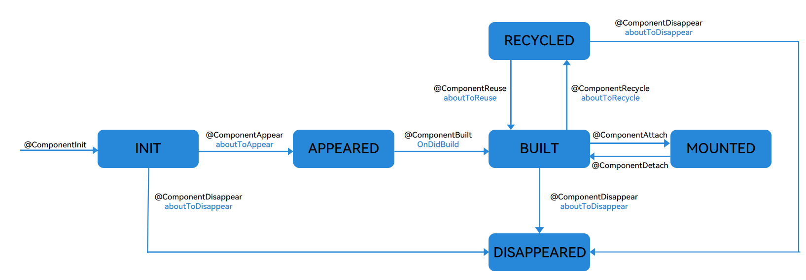
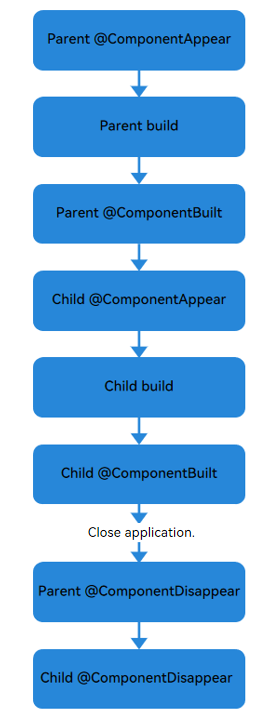

# Lifecycle of a Custom Component (Recommended)
<!--Kit: ArkUI-->
<!--Subsystem: ArkUI-->
<!--Owner: @xin11112-->
<!--Designer: @zhangboren-->
<!--Tester: @TerryTsao-->
<!--Adviser: @zhang_yixin13-->

## Overview

The existing [custom component lifecycle](./arkts-page-custom-components-lifecycle.md) callback function is triggered only by events. In some specific cases, the triggering sequence of the custom component lifecycle callback function does not meet the expectation. For example, [aboutToDisappear will call aboutToAppear by mistake in specific cases, or aboutToReuse will be called by mistake when a component is not expanded and reused](#differences-between-lifecycle-callback-functions). The new custom component lifecycle callbacks are restricted by the state machine, and the timing of calling lifecycle callbacks is as expected.

Lifecycle of a custom component, that is, the lifecycle of a custom component decorated by [@Component](arkts-create-custom-components.md#component) or [@ComponentV2](./arkts-create-custom-components.md#componentv2). Since API version 23, the following lifecycle decorators are provided:

- [\@ComponentInit](../../reference/apis-arkui/arkui-ts/ts-custom-component-new-lifecycle.md#componentinit): The function decorated by \@ComponentInit is executed when the custom component is about to be constructed. You can register listening and modify variables in this function.

- [\@ComponentAppear](../../reference/apis-arkui/arkui-ts/ts-custom-component-new-lifecycle.md#componentappear): When a component is about to appear, the function decorated by the decorator is called back. The function is executed after a new instance of the custom component is created and before the build function is executed.

- [\@ComponentBuilt](../../reference/apis-arkui/arkui-ts/ts-custom-component-new-lifecycle.md#componentbuilt): After the build function triggered by the first component rendering is executed, the decorator function is called back. This function will not be called back when the component is rendered again. You can implement functions that do not affect the actual UI, such as data reporting, in this phase.

- [\@ComponentDisappear](../../reference/apis-arkui/arkui-ts/ts-custom-component-new-lifecycle.md#componentdisappear): The function decorated by the decorator is executed before the custom component is destructed. You are not advised to change state variables in the functions decorated by \@ComponentDisappear. Especially, the modification of the @Link variable may cause unstable application behavior.

- [\@ComponentReuse](../../reference/apis-arkui/arkui-ts/ts-custom-component-new-lifecycle.md#componentreuse): When a reusable custom component is added from the cache to the node tree, the decorator decorated function is called to receive the construction input parameters of the component. At last, the function decorated by **\@ComponentReuse** recursively traverses all child components, and the **\@ComponentReuse** decorated function in each reused child component will be called.

- [\@ComponentRecycle](../../reference/apis-arkui/arkui-ts/ts-custom-component-new-lifecycle.md#componentrecycle): This function is triggered after a component is reclaimed. The necessary reclaim operations defined in the application are performed first, and then the function decorated by this decorator is called. At last, the function decorated by **\@ComponentRecycle** recursively traverses all child components, and the **\@ComponentRecycle** decorated function in each recycled child component will be called.

- [\@ComponentActive](../../reference/apis-arkui/arkui-ts/ts-custom-component-new-lifecycle.md#componentactive): When a component changes from the inactive state to the active state, the function decorated with this decorator is called. The concepts of activating and deactivating custom components are the same as those of activating and deactivating components in [component freezing](./arkts-custom-components-freeze.md). For details, see [Active and Inactive Lifecycles of a Custom Component](#active-and-inactive-lifecycles-of-a-custom-component).

- [\@ComponentInactive](../../reference/apis-arkui/arkui-ts/ts-custom-component-new-lifecycle.md#componentinactive): When a component changes from the active state to the inactive state, the function decorated with this decorator is called.

The lifecycle of a custom component is restricted by the state machine. The following figure shows the process.



### Custom Component Creation and Rendering

1. Custom component creation: An instance of a custom component is created by the ArkUI framework.

2. Initialization of custom component member variables: The member variables are initialized with locally defined defaults or component constructor parameters. The initialization happens in the document order, which is the order in which the member variables are defined.

3. On initial render, the **build** function of the built-in component is executed for rendering. If the child component is a custom component, the rendering creates an instance of the child component. During initial render, the framework records the mapping between state variables and components. When a state variable changes, the framework drives the related components to update.

### Custom Component Deletion

For example, if the branch of the if component changes or the number of arrays in the ForEach loop rendering changes, the component is removed.

1. Before a component is deleted, the lifecycle function of the \@ComponentDisappear decorator is called, indicating that the node is to be destroyed. The component deletion mechanism of ArkUI is as follows:<br>(1) The backend component is directly removed from the component tree and destroyed.<br>(2) The reference to the destroyed component is released from the frontend components.<br>(3) The Ark Engine garbage collects the destroyed component.

2. The custom component and its variables will be deleted. If the component has synchronous variables (such as [@Link](arkts-link.md), [@Prop](arkts-prop.md), and [@StorageLink](arkts-appstorage.md#storagelink)), the component is deregistered from the [Data Source](arkts-state-management-glossary.md#data-source)

## Active and Inactive Lifecycles of a Custom Component

The @ComponentActive and @ComponentInactive lifecycle decorators are available since API version 26.0.0. They are used to listen to the activation status changes of custom components and are not restricted by the state machine.

When a component changes from inactive to active (for example, when an application is switched from the background to the foreground or a page is displayed again), the function decorated by @ComponentActive is triggered. When a component changes from active to inactive (for example, when an application is switched to the background, a page is hidden, or a component is pre-created), the function decorated by @ComponentInactive is triggered. The activation or deactivation of a component is not equivalent to its visibility.

In this document, the activation of a custom component refers to the process where the component changes from inactive to active, and the @ComponentActive function is triggered. The deactivation of a custom component refers to the process where the component changes from active to inactive, and the @ComponentInactive function is triggered.

Currently, the activation and deactivation lifecycle supports the following scenarios.

### Listening to the activation status changes in the component recycling and reuse scenario

A component that enters the reuse pool becomes inactive. A reusable component becomes active when it is added back to the node tree from the reuse pool. This example shows the triggering of the activation and deactivation lifecycle callbacks of a custom component in the component recycling and reuse scenario.

```ts
import { ComponentActive, ComponentInactive, ComponentReuse, ComponentRecycle } from '@kit.ArkUI';

@Entry
@Component
struct Index {
  @State message: string = 'Hello World';
  @State changeChild: boolean = false;

  build() {
    Column() {
      Button('change')
        .onClick(() => {
          // Switch the display status of the child component to trigger component recycling or reuse.
          this.changeChild = !this.changeChild;
        })
      if (this.changeChild) {
        Child()
      }
    }
    .width('100%')
  }
}

@Reusable
@Component
struct Child {

  @ComponentReuse
  myReuse() {
    // Triggered when the component is reused.
    console.info(`Child myReuse`);
  }

  aboutToReuse() {
    // Triggered when the component is reused.
    console.info(`Child aboutToReuse`);
  }

  @ComponentActive
  myActive() {
    // Triggered when the component changes from the inactive state to the active state.
    console.info(`Child myActive`);
  }

  @ComponentRecycle
  myRecycle() {
    // Triggered when the component enters the reuse pool.
    console.info(`Child myRecycle`);
  }

  aboutToRecycle() {
    // Triggered when the component enters the reuse pool.
    console.info(`Child aboutToRecycle`);
  }

  @ComponentInactive
  myInactive() {
    // Triggered when the component changes from the active state to the inactive state.
    console.info(`Child myInactive`);
  }

  build() {
    Text('Child')
  }
}
```

You are advised to execute the preceding code in the following steps:

1. Click Change. The child component is created for the first time.

2. Click Change. The child component triggers the function and recycling event decorated by @ComponentInactive.
   ```text
   Child myInactive
   Child aboutToRecycle
   Child myRecycle
   ```

3. Click Change. The child component triggers the reuse event and the function decorated by @ComponentActive.
   ```text
   Child aboutToReuse
   Child myReuse
   Child myActive
   ```

When both the recycling and reuse and activation lifecycle are used, the time sequence for triggering related components by the custom component is as follows: @ComponentInactive is triggered earlier than @ComponentRecycle and aboutToRecycle, and @ComponentActive is triggered later than @ComponentReuse and aboutToReuse.

### Listening to Activation Status Changes in Lazy Creation Scenarios

Lazy creation means that there are multiple components in the container. Only the selected component is created. Other components are created only when they are selected through page turning or other methods. When a component that has been created is selected, the component enters the active state. When the component is not selected, the component enters the inactive state.

Lazy loading scenarios include [Tabs](../../ui/arkts-navigation-tabs.md) and [Navigation](../../ui/arkts-navigation-introduction.md). The following example shows the time when the @ComponentActive and @ComponentInactive lifecycle decorators are triggered in the **Navigation** and **Tabs** scenarios.

```typescript
// Index.ets
@Entry
@Component
struct Index {
  @State message: string = 'Hello World';
  @State pageStack: NavPathStack = new NavPathStack();

  build() {
    Column() {
      Navigation(this.pageStack) {
        Text(this.message)
        Button(`PageOne`)
          .onClick(() => {
            // Go to the PageOne page.
            this.pageStack.pushPath({ name: 'PageOne' });
          })
          .width('80%')
        Button(`PageTwo`)
          .onClick(() => {
            // Go to the PageTwo page.
            this.pageStack.pushPath({ name: 'PageTwo' });
          })
          .width('80%')
      }
    }
  }
}
```

```typescript
// PageOne.ets
@Builder
export function PageOneBuilder() {
  PageOne()
}

@Entry
@Component
struct PageOne {
  @State pageStack: NavPathStack = new NavPathStack();

  build() {
    NavDestination() {
      Column() {
        Text(`PageOne`)
        Button('PageTwo')
          .onClick(() => {
            // Go to the PageTwo page.
            this.pageStack.pushPath({ name: 'PageTwo' });
          })
          .width('80%')
        Button(`back`)
          .onClick(() => {
            // Return to the previous page.
            this.pageStack.pop();
          })
          .width('80%')
      }
    }
    .onReady((context: NavDestinationContext) => {
      // Obtain the navigation path stack when the page is ready.
      this.pageStack = context.pathStack;
    })
  }
}
```

```typescript
// PageTwo.ets
import { ComponentActive, ComponentInactive } from '@kit.ArkUI';

@Builder
export function PageTwoBuilder() {
  PageTwo()
}

@Entry
@Component
struct PageTwo {
  @State pageStack: NavPathStack = new NavPathStack();
  @State @Watch('onMessageUpdated') message: number = 0;

  onMessageUpdated() {
    console.info(`TabContent message callback func ${this.message}`);
  }

  build() {
    NavDestination() {
      Column() {
        Text(`PageTwo`)
        Button(`PageOne`)
          .onClick(() => {
            // Redirect to the PageOne page.
            this.pageStack.pushPath({ name: 'PageOne' });
          })
          .width('80%')
        Button(`back`)
          .onClick(() => {
            // Return to the previous page.
            this.pageStack.pop();
          })
          .width('80%')
        Row() {
          Column() {
            Button(`change message`)
              .onClick(() => {
                this.message++;
              })
            TabsComponent();
          }
          .width('100%')
        }
        .height('100%')
      }
    }
    .onReady((context: NavDestinationContext) => {
      // Obtain the navigation path stack when the page is ready.
      this.pageStack = context.pathStack;
    })
  }
}

// Freeze a child component using the freezeWhenInactive attribute.
@Component({ freezeWhenInactive: true })
struct FreezeChild {
  @Link message: number;
  index: number = 0;

  @ComponentActive
  myActive() {
    // Triggered when the component changes from the inactive state to the active state.
    console.info(`FreezeChild myActive, index: ${this.index}`);
  }

  @ComponentInactive
  myInactive() {
    // Triggered when the component changes from the active state to the inactive state.
    console.info(`FreezeChild myInactive, index: ${this.index}`);
  }

  build() {
    Text(`message ${this.message}, index: ${this.index}`)
  }
}

@Component
struct TabsComponent {
  private data: number[] = [0, 1, 2];
  private controller: TabsController = new TabsController();
  @State @Watch('onMessageUpdated') message: number = 0;

  onMessageUpdated() {
    console.info(`TabContent message callback func ${this.message}`);
  }

  build() {
    Column() {
      Button(`Incr state ${this.message}`)
        .onClick(() => {
          this.message++;
        })
      Tabs() {
        ForEach(this.data, (item: number) => {
          TabContent() {
            // Pass the message to FreezeChild using @Link, so that the state can be synchronized between the parent and child components.
            FreezeChild({ message: this.message, index: item })
          }.tabBar(`tab${item}`)
        }, (item: number) => item.toString())
      }
      .vertical(false)
      .scrollable(true)
      .barMode(BarMode.Fixed)
      .barWidth(400)
      .barHeight(150)
      .animationDuration(400)
      .width('100%')
      .height(200)
      .backgroundColor(0xF5F5F5)
    }
  }
}
```

The subpage information is configured in the configuration file **route_map.json** as follows:
```json5
{
  "routerMap": [
    {
      "name": "PageOne",
      "buildFunction": "PageOneBuilder",
      "pageSourceFile": "src/main/ets/pages/PageOne.ets"
    },
    {
      "name": "PageTwo",
      "buildFunction": "PageTwoBuilder",
      "pageSourceFile": "src/main/ets/pages/PageTwo.ets"
    }
  ]
}
```

Configure the **routerMap** route mapping in the **module.json5** configuration file.
```json5
{
  "module": {
    // ···
    "routerMap": "$profile:route_map",
    // ···
  }
}
```

**Scenario description and log output:**

This example shows the component activation and deactivation status changes in the navigation page route and TabContent switching scenarios. When the page route is switched, the FreezeChild component of the page that is left triggers @ComponentInactive, and the FreezeChild component of the page that is returned to triggers @ComponentActive.

You are advised to execute the preceding code in the following steps.

1. Click the PageTwo button to go to the PageTwo page.

   tab0 is selected, and the FreezeChild component in tab0 is created.

2. Click tab1. tab0 is no longer selected and becomes inactive. The FreezeChild component in tab0 triggers @ComponentInactive.
   ```text
   FreezeChild myInactive, index: 0
   ```

3. Click tab0. tab0 is selected and becomes active. The FreezeChild component in tab0 triggers @ComponentActive. tab1 is no longer selected and becomes inactive. The FreezeChild component in tab1 triggers @ComponentInactive.
   ```text
   FreezeChild myActive, index: 0
   FreezeChild myInactive, index: 1
   ```

4. Click PageOne. The PageOne page is displayed. tab0 in PageTwo is no longer selected and becomes inactive. FreezeChild in tab0 triggers @ComponentInactive.
   ```text
   FreezeChild myInactive, index: 0
   ```

5. Click back. The page returns to PageTwo. tab0 in PageTwo is selected and becomes active. FreezeChild in tab0 triggers @ComponentActive.
   ```text
   FreezeChild myActive, index: 0
   ```

### Listening to Activation Status Changes in Preloading Scenarios

Take [LazyForEach](../../ui/rendering-control/arkts-rendering-control-lazyforeach.md) as an example. After the components in the preload area of **LazyForEach** are created, they become inactive. When components such as [List](../../reference/apis-arkui/arkui-ts/ts-container-list.md), [Swiper](../../reference/apis-arkui/arkui-ts/ts-container-swiper.md), [Grid](../../reference/apis-arkui/arkui-ts/ts-container-grid.md), and [WaterFlow](../../reference/apis-arkui/arkui-ts/ts-container-waterflow.md) use **LazyForEach**, you can use the count property of [cachedCount](../../reference/apis-arkui/arkui-ts/ts-container-list.md#cachedcount14) to set the number of nodes in the preload area.

This example demonstrates the activation and deactivation status changes of components in the List and LazyForEach scenarios.

```typescript
import { ComponentActive, ComponentInactive } from '@kit.ArkUI';
import { MyDataSource } from './BasicDataSource';

@Entry
@Component
struct Index {
  @State dataSource: MyDataSource<string> = new MyDataSource();
  private scrollerForList: Scroller = new Scroller();
  @State colors: number[] = [0xFFC0CB, 0xDA70D6, 0x6B8E23, 0x6A5ACD, 0x00FFFF, 0x00FF7F];
  @State changeShow: boolean = false;

  aboutToAppear(): void {
    for (let index = 1; index <= 50; index++) {
      this.dataSource.pushData('page-' + index);
    }
  }

  build() {
    Column() {
      Button('change')
        .onClick(() => {
          // Control the creation and destruction of the list.
          this.changeShow = !this.changeShow;
        })
      if (this.changeShow) {
        List({ space: 10 }) {
          LazyForEach(this.dataSource, (item: number, index: number) => {
            ListItem() {
              Child({ item: item.toString(), index: index.toString() })
            }
            .backgroundColor(Color.Orange)
            .width('100%')
          }, (item: number) => item.toString())
        }
        .height(360)
        // The number of nodes that can be contained in the preload area is 5.
        .cachedCount(5, false)
      }
    }
  }
}

@Component
struct Child {
  @State index: string = '';
  @State item: string = '';
  @ComponentActive
  myActive() {
    // Triggered when the component changes from the inactive state to the active state.
    console.info(`Child myActive, index: ${this.index}`);
  }
  @ComponentInactive
  myInactive() {
    // Triggered when the component changes from the active state to the inactive state.
    console.info(`Child myInactive, index: ${this.index}`);
  }
  build() {
    Column() {
      Text(`Item ${this.item}`)
    }
  }
}
```

```typescript
// BasicDataSource.ets
abstract class BasicDataSource<T> implements IDataSource {
  private listeners: DataChangeListener[] = [];
  abstract totalCount(): number;
  abstract getData(index: number): T;

  // Register the data change listener.
  registerDataChangeListener(listener: DataChangeListener): void {
    if (this.listeners.indexOf(listener) < 0) {
      this.listeners.push(listener);
    }
  }

  // Unregister the data change listener.
  unregisterDataChangeListener(listener: DataChangeListener): void {
    const pos = this.listeners.indexOf(listener);
    if (pos >= 0) {
      this.listeners.splice(pos, 1);
    }
  }

  // Notify the controller of data addition.
  notifyDataAdd(index: number): void {
    this.listeners.forEach(listener => {
      listener.onDataAdd(index);
    })
  }
}

export class MyDataSource<T> extends BasicDataSource<T> {
  private dataArray: T[] = [];

  // Total data amount of the data source
  public totalCount(): number {
    return this.dataArray.length;
  }

  // Return the data with the specified index.
  public getData(index: number): T {
    return this.dataArray[index];
  }

  // Adding a piece of data
  public pushData(data: T): void {
    this.dataArray.push(data);
    this.notifyDataAdd(this.dataArray.length - 1);
  }
}
```
Scenario description and log output:

You are advised to execute the preceding code in the following steps.

1. Click the **change** button. The component in the preload area triggers @ComponentInactive.
   ```text
   Child myInactive, index: 13
   Child myInactive, index: 14
   Child myInactive, index: 15
   Child myInactive, index: 16
   Child myInactive, index: 17
   ```

2. When you swipe down the list, the component in the loading area triggers @ComponentActive, the component in the preload area triggers @ComponentInactive, and the component in the preload area triggers @ComponentInactive.
   ```text
   Child myActive, index: 13
   Child myInactive, index: 18
   Child myInactive, index: 0
   ```

When the show attribute of cachedCount of the list is set to true, after @ComponentInactive is triggered after the preloading node is created, the component is moved up to the tree and @ComponentActive is triggered.

### Listening to the activation status change in the case of page visibility changes

When the [Router](../../ui/arkts-router-to-navigation.md) page is hidden, onPageHide is triggered, and the components on the page are changed to the inactive state. When the page is displayed, onPageShow is triggered, and the components on the page are changed to the active state. Similarly, when the screen is turned on, onPageShow is triggered, and the components on the page are changed to the active state. When the screen is turned off, onPageHide is triggered, and the components on the page are changed to the inactive state.

This example shows the activation and deactivation status changes of components in the case of page visibility changes.

```typescript
import { ComponentActive, ComponentInactive } from '@kit.ArkUI';

@Entry
@Component
struct MyActiveSample {
  @State stateVar: string = 'Hello World';

  @ComponentActive
  myActive() {
    // Triggered when the component changes from inactive to active.
    console.info(`myActive`);
  }

  @ComponentInactive
  myInactive() {
    // Triggered when the component changes from active to inactive.
    console.info(`myInactive`);
  }

  build() {
    Column() {
      Text(this.stateVar)
    }
    .width(`100%`)
    .height(`100%`)
  }
}
```

Scenario description and log output:

You are advised to execute the preceding code in the following steps.

1. When the screen is turned off, the @ComponentInactive event is triggered.
   ```text
   myInactive
   ```

2. When the screen is turned on, the @ComponentActive event is triggered.
   ```text
   myActive
   ```

## Constraints

- \@ComponentInit, \@ComponentAppear, \@ComponentBuilt, \@ComponentDisappear, \@ComponentActive, \@ComponentInactive, @ComponentReuse, and @ComponentRecycle can be used only in structs decorated with @Component or @ComponentV2. Otherwise, a compilation error will be reported.

- The functions decorated with @ComponentInactive and @ComponentRecycle cannot have input parameters. Otherwise, a compilation error will be reported.

- In the struct decorated with @Component, the function decorated with @ComponentReuse can have no or one input parameter. Otherwise, a compilation error will be reported.

- In the struct decorated with @ComponentV2, the function decorated with @ComponentReuse cannot have input parameters. Otherwise, a compilation error will be reported.

- When a lifecycle decorator is added to a method, the method is called back when the corresponding event of the custom component occurs. It is recommended that the lifecycle decorator be used independently and not together with other state variable decorators. For example, when the lifecycle decorator is used together with [@Computed](./arkts-new-computed.md), the lifecycle decorator does not take effect.
  ```typescript
  @Computed
  @ComponentAppear
  get sum() {
    return 1 + 2 + 3; // Incorrect usage. The lifecycle decorator does not take effect for the get method.
  }
  ```
- If the custom component does not use the lifecycle decorator and does not register a listener, the return value is always [CustomComponentLifecycleState.INIT](../../reference/apis-arkui/arkui-ts/ts-custom-component-new-lifecycle.md#customcomponentlifecyclestate) when [getCurrentState](../../reference/apis-arkui/arkui-ts/ts-custom-component-new-lifecycle.md#getcurrentstate) is used to query the current lifecycle status of the custom component.

- After a custom component is created, it is activated by default. The callback function of @ComponentActive is not triggered.

## When to Use

### Nesting of Custom Components

The following example describes the invoking time sequence of the lifecycle of a custom component when the custom component is nested:

```typescript
import { hilog } from '@kit.PerformanceAnalysisKit';
import { ComponentAppear, ComponentBuilt, ComponentDisappear } from '@kit.ArkUI';

@Entry
@Component
struct Index {
  @State show: boolean = true;
  @State btnColor: string = '#FF007DFF';
  build() {
    Column() {
      Button('delete Parent And Child')
        .margin(20)
        .backgroundColor(this.btnColor)
        .onClick(() => {
          this.show = !this.show;
        })
      if (this.show) {
        Parent()
      }
    }
  }
}
@Component
struct Parent {
  @State showChild: boolean = true;
  @State btnColor: string = '#FF007DFF';
  // ComponentAppear in the component lifecycle. After the parent creates an instance and before the build function is executed, myAppear is called back.
  @ComponentAppear
  myAppear() {
    hilog.info(0x0000, 'testTag', 'Parent myAppear');
  }
  // The component life cycle is ComponentBuilt. The myBuilt function is called after the build function (triggered by the initial rendering of the parent) finishes executing.
  @ComponentBuilt
  myBuilt() {
    hilog.info(0x0000, 'testTag', 'Parent myBuilt');
  }
  // The component life cycle is ComponentDisappear. The myDisappear function is called back before the Parent is destructed and destroyed.
  @ComponentDisappear
  myDisappear() {
    hilog.info(0x0000, 'testTag', 'Parent myDisappear');
  }

  build() {
    Column() {
      // When this.showChild is true, create the Child child component and invoke Child myAppear.
      if (this.showChild) {
        Child()
      }
      Button('delete Child')
        .margin(20)
        .backgroundColor(this.btnColor)
        .onClick(() => {
          // When this.showChild is false, delete the Child child component and invoke Child myDisappear.
          // When this.showChild is true, add the Child component and invoke Child myAppear.
          this.showChild = !this.showChild;
        })
    }
  }
}

@Component
struct Child {
  @State title: string = 'Hello World';
  @ComponentDisappear
  myDisappear() {
    hilog.info(0x0000, 'testTag', 'Child myDisappear');
  }
  @ComponentBuilt
  myBuilt() {
    hilog.info(0x0000, 'testTag', 'Child myBuilt');
  }
  @ComponentAppear
  myAppear() {
    hilog.info(0x0000, 'testTag', 'Child myAppear');
  }

  build() {
    Text(this.title)
      .fontSize(50)
      .margin(20)
      .onClick(() => {
        this.title = 'Hello ArkUI';
      })
  }
}
```

In the preceding example, the Index page contains two custom components: Parent and Child. The Parent component and its child component Child declare the functions (myAppear/myBuilt/myDisappear) of the custom component lifecycle decorator.

- The initialization process of application cold start is as follows: **Parent myAppear** --&gt; **Parent build** --&gt; **Parent myBuilt** --&gt; **Child myAppear** --&gt; **Child build** --&gt; **Child myBuilt**. The lazy expansion feature of the custom component is reflected here. That is, the parent component executes myAppear of the child component only after executing myBuilt. The log information is as follows:

```text
Parent myAppear
Parent myBuilt
Child myAppear
Child myBuilt
```

- Click the button, change the value of showChild to false, delete the Child component, and execute the Child myDisappear function.

- If you click the button, change the value of show to **false**, or directly exit the application, the **Parent myDisappear** --&gt; **Child myDisappear** lifecycle is triggered. In this case, the customized components are deleted from the parent component to the child component. The log information is as follows:

```text
Parent myDisappear
Child myDisappear
```

- When the app is minimized or the app enters the background, the current index page is not destroyed. Therefore, the myDisappear method of the component is not executed.

- If the default value of showChild is false, the initialization process of the application cold start is **Parent myAppear** --&gt; **Parent build** --&gt; **Parent myBuilt**. The log information is as follows:

```text
Parent myAppear
Parent myBuilt
```
- If the default value of showChild is false and you click the button to change the value of show to false or directly exit the application, only the Parent myDisappear function is executed.

- If the default value of showChild is false, click the button, change the value of showChild to true, and add the Child component. The process is **Child myAppear** --&gt; **Child build** --&gt; **Child myBuilt**. The log information is as follows:

```text
Child myAppear
Child myBuilt
```
When **showchild** is set to the default value true, the lifecycle of this example is as follows:



### Reusing Custom Components

The following example describes the lifecycle invoking sequence of reusing custom components in detail:

```typescript
import { ComponentInit, ComponentAppear, ComponentBuilt, ComponentDisappear, ComponentReuse, ComponentRecycle } from '@kit.ArkUI';
import { hilog } from '@kit.PerformanceAnalysisKit';

export class Message {
  value: string | undefined;
  constructor(value: string) {
    this.value = value;
  }
}
@Entry
@Component
struct Index {
  @State switch: boolean = true;

  build() {
    Column() {
      Button('Hello')
        .fontSize(30)
        .fontWeight(FontWeight.Bold)
        .onClick(() => {
          this.switch = !this.switch;
        })
      // Change the switch to reclaim and reuse the child.
      // Change the value of this.switch to false, reclaim the Child subcomponent, and execute Child myRecycle.
      // Change the value of this.switch to true, reuse the Child subcomponent, and execute Child myReuse.
      if (this.switch) {
        // If only one reusable component is used, reuseId is optional.
        Child({ message: new Message('Child') })
          .reuseId('Child')
      }
    }
    .height('100%')
    .width('100%')
  }
}

@Reusable
@Component
struct Child {
  @State message: Message = new Message('Child');
  @State label: string = 'HelloWorld';
  @State switch: boolean = true;
  @ComponentInit
  myInit() {
    hilog.info(0x0000, 'testTag', 'Child myInit');
  }
  @ComponentAppear
  myAppear() {
    this.label = 'myAppear';
    hilog.info(0x0000, 'testTag', 'Child myAppear');
  }
  @ComponentBuilt
  myBuilt() {
    this.label = 'myBuilt';
    hilog.info(0x0000, 'testTag', 'Child myBuilt');
  }
  @ComponentRecycle
  myRecycle() {
    this.label = 'myRecycle';
    hilog.info(0x0000, 'testTag', 'Child myRecycle');
  }
  @ComponentDisappear
  myDisappear() {
    this.label = 'myDisappear';
    hilog.info(0x0000, 'testTag', 'Child myDisappear');
  }
  @ComponentReuse
  myReuse(params?: Record<string, Object | undefined | null>) {
    this.label = 'myReuse';
    hilog.info(0x0000, 'testTag', 'Child myReuse');
  }

  build() {
    Column() {
      Text(this.message.value)
        .fontSize(30)
      Button('Hello')
        .fontSize(30)
        .fontWeight(FontWeight.Bold)
        .onClick(() => {
          this.switch = !this.switch;
        })
      if (this.switch) {
        GrandChild({ message: new Message('GrandChild') })
          .reuseId('GrandChild')
      }
    }
    .borderWidth(1)
    .height(100)
  }
}

@Reusable
@Component
struct GrandChild {
  @State message: Message = new Message('GrandChild');
  @State label: string = 'HelloWorld';
  @State switch: boolean = true;
  @ComponentInit
  myInit() {
    hilog.info(0x0000, 'testTag', 'GrandChild myInit');
  }
  @ComponentAppear
  myAppear() {
    this.label = 'myAppear';
    hilog.info(0x0000, 'testTag', 'GrandChild myAppear');
  }
  @ComponentBuilt
  myBuilt() {
    this.label = 'myBuilt';
    hilog.info(0x0000, 'testTag', 'GrandChild myBuilt');
  }
  @ComponentRecycle
  myRecycle() {
    this.label = 'myRecycle';
    hilog.info(0x0000, 'testTag', 'GrandChild myRecycle');
  }
  @ComponentDisappear
  myDisappear() {
    this.label = 'myDisappear';
    hilog.info(0x0000, 'testTag', 'GrandChild myDisappear');
  }
  @ComponentReuse
  myReuse(params?: Record<string, Object | undefined | null>) {
    this.label = 'myReuse';
    hilog.info(0x0000, 'testTag', 'GrandChild myReuse');
  }

  build() {
    Column() {
      Text(this.message.value)
        .fontSize(30)
    }
    .borderWidth(1)
    .height(100)
  }
}
```

In the preceding example, the Index page contains the customized component Child, and the Child component contains the customized component GrandChild. Child and GrandChild declare the functions (myInit, myAppear, myBuilt, myRecycle, myReuse, and myDisappear) decorated by the custom component lifecycle decorator.

- The initialization process of the cold start is as follows: Child myInit --&gt; Child myAppear --&gt; GrandChild myInit --&gt; Child myBuilt --&gt; GrandChild myAppear --&gt; GrandChild myBuilt. The lazy expansion feature of the custom component is reflected here. That is, the myAppear of the GrandChild component is executed only after the Child component executes myBuilt. The log information is as follows:

```text
Child myInit
Child myAppear
GrandChild myInit
Child myBuilt
GrandChild myAppear
GrandChild myBuilt
```

- Click the button to change the value of showChild to false, so that the Child and GrandChild components are recycled, and the myRecycle functions of the Child and GrandChild components are executed.

```text
Child myRecycle
GrandChild myRecycle
```

### Registering a Listener for the Life Cycle of a Custom Component

[CustomComponentLifecycleObserver](../../reference/apis-arkui/arkui-ts/ts-custom-component-new-lifecycle.md#customcomponentlifecycleobserver) is used to listen to the lifecycle of custom components. You can override the callback function in CustomComponentLifecycleObserver as required.

```typescript
import { ComponentInit, ComponentDisappear, UIUtils, CustomComponentLifecycleObserver, CustomComponentLifecycle } from '@kit.ArkUI';
import { hilog } from '@kit.PerformanceAnalysisKit';

export class Message {
  value: string | undefined;
  constructor(value: string) {
    this.value = value;
  }
}

@Entry
@Component
struct Index {
  @State switch: boolean = true;

  build() {
    Column() {
      Button('Hello')
        .fontSize(30)
        .fontWeight(FontWeight.Bold)
        .onClick(() => {
          this.switch = !this.switch;
        })
      if (this.switch) {
        // If only one reusable component is used, reuseId is optional.
        Child({ message: new Message('Child') })
          .reuseId('Child')
      }
    }
    .height('100%')
    .width('100%')
  }
}

@Reusable
@Component
struct Child {
  @State message: Message = new Message('AboutToReuse');
  @State label: string = 'HelloWorld';
  @ComponentInit
  myInit(): void {
    registerObserver(UIUtils.getLifecycle(this));
  }
  @ComponentDisappear
  myDisappear(): void {
    unRegisterObserver(UIUtils.getLifecycle(this));
  }

  build() {
    Column() {
      Text(this.message.value)
        .fontSize(30)
    }
  }
}

export class MyObserver implements CustomComponentLifecycleObserver {
  // Override the lifecycle events in CustomComponentLifecycleObserver. CustomComponentLifecycleObserver cannot listen to the aboutToInit event of the parent component.
  aboutToAppear() {
    hilog.info(0x0000, 'testTag', 'MyObserver aboutToAppear');
  }
  onDidBuild() {
    hilog.info(0x0000, 'testTag', 'MyObserver onDidBuild');
  }
  aboutToReuse(params?: Record<string, Object | undefined | null>) {
    // If params exists, it is the multiplexing of V1.
    hilog.info(0x0000, 'testTag', 'MyObserver aboutToReuse');
  }
  aboutToRecycle() {
    hilog.info(0x0000, 'testTag', 'MyObserver aboutToRecycle');
  }
  // Unregister the listener in the aboutToDelete function of the parent component. As a result, the aboutToDisappear event of the parent component cannot be listened to.
  aboutToDisappear() {
    hilog.info(0x0000, 'testTag', 'MyObserver aboutToDisappear');
  }
}

// Create the Observer object.
const observer = new MyObserver();
export function registerObserver(lifeCycle: CustomComponentLifecycle) {
  // Register the listener with lifeCycle.
  lifeCycle.addObserver(observer);
}
export function unRegisterObserver(lifeCycle: CustomComponentLifecycle) {
  // Unregister the listener from lifeCycle.
  lifeCycle.removeObserver(observer);
}
```

The listener is deregistered in the function decorated by @ComponentDisappear. Therefore, the listener cannot listen to aboutToDisappear.

Press the Hello button twice and close the program. The log information is as follows:

```text
MyObserver aboutToAppear
MyObserver onDidBuild
MyObserver aboutToRecycle
MyObserver aboutToReuse
```

You can register and cancel the listening in the onAppear and onDisAppear of the component. Register the listener in the onAppear. At this time, the component is in the Appeared state. Therefore, the aboutToAppear of the component cannot be listened.

```typescript
Column() {
  Text('Hello World')
}
.onAppear(() => {
  // Register a listener in the onAppear function.
  registerObserver(UIUtils.getLifecycle(this));
})
.onDisAppear(() => {
  unRegisterObserver(UIUtils.getLifecycle(this));
})
```

## Differences Between Lifecycle Callback Functions

### Differences between \@ComponentAppear, \@ComponentDisappear, aboutToAppear, and aboutToDisappear

When a custom component is in the INIT state and is about to be converted to the APPEARED state, aboutToAppear is called before the function decorated by \@ComponentAppear.

When a custom component in the INIT, BUILT, or RECYCLED state is about to change to the DISAPPEARED state, the function decorated by \@ComponentDisappear is called before aboutToDisappear.

aboutToAppear is executed before the custom component is built, and aboutToDisappear is executed before the custom component is destroyed. However, sometimes a custom component is destroyed before it is built. To execute a complete lifecycle, the aboutToDisappear component checks whether the component executes aboutToAppear. If the component does not execute aboutToAppear, aboutToAppear is forcibly triggered. Functions decorated by \@ComponentAppear and \@ComponentDisappear are restricted by the state machine. Functions decorated by \@ComponentDisappear do not call functions decorated by \@ComponentAppear by mistake. The following is an example:

```typescript
// Index.ets
import { SwiperExample } from './SwiperPage';

@Entry
@Component
struct Index {
  @State message: string = 'Hello World';
  controller: TabsController = new TabsController();
  @State show: boolean = false;
  @State currentTabIndex: number = 0;

  build() {
    RelativeContainer() {
      Text('start')
        .fontSize(50)
        .fontColor('#000')
        .id('text')
        .alignRules({
          top: { anchor: '__container__', align: VerticalAlign.Top },
          middle: { anchor: '__container__', align: HorizontalAlign.Center }
        })
        .onClick(() => {
          // If this.show is set to true, SwiperExample is created. If this.show is set to false, SwiperExample is destroyed.
          this.show = !this.show;
        })
      if (this.show) {
        SwiperExample()
          .id('TableExample')
          .alignRules({
            bottom: { anchor: '__container__', align: VerticalAlign.Bottom },
            middle: { anchor: '__container__', align: HorizontalAlign.Center }
          })
          .width('100%')
          .height('auto')
      }
    }
    .height('100%')
    .width('100%')
  }
}
```

```typescript
// SwiperPage.ets
import { ComponentAppear, ComponentDisappear } from '@kit.ArkUI';
import { hilog } from '@kit.PerformanceAnalysisKit';

@Component
export struct SwiperPage {
  @State name: number = 0;
  aboutToAppear(): void {
    hilog.info(0x0000, 'testTag', 'SwiperPage aboutToAppear %{public}d', this.name);
  }
  aboutToDisappear(): void {
    hilog.info(0x0000, 'testTag', 'SwiperPage aboutToDisappear %{public}d', this.name);
  }
  @ComponentAppear
  myAppear(): void {
    hilog.info(0x0000, 'testTag', 'SwiperPage myAppear %{public}d', this.name);
  }
  @ComponentDisappear
  myDisappear(): void {
    hilog.info(0x0000, 'testTag', 'SwiperPage myDisappear %{public}d', this.name);
  }

  build() {
    Text(this.name.toString())
      .width('90%')
      .height(160)
      .fontColor(Color.Black)
      .backgroundColor(0xAFEEEE)
      .textAlign(TextAlign.Center)
      .fontSize(30)
  }
}

class MyDataSource implements IDataSource {
  list: number[] = [];
  constructor(list: number[]) {
    this.list = list;
  }
  totalCount(): number {
    return this.list.length;
  }
  getData(index: number): number {
    return this.list[index];
  }
  registerDataChangeListener(listener: DataChangeListener): void {}
  unregisterDataChangeListener() {}
}

@Entry
@Component
export struct SwiperExample {
  private swiperController: SwiperController = new SwiperController()
  private data: MyDataSource = new MyDataSource([])
  @State selectedTabIndex: number = 0;
  @ComponentAppear
  myAppear(): void {
    // Assign a value to data in myAppear.
    let list: number[] = [];
    for (let i = 0; i <= 11; i++) {
      list.push(i);
    }
    this.data = new MyDataSource(list);
  }

  build() {
    Column({ space: 5 }) {
      Swiper(this.swiperController) {
        ForEach(this.data.list, (item: number) => {
          SwiperPage({
            name: item
          })
        })
      }
      .index(this.selectedTabIndex)
      .autoPlay(false)
      .disableSwipe(true)
      .indicator(false)
      .width('100%')
      .cachedCount(2) // Cache two nodes forward and two nodes backward based on the current node.
      .onChange((index) => {
        this.selectedTabIndex = index;
      })
      Row({ space: 12 }) {
        Button('showNext')
          .onClick(() => {
            this.swiperController.showNext();
          })
        Button('showPrevious')
          .onClick(() => {
            this.swiperController.showPrevious();
          })
      }
      .margin(5)
    }
    .width('100%')
    .margin({ top: 5 })
  }
}
```
After the program is started, click the start button. Only the five nodes cached by swipe start to execute aboutToAppear and myAppear. The non-cached nodes do not trigger aboutToAppear and myAppear.

The log information is as follows:

```text
SwiperPage:aboutToAppear 0
SwiperPage:myAppear 0
SwiperPage:aboutToAppear 11
SwiperPage:myAppear 11
SwiperPage:aboutToAppear 1
SwiperPage:myAppear 1
SwiperPage:aboutToAppear 10
SwiperPage:myAppear 10
SwiperPage:aboutToAppear 2
SwiperPage:myAppear 2
```

When the program is closed, aboutToDisappear is normally triggered on the five cache nodes. However, aboutToAppear is forcibly triggered before aboutToDisappear is triggered on the non-cache nodes. Regardless of whether the node is a cache node, myDisappear does not trigger myAppear by mistake.

```text
SwiperPage:myDisappear 0
SwiperPage:aboutToDisappear 0
SwiperPage:myDisappear 1
SwiperPage:aboutToDisappear 1
SwiperPage:myDisappear 2
SwiperPage:aboutToDisappear 2
SwiperPage:aboutToAppear 3
SwiperPage:myDisappear 3
SwiperPage:aboutToDisappear 3
SwiperPage:aboutToAppear 4
SwiperPage:myDisappear 4
SwiperPage:aboutToDisappear 4
...
```

### Differences between \@ComponentReuse, \@ComponentRecycle, aboutToReuse, and aboutToRecycle

When a custom component in the RECYCLED state is about to be converted to the BUILT state, the aboutToReuse function is called before the \@ComponentReuse decorated function.

When a custom component is in the BUILT state and is about to be converted to the RECYCLED state, the aboutToRecycle function is called before the \@ComponentRecycle decorated function.

```typescript
import { ComponentAppear, ComponentBuilt, ComponentReuse } from '@kit.ArkUI';
import { hilog } from '@kit.PerformanceAnalysisKit';

@Entry
@Component
struct ReusableTest {
  @State flag1: boolean = true;
  @State flag2: boolean = false;
  build() {
    Column() {
      // Click the button to switch flag1 and trigger the recycling or reuse of ReusableComp1 and ReusableComp2.
      Button('a')
        .onClick(() => {
          this.flag1 = !this.flag1;
        })
      // Click the button to switch flag2 and trigger the recycling or reuse of ReusableComp1 and ReusableComp3.
      Button('b')
        .onClick(() => {
          this.flag2 = !this.flag2;
        })
      if (this.flag1) {
        ReusableComp1({ flag: true })
      }
      if (this.flag2) {
        ReusableComp1({ flag: false })
      }
    }
  }
}

@Reusable
@Component
struct ReusableComp1 {
  @Require @Prop flag: boolean = true;
  build() {
    if (this.flag) {
      ReusableComp2()
    } else {
      ReusableComp3()
    }
  }
}

@Reusable
@Component
struct ReusableComp2 {
  build() {
    Text('A')
  }
}

@Reusable
@Component
struct ReusableComp3 {
  aboutToAppear(): void {
    hilog.info(0x0000, 'testTag', 'ReusableComp3 aboutToAppear');
  }
  aboutToReuse(params: Record<string, Object | undefined | null>): void {
    hilog.info(0x0000, 'testTag', 'ReusableComp3 aboutToReuse');
  }
  @ComponentReuse
  myReuse(params: Record<string, Object | undefined | null>): void {
    hilog.info(0x0000, 'testTag', 'ReusableComp3 myReuse');
  }
  @ComponentAppear
  myAppear(): void {
    hilog.info(0x0000, 'testTag', 'ReusableComp3 myAppear');
  }
  @ComponentBuilt
  myBuilt(): void {
    hilog.info(0x0000, 'testTag', 'ReusableComp3 myBuilt');
  }

  build() {
    Text('B')
  }
}
```

Press the **a** button. ReusableComp2 enters the recycling state. Press the **b** button. ReusableComp3 is created for the first time. The log information is as follows:

```text
ReusableComp3 aboutToReuse
ReusableComp3 aboutToAppear
ReusableComp3 myAppear
ReusableComp3 myBuilt
```

ReusableComp3 has never been created. However, after the b button is pressed, aboutToReuse of ReusableComp3 is called by mistake, and aboutToAppear and myBuilt of ReusableComp3 are called. However, myReuse is not called by mistake because myReuse is restricted by the state machine. When the component is not in the RECYCLED state, myReuse is not executed.
<!--no_check-->