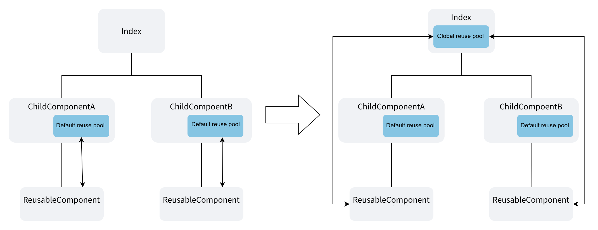
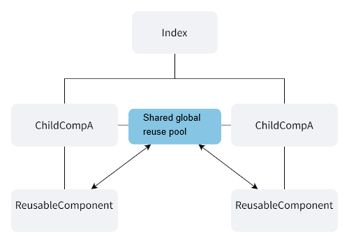
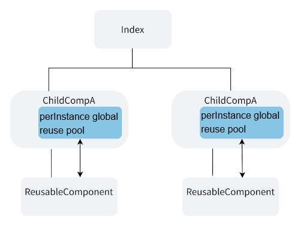
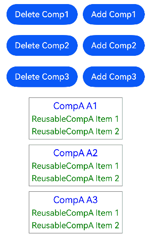
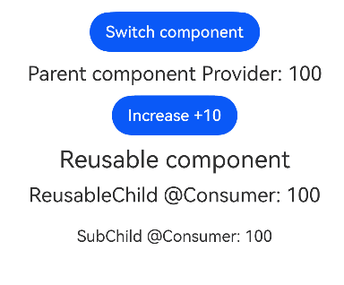
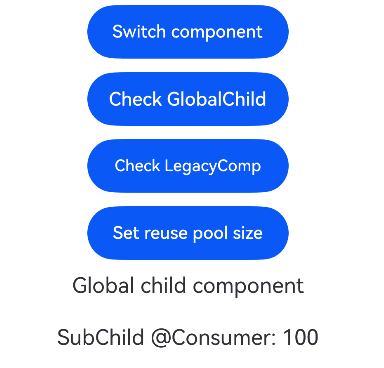
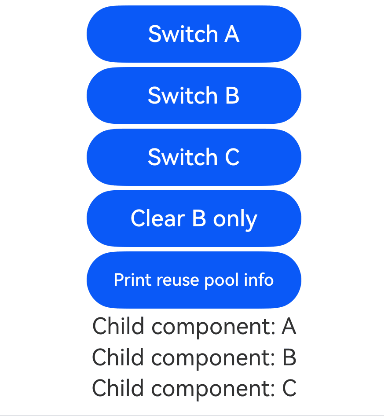
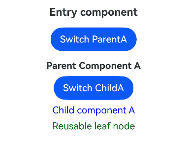

# Global Reuse: Centralized Component Recycling and Reuse

<!--Kit: ArkUI-->
<!--Subsystem: ArkUI-->
<!--Owner: @zhangboren-->
<!--Designer: @zhangboren-->
<!--Tester: @TerryTsao-->
<!--Adviser: @zhang_yixin13-->
<!-- md-trans-meta sourceCommit=5dcad25d98f5dfcd52a952512584b6f7002e81ae translatedAt=2026-07-01T06:20:29.193Z pushedAt=2026-07-01T10:47:58.083Z -->

To improve the performance and memory efficiency of component recycling and reuse, the global reuse pool feature allows you to configure a reuse pool for specified @Reusable/@ReusableV2 reusable components on any custom component. This global reuse pool has a higher priority than the default reuse pool bound to the parent component.

The global reuse pool enables sharing recycled component instances across different parent components, controlling the cache lifecycle and size, and pre-rendering components before their first use. Before reading this document, it is recommended to read [@ComponentV2](./arkts-create-custom-components.md#componentv2), [@Component](./arkts-create-custom-components.md#component), [@Reusable](./arkts-reusable.md), and [@ReusableV2](./arkts-new-reusableV2.md).

>**NOTE**
>
> The global reuse pool feature is supported since API version 26.0.0.
>
> This feature can be used in atomic services since API version 26.0.0.

## Overview

In the current implementation, each parent component of a @Reusable/@ReusableV2 component maintains its own local reuse pool. This leads to inefficient reuse when the same reusable component type is used by multiple sibling components, because a recycled instance in one parent component's pool cannot be reused by another parent component.

The global reuse pool solves this reuse efficiency problem by allowing developers to configure a reuse pool at an ancestor node in the component tree (a component annotated with @Component or @ComponentV2). When the global reuse pool is enabled, the framework traverses up the component tree upon creation or destruction of a reusable component, looking for a global reuse pool that accepts the specified reusable component type for recycling and reuse. This enables cross-parent reuse scenarios, increases the reuse rate, and improves the switching performance of reusable components. The global reuse pool provides the following capabilities:

- A single reuse pool can serve multiple child components, reducing the number of reuse pools and improving the reuse rate.

- Developers can choose whether all instances of a component class share a single reuse pool ([shared](#reuse-pool-ownership-mode)) or each instance has its own pool ([perInstance](#reuse-pool-ownership-mode)).

- The [IReusableInfo](../../reference/apis-arkui/js-apis-stateManagement.md#ireusableinfo) interface allows apps to query and limit the number of cached components, including information such as `reuseId`.

- The [preRender](../../reference/apis-arkui/js-apis-stateManagement.md#prerender) interface allows reusable components to be created in advance and placed into the reuse pool, speeding up initial rendering.

- When a reusable component is being recycled or created, if no matching global reuse pool is found by traversing the parent components, the component will use the default reuse pool in the parent component for recycling and reuse.

## Basic Concepts

**Default reuse pool**: For reusable components declared with [@Reusable](./arkts-create-custom-components.md#reusable) or [@ReusableV2](./arkts-create-custom-components.md#reusablev2), instances are retrieved from the parent component's reuse pool upon creation and recycled to the parent component's reuse pool upon destruction. This is the default behavior of reusable components when no global reuse pool is configured. The reuse pool in the parent component is referred to as the default reuse pool.

**Global reuse pool**: A global reuse pool is an independent reuse pool declared within any custom component. This pool can accept all reusable components under that component, independent of the parent-child component relationship. The types of reusable components it accepts must be configured separately. Compared with the default reuse pool, this new reuse pool accepts a wider range of components — it is not restricted to parent-child reuse, hence the name "global reuse pool."

## Capability Comparison Between Default Reuse Pool and Global Reuse Pool

| Category | Default Reuse Pool | Global Reuse Pool |
| -------- | ------------------ | ---------------- |
| Declaration Method | The default reuse pool requires no declaration. When a custom component decorated with @Reusable or @ReusableV2 is created or destroyed, a default reuse pool is created on the parent component, which can accept any custom component type. | The global reuse pool is enabled by configuring `reusePool` and `poolAccepts` in @Component or @ComponentV2. |
| Pool Sharing | Each parent instance has its own pool. | The `shared` mode allows all instances of the owning component class to share a single pool. |
| Cache Size Control | Not supported | `IReusableInfo.maxCount` provides cache limits per component and per reuseId. |
| Pre-rendering | Not supported | `preRender` creates components before their first use. |
| Memory Management | Pool lifecycle is bound to the parent instance. | The `shared` pool persists until all owning instances are destroyed; the `perInstance` pool is bound to a single instance. |
| V1 and V2 Mixing | Not supported | `poolAccepts` can include both @Reusable and @ReusableV2 reusable components. |
| Reading Reuse Pool Status | Not supported | [getReusableInfo](../../reference/apis-arkui/js-apis-stateManagement.md#getreusableinfo) obtains information about the global reuse pool of the current custom component. |

### Limitations of the @Reusable/@ReusableV2 Default Reuse Pool

Custom components declared with @Reusable and @ReusableV2 come with default reuse capability, and their default reuse pool exists only within the parent component. Therefore, when the same reusable component is used in different parent components, instances recycled in one parent component's reuse pool cannot be reused by components under another parent component.

Consider the following typical scenario: a parent component has two different child components that can be switched, and both child components use the same reusable component. By default, the reuse pools of these reusable components can only exist within the child components. When the child components are switched, the reuse pool is destroyed along with the child component, forcing the reusable components to be recreated from scratch when rendering the new component, rather than reusing already-created instances from the default reuse pool.

With the new global reuse capability, declaring a global reuse pool on the top-level component `Index` can improve the reuse efficiency of child components. When switching components with an `if` statement, the reusable component `ReusableComponent` under `ChildComponentA` can be stored in the global reuse pool on `Index`, and then retrieved and reused from the global reuse pool when `ReusableComponent` in `ChildComponentB` is created, avoiding the repeated creation of reusable components.



Default reuse pool example code:

<!-- @[GlobalReuseDefault](https://gitcode.com/openharmony/applications_app_samples/blob/master/code/DocsSample/GlobalReuse/entry/src/main/ets/pages/GlobalReuseDefault.ets) -->

``` TypeScript
@Entry
@ComponentV2
struct Index {
  @Local componentSwitch: boolean = false;
  build() {
    Column() {
      Button('Switch components')
        .onClick(() => {
          this.componentSwitch = !this.componentSwitch;
        })
      if (this.componentSwitch) { // Switch between different child components
        ChildComponentA()
      } else {
        ChildComponentB()
      }
    }
  }
}
@ComponentV2
struct ChildComponentA { // The reuse pool of the ReusableComponent is on the ChildComponentA by default, and is destroyed when the if branch switches in the Index component
  build() {
    Column() {
      Text('Component A')
      ReusableComponent() // Child components ComponentA and ComponentB share the reusable component ReusableComponent
    }
  }
}
@ComponentV2
struct ChildComponentB {
  build() {
    Column() {
      Text('Component B')
      ReusableComponent() // Child components ComponentA and ComponentB share the reusable component ReusableComponent
    }
  }
}
@ReusableV2
@ComponentV2
struct ReusableComponent { // Reusable component
  aboutToRecycle() {
    console.info('Reusable component is being recycled');
  }
  aboutToDisappear() {
    console.info('Reusable component is being destroyed'); // When the if branch switches in the Index component, because the default reuse pool of the parent component ChildComponentA is destroyed, this reusable component is also destroyed and cannot be reused by ChildComponentB.
  }
  build() {
    Text('ReusableComponent')
  }
}
```

The following is an example of adapting to the global reuse capability:

<!-- @[GlobalReusePool](https://gitcode.com/openharmony/applications_app_samples/blob/master/code/DocsSample/GlobalReuse/entry/src/main/ets/pages/GlobalReusePool.ets) -->

``` TypeScript
@ReusableV2
@ComponentV2
struct ReusableComponent { // Reusable component
  aboutToRecycle() {
    // When the if branch switches in the Index component, this component is accepted by the global reuse pool declared by the parent Index component and reused during the creation of ReusableComponent in ChildComponentB.
    console.info('Reusable component is being recycled');
  }
  aboutToDisappear() {
    console.info('Reusable component is being destroyed');
  }
  build() {
    Text('ReusableComponent')
  }
}
@Entry
@ComponentV2({
  reusePool: 'shared', // Configure the global reuse pool mode to enable the global reuse capability.
  poolAccepts: [ReusableComponent], // Configure the global reuse pool to accept custom components named ReusableComponent.
  freezeWhenInactive: false // Default configuration for component freezing.
})
struct Index {
  @Local componentSwitch: boolean = false;
  build() {
    Column() {
      Button('Switch components')
        .onClick(() => {
          this.componentSwitch = !this.componentSwitch;
        })
      if (this.componentSwitch) { // Switch between different child components.
        ChildComponentA()
      } else {
        ChildComponentB()
      }
    }
  }
}
@ComponentV2
struct ChildComponentA { // The reuse pool of the ReusableComponent uses the global reuse pool of the parent component Index, and the default reuse pool on ComponentA will be skipped.
  build() {
    Column() {
      Text('Component A')
      ReusableComponent() // Child components ComponentA and ComponentB share the reusable component ReusableComponent.
    }
  }
}
@ComponentV2
struct ChildComponentB {
  build() {
    Column() {
      Text('Component B')
      ReusableComponent() // Child components ComponentA and ComponentB share the reusable component ReusableComponent.
    }
  }
}
```

## Decorator Description

@Component/@ComponentV2 configuration parameters:

| Name | Type | Mandatory | Description |
| --------- | --- | ---  | --- |
| `reusePool` | [`ReusePoolOwnership`](#reuse-pool-ownership-mode) | No | If the global reuse feature is used, the value of this parameter must be `"shared"` or `"perInstance"`. Determines whether all instances of this component class share a single reuse pool or each instance has its own pool.|
| `poolAccepts` | Function[] | No | An array of reusable components accepted by the global reuse pool, which can include custom components decorated with both @Reusable and @ReusableV2.|
| `freezeWhenInactive` | boolean | Yes | Configures the custom component to support component freezing. `true`: enable component freezing, `false`: disable component freezing.<br>Starting from API version 11, this parameter can be used to configure @Component component freezing. For an example, see [Custom Component Freezing](../../ui/state-management/arkts-custom-components-freeze.md).<br>Starting from API version 12, this parameter can be used to configure @ComponentV2 component freezing. For an example, see [Custom Component Freezing](../../ui/state-management/arkts-custom-components-freezeV2.md).|

### Reuse Pool Ownership Mode

The global reuse pool is an instance declared on a custom component. Its ownership mode determines whether the reuse pool is released along with the lifecycle of the custom component.

**`"shared"`**: All instances of the @Component/@ComponentV2 class share a single reuse pool instance.



Lifecycle of the `shared` reuse pool:

1. When the first instance of the owning component is created, the reuse pool is created and referenced by that instance.

2. When the second instance of the owning component is created, it references the already created reuse pool. No new pool is created.

3. When the first instance is destroyed, the reuse pool is not destroyed because it is still referenced by the second instance.

4. When the second (last) instance is destroyed, the reuse pool is also destroyed. All recycled components within it are deleted.

5. If a new instance of the owning component is created later, a new reuse pool is created.

**NOTE**
>
> The `shared` ownership is different from a `static` class attribute. The global reuse pool has cross-instance reference counting, rather than being a permanent singleton.

**`"perInstance"`**: Each instance of the owning @Component/@ComponentV2 has its own reuse pool instance. The lifecycle of the reuse pool is the same as that of its owning component instance. When the owning component is destroyed, its reuse pool and all recycled components within it are also destroyed.



It is recommended that developers configure the `shared` ownership. This achieves a better reuse rate and lower memory usage.

## API Description

For complete API reference including type definitions, parameter tables, return values, and examples, see [@ohos.arkui.StateManagement (State Management)](../../reference/apis-arkui/js-apis-stateManagement.md).

The following APIs are available for the global reuse pool:

| API | Description |
| --- | ----------- |
| [UIUtils.getCustomComponentContext(this).getReusePool()](../../reference/apis-arkui/js-apis-stateManagement.md#getreusepool) | Obtains the [IReusePool](../../reference/apis-arkui/js-apis-stateManagement.md#ireusepool) of the current component. Returns `undefined` if no global reuse pool is configured for this component or its ancestor components. |
| [IReusePool.getReusableInfo(reusableComp, reuseId?)](../../reference/apis-arkui/js-apis-stateManagement.md#getreusableinfo) | Retrieves information about recycled instances of a given reusable component type in the pool. Supports querying by reuseId. |
| [IReusePool.preRender(builder, n)](../../reference/apis-arkui/js-apis-stateManagement.md#prerender) | Schedules an idle task to pre-create reusable components and place them into the reuse pool before their first use. |
| [IReusableInfo](../../reference/apis-arkui/js-apis-stateManagement.md#ireusableinfo).count | The current number of recycled components in the pool (read-only). |
| [IReusableInfo](../../reference/apis-arkui/js-apis-stateManagement.md#ireusableinfo).maxCount | The maximum number of recycled components allowed. Set this to control the cache size. |
| [IReusableInfo](../../reference/apis-arkui/js-apis-stateManagement.md#ireusableinfo).reuseId | The reuseId corresponding to the partition in the global reuse pool where reusable components are stored by reuseId (read-only). |

## Restrictions

- The `reusePool` and `poolAccepts` parameters must be provided together. Specifying only one of them will cause a compilation error.

- `poolAccepts` must be a non-empty array; otherwise, a compilation error will occur. Members of `poolAccepts` must be custom components decorated with @Reusable or @ReusableV2. Using ordinary (non-reusable) components, [@Builder](./arkts-builder.md) functions, or non-component classes will cause a compilation error.

- The `reusePool` and `poolAccepts` configurations are only supported on @Component and @ComponentV2. They are not supported on [@CustomDialog](../arkts-common-components-custom-dialog.md).

- When configuring `reusePool` and `poolAccepts` to enable global reuse, both @Component and @ComponentV2 require the additional `freezeWhenInactive` parameter. For the values of the `freezeWhenInactive` parameter, refer to [Custom Component Freeze (V1)](./arkts-custom-components-freeze.md) or [Custom Component Freeze (V2)](./arkts-custom-components-freezeV2.md).

- `getReusableInfo` and `preRender` are only available on global reuse pool instances. They cannot be used on custom components with the default reuse pool.

- Setting `IReusableInfo.maxCount` to a value less than the current `count` will trigger asynchronous cleanup. During the delay, `count` may temporarily exceed `maxCount`.

- Components that use `preRender` for pre-rendering but are not accepted by any pool will be created and immediately destroyed. Only pre-render components accepted by the pool configuration.

- When using `"shared"` ownership, the pool persists as long as any instance of the owning component class exists. If the owning component is used in multiple parts of the app, recycled components may accumulate. Use `maxCount` to control memory usage.

- It is recommended not to modify state variables that trigger re-rendering in [aboutToRecycle](../../reference/apis-arkui/arkui-ts/ts-custom-component-lifecycle.md#abouttorecycle10), because the component is being removed from the UI tree at that time.

- Due to ArkTS syntax restrictions, custom components configured in the `poolAccepts` parameter must be defined in the code above `poolAccepts` or imported from other files. If a component passed to `poolAccepts` is defined below, a compilation error will occur with the message "Class '...' used before its declaration.".

## Use Cases

### Sharing a Reuse Pool Across Multiple Parent Components

In this example, multiple `CompA` instances create a shared global reuse pool for the `ReusableCompA` child component. When a `CompA` instance is deleted, the `ReusableCompA` child component is recycled into the global reuse pool. When a new `CompA` instance is added, it reuses a component from the global reuse pool, avoiding the creation of a new component.

<!-- @[GlobalReusePoolShared](https://gitcode.com/openharmony/applications_app_samples/blob/master/code/DocsSample/GlobalReuse/entry/src/main/ets/pages/GlobalReusePoolShared.ets) -->

``` TypeScript
@Entry
@ComponentV2
struct Parent {
  @Local show: boolean[] = [true, true, true];

  build() {
    Column({ space: 20 }) {
      Row({ space: 10 }) {
        Button('Delete Comp1')
          .onClick(() => this.show[0] = false)
        Button('Add Comp1')
          .onClick(() => this.show[0] = true)
      }
      Row({ space: 10 }) {
        Button('Delete Comp2')
          .onClick(() => this.show[1] = false)
        Button('Add Comp2')
          .onClick(() => this.show[1] = true)
      }
      Row({ space: 10 }) {
        Button('Delete Comp3')
          .onClick(() => this.show[2] = false)
        Button('Add Comp3')
          .onClick(() => this.show[2] = true)
      }

      Column({ space: 10 }) {
        // Use if switching to trigger reuse.
        if (this.show[0]) {
          CompA({ label: 'A1' })
        }
        if (this.show[1]) {
          CompA({ label: 'A2' })
        }
        if (this.show[2]) {
          CompA({ label: 'A3' })
        }
      }
    }
    .width('100%')
  }
}

@ReusableV2
@ComponentV2
struct ReusableCompA {
  @Require @Param value: number;

  aboutToAppear() {
    console.info('ReusableCompA aboutToAppear');
  }
  aboutToReuse() {
    console.info('ReusableCompA aboutToReuse');
  }
  aboutToRecycle() {
    console.info('ReusableCompA aboutToRecycle');
  }
  aboutToDisappear() {
    console.info('ReusableCompA aboutToDisappear');
  }

  build() {
    Text(`ReusableCompA Item ${this.value}`)
      .fontSize(16)
      .fontColor(Color.Green)
  }
}

// Multiple CompA component instances share one global reuse pool for ReusableCompA.
@ComponentV2({ reusePool: 'shared', poolAccepts: [ReusableCompA], freezeWhenInactive: false})
struct CompA {
  @Require @Param label: string;

  build() {
    Column({ space: 5 }) {
      Text(`CompA ${this.label}`)
        .fontSize(18)
        .fontColor(Color.Blue)
      ReusableCompA({ value: 1 })
      ReusableCompA({ value: 2 })
    }
    .border({ width: 1, color: Color.Gray })
    .padding(5)
  }
}
```



**Startup** — 6 ReusableCompA child components are created:

```plaintext
ReusableCompA aboutToAppear (×6)
```

**Delete Comp1** — The child component is recycled:

```plaintext
ReusableCompA aboutToRecycle (×2)
```

**Add Comp1** — The child component is reused from the shared pool:

```plaintext
ReusableCompA aboutToReuse (×2)
```

**Delete all 3 CompA instances in sequence** — When the last CompA is destroyed, no CompA instances remain, so the shared pool is also destroyed:

```plaintext
// Delete Comp1 and Comp2: child components are recycled
ReusableCompA aboutToRecycle (×2, each corresponding to a deleted CompA)

// Delete Comp3: Last instance — shared pool is destroyed
ReusableCompA aboutToDisappear (×6, all cached instances are permanently destroyed)
```

### Independent Reuse Pool Using @Provider/@Consumer

This example demonstrates a `perInstance` pool bound to a specific parent instance. It also shows how [@Consumer](./arkts-new-provider-and-consumer.md) reconnects to [@Provider](./arkts-new-provider-and-consumer.md) after a reuse cycle.

<!-- @[GlobalReusePoolPerInstance](https://gitcode.com/openharmony/applications_app_samples/blob/master/code/DocsSample/GlobalReuse/entry/src/main/ets/pages/GlobalReusePoolPerInstance.ets) -->

``` TypeScript
@ReusableV2
@ComponentV2
struct ReusableChild {
  @Consumer() provide: number = 10;

  aboutToAppear() {
    console.info('ReusableChild aboutToAppear');
  }
  aboutToReuse() {
    console.info('ReusableChild aboutToReuse');
    // When the component is reused, modifying the @Consumer state variable synchronizes the data to the @Provider state variable in the Parent component.
    this.provide = 150;
  }
  aboutToRecycle() {
    console.info('ReusableChild aboutToRecycle');
  }
  aboutToDisappear() {
    console.info('ReusableChild aboutToDisappear');
  }

  build() {
    Column({ space: 20 }) {
      Text(`ReusableChild @Consumer: ${this.provide}`)
        .fontSize(20)
      SubChild()
    }
  }
}

@Entry
// Declare a global reuse pool that accepts the ReusableChild reusable component.
@ComponentV2({ reusePool: 'perInstance', poolAccepts: [ReusableChild], freezeWhenInactive: false })
struct Parent {
  @Provider() provide: number = 100;
  @Local boolVal: boolean = false;

  build() {
    Column({ space: 10 }) {
      Button('Switch component')
        .onClick(() => {
          this.boolVal = !this.boolVal;
        })

      Text(`Parent component Provider: ${this.provide}`)
        .fontSize(20)
      Button('Increase +10')
        .onClick(() => {
          this.provide += 10;
        })

      // When switching to a reusable component, ReusableChild enters the global reuse pool of the current component.
      if (this.boolVal) {
        Text('Non-reusable component')
          .fontSize(24)
        Child()
      } else {
        Text('Reusable component')
          .fontSize(24)
        ReusableChild()
      }
    }
    .width('100%')
  }
}

@ComponentV2
struct SubChild {
  @Consumer() provide: number = 10;

  aboutToAppear() {
    console.info('SubChild aboutToAppear');
  }
  aboutToReuse() {
    console.info('SubChild aboutToReuse');
  }
  aboutToRecycle() {
    console.info('SubChild aboutToRecycle');
  }
  aboutToDisappear() {
    console.info('SubChild aboutToDisappear');
  }

  build() {
    Text(`SubChild @Consumer: ${this.provide}`)
  }
}

@ComponentV2
struct Child {
  @Consumer() provide: number = 10;

  aboutToAppear() {
    console.info('Child aboutToAppear');
  }
  aboutToDisappear() {
    console.info('Child aboutToDisappear');
  }

  build() {
    Column({ space: 20 }) {
      Text(`Child @Consumer: ${this.provide}`)
        .fontSize(20)
      SubChild()
    }
  }
}
```



**Switching from ReusableChild to Child**:

```plaintext
ReusableChild aboutToRecycle   // Entering pool
SubChild aboutToRecycle        // Subtree cascading
Child aboutToAppear            // Non-reusable, freshly created
SubChild aboutToAppear         // New SubChild inside Child
```

**Switching from Child to ReusableChild**:

```plaintext
Child aboutToDisappear         // Non-reusable, permanently destroyed
SubChild aboutToDisappear      // Destroyed along with Child
ReusableChild aboutToReuse     // Retrieved from pool, @Consumer reconnected
SubChild aboutToReuse          // Subtree cascading
```

After reuse, the `aboutToReuse` callback sets `this.provide = 150`. The [@Consumer](./arkts-new-provider-and-consumer.md) reconnects to the parent component's [@Provider](./arkts-new-provider-and-consumer.md). Subsequent @Provider updates are correctly propagated to the reused component.

### Using getReusableInfo to Inspect and Control the Pool

This example demonstrates how to use the `getReusableInfo` API to inspect the pool status and control the cache size at runtime.

<!-- @[GlobalReusePoolGet](https://gitcode.com/openharmony/applications_app_samples/blob/master/code/DocsSample/GlobalReuse/entry/src/main/ets/pages/GlobalReusePoolGet.ets) -->

``` TypeScript
import { UIUtils, IReusableInfo } from '@kit.ArkUI';

@ReusableV2
@ComponentV2
struct GlobalChild {
  @Consumer() provide: number = 10;

  aboutToAppear() {
    console.info('GlobalChild aboutToAppear');
  }
  aboutToReuse() {
    console.info('GlobalChild aboutToReuse');
  }
  aboutToRecycle() {
    console.info('GlobalChild aboutToRecycle');
  }
  aboutToDisappear() {
    console.info('GlobalChild aboutToDisappear');
  }

  build() {
    Column({ space: 20 }) {
      Text('Global child component')
      SubChild()
    }
  }
}

@ReusableV2
@ComponentV2
struct LegacyComp {
  aboutToAppear() {
    console.info('LegacyComp aboutToAppear');
  }
  aboutToReuse() {
    console.info('LegacyComp aboutToReuse');
  }
  aboutToRecycle() {
    console.info('LegacyComp aboutToRecycle');
  }
  aboutToDisappear() {
    console.info('LegacyComp aboutToDisappear');
  }

  build() {
    Column() {
      Text('Legacy component')
      ReusableChild()
    }
  }
}

@ReusableV2
@ComponentV2
struct ReusableChild {
  @Consumer() provide: number = 10;
  aboutToAppear() {
    console.info('ReusableChild aboutToAppear');
  }
  aboutToReuse() {
    console.info('ReusableChild aboutToReuse');
  }
  aboutToRecycle() {
    console.info('ReusableChild aboutToRecycle');
  }
  aboutToDisappear() {
    console.info('ReusableChild aboutToDisappear');
  }

  build() {
    Text(`ReusableChild @Consumer: ${this.provide}`)
  }
}

@ReusableV2
@ComponentV2
struct SubChild {
  @Consumer() provide: number = 10;
  aboutToAppear() {
    console.info('SubChild aboutToAppear');
  }
  aboutToReuse() {
    console.info('SubChild aboutToReuse');
  }
  aboutToRecycle() {
    console.info('SubChild aboutToRecycle');
  }
  aboutToDisappear() {
    console.info('SubChild aboutToDisappear');
  }

  build() {
    Text(`SubChild @Consumer: ${this.provide}`)
  }
}

@Entry
// Configure the global reuse pool, using the perInstance ownership mode, with the global reuse pool accepting 4 reusable components
@ComponentV2({ reusePool: 'perInstance', poolAccepts: [LegacyComp, GlobalChild, ReusableChild, SubChild], freezeWhenInactive: false })
struct Index {
  @Provider() provide: number = 100;
  @Local boolVal: boolean = true;

  // Check and print reuse pool size information
  verifyPool(compName: string, comp: Function) {
    const pool = UIUtils.getCustomComponentContext(this).getReusePool();
    if (!pool) {
      console.info('Cannot find pool.');
      return;
    }
    const ret = pool.getReusableInfo(comp);
    // Print reuse pool information based on the reuse data type
    if (ret === undefined) {
      console.info(`getReusableInfo(${compName}): undefined`);
    } else if (Array.isArray(ret)) {
      console.info(`getReusableInfo(${compName}): Array[${ret.length}]`);
      ret.forEach((info: IReusableInfo, i: number) => {
        console.info(`  [${i}] count=${info.count}, maxCount=${info.maxCount}`);
      });
    } else {
      console.info(`getReusableInfo(${compName}): count=${ret.count}, maxCount=${ret.maxCount}`);
    }
  }

  // Set the reuse pool size to 0 to clear instances of the specified component in the reuse pool
  setPoolMaxCount(compName: string, comp: Function) {
    const pool = UIUtils.getCustomComponentContext(this).getReusePool();
    if (!pool) {
      console.info('Cannot find pool.');
      return;
    }
    const ret = pool.getReusableInfo(comp);
    if (ret && !Array.isArray(ret)) {
      // When maxCount is set to 0, components in the reuse pool are released.
      ret.maxCount = 0;
    }
  }

  build() {
    Column({ space: 10 }) {
      Button('Switch component')
        .onClick(() => {
          this.boolVal = !this.boolVal;
        })
        .width(150)

      // Manual pool check button
      Button('Check GlobalChild')
        .onClick(() => this.verifyPool('GlobalChild', GlobalChild))
        .width(150)
      Button('Check LegacyComp')
        .onClick(() => this.verifyPool('LegacyComp', LegacyComp))
        .width(150)
      Button('Set reuse pool size')
        .onClick(() => this.setPoolMaxCount('LegacyComp', LegacyComp))
        .width(150)

      if (this.boolVal) {
        GlobalChild()
      } else {
        LegacyComp()
      }
    }
    .width('100%')
  }
}
```



**On startup** (GlobalChild visible):

After tapping "Check GlobalChild", the log prints that the reuse pool count for GlobalChild is 0 and maxCount is the default value of 100:

```plaintext
getReusableInfo(GlobalChild): count=0, maxCount=100
```

After tapping "Check LegacyComp", the log prints that the reuse pool count for LegacyComp is 0 and maxCount is the default value of 100:

```plaintext
getReusableInfo(LegacyComp): count=0, maxCount=100
```

**Switch to LegacyComp**:

```plaintext
GlobalChild aboutToRecycle    // Enter pool
SubChild aboutToRecycle       // Enter reuse pool together with GlobalChild
LegacyComp aboutToAppear      // Newly created
ReusableChild aboutToAppear
```

After tapping "Check GlobalChild", the log prints that the reuse pool count for GlobalChild is 1 and maxCount is the default value of 100, indicating that GlobalChild has been recycled by the global reuse pool:

```plaintext
getReusableInfo(GlobalChild): count=1, maxCount=100
```

**Switch back to GlobalChild**:

```plaintext
LegacyComp aboutToRecycle
ReusableChild aboutToRecycle
GlobalChild aboutToReuse      // Reused from the pool
SubChild aboutToReuse         // Reused together with GlobalChild
```

After tapping "Check LegacyComp", the log prints that the reuse pool count for LegacyComp is 1 and maxCount is the default value of 100, indicating that LegacyComp has been recycled by the global reuse pool:

```plaintext
getReusableInfo(LegacyComp): count=1, maxCount=100
```

**Tap Set Reuse Pool Size**:

```plaintext
LegacyComp aboutToDisappear
ReusableChild aboutToRecycle
```

After tapping "Check LegacyComp", the log prints that the reuse pool count for LegacyComp is 0 and maxCount is 0, indicating that the reuse pool has been manually cleared:

```plaintext
getReusableInfo(LegacyComp): count=0, maxCount=0
```

### Using reuseId to Control Cache Size

When components are recycled with different `reuseId` values, reusable components with the same reuseId are stored in separate partitions within the global reuse pool. Information for each reuseId partition can be returned through the `getReusableInfo` API.

<!-- @[GlobalReusePoolReuseID](https://gitcode.com/openharmony/applications_app_samples/blob/master/code/DocsSample/GlobalReuse/entry/src/main/ets/pages/GlobalReusePoolReuseID.ets) -->

``` TypeScript
import { UIUtils, IReusableInfo } from '@kit.ArkUI';

@ReusableV2
@ComponentV2
struct TestChild {
  @Param label: string = '';
  aboutToAppear() {
    console.info(`TestChild [${this.label}] aboutToAppear`);
  }
  aboutToReuse() {
    console.info(`TestChild [${this.label}] aboutToReuse`);
  }
  aboutToRecycle() {
    console.info(`TestChild [${this.label}] aboutToRecycle`);
  }
  aboutToDisappear() {
    console.info(`TestChild [${this.label}] aboutToDisappear`);
  }
  build() {
    Text(`Child component: ${this.label}`)
  }
}

@Entry
// Configure the global reuse pool, use the perInstance ownership mode, and accept the TestChild reusable component
@ComponentV2({ reusePool: 'perInstance', poolAccepts: [TestChild], freezeWhenInactive: false })
struct PoolOwner {
  @Local showA: boolean = true;
  @Local showB: boolean = true;
  @Local showC: boolean = true;

  // Clear the reuse pool for the specified reuseId
  purgeReuseId(id: string) {
    const pool = UIUtils.getCustomComponentContext(this).getReusePool();
    const info = pool?.getReusableInfo(TestChild, id) as IReusableInfo;
    if (info) {
      info.maxCount = 0;  // Only release the reusable components corresponding to this reuseId in the global reuse pool
    }
  }

  // Print the current component reuse pool information
  printReusePool() {
    const pool = UIUtils.getCustomComponentContext(this).getReusePool();
    const info = pool?.getReusableInfo(TestChild) as IReusableInfo[];
    if (info) {
      info.forEach((item) => {
        console.info(`{ count: ${item.count}, maxCount: ${item.maxCount}, reuseId: ${item.reuseId} }`);
      })
    }
  }

  build() {
    Column({ space: 3 }) {
      Button('Switch A')
        .onClick(() => {
          this.showA = !this.showA;
        })
        .width(150)
      Button('Switch B')
        .onClick(() => {
          this.showB = !this.showB;
        })
        .width(150)
      Button('Switch C')
        .onClick(() => {
          this.showC = !this.showC;
        })
        .width(150)
      Button('Clear B only')
        // Clear the reuse pool size for reuseId B
        .onClick(() => this.purgeReuseId('B'))
        .width(150)
      Button('Print reuse pool info')
        .onClick(() => this.printReusePool())
        .width(150)

      if (this.showA) {
        TestChild({ label: 'A' })
          .reuse({ reuseId: () => 'A' })
      }
      if (this.showB) {
        // TestChild B uses reuseId B
        TestChild({ label: 'B' })
          .reuse({ reuseId: () => 'B' })
      }
      if (this.showC) {
        TestChild({ label: 'C' })
          .reuse({ reuseId: () => 'C' })
      }
    }
    .width('100%')
  }
}
```



When all three are closed, `getReusableInfo(TestChild)` (without reuseId) returns an array:

```typescript
  { count: 0, maxCount: 100, reuseId: undefined }  // Always included
  { count: 1, maxCount: 100, reuseId: 'A' }
  { count: 1, maxCount: 100, reuseId: 'B' }
  { count: 1, maxCount: 100, reuseId: 'C' }
```

After tapping "Clear B Only" (setting B's `maxCount = 0`), only the instance of B is released. The array becomes:

```typescript
  { count: 0, maxCount: 100, reuseId: undefined }
  { count: 1, maxCount: 100, reuseId: 'A' }
  { count: 0, maxCount: 0, reuseId: 'B' } // Also displayed when maxCount is non-default
  { count: 1, maxCount: 100, reuseId: 'C' }
```

Reopen all:

- A and C trigger `aboutToReuse` (reused from the pool).

- B triggers `aboutToAppear` (new instance).

Querying a non-existent reuseId (for example, `pool.getReusableInfo(TestChild, 'X')`) returns a single object with `count: 0, maxCount: 100`.

### Multi-level Reuse Pool Structure

When multiple reuse pool configurations exist at different levels of the component tree, each reusable component is routed to the nearest ancestor pool that accepts it.

<!-- @[GlobalReusePoolMultiLevel](https://gitcode.com/openharmony/applications_app_samples/blob/master/code/DocsSample/GlobalReuse/entry/src/main/ets/pages/GlobalReusePoolMultiLevel.ets) -->

``` TypeScript
@ReusableV2
@ComponentV2
struct ChildA {
  aboutToAppear() {
    console.info('ChildA aboutToAppear');
  }
  aboutToReuse() {
    console.info('ChildA aboutToReuse');
  }
  aboutToRecycle() {
    console.info('ChildA aboutToRecycle');
  }
  aboutToDisappear() {
    console.info('ChildA aboutToDisappear');
  }

  build() {
    Column({ space: 8 }) {
      Text('Child component A')
        .fontColor(Color.Blue)
      // The reusable component ChildA contains the reusable component ReusableLeaf
      ReusableLeaf()
    }
  }
}

@ReusableV2
@ComponentV2
struct ReusableLeaf {
  aboutToAppear() {
    console.info('ReusableLeaf aboutToAppear');
  }
  aboutToReuse() {
    console.info('ReusableLeaf aboutToReuse');
  }
  aboutToRecycle() {
    console.info('ReusableLeaf aboutToRecycle');
  }
  aboutToDisappear() {
    console.info('ReusableLeaf aboutToDisappear');
  }

  build() {
    Text('Reusable leaf node')
      .fontColor(Color.Green)
  }
}

@Entry
// Configure the global reuse pool to accept the ChildA reusable component
@ComponentV2({ reusePool: 'shared', poolAccepts: [ChildA], freezeWhenInactive: false })
struct EntryComp {
  @Local showParent: boolean = true;

  build() {
    Column({ space: 15 }) {
      Text('Entry component')
        .fontSize(18)
        .fontWeight(FontWeight.Bold)
      Button('Switch ParentA')
        .onClick(() => {
          // Modify the if condition to trigger component reuse
          this.showParent = !this.showParent;
        })
      // After switching the if branch, ChildA in ParentA enters the global reuse pool of EntryComp
      if (this.showParent) {
        ParentA()
      }
    }
    .width('100%')
  }
}

// Configure the global reuse pool to accept the ReusableLeaf reusable component
@ComponentV2({ reusePool: 'perInstance', poolAccepts: [ReusableLeaf], freezeWhenInactive: false })
struct ParentA {
  @Local showChild: boolean = true;

  aboutToAppear() {
    console.info('ParentA aboutToAppear');
  }

  build() {
    Column({ space: 8 }) {
      Text('Parent Component A')
        .fontSize(16)
        .fontWeight(FontWeight.Bold)
      Button('Switch ChildA')
        .onClick(() => {
          // Modify the if condition to trigger ChildA component reuse
          this.showChild = !this.showChild;
        })
      // After switching the if branch, ChildA enters the global reuse pool of EntryComp, and the ReusableLeaf node is stored in the EntryComp reuse pool along with ChildA.
      if (this.showChild) {
        ChildA()
      }
    }
  }
}
```



- `ChildA` uses the global reuse pool declared on `EntryComp`, because the `EntryComp` reuse pool is configured with `poolAccepts` to accept `ChildA`.

- `ReusableLeaf` and its parent component `ChildA` enter the reuse pool of `EntryComp` together, and do not enter the global reuse pool configured on `ParentA`. This is because when a parent and child component are recycled together, both enter the reuse pool that accepts the parent component; the child component does not detach from the parent and get stored in a separate global reuse pool.

**Closing/Opening ChildA** — Both `ChildA` and `ReusableLeaf` are recycled from and reused from their respective pools:

```plaintext
ChildA aboutToRecycle / aboutToReuse         // Pool of EntryComp
ReusableLeaf aboutToRecycle / aboutToReuse   // Pool of EntryComp
```

**Close ParentA** (when ChildA is in the pool) — ParentA is destroyed, but the ParentA reuse pool is empty, so the destruction of the ReusableLeaf component is not triggered.

**Open ParentA** — ParentA is newly created. ChildA is reused from the pool of EntryComp, and ReusableLeaf is also reused:

```plaintext
ParentA aboutToAppear           // New instance
ChildA aboutToReuse             // Retrieved from the reuse pool of EntryComp
ReusableLeaf aboutToReuse       // Retrieved from EntryComp's reuse pool
```

### Using preRender to Pre-render Components

`preRender` is used to create reusable component instances in advance and place them into the reuse pool, so they can be directly reused during subsequent creation.

<!-- @[GlobalReusePoolPrerender](https://gitcode.com/openharmony/applications_app_samples/blob/master/code/DocsSample/GlobalReuse/entry/src/main/ets/pages/GlobalReusePoolPrerender.ets) -->

``` TypeScript
import { UIUtils, IReusableInfo } from '@kit.ArkUI';

@ReusableV2
@ComponentV2
struct ReusableComponent {
  @Param param: number = 8;

  aboutToAppear() {
    console.info('ReusableComponent aboutToAppear');
  }
  aboutToReuse() {
    console.info('ReusableComponent aboutToReuse');
  }

  build() {
    Column() {
      Text(`ReusableComponent ${this.param}`)
    }
  }
}

@Builder
function preRenderBuilder() {
  ReusableComponent()
}

@Entry
@ComponentV2({ reusePool: 'shared', poolAccepts: [ReusableComponent], freezeWhenInactive: false })
struct Index {
  @Local onUIFullyLoaded: boolean = false;

  aboutToAppear() {
    // Get the pool and schedule pre-rendering.
    const pool = UIUtils.getCustomComponentContext(this).getReusePool();
    pool!.preRender(new WrappedBuilder<[]>(preRenderBuilder), 1)
      .then(() => {
        console.info('ReusableComponent preRender completes');
      });
  }

  checkPool() {
    // Get the number of components in the global reuse pool
    const reusePool = UIUtils.getCustomComponentContext(this).getReusePool();
    const reusableInfo: IReusableInfo = reusePool!.getReusableInfo(ReusableComponent) as IReusableInfo;
    console.info(`ReusableComponent reuse pool count=${reusableInfo.count}`);
  }

  build() {
    Column({ space: 5 }) {
      Button('Switch')
        .onClick(() => {
          // Toggle to trigger component reuse
          this.onUIFullyLoaded = !this.onUIFullyLoaded;
        })
        .width(100)
      Button('Check pool')
        .onClick(() => {
          // Check reuse pool size
          this.checkPool();
        })
        .width(100)
      CompA({ showFullUI: this.onUIFullyLoaded })
    }
    .width('100%')
  }
}

@ComponentV2
struct CompA {
  @Require @Param showFullUI: boolean;

  build() {
    if (this.showFullUI) {
      ReusableComponent()
    }
  }
}
```


Execution sequence:

1. At startup, `Index.aboutToAppear()` obtains the pool via `UIUtils.getCustomComponentContext(this).getReusePool()` and calls `preRender`. `preRender` executes asynchronously as an idle task: it calls the @Builder function to create a `ReusableComponent` instance.

2. The pre-rendered `ReusableComponent` is recycled into the reuse pool of `Index`. A log is printed upon completion of pre-rendering.

   ```plaintext
   ReusableComponent preRender completes
   ```

3. Tap the `Check pool` button to check the global reuse pool size. A log is printed, showing the current reuse pool size is 1.

   ```plaintext
   ReusableComponent reuse pool count=1
   ```

4. Tap the `Switch` button to set `onUIFullyLoaded = true`, which triggers the re-rendering of `CompA`.

5. The if condition of `CompA` becomes true. When the framework creates `ReusableComponent`, it finds the global reuse pool on `Index` and retrieves the pre-rendered instance. `aboutToAppear` is triggered, the component is reused without re-creation, and then build is executed for expansion.

   ```plaintext
   ReusableComponent aboutToAppear
   ```

6. Tap the `Check pool` button again to check the global reuse pool size. A log is printed, showing the current reuse pool size has decreased to 0, indicating that the pre-rendered component has been used and removed from the reuse pool.

   ```plaintext
   ReusableComponent reuse pool count=0
   ```

**NOTE**
>
> `preRender` only places components accepted by the pool configuration into it. Components not accepted by the pre-render reuse pool are created and destroyed immediately. During pre-rendering, components are not reused from the global pool; the reuse pool only accepts newly created instances.