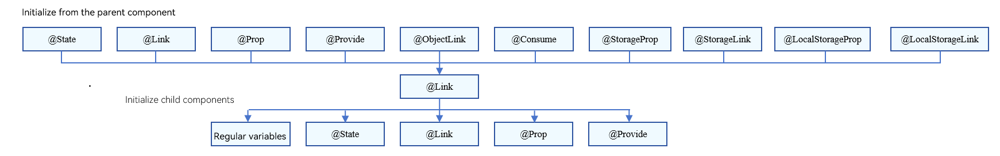
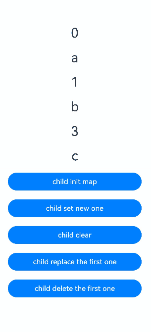
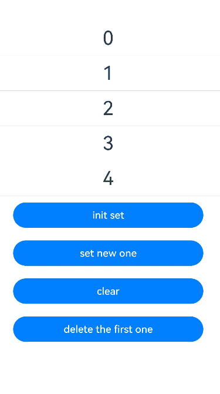
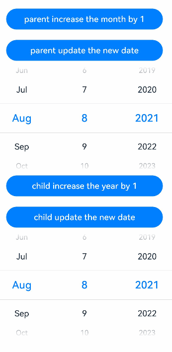
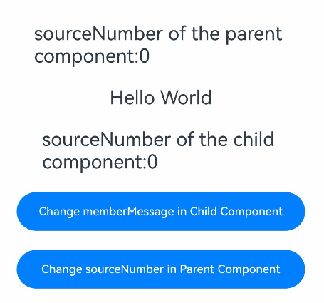
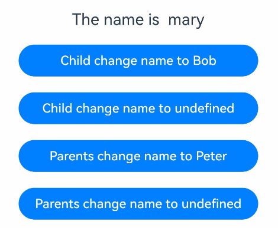

# \@Link Decorator: Implementing Two-Way Synchronization Between Parent and Child Components

<!--Kit: ArkUI-->
<!--Subsystem: ArkUI-->
<!--Owner: @jiyujia926-->
<!--Designer: @zhangboren-->
<!--Tester: @TerryTsao-->
<!--Adviser: @zhang_yixin13-->
<!-- md-trans-meta sourceCommit=3efb4ba336409dd0731ba011e1e227786db57fa2 translatedAt=2026-07-22T02:03:55.185Z pushedAt=2026-07-22T08:19:50.438Z -->

A variable decorated by [\@Link](../../reference/apis-arkui/arkui-ts/ts-state-management-link.md#link) in a child component establishes two-way data binding with its corresponding data source in the parent component.

Before reading this topic, you are advised to understand the basic usage of [\@State](./arkts-state.md). For best practices, see [State Management Best Practices](https://developer.huawei.com/consumer/en/doc/best-practices/bpta-status-management). For common issues, see [State Management FAQs](./arkts-state-management-faq.md).

> **NOTE**
>
> This decorator can be used in ArkTS widgets since API version 9.
>
> This decorator can be used in atomic services since API version 11.

## Overview

An \@Link decorated variable in a child component shares the same value with a variable in its parent component.

## Usage Rules

| \@Link Decorator                                            | Description                                                        |
| ------------------------------------------------------------ | ------------------------------------------------------------ |
| Parameters                                                  | N/A                                                          |
| Synchronization type                                                    | Two-way:<br>The state variable in the parent component can be synchronized with the child component \@Link in a two-way manner. Changes to either will be synchronized to the other.|
| Allowed variable types                                          |Object, class, string, number, Boolean, enum, and array of these types.<br>API version 10 and later: [Date type](#decorating-variables-of-the-date-type).<br>API version 11 and later: [Map](#decorating-variables-of-the-map-type), [Set](#decorating-variables-of-the-set-type), undefined, null, union types defined by the ArkUI framework, for example, [Length](../../reference/apis-arkui/arkui-ts/ts-types.md#length), [ResourceStr](../../reference/apis-arkui/arkui-ts/ts-types.md#resourcestr), and [ResourceColor](../../reference/apis-arkui/arkui-ts/ts-types.md#resourcecolor). For details, see [Using Union Types](#using-union-types).<br>For details about the scenarios of supported types, see [Observed Changes](#observed-changes).|
| Disallowed variable types| Function.     |
| Initial value for the decorated variable                                          | Local initialization is forbidden.                                        |

## Variable Transfer/Access Rules

| Transfer/Access     | Description                                      |
| ---------- | ---------------------------------------- |
| Initialization and update from the parent component| Mandatory.<br>An @Link decorated variable can be initialized from an [\@State](./arkts-state.md), @Link, [\@Prop](./arkts-prop.md), [\@Provide](./arkts-provide-and-consume.md), [\@Consume](./arkts-provide-and-consume.md), [\@ObjectLink](./arkts-observed-and-objectlink.md), [\@StorageLink](./arkts-appstorage.md#storagelink), [\@StorageProp](./arkts-appstorage.md#storageprop), [\@LocalStorageLink](./arkts-localstorage.md#localstoragelink), or [\@LocalStorageProp](./arkts-localstorage.md#localstorageprop) decorated variable in the parent component, thereby establishing two-way binding.<br>- Since API version 9, the syntax for initializing the child component \@Link from the parent component \@State is **Comp({ aLink: this.aState })**, and **Comp({aLink: $aState})** is also supported.|
| Child component initialization  | Supported; can be used to initialize a regular variable or \@State, \@Link, \@Prop, or \@Provide decorated variable in the child component.|
| Access from outside the component | Private, accessible only within the component.                          |

 **Figure 1** Initialization rules



## Observed Changes and Behavior

### Observed Changes

- When the decorated variable is of the Boolean, string, or number type, its value change can be observed. For details, see [Using \@Link with Primitive and Class Types](#using-link-with-primitive-and-class-types).

- When the decorated variable is of the class or Object type, assignment and property assignment changes can be observed, that is, all properties returned by `Object.keys(observedObject)`. For an example, see [Using \@Link with Primitive and Class Types](#using-link-with-primitive-and-class-types). \@Link can only observe changes to the object itself and its first-level properties. It cannot observe changes to nested data (such as nested objects or arrays of objects). For such scenarios, see [Usage Scenarios of \@Observed and \@ObjectLink Decorators](arkts-observed-and-objectlink.md#when-to-use).

- When the decorated variable is of the array type, the addition, deletion, and updates of array items can be observed. For details, see [Using \@Link with Array Types](#using-link-with-array-types).

- When the decorated object is of the Date type, the following changes can be observed: (1) complete **Date** object reassignment; (2) property changes caused by calling **setFullYear**, **setMonth**, **setDate**, **setHours**, **setMinutes**, **setSeconds**, **setMilliseconds**, **setTime**, **setUTCFullYear**, **setUTCMonth**, **setUTCDate**, **setUTCHours**, **setUTCMinutes**, **setUTCSeconds**, or **setUTCMilliseconds**. For details, see [Decorating Variables of the Date Type](#decorating-variables-of-the-date-type).

- When the decorated object is of the Map type, the following changes can be observed: (1) complete Map object reassignment; (2) changes caused by calling **set**, **clear**, or **delete**. For details, see [Decorating Variables of the Map Type](#decorating-variables-of-the-map-type).

- When the decorated object is of the Set type, the following changes can be observed: (1) complete Set object reassignment; (2) changes caused by calling **add**, **clear**, or **delete**. For details, see [Decorating Variables of the Set Type](#decorating-variables-of-the-set-type).

### Framework Behavior

An \@Link decorated variable shares the lifecycle of its owning component.

To understand the value initialization and update mechanism of the \@Link decorated variable, it is necessary to consider the parent component and the initial render and update process of the child component that owns the \@Link decorated variable (in this example, the \@State decorated variable in the parent component is used).

1. Initial render: The execution of the parent component's **build()** creates an instance of the child component. The initialization process is as follows:

   1. An \@State decorated variable of the parent component is specified to initialize the child component's \@Link decorated variable. The child component's \@Link decorated variable value remains synchronized with its source variable, enabling two-way data synchronization.

   2. The parent component's \@State wrapper variable instance is passed to the child component through the child's constructor. When the child component's \@Link wrapper instance receives a reference to the parent's \@State variable, it registers itself with that parent \@State variable.

2. Update of the \@Link source: When the state variable in the parent component is updated, the \@Link decorated variable in the related child component is updated. Procedure:

   1. As indicated in the initial rendering step, the child component's \@Link wrapper class registers the current **this** pointer with the parent component. When the parent component's \@State variable is changed, all built-in components and state variables (such as the \@Link wrapper instance) that depend on it are traversed and updated.

   2. After the \@Link wrapper instance is updated, all built-in components that depend on the \@Link decorated variable in the child component are notified of the update. In this way, the parent component has the state data of the child components synchronized.

3. Update of \@Link: After the \@Link decorated variable in the child component is updated, the following steps are performed (the \@State decorated variable in the parent component is used):

   1. After the \@Link decorated variable is updated, the **set** method of the parent component's \@State wrapper instance is called to synchronize the new value back to the parent component.

   2. The \@Link in the child component and \@State in the parent component each update their respective dependent UI components through independent dependency traversals, achieving synchronized state while maintaining proper UI consistency.

## Constraints

1. You are not advised to use the \@Link decorator in custom components decorated with [\@Entry](./arkts-create-custom-components.md#entry). Otherwise, a warning will be reported during compilation. If the custom component is used as the root node of a page, a runtime error will be reported.

2. Variables decorated with \@Link do not support local initialization. Any attempt to perform local initialization on them will result in a compilation error.

    ```ts
    // Incorrect usage. An error is reported during compilation.
    @Link count: number = 10;
  
    // Correct usage.
    @Link count: number;
    ```

3. The type of a variable decorated with \@Link must match the type of its data source. The compilation fails if the types do not match. In addition, the data source must be a state variable. Otherwise, the framework throws a runtime error.

    > **NOTE**
    >
    > Since API version 23, validation for \@Link data source errors has been added, and runtime errors have been changed to compile-time errors. For details, see [Common UI-Related App Crash Issues](../arkts-stability-crash-issues.md).

    **Incorrect Usage**

    ```ts
    class Info {
      value: string = 'Hello';
    }

    class Cousin {
      name: string = 'Hello';
    }

    @Component
    struct Child {
      // Incorrect usage 1: The type of the @Link decorated variable is different from that of the @State decorated variable.
      @Link test: Cousin;
      // Incorrect usage 2: non-status variable of the data source
      @Link testStr: string;

      build() {
        Column() {
          Text(this.test.name)
          Text(this.testStr)
        }
      }
    }

    @Entry
    @Component
    struct LinkExample {
      @State info: Info = new Info();

      build() {
        Column() {
          Child({
            // Incorrect usage 1: The type of the @Link decorated variable is different from that of the @State decorated variable.
            test: this.info,
            // Incorrect usage 2: The data source is not a state variable.
            testStr: this.info.value
          })
        }
      }
    }
    ```

    **Correct Usage**

    <!-- @[link_usage](https://gitcode.com/openharmony/applications_app_samples/blob/master/code/DocsSample/ArkUISample/ComponentStateManagement/entry/src/main/ets/pages/LinkDecorator/LinkUsage.ets) --> 

    ``` TypeScript
    class LinkInfo {
      public value: string = 'Hello';
    }

    @Component
    struct LinkChild {
      // In the child component, use @Link to decorate the test variable of the LinkInfo type.
      @Link test: LinkInfo;

      build() {
        Text(this.test.value)
          .fontSize(20)
          .margin(10)
      }
    }

    @Entry
    @Component
    struct LinkExample {
      @State info: LinkInfo = new LinkInfo();

      build() {
        Column() {
          // In the parent component, use the @State-decorated info variable to initialize the test variable of the LinkChild component.
          LinkChild({test: this.info})
        }
        .width('100%')
      }
    }
    ```

    

4. A variable decorated by \@Link can only be initialized by a state variable, not by a regular variable. Otherwise, a compilation error occurs.

    **Incorrect Usage**

    ``` TypeScript
    @Component
    struct Child {
      @Link message: string;
  
      build() {
        Text(`${this.message}`).margin('20%')
      }
    }

    @Entry
    @Component
    struct LinkExample {
      message: string = 'Hello';
  
      build() {
        Column() {
          // Incorrect usage. Regular variables cannot initialize @Link decorated variables.
          Child({ message: this.message })
        }
      }
    }
    ```

    **Correct Usage**

    <!-- @[link_usage_two](https://gitcode.com/openharmony/applications_app_samples/blob/master/code/DocsSample/ArkUISample/ComponentStateManagement/entry/src/main/ets/pages/LinkDecorator/LinkUsage2.ets) --> 

    ``` TypeScript
    @Component
    struct LinkChild2 {
      @Link message: string;
  
      build() {
        Text(`${this.message}`).margin('20%')
      }
    }
  
    @Entry
    @Component
    struct LinkExample2 {
      @State message: string = 'Hello';
  
      build() {
        Column() {
          // Correct usage.
          LinkChild2({ message: this.message })
        }
      }
    }
    ```

    

5. \@Link does not support decorating variables of the **Function** type. Before API version 23, an error occurs at runtime in the app.

   Since API version 23, relevant validation has been added during app compilation. Decorating a **Function** type variable with \@Link triggers an ERROR, and the \@Link decorator should be removed from the **Function** type variable in the code.

## Use Scenarios

### Using \@Link with Primitive and Class Types

In the following example, after **Parent View: Set yellowButton** and **Parent View: Set GreenButton** of the parent component **ShufflingContainer** are clicked, the change in the parent component is synchronized to the child components.

  1. After buttons of the child components **GreenButton** and **YellowButton** are clicked, the child components (@Link decorated variables) change accordingly. Due to the two-way synchronization relationship between @Link and @State, the changes are synchronized to the parent component.

  2. When a button in the parent component **ShufflingContainer** is clicked, the parent component's @State decorated variable changes, and the changes are synchronized to the child components, which are then updated accordingly.

<!-- @[link_class_type](https://gitcode.com/openharmony/applications_app_samples/blob/master/code/DocsSample/ArkUISample/ComponentStateManagement/entry/src/main/ets/pages/LinkDecorator/UsingLinkwithPrimitiveandClassTypes.ets) --> 

``` TypeScript
class GreenButtonState {
  public width: number = 0;

  constructor(width: number) {
    this.width = width;
  }
}

@Component
struct GreenButton {
  @Link greenButtonState: GreenButtonState;

  build() {
    Button('Green Button')
      .width(this.greenButtonState.width)
      .height(40)
      .backgroundColor('#64bb5c')
      .fontColor('#FFFFFF')
      .onClick(() => {
        if (this.greenButtonState.width < 700) {
          // Update the attribute of the class. The change can be observed and synchronized back to the parent component.
          this.greenButtonState.width += 60;
        } else {
          // Update the class. The change can be observed and synchronized back to the parent component.
          this.greenButtonState = new GreenButtonState(180);
        }
      })
  }
}

@Component
struct YellowButton {
  @Link yellowButtonState: number;

  build() {
    Button('Yellow Button')
      .width(this.yellowButtonState)
      .height(40)
      .backgroundColor('#f7ce00')
      .fontColor('#FFFFFF')
      .onClick(() => {
        // The change of the decorated variable of a primitive type in the child component can be synchronized back to the parent component.
        this.yellowButtonState += 40.0;
      })
  }
}

@Entry
@Component
struct ShufflingContainer {
  @State greenButtonState: GreenButtonState = new GreenButtonState(180);
  @State yellowButtonProp: number = 180;

  build() {
    Column() {
      Flex({ direction: FlexDirection.Column, alignItems: ItemAlign.Center }) {
        // Primitive type @Link in the child component synchronized from @State in the parent component.
        Button('Parent View: Set yellowButton')
          .width(this.yellowButtonProp)
          .height(40)
          .margin(12)
          .fontColor('#FFFFFF')
          .onClick(() => {
            this.yellowButtonProp = (this.yellowButtonProp < 700) ? this.yellowButtonProp + 40 : 100;
          })
        // Class type @Link in the child component synchronized from @State in the parent component.
        Button('Parent View: Set GreenButton')
          .width(this.greenButtonState.width)
          .height(40)
          .margin(12)
          .fontColor('#FFFFFF')
          .onClick(() => {
            this.greenButtonState.width = (this.greenButtonState.width < 700) ? this.greenButtonState.width + 100 : 100;
          })
        // Initialize the class type @Link.
        GreenButton({ greenButtonState: this.greenButtonState }).margin(12)
        // Initialize the primitive type @Link.
        YellowButton({ yellowButtonState: this.yellowButtonProp }).margin(12)
      }
    }
  }
}
```


### Using \@Link with Array Types

<!-- @[link_array_type](https://gitcode.com/openharmony/applications_app_samples/blob/master/code/DocsSample/ArkUISample/ComponentStateManagement/entry/src/main/ets/pages/LinkDecorator/UsingLinkwithArrayTypes.ets) -->  

``` TypeScript
@Component
struct ArrayTypesChild {
  @Link items: number[];

  build() {
    Column() {
      Button(`Button1: push`)
        .margin(12)
        .width(312)
        .height(40)
        .fontColor('#FFFFFF')
        .onClick(() => {
          this.items.push(this.items.length + 1);
        })
      // The array type of the child component can be synchronized back to the parent component.
      Button(`Button2: replace whole item`)
        .margin(12)
        .width(312)
        .height(40)
        .fontColor('#FFFFFF')
        .onClick(() => {
          this.items = [100, 200, 300];
        })
    }
  }
}

@Entry
@Component
struct ArrayTypes {
  @State arr: number[] = [1, 2, 3];

  build() {
    Column() {
      ArrayTypesChild({ items: $arr })
        .margin(12)
      ForEach(this.arr,
        (item: number) => {
          Button(`${item}`)
            .margin(12)
            .width(312)
            .height(40)
            .backgroundColor('#11a2a2a2')
            .fontColor('#e6000000')
        },
        (item: number) => item.toString()
      )
    }
  }
}
```


The state management framework can observe the addition, deletion, and replacement of array elements. In this example, both \@State and \@Link are of the number[] type. It is not supported to define \@Link as the number type (\@Link item : number) and use each data item in the \@State array to create child components in the parent component. For such scenarios, see [\@Prop](arkts-prop.md) and [\@Observed](./arkts-observed-and-objectlink.md).

### Decorating Variables of the Map Type

> **NOTE**
>
> Since API version 11, \@Link supports the Map type.

In this example, the **value** variable is of the Map\<number, string\> type. When the button is clicked, the value of **message** changes, and the UI is re-rendered.

<!-- @[link_map_type](https://gitcode.com/openharmony/applications_app_samples/blob/master/code/DocsSample/ArkUISample/ComponentStateManagement/entry/src/main/ets/pages/LinkDecorator/DecoratingVariablesMapType.ets) -->  

``` TypeScript
@Component
struct MapSampleChild {
  @Link value: Map<number, string>;

  build() {
    Column() {
      ForEach(Array.from(this.value.entries()), (item: [number, string]) => {
        Text(`${item[0]}`)
          .fontSize(30)
          .margin(10)
        Text(`${item[1]}`)
          .fontSize(30)
          .margin(10)
        Divider()
      })
      // The Map type of the child component can be synchronized back to the parent component.
      Button('child init map')
        .width(300)
        .margin(10)
        .onClick(() => {
          this.value = new Map([[0, 'a'], [1, 'b'], [3, 'c']]);
        })
      Button('child set new one')
        .width(300)
        .margin(10)
        .onClick(() => {
          this.value.set(4, 'd');
        })
      Button('child clear')
        .width(300)
        .margin(10)
        .onClick(() => {
          this.value.clear();
        })
      Button('child replace the first one')
        .width(300)
        .margin(10)
        .onClick(() => {
          this.value.set(0, 'aa');
        })
      Button('child delete the first one')
        .width(300)
        .margin(10)
        .onClick(() => {
          this.value.delete(0);
        })
    }
    .width('100%')
  }
}


@Entry
@Component
struct MapSample {
  @State message: Map<number, string> = new Map([[0, 'a'], [1, 'b'], [3, 'c']]);

  build() {
    Row() {
      Column() {
        MapSampleChild({ value: this.message })
      }
      .width('100%')
    }
    .height('100%')
  }
}
```



### Decorating Variables of the Set Type

> **NOTE**
>
> Since API version 11, \@Link supports the Set type.

In this example, the **message** variable is of the **Set\<number\>** type. When the button is clicked, the value of **message** changes, and the UI is re-rendered.

<!-- @[link_set_type](https://gitcode.com/openharmony/applications_app_samples/blob/master/code/DocsSample/ArkUISample/ComponentStateManagement/entry/src/main/ets/pages/LinkDecorator/DecoratingVariablesSetType.ets) -->  

``` TypeScript
@Component
struct SetSampleChild {
  @Link message: Set<number>;

  build() {
    Column() {
      ForEach(Array.from(this.message.entries()), (item: [number, number]) => {
        Text(`${item[0]}`)
          .fontSize(30)
          .margin(10)
        Divider()
      })
      // The Set type in the child component can be synchronized back to the parent component.
      Button('init set')
        .width(300)
        .margin(10)
        .onClick(() => {
          this.message = new Set([0, 1, 2, 3, 4]);
        })
      Button('set new one')
        .width(300)
        .margin(10)
        .onClick(() => {
          this.message.add(5);
        })
      Button('clear')
        .width(300)
        .margin(10)
        .onClick(() => {
          this.message.clear();
        })
      Button('delete the first one')
        .width(300)
        .margin(10)
        .onClick(() => {
          this.message.delete(0);
        })
    }
    .width('100%')
  }
}


@Entry
@Component
struct SetSample {
  @State message: Set<number> = new Set([0, 1, 2, 3, 4]);

  build() {
    Row() {
      Column() {
        SetSampleChild({ message: this.message })
      }
      .width('100%')
    }
    .height('100%')
  }
}
```



### Decorating Variables of the Date Type

In this example, the **selectedDate** variable is of the Date type. After the button is clicked, the value of **selectedDate** changes, and the UI is re-rendered.

<!-- @[link_data_type](https://gitcode.com/openharmony/applications_app_samples/blob/master/code/DocsSample/ArkUISample/ComponentStateManagement/entry/src/main/ets/pages/LinkDecorator/DecoratingVariablesDateType.ets) -->  

``` TypeScript
@Component
struct DateComponent {
  @Link selectedDate: Date;

  build() {
    Column() {
      // The Date type of the child component can be synchronized back to the parent component.
      Button(`child increase the year by 1`)
        .width(300)
        .margin(10)
        .onClick(() => {
          this.selectedDate.setFullYear(this.selectedDate.getFullYear() + 1);
        })
      Button('child update the new date')
        .width(300)
        .margin(10)
        .onClick(() => {
          this.selectedDate = new Date('2023-09-09');
        })
      DatePicker({
        start: new Date('1970-1-1'),
        end: new Date('2100-1-1'),
        selected: this.selectedDate
      })
    }
    .width('100%')
  }
}

@Entry
@Component
struct ParentComponent {
  @State parentSelectedDate: Date = new Date('2021-08-08');

  build() {
    Column() {
      Button('parent increase the month by 1')
        .width(300)
        .margin(10)
        .onClick(() => {
          this.parentSelectedDate.setMonth(this.parentSelectedDate.getMonth() + 1);
        })
      Button('parent update the new date')
        .width(300)
        .margin(10)
        .onClick(() => {
          this.parentSelectedDate = new Date('2023-07-07');
        })
      DatePicker({
        start: new Date('1970-1-1'),
        end: new Date('2100-1-1'),
        selected: this.parentSelectedDate
      })

      DateComponent({ selectedDate:this.parentSelectedDate })
    }
    .width('100%')
  }
}
```



### Using the Two-Way Synchronization Mechanism to Change Local Variables

Use [\@Watch](./arkts-watch.md) to change local variables during two-way synchronization.

In the following example, a \@State decorated variable **memberMessage** is modified inside the \@Watch callback of \@Link to achieve variable synchronization between parent and child components. However, local modifications to the \@State decorated variable **memberMessage** do not affect the variable in the parent component.

<!-- @[link_watch](https://gitcode.com/openharmony/applications_app_samples/blob/master/code/DocsSample/ArkUISample/ComponentStateManagement/entry/src/main/ets/pages/LinkDecorator/UseWatchToChangeLocalVariables.ets) -->  

``` TypeScript
@Entry
@Component
struct ChangeVariables {
  @State sourceNumber: number = 0;

  build() {
    Column() {
      Text(`sourceNumber of the parent component:` + this.sourceNumber)
        .fontSize(20)
        .margin(10)
      ChangeVariablesChild({ sourceNumber: this.sourceNumber })
      Button('Change sourceNumber in Parent Component')
        .width(300)
        .margin(10)
        .onClick(() => {
          this.sourceNumber++;
        })
    }
    .width('100%')
    .height('100%')
  }
}

@Component
struct ChangeVariablesChild {
  @State memberMessage: string = 'Hello World';
  @Link @Watch('onSourceChange') sourceNumber: number;

  onSourceChange() {
    // Local modification of memberMessage in the child component does not affect the variable change in the parent component.
    this.memberMessage = this.sourceNumber.toString();
  }

  build() {
    Column() {
      Text(this.memberMessage)
        .fontSize(20)
        .margin(10)
      Text(`sourceNumber of the child component:` + this.sourceNumber.toString())
        .fontSize(20)
        .margin(10)
      Button('Change memberMessage in Child Component')
        .width(300)
        .margin(10)
        .onClick(() => {
          this.memberMessage = 'Hello memberMessage';
        })
    }
    .width('100%')
  }
}
```



### Using Union Types

`@Link` supports union types, `undefined`, and `null`. In the following example, the type of `name` is `string | undefined`. Tapping the button in the parent component `UnionTypes` changes the property or type of `name`, and the `UnionChild` component is refreshed accordingly.

<!-- @[link_union_type](https://gitcode.com/openharmony/applications_app_samples/blob/master/code/DocsSample/ArkUISample/ComponentStateManagement/entry/src/main/ets/pages/LinkDecorator/UsingUnionTypes.ets) -->  

``` TypeScript
@Component
struct UnionChild {
  // @Link supports union types.
  @Link name: string | undefined;

  build() {
    Column() {
      Button('Child change name to Bob')
        .width(300)
        .margin(10)
        .onClick(() => {
          this.name = 'Bob';
        })

      Button('Child change name to undefined')
        .width(300)
        .margin(10)
        .onClick(() => {
          this.name = undefined;
        })

    }
    .width('100%')
  }
}

@Entry
@Component
struct UnionTypes {
  @State name: string | undefined = 'mary';

  build() {
    Column() {
      Text(`The name is  ${this.name}`)
        .fontSize(20)
        .margin(10)

      UnionChild({ name: this.name })

      Button('Parents change name to Peter')
        .width(300)
        .margin(10)
        .onClick(() => {
          this.name = 'Peter';
        })

      Button('Parents change name to undefined')
        .width(300)
        .margin(10)
        .onClick(() => {
          this.name = undefined;
        })
    }
    .width('100%')
  }
}
```



<!--no_check-->