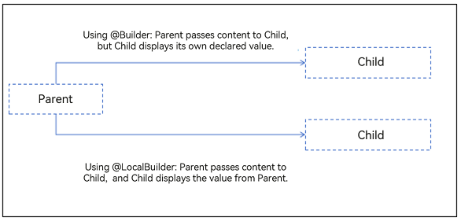

# \@LocalBuilder Decorator: Maintaining Component Relationships
<!--Kit: ArkUI-->
<!--Subsystem: ArkUI-->
<!--Owner: @zhangboren-->
<!--Designer: @zhangboren-->
<!--Tester: @TerryTsao-->
<!--Adviser: @zhang_yixin13-->

The \@LocalBuilder decorator addresses a critical challenge in component composition. While local \@Builder functions enable reference data passing between components, they require careful management of parent-child relationships. Specifically, when you use **.bind(this)** to modify function call contexts, this often leads to misalignment between the visual component hierarchy and the underlying state management relationships. To address this issue, the \@LocalBuilder decorator is introduced. \@LocalBuilder provides the same functionality as the local @Builder but better ensures consistency between the visual component hierarchy and the underlying state management relationships.

Before proceeding, you are advised to review [\@Builder](./arkts-builder.md) to understand the base functionality that \@LocalBuilder enhances.

> **NOTE**
>
> This decorator is supported since API version 12.
>
> This decorator is supported in ArkTS widgets since API version 12.
>
> This decorator can be used in atomic services since API version 12.

## How to Use

### Component-Level Builder Declaration

Syntax definition:
<!-- @[Custom_Component_one](https://gitcode.com/openharmony/applications_app_samples/blob/master/code/DocsSample/ArkUISample/ParadigmStateManagement/entry/src/main/ets/pages/localBuilder/CustomBuilderInComponent.ets) -->

``` TypeScript
@LocalBuilder
myBuilderFunction() {
  // ···
}
```

Invocation pattern:
<!-- @[Custom_Component_two](https://gitcode.com/openharmony/applications_app_samples/blob/master/code/DocsSample/ArkUISample/ParadigmStateManagement/entry/src/main/ets/pages/localBuilder/CustomBuilderInComponent.ets) -->

``` TypeScript
this.myBuilderFunction()
```

- One or more \@LocalBuilder functions can be defined in a custom component. These functions are treated as private and special member functions of the owning component.

- Each \@LocalBuilder function is accessible only within the owning component's scope and can be called from the component's **build** method or other local builder functions.

- Inside the custom builder function body, **this** refers to the owning component. Component state variables are accessible from within the custom builder function implementation. Using **this** to access the custom components' state variables is recommended over parameter passing.

## Differences Between \@LocalBuilder and Local \@Builder

When local @Builder functions are passed between components, it is common to use **.bind(this)** to modify the function context. However, this approach may lead to inconsistencies between the visual component hierarchy and the underlying state management relationships. In contrast, @LocalBuilder maintains stable parent-child relationships regardless of **.bind(this)** usage. This means that the parent component of elements defined in @LocalBuilder remains fixed and immutable.



> **NOTE**
>
> The **bind()** method creates a new bound function that sets the **this** value to the first parameter provided during creation.

In the following example, when the function componentBuilder is modified by \@Builder, the display effect is Child. When the function componentBuilder is modified by \@LocalBuilder, the display effect is Parent.
<!-- @[component_builder_modify](https://gitcode.com/openharmony/applications_app_samples/blob/master/code/DocsSample/ArkUISample/ParadigmStateManagement/entry/src/main/ets/pages/localBuilder/ComponentBuilderModify.ets) --> 

``` TypeScript
@Component
struct Child {
  label: string = 'Child';
  @BuilderParam customBuilderParam: () => void;

  build() {
    Column() {
      this.customBuilderParam()
    }
  }
}

@Entry
@Component
struct Parent {
  label: string = 'Parent';

  @Builder
  componentBuilder() {
    Text(`${this.label}`) // In @Builder, this points to the component of the actual invoking point. In this case, because the invoking point is in the Child component, this points to the Child component.
  }

  @LocalBuilder
  componentLocalBuilder() {
    Text(`${this.label}`) // This in @LocalBuilder points to the parent component of the @LocalBuilder function.
  }

  build() {
    Column() {
      Child({ customBuilderParam: this.componentBuilder }) // Child component to display the string Child.
      Child({ customBuilderParam: this.componentLocalBuilder }) // Child component to display the string Parent.
    }
  }
}
```

## Constraints

- @LocalBuilder declarations are component-bound. Global declarations are not allowed.

- \@LocalBuilder cannot be used in conjunction with other decorators, whether built-in or custom.

- \@LocalBuilder cannot be used to decorate static functions in custom components.

## Parameter Passing Rules

Parameters for \@LocalBuilder functions can be passed [by callback](#passing-parameters-by-callback), [by reference](#by-reference-parameter-passing), or [by value](#by-value-parameter-passing). The following rules must be followed:

- Parameter types must exactly match their declared types. **undefined** and **null** values are prohibited.

- All parameters must be immutable inside the \@LocalBuilder function body.

- \@The UI syntax in LocalBuilder complies with [syntax rules](arkts-create-custom-components.md#build-1).

- The UI components in the \@Builder function can be updated during callback-based transfer and reference-based transfer. Passing by reference takes effect only when one parameter is passed and the parameter is directly passed to the object literal. If there are multiple parameters, the UI component in the @Builder function cannot be refreshed.

### Passing Parameters by Callback

From API version 20, you can use the **UIUtils.makeBinding()** function, the **Binding** class, and the **MutableBinding** class to refresh status variables in the \@Builder function. For details, see [state management APIs](../../reference/apis-arkui/js-apis-stateManagement.md#makebinding20).
<!-- @[builder_make_binding](https://gitcode.com/openharmony/applications_app_samples/blob/master/code/DocsSample/ArkUISample/ParadigmStateManagement/entry/src/main/ets/pages/localBuilder/BuilderMakeBinding.ets) -->

``` TypeScript
import { UIUtils, Binding } from '@kit.ArkUI';

@Entry
@Component
struct Parent {
  @State variableValue: string = 'Hello World';

  @LocalBuilder
  citeLocalBuilder(params: Binding<string>) {
    Row() {
      Text(`UseStateVarByReference: ${params.value}`)
    }
  }

  build() {
    Column() {
      this.citeLocalBuilder(UIUtils.makeBinding<string>(() => this.variableValue))
      Button('Click me')
        .onClick(() => {
          this.variableValue = 'Hi World';
        })
    }
  }
}
```

### By-Reference Parameter Passing

In by-reference parameter passing, state variables can be passed, and the change of these state variables causes the UI re-rendering in the \@LocalBuilder function.

> **NOTE**
>
> If the \@LocalBuilder function is used together with the `$$` operator, when a child component calls the \@LocalBuilder function of the parent component, parameter changes from the child component will not trigger UI re-rendering in the @LocalBuilder function. For details, see FAQs [UI Is Not Refreshed When the @LocalBuilder Function Is Used Together with the $$ Parameter](#ui-is-not-refreshed-when-the-localbuilder-function-is-used-together-with-the--parameter).

In the example, the @LocalBuilder function in the **Parent** component is called in the **build** function using the key-value pair syntax for parameter passing. After **Click me** is clicked, the **Text** content in the @LocalBuilder changes with the state variable.
<!-- @[pass_by_reference_one](https://gitcode.com/openharmony/applications_app_samples/blob/master/code/DocsSample/ArkUISample/ParadigmStateManagement/entry/src/main/ets/pages/localBuilder/ReferencePassing.ets) -->

``` TypeScript
class ReferenceType {
  paramString: string = '';
}

@Entry
@Component
struct Parent {
  @State variableValue: string = 'Hello World';

  @LocalBuilder
  citeLocalBuilder(params: ReferenceType) {
    Row() {
      Text(`UseStateVarByReference: ${params.paramString}`)
    }
  };

  build() {
    Column() {
      this.citeLocalBuilder({ paramString: this.variableValue })
      Button('Click me').onClick(() => {
        this.variableValue = 'Hi World';
      })
    }
  }
}
```

For passing parameters by reference in an \@LocalBuilder function that invokes custom components, ArkUI provides `$$` as the standard paradigm.

In the following example, in the \@LocalBuilder function of the **Parent** component, a custom component is called with parameters passed by reference. When the value of the state variable in the **Parent** component changes, the **message** value of the custom component **HelloComponent** within the \@LocalBuilder function will also change.
<!-- @[pass_by_reference_two](https://gitcode.com/openharmony/applications_app_samples/blob/master/code/DocsSample/ArkUISample/ParadigmStateManagement/entry/src/main/ets/pages/localBuilder/ParentRefSync.ets) -->

``` TypeScript
class ReferenceType {
  paramString: string = '';
}

@Component
struct HelloComponent {
  @Prop message: string;

  build() {
    Row() {
      Text(`HelloComponent===${this.message}`)
    }
  }
}

@Entry
@Component
struct Parent {
  @State variableValue: string = 'Hello World';

  @LocalBuilder
  citeLocalBuilder($$: ReferenceType) {
    Row() {
      Column() {
        Text(`citeLocalBuilder===${$$.paramString}`)
        HelloComponent({ message: $$.paramString })
      }
    }
  }

  build() {
    Column() {
      this.citeLocalBuilder({ paramString: this.variableValue })
      Button('Click me').onClick(() => {
        this.variableValue = 'Hi World';
      })
    }
  }
}
```

When a child component calls the @LocalBuilder function of its parent component with state variables, changes to the state variable do not trigger UI re-rendering within the @LocalBuilder function. This occurs because components created using the \@LocalBuilder function remain bound to the parent, and the state variable updates only affect the current component and its children, not the parent. In contrast, using \@Builder functions can trigger UI re-rendering. This is because \@Builder dynamically changes the function's **this** context to point to the calling child component, binding the created components to the child instead of the parent component.

In the following example, the Child component transfers state variables to the \@Builder and \@LocalBuilder functions of the Parent component. Inside \@Builder, **this** points to **Child**, and parameter changes trigger UI re-rendering. Inside \@LocalBuilder, **this** points to **Parent**, and parameter changes do not trigger UI re-rendering. Only changes to the Parent component's own state variables will cause the UI to re-render.
<!-- @[pass_by_reference_three](https://gitcode.com/openharmony/applications_app_samples/blob/master/code/DocsSample/ArkUISample/ParadigmStateManagement/entry/src/main/ets/pages/localBuilder/BuilderThisDiff.ets) --> 

``` TypeScript
class Data {
  public size: number = 0;
}

@Entry
@Component
struct Parent {
  label: string = 'parent';
  @State data: Data = new Data();

  @Builder
  componentBuilder($$: Data) {
    // Click the button to trigger UI refresh.
    Text('builder + $$')
    Text(`${'this -> ' + this.label}`)
    Text(`${'size : ' + $$.size}`)
  }

  @LocalBuilder
  componentLocalBuilder($$: Data) {
    // Clicking the button does not trigger UI refresh.
    Text('LocalBuilder + $$ data')
    Text(`${'this -> ' + this.label}`)
    Text(`${'size : ' + $$.size}`)
  }

  @LocalBuilder
  contentLocalBuilderNoArgument() {
    // Click the button to trigger UI refresh.
    Text('LocalBuilder + local data')
    Text(`${'this -> ' + this.label}`)
    Text(`${'size : ' + this.data.size}`)
  }

  build() {
    Column() {
      Child({
        contentBuilder: this.componentBuilder,
        contentLocalBuilder: this.componentLocalBuilder,
        contentLocalBuilderNoArgument: this.contentLocalBuilderNoArgument,
        data: this.data
      })
    }
  }
}

@Component
struct Child {
  label: string = 'child';

  @Builder
  customBuilder() {
  };

  @BuilderParam contentBuilder: ((data: Data) => void) = this.customBuilder;
  @BuilderParam contentLocalBuilder: ((data: Data) => void) = this.customBuilder;
  @BuilderParam contentLocalBuilderNoArgument: (() => void) = this.customBuilder;
  @Link data: Data;

  build() {
    Column() {
      this.contentBuilder({ size: this.data.size })
      this.contentLocalBuilder({ size: this.data.size })
      this.contentLocalBuilderNoArgument()
      Button('add child size')
        .onClick(() => {
          this.data.size += 1;
        })
    }
  }
}
```

### By-Value Parameter Passing

By default, parameters in the \@LocalBuilder functions are passed by value. In this case, when the passed parameter is a state variable, its change does not cause UI re-rendering in the \@LocalBuilder function. Therefore, when using state variables, you are advised to use [Passing Parameters By Callback](#passing-parameters-by-callback) or [Passing Parameters By Reference](#by-reference-parameter-passing).

In the following example, the **Parent** component passes the \@State decorated **label** value to the @LocalBuilder function as a function parameter. In this case, the value obtained by the @LocalBuilder function is a regular variable value. As a result, when the **label** value changes, the value in the @LocalBuilder function remains unchanged.
<!-- @[pass_by_value](https://gitcode.com/openharmony/applications_app_samples/blob/master/code/DocsSample/ArkUISample/ParadigmStateManagement/entry/src/main/ets/pages/localBuilder/ValuePassing.ets) -->

``` TypeScript
@Entry
@Component
struct Parent {
  @State label: string = 'Hello';

  @LocalBuilder
  citeLocalBuilder(paramA1: string) {
    Row() {
      Text(`UseStateVarByValue: ${paramA1}`)
    }
  }

  build() {
    Column() {
      this.citeLocalBuilder(this.label)
    }
  }
}
```

## Use Cases

### Using \@LocalBuilder in \@ComponentV2 Decorated Custom Components

Use the local @LocalBuilder in the custom component decorated by [@ComponentV2](./arkts-create-custom-components.md#componentv2). When the variable is modified, the UI is refreshed.

<!-- @[LocalBuilder_in_V2_use](https://gitcode.com/openharmony/applications_app_samples/blob/master/code/DocsSample/ArkUISample/ParadigmStateManagement/entry/src/main/ets/pages/localBuilder/V2LocalBuilderUpdate.ets) --> 

``` TypeScript
@ObservedV2
class Info {
  @Trace name: string = '';
  @Trace age: number = 0;
}

@ComponentV2
struct ChildPage {
  @Require @Param childInfo: Info;

  build() {
    Column() {
      Text(`Custom component name: ${this.childInfo.name}`)
        .fontSize(20)
        .fontWeight(FontWeight.Bold)
      Text(`Custom component age: ${this.childInfo.age}`)
        .fontSize(20)
        .fontWeight(FontWeight.Bold)
    }
  }
}

@Entry
@ComponentV2
struct ParentPage {
  info1: Info = { name: 'Tom', age: 25 };
  @Local info2: Info = { name: 'Tom', age: 25 };

  @LocalBuilder
  privateBuilder() {
    Column() {
      Text(`Local @LocalBuilder name: ${this.info1.name}`)
        .fontSize(20)
        .fontWeight(FontWeight.Bold)
      Text(`Local @LocalBuilder age: ${this.info1.age}`)
        .fontSize(20)
        .fontWeight(FontWeight.Bold)
    }
  }

  @LocalBuilder
  privateBuilderSecond() {
    Column() {
      Text(`Local @LocalBuilder name: ${this.info2.name}`)
        .fontSize(20)
        .fontWeight(FontWeight.Bold)
      Text(`Local @LocalBuilder age: ${this.info2.age}`)
        .fontSize(20)
        .fontWeight(FontWeight.Bold)
    }
  }

  build() {
    Column() {
      Text(`info1: ${this.info1.name}  ${this.info1.age}`) // Text1
        .fontSize(30)
        .fontWeight(FontWeight.Bold)
      this.privateBuilder() // Call the local @Builder.
      Line()
        .width('100%')
        .height(10)
        .backgroundColor('#000000')
        .margin(10)
      Text(`info2: ${this.info2.name}  ${this.info2.age}`) // Text2
        .fontSize(30)
        .fontWeight(FontWeight.Bold)
      this.privateBuilderSecond() // Call the local @Builder.
      Line()
        .width('100%')
        .height(10)
        .backgroundColor('#000000')
        .margin(10)
      Text(`info1: ${this.info1.name}  ${this.info1.age}`) // Text1
        .fontSize(30)
        .fontWeight(FontWeight.Bold)
      ChildPage({ childInfo: this.info1 }) // Call the custom component.
      Line()
        .width('100%')
        .height(10)
        .backgroundColor('#000000')
        .margin(10)
      Text(`info2: ${this.info2.name}  ${this.info2.age}`) // Text2
        .fontSize(30)
        .fontWeight(FontWeight.Bold)
      ChildPage({ childInfo: this.info2 }) // Call the custom component.
      Line()
        .width('100%')
        .height(10)
        .backgroundColor('#000000')
        .margin(10)
      Button('change info1&info2')
        .onClick(() => {
          this.info1 = { name: 'Cat', age: 18 }; // Text1 will not be re-rendered because no decorator is used to listen for changes to info1.
          this.info2 = { name: 'Cat', age: 18 }; // Text2 will be re-rendered because a decorator is used to listen for changes to info2.
        })
    }
  }
}
```

## FAQs
### The UI is not refreshed when the @LocalBuilder function is used together with the **$$** parameter.

If the \@LocalBuilder function is used together with the `$$` operator, when a child component calls the \@LocalBuilder function of the parent component, parameter changes from the child component will not trigger UI re-rendering in the @LocalBuilder function.

**Incorrect Usage**
<!-- @[problem_ui_not_refresh_opposite](https://gitcode.com/openharmony/applications_app_samples/blob/master/code/DocsSample/ArkUISample/ParadigmStateManagement/entry/src/main/ets/pages/localBuilder/ProblemUINotRefreshOpposite.ets) -->

``` TypeScript
class LayoutSize {
  public size: number = 0;
}

@Entry
@Component
struct Parent {
  label: string = 'parent';
  @State layoutSize: LayoutSize = { size: 0 };

  @LocalBuilder
  componentBuilder($$: LayoutSize) {
    Text(`this: ${this.label}`)
    Text(`size: ${$$.size}`)
  }

  build() {
    Column() {
      Child({
        customBuilder: this.componentBuilder,
        layoutSize: this.layoutSize
      })
    }
  }
}

@Component
struct Child {
  label: string = 'child';
  @BuilderParam customBuilder: ((layoutSize: LayoutSize) => void);
  @Link layoutSize: LayoutSize;

  build() {
    Column() {
      this.customBuilder({ size: this.layoutSize.size }) // The child component calls the @LocalBuilder function of the parent component.
      Button('add child size')
        .onClick(() => {
          this.layoutSize.size += 1; // The parameter transferred by the subcomponent is changed, which does not cause the UI update in the @LocalBuilder function.
        })
    }
  }
}
```

**Correct Usage**

Create a state variable under the component that declares @LocalBuilder and access the state variable in the @LocalBuilder function. The UI component in @LocalBuilder can be updated when the state variable changes.
<!-- @[problem_ui_not_refresh_positive](https://gitcode.com/openharmony/applications_app_samples/blob/master/code/DocsSample/ArkUISample/ParadigmStateManagement/entry/src/main/ets/pages/localBuilder/ProblemUINotRefreshPositive.ets) -->

``` TypeScript
class LayoutSize {
  public size: number = 0;
}

@Entry
@Component
struct Parent {
  label: string = 'parent';
  @State layoutSize: LayoutSize = { size: 0 };

  @LocalBuilder
  componentBuilder() {
    Text(`this: ${this.label}`)
    Text(`size: ${this.layoutSize.size}`)
  }

  build() {
    Column() {
      Child({
        customBuilder: this.componentBuilder,
        layoutSize: this.layoutSize
      })
    }
  }
}

@Component
struct Child {
  label: string = 'child';
  @BuilderParam customBuilder: () => void;
  @Link layoutSize: LayoutSize;

  build() {
    Column() {
      this.customBuilder()
      Button('add child size')
        .onClick(() => {
          this.layoutSize.size += 1; //The parameter transferred by the subcomponent is changed. The @Link transfers the @State of the parent component to refresh the UI of the @LocalBuilder function declared by the parent component.
        })
    }
  }
}
```


