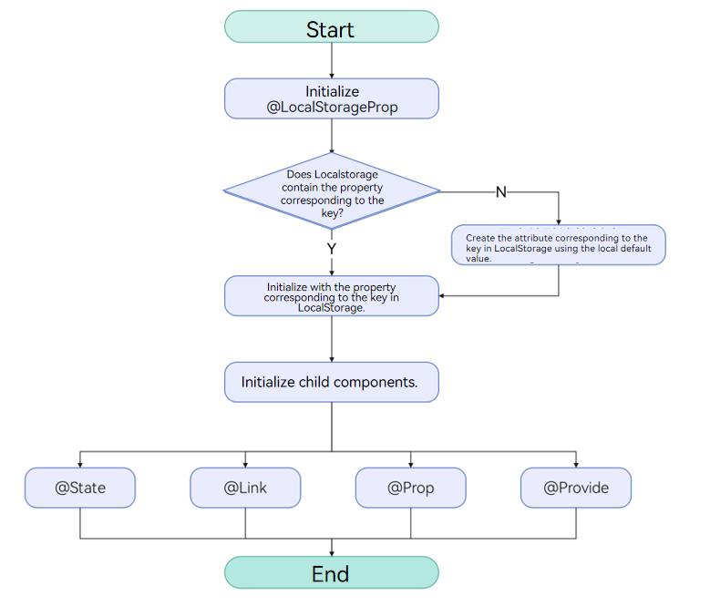
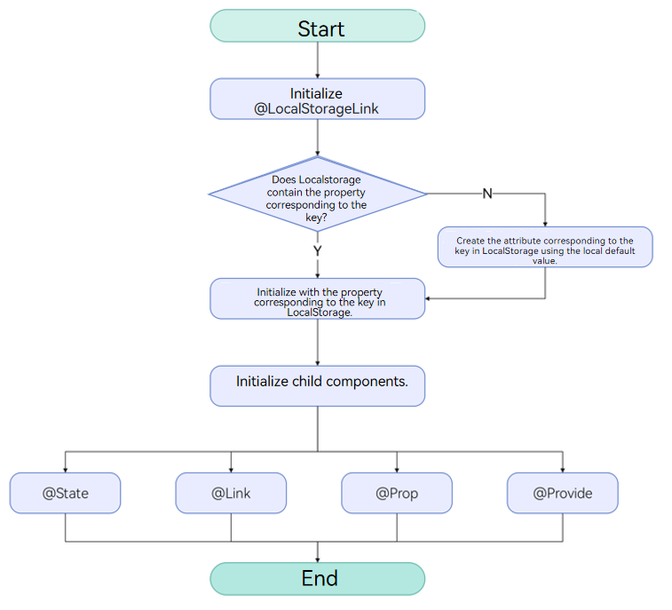

# LocalStorage: Storing Page-Level UI State
<!--Kit: ArkUI-->
<!--Subsystem: ArkUI-->
<!--Owner: @zzq212050299-->
<!--Designer: @s10021109-->
<!--Tester: @TerryTsao-->
<!--Adviser: @zhang_yixin13-->


LocalStorage provides storage for the page-level UI state. The parameters of the LocalStorage type accepted through the \@Entry decorator share the same LocalStorage instance on the page. LocalStorage also allows for state sharing across pages in a UIAbility instance.


This topic focuses on the usage scenarios of LocalStorage and its associated decorators: \@LocalStorageProp and \@LocalStorageLink.


Before reading this topic, you are advised to read [State Management Overview](./arkts-state-management-overview.md) to have a basic understanding of the positioning of AppStorage in the state management framework.

LocalStorage also provides APIs for manual create, retrieve, update, delete (CRUD) operations outside custom components. For details, see [LocalStorage API Reference](../../reference/apis-arkui/arkui-ts/ts-state-management.md#localstorage9). For best practices, see [State Management](https://developer.huawei.com/consumer/en/doc/best-practices/bpta-status-management).

> **NOTE**
>
> LocalStorage is supported since API version 9.


## Overview

LocalStorage is an in-memory "database" that ArkTS provides for storing state variables required to build pages of the application UI.

- Applications can create multiple instances of LocalStorage. These LocalStorage instances can be shared within a page or across pages and [UIAbility](../../application-models/uiability-overview.md) instances through the [getSharedLocalStorage](../../reference/apis-arkui/arkts-apis-uicontext-uicontext.md#getsharedlocalstorage12) interface.

- The root node of a component tree, which is the [\@Component](./arkts-create-custom-components.md#component) decorated with [\@Entry](../../reference/apis-arkui/arkui-ts/ts-universal-entry.md#entry), can be assigned a LocalStorage instance. All child instances of this custom component automatically gain access to this shared LocalStorage instance.

- The \@Component decorated components can automatically inherit the LocalStorage instance from the parent component or receive the specified LocalStorage instance. For details, see [Providing a Custom Component with Access to a LocalStorage Instance](#providing-a-custom-component-with-access-to-a-localstorage-instance).

- All properties in LocalStorage are mutable.

The application determines the lifecycle of a LocalStorage object. The JS Engine will garbage collect a LocalStorage object when the application releases the last reference to it, which includes deleting the last custom component.

LocalStorage provides two decorators based on the synchronization type of the component decorated with \@Component:

- [@LocalStorageProp](#localstorageprop): creates a one-way data synchronization with the named property in LocalStorage.

- [@LocalStorageLink](#localstoragelink): creates a two-way data synchronization with the named property in LocalStorage.


## \@LocalStorageProp

As mentioned above, if you want to establish a binding between LocalStorage and a custom component, you need to use the \@LocalStorageProp and \@LocalStorageLink decorators. Specially, use \@LocalStorageProp(key) or \@LocalStorageLink(key) to decorate variables in the component, where **key** identifies the property in LocalStorage.


When a custom component is initialized, the \@LocalStorageProp(key)/\@LocalStorageLink(key) decorated variable is initialized with the value of the property with the given key in LocalStorage. Local initialization is mandatory. If an property with the given key is missing from LocalStorage, it will be added with the stated initializing value. (Whether the property with the given key exists in LocalStorage depends on the application logic.)


> **NOTE**
>
> This decorator can be used in ArkTS widgets since API version 9.
>
> This decorator can be used in atomic services since API version 11.

By decorating a variable with \@LocalStorageProp(key), a one-way data synchronization is established from the property with the given key in LocalStorage to the variable. This means that, local changes (if any) will not be synchronized to LocalStorage, and an update to the property with the given key in LocalStorage – for example, a change made with the **set** API – will overwrite local changes.


### Rules for Using the \@LocalStorageProp Decorator

| \@LocalStorageProp Decorator| Description                                                        |
| ---------------------------- | ------------------------------------------------------------ |
| Parameters                  | **key**: constant string, mandatory (the string must be quoted)                 |
| Allowed variable types          | Object, class, string, number, Boolean, enum, and array of these types.<br>API version 12 and later: Map, Set, Date, undefined, null, and union types of these types. For details, see [Using Union Types in LocalStorage](#using-union-types-in-localstorage).<br>For details about the scenarios of nested objects, see [Observed Changes and Behavior](#observed-changes-and-behavior).<br>**NOTE**<br>The variable type must be specified. Whenever possible, use the same type as that of the corresponding property in LocalStorage. Otherwise, implicit type conversion occurs, causing application behavior exceptions.|
| Synchronization type                    | One-way: from the property in LocalStorage to the component variable. The component variable can be changed locally, but an update from LocalStorage will overwrite local changes.|
| Initial value for the decorated variable          | Mandatory. If the property does not exist in LocalStorage, it will be created and initialized with this value.|


### Variable Transfer/Access Rules

| Behavior   | Description                                                                                 |
| ---------- |-------------------------------------------------------------------------------------|
| Initialization and update from the parent component| Forbidden.|
| Child component initialization    | Supported. The decorated variable can be used to initialize an \@State, \@Link, \@Prop, or \@Provide decorated variable in the child component.                                          |
| Access from outside the component | No                                                                                 |




  **Figure 1** \@LocalStorageProp initialization rule

### Observed Changes and Behavior

**Observed Changes**


- When the decorated variable is of the Boolean, string, or number type, its value change can be observed.

- When the decorated variable is of the class or object type, its value change as well as value changes of all its properties can be observed. For details, see [Using LocalStorage from Inside the UI](#using-localstorage-from-inside-the-ui).

- When the decorated object is an array, you can observe the changes of adding, deleting, and updating array units.

- When the decorated object is of the **Date** type, the following changes can be observed: (1) complete **Date** object reassignment; (2) property changes caused by calling **setFullYear**, **setMonth**, **setDate**, **setHours**, **setMinutes**, **setSeconds**, **setMilliseconds**, **setTime**, **setUTCFullYear**, **setUTCMonth**, **setUTCDate**, **setUTCHours**, **setUTCMinutes**, **setUTCSeconds**, or **setUTCMilliseconds**. For details, see [Decorating Variables of the Date Type](#decorating-variables-of-the-date-type).

- When the decorated object is of the **Map** type, the following changes can be observed: (1) complete **Map** object reassignment; (2) changes caused by calling **set**, **clear**, or **delete**. For details, see [Decorating Variables of the Map Type](#decorating-variables-of-the-map-type).

- When the decorated object is of the **Set** type, the following changes can be observed: (1) complete **Set** object reassignment; (2) changes caused by calling **add**, **clear**, or **delete**. For details, see [Decorating Variables of the Set Type](#decorating-variables-of-the-set-type).


**Framework Behavior**


1. When a variable decorated by \@LocalStorageProp (key) is updated, LocalStorage is not written back, but the current custom component is re-rendered.

2. When the value of the corresponding key in LocalStorage changes, all variables decorated by \@LocalStorageProp (key) are updated synchronously to overwrite the local modification.

The following figure shows the data synchronization between LocalStorage and \@LocalStorageProp.


  Figure 2 Data synchronization between LocalStorage and \@LocalStorageProp

## \@LocalStorageLink

> **NOTE**
>
> This decorator can be used in atomic services since API version 11.

\@LocalStorageLink is required if you need to synchronize the changes of the state variables in a custom component back to LocalStorage.

\@LocalStorageLink(key) creates a two-way data synchronization with the property with the given key in LocalStorage.

1. Local changes are synchronized to LocalStorage.

2. Changes in LocalStorage are synchronized to all properties with the given key, including one-way bound variables (\@LocalStorageProp decorated variables and one-way bound variables created through \@Prop) and two-way bound variables (\@LocalStorageLink decorated variables and two-way bound variables created through **link**).

### Rules for Using the \@LocalStorageLink Decorator

| \@LocalStorageLink Decorator| Description                                                        |
| ---------------------------- | ------------------------------------------------------------ |
| Parameters                  | **key**: constant string, mandatory (the string must be quoted)                 |
| Allowed variable types          | Object, class, string, number, Boolean, enum, and array of these types.<br>(Applicable to API version 12 or later) Map, Set, Date, undefined, null, and their union types are supported. For details, see [Using Union Types in LocalStorage](#using-union-types-in-localstorage).<br>For details about the scenarios of nested objects, see [Observed Changes and Behavior](#observed-changes-and-behavior-1).<br>**NOTE**<br>The variable type must be specified. Whenever possible, use the same type as that of the corresponding property in LocalStorage. Otherwise, implicit type conversion occurs, causing application behavior exceptions.|
| Synchronization type                    | Two-way: from the property in LocalStorage to the custom component variable and back|
| Initial value for the decorated variable          | Mandatory. If the property does not exist in LocalStorage, it will be created and initialized with this value.|


### Variable Transfer/Access Rules

| Behavior     | Description                                                                                 |
| ---------- |-------------------------------------------------------------------------------------|
| Initialization and update from the parent component| Forbidden.|
| Child component initialization    | Supported. The decorated variable can be used to initialize an \@State, \@Link, \@Prop, or \@Provide decorated variable in the child component.                                          |
| Access from outside the component | No                                                                                 |




  **Figure 3** \@LocalStorageLink initialization rule

### Observed Changes and Behavior

**Observed Changes**


- When the decorated variable is of the Boolean, string, or number type, its value change can be observed.

- When the decorated variable is of the class or object type, its value change as well as value changes of all its properties can be observed. For details, see [Using LocalStorage from Inside the UI](#using-localstorage-from-inside-the-ui).

- When the decorated object is an array, you can observe the changes of adding, deleting, and updating array units.

- When the decorated object is of the **Date** type, the following changes can be observed: (1) complete **Date** object reassignment; (2) property changes caused by calling **setFullYear**, **setMonth**, **setDate**, **setHours**, **setMinutes**, **setSeconds**, **setMilliseconds**, **setTime**, **setUTCFullYear**, **setUTCMonth**, **setUTCDate**, **setUTCHours**, **setUTCMinutes**, **setUTCSeconds**, or **setUTCMilliseconds**. For details, see [Decorating Variables of the Date Type](#decorating-variables-of-the-date-type).

- When the decorated object is of the **Map** type, the following changes can be observed: (1) complete **Map** object reassignment; (2) changes caused by calling **set**, **clear**, or **delete**. For details, see [Decorating Variables of the Map Type](#decorating-variables-of-the-map-type).

- When the decorated object is of the **Set** type, the following changes can be observed: (1) complete **Set** object reassignment; (2) changes caused by calling **add**, **clear**, or **delete**. For details, see [Decorating Variables of the Set Type](#decorating-variables-of-the-set-type).


**Framework Behavior**


1. When a variable decorated by \@LocalStorageLink(key) is updated, the change is synchronized back to the corresponding key in LocalStorage and triggers re-rendering of the current custom component.

2. When the value of a key in LocalStorage changes, all data bound to that key (including both two-way binding with \@LocalStorageLink and one-way binding with \@LocalStorageProp) will be synchronized.

The figure below shows the data synchronization between LocalStorage and \@LocalStorageLink.


  **Figure 4** Data synchronization between LocalStorage and \@LocalStorageLink

## Constraints

1. The parameter of \@LocalStorageProp and \@LocalStorageLink must be of the string type. Otherwise, an error is reported during compilation.

    ```ts
    let storage = new LocalStorage();
    storage.setOrCreate('PropA', 48);

    // Incorrect format. An error is reported during compilation.
    @LocalStorageProp() localStorageProp: number = 1;
    @LocalStorageLink() localStorageLink: number = 2;

    // Correct usage.
    @LocalStorageProp('PropA') localStorageProp: number = 1;
    @LocalStorageLink('PropA') localStorageLink: number = 2;
    ```

2. \@LocalStorageProp and \@LocalStorageLink cannot decorate variables of the function type. Before API version 23, the framework throws a runtime error.
Since API version 23, validation of \@LocalStorageProp and \@LocalStorageLink for function-type variables is added, and a compilation error will be reported.

3. Once created, a named property cannot have its type changed. A value of same type must be used for subsequent calls to the Set method.

4. LocalStorage is a page-level storage mechanism. The [getSharedLocalStorage](../../reference/apis-arkui/arkts-apis-uicontext-uicontext.md#getsharedlocalstorage12) API can only obtain the **LocalStorage** instance passed through [windowStage.loadContent](../../reference/apis-arkui/arkts-apis-window-Window.md#loadcontent9) in the current **Stage** context. Otherwise, it returns **undefined**. For the example, see [Sharing a LocalStorage Instance from UIAbility to Multiple Pages](#sharing-a-localstorage-instance-from-uiability-to-multiple-pages).


## Use Scenarios


### Using LocalStorage in Application Logic


```ts
let para: Record<string,number> = { 'PropA': 47 };
let storage: LocalStorage = new LocalStorage(para); // Create an instance and initialize it with the given object.
let propA: number | undefined = storage.get('PropA'); // propA == 47
let link1: SubscribedAbstractProperty<number> = storage.link('PropA'); // link1.get() == 47
let link2: SubscribedAbstractProperty<number> = storage.link('PropA'); // link2.get() == 47
let prop: SubscribedAbstractProperty<number> = storage.prop('PropA'); // prop.get() == 47
link1.set(48); // Two-way synchronization: link1.get() == link2.get() == prop.get() == 48
prop.set(1); // One-way synchronization: prop.get() == 1; but link1.get() == link2.get() == 48
link1.set(49); // Two-way synchronization: link1.get() == link2.get() == prop.get() == 49
```

### Using LocalStorage from Inside the UI

The two decorators \@LocalStorageProp and \@LocalStorageLink can work together to obtain the state variable stored in a LocalStorage instance in the UI component.

This example uses \@LocalStorageLink to implement the following:

- Use the **build** function to create a LocalStorage instance named **storage**.

- Use the \@Entry decorator to add **storage** to the top-level component **Parent**.

- Use \@LocalStorageLink to create a two-way data synchronization with the given property in LocalStorage.

<!-- @[localtorage_page_one_double_syn](https://gitcode.com/openharmony/applications_app_samples/blob/master/code/DocsSample/ArkUISample/LocalStorage/entry/src/main/ets/pages/PageOneDoubleSYN.ets) -->

``` TypeScript
class Data {
  public code: number;

  constructor(code: number) {
    this.code = code;
  }
}

// Create a new instance and initialize it with the given object.
let para: Record<string, number> = { 'PropA': 47 };
let storage: LocalStorage = new LocalStorage(para);
storage.setOrCreate('PropB', new Data(50));

@Component
struct Child {
  // @LocalStorageLink creates a two-way data synchronization with the PropA property in LocalStorage.
  @LocalStorageLink('PropA') childLinkNumber: number = 1;
  // @LocalStorageLink creates a two-way data synchronization with the PropB property in LocalStorage.
  @LocalStorageLink('PropB') childLinkObject: Data = new Data(0);

  build() {
    Column({ space: 15 }) {
      // The changes will be synchronized to PropA in LocalStorage and with Parent.storageLink1.
      Button(`Child from LocalStorage ${this.childLinkNumber}`)
        .onClick(() => {
          this.childLinkNumber += 1;
        })
      // The changes will be synchronized to PropB and Parent.parentLinkObject.code in LocalStorage.
      Button(`Child from LocalStorage ${this.childLinkObject.code}`)
        .onClick(() => {
          this.childLinkObject.code += 1;
        })
    }
  }
}

// Make LocalStorage accessible from the @Component decorated component.
@Entry(storage)
@Component
struct Parent {
  // @LocalStorageLink creates a two-way data synchronization with the PropA property in LocalStorage.
  @LocalStorageLink('PropA') parentLinkNumber: number = 1;
  // @LocalStorageLink creates a two-way data synchronization with the PropB property in LocalStorage.
  @LocalStorageLink('PropB') parentLinkObject: Data = new Data(0);

  build() {
    Column({ space: 15 }) {
      // Because PropA in LocalStorage has been initialized, the value of this.parentLinkNumber is 47.
      Button(`Parent from LocalStorage ${this.parentLinkNumber}`)
        .onClick(() => {
          this.parentLinkNumber += 1;
        })
      // Because PropB in LocalStorage has been initialized, the value of this.parentLinkObject.code is 50.
      Button(`Parent from LocalStorage ${this.parentLinkObject.code}`)
        .onClick(() => {
          this.parentLinkObject.code += 1;
        })
      // The @Component decorated child component automatically obtains access to the Parent LocalStorage instance.
      Child()
    }
  }
}
```

### Implementing One-Way Synchronization with @LocalStorageProp and LocalStorage

This example demonstrates one-way data synchronization between **ParentOne** and **ChildOne** components and the **'PropA'** property in paraOneLocal:

- The modification of **this.storagePropOne** in **ParentOne** takes effect only in **ParentOne** and is not synchronized back to **storageOneLocal**.

- In **ChildOne**, the value of **storagePropTwo** bound to Text is still **47**.

<!-- @[localtorage_page_two_single_syn](https://gitcode.com/openharmony/applications_app_samples/blob/master/code/DocsSample/ArkUISample/LocalStorage/entry/src/main/ets/pages/PageTwoSingleSYN.ets) -->

``` TypeScript
// Create a new instance and initialize it with the given object.
let paraOneLocal: Record<string, number> = { 'PropA': 47 };
let storageOneLocal: LocalStorage = new LocalStorage(paraOneLocal);

// Make LocalStorage accessible from the @Component decorated component.
@Entry(storageOneLocal)
@Component
struct ParentOne {
  // @LocalStorageProp creates a one-way data synchronization with the PropA property in LocalStorage.
  @LocalStorageProp('PropA') storagePropOne: number = 1;

  build() {
    Column({ space: 15 }) {
      // The initial value is 47. After the button is clicked, the value is incremented by 1. The change takes effect only in storagePropOne in the current component and is not synchronized to LocalStorage.
      Button(`ParentOne from LocalStorage ${this.storagePropOne}`)
        .onClick(() => {
          this.storagePropOne += 1;
        })
      ChildOne()
    }
  }
}

@Component
struct ChildOne {
  // @LocalStorageProp creates a one-way data synchronization with the PropA property in LocalStorage.
  @LocalStorageProp('PropA') storagePropTwo: number = 2;

  build() {
    Column({ space: 15 }) {
      // When ParentOne changes, the current storagePropTwo does not change, and 47 is displayed.
      Text(`ParentOne from LocalStorage ${this.storagePropTwo}`)
    }
  }
}
```

### Implementing Two-Way Synchronization with @LocalStorageLink and LocalStorage

This example shows how to create a two-way data synchronization between an \@LocalStorageLink decorated variable and LocalStorage.

<!-- @[localtorage_page_two_way_syn](https://gitcode.com/openharmony/applications_app_samples/blob/master/code/DocsSample/ArkUISample/LocalStorage/entry/src/main/ets/pages/PageTwoWaySYN.ets) -->

``` TypeScript
// Create a LocalStorage instance.
let paraOne: Record<string, number> = { 'PropA': 47 };
let storageOne: LocalStorage = new LocalStorage(paraOne);
// Call the link API (available since API version 9) to create a two-way data synchronization with PropA. linkToPropA is a global variable.
let linkToPropA: SubscribedAbstractProperty<object> = storageOne.link('PropA');

@Entry(storageOne)
@Component
struct ParentTwo {
  // @LocalStorageLink('PropA') creates a two-way synchronization with PropA in the Parent custom component. The initial value is 47, because PropA has been set to 47 during LocalStorage construction.
  @LocalStorageLink('PropA') storageLink: number = 1;

  build() {
    Column() {
      Text(`incr @LocalStorageLink variable`)
      // Clicking incr @LocalStorageLink variable increases the value of this.storageLink by 1. The change is synchronized back to the storage. The global variable linkToPropA also changes.

        .onClick(() => {
          this.storageLink += 1;
        })

      // Avoid using the global variable linkToPropA.get() in the component. Doing so may cause errors due to different lifecycles.
      Text(`@LocalStorageLink: ${this.storageLink} - linkToPropA: ${linkToPropA.get()}`)
    }
  }
}
```

### Syncing State Variables Between Sibling Components

This example shows how to use \@LocalStorageLink to create a two-way synchronization for the state between sibling components.

Check the changes in the **ParentFour** custom component.

1. Clicking **playCount ${this.playCount} dec by 1** decreases the value of **this.playCount** by 1. This change is synchronized to LocalStorage and to the components bound to **playCountLink** in the **ChildFour** component.

2. Click **countStorage ${this.playCount} incr by 1** to call the **set** API in LocalStorage to update the properties corresponding to **countStorage** in LocalStorage. The components bound to** playCountLink** in the **ChildFour** component are updated synchronously.

3. The **playCount in LocalStorage for debug ${storageFour.get&lt;number&gt;('countStorage')}** **Text** component is not updated synchronously, because **storageFour.get&lt;number&gt;('countStorage')** returns a regular variable. The update of a regular variable does not cause the **Text** component to be re-rendered.

Changes in the **ChildFour** custom component:

The update of **playCountLink** is synchronized to LocalStorage, and the parent and sibling child custom components are re-rendered accordingly.

<!-- @[localtorage_page_four_state_variable_syn](https://gitcode.com/openharmony/applications_app_samples/blob/master/code/DocsSample/ArkUISample/LocalStorage/entry/src/main/ets/pages/PageFourStateVariableSYN.ets) -->

``` TypeScript
let count: Record<string, number> = { 'countStorage': 1 };
let storageFour: LocalStorage = new LocalStorage(count);

@Component
struct ChildFour {
  // Name the child component instance.
  label: string = 'no name';
  // Two-way synchronization with countStorage in LocalStorage.
  @LocalStorageLink('countStorage') playCountLink: number = 0;

  build() {
    Row() {
      Text(this.label)
        .width(50)
        .height(60)
        .fontSize(12)
      Text(`playCountLink ${this.playCountLink}: inc by 1`)
        .onClick(() => {
          this.playCountLink += 1;
        })
        .width(200)
        .height(60)
        .fontSize(12)
    }
    .width(300)
    .height(60)
  }
}

@Entry(storageFour)
@Component
struct ParentFour {
  @LocalStorageLink('countStorage') playCount: number = 0;

  build() {
    Column() {
      Row() {
        Text('Parent')
          .width(50)
          .height(60)
          .fontSize(12)
        Text(`playCount ${this.playCount} dec by 1`)
          .onClick(() => {
            this.playCount -= 1;
          })
          .width(250)
          .height(60)
          .fontSize(12)
      }
      .width(300)
      .height(60)

      Row() {
        Text('LocalStorage')
          .width(50)
          .height(60)
          .fontSize(12)
        Text(`countStorage ${this.playCount} incr by 1`)
          .onClick(() => {
            storageFour.set<number | undefined>('countStorage', Number(storageFour.get<number>('countStorage')) + 1);
          })
          .width(250)
          .height(60)
          .fontSize(12)
      }
      .width(300)
      .height(60)

      ChildFour({ label: 'ChildA' })
      ChildFour({ label: 'ChildB' })

      Text(`playCount in LocalStorage for debug ${storageFour.get<number>('countStorage')}`)
        .width(300)
        .height(60)
        .fontSize(12)
    }
  }
}
```

### Sharing a LocalStorage Instance from UIAbility to Multiple Pages

In the preceding examples, the LocalStorage instance is shared only in an \@Entry decorated component and its child component (a page). To enable a LocalStorage instance to be shared across pages, you can create a LocalStorage instance in the owning UIAbility and pass it through windowStage.[loadContent](../../reference/apis-arkui/arkts-apis-window-Window.md#loadcontent9).

<!-- @[localstorage_export_one](https://gitcode.com/openharmony/applications_app_samples/blob/master/code/DocsSample/ArkUISample/LocalStorage/entry/src/main/ets/entryability/EntryAbility.ets) -->

``` TypeScript
// EntryAbility.ets
import { UIAbility } from '@kit.AbilityKit';
import { window } from '@kit.ArkUI';

// ···
export default class EntryAbility extends UIAbility {
  para: Record<string, number> = {
    'PropA': 47
  };
  storage: LocalStorage = new LocalStorage(this.para);

  onWindowStageCreate(windowStage: window.WindowStage): void {
    // Change the following to "windowStage.loadContent('pages/PageFiveShare', this.storage);" as required.
    windowStage.loadContent('pages/Index', this.storage);
  }

// ···
}
```

> **NOTE**
>
> To obtain the LocalStorage instance shared by the current stage in UI pages, use **getSharedLocalStorage**.
>
> **this.getUIContext().getSharedLocalStorage()** works only on emulators and real devices, not in DevEco Studio Previewer.


In the following example, propA on the **PageFiveShare** page uses a shared LocalStorage instance. Clicking the button navigates to the **PageFiveShareChange** page. When you modify the value of **propA** using **Change propA** and then return to the **PageFiveShare** page, the updated value of **propA** will be synchronized between the two pages.

<!-- @[localtorage_page_five_share](https://gitcode.com/openharmony/applications_app_samples/blob/master/code/DocsSample/ArkUISample/LocalStorage/entry/src/main/ets/pages/PageFiveShare.ets) -->

``` TypeScript
// PageFiveShare.ets
// The Previewer does not support accessing LocalStorage instances shared across pages.
@Entry({ useSharedStorage: true })
@Component
struct PageFiveShare {
  // You can use @LocalStorageLink/Prop to establish a relationship with the variables in the LocalStorage instance.
  @LocalStorageLink('PropA') propA: number = 1;
  pageStack: NavPathStack = new NavPathStack();

  build() {
    Navigation(this.pageStack) {
      Row() {
        Column() {
          Text(`${this.propA}`)
            .fontSize(50)
            .fontWeight(FontWeight.Bold)
          Button('To Page')
            .onClick(() => {
              this.pageStack.pushPathByName('Page', null);
            })
        }
        .width('100%')
      }
      .height('100%')
    }
  }
}
```


<!-- @[localtorage_page_five_share2](https://gitcode.com/openharmony/applications_app_samples/blob/master/code/DocsSample/ArkUISample/LocalStorage/entry/src/main/ets/pages/PageFiveShareChange.ets) -->

``` TypeScript

@Builder
export function PageBuilder() {
  PageFiveShareChange()
}

// The PageFiveShareChange component obtains the LocalStorage instance of the parent component PageFiveShare.
@Component
struct PageFiveShareChange {
  @LocalStorageLink('PropA') propA: number = 2;
  pathStack: NavPathStack = new NavPathStack();

  build() {
    NavDestination() {
      Row() {
        Column() {
          Text(`${this.propA}`)
            .fontSize(50)
            .fontWeight(FontWeight.Bold)

          Button('Change propA')
            .onClick(() => {
              this.propA = 100;
            })

          Button('Back PageFiveShare')
            .onClick(() => {
              this.pathStack.pop();
            })
        }
        .width('100%')
      }
    }
    .onReady((context: NavDestinationContext) => {
      this.pathStack = context.pathStack;
    })
  }
}
```

When using **Navigation**, create a **route_map.json** file as shown below in the **src/main/resources/base/profile** directory, replacing the value of **pageSourceFile** with the actual path to **PageFiveShareChange**. Then, add **"routerMap": "$profile: route_map"** to the **module.json5** file.
```json
{
  "routerMap": [
    {
      "name": "Page",
      "pageSourceFile": "src/main/ets/pages/PageFiveShareChange.ets",
      "buildFunction": "PageBuilder",
      "data": {
        "description" : "LocalStorage example"
      }
    }
  ]
}
```


> **NOTE**
>
> It is good practice to always create a LocalStorage instance with meaningful default values, which serve as a backup when execution exceptions occur and are also useful for unit testing of pages.


### Providing a Custom Component with Access to a LocalStorage Instance

LocalStorage instances are accessible to both root nodes through \@Entry and custom components (child nodes) through constructor parameters.

This example uses \@LocalStorageLink to implement the following:

- The **Text** element in the parent component **TestIndex** displays the value of **PropA** in **localStorageOne** as **propA**.

- The **Text** element bound to **propB** in the **ChildSix** component displays the value of **PropB** in localStorageTwo as **propB**.

> **NOTE**
>
> LocalStorage instances are accessible to custom components since API version 12.
> When a custom child component has defined member properties, a LocalStorage instance must be passed in as the second parameter. Otherwise, a type mismatch error is reported at compile time.
> Custom components with defined properties cannot accept a single LocalStorage instance as the only parameter. Components without defined properties may accept a single LocalStorage instance.
> When properties do not require parent initialization, **{}** must be passed in as the first parameter.
> The LocalStorage instance passed to child components as a constructor parameter is determined at initialization. You can use @LocalStorageLink or LocalStorage APIs to modify the property values stored in the LocalStorage instance, but the LocalStorage instance itself cannot be dynamically modified.

<!-- @[localtorage_page_six_local_storage](https://gitcode.com/openharmony/applications_app_samples/blob/master/code/DocsSample/ArkUISample/LocalStorage/entry/src/main/ets/pages/PageSixLocalStorage.ets) -->

``` TypeScript
let localStorageOne: LocalStorage = new LocalStorage();
localStorageOne.setOrCreate('propA', 'propA');

let localStorageTwo: LocalStorage = new LocalStorage();
localStorageTwo.setOrCreate('propB', 'propB');

@Entry(localStorageOne)
@Component
struct TestIndex {
  // 'PropA' is in two-way synchronization with 'propA' in localStorageOne.
  @LocalStorageLink('PropA') propA: string = 'Hello World';
  @State count: number = 0;

  build() {
    Row() {
      Column() {
        Text(this.propA)
          .fontSize(50)
          .fontWeight(FontWeight.Bold)
        // Use the LocalStorage instance localStorageTwo.
        ChildSix({ count: this.count }, localStorageTwo)
      }
      .width('100%')
    }
    .height('100%')
  }
}


@Component
struct ChildSix {
  @Link count: number;
  //  'Hello World' is in two-way synchronization with 'propB' in localStorageTwo. If there is no 'propB' in localStorageTwo, the default value 'Hello World' is used.
  @LocalStorageLink('PropB') propB: string = 'Hello World';

  build() {
    Text(this.propB)
      .fontSize(50)
      .fontWeight(FontWeight.Bold)
  }
}
```

1. If a custom component does not have any property defined, it can accept a LocalStorage instance as the only input parameter.

   <!-- @[localtorage_page_six_local_storageA](https://gitcode.com/openharmony/applications_app_samples/blob/master/code/DocsSample/ArkUISample/LocalStorage/entry/src/main/ets/pages/PageSixLocalStorageA.ets) -->
   
   ``` TypeScript
   let localStorageInstance: LocalStorage = new LocalStorage();
   localStorageInstance.setOrCreate('propA', 'propA');
   
   let localStorageChange: LocalStorage = new LocalStorage();
   localStorageChange.setOrCreate('propB', 'propB');
   
   @Entry(localStorageInstance)
   @Component
   struct Index {
     // PropA is in two-way synchronization with PropA in localStorageInstance.
     @LocalStorageLink('PropA') propA: string = 'Hello World';
     @State count: number = 0;
   
     build() {
       Row() {
         Column() {
           Text(this.propA)
             .fontSize(50)
             .fontWeight(FontWeight.Bold)
           // Use the LocalStorage instance localStorageChange.
           ChildOne(localStorageChange)
         }
         .width('100%')
       }
       .height('100%')
     }
   }
   
   @Component
   struct ChildOne {
     build() {
       Text('hello')
         .fontSize(50)
         .fontWeight(FontWeight.Bold)
     }
   }
   ```


2. If the defined property does not need to be initialized from the parent component, {} must be passed in as the first parameter.

   <!-- @[localtorage_page_six_local_storageB](https://gitcode.com/openharmony/applications_app_samples/blob/master/code/DocsSample/ArkUISample/LocalStorage/entry/src/main/ets/pages/PageSixLocalStorageB.ets) -->
   
   ``` TypeScript
   let localStorageBOne: LocalStorage = new LocalStorage();
   localStorageBOne.setOrCreate('propA', 'propA');
   
   let localStorageBTwo: LocalStorage = new LocalStorage();
   localStorageBTwo.setOrCreate('propB', 'propB');
   
   @Entry(localStorageBOne)
   @Component
   struct PageSixLocalStorageB {
     // 'PropA' is in two-way synchronization with 'propA' in localStorageBOne.
     @LocalStorageLink('PropA') propA: string = 'Hello World';
     @State count: number = 0;
   
     build() {
       Row() {
         Column() {
           Text(this.propA)
             .fontSize(50)
             .fontWeight(FontWeight.Bold)
           // Use the LocalStorage instance localStorageBTwo.
           Child({}, localStorageBTwo)
         }
         .width('100%')
       }
       .height('100%')
     }
   }
   
   @Component
   struct Child {
     @State count: number = 5;
     //  'Hello World' is in two-way synchronization with 'propB' in localStorageBTwo. If there is no 'propB' in localStorageBTwo, the default value 'Hello World' is used.
     @LocalStorageLink('PropB') propB: string = 'Hello World';
   
     build() {
       Text(this.propB)
         .fontSize(50)
         .fontWeight(FontWeight.Bold)
     }
   }
   ```

### Using LocalStorage with a Navigation Component

Different LocalStorage instances can be passed to the custom component. In this way, when [Navigation](../../reference/apis-arkui/arkui-ts/ts-basic-components-navigation.md) jumps to different pages, different LocalStorage instances are bound and the bound values are displayed.

This example uses \@LocalStorageLink to implement the following:

- Clicking **Next Page** in the parent component creates and redirects to the page named **pageOne**. The text displayed on the page is the value of **propA** bound to the LocalStorage instance **localStorageA**, that is, **propA**.

- Clicking **Next Page** on the page creates and redirects to the page named **pageTwo**. The text displayed on the page is the value of **propB** bound to the LocalStorage instance **localStorageB**, that is, **propB**.

- Clicking **Next Page** on the page again creates and redirects to the page named **pageTree**. The text displayed on the page is the value of **propC** bound to the LocalStorage instance **localStorageC**, that is, **propC**.

- Clicking **Next Page** on the page again creates and redirects to the page named **pageOne**. The text displayed on the page is the value of **propA** bound to the LocalStorage instance **localStorageA**, that is, **propA**.

- The **Text** component in the **NavigationContentMsgStack** custom component shares the value of **propA** bound to the LocalStorage instance in the custom component tree.

<!-- @[localtorage_page_my_navigation](https://gitcode.com/openharmony/applications_app_samples/blob/master/code/DocsSample/ArkUISample/LocalStorage/entry/src/main/ets/pages/PageMyNavigation.ets) -->

``` TypeScript
let localStorageA: LocalStorage = new LocalStorage();
localStorageA.setOrCreate('propA', 'propA');

let localStorageB: LocalStorage = new LocalStorage();
localStorageB.setOrCreate('propB', 'propB');

let localStorageC: LocalStorage = new LocalStorage();
localStorageC.setOrCreate('propC', 'propC');

@Entry
@Component
struct MyNavigationTestStack {
  @Provide('pageInfo') pageInfo: NavPathStack = new NavPathStack();

  @Builder
  PageMap(name: string) {
    if (name === 'pageOne') {
      // Pass multiple LocalStorage instances.
      PageOneStack({}, localStorageA)
    } else if (name === 'pageTwo') {
      PageTwoStack({}, localStorageB)
    } else if (name === 'pageThree') {
      PageThreeStack({}, localStorageC)
    }
  }

  build() {
    Column({ space: 5 }) {
      Navigation(this.pageInfo) {
        Column() {
          Button('Next Page', { stateEffect: true, type: ButtonType.Capsule })
            .width('80%')
            .height(40)
            .margin(20)
            .onClick(() => {
              this.pageInfo.pushPath({ name: 'pageOne' }); // Push the navigation destination page specified by name to the navigation stack.
            })
        }
      }.title('NavIndex')
      .navDestination(this.PageMap)
      .mode(NavigationMode.Stack)
      .borderWidth(1)
    }
  }
}

@Component
struct PageOneStack {
  @Consume('pageInfo') pageInfo: NavPathStack;
  @LocalStorageLink('PropA') propA: string = 'Hello World';

  build() {
    NavDestination() {
      Column() {
        NavigationContentMsgStack()
        // Display the value of PropA in the bound LocalStorage instance.
        Text(`${this.propA}`)
        Button('Next Page', { stateEffect: true, type: ButtonType.Capsule })
          .width('80%')
          .height(40)
          .margin(20)
          .onClick(() => {
            this.pageInfo.pushPathByName('pageTwo', null);
          })
      }.width('100%').height('100%')
    }.title('pageOne')
    .onBackPressed(() => {
      this.pageInfo.pop();
      return true;
    })
  }
}

@Component
struct PageTwoStack {
  @Consume('pageInfo') pageInfo: NavPathStack;
  @LocalStorageLink('PropB') propB: string = 'Hello World';

  build() {
    NavDestination() {
      Column() {
        NavigationContentMsgStack()
        // If there is no PropB in the bound LocalStorage instance, the locally initialized value Hello World is displayed.
        Text(`${this.propB}`)
        Button('Next Page', { stateEffect: true, type: ButtonType.Capsule })
          .width('80%')
          .height(40)
          .margin(20)
          .onClick(() => {
            this.pageInfo.pushPathByName('pageThree', null);
          })

      }.width('100%').height('100%')
    }.title('pageTwo')
    .onBackPressed(() => {
      this.pageInfo.pop();
      return true;
    })
  }
}

@Component
struct PageThreeStack {
  @Consume('pageInfo') pageInfo: NavPathStack;
  @LocalStorageLink('PropC') propC: string = 'pageThreeStack';

  build() {
    NavDestination() {
      Column() {
        NavigationContentMsgStack()

        // If there is no PropC in the bound LocalStorage instance, the locally initialized value pageThreeStack is displayed.
        Text(`${this.propC}`)
        Button('Next Page', { stateEffect: true, type: ButtonType.Capsule })
          .width('80%')
          .height(40)
          .margin(20)
          .onClick(() => {
            this.pageInfo.pushPathByName('pageOne', null);
          })

      }.width('100%').height('100%')
    }.title('pageThree')
    .onBackPressed(() => {
      this.pageInfo.pop();
      return true;
    })
  }
}

@Component
struct NavigationContentMsgStack {
  @LocalStorageLink('PropA') propA: string = 'Hello';

  build() {
    Column() {
      Text(`${this.propA}`)
        .fontSize(30)
        .fontWeight(FontWeight.Bold)
    }
  }
}
```

### Using Union Types in LocalStorage

The following example demonstrates how to use union types. The type of variable **linkA** is **number | null**, and the type of variable **linkB** is **number | undefined**. The **Text** components display **null** and **undefined** upon initialization, numbers when clicked, and **null** and **undefined** when clicked again.

<!-- @[localtorage_page_local_storage_link](https://gitcode.com/openharmony/applications_app_samples/blob/master/code/DocsSample/ArkUISample/LocalStorage/entry/src/main/ets/pages/PageLocalStorageLink.ets) -->

``` TypeScript
@Component
struct LocalStorageLinkComponent {
  @LocalStorageLink('LinkA') linkA: number | null = null;
  @LocalStorageLink('LinkB') linkB: number | undefined = undefined;

  build() {
    Column() {
      Text('@LocalStorageLink API Initialization, @LocalStorageLink Value')
      Text(`${this.linkA}`)
        .fontSize(20)
        .onClick(() => {
          this.linkA ? this.linkA = null : this.linkA = 1;
        })
      Text(`${this.linkB}`)
        .fontSize(20)
        .onClick(() => {
          this.linkB ? this.linkB = undefined : this.linkB = 1;
        })
    }
    .borderWidth(3).borderColor(Color.Green)
  }
}

@Component
struct LocalStoragePropComponent {
  @LocalStorageProp('PropA') propA: number | null = null;
  @LocalStorageProp('PropB') propB: number | undefined = undefined;

  build() {
    Column() {
      Text('@LocalStorageProp API Initialization, @LocalStorageProp Value')
      Text(`${this.propA}`)
        .fontSize(20)
        .onClick(() => {
          this.propA ? this.propA = null : this.propA = 1;
        })
      Text(`${this.propB}`)
        .fontSize(20)
        .onClick(() => {
          this.propB ? this.propB = undefined : this.propB = 1;
        })
    }
    .borderWidth(3)
    .borderColor(Color.Yellow)
  }
}

let storageLink: LocalStorage = new LocalStorage();

@Entry(storageLink)
@Component
struct LinkIndex {
  build() {
    Row() {
      Column() {
        LocalStorageLinkComponent()
        LocalStoragePropComponent()
      }
      .width('100%')
    }
    .height('100%')
  }
}
```

### Decorating Variables of the Date Type

> **NOTE**
>
> LocalStorage supports the Date type since API version 12.

In this example, the **selectedDate** variable decorated by \@LocalStorageLink is of the Date type. After the button is clicked, the value of **selectedDate** changes, and the UI is re-rendered.

<!-- @[localtorage_local_date_sample](https://gitcode.com/openharmony/applications_app_samples/blob/master/code/DocsSample/ArkUISample/LocalStorage/entry/src/main/ets/pages/LocalDateSample.ets) -->

``` TypeScript
@Entry
@Component
struct LocalDateSample {
  @LocalStorageLink('date') selectedDate: Date = new Date('2021-08-08');

  build() {
    Column() {
      Button('set selectedDate to 2023-07-08')
        .margin(10)
        .onClick(() => {
          this.selectedDate = new Date('2023-07-08');
        })
      Button('increase the year by 1')
        .margin(10)
        .onClick(() => {
          this.selectedDate.setFullYear(this.selectedDate.getFullYear() + 1);
        })
      Button('increase the month by 1')
        .margin(10)
        .onClick(() => {
          this.selectedDate.setMonth(this.selectedDate.getMonth() + 1);
        })
      Button('increase the day by 1')
        .margin(10)
        .onClick(() => {
          this.selectedDate.setDate(this.selectedDate.getDate() + 1);
        })
      DatePicker({
        start: new Date('1970-1-1'),
        end: new Date('2100-1-1'),
        selected: $$this.selectedDate
      })
    }.width('100%')
  }
}
```

### Decorating Variables of the Map Type

> **NOTE**
>
> LocalStorage supports the Map type since API version 12.

In this example, the **message** variable decorated by @LocalStorageLink is of the **Map\<number, string\>** type. After the button is clicked, the value of **message** changes, and the UI is re-rendered.

<!-- @[localtorage_local_map_sample](https://gitcode.com/openharmony/applications_app_samples/blob/master/code/DocsSample/ArkUISample/LocalStorage/entry/src/main/ets/pages/LocalMapSample.ets) -->

``` TypeScript
@Entry
@Component
struct LocalMapSample {
  @LocalStorageLink('map') message: Map<number, string> = new Map([[0, 'a'], [1, 'b'], [3, 'c']]);

  build() {
    Row() {
      Column() {
        ForEach(Array.from(this.message.entries()), (item: [number, string]) => {
          Text(`${item[0]}`).fontSize(30)
          Text(`${item[1]}`).fontSize(30)
          Divider()
        })
        Button('init map').onClick(() => {
          this.message = new Map([[0, 'a'], [1, 'b'], [3, 'c']]);
        })
        Button('set new one').onClick(() => {
          this.message.set(4, 'd');
        })
        Button('clear').onClick(() => {
          this.message.clear();
        })
        Button('replace the existing one').onClick(() => {
          this.message.set(0, 'aa');
        })
        Button('delete the existing one').onClick(() => {
          this.message.delete(0);
        })
      }
      .width('100%')
    }
    .height('100%')
  }
}
```

### Decorating Variables of the Set Type

> **NOTE**
>
> LocalStorage supports the Set type since API version 12.

In this example, the **memberSet** variable decorated by @LocalStorageLink is of the **Set\<number\>** type. After the button is clicked, the value of **memberSet** changes, and the UI is re-rendered.

<!-- @[localtorage_local_set_sample](https://gitcode.com/openharmony/applications_app_samples/blob/master/code/DocsSample/ArkUISample/LocalStorage/entry/src/main/ets/pages/LocalSetSample.ets) -->

``` TypeScript
@Entry
@Component
struct LocalSetSample {
  @LocalStorageLink('set') memberSet: Set<number> = new Set([0, 1, 2, 3, 4]);

  build() {
    Row() {
      Column() {
        ForEach(Array.from(this.memberSet.entries()), (item: [number, number]) => {
          Text(`${item[0]}`)
            .fontSize(30)
          Divider()
        })
        Button('init set')
          .onClick(() => {
            this.memberSet = new Set([0, 1, 2, 3, 4]);
          })
        Button('set new one')
          .onClick(() => {
            this.memberSet.add(5);
          })
        Button('clear')
          .onClick(() => {
            this.memberSet.clear();
          })
        Button('delete the first one')
          .onClick(() => {
            this.memberSet.delete(0);
          })
      }
      .width('100%')
    }
    .height('100%')
  }
}
```

### Changing State Variables Outside a Custom Component

<!-- @[localtorage_change_local_set_sample](https://gitcode.com/openharmony/applications_app_samples/blob/master/code/DocsSample/ArkUISample/LocalStorage/entry/src/main/ets/pages/ChangeLocalSetSample.ets) -->

``` TypeScript
let storageChange = new LocalStorage();
storageChange.setOrCreate('count', 47);

class Model {
  public storage: LocalStorage = storageChange;

  call(propName: string, value: number) {
    this.storage.setOrCreate<number>(propName, value);
  }
}

let model: Model = new Model();

@Entry({ storage: storageChange })
@Component
struct Test {
  @LocalStorageLink('count') count: number = 0;

  build() {
    Column() {
      Text(`count value: ${this.count}`)
      Button('change')
        .onClick(() => {
          model.call('count', this.count + 1);
        })
    }
  }
}
```

<!--no_check-->
