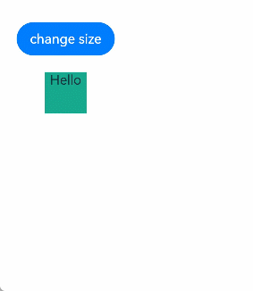

# applySync/flushUpdates/flushUIUpdates APIs: Synchronous Update

<!--Kit: ArkUI-->
<!--Subsystem: ArkUI-->
<!--Owner: @zany_pink-->
<!--Designer: @s10021109-->
<!--Tester: @TerryTsao-->
<!--Adviser: @zhang_yixin13-->

To synchronize the update of state management V2 and animation effects such as [animateTo](../../reference/apis-arkui/arkts-apis-uicontext-uicontext.md#animateto), you can use the [applySync](../../reference/apis-arkui/js-apis-stateManagement.md#applysync22), [flushUpdates](../../reference/apis-arkui/js-apis-stateManagement.md#flushupdates22), or [flushUIUpdates](../../reference/apis-arkui/js-apis-stateManagement.md#flushuiupdates22) API.

> **NOTE**
>
> Since API version 22, you can use the applySync, flushUpdates, and flushUIUpdates APIs in UIUtils to implement synchronous dirty data marking for status management V2.

## Overview

Unlike state management V1, state management V2 does not immediately [mark the variable as dirty](./arkts-state-management-glossary.md#mark-dirty). Instead, it throws a Promise microtask (with a lower priority than a macrotask). The microtask processes the dirty marking of the custom component only after the current macrotask is executed. For details about the differences, see [Differences Between State Management V1 and V2 Update Mechanisms](./arkts-v1-v2-update-difference.md#differences-between-v1-state-variable-update-and-v2-state-variable-update) The animateTo animation immediately refreshes the marked dirty node to determine the first frame of the animation. If the V2 state variable is used in the animation and the state variable is modified before the animation, the first frame of the animation does not meet the expectation because the change of the state variable is not marked dirty when animateTo is called. Therefore, the **applySync**, **flushUpdates**, and **flushUIUpdates** APIs are introduced to implement the synchronization of dirty data in the status management V2 and ensure that the animation effect reaches the expected effect.

To use the **applySync/flushUpdates/flushUIUpdates** API, you need to import the UIUtils tool.

```ts
import { UIUtils } from '@kit.ArkUI';
```

## Use Rules

- The applySync interface is used to synchronously update a specified state variable. This API receives a closure function and updates only the modification in the closure function, including updating the [@Computed](./arkts-new-computed.md) calculation and [@Monitor](./arkts-new-monitor.md) callback and re-render the UI node.

  ```ts
  import { UIUtils } from '@kit.ArkUI';

  @Entry
  @ComponentV2
  struct Index {
    @Local w: number = 50; // Width.
    @Local h: number = 50; // Height.
    @Local message: string = 'Hello';

    @Monitor('message')
    onMessageChange(monitor: IMonitor) {
      monitor.dirty.forEach((path: string) => {
        console.info(`${path} change from ${monitor.value(path)?.before} to ${monitor.value(path)?.now}`);
      });
    }

    build() {
      Column() {
        Button('change size')
          .margin(20)
          .onClick(() => {
            // Values are changed additionally before the animation is executed.
            UIUtils.applySync(() => {
              this.w = 100;
              this.h = 100;
              this.message = 'Hello World';
            });

            this.getUIContext().animateTo({
              duration: 1000
            }, () => {
              this.w = 200;
              this.h = 200;
              this.message = 'Hello ArkUI';
            });
          })
        Column() {
          Text(`${this.message}`)
        }
        .backgroundColor('#ff17a98d')
        .width(this.w)
        .height(this.h)
      }
    }
  }
  ```

  
  
- The **flushUpdates** API is used to synchronously refresh all state variable modifications before this function is called, including updating the @Computed calculation, @Monitor callback, and re-rendering the UI node.

  ```ts
  import { UIUtils } from '@kit.ArkUI';

  @Entry
  @ComponentV2
  struct Index {
    @Local w: number = 50; // Width.
    @Local h: number = 50; // Height.
    @Local message: string = 'Hello';

    @Monitor('message')
    onMessageChange(monitor: IMonitor) {
      monitor.dirty.forEach((path: string) => {
        console.info(`${path} change from ${monitor.value(path)?.before} to ${monitor.value(path)?.now}`);
      });
    }

    build() {
      Column() {
        Button('change size')
          .margin(20)
          .onClick(() => {
            // Values are changed additionally before the animation is executed.
            this.w = 100;
            this.h = 100;
            this.message = 'Hello World';
            UIUtils.flushUpdates();

            this.getUIContext().animateTo({
              duration: 1000
            }, () => {
              this.w = 200;
              this.h = 200;
              this.message = 'Hello ArkUI';
            });
          })
        Column() {
          Text(`${this.message}`)
        }
        .backgroundColor('#ff17a98d')
        .width(this.w)
        .height(this.h)
      }
    }
  }
  ```

  
  
- The applySync and flushUpdates APIs perform the @Computed calculation and @Monitor callback at the same time. As a result, in the preceding sample code, the @Monitor callback is triggered twice in a click event, which may be inconsistent with the developer's expectation. Therefore, the flushUIUpdates API is introduced, this API is used only to synchronously refresh all UI nodes before this function is called. The @Computed calculation and @Monitor callback are not performed.

  ```ts
  import { UIUtils } from '@kit.ArkUI';

  @Entry
  @ComponentV2
  struct Index {
    @Local message: string = 'Hello';

    @Monitor('message')
    onMessageChange(monitor: IMonitor) {
      monitor.dirty.forEach((path: string) => {
        console.info(`${path} change from ${monitor.value(path)?.before} to ${monitor.value(path)?.now}`);
      });
    }

    build() {
      Column() {
        Text(`message: ${this.message}`)
        Button('change size')
          .margin(20)
          .onClick(() => {
            // test1: Call all the applySync API. The log is printed twice.
            // UIUtils.applySync(() => {
            //   this.message = 'Hello World';
            // })
            
            // test2: Call the flushUpdates API. The log is printed twice.
            // this.message = 'Hello World';
            // UIUtils.flushUpdates();
            
            // test3: Call the flushUIUpdates API. The log is printed once.
            this.message = 'Hello World';
            UIUtils.flushUIUpdates();
            this.message = 'Hello ArkUI';
          })
      }
    }
  }
  ```

## Constraints

- If the applySync function is nested in the applySync closure function, the inner applySync function is skipped, undefined is returned, and the warning message "UIUtils.applySync will be skipped when called within another UIUtils.applySync. The inner UIUtils.applySync will return undefined" is printed.

  ```ts
  import { UIUtils } from '@kit.ArkUI';

  @Entry
  @ComponentV2
  struct Index {
    @Local w: number = 50; // Width.
    @Local h: number = 50; // Height.

    build() {
      Column() {
        Button('change size')
          .margin(20)
          .onClick(() => {
            // Values are changed additionally before the animation is executed.
            UIUtils.applySync(() => {
              this.w = 100;
              // The inner applySync will be skipped.
              UIUtils.applySync(() => {
                this.h = 100;
              });
            });

            this.getUIContext().animateTo({
              duration: 1000
            }, () => {
              this.w = 200;
              this.h = 200;
            });
          })
        Column() {
          Text('BOX')
        }
        .backgroundColor('#ff17a98d')
        .width(this.w)
        .height(this.h)
      }
    }
  }
  ```

- Calling the flushUpdates or flushUIUpdates API in the applySync closure does not take effect. At the same time, the corresponding warning information "UIUtils.flushUpdates will be skipped when called within UIUtils.applySync" or "UIUtils.flushUIUpdates will be skipped when called within UIUtils.applySync" is printed.

  ```ts
  import { UIUtils } from '@kit.ArkUI';

  @Entry
  @ComponentV2
  struct Index {
    @Local w: number = 50; // Width.
    @Local h: number = 50; // Height.

    build() {
      Column() {
        Button('change size')
          .margin(20)
          .onClick(() => {
            // Values are changed additionally before the animation is executed.
            UIUtils.applySync(() => {
              this.w = 100;
              UIUtils.flushUpdates(); // In applySync, flushUpdates is ignored.
              UIUtils.flushUIUpdates(); // In applySync, flushUIUpdates is ignored.
            });
            this.h = 100;
            UIUtils.flushUpdates(); // Take effect.

            this.getUIContext().animateTo({
              duration: 1000
            }, () => {
              this.w = 200;
              this.h = 200;
            });
          })
        Column() {
          Text('BOX')
        }
        .backgroundColor('#ff17a98d')
        .width(this.w)
        .height(this.h)
      }
    }
  }
  ```
  
- The applySync, flushUpdates, and flushUIUpdates APIs cannot be called in the getter method decorated by @Computed. Otherwise, an error is reported during running. The error message is "The function is not allowed to be called in @Computed", and the error code is [140001](../../reference/apis-arkui/errorcode-stateManagement.md#140001-invalid-invocation-of-applysync-flushupdates-or-flushuiupdates).

  ```ts
  import { UIUtils } from '@kit.ArkUI';

  @Entry
  @ComponentV2
  struct Page {
    @Local firstName: string = 'Hua';
    @Local lastName: string = 'Li';
    @Local count: number = 0;

    @Computed
    get fullName() {
      // An error is reported when applySync, flushUpdates, and flushUIUpdates are called in computed.
      UIUtils.flushUIUpdates();
      UIUtils.flushUpdates();
      UIUtils.applySync(() => {
        this.count++;
      });
      return this.firstName + ' ' + this.lastName;
    }

    build() {
      Column() {
        Text(`${this.fullName}`)
        Text(`${this.count}`)
        Button('change fullName').onClick(() => {
          this.firstName = 'Zhang';
          this.lastName = 'San';
        })
      }
    }
  }
  ```

- The flushUpdates and flushUIUpdates APIs cannot be called in the @Monitor callback function. Otherwise, an error is reported during running. The error message is "The function is not allowed to be called in @Monitor", and the error code is [140002](../../reference/apis-arkui/errorcode-stateManagement.md#140002-invalid-invocation-of-flushupdates-or-flushuiupdates)

  ```ts
  import { UIUtils } from '@kit.ArkUI';

  @Entry
  @ComponentV2
  struct Page {
    @Local count: number = 0;

    @Monitor('count')
    onCountChange(monitor: IMonitor) {
      monitor.dirty.forEach((path: string) => {
        console.info(`${path} changed from ${monitor.value(path)?.before} to ${monitor.value(path)?.now}`);
      });
      UIUtils.flushUpdates(); // An error is reported when flushUpdates is called in the monitor.
      UIUtils.flushUIUpdates(); // An error is reported when flushUIUpdates is called in the monitor.
    }

    build() {
      Column() {
        Text(`${this.count}`)
        Button('change count').onClick(() => {
          this.count++;
        })
      }
    }
  }
  ```

## Use Cases

### Animation Scenario

The asynchronous dirty data marking logic of the status management V2 conflicts with the logic for animateTo to immediately refresh dirty nodes. As a result, no animation is displayed when animateTo is triggered in @Monitor. The expected effect can be achieved by using the applySync API to synchronize the changes of status variables. The following is an example:

```ts
import { UIUtils } from '@kit.ArkUI';

@Entry
@ComponentV2
struct Index {
  @Local message: string = 'Hello World';
  @Local x: number = 0;
  @Local y: number = 0;
  @Local w: number = 200;
  @Local h: number = 50;

  @Monitor('message')
  onMsgChange() {
    console.info('message change to', this.message);
    this.animateAction();
  }

  animateAction() {
    this.getUIContext().animateTo({
      duration: 1000
    }, () => {
      // Call the applySync API to synchronously refresh the animation tail frame. If this API is not called, the animation is not displayed.
      UIUtils.applySync(() => {
        this.x = 100;
        this.y = 100;
      });
    });
  }

  build() {
    Column() {
      Text(this.message)
        .fontSize(20)
        .width(this.w)
        .height(this.h)
        .backgroundColor(Color.Pink)
        .onClick(() => {
          this.message = 'New Message';
        })
        .position({
          x: this.x,
          y: this.y
        })
    }
    .height('100%')
    .width('100%')
  }
}
```


### Routing Scenario

To set [shared transition](../../reference/apis-arkui/arkui-ts/ts-transition-animation-shared-elements.md#sharedtransition) in the routing scenario, use the **applySync** API to refresh the **name** value during transition. In the following sample code, when the index page is redirected to the PageTransitionTwo page, the IDs of the two pages do not match, and no transition effect is displayed. When the index page is returned from the PageTransitionTwo page, the IDs of the two pages match, and a transition effect is generated.

```ts
// Index.ets

import { UIUtils, AppStorageV2 } from '@kit.ArkUI';

@ObservedV2
export class Info {
  @Trace name: string = '';
}

@Entry
@ComponentV2
struct SharedTransitionExample {
  @Local info: Info = AppStorageV2.connect(Info, () => new Info())!;

  build() {
    Column() {
      // 'app.media.startIcon' is only an example. Replace it with the actual one.
      Image($r('app.media.startIcon'))
        .width(50)
        .height(50)
        .margin({ left: 20, top: 20 })
        .sharedTransition(this.info.name, { duration: 800, curve: Curve.Linear, delay: 100 })
    }
    .width('100%')
    .height('100%')
    .alignItems(HorizontalAlign.Start)
    .onClick(() => {
      UIUtils.applySync(() => {
        this.info.name = 'id1'; // Mismatched
      });
      this.getUIContext().getRouter().pushUrl({ url: 'pages/PageTransitionTwo' })
    })
  }
}
```

```ts
// PageTransitionTwo.ets

import { UIUtils, AppStorageV2 } from '@kit.ArkUI';
import { Info } from './Index'

@Entry
@ComponentV2
struct PageBExample {
  build() {
    Stack() {
      // 'app.media.startIcon' is only an example. Replace it with the actual one.
      Image($r('app.media.startIcon'))
        .width(150)
        .height(150)
        .sharedTransition('sharedImage', { duration: 800, curve: Curve.Linear, delay: 100 })
        .onClick(() => {
          UIUtils.applySync(() => {
            AppStorageV2.connect(Info, () => new Info())!.name = 'sharedImage'; // Matching
          });
          this.getUIContext().getRouter().back();
        })
    }
    .width('100%')
    .height('100%')
  }
}
```


