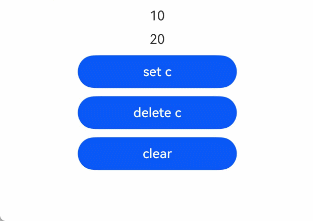

# makeObserved API: Changing Unobservable Data to Observable Data
<!--Kit: ArkUI-->
<!--Subsystem: ArkUI-->
<!--Owner: @liwenzhen3-->
<!--Designer: @s10021109-->
<!--Tester: @TerryTsao-->
<!--Adviser: @zhang_yixin13-->

To change the unobservable data to observable data, you can use the [makeObserved](../../reference/apis-arkui/js-apis-stateManagement.md#makeobserved) API.


**makeObserved** can be used when \@Trace cannot be used. Before reading this topic, you are advised to read [\@Trace](./arkts-new-observedV2-and-trace.md).

>**NOTE**
>
>The **makeObserved** API in UIUtils is supported since API version 12.

## Overview

- The state management framework provides [@ObservedV2 and @Trace](./arkts-new-observedV2-and-trace.md) decorators to observe class property changes. The **makeObserved** API is mainly used in scenarios where @ObservedV2 or @Trace cannot be used. For example:

  - Object in a third-party package defined by class is unobservable. You cannot manually add the @Trace tag to the attributes to be observed in the class, so **makeObserved** can be used to make this object observable.

  - The member attributes of the current class cannot be modified. @Trace observes class attributes and dynamically modifies the attributes of the class. This behavior is not allowed in the class decorated with [@Sendable](../../arkts-utils/arkts-sendable.md#sendable-decorator). In this case, you can use **makeObserved**.

  - Anonymous object returned by API or JSON.parse does not have a class declaration. In this scenario, you cannot use @Trace to mark that the current attribute, therefore, **makeObserved** can be used instead.


- To use the **makeObserved** API, you need to import UIUtils.
  ```ts
  import { UIUtils } from '@kit.ArkUI';
  ```

## Constraints

- The parameters of **makeObserved** support only non-null object types.
  - Undefined and null: not supported. The parameters itself is returned and no processing is performed.
  - Non-object type: An error is reported during compilation.

  ```ts
  import { UIUtils } from '@kit.ArkUI';
  let res1 = UIUtils.makeObserved(2); // Invalid input parameter. An error is reported during compilation.
  let res2 = UIUtils.makeObserved(undefined); // Invalid input parameter. The parameter itself is returned, that is, res2 = = = undefined.
  let res3 = UIUtils.makeObserved(null); // Invalid input parameter. The parameter itself is returned, that is, res3 === null.

  class Info {
    id: number = 0;
  }
  let rawInfo: Info = UIUtils.makeObserved(new Info()); // Correct usage.
  ```

- makeObserved does not support instances of classes decorated with [@ObservedV2](./arkts-new-observedV2-and-trace.md) or [@Observed](./arkts-observed-and-objectlink.md), nor proxy data already encapsulated by makeObserved. To prevent double-proxying, makeObserved returns the input parameter directly if it belongs to any of these types.
  ```ts
  import { UIUtils } from '@kit.ArkUI';
  @ObservedV2
  class Info {
    @Trace id: number = 0;
  }
  // Incorrect usage: If makeObserved finds that the input instance is an instance of a class decorated by @ObservedV2, makeObserved returns the input object itself.
  let observedInfo: Info = UIUtils.makeObserved(new Info());

  class Info2 {
    id: number = 0;
  }
  // Correct usage. The input object is neither an instance of the class decorated by @ObservedV2 or @Observed nor the proxy data encapsulated by makeObserved.
  // Return observable data.
  let observedInfo1: Info2 = UIUtils.makeObserved(new Info2());
  // Incorrect usage. The input object is the proxy data encapsulated by makeObserved, which is not processed this time.
  let observedInfo2: Info2 = UIUtils.makeObserved(observedInfo1);
  ```
- makeObserved can be used in custom components decorated with [@Component](./arkts-create-custom-components.md#component), but cannot be used with the state variable decorator of state management V1. If they are used together, a runtime exception is thrown.
  ```ts
  // Incorrect usage. An exception occurs during running.
  @State message: Info = UIUtils.makeObserved(new Info(20));
  ```
  Note: The following writing method of **message2** does not throw an exception. The reason is as follows:
  - this.message is decorated with [@State](./arkts-state.md), and its implementation is equivalent to @Observed.
  - If the input parameter of UIUtils.makeObserved is the instance of the class decorated with @Observed, the instance is directly returned.
  
  Therefore, the initial value of **message2** is not the proxy object returned by makeObserved, but **this.message** decorated with @State.
  <!-- @[UI_will_not_refresh](https://gitcode.com/openharmony/applications_app_samples/blob/master/code/DocsSample/ArkUISample/MakeObserved/entry/src/main/ets/View/Page1.ets) -->
  
  ``` TypeScript
  import { UIUtils } from '@kit.ArkUI';
  class Person {
    public age: number = 10;
  }
  class Info {
    public id: number = 0;
    public person: Person = new Person();
  }
  @Entry
  @Component
  struct Page1 {
    @State message: Info = new Info();
    @State message2: Info = UIUtils.makeObserved(this.message); // An exception does not throw.
    build() {
      Column() {
        Text(`${this.message2.person.age}`)
          .onClick(() => {
            // The UI is not re-rendered because only the changes at the first layer can be observed by the @State.
            this.message2.person.age++;
          })
      }
    }
  }
  ```

### makeObserved performs deep observation only on the input object.

 - **message** is decorated with [@Local](./arkts-new-local.md) and has the capability of observing its own value changes. Its initial value is the return value of **makeObserved**, which supports in-depth observation. Note that makeObserved performs deep observation only on **message**, while the value change of **message** is observed by @Local.
 - Click **change id** to re-render the UI.
 - Click **change Info** to set **this.message** to unobservable data. Click **change id** again, UI cannot be re-rendered.
 - Click **change Info1** to set **this.message** to observable data. Click **change id** again, UI can be re-rendered.
  <!-- @[MakeObserved_only_applies_to_input_parameters](https://gitcode.com/openharmony/applications_app_samples/blob/master/code/DocsSample/ArkUISample/MakeObserved/entry/src/main/ets/View/Page2.ets) -->
  
  ``` TypeScript
  import { UIUtils } from '@kit.ArkUI';
  class Info {
    public id: number = 0;
    constructor(id: number) {
      this.id = id;
    }
  }
  @Entry
  @ComponentV2
  struct Page2 {
    @Local message: Info = UIUtils.makeObserved(new Info(20));
    build() {
      Column() {
        Button(`change id`).onClick(() => {
          this.message.id++;
        })
        Button(`change Info ${this.message.id}`).onClick(() => {
          this.message = new Info(30);
        })
        Button(`change Info1 ${this.message.id}`).onClick(() => {
          this.message = UIUtils.makeObserved(new Info(30));
        })
      }
    }
  }
  ```


## Supported Types and Observed Changes

### Material

- Classes that are not decorated with [\@Observed](./arkts-observed-and-objectlink.md) or [\@ObservedV2](./arkts-new-observedV2-and-trace.md) are supported.
- Array, Map, Set, and Date types are supported.
- [collections.Array](../../reference/apis-arkts/arkts-apis-arkts-collections-Array.md), [collections.Set](../../reference/apis-arkts/arkts-apis-arkts-collections-Set.md) and [collections.Map](../../reference/apis-arkts/arkts-apis-arkts-collections-Map.md) are supported.
- Object returned by JSON.parse.
- @Sendable decorated class.

### Observed Changes

- When an instance of the built-in type or collections type is passed by **makeObserved**, you can observe the changes.

  | Type | Change-Triggering API                                             |
  | ----- | ------------------------------------------------------------ |
  | Array | push, pop, shift, unshift, splice, copyWithin, fill, reverse, sort|
  | collections.Array | push, pop, shift, unshift, splice, fill, reverse, sort, shrinkTo, extendTo|
  | Map/collections.Map   | set, clear, delete                                |
  | Set/collections.Set   | add, clear, delete                                |
  | Date  | setFullYear, setMonth, setDate, setHours, setMinutes, setSeconds, setMilliseconds, setTime, setUTCFullYear, setUTCMonth, setUTCDate, setUTCHours, setUTCMinutes, setUTCSeconds, setUTCMilliseconds|

## When to Use

### Using makeObserved and @Sendable Decorated Class Together

[@Sendable](../../arkts-utils/arkts-sendable.md) is used to process concurrent tasks in application scenarios. The **makeObserved** and @Sendable can be used together to meet the requirements of big data processing in the sub-thread and **ViewModel** display and data observation in the UI thread in common application development. For details about @Sendable, see [Multithreaded Concurrency Overview (TaskPool and Worker)](../../arkts-utils/multi-thread-concurrency-overview.md).

This section describes the following scenarios:
- When **makeObserved** is used with @Sendable data, it enables observability of changes that can trigger UI refreshes.
- A complete set of data is fetched from a child thread and used to replace the observable data in the UI thread entirely.
- The data fetched from the child thread is reprocessed with **makeObserved** to become observable.
- When data is passed from the main thread to a subthread, only unobservable data is passed. The return value of **makeObserved** is not directly passed to child threads.

Example:
<!-- @[SendableData](https://gitcode.com/openharmony/applications_app_samples/blob/master/code/DocsSample/ArkUISample/MakeObserved/entry/src/main/ets/Model/modelView.ets) -->

``` TypeScript
@Sendable
export class SendableData  {
  public name: string = 'Tom';
  public age: number = 20;
  public gender: number = 1;
  // Other attributes are omitted here.
  public likes: number = 1;
  public follow: boolean = false;
}
```

<!-- @[function threadGetData](https://gitcode.com/openharmony/applications_app_samples/blob/master/code/DocsSample/ArkUISample/MakeObserved/entry/src/main/ets/View/Page3.ets) -->

``` TypeScript
import { taskpool } from '@kit.ArkTS';
import { SendableData } from '../Model/modelView';
import { UIUtils } from '@kit.ArkUI';
import { hilog } from '@kit.PerformanceAnalysisKit';

@Concurrent
function threadGetData(param: string): SendableData {
  const DOMAIN = 0xF811;
  const TAG = '[Sample_MakeObserved]';
  // Process data in the child thread.
  let ret = new SendableData();
  hilog.info(DOMAIN, TAG, `Concurrent threadGetData, param ${param}`);
  ret.name = param + '-o';
  ret.age = Math.floor(Math.random() * 40);
  ret.likes = Math.floor(Math.random() * 100);
  return ret;
}

@Entry
@ComponentV2
struct Page3 {
  // Use makeObserved to add observation to a regular object or a @SendableData object.
  @Local send: SendableData = UIUtils.makeObserved(new SendableData());

  build() {
    Column() {
      Text(this.send.name)
      Button('change name').onClick(() => {
        // Change of the attribute can be observed.
        this.send.name += '0';
      })

      Button('task').onClick(() => {
        // Enqueue the function to be executed in the task pool, waiting to be dispatched to a worker thread.
        taskpool.execute(threadGetData, this.send.name).then(val => {
          // Used together with @Local to observe changes to 'this.send'.
          this.send = UIUtils.makeObserved(val as SendableData);
        })
      })
    }
  }
}
```

Note: Data construction and processing can be done in the child thread, but observable data cannot be passed to the child thread (observable data can only be manipulated in the main thread). Therefore, in the preceding example, only the **name** attribute of **this.send** is passed to the subthread.

### Using makeObserved and collections.Array/collections.Set/collections.Map Together
**collections** provide ArkTS container sets for high-performance data passing in concurrent scenarios. For details, see [@arkts.collections (ArkTS Collections)](../../reference/apis-arkts/arkts-apis-arkts-collections.md).

makeObserved enables importing observable collections into ArkUI, but is incompatible with state management V1 decorators like, such as @State and [@Prop](./arkts-prop.md). Combining them will result in runtime exceptions.

**collections.Array**

The following APIs can trigger UI re-rendering:
- Changing the array length: push, pop, shift, unshift, splice, shrinkTo, and extendTo
- Changing the array items: sort and fill

Other APIs do not change the original array. Therefore, the UI re-rendering is not triggered.
<!-- @[makeObserved_collections_Array_Set_Map](https://gitcode.com/openharmony/applications_app_samples/blob/master/code/DocsSample/ArkUISample/MakeObserved/entry/src/main/ets/View/Page4.ets) --> 

``` TypeScript
import { collections } from '@kit.ArkTS';
import { UIUtils } from '@kit.ArkUI';

@Sendable
class Info {
  public id: number = 0;
  public name: string = 'cc';

  constructor(id: number) {
    this.id = id;
  }
}


@Entry
@ComponentV2
struct Page4 {
  scroller: Scroller = new Scroller();
  @Local arrCollect: collections.Array<Info> =
    UIUtils.makeObserved(new collections.Array<Info>(new Info(1), new Info(2)));

  build() {
    Column() {
      // The ForEach API supports only Array<any>. collections.Array<any> is not supported.
      // However, the array APIs used for ForEach implementation are provided in collections.Array. Therefore, you can assert an Array type using the as keyword.
      // The assertion does not change the original data type.
      ForEach(this.arrCollect as object as Array<Info>, (item: Info) => {
        Text(`${item.id}`)
          .margin(5)
          .onClick(() => {
            item.id++;
          })
      }, (item: Info, index) => item.id.toString() + index.toString())
      Divider()
        .color('blue')
        .margin(5)
      if (this.arrCollect.length > 0) {
        Text(`the first one ${this.arrCollect[0].id}`)
          .margin(5)
        Text(`the last one ${this.arrCollect[this.arrCollect.length - 1].id}`)
          .margin(5)
      }
      Divider()
        .color('blue')
        .margin(5)

      /****************************APIs for Changing the Data Length**************************/
      Scroll(this.scroller) {
        Column({ space: 10 }) {
          // Divider()
          //   .color('blue')
          // push: adds a new element.
          Button('push')
            .width('50%')
            .onClick(() => {
              this.arrCollect.push(new Info(30));
            })
          // pop: deletes the last element.
          Button('pop')
            .width('50%')
            .onClick(() => {
              this.arrCollect.pop();
            })
          // shift: deletes the first element.
          Button('shift')
            .width('50%')
            .onClick(() => {
              this.arrCollect.shift();
            })
          // unshift: inserts a new item at the beginning of the array.
          Button('unshift')
            .width('50%')
            .onClick(() => {
              this.arrCollect.unshift(new Info(50));
            })
          // splice: deletes an element from the specified position of the array.
          Button('splice')
            .width('50%')
            .onClick(() => {
              this.arrCollect.splice(1);
            })

          // shrinkTo: shrinks the array length to a specified length.
          Button('shrinkTo')
            .width('50%')
            .onClick(() => {
              this.arrCollect.shrinkTo(1);
            })
          // extendTo: extends the array length to a specified length.
          Button('extendTo')
            .width('50%')
            .onClick(() => {
              this.arrCollect.extendTo(6, new Info(20));
            })

          Divider()
            .color('blue')

          /****************************************APIs for Changing the Array Item*****************/
          // sort: arranging the Array item in descending order.
          Button('sort')
            .width('50%')
            .onClick(() => {
              this.arrCollect.sort((a: Info, b: Info) => b.id - a.id);
            })
          // fill: fills in the specified part with a value.
          Button('fill')
            .width('50%')
            .onClick(() => {
              this.arrCollect.fill(new Info(5), 0, 2);
            })

          /*****************************APIs for Not Changing the Array Item***************************/
          // slice: returns a new array. The original array is copied using Array.slice(start,end), which does not change the original array. Therefore, directly invoking slice does not trigger UI re-rendering.
          // You can construct a case to assign the return data of the shallow copy to this.arrCollect. Note that makeObserved must be called here. Otherwise, the observation capability will be lost after this.arr is assigned a value by a common variable.
          Button('slice')
            .width('50%')
            .onClick(() => {
              this.arrCollect = UIUtils.makeObserved(this.arrCollect.slice(0, 1));
            })
          // map: The principle is the same as above.
          Button('map')
            .width('50%')
            .onClick(() => {
              this.arrCollect = UIUtils.makeObserved(this.arrCollect.map((value) => {
                value.id += 10;
                return value;
              }))
            })
          // filter: The principle is the same as above.
          Button('filter')
            .width('50%')
            .onClick(() => {
              this.arrCollect = UIUtils.makeObserved(this.arrCollect.filter((value: Info) => value.id % 2 === 0));
            })
          // concat: The principle is the same as above.
          Button('concat')
            .width('50%')
            .onClick(() => {
              let array1 = new collections.Array(new Info(100))
              this.arrCollect = UIUtils.makeObserved(this.arrCollect.concat(array1));
            })
        }
        .height('200%')
      }
      .height('100%')
    }
    .height('100%')
    .width('100%')
  }
}
```


**collections.Map**

The following APIs can trigger UI re-rendering: set, clear, and delete.
<!-- @[foreach_mapCollect_keys](https://gitcode.com/openharmony/applications_app_samples/blob/master/code/DocsSample/ArkUISample/MakeObserved/entry/src/main/ets/View/Page5.ets) --> 

``` TypeScript
import { collections } from '@kit.ArkTS';
import { UIUtils } from '@kit.ArkUI';

@Sendable
class Info {
  public id: number = 0;

  constructor(id: number) {
    this.id = id;
  }
}


@Entry
@ComponentV2
struct Page5 {
  mapCollect: collections.Map<string, Info> =
    UIUtils.makeObserved(new collections.Map<string, Info>([['a', new Info(10)], ['b', new Info(20)]]));

  build() {
    Column() {
      // this.mapCollect.keys() returns an iterator, which is not supported by ForEach. Therefore, Array.from is used to generate data in shallow copy mode.
      ForEach(Array.from(this.mapCollect.keys()), (item: string) => {
        Text(`${this.mapCollect.get(item)?.id}`)
          .margin(5)
          .onClick(() => {
            let value: Info | undefined = this.mapCollect.get(item);
            if (value) {
              value.id++;
            }
          })
      }, (item: string, index) => item + index.toString())

      // set c
      Button('set c')
        .width('50%')
        .margin(5)
        .onClick(() => {
          this.mapCollect.set('c', new Info(30));
        })
      // delete c
      Button('delete c')
        .width('50%')
        .margin(5)
        .onClick(() => {
          if (this.mapCollect.has('c')) {
            this.mapCollect.delete('c');
          }
        })
      // clear
      Button('clear')
        .width('50%')
        .margin(5)
        .onClick(() => {
          this.mapCollect.clear();
        })
    }
    .height('100%')
    .width('100%')
  }
}
```


**collections.Set**

The following APIs can trigger UI re-rendering: add, clear, and delete.
<!-- @[Array_rom_shallow_copy](https://gitcode.com/openharmony/applications_app_samples/blob/master/code/DocsSample/ArkUISample/MakeObserved/entry/src/main/ets/View/Page6.ets) --> 

``` TypeScript
import { collections } from '@kit.ArkTS';
import { UIUtils } from '@kit.ArkUI';
import { hilog } from '@kit.PerformanceAnalysisKit';

const DOMAIN = 0xF811;
const TAG = '[Sample_MakeObserved]';

@Sendable
class Info {
  public id: number = 0;

  constructor(id: number) {
    this.id = id;
  }
}


@Entry
@ComponentV2
struct Page6 {
  set: collections.Set<Info> = UIUtils.makeObserved(new collections.Set<Info>([new Info(10), new Info(20)]));

  build() {
    Column() {
      // ForEach does not support iterators. Therefore, Array.from is used to generate data in shallow copy mode.
      // However, the new array generated by shallow copy does not have the observation capability. To ensure that the data can be observed when the ForEach component accesses the item, makeObserved needs to be called again.
      ForEach((UIUtils.makeObserved(Array.from(this.set.values()))), (item: Info) => {
        Text(`${item.id}`)
          .margin(5)
          .onClick(() => {
            item.id++;
          })
      }, (item: Info, index) => item.id + index.toString())

      Button('add')
        .margin(5)
        .width('50%')
        .onClick(() => {
          this.set.add(new Info(30));
          hilog.info(DOMAIN, TAG, ('size:' + this.set.size));
        })
      Button('delete')
        .margin(5)
        .width('50%')
        .onClick(() => {
          let iterator = this.set.keys();
          this.set.delete(iterator.next().value);
        })
      Button('clear')
        .margin(5)
        .width('50%')
        .onClick(() => {
          this.set.clear();
        })
    }
    .height('100%')
    .width('100%')
  }
}
```


### Input Parameter of makeObserved Is the Return Value of JSON.parse
**JSON.parse** returns an object which cannot be decorated by @Trace. You can use **makeObserved** to make it observable.
<!-- @[makeObserved_JSON.parse](https://gitcode.com/openharmony/applications_app_samples/blob/master/code/DocsSample/ArkUISample/MakeObserved/entry/src/main/ets/View/Page7.ets) -->

``` TypeScript
import { JSON } from '@kit.ArkTS';
import { UIUtils } from '@kit.ArkUI';

class Info {
  public id: number = 0;

  constructor(id: number) {
    this.id = id;
  }
}

let test: Record<string, number> = { 'a': 123 };
let testJsonStr: string = JSON.stringify(test);
let test2: Record<string, Info> = { 'a': new Info(20) };
let test2JsonStr: string = JSON.stringify(test2);

@Entry
@ComponentV2
struct Page7 {
  message: Record<string, number> = 
        UIUtils.makeObserved<Record<string, number>>(JSON.parse(testJsonStr) as Record<string, number>);
  message2: Record<string, Info> = 
        UIUtils.makeObserved<Record<string, Info>>(JSON.parse(test2JsonStr) as Record<string, Info>);

  build() {
    Column() {
      Text(`${this.message.a}`)
        .id('textId1')
        .fontSize(50)
        .onClick(() => {
          this.message.a++;
        })
      Text(`${this.message2.a.id}`)
        .id('textId2')
        .fontSize(50)
        .onClick(() => {
          this.message2.a.id++;
        })
    }
    .height('100%')
    .width('100%')
  }
}
```


### Using makeObserved and Decorators of V2 Together
**makeObserved** can be used with the decorators of V2. For [@Monitor](./arkts-new-monitor.md) and [@Computed](./arkts-new-computed.md), because **makeObserved** returns the class instance itself when passed an instance decorated with @Observed or ObservedV2, @Monitor or @Computed cannot be defined within a class. They can only be defined inside custom components.

Example:
<!-- @[name_change_from_monitor_value](https://gitcode.com/openharmony/applications_app_samples/blob/master/code/DocsSample/ArkUISample/MakeObserved/entry/src/main/ets/View/Page8.ets) --> 

``` TypeScript
import { UIUtils } from '@kit.ArkUI';
import { hilog } from '@kit.PerformanceAnalysisKit';

const DOMAIN = 0xF811;
const TAG = '[Sample_MakeObserved]';

class Info {
  public id: number = 0;
  public age: number = 20;

  constructor(id: number) {
    this.id = id;
  }
}

@Entry
@ComponentV2
struct Page8 {
  @Local message: Info = UIUtils.makeObserved(new Info(20));

  // This function is called when message.id changes.
  @Monitor('message.id')
  onStrChange(monitor: IMonitor) {
    hilog.info(DOMAIN, TAG, `name change from ${monitor.value()?.before} to ${monitor.value()?.now}`);
  }

  // This function is called when message.id and message.age change and need to be recalculated.
  @Computed
  get ageId() {
    hilog.info(DOMAIN, TAG, '---------Computed----------');
    return this.message.id + ' ' + this.message.age;
  }

  build() {
    Column() {
      Text(`id: ${this.message.id}`)
        .id('textIdMessage')
        .fontSize(30)
        .margin(5)
        .onClick(() => {
          this.message.id++;
        })
      Text(`age: ${this.message.age}`)
        .id('textAgeMessageAge')
        .fontSize(30)
        .margin(5)
        .onClick(() => {
          this.message.age++;
        })
      Text(`Computed age + id: ${this.ageId}`)
        .fontSize(30)
        .margin(5)
      Button('change Info')
        .id('buttonChangeInfo')
        .fontSize(30)
        .margin(5)
        .onClick(() => {
          // Return the class instance itself, assign the instance to message, and trigger @Computed and @Monitor.
          this.message = UIUtils.makeObserved(new Info(200));
        })
      Child({ message: this.message })
    }
    .height('100%')
    .width('100%')
  }
}

@ComponentV2
struct Child {
  @Param @Require message: Info;

  build() {
    Text(`Child id: ${this.message.id}`)
      .fontSize(30)
      .margin(5)
  }
}
```


### Using makeObserved in @Component
**makeObserved** cannot be used with the state variable decorator of V1, but can be used in custom components decorated by @Component.
<!-- @[makeObserved_Component](https://gitcode.com/openharmony/applications_app_samples/blob/master/code/DocsSample/ArkUISample/MakeObserved/entry/src/main/ets/View/Page9.ets) -->

``` TypeScript
import { UIUtils } from '@kit.ArkUI';
class Info {
  public id: number = 0;

  constructor(id: number) {
    this.id = id;
  }
}


@Entry
@Component
struct Page9 {
  // Using makeObserved together with @State, a runtime exception is thrown.
  message: Info = UIUtils.makeObserved(new Info(20));

  build() {
    RelativeContainer() {
      Text(`${this.message.id}`)
        .id('textNumber')
        .onClick(() => {
          this.message.id++;
        })
    }
    .height('100%')
    .width('100%')
  }
}
```


## Common Issue
### Original Object Can Be Assigned Value Using getTarget but Fails to Trigger UI Re-render
[getTarget](./arkts-new-getTarget.md) can be used to obtain the original object before adding a proxy in the state management.

The observation object encapsulated by **makeObserved** can obtain its original object through **getTarget**. The value changes to the original object do not trigger UI re-rendering.

Example:
1. Click the first **Text** component and obtain its original object through **getTarget**. In this case, modifying the attributes of the original object does not trigger UI re-rendering, but a value is assigned to the data.
2. Click the second **Text** component. If the **this.observedObj** attribute is modified, the UI is re-rendered and the value of **Text** is **21**.
<!-- @[getTarget_observedObj](https://gitcode.com/openharmony/applications_app_samples/blob/master/code/DocsSample/ArkUISample/MakeObserved/entry/src/main/ets/View/Page10.ets) -->

``` TypeScript
import { UIUtils } from '@kit.ArkUI';
class Info {
  public id: number = 0;
}

@Entry
@Component
struct Page10 {
  observedObj: Info = UIUtils.makeObserved(new Info());
  build() {
    Column() {
      Text(`${this.observedObj.id}`)
        .id('textobservedObj1')
        .fontSize(50)
        .onClick(() => {
          // Use getTarget to obtain the original object and assign this.observedObj to unobservable data.
          let rawObj: Info= UIUtils.getTarget(this.observedObj);
          // The UI is not re-rendered, but a value is assigned to the data.
          rawObj.id = 20;
        })

      Text(`${this.observedObj.id}`)
        .id('textobservedObj2')
        .fontSize(50)
        .onClick(() => {
          // Triggers UI re-rendering. The value of Text is 21.
          this.observedObj.id++;
        })
    }
  }
}
```
