# \@Monitor Decorator: Listening for Value Changes of the State Variables

<!--Kit: ArkUI-->
<!--Subsystem: ArkUI-->
<!--Owner: @jiyujia926-->
<!--Designer: @zhangboren-->
<!--Tester: @TerryTsao-->
<!--Adviser: @zhang_yixin13-->
<!-- md-trans-meta sourceCommit=3efb4ba336409dd0731ba011e1e227786db57fa2 translatedAt=2026-07-22T02:12:52.061Z pushedAt=2026-07-23T01:32:24.366Z -->

To enhance the state management framework's capability of monitoring State Variable changes, you can use the [\@Monitor](../../reference/apis-arkui/arkui-ts/ts-state-management-monitor.md#monitor) decorator to listen for State Variable changes.

\@Monitor provides the capability of listening for state variables of V2. Before reading this topic, it is recommended to familiarize yourself with [\@ComponentV2](./arkts-create-custom-components.md#componentv2), [\@ObservedV2 and \@Trace](./arkts-new-observedV2-and-trace.md), and [\@Local](./arkts-new-local.md).

> **NOTE**
>
> The \@Monitor decorator is supported since API version 12.
>
> Since API version 12, this decorator is supported in atomic services.
>
> Since API version 23, this decorator is supported in ArkTS widgets.
>
> Since API version 26.0.0, this decorator adds support for the wildcard capability.

## Overview

The @Monitor decorator is used to listen for changes to state variables, enabling deep listening capabilities for them:

- The \@Monitor decorator can be used in custom components decorated by \@ComponentV2. But it cannot listen for the changes of the state variables that are not decorated by these decorators: [\@Local](arkts-new-local.md), [\@Param](arkts-new-param.md), [\@Provider](arkts-new-provider-and-consumer.md), [\@Consumer](arkts-new-provider-and-consumer.md) and [\@Computed](arkts-new-computed.md).

- The \@Monitor decorator can be used in a class together with [\@ObservedV2 and \@Trace](arkts-new-observedV2-and-trace.md) decorators. But it cannot be used in a class that is not decorated by \@ObservedV2. \@Monitor cannot listen for the properties that are not decorated by \@Trace.

- When the listened property changes, the callback defined by \@Monitor will be called. Strict equality (===) is used to determine whether a property is changed. If **false** is returned, the \@Monitor decorated callback is triggered. When a property is changed for multiple times in an event, the initial value will be compared with the final value to determine whether the property is changed.

- A single \@Monitor decorator can listen for the changes of multiple properties at the same time. When these properties change together in an event, the \@Monitor callback method is triggered only once.

- The \@Monitor decorator has deep listening capability and can listen for changes of specified items in nested classes, multi-dimensional arrays, and object arrays. To listen for changes to member properties of nested classes or object arrays, the class must be decorated with @ObservedV2 and the properties must be decorated with @Trace.

- When \@Monitor observes an entire array, changes to individual array items are not observed. \@Monitor cannot listen for changes caused by calling APIs of built-in types (Array, Map, Date, and Set).

- In the inheritance scenario, you can define \@Monitor for the same property in the parent and child components for listening. When the property changes, the \@Monitor callback defined in the parent and child components is called.

- Similar to the [\@Watch](arkts-watch.md) decorator, you should define the callback functions by yourselves. The difference is that the \@Watch decorator uses the function name as a parameter, while the \@Monitor directly decorates the callback function. For details about the comparison between \@Monitor and \@Watch, see [Comparing \@Monitor with \@Watch](#comparing-monitor-with-watch).

Since API version 26.0.0, you can configure [MonitorDecoratorOptions](../../reference/apis-arkui/arkui-ts/ts-state-management-monitor.md#monitordecoratoroptions) to obtain the following capability enhancements:

- Supports setting the wildcard "*" in the listening path for fuzzy monitoring of internal object changes, including changes to any \@Trace property in \@ObservedV2, changes caused by API calls of built-in types (Array, Map, Date, Set), and more. For details, see [Listening for Paths Containing Wildcards](#listening-for-paths-containing-wildcards).

- Corrects some capabilities of \@Monitor. For details, see [Comparison of \@Monitor Before and After Using Configuration Options](#comparison-of-monitor-before-and-after-using-configuration-options).

## Limitations of the \@Watch decorator in State Management V1

This V1 version cannot listen for the changes of an object, a single property in an array, or array items. It also cannot obtain the value before change.

<!-- @[monitor_watch_decorator_limitations_v1](https://gitcode.com/openharmony/applications_app_samples/blob/master/code/DocsSample/ArkUISample/ParadigmStateManagement/entry/src/main/ets/pages/monitor/WatchDecoratorLimitationsV1.ets) -->  

``` TypeScript
import { hilog } from '@kit.PerformanceAnalysisKit';

@Observed
class Info {
  public name: string = 'Tom';
  public age: number = 25;
}

@Entry
@Component
struct Index {
  @State @Watch('onInfoChange') info: Info = new Info();
  @State @Watch('onNumArrChange') numArr: number[] = [1, 2, 3, 4, 5];

  onInfoChange() {
    hilog.info(0xFF00, 'testTag', '%{public}s', `info after change name: ${this.info.name}, age: ${this.info.age} `);
  }

  onNumArrChange() {
    hilog.info(0xFF00, 'testTag', '%{public}s', `numArr after change ${this.numArr}`);
  }

  build() {
    Row() {
      Column() {
        // Changes to a single property in an object or a single item in an array do not trigger a UI refresh.
        Button('change info name')
          .width(300)
          .margin(10)
          .onClick(() => {
            this.info.name = 'Jack';
          })
        Button('change info age')
          .width(300)
          .margin(10)
          .onClick(() => {
            this.info.age = 30;
          })
        Button('change numArr[2]')
          .width(300)
          .margin(10)
          .onClick(() => {
            this.numArr[2] = 5;
          })
        Button('change numArr[3]')
          .width(300)
          .margin(10)
          .onClick(() => {
            this.numArr[3] = 6;
          })
      }
      .width('100%')
    }
    .height('100%')
  }
}
```

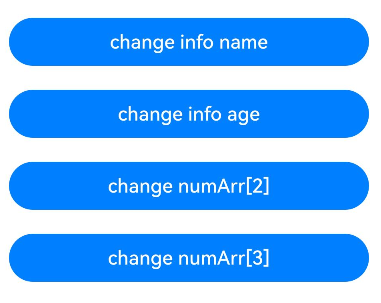

In the preceding code, when you click **change info name** to change the **name** property in **info**, or click **change info age** to change **age**, the **info** registered \@Watch callback is triggered. When you click **change numArr[2]** to change the third element in **numArr**, or click **change numArr[3]** to change the fourth element, the **numArr** registered \@Watch callback is triggered. In these two callbacks, the value before data change cannot be obtained. This makes it inconvenient for you to listen for the variable changes because you cannot find out which property or element is changed to trigger \@Watch event in a more complex scenario. Therefore, the \@Monitor decorator comes into the picture to listen for the changes of an object, a single property in an array, or an array item and obtain the value before change.

## Decorator Description

| \@Monitor Property Decorator| Description                                                        |
| ------------------- | ------------------------------------------------------------ |
| Decorator Parameter          | Before API version 26.0.0, the parameter is a string-type object property name.<br>Starting from API version 26.0.0, the first parameter can also be a [MonitorDecoratorOptions](../../reference/apis-arkui/arkui-ts/ts-state-management-monitor.md#monitordecoratoroptions) configuration option.<br>Multiple object properties can be monitored simultaneously, with each property separated by a comma, for example, @Monitor('prop1', 'prop2'). Deep-level property changes can be monitored, such as a specific element in a multi-dimensional array, or a specific property in a nested object or object array. For details, see [Listened Changes](#listened-changes). |
| Decorated Object            | \@Monitor decorates a member method. When the monitored property changes, the callback method is triggered. The callback method takes a variable of the [IMonitor](../../reference/apis-arkui/arkui-ts/ts-state-management-monitor.md#imonitor) type as a parameter, from which the developer can obtain information about the changes before and after. |

### Syntax

> **NOTE**
>
> For simplicity, the \@Monitor call with MonitorDecoratorOptions passed in is referred to as **\@Monitor with configuration options** below. The \@Monitor call without MonitorDecoratorOptions passed in is referred to as **\@Monitor without configuration options**.

Syntax of \@Monitor without configuration options:

```typescript
@Monitor('path')
onValueChange(monitor: IMonitor) {
}
```

Syntax of \@Monitor with configuration options:

``` ts
@Monitor({ enableWildcard: false }, 'path') // Use configuration options to explicitly disable wildcard
onValueChanged1(monitor: IMonitor) {
}
@Monitor({}, 'path.*') // Use configuration options, with wildcard enabled by default, to monitor any observable changes within the path object
onValueChange2(monitor: IMonitor) {
}
@Monitor({ enableWildcard: true }, 'path.*') // Use configuration options to explicitly enable wildcard
onValueChange3(monitor: IMonitor) {
}
```

### Comparison of \@Monitor Before and After Using Configuration Options

| Scenario                                      | \@Monitor Without Configuration Options                      | \@Monitor With Configuration Options                         |
| --------------------------------------------- | ------------------------------------------------------------ | ------------------------------------------------------------ |
| Using wildcards                               | Not supported.                                               | Supported.                                                   |
| Listening for non-listenable variables        | There is a possibility of being side‑triggered. For details, see [Passing Correct Input Parameters to \@Monitor](#passing-correct-input-parameters-to-monitor). | Non-listenable variables are ignored, and path listening becomes independent of each other. |
| Variable accessibility changes                | Only records the state when the variable is accessible, and cannot properly handle the case where the variable becomes inaccessible. | Properly handles both cases: when a variable changes from accessible to inaccessible, and from inaccessible to accessible. |

The behavior of \@Monitor with configuration options in the above scenarios is consistent with [\@SyncMonitor](arkts-new-syncmonitor.md) and [addMonitor](./arkts-new-addMonitor-clearMonitor.md).

## Available APIs

For the API descriptions of the IMonitor type, IMonitorValue\<T\> type, and MonitorDecoratorOptions, see the API reference: [\@Monitor: State Variable Change Monitoring](../../reference/apis-arkui/arkui-ts/ts-state-management-monitor.md).

## Listened Changes

### Using \@Monitor in Custom Components Decorated by \@ComponentV2

When the state variables listened by \@Monitor change, the callback is triggered.

- Variables listened by \@Monitor need to be decorated by \@Local, \@Param, \@Provider, \@Consumer, and \@Computed. Otherwise, they cannot be listened when they change. \@Monitor can listen for multiple state variables at the same time. Names of these variables are separated by commas (,).

  <!-- @[monitor_decorator_multi_watch_comp_v2](https://gitcode.com/openharmony/applications_app_samples/blob/master/code/DocsSample/ArkUISample/ParadigmStateManagement/entry/src/main/ets/pages/monitor/MonitorDecoratorMultiWatchCompV2.ets) -->  

  ``` TypeScript
  import { hilog } from '@kit.PerformanceAnalysisKit';
  
  @Entry
  @ComponentV2
  struct Index {
    @Local message: string = 'Hello World';
    @Local name: string = 'Tom';
    @Local age: number = 24;
  
    @Monitor('message', 'name')
    onStrChange(monitor: IMonitor) {
      monitor.dirty.forEach((path: string) => {
        hilog.info(0xFF00, 'testTag', '%{public}s',
          `${path} changed from ${monitor.value(path)?.before} to ${monitor.value(path)?.now}`);
      });
    }
  
    build() {
      Column() {
        // Tap the Button to update message and name, triggering the onStrChange callback.
        Button('change string')
          .width(300)
          .margin(10)
          .onClick(() => {
            this.message += '!';
            this.name = 'Jack';
          })
      }
      .width('100%')
    }
  }
  ```

  

- When the state variable listened by \@Monitor is a class object, only the overall object changes can be listened. To listen for the changes of a class property, this property should be decorated by \@Trace.

  <!-- @[monitor_decorator_object_trace_comp_v2](https://gitcode.com/openharmony/applications_app_samples/blob/master/code/DocsSample/ArkUISample/ParadigmStateManagement/entry/src/main/ets/pages/monitor/MonitorDecoratorObjectTraceCompV2.ets) --> 

  ``` TypeScript
  import { hilog } from '@kit.PerformanceAnalysisKit';
  
  class Info {
    public name: string;
    public age: number;
  
    constructor(name: string, age: number) {
      this.name = name;
      this.age = age;
    }
  }
  
  @Entry
  @ComponentV2
  struct Index {
    @Local info: Info = new Info('Tom', 25);
  
    @Monitor('info')
    infoChange(monitor: IMonitor) {
      hilog.info(0xFF00, 'testTag', '%{public}s', `info change`);
    }
  
    @Monitor('info.name')
    infoPropertyChange(monitor: IMonitor) {
      hilog.info(0xFF00, 'testTag', '%{public}s', `info name change`);
    }
  
    build() {
      Column() {
        Text(`name: ${this.info.name}, age: ${this.info.age}`)
          .fontSize(20)
          .margin(10)
        Button('change info')
          .width(300)
          .margin(10)
          .onClick(() => {
            this.info = new Info('Lucy', 18); // Can listen for the change.
          })
        Button('change info.name')
          .width(300)
          .margin(10)
          .onClick(() => {
            this.info.name = 'Jack'; // Cannot listen for the change.
          })
      }
      .width('100%')
    }
  }
  ```

  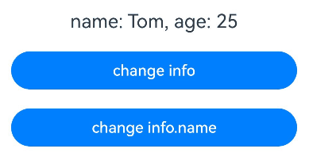

### Using \@Monitor in Classes Decorated by \@ObservedV2

When the properties listened by \@Monitor change, the callback is triggered.

- The object property listened to by \@Monitor should be decorated by \@Trace. Otherwise, the property cannot be listened to. \@Monitor can listen for multiple properties at the same time. These properties are separated by commas (,).

  <!-- @[monitor_decorator_multi_watch_observed_v2](https://gitcode.com/openharmony/applications_app_samples/blob/master/code/DocsSample/ArkUISample/ParadigmStateManagement/entry/src/main/ets/pages/monitor/MonitorDecoratorMultiWatchObservedV2.ets) --> 

  ``` TypeScript
  import { hilog } from '@kit.PerformanceAnalysisKit';
  
  @ObservedV2
  class Info {
    @Trace public name: string = 'Tom';
    @Trace public region: string = 'North';
    @Trace public job: string = 'Teacher';
    public age: number = 25;
  
    // name is decorated by @Trace. Can listen for the change.
    @Monitor('name')
    onNameChange(monitor: IMonitor) {
      hilog.info(0xFF00, 'testTag', '%{public}s',
        `name change from ${monitor.value()?.before} to ${monitor.value()?.now}`);
    }
  
    // age is not decorated by @Trace. Cannot listen for the change.
    @Monitor('age')
    onAgeChange(monitor: IMonitor) {
      hilog.info(0xFF00, 'testTag', '%{public}s',
        `age change from ${monitor.value()?.before} to ${monitor.value()?.now}`);
    }
  
    // region and job are decorated by @Trace. Can listen for the change.
    @Monitor('region', 'job')
    onChange(monitor: IMonitor) {
      monitor.dirty.forEach((path: string) => {
        hilog.info(0xFF00, 'testTag', '%{public}s',
          `${path} change from ${monitor.value(path)?.before} to ${monitor.value(path)?.now}`);
      })
    }
  }
  
  @Entry
  @ComponentV2
  struct Index {
    info: Info = new Info();
  
    build() {
      Column() {
        Button('change name')
          .width(300)
          .margin(10)
          .onClick(() => {
            this.info.name = 'Jack'; // Can trigger the onNameChange method.
          })
        Button('change age')
          .width(300)
          .margin(10)
          .onClick(() => {
            this.info.age = 26; // Cannot trigger the onAgeChange method.
          })
        Button('change region')
          .width(300)
          .margin(10)
          .onClick(() => {
            this.info.region = 'South'; // Can trigger the onChange method.
          })
        Button('change job')
          .width(300)
          .margin(10)
          .onClick(() => {
            this.info.job = 'Driver'; // Can trigger the onChange method.
          })
      }
      .width('100%')
    }
  }
  ```

  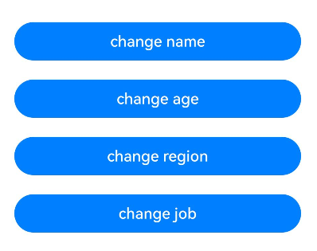

- \@Monitor can listen for the changes of lower-level properties which should be decorated by @Trace.

  <!-- @[monitor_decorator_object_trace_observed_v2](https://gitcode.com/openharmony/applications_app_samples/blob/master/code/DocsSample/ArkUISample/ParadigmStateManagement/entry/src/main/ets/pages/monitor/MonitorDecoratorObjectTraceObservedV2.ets) --> 

  ``` TypeScript
  import { hilog } from '@kit.PerformanceAnalysisKit';
  
  @ObservedV2
  class Inner {
    @Trace public num: number = 0;
  }
  
  @ObservedV2
  class Outer {
    public inner: Inner = new Inner();
  
    @Monitor('inner.num')
    onChange(monitor: IMonitor) {
      hilog.info(0xFF00, 'testTag', '%{public}s',
        `inner.num change from ${monitor.value()?.before} to ${monitor.value()?.now}`);
    }
  }
  
  @Entry
  @ComponentV2
  struct Index {
    outer: Outer = new Outer();
  
    build() {
      Column() {
        Button('change num')
          .width(300)
          .margin(10)
          .onClick(() => {
            this.outer.inner.num = 100; // Can trigger the onChange method.
          })
      }
      .width('100%')
    }
  }
  ```

  

- In the inheritance class scenario, you can listen for the same property for multiple times in the inheritance chain.

  <!-- @[monitor_decorator_inheritance_support_observed_v2](https://gitcode.com/openharmony/applications_app_samples/blob/master/code/DocsSample/ArkUISample/ParadigmStateManagement/entry/src/main/ets/pages/monitor/MonitorDecoratorInheritanceSupportObservedV2.ets) --> 

  ``` TypeScript
  import { hilog } from '@kit.PerformanceAnalysisKit';
  
  @ObservedV2
  class Base {
    @Trace public name: string;
  
    // Listen for the name property of the base class.
    @Monitor('name')
    onBaseNameChange(monitor: IMonitor) {
      hilog.info(0xFF00, 'testTag', '%{public}s', `Base Class name change`);
    }
  
    constructor(name: string) {
      this.name = name;
    }
  }
  
  @ObservedV2
  class Derived extends Base {
    // Listen for the name property of the inheritance class.
    @Monitor('name')
    onDerivedNameChange(monitor: IMonitor) {
      hilog.info(0xFF00, 'testTag', '%{public}s', `Derived Class name change`);
    }
  
    constructor(name: string) {
      super(name);
    }
  }
  
  @Entry
  @ComponentV2
  struct Index {
    derived: Derived = new Derived('AAA');
  
    build() {
      Column() {
        Button('change name')
          .width(300)
          .margin(10)
          .onClick(() => {
            this.derived.name = 'BBB'; // Can trigger the onBaseNameChange and onDerivedNameChange methods in sequence.
          })
      }
      .width('100%')
    }
  }
  ```

  

### General Listening Capability

\@Monitor also has some general listening capabilities.

- \@Monitor can listen for items in arrays, including multi-dimensional arrays and object arrays. However, it cannot listen for changes caused by calling APIs of built-in types (Array, Map, Date, and Set). When \@Monitor listens for the entire array, it can only observe reassignment of the whole array. You can detect insertions or deletions by listening for the length change of the array. Currently, only periods (.) can be used to listen for deep properties and array items.

  <!-- @[monitor_decorator_array_support](https://gitcode.com/openharmony/applications_app_samples/blob/master/code/DocsSample/ArkUISample/ParadigmStateManagement/entry/src/main/ets/pages/monitor/MonitorDecoratorArraySupport.ets) --> 

  ``` TypeScript
  import { hilog } from '@kit.PerformanceAnalysisKit';
  
  @ObservedV2
  class Info {
    @Trace public name: string;
    @Trace public age: number;
  
    constructor(name: string, age: number) {
      this.name = name;
      this.age = age;
    }
  }
  
  @ObservedV2
  class ArrMonitor {
    @Trace public dimensionTwo: number[][] = [[1, 1, 1], [2, 2, 2], [3, 3, 3]];
    @Trace public dimensionThree: number[][][] = [[[1], [2], [3]], [[4], [5], [6]], [[7], [8], [9]]];
    @Trace public infoArr: Info[] = [new Info('Jack', 24), new Info('Lucy', 18)];
  
    // dimensionTwo is a two-dimensional simple array and is decorated by @Trace. Can observe the element changes.
    @Monitor('dimensionTwo.0.0', 'dimensionTwo.1.1')
    onDimensionTwoChange(monitor: IMonitor) {
      monitor.dirty.forEach((path: string) => {
        hilog.info(0xFF00, 'testTag', '%{public}s',
          `dimensionTwo path: ${path} change from ${monitor.value(path)?.before} to ${monitor.value(path)?.now}`);
      })
    }
  
    // dimensionThree is a three-dimensional simple array and is decorated by @Trace. Can observe the element changes.
    @Monitor('dimensionThree.0.0.0', 'dimensionThree.1.1.0')
    onDimensionThreeChange(monitor: IMonitor) {
      monitor.dirty.forEach((path: string) => {
        hilog.info(0xFF00, 'testTag', '%{public}s',
          `dimensionThree path: ${path} change from ${monitor.value(path)?.before} to ${monitor.value(path)?.now}`);
      })
    }
  
    // name and age properties of the info class are decorated by @Trace. Can listen for the change.
    @Monitor('infoArr.0.name', 'infoArr.1.age')
    onInfoArrPropertyChange(monitor: IMonitor) {
      monitor.dirty.forEach((path: string) => {
        hilog.info(0xFF00, 'testTag', '%{public}s',
          `infoArr path:${path} change from ${monitor.value(path)?.before} to ${monitor.value(path)?.now}`);
      })
    }
  
    // infoArr is decorated by @Trace. Can listen for the value changes.
    @Monitor('infoArr')
    onInfoArrChange(monitor: IMonitor) {
      hilog.info(0xFF00, 'testTag', '%{public}s', `infoArr whole change`);
    }
  
    // Can listen for the length change of the infoArr.
    @Monitor('infoArr.length')
    onInfoArrLengthChange(monitor: IMonitor) {
      hilog.info(0xFF00, 'testTag', '%{public}s', `infoArr length change`);
    }
  }
  
  @Entry
  @ComponentV2
  struct Index {
    arrMonitor: ArrMonitor = new ArrMonitor();
  
    build() {
      Column() {
        Button('Change dimensionTwo')
          .width(300)
          .margin(10)
          .onClick(() => {
            // Can trigger the onDimensionTwoChange method.
            this.arrMonitor.dimensionTwo[0][0]++;
            this.arrMonitor.dimensionTwo[1][1]++;
          })
        Button('Change dimensionThree')
          .width(300)
          .margin(10)
          .onClick(() => {
            // Can trigger the onDimensionThreeChange method.
            this.arrMonitor.dimensionThree[0][0][0]++;
            this.arrMonitor.dimensionThree[1][1][0]++;
          })
        Button('Change info property')
          .width(300)
          .margin(10)
          .onClick(() => {
            // Can trigger the onInfoArrPropertyChange method.
            this.arrMonitor.infoArr[0].name = 'Tom';
            this.arrMonitor.infoArr[1].age = 19;
          })
        Button('Change whole infoArr')
          .width(300)
          .margin(10)
          .onClick(() => {
            // Can trigger the onInfoArrChange, onInfoArrPropertyChange, and onInfoArrLengthChange methods.
            this.arrMonitor.infoArr = [new Info('Cindy', 8)];
          })
        Button('Push new info to infoArr')
          .width(300)
          .margin(10)
          .onClick(() => {
            // Can trigger the onInfoArrPropertyChange and onInfoArrLengthChange methods.
            this.arrMonitor.infoArr.push(new Info('David', 50));
          })
      }
      .width('100%')
    }
  }
  ```

  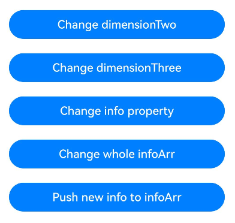

- When the entire object changes but the listened property remains unchanged, the \@Monitor callback is not triggered.

  The following code represents the behavior in the comment when you execute the instructions in the sequence of Step 1, Step 2 and Step 3.

  If you only execute the instruction of Step 2 or Step 3 to change the values of **name** or **age**, the **onNameChange** and **onAgeChange** methods are triggered.

  <!-- @[monitor_decorator_object_support](https://gitcode.com/openharmony/applications_app_samples/blob/master/code/DocsSample/ArkUISample/ParadigmStateManagement/entry/src/main/ets/pages/monitor/MonitorDecoratorObjectSupport.ets) --> 

  ``` TypeScript
  import { hilog } from '@kit.PerformanceAnalysisKit';
  
  @ObservedV2
  class Info {
    @Trace public person: Person;
  
    @Monitor('person.name')
    onNameChange(monitor: IMonitor) {
      hilog.info(0xFF00, 'testTag', '%{public}s',
        `name change from ${monitor.value()?.before} to ${monitor.value()?.now}`);
    }
  
    @Monitor('person.age')
    onAgeChange(monitor: IMonitor) {
      hilog.info(0xFF00, 'testTag', '%{public}s',
        `age change from ${monitor.value()?.before} to ${monitor.value()?.now}`);
    }
  
    constructor(name: string, age: number) {
      this.person = new Person(name, age);
    }
  }
  
  @ObservedV2
  class Person {
    @Trace public name: string;
    @Trace public age: number;
  
    constructor(name: string, age: number) {
      this.name = name;
      this.age = age;
    }
  }
  
  @Entry
  @ComponentV2
  struct Index {
    info: Info = new Info('Tom', 25);
  
    build() {
      Column() {
        Button('Step1: Only change name')
          .width(300)
          .margin(10)
          .onClick(() => {
            this.info.person = new Person('Jack', 25); // Can trigger the onNameChange method, but not the onAgeChange method.
          })
        Button('Step2: Only change age')
          .width(300)
          .margin(10)
          .onClick(() => {
            this.info.person = new Person('Jack', 18); // Can trigger the onAgeChange method, but not the onNameChange method.
          })
        Button('Step3: Change name and age')
          .width(300)
          .margin(10)
          .onClick(() => {
            this.info.person = new Person('Lucy', 19); // Can trigger the onNameChange and onAgeChange methods.
          })
      }
      .width('100%')
    }
  }
  ```

  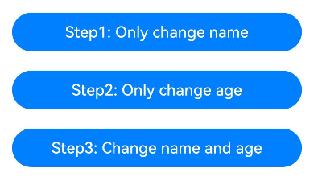

- If the property listened by \@Monitor is changed for multiple times in an event, the last change is used.

  <!-- @[monitor_decorator_last_write](https://gitcode.com/openharmony/applications_app_samples/blob/master/code/DocsSample/ArkUISample/ParadigmStateManagement/entry/src/main/ets/pages/monitor/MonitorDecoratorLastWrite.ets) --> 

  ``` TypeScript
  import { hilog } from '@kit.PerformanceAnalysisKit';
  
  @ObservedV2
  class Frequency {
    @Trace public count: number = 0;
  
    @Monitor('count')
    onCountChange(monitor: IMonitor) {
      hilog.info(0xFF00, 'testTag', '%{public}s',
        `count change from ${monitor.value()?.before} to ${monitor.value()?.now}`);
    }
  }
  
  @Entry
  @ComponentV2
  struct Index {
    frequency: Frequency = new Frequency();
  
    build() {
      Column() {
        Button('change count to 1000')
          .width(300)
          .margin(10)
          .onClick(() => {
            for (let i = 1; i <= 1000; i++) {
              this.frequency.count = i;
            }
          })
        Button('change count to 0 then to 1000')
          .width(300)
          .margin(10)
          .onClick(() => {
            for (let i = 999; i >= 0; i--) {
              this.frequency.count = i;
            }
            this.frequency.count = 1000; // Cannot trigger the onCountChange method at last.
          })
      }
      .width('100%')
    }
  }
  ```

  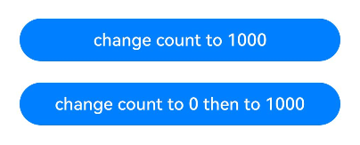

After you click **change count to 1000**, the **onCountChange** method is triggered and the **count change from 0 to 1000** log is output. After you click **change count to 0 then to 1000**, the **onCountChange** method is not triggered because the value of **count** property remains 1000 before and after the event.

## Listening for Paths with Wildcards

Since API version 26.0.0, \@Monitor supports the wildcard capability. When the configuration option MonitorDecoratorOptions is used, wildcard support is enabled by default. A wildcard can be used as a suffix in a path to listen for changes in the final determined value of that path. Such changes include, for example, changes to \@Trace properties and changes caused by API calls of built-in types (Array, Map, Set, Date).

The syntax rules for wildcard paths are as follows:

- A wildcard can only appear at the end of a path.

- A wildcard cannot appear at the beginning or in the middle of a path.

- A path can contain at most one wildcard.

Examples of valid wildcard paths:

| Path       | Description                                                         |
| ---------- | ------------------------------------------------------------ |
| obj.*      | obj is an object decorated by \@ObservedV2. The \@Monitor listening for this path is triggered in the following cases:<br>1. Overall assignment to obj.<br>2. Change of any \@Trace property of obj. |
| arr.*      | arr is an observable array. The \@Monitor listening for this path is triggered in the following cases:<br/>1. Overall assignment to arr.<br>2. Change of any element of arr or change of the array length.<br>3. Calling an array API (such as push, pop, sort, fill, copyWithin, etc.). |
| obj.objA.* | objA is a nested object decorated by \@ObservedV2. The \@Monitor listening for this path is triggered in the following cases:<br>1. Overall assignment to obj and objA changes.<br>2. Overall assignment to objA.<br>3. Change of any \@Trace property of objA. |
| arr.1.*    | arr is a nested observable array. The \@Monitor listening for this path is triggered in the following cases:<br/>1. Overall assignment to arr and the array at index 1 changes.<br>2. Change of any element of the array at index 1 of arr or change of the array length.<br>3. Calling an API of the array at index 1 of arr. |

When modifying any object in a nested object, the wildcard path that includes that object follows the final determined value principle, meaning that the listening callback is triggered only when the last determined value before the wildcard changes. For example, when listening for the path "obj.objA.*" in the table above, "objA" is the last determined value before the wildcard. If an overall assignment is made to "obj" and "objA" references the same object before and after the assignment, the callback is not triggered.

In addition, when using wildcards, the dirty array of IMonitor can properly contain the wildcard path, but the before and now values of the corresponding IMonitorValue are both undefined.

### Listening for Object Property Changes Using Wildcards

When using a wildcard to listen for an object, the \@Monitor callback is triggered when any \@Trace-decorated property of the object changes, or when the object itself is assigned a new value overall.

<!-- @[monitor_wildcard_support_object_property](https://gitcode.com/openharmony/applications_app_samples/blob/master/code/DocsSample/ArkUISample/ParadigmStateManagement/entry/src/main/ets/pages/monitor/MonitorWildcardSupportObjectProperty.ets) --> 

``` TypeScript
import { hilog } from '@kit.PerformanceAnalysisKit';

@ObservedV2
class ClassA {
  @Trace public propA: number = 8;
  @Trace public propB: number = 99;

  constructor(a: number, b: number) {
    this.propA = a;
    this.propB = b;
  }
}

@Entry
@ComponentV2
struct MonitorWildcardObject {
  @Local cls: ClassA = new ClassA(100, 100);

  // Enable wildcard
  @Monitor({}, 'cls.*')
  onClsChanged(m: IMonitor) {
    hilog.info(0xFF00, 'testTag', '%{public}s', `onClsChanged, dirty: ${m.dirty.toString()}`);
  }

  build() {
    Column() {
      Button(`Change propA: ${this.cls.propA}`)
        .width(300)
        .margin(10)
        .onClick(() => {
          this.cls.propA += 1; // Triggers onClsChanged
        })
      Button(`Change propB: ${this.cls.propB}`)
        .width(300)
        .margin(10)
        .onClick(() => {
          this.cls.propB += 1; // Triggers onClsChanged
        })
      Button('Assign new object')
        .width(300)
        .margin(10)
        .onClick(() => {
          this.cls = new ClassA(-200, -200); // Triggers onClsChanged
        })
    }
    .width('100%')
  }
}
```

  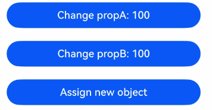

### Listening for Nested Object Property Changes Using Wildcards

The following is an example of observing nested object property changes.

<!-- @[monitor_wildcard_support_nested_object](https://gitcode.com/openharmony/applications_app_samples/blob/master/code/DocsSample/ArkUISample/ParadigmStateManagement/entry/src/main/ets/pages/monitor/MonitorWildcardSupportNestedObject.ets) --> 

``` TypeScript
import { hilog } from '@kit.PerformanceAnalysisKit';

@ObservedV2
class Person {
  @Trace public firstName: string = 'first';
  @Trace public lastName: string = 'last';
}

@ObservedV2
class Class1 {
  @Trace public person: Person = new Person();
}

@ObservedV2
class Class0 {
  @Trace public class1: Class1 = new Class1();
}

@Entry
@ComponentV2
struct MonitorWildcardNestedObject {
  @Local class0: Class0 | number = new Class0();

  // Enable wildcard to monitor nested objects
  @Monitor({}, 'class0.class1.person.*')
  onPersonChange(info: IMonitor) {
    hilog.info(0xFF00, 'testTag', '%{public}s', 'onPersonChange, dirty: ' + info.dirty.toString());
  }

  build() {
    Column({ space: 5 }) {
      Button('1. Class0 = new Class')
        .width(300)
        .margin(10)
        .onClick(() => {
          // The @Monitor callback is triggered
          // Reason: class0, class1, and person are changed to new objects
          this.class0 = new Class0();
        })
      Button('2. Class0 = new Class, keep Class1')
        .width(300)
        .margin(10)
        .onClick(() => {
          // When class0 is of type Class0, the @Monitor callback is not triggered
          // Reason: Even though class0 has changed, person, the last determined value before the wildcard in the path 'class0.class1.person.*', remains unchanged
          if (this.class0 instanceof Class0) {
            let newClass0 = new Class0();
            newClass0.class1.person = (this.class0 as Class0).class1.person;
            this.class0 = newClass0;
          }
        })
      Button('3. Class0.class1 = new Class1')
        .width(300)
        .margin(10)
        .onClick(() => {
          // When class0 is of type Class0, the @Monitor callback is triggered
          // Reason: class1 and person are changed to new objects
          if (this.class0 instanceof Class0) {
            (this.class0 as Class0).class1 = new Class1();
          }
        })
      Button('4. Class0.class1.person = new Person')
        .width(300)
        .margin(10)
        .onClick(() => {
          // When class0 is of type Class0, the @Monitor callback is triggered
          // Reason: person is changed to a new object
          if (this.class0 instanceof Class0) {
            (this.class0 as Class0).class1.person = new Person();
          }
        })
      Button('5. Class0....person.last update')
        .width(300)
        .margin(10)
        .onClick(() => {
          // When class0 is of type Class0, the @Monitor callback is triggered
          // Reason: A property of person has changed
          if (this.class0 instanceof Class0) {
            (this.class0 as Class0).class1.person.lastName += '+';
          }
        })
      Button('6. Class0 toggle number <=> new Class0')
        .width(300)
        .margin(10)
        .onClick(() => {
          // The @Monitor callback is triggered
          // Reason: person switches between accessible and inaccessible states
          this.class0 = (typeof this.class0 === 'object') ? 500 : new Class0();
        })
    }
  }
}
```

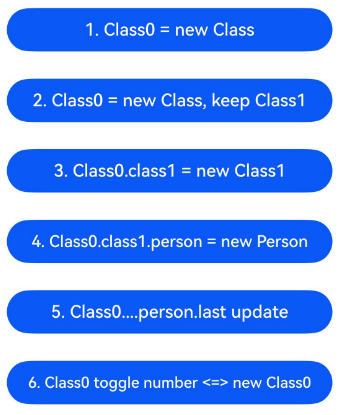

When a variable listened by \@Monitor with configuration options switches between accessible and inaccessible, the \@Monitor callback is triggered.

### Listening for Array Object Changes Using Wildcards

\@Monitor with configuration options can listen for API calls on arrays. When any array method is called, the \@Monitor callback is executed, even if the array is empty or the array content is not actually modified. The APIs include `push`, `pop`, `shift`, `splice`, `unshift`, `copyWithin`, `fill`, `reverse`, and `sort`.

<!-- @[monitor_wildcard_support_array](https://gitcode.com/openharmony/applications_app_samples/blob/master/code/DocsSample/ArkUISample/ParadigmStateManagement/entry/src/main/ets/pages/monitor/MonitorWildcardSupportArray.ets) --> 

``` TypeScript
import { hilog } from '@kit.PerformanceAnalysisKit';

@ObservedV2
class Person {
  @Trace public firstName: string = 'first';
  @Trace public lastName: string = 'last';

  constructor(first: string = 'no first', last: string = 'no last') {
    this.firstName = first;
    this.lastName = last;
  }
}

@ObservedV2
class ArrayOfPerson extends Array<Person> {
}

@ObservedV2
class TopArray extends Array<ArrayOfPerson> {
}

@Entry
@ComponentV2
struct MonitorWildcardArray {
  @Local topArray: TopArray = this.makeNewTopArray();

  // Enable wildcard
  @Monitor({}, 'topArray.1.*')
  topArrayMonitor1Star(monitor: IMonitor) {
    hilog.info(0xFF00, 'testTag', '%{public}s', `TopArray[1]: ${monitor.dirty.toString()}`);
  }

  // Enable wildcard
  @Monitor({}, 'topArray.*')
  topArrayMonitorStar(monitor: IMonitor) {
    hilog.info(0xFF00, 'testTag', '%{public}s', `TopArray: ${monitor.dirty.toString()}`);
  }

  makeNewTopArray(): TopArray {
    // Initialize the array
    return new TopArray(
      new ArrayOfPerson(new Person('Adrian'), new Person('Andrew'), new Person('Aaliyah'), new Person('Amir'),
        new Person('Angel')),
      new ArrayOfPerson(new Person('Carter'), new Person('Charlie'), new Person('Cooper'), new Person('Cole'),
        new Person('Callie')),
      new ArrayOfPerson(new Person('Daniel'), new Person('Daisy'), new Person('Dawson'), new Person('Dana'),
        new Person('Dalton'))
    );
  }

  build() {
    Column() {
      // Both topArrayMonitor1Star and topArrayMonitorStar callbacks are triggered
      Button('topArray = new TopArray')
        .width(300)
        .margin(10)
        .onClick(() => {
          this.topArray = this.makeNewTopArray();
        })

      // When topArray[1][0] exists, the topArrayMonitor1Star callback is triggered, and the topArrayMonitorStar callback is not triggered
      Button('topArray[1][0] = new Person')
        .width(300)
        .margin(10)
        .onClick(() => {
          if (this.topArray.length > 1 && this.topArray[1].length > 0) {
            this.topArray[1][0] = new Person();
          }
        })

      // When topArray[0][1] exists, neither topArrayMonitor1Star nor topArrayMonitorStar callback is triggered
      Button('topArray[0][1] = new Person')
        .width(300)
        .margin(10)
        .onClick(() => {
          if (this.topArray.length > 0 && this.topArray[0].length > 1) {
            this.topArray[0][1] = new Person();
          }
        })

      // When topArray[1] exists, the topArrayMonitor1Star callback is triggered, and the topArrayMonitorStar callback is not triggered
      Button('topArray[1].push')
        .width(300)
        .margin(10)
        .onClick(() => {
          if (this.topArray.length > 1 && this.topArray[1] instanceof ArrayOfPerson) {
            this.topArray[1].push(new Person());
          }
        })

      // When the length of topArray is greater than 2, both topArrayMonitor1Star and topArrayMonitorStar callbacks are triggered
      Button('topArray.shift (length>2)')
        .width(300)
        .margin(10)
        .onClick(() => {
          if (this.topArray.length > 2) {
            this.topArray.shift();
          }
        })

      // When topArray[0] exists, the topArrayMonitor1Star callback is not triggered, and the topArrayMonitorStar callback is triggered
      Button('topArray[0] = new ArrayOfPerson')
        .width(300)
        .margin(10)
        .onClick(() => {
          if (this.topArray.length > 0) {
            this.topArray[0] = new ArrayOfPerson(new Person(), new Person());
          }
        })

      // When topArray[1][0] exists, neither topArrayMonitor1Star nor topArrayMonitorStar callback is triggered
      Button('topArray[1][0].last update')
        .width(300)
        .margin(10)
        .onClick(() => {
          if (this.topArray.length > 1 && this.topArray[1].length > 0 && this.topArray[1][0] instanceof Person) {
            this.topArray[1][0].lastName += '~';
          }
        })

      // The topArrayMonitor1Star callback is not triggered, and the topArrayMonitorStar callback is triggered
      Button('topArray = new TopArray, keep [1]')
        .width(300)
        .margin(10)
        .onClick(() => {
          let newTop = this.makeNewTopArray();
          newTop[1] = this.topArray[1]; // topArray.1 is unchanged, and the last determined value before the wildcard in the path 'topArray.1.*' remains unchanged
          this.topArray = newTop;
        })

      // The topArrayMonitor1Star callback is not triggered, and the topArrayMonitorStar callback is triggered
      Button('topArray.push')
        .width(300)
        .margin(10)
        .onClick(() => {
          this.topArray.push(new ArrayOfPerson(new Person(), new Person()));
        })
    }
    .width('100%')
  }
}
```

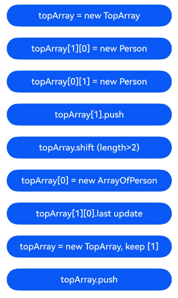

### Listening for Date Object Changes Using Wildcards

Using wildcards, you can listen for API calls on Date objects.

```ts
@Monitor({}, 'dateInstance.*')
onDateChange(m: IMonitor) {
}
```

\@Monitor triggers the callback in the following cases:

- `dateInstance` is assigned a new value.

- Any Date API is called, including `setFullYear`, `setMonth`, `setDate`, `setHours`, `setMinutes`, `setSeconds`, `setMilliseconds`, `setTime`, `setUTCFullYear`, `setUTCMonth`, `setUTCDate`, `setUTCHours`, `setUTCMinutes`, `setUTCSeconds`, and `setUTCMilliseconds`. The \@Monitor callback is triggered even if these APIs do not actually change the Date value.

The following is an example of listening for a Date object using wildcards.

<!-- @[monitor_wildcard_support_date](https://gitcode.com/openharmony/applications_app_samples/blob/master/code/DocsSample/ArkUISample/ParadigmStateManagement/entry/src/main/ets/pages/monitor/MonitorWildcardSupportDate.ets) --> 

``` TypeScript
import { hilog } from '@kit.PerformanceAnalysisKit';

@Entry
@ComponentV2
struct MonitorWildcardDate {
  @Local date: Date = new Date();

  // Enable wildcard
  @Monitor({}, 'date.*')
  onDateChanged(m: IMonitor) {
    hilog.info(0xFF00, 'testTag', '%{public}s', `onDateChanged, dirty: ${m.dirty.toString()}`);
  }

  build() {
    Column({ space: 5 }) {
      // API call triggers onDateChanged
      Button(`date.setMilliseconds(1000)`)
        .width(300)
        .margin(10)
        .onClick(() => {
          this.date.setMilliseconds(1000);
        })
      // API call triggers onDateChanged
      Button(`date.setTime(1000)`)
        .width(300)
        .margin(10)
        .onClick(() => {
          this.date.setTime(1000000);
        })
      // API call triggers onDateChanged
      Button(`Assign new Date`)
        .width(300)
        .margin(10)
        .onClick(() => {
          this.date = new Date();
        })
      // Assigning the same value overall does not trigger onDateChanged
      Button(`Re-assign the same Date`)
        .width(300)
        .margin(10)
        .onClick(() => {
          let sameDate = this.date;
          this.date = sameDate;
        })
    }
  }
}
```

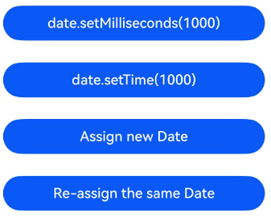

### Listening for Map Object Changes Using Wildcards

Using wildcards, you can listen for API calls on Map objects.

```ts
@Monitor({}, 'mapInstance.*')
onMapChange(m: IMonitor) {
}
```

\@Monitor triggers the callback in the following cases:

- `mapInstance` is assigned a new value.

- A Map API is called, such as `set`, `delete`, or `clear`. Unlike Array and Date, the callback is triggered only when a change actually occurs. This means that calling `clear` on an empty Map, calling `delete` on a non-existent Map key, and calling `set` without actually changing the value do not trigger the \@Monitor callback.

Unlike Array, \@Monitor cannot listen for a specific key of a Map.

The following is an example of listening for a Map object using wildcards.

<!-- @[monitor_wildcard_support_map](https://gitcode.com/openharmony/applications_app_samples/blob/master/code/DocsSample/ArkUISample/ParadigmStateManagement/entry/src/main/ets/pages/monitor/MonitorWildcardSupportMap.ets) --> 

``` TypeScript
import { hilog } from '@kit.PerformanceAnalysisKit';

@Entry
@ComponentV2
struct MonitorWildcardMap {
  @Local map: Map<string, string> = new Map<string, string>();
  cnt: number = 0;

  @Monitor({ enableWildcard: false }, 'map.size')
  onMapSizeChanged(m: IMonitor) {
    hilog.info(0xFF00, 'testTag', '%{public}s', `onMapSizeChanged, size dirty: ${m.dirty.toString()}`);
  }

  // Enable wildcard
  @Monitor({}, 'map.*')
  onMapChanged(m: IMonitor) {
    hilog.info(0xFF00, 'testTag', '%{public}s', `onMapChanged, dirty: ${m.dirty.toString()}`);
  }

  build() {
    Column({ space: 5 }) {
      Text(`map.size: ${this.map.size}`)
        .fontSize(20)
        .margin(10)
      Text(`map.get('one'): ${this.map.get('one')}`)
        .fontSize(20)
        .margin(10)
      // On the first tap, both onMapSizeChanged and onMapChanged callbacks are triggered
      Button(`Init, map.set('one', 'A'), map.set('two', 'B')`)
        .width(300)
        .margin(10)
        .onClick(() => {
          this.map.set('one', 'A');
          this.map.set('two', 'B');
        })
      // Both onMapSizeChanged and onMapChanged callbacks are triggered
      Button(`Add new, map.set('three' + this.cnt, 'C')`)
        .width(300)
        .margin(10)
        .onClick(() => {
          this.cnt++;
          this.map.set('three' + this.cnt, 'C')
        })
      // When 'one' does not exist, neither onMapSizeChanged nor onMapChanged callback is triggered
      // When 'one' exists, both onMapSizeChanged and onMapChanged callbacks are triggered
      Button(`Delete from map: map.delete('one')`)
        .width(300)
        .margin(10)
        .onClick(() => {
          this.map.delete('one')
        })
      // When map is not empty, both onMapSizeChanged and onMapChanged callbacks are triggered
      // When map is empty, neither onMapSizeChanged nor onMapChanged callback is triggered
      Button(`Clear map`)
        .width(300)
        .margin(10)
        .onClick(() => {
          this.map.clear();
        })
      // On the first tap, assuming ('one' -> 'A') exists, only the onMapChanged callback is triggered
      // If ('one' -> 'TWO') has already been set, neither onMapSizeChanged nor onMapChanged callback is triggered
      Button(`Update one to 'TWO' - map.set('one', 'TWO')`)
        .width(300)
        .margin(10)
        .onClick(() => {
          this.map.set('one', 'TWO');
        })
      // When 'one' does not exist in the Map, both onMapSizeChanged and onMapChanged callbacks are triggered
      // When 'one' exists in the Map, neither onMapSizeChanged nor onMapChanged callback is triggered
      Button(`Update one to the same - map.set('one', sameval)`)
        .width(300)
        .margin(10)
        .onClick(() => {
          const sameval = this.map.get('one') ?? 'one';
          this.map.set('one', sameval);
        })
      // When 'one' does not exist in the Map, both onMapSizeChanged and onMapChanged callbacks are triggered
      // When 'one' exists in the Map, only the onMapChanged callback is triggered
      Button(`Update one to new value - map.set('one', newval)`)
        .width(300)
        .margin(10)
        .onClick(() => {
          let newval = 'x' + (++this.cnt);
          this.map.set('one', newval);
        })
      // When map is empty, only the onMapChanged callback is triggered
      // When map is not empty, both onMapChanged and onMapSizeChanged callbacks are triggered
      Button(`new map`)
        .width(300)
        .margin(10)
        .onClick(() => {
          this.map = new Map();
        })
    }
  }
}
```


### Listening for Set Object Changes Using Wildcards

Using wildcards, you can listen for API calls on Set objects.

```ts
@Monitor({}, 'setInstance.*')
onSetChange(m: IMonitor) {
}
```

\@Monitor triggers the callback in the following cases:

- `setInstance` is assigned a new value.

- A Set API is called, such as `add`, `delete`, or `clear`. Unlike Array and Date, the callback is triggered only when a change actually occurs. This means that calling `clear` on an empty Set, calling `delete` on a non-existent Set element, and calling `add` without actually adding a new element do not trigger the \@Monitor callback.

Unlike Array, \@Monitor cannot listen for a specific element of a Set.

The following is an example of listening for a Set object using wildcards.

<!-- @[monitor_wildcard_support_set](https://gitcode.com/openharmony/applications_app_samples/blob/master/code/DocsSample/ArkUISample/ParadigmStateManagement/entry/src/main/ets/pages/monitor/MonitorWildcardSupportSet.ets) --> 

``` TypeScript
import { hilog } from '@kit.PerformanceAnalysisKit';

@Entry
@ComponentV2
struct MonitorWildcardSet {
  @Local set: Set<string> = new Set<string>();
  cnt: number = 0;

  // Enable wildcard
  @Monitor({}, 'set.*')
  onSetChanged(m: IMonitor) {
    hilog.info(0xFF00, 'testTag', '%{public}s', `onSetChanged, dirty: ${m.dirty.toString()}`);
  }

  @Monitor({ enableWildcard: false }, 'set.size')
  onSetSizeChanged(m: IMonitor) {
    hilog.info(0xFF00, 'testTag', '%{public}s', `onSetSizeChanged, size dirty: ${m.dirty.toString()}`);
  }

  aboutToAppear(): void {
    this.set.add('one');
    this.set.add('two');
  }

  build() {
    Column({ space: 5 }) {
      // Both onSetChanged and onSetSizeChanged callbacks are triggered
      Button(`Add three<Num> to the set`)
        .width(300)
        .margin(10)
        .onClick(() => {
          this.cnt++;
          this.set.add('three' + this.cnt);
        })
      // When the element does not exist, neither onSetChanged nor onSetSizeChanged callback is triggered
      // When the element exists, both onSetChanged and onSetSizeChanged callbacks are triggered
      Button(`Delete 'three<Num>' from the set - set.delete(...)`)
        .width(300)
        .margin(10)
        .onClick(() => {
          this.set.delete('three' + this.cnt);
        })
      // When set is not empty, both onSetChanged and onSetSizeChanged callbacks are triggered
      // When set is empty, neither onSetChanged nor onSetSizeChanged callback is triggered
      Button(`Clear the set - set.clear()`)
        .width(300)
        .margin(10)
        .onClick(() => {
          this.set.clear();
        })
      // When set is not empty, both onSetChanged and onSetSizeChanged callbacks are triggered
      // When set is empty, only the onSetChanged callback is triggered
      Button(`Assign new set`)
        .width(300)
        .margin(10)
        .onClick(() => {
          this.set = new Set();
        })
      // When set does not contain 'one', both onSetChanged and onSetSizeChanged callbacks are triggered
      // When set contains 'one', neither onSetChanged nor onSetSizeChanged callback is triggered
      Button(`Add 'one' to the set`)
        .width(300)
        .margin(10)
        .onClick(() => {
          this.set.add('one');
        })
    }
  }
}
```

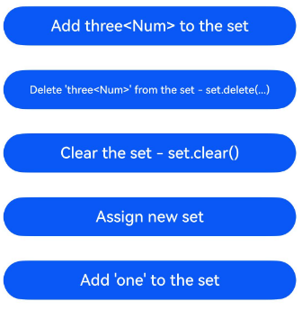

## Constraints

Pay attention to the following constraints when using \@Monitor:

- Do not listen for the same property for multiple times in a class. When a property in a class is listened for multiple times, only the last listening method takes effect.

  <!-- @[monitor_limitation_last_listener_wins](https://gitcode.com/openharmony/applications_app_samples/blob/master/code/DocsSample/ArkUISample/ParadigmStateManagement/entry/src/main/ets/pages/monitor/MonitorLimitationLastListenerWins.ets) --> 

  ``` TypeScript
  import { hilog } from '@kit.PerformanceAnalysisKit';
  
  @ObservedV2
  class Info {
    @Trace public name: string = 'Tom';
  
    @Monitor('name')
    onNameChange(monitor: IMonitor) {
      hilog.info(0xFF00, 'testTag', '%{public}s', `onNameChange`);
    }
  
    @Monitor('name')
    onNameChangeDuplicate(monitor: IMonitor) {
      hilog.info(0xFF00, 'testTag', '%{public}s', `onNameChangeDuplicate`);
    }
  }
  
  @Entry
  @ComponentV2
  struct Index {
    info: Info = new Info();
  
    build() {
      Column() {
        Button('change name')
          .width(300)
          .margin(10)
          .onClick(() => {
            this.info.name = 'Jack'; // Only the onNameChangeDuplicate method is triggered.
          })
      }
      .width('100%')
    }
  }
  ```

  

- When @Monitor receives multiple path parameters, the system determines duplicate observation based on the full combination result of the parameters. Spaces are added between parameters during full combination to distinguish them. For example, the full combination of 'ab' and 'c' is 'ab c', while 'a' and 'bc' becomes 'a bc'. These results are not equal. In the following example, Monitor 1, Monitor 2, and Monitor 3 all observe the name attribute. The input parameters of Monitor 2 and Monitor 3 are the same (name position), so only Monitor 3 takes effect. When name changes, both onNameAgeChange and onNamePositionChangeDuplicate are triggered simultaneously. However, note that Monitor 2 and Monitor 3 implementations are still considered multiple @Monitor observations of the same attribute in the same class, which is not recommended.

  <!-- @[monitor_limitation_multiple_path_params](https://gitcode.com/openharmony/applications_app_samples/blob/master/code/DocsSample/ArkUISample/ParadigmStateManagement/entry/src/main/ets/pages/monitor/MonitorLimitationMultiplePathParams.ets) --> 

  ``` TypeScript
  import { hilog } from '@kit.PerformanceAnalysisKit';
  
  @ObservedV2
  class Info {
    @Trace public name: string = 'Tom';
    @Trace public age: number = 25;
    @Trace public position: string = 'North';
  
    @Monitor('name', 'age') // Monitor 1
    onNameAgeChange(monitor: IMonitor) {
      monitor.dirty.forEach((path: string) => {
        hilog.info(0xFF00, 'testTag', '%{public}s',
          `onNameAgeChange path: ${path} change from ${monitor.value(path)?.before} to ${monitor.value(path)?.now}`);
      });
    }
  
    @Monitor('name', 'position') // Monitor 2
    onNamePositionChange(monitor: IMonitor) {
      monitor.dirty.forEach((path: string) => {
        hilog.info(0xFF00, 'testTag', '%{public}s',
          `onNamePositionChange path: ${path} change from ${monitor.value(path)?.before} to ${monitor.value(path)?.now}`);
      });
    }
  
    // name and position are observed repeatedly. Only the last definition takes effect
    @Monitor('name', 'position') // Monitor3
    onNamePositionChangeDuplicate(monitor: IMonitor) {
      monitor.dirty.forEach((path: string) => {
        hilog.info(0xFF00, 'testTag', '%{public}s',
          `onNamePositionChangeDuplicate path: ${path} change from ${monitor.value(path)?.before} to ${monitor.value(path)?.now}`);
      });
    }
  }
  
  @Entry
  @ComponentV2
  struct Index {
    info: Info = new Info();
  
    build() {
      Column() {
        Button('change name')
          .width(300)
          .margin(10)
          .onClick(() => {
            this.info.name = 'Jack'; // Triggers both onNameAgeChange and onNamePositionChangeDuplicate
          })
      }
      .width('100%')
    }
  }
  ```

  

- The \@Monitor parameter must be a string that listens for the property name. Only string literals, **const** constants, and **enum** enumerated values can be used as parameters. If a variable is used as a parameter, only the property corresponding to the variable value during \@Monitor initialization is listened. When a variable is changed, \@Monitor cannot change the listened property in real time. That is, the target property listened by \@Monitor is determined during initialization and cannot be dynamically changed. It is not recommended to use variables as @Monitor parameters for initialization.

  <!-- @[monitor_limitation_parameter_string_constraint](https://gitcode.com/openharmony/applications_app_samples/blob/master/code/DocsSample/ArkUISample/ParadigmStateManagement/entry/src/main/ets/pages/monitor/MonitorLimitationParameterStringConstraint.ets) --> 

  ``` TypeScript
  import { hilog } from '@kit.PerformanceAnalysisKit';
  
  const t2: string = 't2'; // Constant
  
  enum ENUM {
    T3 = 't3' // Enum
  };
  let t4: string = 't4'; // Variable
  
  @ObservedV2
  class Info {
    @Trace public t1: number = 0;
    @Trace public t2: number = 0;
    @Trace public t3: number = 0;
    @Trace public t4: number = 0;
    @Trace public t5: number = 0;
  
    // String literal
    @Monitor('t1')
    onT1Change(monitor: IMonitor) {
      hilog.info(0xFF00, 'testTag', '%{public}s', `t1 change from ${monitor.value()?.before} to ${monitor.value()?.now}`);
    }
  
    @Monitor(t2)
    onT2Change(monitor: IMonitor) {
      hilog.info(0xFF00, 'testTag', '%{public}s', `t2 change from ${monitor.value()?.before} to ${monitor.value()?.now}`);
    }
  
    @Monitor(ENUM.T3)
    onT3Change(monitor: IMonitor) {
      hilog.info(0xFF00, 'testTag', '%{public}s', `t3 change from ${monitor.value()?.before} to ${monitor.value()?.now}`);
    }
  
    @Monitor(t4)
    onT4Change(monitor: IMonitor) {
      hilog.info(0xFF00, 'testTag', '%{public}s', `t4 change from ${monitor.value()?.before} to ${monitor.value()?.now}`);
    }
  }
  
  @Entry
  @ComponentV2
  struct Index {
    info: Info = new Info();
  
    build() {
      Column() {
        Button('Change t1')
          .width(300)
          .margin(10)
          .onClick(() => {
            this.info.t1++; // Can trigger the onT1Change method.
          })
        Button('Change t2')
          .width(300)
          .margin(10)
          .onClick(() => {
            this.info.t2++; // Can trigger the onT2Change method.
          })
        Button('Change t3')
          .width(300)
          .margin(10)
          .onClick(() => {
            this.info.t3++; // Can trigger the onT3Change method.
          })
        Button('Change t4')
          .width(300)
          .margin(10)
          .onClick(() => {
            this.info.t4++; // Can trigger the onT4Change method.
          })
        Button('Change var t4 to t5')
          .width(300)
          .margin(10)
          .onClick(() => {
            t4 = 't5'; // Change the variable value to "t5".
          })
        Button('Change t5')
          .width(300)
          .margin(10)
          .onClick(() => {
            this.info.t5++; // The onT4Change still listens for t4. Cannot trigger the method.
          })
        Button('Change t4 again')
          .width(300)
          .margin(10)
          .onClick(() => {
            this.info.t4++; // Can trigger the onT4Change method.
          })
      }
      .width('100%')
    }
  }
  ```

  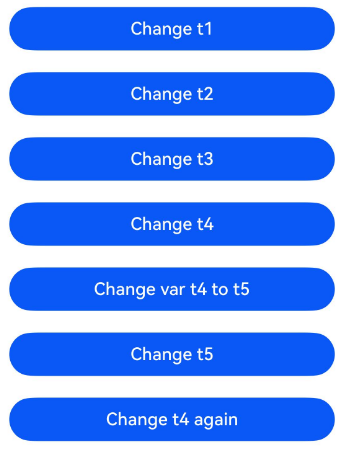

- Changing the listened property in \@Monitor again will cause infinite loops, which is not recommended.

  ```ts
  @ObservedV2
  class Info {
    @Trace count: number = 0;
    @Monitor('count')
    onCountChange(monitor: IMonitor) {
      this.count++; // Avoid using this method because it may cause infinite loops.
    }
  }
  ```

## Comparing \@Monitor with \@Watch

The following table compares the usage and functions of \@Monitor and \@Watch.

| Usage              | \@Watch                                   | \@Monitor                                                    |
| ------------------ | ----------------------------------------- | ------------------------------------------------------------ |
| Parameter              | Callback method name.                             | Listened state variable name and property name.                                    |
| Number of listened targets        | A single state variable.                   | Multiple state variables.                                    |
| Listening capability          | Listen for the top-level state variables.           | Listen for the lower-level state variables.                              |
| Obtain the value before change| No.                     | Yes.                                          |
| Listening Condition          | The listened object is a state variable.                     | The listened object is a state variable or a class member property decorated by \@Trace.             |
| Constraints          | Used only in \@Component decorated custom components.| Used in \@ComponentV2 decorated custom components and \@ObservedV2 decorated classes.|

## When to Use

### Listening for Lower-level Property Changes

\@Monitor can listen for the lower-level property changes and classify them based on the values before and after the changes.

In the following example, the change of property **value** is listened to and the display style of the **Text** component is changed based on the change amplitude.

<!-- @[monitor_scene_deep_attribute_changes](https://gitcode.com/openharmony/applications_app_samples/blob/master/code/DocsSample/ArkUISample/ParadigmStateManagement/entry/src/main/ets/pages/monitor/MonitorSceneDeepAttributeChanges.ets) -->  

``` TypeScript
@ObservedV2
class Info {
  @Trace public value: number = 50;
}

@ObservedV2
class UIStyle {
  public info: Info = new Info();
  @Trace public color: Color = Color.Black;
  @Trace public fontSize: number = 45;

  @Monitor('info.value')
  onValueChange(monitor: IMonitor) {
    let lastValue: number = monitor.value()?.before as number;
    let curValue: number = monitor.value()?.now as number;
    if (lastValue != 0) {
      let diffPercent: number = (curValue - lastValue) / lastValue;
      // Change the display style of the Text component based on the magnitude of the info.value change.
      if (diffPercent > 0.1) {
        this.color = Color.Red;
        this.fontSize = 50;
      } else if (diffPercent < -0.1) {
        this.color = Color.Green;
        this.fontSize = 40;
      } else {
        this.color = Color.Black;
        this.fontSize = 45;
      }
    }
  }
}

@Entry
@ComponentV2
struct Index {
  textStyle: UIStyle = new UIStyle();

  build() {
    Column() {
      Text(`Important Value: ${this.textStyle.info.value}`)
        .fontColor(this.textStyle.color)
        .fontSize(this.textStyle.fontSize)
        .margin(10)
      Button('change!')
        .width(300)
        .margin(10)
        .onClick(() => {
          this.textStyle.info.value = Math.floor(Math.random() * 100) + 1;
        })
    }
    .width('100%')
  }
}
```

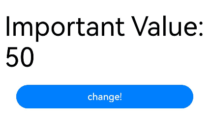

## Common Issue

### Effective and Expiration Time of Variable Listening by the \@Monitor in the Custom Component

When \@Monitor is defined in a custom component decorated by \@ComponentV2, \@Monitor takes effect after the state variable is initialized and becomes invalid when the component is destroyed.

<!-- @[monitor_problem_effect_time_comp_v2](https://gitcode.com/openharmony/applications_app_samples/blob/master/code/DocsSample/ArkUISample/ParadigmStateManagement/entry/src/main/ets/pages/monitor/MonitorProblemEffectTimeCompV2.ets) -->  

``` TypeScript
import { hilog } from '@kit.PerformanceAnalysisKit';

@ObservedV2
class Info {
  @Trace public message: string = 'not initialized';

  constructor() {
    hilog.info(0xFF00, 'testTag', '%{public}s', 'in constructor message change to initialized');
    // At this point, @Monitor has not been initialized yet, so changes to `message` will not be monitored.
    this.message = 'initialized';
  }
}

@ComponentV2
struct Child {
  @Param info: Info = new Info();

  @Monitor('info.message')
  onMessageChange(monitor: IMonitor) {
    hilog.info(0xFF00, 'testTag', '%{public}s',
      `Child message change from ${monitor.value()?.before} to ${monitor.value()?.now}`);
  }

  aboutToAppear(): void {
    this.info.message = 'Child aboutToAppear';
  }

  aboutToDisappear(): void {
    hilog.info(0xFF00, 'testTag', '%{public}s', 'Child aboutToDisappear');
    this.info.message = 'Child aboutToDisappear';
  }

  build() {
    Column() {
      Text('Child')
        .fontSize(20)
        .margin(10)
      Button('change message in Child')
        .width(300)
        .margin(10)
        .onClick(() => {
          this.info.message = 'Child click to change Message';
        })
    }
    .width('95%')
    .borderColor(Color.Red)
    .borderWidth(2)

  }
}

@Entry
@ComponentV2
struct Index {
  @Local info: Info = new Info();
  @Local flag: boolean = false;

  @Monitor('info.message')
  onMessageChange(monitor: IMonitor) {
    hilog.info(0xFF00, 'testTag', '%{public}s',
      `Index message change from ${monitor.value()?.before} to ${monitor.value()?.now}`);
  }

  build() {
    Column() {
      Button('show/hide Child')
        .width(300)
        .margin(10)
        .onClick(() => {
          this.flag = !this.flag
        })
      Button('change message in Index')
        .width(300)
        .margin(10)
        .onClick(() => {
          this.info.message = 'Index click to change Message';
        })
      if (this.flag) {
        Child({ info: this.info })
      }
    }
  }
}
```

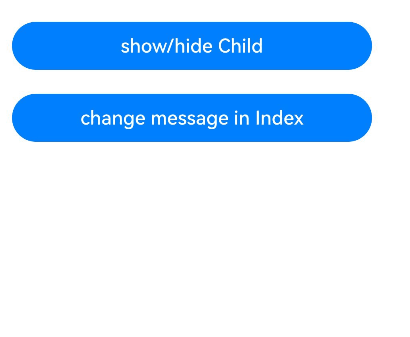

In the preceding example, you can create and destroy a **Child** component to observe the effective and expiration time of the \@Monitor defined in the custom component. You are advised to follow the steps below:

- When the **Index** component creates an instance of the **Info** class, the log outputs the message: **in constructor message change to initialized**. At this time, the \@Monitor of the **Index** component has not been initialized successfully, so \@Monitor cannot listen for the message change.

- After the **Index** component is created and the page is loaded, click **change message in Index** button. \@Monitor now can listen for the change and the log outputs the message "Index message change from initialized to Index click to change Message".

- Click the **show/hide Child** button to create a **Child** component. After this component initializes the \@Param decorated variables and \@Monitor, call the **aboutToAppear** callback of the **Child** component to change the message. In this case, the \@Monitor of the **Index** and **Child** components can listen for the change, and the logs outputs the messages "Index message change from Index click to change Message to Child aboutToAppear" and "Child message change from Index click to change Message to Child aboutToAppear."

- Click **change message in Child** button to change the message. In this case, the \@Monitor of the **Index** and **Child** components can listen for the change, and the log outputs the messages "Index message change from Child aboutToAppear to Child click to change Message" and "Child message change from Child aboutToAppear to Child click to change Message."

- Click the **show/hide Child** button to destroy the **Child** component and call the **aboutToDisappear** callback to change the message. In this case, the \@Monitor of the **Index** and **Child** components can listen for the change, and the log outputs the messages "Child aboutToDisappear, Index message change from Child click to change Message to Child aboutToDisappear", and "Child message change from Child click to change Message to Child aboutToDisappear."

- Click **change message in Index** button to change the message. In this case, the **Child** component is destroyed, and the \@Monitor is deregistered. Only the \@Monitor of the **Index** component can listen for the changes and the log outputs the message "Index message change from Child aboutToDisappear to Index click to change Message."

The preceding steps indicate that the \@Monitor defined in the **Child** component takes effect when the **Child** component is created and initialized, and becomes invalid when the **Child** component is destroyed.

### Effective and Expiration Time of Variable Listening by the \@Monitor in the Class

When \@Monitor is defined in class decorated with \@ObservedV2, it takes effect after the class instance is created and becomes invalid when the class instance is destroyed.

<!-- @[monitor_problem_effect_time_class](https://gitcode.com/openharmony/applications_app_samples/blob/master/code/DocsSample/ArkUISample/ParadigmStateManagement/entry/src/main/ets/pages/monitor/MonitorProblemEffectTimeClass.ets) -->  

``` TypeScript
import { hilog } from '@kit.PerformanceAnalysisKit';

@ObservedV2
class Info {
  @Trace public message: string = 'not initialized';

  constructor() {
    // At this point, @Monitor has not taken effect yet, so changes to message will not be monitored.
    this.message = 'initialized';
  }

  @Monitor('message')
  onMessageChange(monitor: IMonitor) {
    hilog.info(0xFF00, 'testTag', '%{public}s',
      `message change from ${monitor.value()?.before} to ${monitor.value()?.now}`);
  }
}

@Entry
@ComponentV2
struct Index {
  info: Info = new Info();

  aboutToAppear(): void {
    this.info.message = 'Index aboutToAppear';
  }

  build() {
    Column() {
      Button('change message')
        .width(300)
        .margin(10)
        .onClick(() => {
          this.info.message = 'Index click to change message';
        })
    }
  }
}
```


In the preceding example, \@Monitor takes effect after the **info** class is created, which is later than the **constructor** of the class and earlier than the **aboutToAppear** of the custom component. After the page is loaded, click **change message** button to modify the message variable. The log outputs the messages as below:

```ts
message change from initialized to Index aboutToAppear
message change from Index aboutToAppear to Index click to change message
```

\@Monitor defined in a class becomes invalid when the class is destroyed. However, the garbage collection mechanism determines whether a class is actually destroyed and released. Even if the custom component is destroyed, the class is not destroyed accordingly. As a result, the \@Monitor defined in the class still listens for changes.

<!-- @[monitor_problem_class_delayed](https://gitcode.com/openharmony/applications_app_samples/blob/master/code/DocsSample/ArkUISample/ParadigmStateManagement/entry/src/main/ets/pages/monitor/MonitorProblemClassDelayed.ets) -->   

``` TypeScript
import { hilog } from '@kit.PerformanceAnalysisKit';

@ObservedV2
class InfoWrapper {
  public info?: Info;

  constructor(info: Info) {
    this.info = info;
  }

  @Monitor('info.age')
  onInfoAgeChange(monitor: IMonitor) {
    hilog.info(0xFF00, 'testTag', '%{public}s',
      `age change from ${monitor.value()?.before} to ${monitor.value()?.now}`);
  }
}

@ObservedV2
class Info {
  @Trace public age: number;

  constructor(age: number) {
    this.age = age;
  }
}

@ComponentV2
struct Child {
  @Param @Require infoWrapper: InfoWrapper;

  aboutToDisappear(): void {
    hilog.info(0xFF00, 'testTag', '%{public}s', `Child aboutToDisappear, age: ${this.infoWrapper.info?.age}`);
  }

  build() {
    Column() {
      Text(`${this.infoWrapper.info?.age}`)
        .fontSize(20)
        .margin(10)
    }
  }
}

@Entry
@ComponentV2
struct Index {
  dataArray: Info[] = [];
  @Local showFlag: boolean = true;

  aboutToAppear(): void {
    for (let i = 0; i < 5; i++) {
      this.dataArray.push(new Info(i));
    }
  }

  build() {
    Column() {
      // Tap the Button to toggle showFlag, triggering the creation/destruction of the Child component.
      Button('change showFlag')
        .width(300)
        .margin(10)
        .onClick(() => {
          this.showFlag = !this.showFlag;
        })
      Button('change number')
        .width(300)
        .margin(10)
        .onClick(() => {
          hilog.info(0xFF00, 'testTag', '%{public}s', 'click to change age');
          this.dataArray.forEach((info: Info) => {
            info.age += 100;
          });
        })
      if (this.showFlag) {
        Column() {
          Text('Children')
            .fontSize(20)
            .margin(10)
          ForEach(this.dataArray, (info: Info) => {
            Child({ infoWrapper: new InfoWrapper(info) })
          })
        }
        .borderColor(Color.Red)
        .borderWidth(2)
      }
    }
  }
}
```

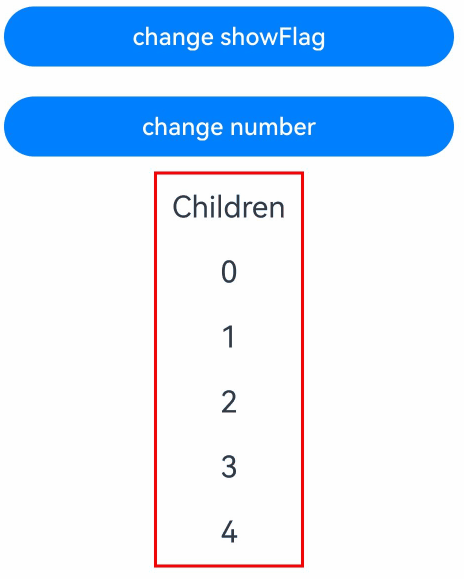

In the preceding example, when you click **change showFlag** to switch the condition of the **if** component, the **Child** component is destroyed. But when you click **change number** to change the value of **age**, the \@Monitor callback defined in **InfoWrapper** is still triggered. This is because the custom component **Child** has executed **aboutToDisappear**, but its member variable **infoWrapper** is not destroyed immediately. When the variable changes, the **onInfoAgeChange** method defined in **infoWrapper** can still be called, therefore, the \@Monitor callback is still triggered.

The result is unstable when you use the garbage collection mechanism to cancel the listening of \@Monitor. You can use either of the following methods to manage the expiration time of the \@Monitor:

1. Define \@Monitor in the custom component. When a custom component is destroyed, the state management framework cancels the listening of \@Monitor. Therefore, after the custom component calls **aboutToDisappear**, the \@Monitor callback will not be triggered even though the data of the custom component may not be released.

<!-- @[monitor_problem_class_failure_time_set_comp](https://gitcode.com/openharmony/applications_app_samples/blob/master/code/DocsSample/ArkUISample/ParadigmStateManagement/entry/src/main/ets/pages/monitor/MonitorProblemClassFailureTimeSetComp.ets) -->   

``` TypeScript
import { hilog } from '@kit.PerformanceAnalysisKit';

@ObservedV2
class InfoWrapper {
  public info?: Info;

  constructor(info: Info) {
    this.info = info;
  }
}

@ObservedV2
class Info {
  @Trace public age: number;

  constructor(age: number) {
    this.age = age;
  }
}

@ComponentV2
struct Child {
  @Param @Require infoWrapper: InfoWrapper;

  @Monitor('infoWrapper.info.age')
  onInfoAgeChange(monitor: IMonitor) {
    hilog.info(0xFF00, 'testTag', '%{public}s',
      `age change from ${monitor.value()?.before} to ${monitor.value()?.now}`);
  }

  aboutToDisappear(): void {
    hilog.info(0xFF00, 'testTag', '%{public}s', `Child aboutToDisappear, age: ${this.infoWrapper.info?.age}`);
  }

  build() {
    Column() {
      Text(`${this.infoWrapper.info?.age}`)
        .fontSize(20)
        .margin(10)
    }
  }
}

@Entry
@ComponentV2
struct Index {
  dataArray: Info[] = [];
  @Local showFlag: boolean = true;

  aboutToAppear(): void {
    for (let i = 0; i < 5; i++) {
      this.dataArray.push(new Info(i));
    }
  }

  build() {
    Column() {
      // Tap the Button to toggle showFlag, triggering the creation/destruction of the Child component.
      Button('change showFlag')
        .onClick(() => {
          this.showFlag = !this.showFlag;
        })
        .margin(10)
      Button('change number')
        .onClick(() => {
          hilog.info(0xFF00, 'testTag', '%{public}s', 'click to change age');
          this.dataArray.forEach((info: Info) => {
            info.age += 100;
          })
        })
        .margin(10)
      if (this.showFlag) {
        Column() {
          Text('Children')
            .fontSize(20)
            .margin(10)
          ForEach(this.dataArray, (info: Info) => {
            Child({ infoWrapper: new InfoWrapper(info) })
          })
        }
        .borderColor(Color.Red)
        .borderWidth(2)
      }
    }
    .width('100%')
  }
}
```

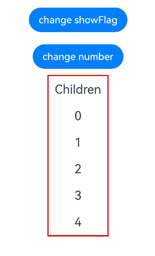

2. Set the listened object to empty. When the custom component is about to be destroyed, the \@Monitor listened object is set empty. In this way, the \@Monitor cannot listen for the changes of the original object, so that the listening is cancelled.

<!-- @[monitor_problem_class_failure_time_empty_object](https://gitcode.com/openharmony/applications_app_samples/blob/master/code/DocsSample/ArkUISample/ParadigmStateManagement/entry/src/main/ets/pages/monitor/MonitorProblemClassFailureTimeEmptyObject.ets) -->  

``` TypeScript
import { hilog } from '@kit.PerformanceAnalysisKit';

@ObservedV2
class InfoWrapper {
  public info?: Info;

  constructor(info: Info) {
    this.info = info;
  }

  @Monitor('info.age')
  onInfoAgeChange(monitor: IMonitor) {
    hilog.info(0xFF00, 'testTag', '%{public}s',
      `age change from ${monitor.value()?.before} to ${monitor.value()?.now}`);
  }
}

@ObservedV2
class Info {
  @Trace public age: number;

  constructor(age: number) {
    this.age = age;
  }
}

@ComponentV2
struct Child {
  @Param @Require infoWrapper: InfoWrapper;

  aboutToDisappear(): void {
    hilog.info(0xFF00, 'testTag', '%{public}s', `Child aboutToDisappear, age: ${this.infoWrapper.info?.age}`);
    this.infoWrapper.info = undefined; // Disable the InfoWrapper from listening for info.age.
  }

  build() {
    Column() {
      Text(`${this.infoWrapper.info?.age}`)
        .fontSize(20)
        .margin(10)
    }
  }
}

@Entry
@ComponentV2
struct Index {
  dataArray: Info[] = [];
  @Local showFlag: boolean = true;

  aboutToAppear(): void {
    for (let i = 0; i < 5; i++) {
      this.dataArray.push(new Info(i));
    }
  }

  build() {
    Column() {
      Button('change showFlag')
        .onClick(() => {
          this.showFlag = !this.showFlag;
        })
        .margin(10)
      Button('change number')
        .onClick(() => {
          hilog.info(0xFF00, 'testTag', '%{public}s', 'click to change age');
          this.dataArray.forEach((info: Info) => {
            info.age += 100;
          })
        })
        .margin(10)
      if (this.showFlag) {
        Column() {
          Text('Children')
            .fontSize(20)
            .margin(10)
          ForEach(this.dataArray, (info: Info) => {
            Child({ infoWrapper: new InfoWrapper(info) })
          })
        }
        .borderColor(Color.Red)
        .borderWidth(2)
      }
    }
    .width('100%')
  }
}
```


### Passing Correct Input Parameters to \@Monitor

Since API version 23, compile-time validation of \@Monitor input parameters has been added. When the input parameters of \@Monitor do not meet the listening conditions (such as passing a non-state variable or a non-existent variable), editing and compilation warnings are generated, but the \@Monitor callback is still triggered. You should correctly pass input parameters to \@Monitor and avoid listening for non-state variables to prevent functional anomalies or behavior that does not meet expectations.

[Incorrect Usage 1]

<!-- @[monitor_problem_param_counter_example_1](https://gitcode.com/openharmony/applications_app_samples/blob/master/code/DocsSample/ArkUISample/ParadigmStateManagement/entry/src/main/ets/pages/monitor/MonitorProblemParamCounterExample1.ets) --> 

``` TypeScript
import { hilog } from '@kit.PerformanceAnalysisKit';

@ObservedV2
class Info {
  public name: string = 'John';
  @Trace public age: number = 24;

  // Observe both state variable age and non-state variable name
  // An editing/compilation warning is triggered, indicating that `The '@Monitor' decorator needs to monitor the state variables that exist.`
  @Monitor('age', 'name')
  onPropertyChange(monitor: IMonitor) {
    monitor.dirty.forEach((path: string) => {
      hilog.info(0xFF00, 'testTag', '%{public}s',
        `property path:${path} change from ${monitor.value(path)?.before} to ${monitor.value(path)?.now}`);
    })
  }
}

@Entry
@ComponentV2
struct Index {
  info: Info = new Info();

  build() {
    Column() {
      Button('change age&name')
        .onClick(() => {
          this.info.age = 25; // Change both state variable age and non-state variable name.
          this.info.name = 'Johny';
        })
    }
    .width('100%')
  }
}
```

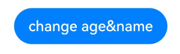

In the preceding code, when state variable **age** and non-state variable **name** are changed at the same time, the following log is generated:

```text
property path:age change from 24 to 25
property path:name change from John to Johny
```

In fact, the name property itself is not an observable variable and should not be added to the input parameters of \@Monitor.

Since API version 26.0.0, \@Monitor with configuration options treats path listening as independent of each other, with each path not affecting the others. If you switch to \@Monitor with configuration options (for example, `@Monitor({}, 'age', 'name')`), the non-state variable name is ignored and does not participate in listening. The callback is triggered only when the state variable age changes, and the dirty array contains only age. When only name is modified, the callback is not triggered. In this case, when you click the button to modify both age and name simultaneously, the following log is output:

```text
property path:age change from 24 to 25
```

It is recommended that you remove the listening for the name property, or add the \@Trace decorator to name to make it a state variable. Alternatively, you can switch to \@Monitor with configuration options.

[Correct Usage 1]

<!-- @[monitor_problem_param_positive_example_1](https://gitcode.com/openharmony/applications_app_samples/blob/master/code/DocsSample/ArkUISample/ParadigmStateManagement/entry/src/main/ets/pages/monitor/MonitorProblemParamPositiveExample1.ets) --> 

``` TypeScript
import { hilog } from '@kit.PerformanceAnalysisKit';

@ObservedV2
class Info {
  public name: string = 'John';
  @Trace public age: number = 24;

  // Observe only the state variable age
  @Monitor('age')
  onPropertyChange(monitor: IMonitor) {
    monitor.dirty.forEach((path: string) => {
      hilog.info(0xFF00, 'testTag', '%{public}s',
        `property path:${path} change from ${monitor.value(path)?.before} to ${monitor.value(path)?.now}`);
    })
  }
}

@Entry
@ComponentV2
struct Index {
  info: Info = new Info();

  build() {
    Column() {
      Button('change age&name')
        .onClick(() => {
          this.info.age = 25; // The state variable "age" is changed.
          this.info.name = 'Johny';
        })
    }
    .width('100%')
  }
}
```

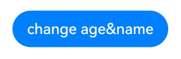

[Negative example 2]

<!-- @[monitor_problem_param_counter_example_2](https://gitcode.com/openharmony/applications_app_samples/blob/master/code/DocsSample/ArkUISample/ParadigmStateManagement/entry/src/main/ets/pages/monitor/MonitorProblemParamCounterExample2.ets) --> 

``` TypeScript
import { hilog } from '@kit.PerformanceAnalysisKit';

@ObservedV2
class Info {
  public name: string = 'John';
  @Trace public age: number = 24;

  get myAge() {
    return this.age; // age is a state variable.
  }

  // Observe a getter accessor not decorated with @Computed
  @Monitor('myAge')
  onPropertyChange() {
    hilog.info(0xFF00, 'testTag', '%{public}s', 'age changed');
  }
}

@Entry
@ComponentV2
struct Index {
  info: Info = new Info();

  build() {
    Column() {
      Button('change age')
        .onClick(() => {
          this.info.age = 25; // The state variable "age" is changed.
        })
    }
  }
}
```

In the preceding code, the input parameter of \@Monitor is the name of a getter accessor. However, the getter accessor itself is not decorated by \@Computed and is not a variable that can be listened for. But because a state variable is used in the computation, myAge is also considered to have changed after the state variable changes, thus triggering the \@Monitor callback. Since API version 26.0.0, if you switch to \@Monitor with configuration options (for example, `@Monitor({}, 'myAge')`), the behavior remains unchanged and the callback is still triggered, because reading myAge still reads the state variable age.

It is recommended that you add the \@Computed decorator to myAge to make it a state variable, or directly listen for the state variable itself.

[Correct Usage 2]

Change **myAge** to a state variable:

<!-- @[monitor_problem_param_positive_example_2](https://gitcode.com/openharmony/applications_app_samples/blob/master/code/DocsSample/ArkUISample/ParadigmStateManagement/entry/src/main/ets/pages/monitor/MonitorProblemParamPositiveExample2.ets) --> 

``` TypeScript
import { hilog } from '@kit.PerformanceAnalysisKit';

@ObservedV2
class Info {
  public name: string = 'John';
  @Trace public age: number = 24;

  // Add @Computed to make myAge a state variable
  @Computed
  get myAge() {
    return this.age;
  }

  // Observe the @Computed-decorated getter accessor
  @Monitor('myAge')
  onPropertyChange() {
    hilog.info(0xFF00, 'testTag', '%{public}s', 'age changed');
  }
}

@Entry
@ComponentV2
struct Index {
  info: Info = new Info();

  build() {
    Column() {
      Button('change age')
        .onClick(() => {
          this.info.age = 25; // The state variable "age" is changed.
        })
    }
    .width('100%')
  }
}
```

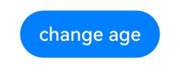

Alternatively, listen to the state variable itself.

<!-- @[monitor_problem_param_state_variables](https://gitcode.com/openharmony/applications_app_samples/blob/master/code/DocsSample/ArkUISample/ParadigmStateManagement/entry/src/main/ets/pages/monitor/MonitorProblemParamStateVariables.ets) --> 

``` TypeScript
import { hilog } from '@kit.PerformanceAnalysisKit';

@ObservedV2
class Info {
  public name: string = 'John';
  @Trace public age: number = 24;

  // Observe the state variable age directly
  @Monitor('age')
  onPropertyChange() {
    hilog.info(0xFF00, 'testTag', '%{public}s', 'age changed');
  }
}

@Entry
@ComponentV2
struct Index {
  info: Info = new Info();

  build() {
    Column() {
      Button('change age')
        .onClick(() => {
          this.info.age = 25; // The state variable "age" is changed.
        })
    }
    .width('100%')
  }
}
```

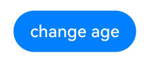

### Variables Cannot Be Observed During Accessibility Changes

\@Monitor only saves values when variables are accessible. When a state variable becomes inaccessible, value changes aren't recorded. In the following example, clicking any of the three buttons does not trigger the onChange callback.

Since API version 20, If you need to observe accessibility changes (from accessible to inaccessible or vice versa), use [addMonitor](./arkts-new-addMonitor-clearMonitor.md#listening-for-variable-accessibility-changes).

Since API version 26.0.0, \@Monitor with configuration options can properly handle the switching of variables between accessible and inaccessible states. In the following example, if `@Monitor('user.age')` is rewritten to the form with configuration options `@Monitor({}, 'user.age')`, clicking any of the three buttons triggers the `onChange` callback. The dirty array contains the path `user.age`, and the before and now values of the corresponding IMonitorValue reflect the states before and after the accessibility switch respectively (the actual value when the variable is accessible, and undefined when the variable is inaccessible).

<!-- @[monitor_problem_state_change_use_addMonitor](https://gitcode.com/openharmony/applications_app_samples/blob/master/code/DocsSample/ArkUISample/ParadigmStateManagement/entry/src/main/ets/pages/monitor/MonitorProblemStateChangeUseAddMonitor.ets) --> 

``` TypeScript
import { hilog } from '@kit.PerformanceAnalysisKit';

@ObservedV2
class User {
  @Trace public age: number = 10;
}

@Entry
@ComponentV2
struct Page {
  @Local user: User | undefined | null = new User();

  @Monitor('user.age')
  onChange(mon: IMonitor) {
    mon.dirty.forEach((path: string) => {
      hilog.info(0xFF00, 'testTag', '%{public}s',
        `onChange: User property ${path} change from ${mon.value(path)?.before} to ${mon.value(path)?.now}`);
    });
  }

  build() {
    Column() {
      Text(`User age ${this.user?.age}`)
        .fontSize(20)
        .margin(10)
      Button('set user to undefined')
        .width(300)
        .margin(10)
        .onClick(() => {
          // age: accessible → inaccessible
          this.user = undefined;
        })
      Button('set user to User')
        .width(300)
        .margin(10)
        .onClick(() => {
          // age: inaccessible → accessible
          this.user = new User();
        })
      Button('set user to null')
        .width(300)
        .margin(10)
        .onClick(() => {
          // age: accessible → inaccessible
          this.user = null;
        })
    }
  }
}
```

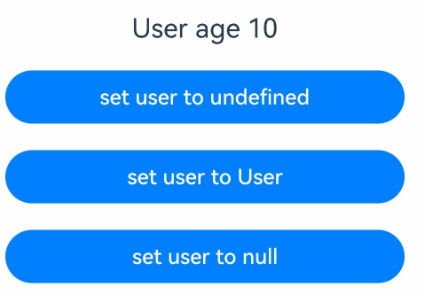