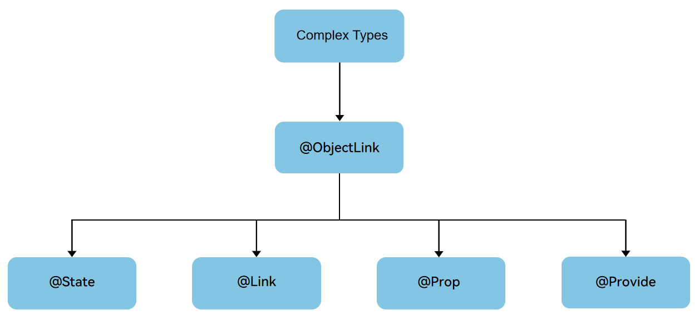
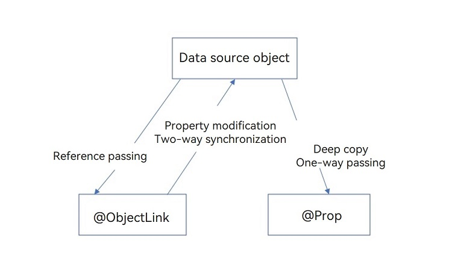
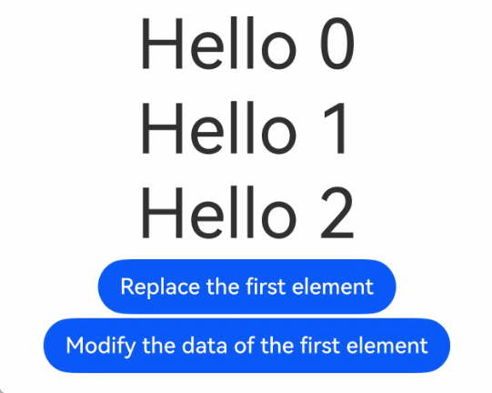

# \@Observed and \@ObjectLink Decorators: Observing Property Changes in Nested Class Objects
<!--Kit: ArkUI-->
<!--Subsystem: ArkUI-->
<!--Owner: @liwenzhen3-->
<!--Designer: @s10021109-->
<!--Tester: @TerryTsao-->
<!--Adviser: @zhang_yixin13-->

The decorators including [\@State](./arkts-state.md), [\@Prop](./arkts-prop.md), [\@Link](./arkts-link.md), [\@Provide and \@Consume](./arkts-provide-and-consume.md) can only observe the top-layer changes. However, in actual application development, the application encapsulates its own data model based on the requirements. In multi-layer nesting scenarios, such as two-dimensional arrays, object arrays, and nested classes, attribute changes at the second layer cannot be observed. Therefore, the \@Observed and \@ObjectLink decorators are introduced to observe the changes of deep attributes in nested data structures.

\@Observed/\@ObjectLink is used to observe the attribute changes of nested objects (the attributes of objects are objects). You need to understand the basic observation capabilities of the decorator before reading this document. For details, see [\@State](./arkts-state.md). For best practices, see [State Management](https://developer.huawei.com/consumer/en/doc/best-practices/bpta-status-management). For FAQs, see [State Management Development](./arkts-state-management-faq.md).

> **NOTE**
>
> These two decorators can be used in ArkTS widgets since API version 9.
>
> These two decorators can be used in atomic services since API version 11.

## **Overview**

\@ObjectLink and \@Observed class decorators can be used together to implement bidirectional data synchronization of nested objects or arrays. The usage method is as follows:

- Declare array items or class properties as types decorated with \@Observed. For an example, see [Nested Object](#nested-object).

- The state variable decorated by \@ObjectLink in a child component is used to receive the class instance decorated by \@Observed of the parent component to establish bidirectional data binding.

- Before API version 19, \@ObjectLink can receive only class instances decorated with \@Observed. Starting from API version 19, \@ObjectLink can also receive complex types without the \@Observed restriction. However, note that for observing nested types, it must receive either a class instance decorated with \@Observed or the return value of [makeV1Observed](../../reference/apis-arkui/js-apis-stateManagement.md#makev1observed19). For details, see [Two-Dimensional Array](#two-dimensional-array).

To implement unidirectional data synchronization, you need to use \@Prop. For details, see [Differences Between \@Prop and \@ObjectLink](#differences-between-prop-and-objectlink).


## Decorator Description

| \@Observed Decorator| Description                                                 |
| ------------------ | ----------------------------------------------------- |
| Parameters        | None                                                 |
| Class decorator          | Decorates a class. You must use **new** to create a class object before defining the class.|

| \@ObjectLink Decorator| Description                                                        |
| ---------------------- | ------------------------------------------------------------ |
| Parameters            | None                                                        |
| Allowed variable types    | Class instances of Date and [Array](#two-dimensional-array) can be inherited.<br>API version 11 and later versions support the class instances of [Map](#extended-map-class) and [Set](#extended-set-class), and the union type consisting of \@Observed decorative class and undefined or null, for example, ClassA \| ClassB, ClassA \| undefined, or ClassA \| null. For an example, see [Union Type @ObjectLink](#union-type-objectlink).<br>Before API version 19, it must be a class instance decorated by \@Observed.<br>In API version 19 and later, \@ObjectLink can be initialized by complex types, that is, class, object, and built-in types. However, when observing a nested type, you still need to receive the class instance decorated by \@Observed or the return value of makeV1Observed.<br>**NOTE**<br>\@ObjectLink does not support simple types. To use simple types, you can use [\@Prop](arkts-prop.md).|
| Initial value for the decorated variable    | Disable local initialization.                                            |

The attributes of \@ObjectLink can be changed, but the entire value cannot be assigned. That is, the variables decorated by \@ObjectLink are read-only.


```ts
// Allowed: assigning a value to a property of an @ObjectLink decorated variable
this.objLink.a= ...
// Not allowed: assigning a new value to the @ObjectLink decorated variable itself
this.objLink= ...
```

> **NOTE**
>
> Value assignment is not allowed for the \@ObjectLink decorated variable. To assign a value, use [@Prop](arkts-prop.md) instead.
>
> - The relationship between the \@Prop decorated variable and the data source is unidirectional synchronization. The \@Prop decorated variable copies the data source locally. Therefore, it can be modified locally. If the data source in the parent component is updated, the local modification of the \@Prop decorated variable will be overwritten.
>
> - \@ObjectLink creates a two-way synchronization between the data source and the decorated variable. An \@ObjectLink decorated variable can be considered as a pointer to the source object inside the parent component. Do not assign values to variables decorated by \@ObjectLink. If a value is assigned to a variable decorated by \@ObjectLink, the synchronization chain is interrupted.

## Variable Transfer/Access Rules

| \@ObjectLink Transfer/Access| Description                                                        |
| --------------------- | ------------------------------------------------------------ |
| Initialization from the parent component       | Mandatory.<br>Variables decorated by \@ObjectLink must be initialized using complex types. To observe changes, the following conditions must be met:<br>- Before &nbsp;API version 19, the type must be a class instance decorated by \@Observed.<br>- In API version 19 and later, \@ObjectLink can be initialized by complex types, that is, class, object, and built-in types. However, when observing a nested type, you still need to receive the class instance decorated by \@Observed or the return value of makeV1Observed.<br>- The class or array of the synchronization source must be decorated by [\@State](./arkts-state.md), [\@Link](./arkts-link.md), [\@Provide](./arkts-provide-and-consume.md), [\@Consume](./arkts-provide-and-consume.md), or \@ObjectLink.<br>For an example where the synchronization source is an array item, see [Object Array](#object-array). For an example of the initialized class, see [Nested Object](#nested-object).|
| Synchronization with the source         | Two-way.                                                      |
| Subcomponents can be initialized.     | Supported; can be used to initialize a regular variable or \@State, \@Link, \@Prop, or \@Provide decorated variable in the child component.|


  **Figure 1** Initialization rule 

  


## Observed Changes and Behavior

### Observed Changes

In versions earlier than API version 19, if the attributes of a class decorated by \@Observed are of non-simple types, such as class, Object, Array, Map, Set, and Date, these attributes also need to be decorated by \@Observed, otherwise, the changes of these attributes or the API calls of built-in types cannot be observed. Starting from API version 19, you can also use [makeV1Observed](../../reference/apis-arkui/js-apis-stateManagement.md#makev1observed19) to observe changes to nested class properties.

<!-- @[Observe_the_changes](https://gitcode.com/openharmony/applications_app_samples/blob/master/code/DocsSample/ArkUISample/arktsobservedandobjectlink/entry/src/main/ets/pages/overview/DecoratorDescription.ets) -->

``` TypeScript
class Child {
  public num: number;

  constructor(num: number) {
    this.num = num;
  }
}

@Observed
class Parent {
  public child: Child;
  public count: number;

  constructor(child: Child, count: number) {
    this.child = child;
    this.count = count;
  }
}
```

In the preceding example, **Parent** is decorated by \@Observed, and the value changes of its member variables can be observed. In contrast, **Child** is not decorated by \@Observed, and therefore its property changes cannot be observed. To observe the attribute modification of Child, see [Nested Object](#nested-object).


<!-- @[Modify_and_change](https://gitcode.com/openharmony/applications_app_samples/blob/master/code/DocsSample/ArkUISample/arktsobservedandobjectlink/entry/src/main/ets/pages/overview/DecoratorDescription.ets) -->

``` TypeScript
@ObjectLink parent: Parent;

build() {
  Column() {
    Button('click me')
      .onClick(() => {
        // Value changes can be observed.
        this.parent.child = new Child(5);
        this.parent.count = 5;
        // Child is not decorated by @Observed, therefore, its property changes cannot be observed.
        this.parent.child.num = 5;
      // ···
      })
  }
}
```

\@ObjectLink When receiving an object, if the object is decorated by \@State or other state variable decorators, you can observe the changes at the first layer. For details, see [Object Type](#object-type).

When \@ObjectLink receives a nested object, the inner object must be of the class type decorated by \@Observed. Since API version 19, inner objects also support return values processed by [makeV1Observed](../../reference/apis-arkui/js-apis-stateManagement.md#makev1observed19). For details, see [Nested Object](#nested-object).

\@ObjectLink You are advised to design an independent custom component to render each array or object. In this case, an object array or nested object requires two custom components. One custom component presents an external array/object, and the other custom component presents a class object nested within the array/object. The following can be observed:

- Value changes of the properties that **Object.keys(observedObject)** returns. For details, see [Nested Object](#nested-object).

- If the data source is an array, you can observe the replacement of array items. If the data source is a class, you can observe the change of the properties of the class. For details, see [Object Array](#object-array).

When \@ObjectLink decorates the class inherited from Date, you can view the overall value assignment of Date and call the setFullYear, setMonth, setDate, setHours, setMinutes, setSeconds, setMilliseconds, setTime, setUTCFullYear, setUTCMonth, setUTCDate, setUTCHours, setUTCMinutes, setUTCSeconds, setUTCMilliseconds interface of Date to update the attributes of Date.

<!-- @[Observation_ChangeInheritance](https://gitcode.com/openharmony/applications_app_samples/blob/master/code/DocsSample/ArkUISample/arktsobservedandobjectlink/entry/src/main/ets/pages/overview/ObservationChangeInheritance.ets) -->

``` TypeScript
@Observed
class DateClass extends Date {
  constructor(args: number | string) {
    super(args);
  }
}

@Observed
class NewDate {
  public data: DateClass;

  constructor(data: DateClass) {
    this.data = data;
  }
}

@Component
struct Child {
  label: string = 'date';
  @ObjectLink data: DateClass;

  build() {
    Column() {
      Button('child increase the day by 1')
        .onClick(() => {
          this.data.setDate(this.data.getDate() + 1);
        })
      DatePicker({
        start: new Date('1970-1-1'),
        end: new Date('2100-1-1'),
        selected: this.data
      })
    }
  }
}

@Entry
@Component
struct Parent {
  @State newData: NewDate = new NewDate(new DateClass('2023-1-1'));

  build() {
    Column() {
      Child({ label: 'date', data: this.newData.data })

      Button('parent update the new date')
        .onClick(() => {
          this.newData.data = new DateClass('2023-07-07');
        })
      Button(`ViewB: this.newData = new NewDate(new DateClass('2023-08-20'))`)
        .onClick(() => {
          this.newData = new NewDate(new DateClass('2023-08-20'));
        })
    }
  }
}
```

When \@ObjectLink decorates a class that extends **Map**, it enables observation of the entire **Map** instance's value assignments. Additionally, calling **Map** APIs like **set**, **clear**, and **delete** triggers updates to the observed **Map** value. For details, see [Extended Map Class](#extended-map-class).

When \@ObjectLink decorates a class that extends **Set**, it enables observation of the entire Set instance's value assignments. Additionally, calling **Set** APIs like **add**, **clear**, and **delete** triggers updates to the observed **Set** value. For details, see [Extended Set Class](#extended-set-class).


### Framework Behavior

1. Initial rendering:

   a. The instance of the class decorated by \@Observed is wrapped by the proxy object, which proxies the setter and getter methods of the properties on the class.

   b. The variable decorated by \@ObjectLink in the child component is initialized from the parent component and receives the instance of the class decorated by \@Observed. The wrapper class of \@ObjectLink registers itself with \@Observed class. The registration behavior here means that the \@ObjectLink wrapper class provides its own reference to the \@Observed instance so that the \@Observed instance can add it to the dependency list so that it can be notified of attribute changes.

2. Attribute update: When the class attribute decorated by \@Observed changes, the setter and getter of the proxy are executed, and then the \@ObjectLink wrapper class that depends on the setter and getter is traversed to notify the data update.


## Constraints

1. Using \@Observed to decorate a class changes the original prototype chain of the class. Using \@Observed and other class decorators to decorate the same class may cause problems.

2. You are not advised to use the \@ObjectLink decorator in custom components decorated by [\@Entry](./arkts-create-custom-components.md#entry). Otherwise, an alarm will be generated during compilation.

3. \@ObjectLink decorated type must be the complex type. Otherwise, a compilation error will be thrown.

4. For API version 19 and earlier, the variable type decorated with \@ObjectLink must be a class explicitly decorated with \@Observed. If the type is not specified or is not a class decorated with \@Observed, a compilation error will be thrown.

   Starting from API version 19, \@ObjectLink can also be initialized with the return value of [makeV1Observed](../../reference/apis-arkui/js-apis-stateManagement.md#makev1observed19). If \@ObjectLink is initialized with a class that is not decorated with @Observed or the return value of makeV1Observed, a runtime warning log will be generated.

   ```ts
   class Test {
     msg: number;
   
     constructor(msg: number) {
       this.msg = msg;
     }
   }
   // Incorrect format. The count type is not specified, leading to a compilation error.
   @ObjectLink count;
   // Incorrect format. Test is not decorated by @Observed, leading to a compilation error.
   @ObjectLink test: Test;
   ```

   <!-- @[Test_Info_Observed](https://gitcode.com/openharmony/applications_app_samples/blob/master/code/DocsSample/ArkUISample/arktsobservedandobjectlink/entry/src/main/ets/pages/restrictiveconditions/RestrictiveConditionsObserved.ets) -->
   
   ``` TypeScript
   @Observed
   class Info {
     public count: number;
   
     constructor(count: number) {
       this.count = count;
     }
   }
   // ...
   // Correct usage.
   @ObjectLink count: Info;
   ```

5. Variables decorated by \@ObjectLink cannot be initialized locally. You can only pass in the initial value from the parent component through construction parameters. Otherwise, a compilation error will be thrown.

   ```ts
   // Incorrect usage. An error is reported during compilation.
   @ObjectLink count: CountInfo = new CountInfo(10);
   ```

   <!-- @[Info_Initialization](https://gitcode.com/openharmony/applications_app_samples/blob/master/code/DocsSample/ArkUISample/arktsobservedandobjectlink/entry/src/main/ets/pages/restrictiveconditions/RestrictiveConditionsObserved.ets) -->
   
   ``` TypeScript
   @Observed
   class CountInfo {
     public count: number;
   
     constructor(count: number) {
       this.count = count;
     }
   }
   // ...
   // Correct usage.
   @ObjectLink count: CountInfo;
   ```

6. The variables decorated by \@ObjectLink are read-only and cannot be assigned values. Otherwise, an error "Cannot set property when setter is undefined" is reported during runtime. If you need to replace all variables decorated by \@ObjectLink, you can replace them in the parent component.

   **Incorrect Usage**

   ```ts
   @Observed
   class Info {
     count: number;
   
     constructor(count: number) {
       this.count = count;
     }
   }
   
   @Component
   struct Child {
     @ObjectLink num: Info;
   
     build() {
       Column() {
         Text(`Value of num: ${this.num.count}`)
           .onClick(() => {
             // Incorrect format. The variable decorated by @ObjectLink cannot be assigned a value. An error is reported during running.
             this.num = new Info(10);
           })
       }
     }
   }
   
   @Entry
   @Component
   struct Parent {
     @State num: Info = new Info(10);
   
     build() {
       Column() {
         Text(`Value of count: ${this.num.count}`)
         Child({num: this.num})
       }
     }
   }
   ```

   **Correct Usage**

   <!-- @[variables_decorated_ObjectLink_read_only](https://gitcode.com/openharmony/applications_app_samples/blob/master/code/DocsSample/ArkUISample/arktsobservedandobjectlink/entry/src/main/ets/pages/restrictiveconditions/ReadOnlyVariable.ets) -->
   
   ``` TypeScript
   
   @Observed
   class Info {
     public count: number;
   
     constructor(count: number) {
       this.count = count;
     }
   }
   
   @Component
   struct Child {
     @ObjectLink num: Info;
   
     build() {
       Column() {
         Text(`num value: ${this.num.count}`)
           .onClick(() => {
             // Correct format, which is used to change the member property of the @ObjectLink decorated variables.
             this.num.count = 20;
           })
       }
     }
   }
   
   @Entry
   @Component
   struct Parent {
     @State num: Info = new Info(10);
   
     build() {
       Column() {
         Text(`count value: ${this.num.count}`)
         Button('click')
           .onClick(() => {
             // Replace the variable in the parent component.
             this.num = new Info(30);
           })
         Child({ num: this.num })
       }
     }
   }
   ```


## When to Use

### Object Type

This scenario contains built-in types (Array, Map, Set, and Date) and common classes. Since API version 19, \@ObjectLink receives the built-in type and common class object transferred by \@State. You can observe the API call and first-layer changes without adding \@Observed. State variable decorators such as \@State add a layer of "proxy" wrapper to the object (outer object), which is equivalent to adding \@Observed decorators.

```ts
class Book {
  name: string;

  constructor(name: string) {
    this.name = name;
  }
}

@Component
struct BookCard {
  @ObjectLink book: Book;

  build() {
    Column() {
      Text(`BookCard: ${this.book.name}`) // The name change can be observed.
        .width(320)
        .margin(10)
        .textAlign(TextAlign.Center)

      Button('change book.name')
        .width(320)
        .margin(10)
        .onClick(() => {
          this.book.name = 'C++';
        })
    }
  }
}

@Entry
@Component
struct Index {
  @State book: Book = new Book('JS');

  build() {
    Column() {
      BookCard({ book: this.book })
    }
  }
}
```

### Nested Object

<!-- @[Nested_Object](https://gitcode.com/openharmony/applications_app_samples/blob/master/code/DocsSample/ArkUISample/arktsobservedandobjectlink/entry/src/main/ets/pages/objectLinkusagescenarios/NestedObject.ets) -->

``` TypeScript
@Observed
class Book {
  public name: string;

  constructor(name: string) {
    this.name = name;
  }
}

@Observed
class Bag {
  public book: Book;

  constructor(book: Book) {
    this.book = book;
  }
}

@Component
struct BookCard {
  @ObjectLink book: Book;

  build() {
    Column() {
      Text(`BookCard: ${this.book.name}`) // The name change can be observed.
        .width(320)
        .margin(10)
        .textAlign(TextAlign.Center)

      Button('change book.name')
        .width(320)
        .margin(10)
        .onClick(() => {
          this.book.name = 'C++';
        })
    }
  }
}

@Entry
@Component
struct Index {
  @State bag: Bag = new Bag(new Book('JS'));

  build() {
    Column() {
      Text(`Index: ${this.bag.book.name}`) // The name change cannot be observed.
        .width(320)
        .margin(10)
        .textAlign(TextAlign.Center)

      Button('change bag.book.name')
        .width(320)
        .margin(10)
        .onClick(() => {
          this.bag.book.name = 'TS';
        })

      BookCard({ book: this.bag.book })
    }
  }
}
```


In the preceding example:

- When you click change bag.book.name, the Text component in the Index component is not refreshed because the change belongs to the second layer. Therefore, the change of the second layer cannot be observed in \@State. However, the Book component is decorated by \@Observed, and the name attribute of the Book component can be observed by \@ObjectLink. Therefore, the Text component in the BookCard component can be refreshed.
- Click **change book.name**. The Text component in the Bookcard component is refreshed. The change is at the first layer in the BookCard component and can be observed by \@ObjectLink.

### Object array

An object array is a frequently used data structure. The following example shows how to use an object array.

> **NOTE**
>
> NextID is used to generate a unique and persistent key value for each array element during [ForEach: Rendering Repeated Content](../rendering-control/arkts-rendering-control-foreach.md) to identify the corresponding component.

```ts
let NextID: number = 1;

@Observed
class Info {
  public id: number;
  public info: number;

  constructor(info: number) {
    this.id = NextID++;
    this.info = info;
  }
}

@Component
struct Child {
  // The type of the Child's @ObjectLink is Info.
  @ObjectLink info: Info;
  label: string = 'ViewChild';

  build() {
    Row() {
      Button(`ViewChild [${this.label}] this.info.info = ${this.info ? this.info.info : 'undefined'}`)
        .width(320)
        .margin(10)
        .onClick(() => {
          this.info.info += 1;
        })
    }
  }
}

@Entry
@Component
struct Parent {
  // Info[] decorated by @State in the Parent.
  @State arrA: Info[] = [new Info(0), new Info(0)];

  build() {
    Column() {
      ForEach(this.arrA,
        (item: Info) => {
          Child({ label: `#${item.id}`, info: item })
        },
        (item: Info): string => item.id.toString()
      )
      // Initialize the @ObjectLink decorated variable using the @State decorated array, whose items are instances of @Observed decorated Info.
      Child({ label: 'ViewChild this.arrA[first]', info: this.arrA[0] })
      Child({ label: 'ViewChild this.arrA[last]', info: this.arrA[this.arrA.length-1] })

      Button('ViewParent: reset array')
        .width(320)
        .margin(10)
        .onClick(() => {
          this.arrA = [new Info(0), new Info(0)];
        })
      Button('ViewParent: push')
        .width(320)
        .margin(10)
        .onClick(() => {
          this.arrA.push(new Info(0));
        })
      Button('ViewParent: shift')
        .width(320)
        .margin(10)
        .onClick(() => {
          if (this.arrA.length > 0) {
            this.arrA.shift();
          } else {
            console.info('length <= 0');
          }
        })
      Button('ViewParent: item property in middle')
        .width(320)
        .margin(10)
        .onClick(() => {
          if (this.arrA[Math.floor(this.arrA.length / 2)]) {
            this.arrA[Math.floor(this.arrA.length / 2)].info = 10;
          } else {
            console.info('middle element does not exist');
          }
        })
      Button('ViewParent: item property in middle')
        .width(320)
        .margin(10)
        .onClick(() => {
          this.arrA[Math.floor(this.arrA.length / 2)] = new Info(11);
        })
    }
  }
}
```


- **this.arrA[Math.floor(this.arrA.length/2)] = new Info(..)**: The change of this state variable triggers two updates.
  1. ForEach: The [itemGenerator](../../reference/apis-arkui/arkui-ts/ts-rendering-control-foreach.md) of ForEach is modified due to the assignment of the array item. Therefore, the array item is identified as changed, and the item builder of ForEach is executed to create a new child component instance.
  2. Child({ label: 'ViewChild this.arrA[last]', info: this.arrA[this.arrA.length-1] }): The preceding change changes the second element in the array. Therefore, the Child bound to **this.arrA[1]** is updated.

- **this.arrA.push(new Info(0))**: The change of this state variable triggers two updates with different effects.
  1. ForEach: The newly added Info object is an unknown [itemGenerator](../../reference/apis-arkui/arkui-ts/ts-rendering-control-foreach.md) for ForEach. The item builder of ForEach will execute to create a new Child component instance.
  2. Child({ label: 'ViewChild this.arrA[last]', info: this.arrA[this.arrA.length-1] }): The last item of the array is changed. As a result, the instance of the second Child is changed. For Child({ label: 'ViewChild this.arrA[first]', info: this.arrA[0] }), the change of the array does not trigger the change of an array item. Therefore, the first Child is not refreshed.

- **this.arrA[Math.floor(this.arrA.length/2)].info**: @State cannot observe changes at the second layer. However, as **Info** is decorated by \@Observed, the change of its properties will be observed by \@ObjectLink.


### **Two-Dimensional Array**

@Observed class decoration is required for a two-dimensional array. You can declare an \@Observed decorated class that extends from **Array**.


<!-- @[Two_dimensional_array](https://gitcode.com/openharmony/applications_app_samples/blob/master/code/DocsSample/ArkUISample/arktsobservedandobjectlink/entry/src/main/ets/pages/ObservedAndObjectLinkFAQs/DelayedChange.ets) -->

``` TypeScript
@Observed
class ObservedArray<T> extends Array<T> {
}
```

Declare an ObservedArray\<T\> class inherited from Array and use the new operator to create an instance of ObservedArray\<string\>. The instance can be used to observe attribute changes.

The following example shows how to use \@Observed to observe the changes of a two-dimensional array.

<!-- @[Two_dimensional_array_example](https://gitcode.com/openharmony/applications_app_samples/blob/master/code/DocsSample/ArkUISample/arktsobservedandobjectlink/entry/src/main/ets/pages/objectLinkusagescenarios/TwoDimensionalArray.ets) -->

``` TypeScript
@Observed
class ObservedArray<T> extends Array<T> {
}

@Component
struct Item {
  @ObjectLink itemArr: ObservedArray<string>;

  build() {
    Row() {
      ForEach(this.itemArr, (item: string, index: number) => {
        Text(`${index}: ${item}`)
          .width(100)
          .height(100)
      }, (item: string) => item)
    }
  }
}

@Entry
@Component
struct IndexPage {
  @State arr: Array<ObservedArray<string>> = [
    new ObservedArray<string>('apple'),
    new ObservedArray<string>('banana'),
    new ObservedArray<string>('orange')
  ];

  build() {
    Column() {
      ForEach(this.arr, (itemArr: ObservedArray<string>) => {
        Item({ itemArr: itemArr })
      })

      Divider()

      Button('push two-dimensional array item')
        .margin(10)
        .onClick(() => {
          this.arr[0].push('strawberry');
        })

      Button('push array item')
        .margin(10)
        .onClick(() => {
          this.arr.push(new ObservedArray<string>('pear'));
        })

      Button('change two-dimensional array first item')
        .margin(10)
        .onClick(() => {
          this.arr[0][0] = 'APPLE';
        })

      Button('change array first item')
        .margin(10)
        .onClick(() => {
          this.arr[0] = new ObservedArray<string>('watermelon');
        })
    }
  }
}
```

Since API version 19, \@ObjectLink can also be initialized with the return value of [makeV1Observed](../../reference/apis-arkui/js-apis-stateManagement.md#makev1observed19). Therefore, if you do not want to declare the class that inherits from array, you can use **makeV1Observed** to achieve the same effect.

A complete example is as follows:

<!-- @[Complete_Example_Two_Dimensional_Array](https://gitcode.com/openharmony/applications_app_samples/blob/master/code/DocsSample/ArkUISample/arktsobservedandobjectlink/entry/src/main/ets/pages/objectLinkusagescenarios/CompleteExampleTwoDimensionalArray.ets) -->

``` TypeScript
import { UIUtils } from '@kit.ArkUI';

@Component
struct Item {
  @ObjectLink itemArr: Array<string>;

  build() {
    Row() {
      ForEach(this.itemArr, (item: string, index: number) => {
        Text(`${index}: ${item}`)
          .width(100)
          .height(100)
      }, (item: string) => item)
    }
  }
}

@Entry
@Component
struct IndexPage {
  @State arr: Array<Array<string>> =
    [UIUtils.makeV1Observed(['apple']), UIUtils.makeV1Observed(['banana']), UIUtils.makeV1Observed(['orange'])];

  build() {
    Column() {
      ForEach(this.arr, (itemArr: Array<string>) => {
        Item({ itemArr: itemArr })
      })

      Divider()

      Button('push two-dimensional array item')
        .margin(10)
        .onClick(() => {
          this.arr[0].push('strawberry');
        })

      Button('push array item')
        .margin(10)
        .onClick(() => {
          this.arr.push(UIUtils.makeV1Observed(['pear']));
        })

      Button('change two-dimensional array first item')
        .margin(10)
        .onClick(() => {
          this.arr[0][0] = 'APPLE';
        })

      Button('change array first item')
        .margin(10)
        .onClick(() => {
          this.arr[0] = UIUtils.makeV1Observed(['watermelon']);
        })
    }
  }
}
```


### Extended Map Class

> **NOTE**
>
> Since API version 11, \@ObjectLink supports @Observed decorated classes extending from **Map** and the Map type.

In the following example, the **myMap** variable is of the MyMap\<number, string\> type. When the button is clicked, the value of **myMap** changes, and the UI is re-rendered.

<!-- @[Inherit_From_Map_Class](https://gitcode.com/openharmony/applications_app_samples/blob/master/code/DocsSample/ArkUISample/arktsobservedandobjectlink/entry/src/main/ets/pages/objectLinkusagescenarios/InheritFromMapClass.ets) -->

``` TypeScript
@Observed
class Info {
  public info: MyMap<number, string>;

  constructor(info: MyMap<number, string>) {
    this.info = info;
  }
}

@Observed
export class MyMap<K, V> extends Map<K, V> {
  public name: string;

  constructor(name?: string, args?: [K, V][]) {
    super(args);
    this.name = name ? name : 'My Map';
  }

  getName() {
    return this.name;
  }
}

@Entry
@Component
struct MapSampleNested {
  @State message: Info = new Info(new MyMap('myMap', [[0, 'a'], [1, 'b'], [3, 'c']]));

  build() {
    Row() {
      Column() {
        MapSampleNestedChild({ myMap: this.message.info })
      }
      .width('100%')
    }
    .height('100%')
  }
}

@Component
struct MapSampleNestedChild {
  @ObjectLink myMap: MyMap<number, string>;

  build() {
    Row() {
      Column() {
        ForEach(Array.from(this.myMap.entries()), (item: [number, string]) => {
          Text(`${item[0]}`).fontSize(30)
          Text(`${item[1]}`).fontSize(30)
          Divider().strokeWidth(5)
        })

        Button('set new one')
          .width(200)
          .margin(10)
          .onClick(() => {
            this.myMap.set(4, 'd');
          })
        Button('clear')
          .width(200)
          .margin(10)
          .onClick(() => {
            this.myMap.clear();
          })
        Button('replace the first one')
          .width(200)
          .margin(10)
          .onClick(() => {
            this.myMap.set(0, 'aa');
          })
        Button('delete the first one')
          .width(200)
          .margin(10)
          .onClick(() => {
            this.myMap.delete(0);
          })
      }
      .width('100%')
    }
    .height('100%')
  }
}
```


### Extended Set Class

> **NOTE**
>
> Since API version 11, \@ObjectLink supports @Observed decorated classes extending from **Set** and the Set type.

In the following example, the **mySet** variable is of the MySet\<number\> type. When the button is clicked, the value of **mySet** changes, and the UI is re-rendered.

<!-- @[Inherit_From_Set_Class](https://gitcode.com/openharmony/applications_app_samples/blob/master/code/DocsSample/ArkUISample/arktsobservedandobjectlink/entry/src/main/ets/pages/objectLinkusagescenarios/InheritFromSetClass.ets) -->

``` TypeScript
@Observed
class Info {
  public info: MySet<number>;

  constructor(info: MySet<number>) {
    this.info = info;
  }
}

@Observed
export class MySet<T> extends Set<T> {
  public name: string;

  constructor(name?: string, args?: T[]) {
    super(args);
    this.name = name ? name : 'My Set';
  }

  getName() {
    return this.name;
  }
}

@Entry
@Component
struct SetSampleNested {
  @State message: Info = new Info(new MySet('Set', [0, 1, 2, 3, 4]));

  build() {
    Row() {
      Column() {
        SetSampleNestedChild({ mySet: this.message.info })
      }
      .width('100%')
    }
    .height('100%')
  }
}

@Component
struct SetSampleNestedChild {
  @ObjectLink mySet: MySet<number>;

  build() {
    Row() {
      Column() {
        ForEach(Array.from(this.mySet.entries()), (item: [number, number]) => {
          Text(`${item}`).fontSize(30)
          Divider()
        })
        Button('set new one')
          .width(200)
          .margin(10)
          .onClick(() => {
            this.mySet.add(5);
          })
        Button('clear')
          .width(200)
          .margin(10)
          .onClick(() => {
            this.mySet.clear();
          })
        Button('delete the first one')
          .width(200)
          .margin(10)
          .onClick(() => {
            this.mySet.delete(0);
          })
      }
      .width('100%')
    }
    .height('100%')
  }
}
```


### Union Type @ObjectLink

\@ObjectLink supports the combination of the \@Observed decorative class and undefined or null. In the following example, the count type is Source | Data | undefined. When you click the button in the parent component to change the count attribute or type, the corresponding text component in the child component is refreshed.

<!-- @[ObjectLink_Supports_Union_Types](https://gitcode.com/openharmony/applications_app_samples/blob/master/code/DocsSample/ArkUISample/arktsobservedandobjectlink/entry/src/main/ets/pages/objectLinkusagescenarios/ObjectLinkSupportsUnionTypes.ets) -->

``` TypeScript
import { hilog } from '@kit.PerformanceAnalysisKit';

const DOMAIN = 0x0001;
const TAG = 'ArkTSObservedAndObjectlink';

@Observed
class Source {
  public source: number;

  constructor(source: number) {
    this.source = source;
  }
}

@Observed
class Data {
  public data: number;

  constructor(data: number) {
    this.data = data;
  }
}

@Entry
@Component
struct Parent {
  @State count: Source | Data | undefined = new Source(10);

  build() {
    Column() {
      Child({ count: this.count })

      Button('change count property')
        .margin(10)
        .onClick(() => {
          // Determine the count type and update the property.
          if (this.count instanceof Source) {
            this.count.source += 1;
          } else if (this.count instanceof Data) {
            this.count.data += 1;
          } else {
            hilog.info(DOMAIN, TAG, `count is undefined, cannot change property`);
          }
        })

      Button('change count to Source')
        .margin(10)
        .onClick(() => {
          // Assign the value of an instance of Source.
          this.count = new Source(100);
        })

      Button('change count to Data')
        .margin(10)
        .onClick(() => {
          // Assign the value of an instance of Data.
          this.count = new Data(100);
        })

      Button('change count to undefined')
        .margin(10)
        .onClick(() => {
          // Assign the value undefined.
          this.count = undefined;
        })
    }.width('100%')
  }
}

@Component
struct Child {
  @ObjectLink count: Source | Data | undefined;

  build() {
    Column() {
      Text(`count is instanceof ${this.count instanceof Source ? 'Source' :
        this.count instanceof Data ? 'Data' : 'undefined'}`)
        .fontSize(30)
        .margin(10)

      Text(`count's property is  ${this.count instanceof Source ? this.count.source : this.count?.data}`).fontSize(15)

    }.width('100%')
  }
}
```


## FAQs

### UI Not Updated on property Changes in Simple Nested Objects

If you find your application UI not updating after a property in a nested object is changed, you may want to check the decorators in use.

Each decorator has the observation capability, but not all changes can be observed. Only changes that can be observed can trigger UI updates. The \@Observed decorator can observe the property changes of nested objects, while other decorators can observe only the changes at the first layer.

**Incorrect Usage**

In the following example, some UI components are not updated.


```ts
class Parent {
  parentId: number;

  constructor(parentId: number) {
    this.parentId = parentId;
  }

  getParentId(): number {
    return this.parentId;
  }

  setParentId(parentId: number): void {
    this.parentId = parentId;
  }
}

class Child {
  childId: number;

  constructor(childId: number) {
    this.childId = childId;
  }

  getChildId(): number {
    return this.childId;
  }

  setChildId(childId: number): void {
    this.childId = childId;
  }
}

class Cousin extends Parent {
  cousinId: number = 47;
  child: Child;

  constructor(parentId: number, cousinId: number, childId: number) {
    super(parentId);
    this.cousinId = cousinId;
    this.child = new Child(childId);
  }

  getCousinId(): number {
    return this.cousinId;
  }

  setCousinId(cousinId: number): void {
    this.cousinId = cousinId;
  }

  getChild(): number {
    return this.child.getChildId();
  }

  setChild(childId: number): void {
    this.child.setChildId(childId);
  }
}

@Entry
@Component
struct MyView {
  @State cousin: Cousin = new Cousin(10, 20, 30);

  build() {
    Column({ space: 10 }) {
      Text(`parentId: ${this.cousin.parentId}`)
      Button('Change Parent.parent')
        .onClick(() => {
          this.cousin.parentId += 1;
        })

      Text(`cousinId: ${this.cousin.cousinId}`)
      Button('Change Cousin.cousinId')
        .onClick(() => {
          this.cousin.cousinId += 1;
        })

      Text(`childId: ${this.cousin.child.childId}`)
      Button('Change Cousin.Child.childId')
        .onClick(() => {
          // The Text component is not updated when clicked.
          this.cousin.child.childId += 1;
        })
    }
  }
}
```

- The UI is not re-rendered when the last **Text('child: ${this.cousin.child.childId}')** is clicked. This is because, \@State **cousin: Cousin** can only observe the property change of **this.cousin**, such as **this.cousin.parentId**, **this.cousin.cousinId**, and **this.cousin.child**, but cannot observe the in-depth property, that is, **this.cousin.child.childId** (**childId** is the property of the **Child** object embedded in **cousin**).

- To observe the properties of nested object **Child**, you need to make the following changes:
  - Construct a child component for separate rendering of the **Child** instance. This child component can use \@ObjectLink **child : Child** or \@Prop **child : Child**. \@ObjectLink is generally used, unless local changes to the **Child** object are required.
  - The nested **Child** object must be decorated by \@Observed. When a **Child** object is created in **Cousin** (**Cousin(10, 20, 30)** in this example), it is wrapped in the ES6 proxy. When the **Child** property changes to **this.cousin.child.childId += 1**, the \@ObjectLink decorated variable is notified of the change.

**Correct Usage**

The following example uses \@Observed/\@ObjectLink to observe property changes for nested objects.


<!-- @[Basic_nesting](https://gitcode.com/openharmony/applications_app_samples/blob/master/code/DocsSample/ArkUISample/arktsobservedandobjectlink/entry/src/main/ets/pages/ObservedAndObjectLinkFAQs/BasicNesting.ets) -->

``` TypeScript
class Parent {
  public parentId: number;

  constructor(parentId: number) {
    this.parentId = parentId;
  }

  getParentId(): number {
    return this.parentId;
  }

  setParentId(parentId: number): void {
    this.parentId = parentId;
  }
}

@Observed
class Child {
  public childId: number;

  constructor(childId: number) {
    this.childId = childId;
  }

  getChildId(): number {
    return this.childId;
  }

  setChildId(childId: number): void {
    this.childId = childId;
  }
}

class Cousin extends Parent {
  public cousinId: number = 47;
  public child: Child;

  constructor(parentId: number, cousinId: number, childId: number) {
    super(parentId);
    this.cousinId = cousinId;
    this.child = new Child(childId);
  }

  getCousinId(): number {
    return this.cousinId;
  }

  setCousinId(cousinId: number): void {
    this.cousinId = cousinId;
  }

  getChild(): number {
    return this.child.getChildId();
  }

  setChild(childId: number): void {
    this.child.setChildId(childId);
  }
}

@Component
struct ViewChild {
  @ObjectLink child: Child;

  build() {
    Column({ space: 10 }) {
      Text(`childId: ${this.child.getChildId()}`)
      Button('Change childId')
        .onClick(() => {
          this.child.setChildId(this.child.getChildId() + 1);
        })
    }
  }
}

@Entry
@Component
struct MyView {
  @State cousin: Cousin = new Cousin(10, 20, 30);

  build() {
    Column({ space: 10 }) {
      Text(`parentId: ${this.cousin.parentId}`)
      Button('Change Parent.parentId')
        .onClick(() => {
          this.cousin.parentId += 1;
        })

      Text(`cousinId: ${this.cousin.cousinId}`)
      Button('Change Cousin.cousinId')
        .onClick(() => {
          this.cousin.cousinId += 1;
        })

      ViewChild({ child: this.cousin.child }) // Alternative format of Text(`childId: ${this.cousin.child.childId}`).
      Button('Change Cousin.Child.childId')
        .onClick(() => {
          this.cousin.child.childId += 1;
        })
    }
  }
}
```

### UI Not Updated on property Changes in Complex Nested Objects

**Incorrect Usage**

The following example creates a child component with an \@ObjectLink decorated variable to render **ParentCounter** with nested properties. Specifically, **SubCounter** nested in **ParentCounter** is decorated with \@Observed.


```ts
let nextId = 1;
@Observed
class SubCounter {
  counter: number;
  constructor(c: number) {
    this.counter = c;
  }
}
@Observed
class ParentCounter {
  id: number;
  counter: number;
  subCounter: SubCounter;
  incrCounter() {
    this.counter++;
  }
  incrSubCounter(c: number) {
    this.subCounter.counter += c;
  }
  setSubCounter(c: number): void {
    this.subCounter.counter = c;
  }
  constructor(c: number) {
    this.id = nextId++;
    this.counter = c;
    this.subCounter = new SubCounter(c);
  }
}
@Component
struct CounterComp {
  @ObjectLink value: ParentCounter;
  build() {
    Column({ space: 10 }) {
      Text(`${this.value.counter}`)
        .fontSize(25)
        .onClick(() => {
          this.value.incrCounter();
        })
      Text(`${this.value.subCounter.counter}`)
        .onClick(() => {
          this.value.incrSubCounter(1);
        })
      Divider().height(2)
    }
  }
}
@Entry
@Component
struct ParentComp {
  @State counter: ParentCounter[] = [new ParentCounter(1), new ParentCounter(2), new ParentCounter(3)];
  build() {
    Row() {
      Column() {
        CounterComp({ value: this.counter[0] })
        CounterComp({ value: this.counter[1] })
        CounterComp({ value: this.counter[2] })
        Divider().height(5)
        ForEach(this.counter,
          (item: ParentCounter) => {
            CounterComp({ value: item })
          },
          (item: ParentCounter) => item.id.toString()
        )
        Divider().height(5)
        // First click event
        Text('Parent: incr counter[0].counter')
          .fontSize(20).height(50)
          .onClick(() => {
            this.counter[0].incrCounter();
            // The value increases by 10 each time the event is triggered.
            this.counter[0].incrSubCounter(10);
          })
        // Second click event
        Text('Parent: set.counter to 10')
          .fontSize(20).height(50)
          .onClick(() => {
            // The value cannot be set to 10, and the UI is not updated.
            this.counter[0].setSubCounter(10);
          })
        Text('Parent: reset entire counter')
          .fontSize(20).height(50)
          .onClick(() => {
            this.counter = [new ParentCounter(1), new ParentCounter(2), new ParentCounter(3)];
          })
      }
    }
  }
}
```

For the **onClick** event of **Text('Parent: incr counter[0].counter')**, **this.counter[0].incrSubCounter(10)** calls the **incrSubCounter** method to increase the **counter** value of **SubCounter** by 10. The UI is updated to reflect the change.

However, when this.counter[0].setSubCounter(10) is called in onClick of Text('Parent: set.counter to 10'), the counter value of SubCounter cannot be reset to 10.

**incrSubCounter** and **setSubCounter** are functions of the same **SubCounter**. The UI can be correctly updated when **incrSubCounter** is called for the first click event. However, the UI is not updated when **setSubCounter** is called for the second click event. Actually neither **incrSubCounter** nor **setSubCounter** can trigger an update of **Text('${this.value.subCounter.counter}')**. This is because \@ObjectLink **value: ParentCounter** can only observe the properties of **ParentCounter**. **this.value.subCounter.counter** is a property of **SubCounter** and therefore cannot be observed.

In addition, the first click event calls this.counter[0].incrCounter() to mark \@ObjectLink value: ParentCounter in the CounterComp custom component as changed, which triggers the update of Text('${this.value.subCounter.counter}'). If this.counter[0].incrCounter() is deleted from the first click event, the UI cannot be updated.

**Correct Usage**

To solve the preceding problem, you can use the following method to directly observe the properties in **SubCounter** so that the **this.counter[0].setSubCounter(10)** API works:


<!-- @[Complex_Methods_Nesting](https://gitcode.com/openharmony/applications_app_samples/blob/master/code/DocsSample/ArkUISample/arktsobservedandobjectlink/entry/src/main/ets/pages/ObservedAndObjectLinkFAQs/ComplexMethodsNesting.ets) -->

``` TypeScript
let nextId = 1;

@Observed
class SubCounter {
  public counter: number;

  constructor(c: number) {
    this.counter = c;
  }
}

@Observed
class ParentCounter {
  public id: number;
  public counter: number;
  public subCounter: SubCounter;

  incrCounter() {
    this.counter++;
  }

  incrSubCounter(c: number) {
    this.subCounter.counter += c;
  }

  setSubCounter(c: number): void {
    this.subCounter.counter = c;
  }

  constructor(c: number) {
    this.id = nextId++;
    this.counter = c;
    this.subCounter = new SubCounter(c);
  }
}


@Entry
@Component
struct ParentComp {
  @State counter: ParentCounter[] = [new ParentCounter(1), new ParentCounter(2), new ParentCounter(3)];
  build() {
    Row() {
        CounterComp({ value: this.counter[0] }) // ParentComp passes ParentCounter to CounterComp.
    }
  }
}

@Component
struct CounterComp {
  @ObjectLink value: ParentCounter; // @ObjectLink: receives ParentCounter.
  build() {
      // CounterChild is a child component of CounterComp. CounterComp passes this.value.subCounter to the CounterChild component.
      CounterChild({ subValue: this.value.subCounter })
  }
}

@Component
struct CounterChild {
  @ObjectLink subValue: SubCounter; // @ObjectLink receiving SubCounter
  build() {
    Text(`${this.subValue.counter}`)
      .onClick(() => {
        this.subValue.counter += 1;
      })
  }
}
```

This approach enables \@ObjectLink to serve as a proxy for the properties of the **ParentCounter** and **SubCounter** classes. In this way, the property changes of the two classes can be observed and trigger UI update. Even if **this.counter[0].incrCounter()** is deleted, the UI can be updated correctly.

This approach can be used to implement "two-layer" observation, that is, observation of external objects and internal nested objects. However, it is only applicable to the \@ObjectLink decorator, but not to \@Prop (\@Prop passes objects through deep copy). For details, see [Differences Between \@Prop and \@ObjectLink](#differences-between-prop-and-objectlink).


<!-- @[Complex_nested_observation_levels](https://gitcode.com/openharmony/applications_app_samples/blob/master/code/DocsSample/ArkUISample/arktsobservedandobjectlink/entry/src/main/ets/pages/ObservedAndObjectLinkFAQs/ComplexNestingComplete.ets) -->

``` TypeScript
let nextId = 1;

@Observed
class SubCounter {
  public counter: number;

  constructor(c: number) {
    this.counter = c;
  }
}

@Observed
class ParentCounter {
  public id: number;
  public counter: number;
  public subCounter: SubCounter;

  incrCounter() {
    this.counter++;
  }

  incrSubCounter(c: number) {
    this.subCounter.counter += c;
  }

  setSubCounter(c: number): void {
    this.subCounter.counter = c;
  }

  constructor(c: number) {
    this.id = nextId++;
    this.counter = c;
    this.subCounter = new SubCounter(c);
  }
}

@Component
struct CounterComp {
  @ObjectLink value: ParentCounter;

  build() {
    Column({ space: 10 }) {
      Text(`${this.value.counter}`)
        .fontSize(25)
        .onClick(() => {
          this.value.incrCounter();
        })
      CounterChild({ subValue: this.value.subCounter })
      Divider().height(2)
    }
  }
}

@Component
struct CounterChild {
  @ObjectLink subValue: SubCounter;

  build() {
    Text(`${this.subValue.counter}`)
      .onClick(() => {
        this.subValue.counter += 1;
      })
  }
}

@Entry
@Component
struct ParentComp {
  @State counter: ParentCounter[] = [new ParentCounter(1), new ParentCounter(2), new ParentCounter(3)];

  build() {
    Row() {
      Column() {
        CounterComp({ value: this.counter[0] })
        CounterComp({ value: this.counter[1] })
        CounterComp({ value: this.counter[2] })
        Divider().height(5)
        ForEach(this.counter,
          (item: ParentCounter) => {
            CounterComp({ value: item })
          },
          (item: ParentCounter) => item.id.toString()
        )
        Divider().height(5)
        Text('Parent: reset entire counter')
          .fontSize(20).height(50)
          .onClick(() => {
            this.counter = [new ParentCounter(1), new ParentCounter(2), new ParentCounter(3)];
          })
        Text('Parent: incr counter[0].counter')
          .fontSize(20).height(50)
          .onClick(() => {
            this.counter[0].incrCounter();
            this.counter[0].incrSubCounter(10);
          })
        Text('Parent: set.counter to 10')
          .fontSize(20).height(50)
          .onClick(() => {
            this.counter[0].setSubCounter(10);
          })
      }
    }
  }
}
```

### Differences Between \@Prop and \@ObjectLink

Both \@Prop and \@ObjectLink can receive class object instances decorated by \@Observed. \@Prop Performs a deep copy on an object. Modifying the object after the deep copy does not affect the original object and its associated components. \@ObjectLink Obtain the reference of an object. Modifying the referenced object affects the original object and its associated components.

In the following example, the **UserChild** component uses both \@Prop and \@ObjectLink to receive the class object instance decorated by \@Observed from the parent component as the data source. Modifications to this data source object will affect both \@Prop and \@ObjectLink decorated variables. Click change @ObjectLink value and change @Prop value in sequence. The following information is displayed:

1. Modifying the object content decorated by \@ObjectLink affects the data source object and is synchronized to \@Prop again. Therefore, both Text components are refreshed.
2. Modifying the object decorated by \@Prop affects only the Text2 component that uses the object, but does not affect the data source object.

<!-- @[Differences_Prop_ObjectLink](https://gitcode.com/openharmony/applications_app_samples/blob/master/code/DocsSample/ArkUISample/arktsobservedandobjectlink/entry/src/main/ets/pages/ObservedAndObjectLinkFAQs/DifferencesPropObjectLink.ets) -->

``` TypeScript
let nextId = 0;

@Observed
class User {
  public id: number;

  constructor() {
    this.id = nextId++;
  }
}

@Entry
@Component
struct Index {
  @State users: User[] = [new User(), new User(), new User()];

  build() {
    Column() {
      UserChild({ firstUserByObjectLink: this.users[0], firstUserByProp: this.users[0] })
    }
  }
}

@Component
struct UserChild {
  @ObjectLink firstUserByObjectLink: User;
  @Prop firstUserByProp: User;

  build() {
    Column() {
      // If the comparison result is false, the object obtained after deep copy of @Prop is different from the original object.
      Text(`firstUserByObjectLink equals firstUserByProp? : ${this.firstUserByObjectLink === this.firstUserByProp}`)
      Text(`UserChild firstUserByObjectLink.id: ${this.firstUserByObjectLink.id}`) // Text1
      Text(`UserChild firstUserByProp.id: ${this.firstUserByProp.id}`) // Text2
      Button('change @ObjectLink value')
        .onClick(() => {
          this.firstUserByObjectLink.id++;
        })
      Button('change @Prop value')
        .onClick(() => {
          this.firstUserByProp.id++;
        })
    }
  }
}
```

The following figure shows the relationship in the preceding example.



### Member Variable Changes in the \@Observed Decorated Class Constructor Not Taking Effect

In state management, \@Observed decorated classes are wrapped with a proxy. When a member variable of a class is changed in a component, the proxy intercepts the change. When the value in the data source is changed, the proxy notifies the bound component of the change. In this way, the change can be observed and trigger UI re-rendering.

If the value change of a member variable occurs in the class constructor, the change does not pass through the proxy (because the change occurs in the data source). Therefore, even if the change is successful with a timer in the class constructor, the UI cannot be re-rendered.

**Incorrect Usage**

```ts
@Observed
class RenderClass {
  waitToRender: boolean = false;

  constructor() {
    setTimeout(() => {
      this.waitToRender = true;
      console.info('Change the value of waitToRender to: ' + this.waitToRender);
    }, 1000)
  }
}

@Entry
@Component
struct Index {
  @State @Watch('renderClassChange') renderClass: RenderClass = new RenderClass();
  @State textColor: Color = Color.Black;

  renderClassChange() {
    console.info('The value of renderClass is changed to: ' + this.renderClass.waitToRender);
  }

  build() {
    Row() {
      Column() {
        Text('The value of renderClass is: ' + this.renderClass.waitToRender)
          .fontSize(20)
          .fontColor(this.textColor)
        Button('Show')
          .onClick(() => {
            // It is not recommended to use other state variables to forcibly re-render the UI. This example is used to check whether the value of waitToRender is updated.
            this.textColor = Color.Red;
          })
      }
      .width('100%')
    }
    .height('100%')
  }
}
```

In the preceding example, a timer is used in the constructor of **RenderClass**. Though the value of **waitToRender** changes 1 second later, the UI is not re-rendered. Click to forcibly refresh the Text component. You can see that the value of waitToRender is changed to true.

**Correct Usage**

<!-- @[Delayed_change](https://gitcode.com/openharmony/applications_app_samples/blob/master/code/DocsSample/ArkUISample/arktsobservedandobjectlink/entry/src/main/ets/pages/ObservedAndObjectLinkFAQs/DelayedChange.ets) -->

``` TypeScript
import { hilog } from '@kit.PerformanceAnalysisKit';

const DOMAIN = 0x0001;
const TAG = 'ArkTSObservedAndObjectlink';

@Observed
class RenderClass {
  public waitToRender: boolean = false;

  constructor() {
  }
}

@Entry
@Component
struct DelayedChangeIndex {
  @State @Watch('renderClassChange') renderClass: RenderClass = new RenderClass();

  renderClassChange() {
    hilog.info(DOMAIN, TAG, `The value of renderClass is changed to: ${this.renderClass.waitToRender}`);
  }

  onPageShow() {
    setTimeout(() => {
      this.renderClass.waitToRender = true;
    }, 1000);
  }

  build() {
    Row() {
      Column() {
        Text(`The value of renderClass is: ${this.renderClass.waitToRender}`)
          .fontSize(20)
      }
      .width('100%')
    }
    .height('100%')
  }
}
```

In the preceding sample code, the timer modification is moved to the component. In this case, "The value of renderClass is:false" is displayed first. When the timer is triggered, the value of renderClass changes and the [@Watch](./arkts-watch.md) callback is triggered. In this case, "The value of renderClass is:true" is displayed on the page, and "The value of renderClass is changed to:true" is displayed in the log.

Therefore, you are advised to modify the class member variables decorated by \@Observed in the component to implement refresh.

### \@ObjectLink Data Source Update Timing

<!-- @[ObjectLink_Data_source_update_timing](https://gitcode.com/openharmony/applications_app_samples/blob/master/code/DocsSample/ArkUISample/arktsobservedandobjectlink/entry/src/main/ets/pages/ObservedAndObjectLinkFAQs/ObjectLinkDataSourceUpdate.ets) -->

``` TypeScript
import { hilog } from '@kit.PerformanceAnalysisKit';

const DOMAIN = 0x0001;
const TAG = 'ArkTSObservedAndObjectlink';

@Observed
class Person {
  public name: string = '';
  public age: number = 0;

  constructor(name: string, age: number) {
    this.name = name;
    this.age = age;
  }
}

@Observed
class Info {
  public person: Person;

  constructor(person: Person) {
    this.person = person;
  }
}

@Entry
@Component
struct Parent {
  @State @Watch('onChange01') info: Info =
    new Info(
      new Person('Bob', 10)
    );

  onChange01() {
    hilog.info(DOMAIN, TAG, `:::onChange01: + ${this.info.person.name}`); // 2
  }

  build() {
    Column() {
      Text(this.info.person.name).height(40)
      Child({
        per: this.info.person, clickEvent: () => {
          hilog.info(DOMAIN, TAG, `:::clickEvent before ${this.info.person.name}`); // 1
          this.info.person = new Person('Jack', 12);
          hilog.info(DOMAIN, TAG, `:::clickEvent after ${this.info.person.name}`); // 3
        }
      })
    }
  }
}

@Component
struct Child {
  @ObjectLink @Watch('onChange02') per: Person;
  clickEvent?: () => void;

  onChange02() {
    hilog.info(DOMAIN, TAG, `:::onChange02:${this.per.name}`); // 5
  }

  build() {
    Column() {
      Button(this.per.name)
        .height(40)
        .onClick(() => {
          this.onClickType();
        })
    }
  }

  private onClickType() {
    if (this.clickEvent) {
      this.clickEvent();
    }
    hilog.info(DOMAIN, TAG, `:::--------this.per.name in Child is still: ${this.per.name}`); // 4
  };
}
```

The data source update of \@ObjectLink depends on its parent component. When the data source changes of the parent component trigger a re-rendering on the parent component, the data source of the child component \@ObjectLink is reset. This process does not occur immediately after the data source of the parent component changes. Instead, it occurs when the parent component is re-rendered. In the preceding example, **Parent** contains **Child** and passes the arrow function to **Child**. When the child component is clicked, the log printing sequence is from 1 to 5. When the log is printed to log 4, the click event process ends. In this case, only **Child** is marked as the node that needs to be updated by the parent component, therefore, the value of **this.per.name** in log 4 is still **Bob**. The data source of **Child** is updated only when the parent component is re-rendered.

When the \@Watch function of **@ObjectLink @Watch('onChange02') per: Person** is executed, the data source of \@ObjectLink has been updated by the parent component. In this case, the value printed in log 5 is **Jack**.

The meaning of the log is as follows:

- Log 1: Before a value is assigned to **Parent @State @Watch('onChange01') info: Info = new Info(new Person('Bob', 10))**.

- Log 2: Assign a value to **Parent @State @Watch('onChange01') info: Info = new Info(new Person('Bob', 10))** and execute its \@Watch function synchronously.

- Log 3: A value is assigned to **Parent @State @Watch('onChange01') info: Info = new Info(new Person('Bob', 10))**.

- Log 4: After **clickEvent** in the **onClickType** method is executed, **Child** is marked as the node that needs to be updated by the parent component, and the latest value is not updated to **Child @ObjectLink @Watch('onChange02') per: Person**. Therefore, the value of **this.per.name** in log 4 is still **Bob**.

- Log 5: The next VSync triggers **Child** re-rendering. **@ObjectLink @Watch('onChange02') per: Person** is re-rendered and its @Watch method is triggered. In this case, the new value of the **@ObjectLink @Watch('onChange02') per: Person** is **Jack**.

The parent-child synchronization principle of \@Prop is the same as that of \@ObjectLink.

When **this.info.person.name** is changed in **clickEvent**, this change takes effect immediately. In this case, the value of log 4 is **Jack**.

<!-- @[ClickEvent_Jack](https://gitcode.com/openharmony/applications_app_samples/blob/master/code/DocsSample/ArkUISample/arktsobservedandobjectlink/entry/src/main/ets/pages/ObservedAndObjectLinkFAQs/ClickEventJack.ets) -->

``` TypeScript
Child({
  per: this.info.person, clickEvent: () => {
    hilog.info(DOMAIN, TAG, `:::clickEvent before ${this.info.person.name}`); // 1
    this.info.person.name = 'Jack';
    hilog.info(DOMAIN, TAG, `:::clickEvent after ${this.info.person.name}`); // 3
  }
})
```

The **Text** component in **Parent** is not re-rendered because **this.info.person.name** is a value with two-layer nesting.

### @Observed decorated class. Use this in the constructor to assign a value to the attribute. The UI update is not triggered.

When a member variable is assigned a value or modified in the constructor function of the @Observed class, the modification does not pass through the proxy and cannot be observed.

**Incorrect Usage**

```ts
@Observed
class DataDownloader {
  state: number;
  constructor() {
    this.state = 0;
    setInterval(() => {
      // Modify member variables from the constructor without triggering UI update.
      this.state += 1;
    }, 2000);
  }
}

@Entry
@Component
struct Index {
  @State dataDownloader: DataDownloader = new DataDownloader();
  build() {
    Column() {
      Text(`Download state is ${this.dataDownloader.state}`)
    }
  }
}
```

**Correct Usage**

```ts
@Observed
class DataDownloader {
  state: number;
  constructor() {
    this.state = 0;
  }
  startIntervalUpdate() {
    setInterval(() => {
      this.state += 1;
    }, 2000);
  }
}

@Entry
@Component
struct Index {
  @State dataDownloader: DataDownloader = new DataDownloader()
  aboutToAppear() {
    this.dataDownloader.startIntervalUpdate(); // @Observed: After the decorated class is built, you can modify the attributes to trigger the UI update.
  }
  build() {
    Column() {
      Text(`Download state is ${this.dataDownloader.state}`)
    }
  }
}
```


### When LazyForEach and @ObjectLink Are Used Together, the UI Is Not Refreshed After the Array Data Is Replaced

When the array of the class decorated by @Observed is expanded by [LazyForEach](../rendering-control/arkts-rendering-control-lazyforeach.md), the UI may not be refreshed after the array data is replaced. After the array data is changed, onDataChange needs to be called to instruct the LazyForEach component to rebind the status variable. Otherwise, the preceding problem occurs.

**Incorrect Usage**

```ts
// LazyForEach traverses the data base class.
class BasicDataSource implements IDataSource {
  private listeners: DataChangeListener[] = [];
  private originDataArray: StringData[] = [];

  public totalCount(): number {
    return this.originDataArray.length;
  }

  public getData(index: number): StringData {
    return this.originDataArray[index];
  }

  registerDataChangeListener(listener: DataChangeListener): void {
    if (this.listeners.indexOf(listener) < 0) {
      console.info('add listener');
      this.listeners.push(listener);
    }
  }

  unregisterDataChangeListener(listener: DataChangeListener): void {
    const pos = this.listeners.indexOf(listener);
    if (pos >= 0) {
      console.info('remove listener');
      this.listeners.splice(pos, 1);
    }
  }

  notifyDataAdd(index: number): void {
    this.listeners.forEach(listener => {
      listener.onDataAdd(index);
    });
  }
}

// LazyForEach traverses data types.
class MyDataSource extends BasicDataSource {
  public dataArray: StringData[] = [];

  public totalCount(): number {
    return this.dataArray.length;
  }

  public getData(index: number): StringData {
    return this.dataArray[index];
  }

  public pushData(data: StringData): void {
    this.dataArray.push(data);
    this.notifyDataAdd(this.dataArray.length - 1);
  }
}

@Observed
class StringData {
  message: string;

  constructor(message: string) {
    this.message = message;
  }
}

@Entry
@Component
struct MyComponent {
  private data: MyDataSource = new MyDataSource();
  helloCount: number = 4;

  aboutToAppear() {
    for (let i = 0; i <= 3; i++) {
      this.data.pushData(new StringData(`Hello ${i}`));
    }
  }

  build() {
    Column() {
      List({ space: 3 }) {
        // Use LazyForEach to traverse data.
        LazyForEach(this.data, (item: StringData, index: number) => {
          ListItem() {
            ChildComponent({ data: item })
          }
        }, (item: StringData, index: number) => index.toString() + item.message)
      }.cachedCount(3)
      Button('Replace the first element')
        .onClick(() => {
          // The UI is not refreshed when the array element is replaced. In this case, the new value has not been bound to the LazyForEach component.
          this.data.dataArray[0] = new StringData('Hello ' + this.helloCount++)
        })
      Button('Modify the data of the first element')
        .onClick(() => {
          // After the array element is replaced, the UI is not refreshed even if the element value is changed.
          this.data.dataArray[0].message += '1';
        })
    }
  }
}

// Component reuse using @Reusable
@Reusable
@Component
struct ChildComponent {
  // Use @ObjectLink to receive data of the class decorated by @Observed.
  @ObjectLink data: StringData;

  aboutToAppear(): void {
    console.info(`aboutToAppear: ${this.data.message}`);
  }

  aboutToRecycle(): void {
    console.info(`aboutToRecycle: ${this.data.message}`);
  }

  // Update data when the component is reused.
  aboutToReuse(params: Record<string, ESObject>): void {
    this.data.message = (params.data as StringData).message;
    console.info(`aboutToReuse: ${this.data.message}`);
  }

  build() {
    Row() {
      Text(this.data.message)
        .fontSize(50)
        .onAppear(() => {
          console.info(`appear: ${this.data.message}`);
        })
    }.margin({ left: 10, right: 10 })
  }
}
```

**Correct Usage**

```ts
// LazyForEach traverses the data base class.
class BasicDataSource implements IDataSource {
  private listeners: DataChangeListener[] = [];
  private originDataArray: StringData[] = [];

  public totalCount(): number {
    return this.originDataArray.length;
  }

  public getData(index: number): StringData {
    return this.originDataArray[index];
  }

  registerDataChangeListener(listener: DataChangeListener): void {
    if (this.listeners.indexOf(listener) < 0) {
      console.info('add listener');
      this.listeners.push(listener);
    }
  }

  unregisterDataChangeListener(listener: DataChangeListener): void {
    const pos = this.listeners.indexOf(listener);
    if (pos >= 0) {
      console.info('remove listener');
      this.listeners.splice(pos, 1);
    }
  }

  notifyDataAdd(index: number): void {
    this.listeners.forEach(listener => {
      listener.onDataAdd(index);
    });
  }

  // Instruct LazyForEach to process data replacement.
  notifyDataChanged(index: number): void {
    this.listeners.forEach(listener => {
      listener.onDataChange(index);
    })
  }
}

// LazyForEach traverses data types.
class MyDataSource extends BasicDataSource {
  public dataArray: StringData[] = [];

  public totalCount(): number {
    return this.dataArray.length;
  }

  public getData(index: number): StringData {
    return this.dataArray[index];
  }

  public pushData(data: StringData): void {
    this.dataArray.push(data);
    this.notifyDataAdd(this.dataArray.length - 1);
  }
}

@Observed
class StringData {
  message: string;

  constructor(message: string) {
    this.message = message;
  }
}

@Entry
@Component
struct MyComponent {
  private data: MyDataSource = new MyDataSource();
  helloCount: number = 4;

  aboutToAppear() {
    for (let i = 0; i <= 2; i++) {
      this.data.pushData(new StringData(`Hello ${i}`));
    }
  }

  build() {
    Column({ space: 3 }) {
      List({ space: 3 }) {
        // Use LazyForEach to traverse data.
        LazyForEach(this.data, (item: StringData, index: number) => {
          ListItem() {
            ChildComponent({ data: item })
          }.width('100%')
          //The key of LazyForEach is constructed from the index and message. Each time an element is replaced, the key needs to be modified to trigger UI refresh.
        }, (item: StringData, index: number) => index.toString() + item.message)
      }.cachedCount(3)
      Button('Replace the first element')
        .onClick(() => {
          this.data.dataArray[0] = new StringData('Hello ' + this.helloCount++);
          //After the element is replaced, notify LazyForEach that the UI can be refreshed.
          this.data.notifyDataChanged(0);
        })
      Button('Modify the data of the first element')
        .onClick(() => {
          // After the element is replaced, the binding is re-established. Therefore, the UI can be refreshed after the element value is changed.
          this.data.dataArray[0].message += '1';
        })
    }
    .width('100%')
    .alignItems(HorizontalAlign.Center)
  }
}

// Use Reusable to enable component reuse.
@Reusable
@Component
struct ChildComponent {
  // Use @ObjectLink to receive data of the @Observed class.
  @ObjectLink data: StringData;

  aboutToAppear(): void {
    console.info(`aboutToAppear: ${this.data.message}`);
  }

  aboutToRecycle(): void {
    console.info(`aboutToRecycle: ${this.data.message}`);
  }

  // Update data when the component is reused.
  aboutToReuse(params: Record<string, ESObject>): void {
    this.data.message = (params.data as StringData).message;
    console.info(`aboutToReuse: ${this.data.message}`);
  }

  build() {
    Row() {
      Text(this.data.message)
        .fontSize(50)
        .onAppear(() => {
          console.info(`appear: ${this.data.message}`);
        })
    }.margin({ left: 10, right: 10 })
  }
}
```


