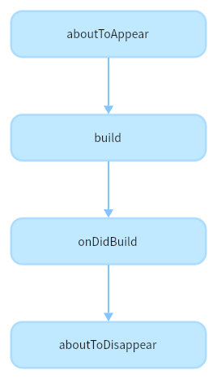
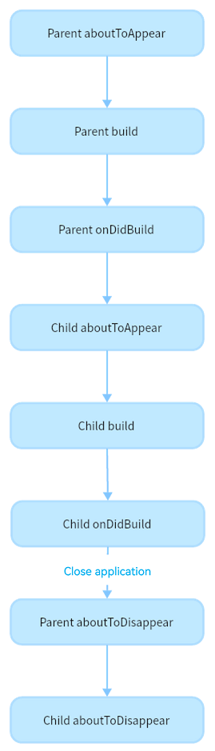

# Custom Component Lifecycle
<!--Kit: ArkUI-->
<!--Subsystem: ArkUI-->
<!--Owner: @jiyujia926; @huyisuo-->
<!--Designer: @zhangboren-->
<!--Tester: @TerryTsao-->
<!--Adviser: @zhang_yixin13-->

The lifecycle of a custom component is decorated with [@Component](arkts-create-custom-components.md#component) or [@ComponentV2](arkts-new-componentV2.md). The following lifecycle APIs are provided:


- [aboutToAppear](../../reference/apis-arkui/arkui-ts/ts-custom-component-lifecycle.md#abouttoappear): Invoked when the custom component is about to appear. Specifically, it is invoked after a new instance of the custom component is created and before its **build** function is executed.

- [onDidBuild](../../reference/apis-arkui/arkui-ts/ts-custom-component-lifecycle.md#ondidbuild12): This API is called back after the build function triggered by the first rendering of the component is executed. This API is not called back when the component is re-rendered. You can report tracing data and implement other functions that do not affect the actual UI in this phase. Do not change state variables or use functions (such as **animateTo**) in **onDidBuild**. Otherwise, unstable UI performance may result.

- [aboutToDisappear](../../reference/apis-arkui/arkui-ts/ts-custom-component-lifecycle.md#abouttodisappear): Invoked when the custom component is about to be destroyed. Do not change state variables in the aboutToDisappear function. Modifying the @Link variable may lead to unstable application behavior.

> **NOTE**
>
> For details about the page lifecycle and related content, see [Page Routing](../arkts-routing.md#lifecycle).

The following figure shows the lifecycle of a custom component.





The following describes how to create, re-render, and delete a custom component.


## Custom Component Creation and Rendering

1. Custom component creation: An instance of a custom component is created by the ArkUI framework.

2. Initialization of custom component member variables: The member variables are initialized with locally defined defaults or component constructor parameters. The initialization happens in the document order, which is the order in which the member variables are defined.

3. If aboutToAppear is defined, this method is executed before the build method is executed.

4. On initial render, the **build** function of the built-in component is executed for rendering. If the child component is a custom component, the rendering creates an instance of the child component. During initial render, the framework records the mapping between state variables and components. When a state variable changes, the framework drives the related components to update.

5. If onDidBuild is defined, this method is executed after the build method is executed.

## Custom Component Re-rendering

When a state variable changes due to an event (such as a tap) or a property in LocalStorage or AppStorage changes and the value of the bound state variable changes:

1. The framework detects the change and starts re-rendering.

2. Based on the mapping between state variables and components recorded by the framework, only the components associated with the changed state variables are refreshed to implement minimum update.

## Custom Component Deletion

For example, if the branch of the if component changes or the number of arrays in the ForEach loop rendering changes, the component is removed.

1. Before the component is deleted, the **aboutToDisappear** callback is invoked to mark the component for deletion. The node deletion mechanism of ArkUI is as follows: The backend node is directly removed from the component tree, the backend node is destroyed, and the frontend node is de-referenced. When the frontend node has no reference, the Ark VM garbage collection is performed.

2. The custom component and its variables are deleted. If the component has synchronous variables (such as [@Link](arkts-link.md), [@Prop](arkts-prop.md), and [@StorageLink](arkts-appstorage.md#storagelink)), the registration is canceled on the [synchronization source](arkts-state-management-overview.md#basic-concepts).

You are not advised to use async await in aboutToDisappear. If asynchronous operations (such as Promise or callback methods) are used in this lifecycle, the custom component will be retained in the Promise closure until the callback method is executed. This will prevent the custom component from being garbage collected.

## Nested Custom Components

The following example details the call sequence of the custom component lifecycle when custom components are nested:

```ts
// Index.ets
@Entry
@Component
struct Parent {
  @State showChild: boolean = true;
  @State btnColor: string = '#FF007DFF';

  // Component lifecycle
  aboutToAppear() {
    console.info('Parent aboutToAppear');
  }

  // Component lifecycle
  onDidBuild() {
    console.info('Parent onDidBuild');
  }

  // Component lifecycle
  aboutToDisappear() {
    console.info('Parent aboutToDisappear');
  }

  build() {
    Column() {
      // When this.showChild is true, create the Child child component and invoke Child aboutToAppear.
      if (this.showChild) {
        Child()
      }
      Button('delete Child')
        .margin(20)
        .backgroundColor(this.btnColor)
        .onClick(() => {
          // When this.showChild is false, delete the Child child component and invoke Child aboutToDisappear.
          // this.showChild is set to true. The Child component is added, and Child aboutToAppear is executed.
          this.showChild = !this.showChild;
        })
    }
  }
}

@Component
struct Child {
  @State title: string = 'Hello World';

  // Component lifecycle
  aboutToDisappear() {
    console.info('Child aboutToDisappear');
  }

  // Component lifecycle
  onDidBuild() {
    console.info('Child onDidBuild');
  }

  // Component lifecycle
  aboutToAppear() {
    console.info('Child aboutToAppear');
  }

  build() {
    Text(this.title)
      .fontSize(50)
      .margin(20)
      .onClick(() => {
        this.title = 'Hello ArkUI';
      })
  }
}
```

In the preceding example, the Index page contains two custom components: Parent and Child. The Parent and Child components declare their own lifecycle functions (aboutToAppear, onDidBuild, and aboutToDisappear).

- The initialization process of cold start is as follows: Parent aboutToAppear --&gt; Parent build --&gt; Parent onDidBuild --&gt; Child aboutToAppear --&gt; Child build --&gt; Child onDidBuild. This demonstrates the lazy expansion feature of custom components. That is, the aboutToAppear function of the Child component is executed only after the onDidBuild function of the Parent component is executed. The log output is as follows:

```ts
Parent aboutToAppear
Parent onDidBuild
Child aboutToAppear
Child onDidBuild
```

- Click the button to change showChild to false, delete the Child component, and execute the aboutToDisappear method of the Child component.

- If you exit the application, the following lifecycle functions are triggered: Parent aboutToDisappear --&gt; Child aboutToDisappear. This demonstrates that custom components are deleted from the parent to the child. The log output is as follows:

```ts
Parent aboutToDisappear
Child aboutToDisappear
```

- Minimize the application or switch to another application. The Index page is not destroyed, so the aboutToDisappear function of the component is not executed.

- If the default value of showChild is false, the initialization process of cold start is as follows: Parent aboutToAppear --&gt; Parent build --&gt; Parent onDidBuild. The log output is as follows:

```ts
Parent aboutToAppear
Parent onDidBuild
```
- If the default value of showChild is false, the application exits directly. In this case, only the Parent aboutToDisappear method is executed.

- If the default value of showChild is false, click the button to change the value of showChild to true and add the child component. The adding process is as follows: Child aboutToAppear --&gt; Child build --&gt; Child onDidBuild. The log output information is as follows:

```ts
Child aboutToAppear
Child onDidBuild
```
When showchild is set to the default value true, the lifecycle flowchart of the example is as follows.


