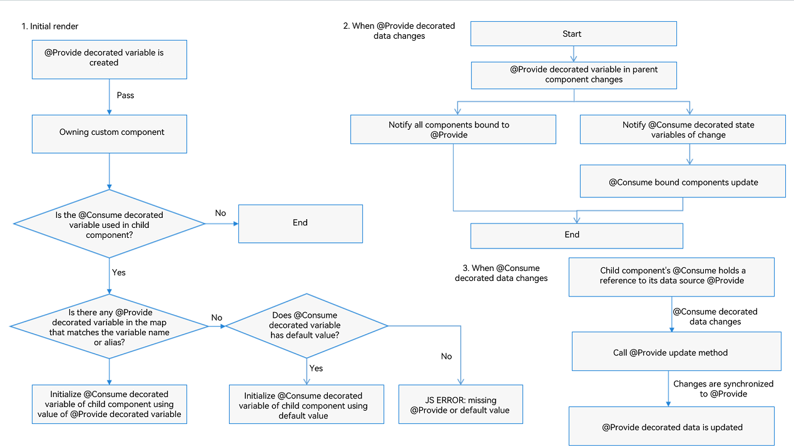

# \@Provide and \@Consume Decorators: Two-Way Synchronization with Descendant Components
<!--Kit: ArkUI-->
<!--Subsystem: ArkUI-->
<!--Owner: @liwenzhen3-->
<!--Designer: @s10021109-->
<!--Tester: @TerryTsao-->
<!--Adviser: @zhang_yixin13-->

\@Provide and \@Consume are used for two-way data synchronization with descendant components when state data needs to be transferred between multiple levels. They do not involve passing a variable from component to component multiple times.

An \@Provide decorated state variable exists in the ancestor component and is said to be "provided" to descendent components. An \@Consume decorated state variable is used in a descendent component. It is linked to ("consumes") the provided state variable in its ancestor component.

\@Provide and \@Consume are used for two-way synchronization across component levels. Before reading the @Provide and @Consume documents, it would be helpful if you have a basic understanding of the basic syntax of the UI paradigm and custom components. To build this foundational knowledge, review the following documents: [Basic Syntax Overview](./arkts-basic-syntax-overview.md), [Declarative UI Description](./arkts-declarative-ui-description.md), and [Creating a Custom Component](./arkts-create-custom-components.md). For best practices, see [State Management](https://developer.huawei.com/consumer/en/doc/best-practices/bpta-status-management).

> **NOTE**
>
> These two decorators can be used in ArkTS widgets since API version 9.
>
> These two decorators can be used in atomic services since API version 11.
>
>In API version 19 and earlier versions, @Provide and @Consume support two-way synchronization only in declarative nodes.
>
> Since API version 20, @Consume decorated variables support default value assignment. If no matching @Provide is found, the @Consume decorated variable initializes with its default value. When a matching @Provide is found, the @Consume decorated variable uses the @Provide value, and the default value is ignored.
>
> Since API version 20, you can set the [BuildOptions](../../reference/apis-arkui/js-apis-arkui-builderNode.md#buildoptions12) parameter **enableProvideConsumeCrossing** to **true** in [BuilderNode](../../reference/apis-arkui/js-apis-arkui-builderNode.md) to enable cross-[BuilderNode](../../reference/apis-arkui/js-apis-arkui-builderNode.md) two-way synchronization for \@Provide and \@Consume. Note that BuilderNode constructs nodes before adding them to the component tree. Therefore, \@Consume decorated variables defined within BuilderNode must have default values. After BuilderNode is mounted to the tree, it retrieves the latest @Provide data to establish two-way synchronization. For details, see [Using @Consume to Establish Two-Way Synchronization with @Provide Across BuilderNode Scenarios](#using-consume-to-establish-two-way-synchronization-with-provide-across-buildernode-scenarios).

## Overview

\@Provide/\@Consume decorated state variables have the following features:

- State variables decorated with @Provide are automatically available to all their descendant components, eliminating the need for manual variable passing through component hierarchies.

- A descendent component gains access to the provided state variable by decorating a variable with \@Consume. This establishes a two-way data synchronization between the provided and the consumed variable. This synchronization mechanism works similarly to \@State and \@Link combinations, but with the added benefit of spanning multiple levels in the UI parent-child hierarchy.

- \@Provide and \@Consume can be bound using the same variable name or variable alias. They must be of the same type. Otherwise, implicit type conversion occurs, causing abnormal application behavior.

```ts
// Binding through the same variable name
@Provide age: number = 0;
@Consume age: number;

// Binding through the same variable alias
@Provide('a') id: number = 0;
@Consume('a') age: number;

// Binding by matching the alias of the @Provide decorated variable with the name of the @Consume decorated variable
@Provide('a') id: number = 0;
@Consume a: number;

// Binding by matching the name of the @Provide decorated variable with the alias of the @Consume decorated variable
@Provide id: number = 0;
@Consume('id') a: number;

```
When \@Provide specifies a variable alias, both the original variable name and alias are stored. \@Consume uses its specified alias (or variable name if no alias exists) as the search key. A binding is successfully established when \@Consume's search key matches either the variable name or alias stored by \@Provide.

## Decorator Description

The rules of \@State also apply to \@Provide. The difference is that \@Provide also functions as a synchronization source for multi-layer descendants.

| \@Provide Decorator| Description                                      |
| -------------- | ---------------------------------------- |
| Parameters         | Alias: constant string, optional.|
| Synchronization type          | Two-way:<br>from the \@Provide decorated variable to all \@Consume decorated variables; and the other way around. The two-way synchronization behavior is the same as that of the combination of \@State and \@Link.|
| Allowed variable types     | Object, class, string, number, Boolean, enum, and array of these types.<br>Since API version 10, the [Date](#decorating-variables-of-the-date-type) type is supported.<br>API version 11 and later: [Map](#decorating-variables-of-the-map-type), [Set](#decorating-variables-of-the-set-type), undefined, null, union types defined by the ArkUI framework, for example, [Length](../../reference/apis-arkui/arkui-ts/ts-types.md#length), [ResourceStr](../../reference/apis-arkui/arkui-ts/ts-types.md#resourcestr), and [ResourceColor](../../reference/apis-arkui/arkui-ts/ts-types.md#resourcecolor). For details, see [Using @Provide and @Consume with Union Type Instances](#using-provide-and-consume-with-union-type-instances).<br>For details about the scenarios of supported types, see [Observed Changes](#observed-changes).|
| Disallowed variable types| Function.     |
| Initial value for the decorated variable     | Required.                                   |
| Support for the **allowOverride** parameter         | Yes. After **allowOverride** is declared, both aliases and attribute names can be overridden. For details, see [Support for the allowOverride Parameter](#support-for-the-allowoverride-parameter).|

| \@Consume Decorator| Description                                      |
| -------------- | ---------------------------------------- |
| Parameters         | Alias: constant string, optional.|
| Synchronization type          | Two-way: from the \@Provide decorated variable to all \@Consume decorated variables; and the other way around. The two-way synchronization behavior is the same as that of the combination of \@State and \@Link.|
| Allowed variable types     | Object, class, string, number, Boolean, enum, and array of these types.<br>Since API version 10, the [Date](#decorating-variables-of-the-date-type) type is supported.<br>API version 11 and later: [Map](#decorating-variables-of-the-map-type), [Set](#decorating-variables-of-the-set-type), undefined, null, union types defined by the ArkUI framework, for example, [Length](../../reference/apis-arkui/arkui-ts/ts-types.md#length), [ResourceStr](../../reference/apis-arkui/arkui-ts/ts-types.md#resourcestr), and [ResourceColor](../../reference/apis-arkui/arkui-ts/ts-types.md#resourcecolor). For details, see [Using @Provide and @Consume with Union Type Instances](#using-provide-and-consume-with-union-type-instances).<br>For details about the scenarios of supported types, see [Observed Changes](#observed-changes).<br>**NOTE**<br>Before API version 20: An \@Consume decorated variable must have a matching @Provide decorated variable with the corresponding attribute name or alias in its parent or ancestor component chain.
| Initial value for the decorated variable     | Since API version 20, \@Consume supports default values. If a matching @Provide is found, the \@Provide decorated variable value takes precedence as the initial value. For details, see [Setting Default Values for @Consume Decorated Variables](#setting-default-values-for-consume-decorated-variables).                           |

## Variable Transfer/Access Rules

| \@Provide Transfer/Access| Description                                      |
| -------------- | ---------------------------------------- |
| Initialization and update from the parent component    | Optional. An @Provide decorated variable can be initialized from a regular variable (whose change does not trigger UI refresh) or an [\@State](./arkts-state.md), [\@Link](./arkts-link.md), [\@Prop](./arkts-prop.md), \@Provide, \@Consume, [\@ObjectLink](./arkts-observed-and-objectlink.md), [\@StorageLink](./arkts-appstorage.md#storagelink), [\@StorageProp](./arkts-appstorage.md#storageprop), [\@LocalStorageLink](./arkts-localstorage.md#localstoragelink), or [\@LocalStorageProp](./arkts-localstorage.md#localstorageprop) decorated variable in its parent component.|
| Child component initialization      | Supported; can be used to initialize an \@State, \@Link, \@Prop, or \@Provide decorated variable in the child component.|
| Synchronization with the parent component        | No                                      |
| Synchronization with descendant components       | Two-way with @Consume decorated variables in descendant components.                         |
| Access from outside the component     | Private, accessible only within the component.                         |

  **Figure 1** \@Provide initialization rule 


| \@Consume Transfer/Access| Description                                      |
| -------------- | ---------------------------------------- |
| Initialization and update from the parent component    | Forbidden.     |
| Child component initialization      | Supported; can be used to initialize an \@State, \@Link, \@Prop, or \@Provide decorated variable in the child component.|
| Synchronization with the ancestor component       | Two-way with the @Provide decorated variable in the ancestor component.                         |
| Access from outside the component     | Private, accessible only within the component.                          |

  **Figure 2** \@Consume initialization rule 


## Observed Changes and Behavior

### Observed Changes

- When the decorated variable is of the Boolean, string, or number type, its value change can be observed.

- When the decorated variable is of the class or Object type, its value change and value changes of all its attributes, that is, the attributes that **Object.keys(observedObject)** returns, can be observed.

- When the decorated variable is an array, you can observe changes to the array values, array elements, and API operations performed on the array.

- When the decorated object is of the Date type, the following changes can be observed: (1) complete **Date** object reassignment; (2) property changes caused by calling **setFullYear**, **setMonth**, **setDate**, **setHours**, **setMinutes**, **setSeconds**, **setMilliseconds**, **setTime**, **setUTCFullYear**, **setUTCMonth**, **setUTCDate**, **setUTCHours**, **setUTCMinutes**, **setUTCSeconds**, or **setUTCMilliseconds**. For details, see [Decorating Variables of the Date Type](#decorating-variables-of-the-map-type).

- When the decorated variable is of the **Map** type, the following changes can be observed: (1) complete **Map** object reassignment; (2) changes caused by calling **set**, **clear**, or **delete**. For details, see [Decorating Variables of the Map Type](#decorating-variables-of-the-map-type).

- When the decorated variable is of the **Set** type, the following changes can be observed: (1) complete **Set** object reassignment; (2) changes caused by calling **add**, **clear**, or **delete**. For details, see [Decorating Variables of the Set Type](#decorating-variables-of-the-set-type).

### Framework Behavior

1. Initial rendering:
   1. The @Provide decorated variable is passed to all child components of the owning component as a map.
   2. If \@Consume decorated variables are used in child components, the framework searches the map for \@Provide decorated variables matching the variable name or alias. If no match is found: Before API version 20: A JS error is thrown. Since API version 20: The framework checks whether \@Consume has a default value; if not, a JS error is thrown.
   3. During initialization of @Consume variables, if a matching @Provide is found in the map, the process resembles \@State/\@Link initialization: \@Consume saves the \@Provide reference and registers itself with the \@Provide decorated variable.
   4. Since API version 20, if no matching \@Provide is found and \@Consume has a default value, \@Consume creates a temporary data source using the default value to maintain notification chain continuity.

2. When the \@Provide decorated variable is updated:
   1. The system traverses and updates all built-in components (**elementId**) and state variable (\@Consume) that depend on the \@Provide decorated variable, with which the \@Consume decorated variable has registered itself on initial render.  
   2. After the \@Consume decorated variable is updated in all owning child components, all built-in components (**elementId**) that depend on the \@Consume decorated variable are updated. In this way, changes to the \@Provide decorated variable are synchronized to the \@Consume decorated variable.

3. When the \@Consume decorated variable is updated:

   As can be learned from the initial render procedure, the \@Consume decorated variable holds an instance of \@Provide. After the \@Consume decorated variable is updated, the update method of \@Provide is called to synchronize the changes to \@Provide.



## Constraints

1. The **key** parameter of \@Provide and \@Consume must be of the string type. Otherwise, a compilation error is thrown.

    ```ts
    // Incorrect usage. An error is reported during compilation.
    let change: number = 10;
    @Provide(change) message: string = 'Hello';
  
    // Correct usage.
    let change: string = 'change';
    @Provide(change) message: string = 'Hello';
    ```

2. \@Consume decorated variables cannot be initialized via constructor parameters. Otherwise, a compilation error is thrown. \@Consume can only be initialized by matching corresponding \@Provide decorated variables via **key** or, since API version 20, by using default values.

    **Incorrect Usage**
  
    ```ts
    @Component
    struct Child {
      @Consume msg: string;
  
      build() {
        Text(this.msg)
      }
    }
  
    @Entry
    @Component
    struct Parent {
      @Provide message: string = 'Hello';
  
      build() {
        Column() {
          // Incorrect format. External initialization is not allowed.
          Child({msg: 'Hello'})
        }
      }
    }
    ```

    **Correct Usage**
  
    ```ts
    @Component
    struct Child {
      @Consume num: number;
      // Since API version 20, @Consume decorated variables support default values.
      @Consume num1: number = 17;
  
      build() {
        Column() {
          Text(`Value of num: ${this.num}`)
          Text(`num1 value: ${this.num1}`)
        }
      }
    }
  
    @Entry
    @Component
    struct Parent {
      @Provide num: number = 10;
  
      build() {
        Column() {
          Text(`Value of num: ${this.num}`)
          Child()
        }
      }
    }
    ```
  
3. \@When the **key** of \@Provide is defined repeatedly, the framework throws a runtime error to remind you. If you need to define the **key** repeatedly, use [allowoverride](#support-for-the-allowoverride-parameter).

    ```ts
    // Incorrect format. "a" is defined repeatedly.
    @Provide('a') count: number = 10;
    @Provide('a') num: number = 10;
  
    // Correct usage.
    @Provide('a') count: number = 10;
    @Provide('b') num: number = 10;
    ```
  
4. Before API version 20: A runtime error is thrown if no matching \@Provide decorated variable is found during \@Consume initialization. Since API version 20: A runtime error is thrown if no matching \@Provide is found and no default value is set for \@Consume.

    **Incorrect Usage**
  
    ```ts
    @Component
    struct Child {
      @Consume num: number;
  
      build() {
        Column() {
          Text(`Value of num: ${this.num}`)
        }
      }
    }
  
    @Entry
    @Component
    struct Parent {
      // Incorrect format. @Provide is missing.
      num: number = 10;
  
      build() {
        Column() {
          Text(`Value of num: ${this.num}`)
          Child()
        }
      }
    }
    ```

    **Correct Usage**
  
    ```ts
    @Component
    struct Child {
      @Consume num: number;
      // Correct usage. Since API version 20, @Consume decorated variables support default values.
      @Consume num_with_defaultValue: number = 6;
  
      build() {
        Column() {
          Text(`Value of num: ${this.num}`)
          Text(`num_with_defaultValue value: ${this.num_with_defaultValue}`)
        }
      }
    }
  
    @Entry
    @Component
    struct Parent {
      // Correct usage.
      @Provide num: number = 10;

      build() {
        Column() {
          Text(`Value of num: ${this.num}`)
          Child()
        }
      }
    }
    ```

5. \@Provide and \@Consume cannot decorate variables of the function type. Otherwise, the framework throws a runtime error.

6. Since API version 20, @Provide and @Consume support cross-BuilderNode pairing. When BuilderNode is constructed, \@Consume locates the nearest \@Provide by key matching. Both must have identical types; type mismatches result in runtime errors.
You must verify type compatibility, including class instances. For example:
```ts
class A {}
class B {}
// Both variables are objects but have different constructors, making them incompatible types.
@Provide message: A = new A();
@Consume message: B = new B();
```
In non-BuilderNode scenarios, it is recommended that you maintain identical types for \@Provide/\@Consume pairs. Although runtime validation is not strict, the \@Consume variable undergoes implicit type conversion to match the \@Provide variable type during initialization.
```ts
import { NodeController, BuilderNode, FrameNode, UIContext } from '@kit.ArkUI';

@Builder
function buildText() {
  Column() {
    Child()
  }
}

class TextNodeController extends NodeController {
  private builderNode: BuilderNode<[]> | null = null;

  constructor() {
    super();
  }

  makeNode(context: UIContext): FrameNode | null {
    this.builderNode = new BuilderNode(context);
    // Configure cross-BuilderNode support for @Provide/@Consume.
    this.builderNode.build(wrapBuilder(buildText), undefined,
      { enableProvideConsumeCrossing: true });
    // Mount the root node of the BuilderNode to the NodeContainer.
    return this.builderNode.getFrameNode();
  }
}

@Entry
@Component
struct Index {
  @Provide message: string = 'hello';
  controller: TextNodeController = new TextNodeController();

  build() {
    Column() {
      NodeContainer(this.controller)
        .width('100%')
        .height(100)
    }
    .width('100%')
    .height('100%')
  }
}


@Component
struct Child {
  // After the child component is mounted via BuilderNode, @Consume and @Provide in Index have incompatible types, causing a runtime error.
  @Consume message: number = 0;

  build() {
    Column() {
      Text(`@Consume ${this.message}`)
    }
  }
}
```

## Use Scenarios

The following example demonstrates two-way synchronization between @Provide and @Consume variables in child components. When buttons in **ToDo** and **ToDoItem** components are clicked, **count** changes are synchronized bidirectionally across both components.

```ts
@Component
struct ToDoItem {
  // The @Consume decorated variable is bound to the @Provide decorated variable in its ancestor component ToDo under the same attribute name.
  @Consume count: number;

  build() {
    Column() {
      Text(`count(${this.count})`)
      Button(`count(${this.count}), count + 1`)
        .onClick(() => this.count += 1)
    }
    .width('50%')
  }
}

@Component
struct ToDoList {
  build() {
    Row({ space: 5 }) {
      ToDoItem()
      ToDoItem()
    }
  }
}

@Component
struct ToDoDemo {
  build() {
    ToDoList()
  }
}

@Entry
@Component
struct ToDo {
  // @Provide decorated variable count is provided by the entry component ToDo to its descendants.
  @Provide count: number = 0;

  build() {
    Column() {
      Button(`count(${this.count}), count + 1`)
        .onClick(() => this.count += 1)
      ToDoDemo()
    }
  }
}
```
### Decorating Variables of the Map Type

> **NOTE**
>
> \@Provide and \@Consume support the Map type since API version 11.

In this example, the **message** variable is of the Map\<number, string\> type. When the button is clicked, the value of **message** changes, and the UI is re-rendered.

```ts
@Component
struct Child {
  @Consume message: Map<number, string>

  build() {
    Column() {
      ForEach(Array.from(this.message.entries()), (item: [number, string]) => {
        Text(`${item[0]}`)
          .fontSize(30)
        Text(`${item[1]}`)
          .fontSize(30)
        Divider()
      })
      Button('Consume init Map')
        .onClick(() => {
          this.message = new Map([[0, 'a'], [1, 'b'], [3, 'c']]);
        })
      Button('Consume set new one')
        .onClick(() => {
          this.message.set(4, 'd');
        })
      Button('Consume clear')
        .onClick(() => {
          this.message.clear();
        })
      Button('Consume replace the first item')
        .onClick(() => {
          this.message.set(0, 'aa');
        })
      Button('Consume delete the first item')
        .onClick(() => {
          this.message.delete(0);
        })
    }
  }
}


@Entry
@Component
struct MapSample {
  @Provide message: Map<number, string> = new Map([[0, 'a'], [1, 'b'], [3, 'c']])

  build() {
    Row() {
      Column() {
        Button('Provide init Map')
          .onClick(() => {
            this.message = new Map([[0, 'a'], [1, 'b'], [3, 'c'], [4, 'd']]);
          })
        Child()
      }
      .width('100%')
    }
    .height('100%')
  }
}
```

### Decorating Variables of the Set Type

> **NOTE**
>
> \@Provide and \@Consume support the Set type since API version 11.

In this example, the **message** variable is of the Set\<number\> type. When the button is clicked, the value of **message** changes, and the UI is re-rendered.

```ts
@Component
struct Child {
  @Consume message: Set<number>

  build() {
    Column() {
      ForEach(Array.from(this.message.entries()), (item: [number, number]) => {
        Text(`${item[0]}`)
          .fontSize(30)
        Divider()
      })
      Button('Consume init set')
        .onClick(() => {
          this.message = new Set([0, 1, 2, 3, 4]);
        })
      Button('Consume set new one')
        .onClick(() => {
          this.message.add(5);
        })
      Button('Consume clear')
        .onClick(() => {
          this.message.clear();
        })
      Button('Consume delete the first one')
        .onClick(() => {
          this.message.delete(0);
        })
    }
    .width('100%')
  }
}


@Entry
@Component
struct SetSample {
  @Provide message: Set<number> = new Set([0, 1, 2, 3, 4])

  build() {
    Row() {
      Column() {
        Button('Provide init set')
          .onClick(() => {
            this.message = new Set([0, 1, 2, 3, 4, 5]);
          })
        Child()
      }
      .width('100%')
    }
    .height('100%')
  }
}
```

### Decorating Variables of the Date Type

In this example, the **selectedDate** variable is of the Date type. After the button is clicked, the value of **selectedDate** changes, and the UI is re-rendered.

```ts
@Component
struct Child {
  @Consume selectedDate: Date;

  build() {
    Column() {
      Button(`child increase the day by 1`)
        .onClick(() => {
          this.selectedDate.setDate(this.selectedDate.getDate() + 1);
        })
      Button('child update the new date')
        .margin(10)
        .onClick(() => {
          this.selectedDate = new Date('2023-09-09');
        })
      DatePicker({
        start: new Date('1970-1-1'),
        end: new Date('2100-1-1'),
        selected: this.selectedDate
      })
    }
  }
}

@Entry
@Component
struct Parent {
  @Provide selectedDate: Date = new Date('2021-08-08')

  build() {
    Column() {
      Button('parent increase the day by 1')
        .margin(10)
        .onClick(() => {
          this.selectedDate.setDate(this.selectedDate.getDate() + 1);
        })
      Button('parent update the new date')
        .margin(10)
        .onClick(() => {
          this.selectedDate = new Date('2023-07-07');
        })
      DatePicker({
        start: new Date('1970-1-1'),
        end: new Date('2100-1-1'),
        selected: this.selectedDate
      })
      Child()
    }
  }
}
```

### Using @Provide and @Consume with Union Type Instances

@Provide and @Consume support union types, **undefined**, and **null** values. In the following example, **count** is of type string | undefined. When the **Button** in parent component Parent is clicked to modify the value or type of **count**, the **Child** component updates accordingly.

```ts
@Component
struct Child {
  // The @Consume decorated variable is bound to the @Provide decorated variable in its ancestor component Ancestors under the same attribute name.
  @Consume count: string | undefined;

  build() {
    Column() {
      Text(`count(${this.count})`)
      Button(`count(${this.count}), Child`)
        .onClick(() => this.count = 'Ancestors')
    }
    .width('50%')
  }
}

@Component
struct Parent {
  build() {
    Row({ space: 5 }) {
      Child()
    }
  }
}

@Entry
@Component
struct Ancestors {
  // The @Provide decorated variable count of the union type is provided by the entry component Ancestors for its descendant components.
  @Provide count: string | undefined = 'Child';

  build() {
    Column() {
      Button(`count(${this.count}), Child`)
        .onClick(() => this.count = undefined)
      Parent()
    }
  }
}
```

### Support for the allowOverride Parameter

**allowOverride** allows you to override an existing \@Provide decorated variable.

> **NOTE**
>
> This feature is supported since API version 11.

| Name  | Type  | Mandatory| Description                                                        |
| ------ | ------ | ---- | ------------------------------------------------------------ |
| allowOverride | string | No| Enables overriding for \@Provide. When you define an \@Provide decorated variable, use this parameter to override the existing variable with the same name (if any) in the same component tree. If this parameter is not used, defining a variable whose name is already in use will return an error.|

```ts
@Component
struct MyComponent {
  @Provide({allowOverride : 'reviewVotes'}) reviewVotes: number = 10;
}
```

The complete sample code is as follows:

```ts
@Component
struct GrandSon {
  // The @Consume decorated variable is bound to the @Provide decorated variable in its ancestor component under the same attribute name.
  @Consume('reviewVotes') reviewVotes: number;

  build() {
    Column() {
      Text(`reviewVotes(${this.reviewVotes})`) // The Text component displays 10.
      Button(`reviewVotes(${this.reviewVotes}), give +1`)
        .onClick(() => this.reviewVotes += 1)
    }
    .width('50%')
  }
}

@Component
struct Child {
  @Provide({ allowOverride: 'reviewVotes' }) reviewVotes: number = 10;

  build() {
    Row({ space: 5 }) {
      GrandSon()
    }
  }
}

@Component
struct Parent {
  @Provide({ allowOverride: 'reviewVotes' }) reviewVotes: number = 20;

  build() {
    Child()
  }
}

@Entry
@Component
struct GrandParent {
  @Provide('reviewVotes') reviewVotes: number = 40;

  build() {
    Column() {
      Button(`reviewVotes(${this.reviewVotes}), give +1`)
        .onClick(() => this.reviewVotes += 1)
      Parent()
    }
  }
}
```

In the preceding example:
- GrandParent declares @Provide('reviewVotes') reviewVotes: number = 40.
- Parent is a child component of GrandParent. @Provide is declared as allowOverride to override @Provide('reviewVotes') reviewVotes: number = 40 of GrandParent. If **allowOverride** is not declared, a runtime error is thrown to indicate that the @Provide decorated variable is already in use. The same case applies to **Child**.
- The @Consume decorated variable of **GrandSon** is initialized from the @Provide decorated variable of its nearest ancestor under the same attribute name.
- GrandSon finds that the @Provide with the same attribute name is in the ancestor Child. Therefore, the initialized value of @Consume('reviewVotes') reviewVotes: number is 10. If an @Provide decorated variable with the same attribute name as @Consume decorated variable is not defined in **Child**, **GrandSon** continues its search in **Parent** until it finds the one decorated by @Provide with the same attribute name, whose value is **20**.
- If no such a variable is found when **GrandSon** has reached the root node, an error is thrown to indicate that @Provide could not be found for @Consume initialization.

### Setting Default Values for @Consume Decorated Variables

> **NOTE**
>
> Since API version 20, \@Consume decorated variables support default value assignment.

```ts
@Component
struct MyComponent {
  @Consume('withDefault') defaultValue: number = 10;
}
```

The complete sample code is as follows:

```ts
@Entry
@Component
struct Parent {
  @Provide('firstKey') provideOne: string | undefined = undefined;
  @Provide('secondKey') provideTwo: string = 'the second provider';

  build(){
    Column(){
      Row(){
        Column() {
          Text(`${this.provideOne}`)
          Text(`${this.provideTwo}`)
        }

        Column(){
          // Click the change provideOne button. The provideOne and textOne attributes in the child component change at the same time.
          Button('change provideOne')
            .onClick(() => {
              this.provideOne = undefined;
            })
          // Click the change provideTwo button. The provideTwo and textTwo attributes in the child component change at the same time.
          Button('change provideTwo')
            .onClick(() => {
              this.provideTwo = 'the next provider';
            })
        }
      }

      Row(){
        Column() {
          Child()
        }
      }
    }
  }
}

@Component
struct Child {
  // @Consume decorated variables are bound to @Provide decorated variables in the ancestor using the same alias, and the default value is set.
  @Consume('firstKey') textOne: string | undefined = 'child';
  // @Consume decorated variables are bound to @Provide decorated variables in the ancestor using the same alias, and the default value is not set.
  @Consume('secondKey') textTwo: string;
  // @Consume decorated variables do not match @Provide decorated variables in the ancestor, but the default value is set.
  @Consume('thirdKey') textThree: string = 'defaultValue';

  build(){
    Column() {
      Text(`${this.textOne}`)
      Text(`${this.textTwo}`)
      Text(`${this.textThree}`)
      // When you click the change textOne button, textOne and provideOne of the parent component change at the same time.
      Button('change textOne')
        .onClick(() => {
          this.textOne = 'not undefined';
        })
      // When you click the change textTwo button, textTwo and provideTwo of the parent component change at the same time.
      Button('change textTwo')
        .onClick(() => {
          this.textTwo = 'change textTwo';
        })
    }
  }
}
```

In the preceding example:
- Parent declares @Provide('firstKey') provideOne: string | undefined = undefined and @Provide('secondKey') provideTwo: string = 'the second provider'.
- Child declares @Consume('firstKey') textOne: string | undefined = 'child', @Consume('secondKey') textTwo: string, and @Consume('thirdKey') textThree: string = 'defaultValue'.
- **Child** is a child component of **Parent**. When the three @Consume decorated variables are initialized: **textOne** binds to **provideOne** in **Parent** via alias **firstKey**. **provideOne**'s value overrides **textOne**'s default value, so **textOne** initializes to **undefined**. **textTwo** binds to **providedTwo** in **Parent** via alias **secondKey**. **textTwo** initializes to **'the second provider'**. **textThree** finds no matching @Provide in ancestor components. If it has no default value, a runtime error is thrown. With default value **'defaultValue'**, **textThree** initializes to **'defaultValue'**.
- The default value set for @Consume decorated variables takes effect only when no matching @Provide (via alias or name) is found in ancestor components.

### Using \@Consume to Establish Two-Way Synchronization with \@Provide Across BuilderNode Scenarios

> **NOTE**
>
> From API version 20, @Provide and @Consume can be paired across BuilderNodes.

\@Provide and \@Consume are supported within BuilderNode. Key considerations:
1. \@Consume variables defined in BuilderNode subtrees must have default values, or \@Provide must exist within the subtree. Otherwise, runtime errors occur.
2. After the BuilderNode is mounted to the tree, \@Consume with default values searches upward for \@Provide. Upon finding the nearest matching \@Provide by key, \@Consume establishes two-way synchronization. If no match is found, \@Consume retains its default value.
3. After the two-way synchronization relationship is established, if the value of the \@Provide decorated variable is different from the default value of \@Consume, \@Watch methods on @Consume and variables synchronized with \@Consume (for example, \@Link) are triggered.
4. When BuilderNode is unmounted from the tree, \@Consume searches for the corresponding \@Provide again. If the previously paired \@Provide is unavailable, the synchronization relationship breaks and \@Consume reverts to its default value.
5. When \@Consume disconnects from \@Provide and reverts to the default value, if the value changes from \@Provide's value to \@Consume's default, \@Watch methods on @Consume and synchronized variables are triggered.

In the following example:
1. Click **add Child**.
    - The child node Child under BuilderNode is constructed. \@Consume in Child does not find \@Provide and uses the local default value **default value** for initialization.
    - When BuilderNode is mounted to the tree, \@Consume in Child finds the nearest \@Provide in Index, updates the value of \@Consume from the default value to the value of \@Provide, and triggers the \@Watch method of \@Consume.
2. After \@Provide and \@Consume are paired, a two-way synchronization relationship is established. Click either **Text(@Provide: ${this.message})** or **Text(@Consume ${this.message})**. Both **Text** components bound to \@Provide and \@Consume will refresh. In addition, the \@Watch methods on both \@Provide and \@Consume are triggered.
3. Click **remove Child**. The child node under BuilderNode is removed from the tree. \@Consume in Child is disconnected from \@Provide in Index, \@Consume in Child is restored to the default value, and the \@Watch method of \@Consume is triggered.
4. Click **dispose Child** to release the child node under BuilderNode. The child node Child under BuilderNode is destroyed, and aboutToDisappear is executed.

```ts
import { NodeController, BuilderNode, FrameNode, UIContext } from '@kit.ArkUI';

@Builder
function buildText() {
  Column() {
    Child()
  }
}

class TextNodeController extends NodeController {
  private rootNode: FrameNode | null = null;
  private uiContext: UIContext | null = null;
  private builderNode: BuilderNode<[]> | null = null;

  constructor() {
    super();
  }

  makeNode(context: UIContext): FrameNode | null {
    this.rootNode = new FrameNode(context);
    this.uiContext = context;
    // Mount rootNode to NodeContainer.
    return this.rootNode;
  }

  addBuilderNode(): void {
    if (this.builderNode === null && this.uiContext && this.rootNode) {
      this.builderNode = new BuilderNode(this.uiContext);
      // Configure cross-BuilderNode support for @Provide/@Consume.
      this.builderNode.build(wrapBuilder(buildText), undefined,
        { enableProvideConsumeCrossing: true });
      // Mount the root node of BuilderNode to rootNode.
      this.rootNode.appendChild(this.builderNode.getFrameNode());
    }
  }

  removeBuilderNode(): void {
    if (this.rootNode && this.builderNode) {
      // Remove the BuildNode node from rootNode.
      this.rootNode.removeChild(this.builderNode.getFrameNode());
    }
  }

  disposeNode(): void {
    if (this.rootNode && this.builderNode) {
      // Release the current BuilderNode immediately.
      this.builderNode.dispose();
    }
  }
}

@Entry
@Component
struct Index {
  @Provide @Watch('onChange') message: string = 'hello';
  controller: TextNodeController = new TextNodeController();

  onChange() {
    console.info(`Index Provide change ${this.message}`);
  }

  build() {
    Column() {
      Text(`@Provide: ${this.message}`)
        .fontSize(20)
        .onClick(() => {
          this.message += ' Provide';
        })

      // Execute the build method of BuilderNode to construct the Child component.
      // Mount BuilderNode to NodeContainer.
      // @Consume in Child can be paired with @Provide in Index.
      // The message variable decorated with @Consume changes from the default value to hello, and the @Watch method decorated with @Consume is triggered.
      Button('add Child')
        .onClick(() => {
          this.controller.addBuilderNode();
        })
      // Remove the nodes under BuilderNode from NodeContainer.
      // The message variable decorated with @Consume changes from the value paired with @Provide to the default value, and the @Watch method decorated with @Consume is called back.
      Button('remove Child')
        .onClick(() => {
          this.controller.removeBuilderNode();
        })

      // Release the current BuilderNode immediately. Nodes under BuilderNode are destroyed, and the Child component executes aboutToDisappear.
      Button('dispose Child')
        .onClick(() => {
          this.controller.disposeNode();
        })
      NodeContainer(this.controller)
        .width('100%')
        .height(100)
        .backgroundColor(Color.Pink)
    }
    .width('100%')
    .height('100%')
  }
}


@Component
struct Child {
  @Consume @Watch('onChange') message: string = 'default value';

  onChange() {
    console.info(`Child Consume change ${this.message}`);
  }

  aboutToDisappear(): void {
    console.info(`Child aboutToDisappear`);
  }

  build() {
    Column() {
      Text(`@Consume ${this.message}`)
        .fontSize(20)
        .onClick(() => {
          this.message += ' Consume';
        })
    }
  }
}
```

## FAQs

### \@Provide Not Defined Error in the Case of a \@BuilderParam Trailing Closure

In the [trailing closure](arkts-builderparam.md#component-initialization-through-trailing-closure) scenario, when **CustomWidget** executes **this.builder()** to create its child component **CustomWidgetChild**, the **this** keyword points to the parent component **HomePage** (not **CustomWidget** itself). As such, the \@Provide decorated variable declared in **CustomWidget** cannot be found, and an error is thrown. For this reason, exercise caution when using the **this** keyword with \@BuilderParam.

Incorrect usage:

```ts
class Tmp {
  a: string = '';
}

@Entry
@Component
struct HomePage {
  // Error point 1: @Provide is not declared for HomePage.
  @Builder
  builder2($$: Tmp) {
    Text(`${$$.a}test`)
  }

  build() {
    Column() {
      // Error point 2: Using closure to pass CustomWidgetChild creation function to CustomWidget. The this keyword in the closure points to HomePage.
      CustomWidget() {
        CustomWidgetChild({ builder: this.builder2 })
      }
    }
  }
}

@Component
struct CustomWidget {
  // Error point 3: @Provide variable declared in CustomWidget. Only CustomWidget and its child components can consume this variable.
  @Provide('a') a: string = 'abc';
  @BuilderParam
  builder: () => void;

  build() {
    Column() {
      Button('Hello').onClick(() => {
        if (this.a == 'ddd') {
          this.a = 'abc';
        }
        else {
          this.a = 'ddd';
        }

      })
      this.builder()
    }
  }
}

@Component
struct CustomWidgetChild {
  // Error point 4: Attempting to consume @Provide('a') from CustomWidget. However, CustomWidgetChild's parent component is HomePage, and the corresponding @Provide cannot be found.
  @Consume('a') a: string;
  @BuilderParam
  builder: ($$: Tmp) => void;

  build() {
    Column() {
      this.builder({ a: this.a })
    }
  }
}
```

Correct usage:

```ts
class Tmp {
  name: string = '';
}

@Entry
@Component
struct HomePage {
  // Correction point 1: Declare @Provide in the Entry component (root scope) to ensure that child components can consume @Provide correctly.
  @Provide('name') name: string = 'abc';

  @Builder
  builder2($$: Tmp) {
    Text(`${$$.name} test`)
  }

  build() {
    Column() {
      Button('Hello').onClick(() => {
        if (this.name == 'ddd') {
          this.name = 'abc';
        } else {
          this.name = 'ddd';
        }
      })
      // Correction point 2: CustomWidget acts as a container without declaring @Provide, only forwarding the builder.
      CustomWidget() {
        CustomWidgetChild({ builder: this.builder2 })
      }
    }
  }
}

@Component
struct CustomWidget {
  @BuilderParam
  builder: () => void;

  build() {
    this.builder()
  }
}

@Component
struct CustomWidgetChild {
  // Correction point 3: @Consume correctly obtains @Provide('name') from the root scope (HomePage).
  @Consume('name') name: string;
  @BuilderParam
  builder: ($$: Tmp) => void;

  build() {
    Column() {
      this.builder({ name: this.name })
    }
  }
}
```

### Using the a.b(this.object) Pattern Fails to Trigger UI Re-rendering

In the **build** method, when the variable decorated by @Provide and @Consume is of the object type and is called using the **a.b(this.object)** format, the original object of **this.object** is passed in the b method. If the property of **this.object** is changed, the UI cannot be re-rendered. In the following example, the UI re-render is not triggered when **this.dog.age** and **this.dog.name** in the component is changed by using a static method or using **this** to call the internal method of the component.

**Incorrect Usage**

```ts
class Animal {
  name:string;
  type:string;
  age: number;

  constructor(name:string, type:string, age:number) {
    this.name = name;
    this.type = type;
    this.age = age;
  }

  static changeName(animal:Animal) {
    animal.name = 'Jack';
  }
  static changeAge(animal:Animal) {
    animal.age += 1;
  }
}

@Entry
@Component
struct Zoo {
  @Provide dog:Animal = new Animal('WangCai', 'dog', 2);

  changeZooDogAge(animal:Animal) {
    animal.age += 2;
  }

  build() {
    Column({ space:10 }) {
      Text(`Zoo: This is a ${this.dog.age}-year-old ${this.dog.type} named ${this.dog.name}.`)
        .fontColor(Color.Red)
        .fontSize(30)
      Button('changeAge')
        .onClick(()=>{
          // Static method calls will not trigger UI re-rendering.
          Animal.changeAge(this.dog);
        })
      Button('changeZooDogAge')
        .onClick(()=>{
          // Internal component method calls using this will not trigger UI re-rendering.
          this.changeZooDogAge(this.dog);
        })
      ZooChild()
    }
  }
}

@Component
struct ZooChild {

  build() {
    Column({ space:10 }) {
      Text(`ZooChild`)
        .fontColor(Color.Blue)
        .fontSize(30)
      ZooGrandChild()
    }
  }
}

@Component
struct ZooGrandChild {
  @Consume dog:Animal;

  changeZooGrandChildName(animal:Animal) {
    animal.name = 'Marry';
  }

  build() {
    Column({ space:10 }) {
      Text(`ZooGrandChild: This is a ${this.dog.age}-year-old ${this.dog.type} named ${this.dog.name}.`)
        .fontColor(Color.Yellow)
        .fontSize(30)
      Button('changeName')
        .onClick(()=>{
          // Static method calls will not trigger UI re-rendering.
          Animal.changeName(this.dog);
        })
      Button('changeZooGrandChildName')
        .onClick(()=>{
          // Internal component method calls using this will not trigger UI re-rendering.
          this.changeZooGrandChildName(this.dog);
        })
    }
  }
}
```

You can preserve the proxy for **this.dog** to trigger UI re-rendering by assigning a value to the variable and then accessing it.

**Correct Usage**

```ts
class Animal {
  name:string;
  type:string;
  age: number;

  constructor(name:string, type:string, age:number) {
    this.name = name;
    this.type = type;
    this.age = age;
  }

  static changeName(animal:Animal) {
    animal.name = 'Jack';
  }
  static changeAge(animal:Animal) {
    animal.age += 1;
  }
}

@Entry
@Component
struct Zoo {
  @Provide dog:Animal = new Animal('WangCai', 'dog', 2);

  changeZooDogAge(animal:Animal) {
    animal.age += 2;
  }

  build() {
    Column({ space:10 }) {
      Text(`Zoo: This is a ${this.dog.age}-year-old ${this.dog.type} named ${this.dog.name}.`)
        .fontColor(Color.Red)
        .fontSize(30)
      Button('changeAge')
        .onClick(()=>{
          // Preserve the proxy by assigning a value to a temporary variable.
          let newDog = this.dog;
          Animal.changeAge(newDog);
        })
      Button('changeZooDogAge')
        .onClick(()=>{
          // Preserve the proxy by assigning a value to a temporary variable.
          let newDog = this.dog;
          this.changeZooDogAge(newDog);
        })
      ZooChild()
    }
  }
}

@Component
struct ZooChild {

  build() {
    Column({ space:10 }) {
      Text(`ZooChild.`)
        .fontColor(Color.Blue)
        .fontSize(30)
      ZooGrandChild()
    }
  }
}

@Component
struct ZooGrandChild {
  @Consume dog:Animal;

  changeZooGrandChildName(animal:Animal) {
    animal.name = 'Marry';
  }

  build() {
    Column({ space:10 }) {
      Text(`ZooGrandChild: This is a ${this.dog.age}-year-old ${this.dog.type} named ${this.dog.name}.`)
        .fontColor(Color.Yellow)
        .fontSize(30)
      Button('changeName')
        .onClick(()=>{
          // Preserve the proxy by assigning a value to a temporary variable.
          let newDog = this.dog;
          Animal.changeName(newDog);
        })
      Button('changeZooGrandChildName')
        .onClick(()=>{
          // Preserve the proxy by assigning a value to a temporary variable.
          let newDog = this.dog;
          this.changeZooGrandChildName(newDog);
        })
    }
  }
}
```
