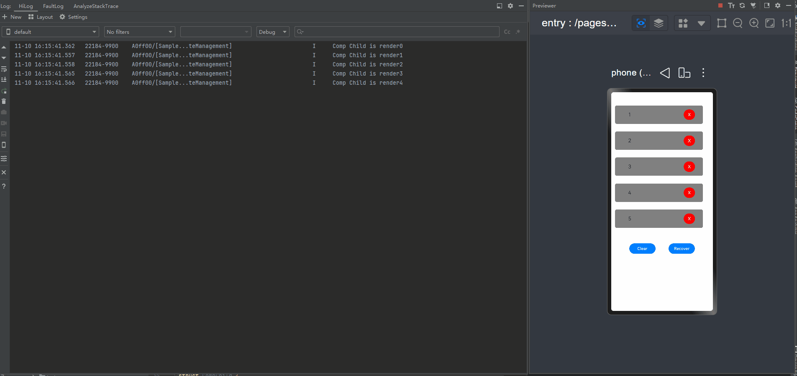

# Data Object State Management FAQs
<!--Kit: ArkUI-->
<!--Subsystem: ArkUI-->
<!--Owner: @zany_pink-->
<!--Designer: @s10021109-->
<!--Tester: @zhangwenhan12-->
<!--Adviser: @zhang_yixin13-->

A large number of data objects need to be encapsulated in large-scale applications. The use of internal status variables of data objects greatly affects the development efficiency of developers. This document describes common problems and solutions of data object status management.

In state management, a class is wrapped by a layer of "proxy." When a member variable of a class is modified, the agent intercepts the operation and performs the following tasks:

- Update the data source synchronously to ensure that the original data is correctly modified.
- Trigger UI refresh: Instruct all components that depend on this variable to re-render.

You can use the [getTarget](./arkts-new-getTarget.md) API to obtain the original object and use the following method to determine whether the object is wrapped by the state manager. If the expression result is **false**, the value is an object wrapped by the status management module. Otherwise, the value is not an object wrapped by the status management module.

``` ts
UIUtils.getTarget(value) === value
```

## Capturing this in constructor() Fails to Observe Variable Changes

When the [arrow function](../../quick-start/introduction-to-arkts.md#arrow-function-lambda-function) for modifying **success** is initialized in the constructor(), the **TestModel** instance is not encapsulated, and **this** points to the **TestModel** instance itself. Therefore, when the **query** event is triggered, state management cannot observe the change.

When you place the arrow function for modifying **success** in the **query** method, the **TestModel** object has been initialized and encapsulated by the proxy. Call **this.viewModel.query()** and **this** in the function points to the **viewModel** object. In this case, the change of **isSuccess** is observable, so that the change of the query event can be observed by the state management.

**Incorrect Usage**
<!-- @[state_problem_this_unable_observe_opposite](https://gitcode.com/openharmony/applications_app_samples/blob/master/code/DocsSample/ArkUISample/ParadigmStateManagement/entry/src/main/ets/pages/state/StateProblemThisUnableObserveOpposite.ets) --> 

``` TypeScript
import { hilog } from '@kit.PerformanceAnalysisKit';

@Entry
@Component
struct Index {
  @State viewModel: TestModel = new TestModel();

  build() {
    Row() {
      Column() {
        Text(this.viewModel.isSuccess ? 'success' : 'failed')
          .fontSize(50)
          .fontWeight(FontWeight.Bold)
          .onClick(() => {
            this.viewModel.query();
          })
      }.width('100%')
    }.height('100%')
  }
}

export class TestModel {
  public isSuccess: boolean = false;
  public model: Model

  constructor() {
    this.model = new Model(() => {
      this.isSuccess = true;
      hilog.info(0xFF00, 'testTag', '%{public}s', `this.isSuccess: ${this.isSuccess}`);
    })
  }

  query() {
    this.model.query();
  }
}

export class Model {
  public callback: () => void

  constructor(cb: () => void) {
    this.callback = cb;
  }

  query() {
    this.callback();
  }
}
```

In the preceding example, the state variable is modified in the constructor. Initially, **"failed"** is displayed. After the text is clicked, the log **"this.isSuccess: true"** is printed, indicating the modification succeeds. However, **"failed"** remains displayed, indicating the UI is not refreshed.

**Correct Usage**
<!-- @[state_problem_this_unable_observe_positive](https://gitcode.com/openharmony/applications_app_samples/blob/master/code/DocsSample/ArkUISample/ParadigmStateManagement/entry/src/main/ets/pages/state/StateProblemThisUnableObservePositive.ets) --> 

``` TypeScript
@Entry
@Component
struct Index {
  @State viewModel: TestModel = new TestModel();

  build() {
    Row() {
      Column() {
        Text(this.viewModel.isSuccess ? 'success' : 'failed')
          .fontSize(50)
          .fontWeight(FontWeight.Bold)
          .onClick(() => {
            this.viewModel.query();
          })
      }.width('100%')
    }.height('100%')
  }
}

export class TestModel {
  public isSuccess: boolean = false;
  public model: Model = new Model(() => {
  })

  query() {
    this.model.callback = () => {
      this.isSuccess = true;
    }
    this.model.query();
  }
}

export class Model {
  public callback: () => void

  constructor(cb: () => void) {
    this.callback = cb;
  }

  query() {
    this.callback();
  }
}
```

In the preceding example, the state variable is changed through a method of the class. After the button is clicked, the page content changes from "failed" to "success."

## Failure to Change a State Variable Using an Arrow Function

Changing the state variable in an arrow function does not trigger UI update. This is because the **this** object in the arrow function body is the object to which the scope where the function is defined points, not the object to which the scope where the function is called points. Therefore, in this scenario, **this** of **changeCoverUrl** points to **PlayDetailViewModel** instead of the status variable itself.

**Incorrect Usage**
<!-- @[play_detail_opposite_model](https://gitcode.com/openharmony/applications_app_samples/blob/master/code/DocsSample/ArkUISample/ParadigmStateManagement/entry/src/main/ets/pages/state/playDetailPageOpposite/PlayDetailViewModel.ets) --> 

``` TypeScript
export default class PlayDetailViewModel {
  public coverUrl: string = '#00ff00';
  public changeCoverUrl = () => {
    this.coverUrl = '#00F5FF';
  }
}
```

<!-- @[state_problem_arrow_function_opposite](https://gitcode.com/openharmony/applications_app_samples/blob/master/code/DocsSample/ArkUISample/ParadigmStateManagement/entry/src/main/ets/pages/state/playDetailPageOpposite/PlayDetailPage.ets) -->  

``` TypeScript
import PlayDetailViewModel from './PlayDetailViewModel';

@Entry
@Component
struct PlayDetailPage {
  @State vm: PlayDetailViewModel = new PlayDetailViewModel();

  build() {
    Stack() {
      Text(this.vm.coverUrl)
        .width(100)
        .height(100)
        .backgroundColor(this.vm.coverUrl)
      Row() {
        Button('Change Color')
          .onClick(() => {
            this.vm.changeCoverUrl();
          })
      }
    }
    .width('100%')
    .height('100%')
    .alignContent(Alignment.Top)
  }
}
```

Solution: Transfer the proxy object of the status variable to the arrow function and call the proxy attribute to assign a value.

**Correct Usage**

<!-- @[play_detail_positive_model](https://gitcode.com/openharmony/applications_app_samples/blob/master/code/DocsSample/ArkUISample/ParadigmStateManagement/entry/src/main/ets/pages/state/playDetailPagePositive/PlayDetailViewModel.ets) --> 

``` TypeScript
export default class PlayDetailViewModel {
  public coverUrl: string = '#00ff00';
  public changeCoverUrl = (model: PlayDetailViewModel) => {
    model.coverUrl = '#00F5FF';
  }
}
```

<!-- @[state_problem_arrow_function_positive](https://gitcode.com/openharmony/applications_app_samples/blob/master/code/DocsSample/ArkUISample/ParadigmStateManagement/entry/src/main/ets/pages/state/playDetailPagePositive/PlayDetailPage.ets) -->

``` TypeScript
import PlayDetailViewModel from './PlayDetailViewModel';

@Entry
@Component
struct PlayDetailPage {
  @State vm: PlayDetailViewModel = new PlayDetailViewModel();

  build() {
    Stack() {
      Text(this.vm.coverUrl)
        .width(100)
        .height(100)
        .backgroundColor(this.vm.coverUrl)
      Row() {
        Button('Change Color')
          .onClick(() => {
            let self = this.vm;
            this.vm.changeCoverUrl(self);
          })
      }
    }
    .width('100%')
    .height('100%')
    .alignContent(Alignment.Top)
  }
}
```

## Redundant Updates

### Redundant Updates Due to Simple Attribute Arrays

It is commonplace in development to set the same attribute for multiple components, for example, the text content, width, or height attributes. It is a simple and convenient method to save these attributes in an array and use them together with [ForEach](../rendering-control/arkts-rendering-control-foreach.md). However, this method will cause redundant refreshing of attribute elements. If an attribute element in the array is modified, the components bound to all elements in the array will be refreshed.

**Incorrect Usage**

<!-- @[TextComponent1_start](https://gitcode.com/openharmony/applications_app_samples/blob/master/code/DocsSample/ArkUISample/statemanagementproject/entry/src/main/ets/pages/statemanagementguide/StateArray.ets) -->  

``` TypeScript
import { hilog } from '@kit.PerformanceAnalysisKit';

const DOMAIN_NUMBER: number = 0XFF00;
const TAG: string = '[Sample_StateManagement]';

@Entry
@Component
struct Index {
  @State items: string[] = [];
  @State ids: string[] = [];
  @State age: number[] = [];
  @State gender: string[] = [];

  aboutToAppear() {
    this.items.push('Head');
    this.items.push('List');
    for (let i = 0; i < 20; i++) {
      this.ids.push('id: ' + Math.floor(Math.random() * 1000));
      this.age.push(Math.floor(Math.random() * 100 % 40));
      this.gender.push(Math.floor(Math.random() * 100) % 2 == 0 ? 'Male' : 'Female');
    }
  }

  isRenderText(index: number): number {
    hilog.info(DOMAIN_NUMBER, TAG, `index ${index} is rendered`);
    return 1;
  }

  build() {
    Row() {
      Column() {
        ForEach(this.items, (item: string) => {
          if (item == 'Head') {
            Text('Personal Info')
              .fontSize(40)
          } else if (item == 'List') {
            List() {
              ForEach(this.ids, (id: string, index) => {
                ListItem() {
                  Row() {
                    Text(id)
                      .fontSize(20)
                      .margin({
                        left: 30,
                        right: 5
                      })
                    Text('age: ' + this.age[index as number])
                      .fontSize(20)
                      .margin({
                        left: 5,
                        right: 5
                      })
                      .position({ x: 100 })
                      .opacity(this.isRenderText(index))
                      .onClick(() => {
                        this.age[index]++;
                      })
                    Text('gender: ' + this.gender[index as number])
                      .margin({
                        left: 5,
                        right: 5
                      })
                      .position({ x: 180 })
                      .fontSize(20)
                  }
                }
                .margin({
                  top: 5,
                  bottom: 5
                })
              })
            }
          }
        })
      }
    }
  }
}
```


Below you can see how the preceding code snippet works.


In this example, a total of 20 records are displayed on the page through **ForEach**. When you click the **Text** component of **age** in one of the records, the **Text** components of **age** in other 19 records are also re-rendered - reflected by the logs generated for the components of **age**. However, because the **age** values of the other 19 records do not change, the re-rendering of these records is actually redundant.

This redundant re-rendering is due to a characteristic of state management. Assume that there is a [@State](./arkts-state.md) decorated number array **Num[]**. This array contains 20 elements whose values are 0 to 19, respectively. Each of the 20 elements is bound to a **Text** component. When one of the elements is changed, all components bound to the elements are re-rendered, regardless of whether the other elements are changed or not.

This seemly bug, commonly known as "redundant re-render", is widely observed in simple array, and can adversely affect the UI re-rendering performance when the arrays are large. To make your rendering process run smoothly, it is crucial to reduce redundant re-renders and update components only when necessary.

In the case of an array of simple attributes, you can avoid redundant re-rendering by converting the array into an object array.

**Correct Usage**

<!-- @[Information_start](https://gitcode.com/openharmony/applications_app_samples/blob/master/code/DocsSample/ArkUISample/statemanagementproject/entry/src/main/ets/pages/statemanagementguide/StateArrayUpdate.ets) -->  

``` TypeScript
import { hilog } from '@kit.PerformanceAnalysisKit';

const DOMAIN_NUMBER: number = 0XFF00;
const TAG: string = '[Sample_StateManagement]';

@Observed
class InfoList extends Array<Info> {
};

@Observed
class Info {
  public ids: number;
  public age: number;
  public gender: string;

  constructor() {
    this.ids = Math.floor(Math.random() * 1000);
    this.age = Math.floor(Math.random() * 100 % 40);
    this.gender = Math.floor(Math.random() * 100) % 2 == 0 ? 'Male' : 'Female';
  }
}

@Component
struct Information {
  @ObjectLink info: Info;
  @State index: number = 0;

  isRenderText(index: number): number {
    hilog.info(DOMAIN_NUMBER, TAG, `index ${index} is rendered`);
    return 1;
  }

  build() {
    Row() {
      Text('id: ' + this.info.ids)
        .fontSize(20)
        .margin({
          left: 30,
          right: 5
        })
      Text('age: ' + this.info.age)
        .fontSize(20)
        .margin({
          left: 5,
          right: 5
        })
        .position({ x: 100 })
        .opacity(this.isRenderText(this.index))
        .onClick(() => {
          this.info.age++;
        })
      Text('gender: ' + this.info.gender)
        .margin({
          left: 5,
          right: 5
        })
        .position({ x: 180 })
        .fontSize(20)
    }
  }
}

@Entry
@Component
struct Page {
  @State infoList: InfoList = new InfoList();
  @State items: string[] = [];

  aboutToAppear() {
    this.items.push('Head');
    this.items.push('List');
    for (let i = 0; i < 20; i++) {
      this.infoList.push(new Info()); // The object array is used to replace the original multiple attribute arrays.
    }
  }

  build() {
    Row() {
      Column() {
        ForEach(this.items, (item: string) => {
          if (item == 'Head') {
            Text('Personal Info')
              .fontSize(40)
          } else if (item == 'List') {
            List() {
              ForEach(this.infoList, (info: Info, index) => {
                ListItem() {
                  Information({
                    info: info,
                    index: index
                  })
                }
                .margin({
                  top: 5,
                  bottom: 5
                })
              })
            }
          }
        })
      }
    }
  }
}
```

Below you can see how the preceding code snippet works.


After optimization, an object array is used in place of the original attribute arrays. For an array, changes in an object cannot be observed and therefore do not cause re-renders. Specifically, only changes at the top level of array items can be observed, for example, adding, modifying, or deleting an item. For a common array, modifying a data item means to change the item's value. For an object array, it means to assign a new value to the entire object, which means that changes to a property in an object are not observable to the array and consequently do not cause a re-render. In the observation capability of current status management, changes cannot be observed in scenarios where objects are nested in arrays. For details, see [Redundant Updates Caused by Objects with Multiple Attributes](#redundant-updates-caused-by-objects-with-multiple-attributes). When the code is modified, the combination of the customized component and ForEach is used. For details, see [UI Is Not Refreshed Due to the Combination of ForEach and Object Arrays](./arkts-state-management-faq-inner-component.md#ui-is-not-refreshed-due-to-the-combination-of-foreach-and-object-arrays).

### Redundant Updates Caused by Objects with Multiple Attributes

> **NOTE**
>
> You are advised to use the [@Track](arkts-track.md) decorator in this scenario since API version 11.

During development, we sometimes define a large object that contains many style-related properties, and pass the object between parent and child components to bind the properties to the components. This method causes redundant update of class attributes. If a class attribute is modified, all components bound to the attribute in the class are updated.

**Incorrect Usage**

<!-- @[StateArrayBig_start](https://gitcode.com/openharmony/applications_app_samples/blob/master/code/DocsSample/ArkUISample/statemanagementproject/entry/src/main/ets/pages/statemanagementguide/StateArrayBig.ets) -->  

``` TypeScript
import { hilog } from '@kit.PerformanceAnalysisKit';

const DOMAIN_NUMBER: number = 0XFF00;
const TAG: string = '[Sample_StateManagement]';

@Observed
class UiStyle {
  public translateX: number = 0;
  public translateY: number = 0;
  public scaleX: number = 0.3;
  public scaleY: number = 0.3;
  public width: number = 336;
  public height: number = 178;
  public posX: number = 10;
  public posY: number = 50;
  public alpha: number = 0.5;
  public borderRadius: number = 24;
  public imageWidth: number = 78;
  public imageHeight: number = 78;
  public translateImageX: number = 0;
  public translateImageY: number = 0;
  public fontSize: number = 20;
}

@Component
struct SpecialImage {
  @ObjectLink uiStyle: UiStyle;

  private isRenderSpecialImage(): number { // A function indicating whether the component is rendered.
    hilog.info(DOMAIN_NUMBER, TAG, 'SpecialImage is rendered');
    return 1;
  }

  build() {
    Image($r('app.media.icon')) // 'app.media.icon' is only an example. Replace it with the actual one in use. Otherwise, the imageSource instance fails to be created, and subsequent operations cannot be performed.
      .width(this.uiStyle.imageWidth)
      .height(this.uiStyle.imageHeight)
      .margin({ top: 20 })
      .translate({
        x: this.uiStyle.translateImageX,
        y: this.uiStyle.translateImageY
      })
      .opacity(this.isRenderSpecialImage()) // If the image is re-rendered, this function will be called.
  }
}

@Component
struct PageChild {
  @ObjectLink uiStyle: UiStyle;

  // The following function is used to display whether the component is rendered.
  private isRenderColumn(): number {
    hilog.info(DOMAIN_NUMBER, TAG, 'Column is rendered');
    return 1;
  }

  private isRenderStack(): number {
    hilog.info(DOMAIN_NUMBER, TAG, 'Stack is rendered');
    return 1;
  }

  private isRenderImage(): number {
    hilog.info(DOMAIN_NUMBER, TAG, 'Image is rendered');
    return 1;
  }

  private isRenderText(): number {
    hilog.info(DOMAIN_NUMBER, TAG, 'Text is rendered');
    return 1;
  }

  build() {
    Column() {
      SpecialImage({
        uiStyle: this.uiStyle
      })
      Stack() {
        Column() {
          Image($r('app.media.icon')) // 'app.media.icon' is only an example. Replace it with the actual one in use. Otherwise, the imageSource instance fails to be created, and subsequent operations cannot be performed.
            .opacity(this.uiStyle.alpha)
            .scale({
              x: this.uiStyle.scaleX,
              y: this.uiStyle.scaleY
            })
            .padding(this.isRenderImage())
            .width(300)
            .height(300)
        }
        .width('100%')
        .position({ y: -80 })

        Stack() {
          Text('Hello World')
            .fontColor('#182431')
            .fontWeight(FontWeight.Medium)
            .fontSize(this.uiStyle.fontSize)
            .opacity(this.isRenderText())
            .margin({ top: 12 })
        }
        .opacity(this.isRenderStack())
        .position({
          x: this.uiStyle.posX,
          y: this.uiStyle.posY
        })
        .width('100%')
        .height('100%')
      }
      .margin({ top: 50 })
      .borderRadius(this.uiStyle.borderRadius)
      .opacity(this.isRenderStack())
      .backgroundColor('#FFFFFF')
      .width(this.uiStyle.width)
      .height(this.uiStyle.height)
      .translate({
        x: this.uiStyle.translateX,
        y: this.uiStyle.translateY
      })

      Column() {
        Button('Move')
          .width(312)
          .fontSize(20)
          .backgroundColor('#FF007DFF')
          .margin({ bottom: 10 })
          .onClick(() => {
            this.getUIContext().animateTo({
              duration: 500
            }, () => {
              this.uiStyle.translateY = (this.uiStyle.translateY + 180) % 250;
            });
          })
        Button('Scale')
          .borderRadius(20)
          .backgroundColor('#FF007DFF')
          .fontSize(20)
          .width(312)
          .onClick(() => {
            this.uiStyle.scaleX = (this.uiStyle.scaleX + 0.6) % 0.8;
          })
      }
      .position({
        y: 666
      })
      .height('100%')
      .width('100%')

    }
    .opacity(this.isRenderColumn())
    .width('100%')
    .height('100%')

  }
}

@Entry
@Component
struct Page {
  @State uiStyle: UiStyle = new UiStyle();

  build() {
    Stack() {
      PageChild({
        uiStyle: this.uiStyle
      })
    }
    .backgroundColor('#F1F3F5')
  }
}
```


Below you can see how the preceding code snippet works.


The following figure shows the [duration](../ui-inspector-profiler.md#trace-debugging-capability) of dirty node update after the move button is clicked before optimization.


In the above example, **UiStyle** defines multiple properties, each associated with different components. When some of these properties are changed at the click of a button, all the components associated with **uiStyle** are re-rendered, even though they do not need to (because the properties of these components are not changed). The re-renders of these components can be observed through a series of defined **isRender** functions. When **Move** is clicked to perform the translation animation, the value of **translateY** changes multiple times. As a result, redundant re-renders occur at each frame, which greatly worsen the application performance.

Such redundant re-renders result from an update mechanism of the state management: If multiple properties of a class are bound to different components through an object of the class, then, if any of the properties is changed, the component associated with the property is re-rendered, together with components associated with the other properties, even though the other properties do not change.

Naturally, this update mechanism brings down the re-rendering performance, especially in the case of a large, complex object associated with a considerable number of components. To fix this issue, split a large, complex object into a set of multiple small objects. In this way, redundant re-renders are reduced and the render scope precisely controlled, while the original code structure is retained.

**Correct Usage**

<!-- @[StateArrayPrecise_start](https://gitcode.com/openharmony/applications_app_samples/blob/master/code/DocsSample/ArkUISample/statemanagementproject/entry/src/main/ets/pages/statemanagementguide/StateArrayPrecise.ets) --> 

``` TypeScript
import { hilog } from '@kit.PerformanceAnalysisKit';

const DOMAIN_NUMBER: number = 0XFF00;
const TAG: string = '[Sample_StateManagement]';

@Observed
class NeedRenderImage { // Properties used in the same component can be classified into the same class.
  public translateImageX: number = 0;
  public translateImageY: number = 0;
  public imageWidth: number = 78;
  public imageHeight: number = 78;
}

@Observed
class NeedRenderScale { // Properties used together can be classified into the same class.
  public scaleX: number = 0.3;
  public scaleY: number = 0.3;
}

@Observed
class NeedRenderAlpha { // Properties used separately can be classified into the same class.
  public alpha: number = 0.5;
}

@Observed
class NeedRenderSize { // Properties used together can be classified into the same class.
  public width: number = 336;
  public height: number = 178;
}

@Observed
class NeedRenderPos { // Properties used together can be classified into the same class.
  public posX: number = 10;
  public posY: number = 50;
}

@Observed
class NeedRenderBorderRadius { // Properties used separately can be classified into the same class.
  public borderRadius: number = 24;
}

@Observed
class NeedRenderFontSize { // Properties used separately can be classified into the same class.
  public fontSize: number = 20;
}

@Observed
class NeedRenderTranslate { // Properties used together can be classified into the same class.
  public translateX: number = 0;
  public translateY: number = 0;
}

@Observed
class UiStyle {
  // Use the NeedRenderxxx class.
  public needRenderTranslate: NeedRenderTranslate = new NeedRenderTranslate();
  public needRenderFontSize: NeedRenderFontSize = new NeedRenderFontSize();
  public needRenderBorderRadius: NeedRenderBorderRadius = new NeedRenderBorderRadius();
  public needRenderPos: NeedRenderPos = new NeedRenderPos();
  public needRenderSize: NeedRenderSize = new NeedRenderSize();
  public needRenderAlpha: NeedRenderAlpha = new NeedRenderAlpha();
  public needRenderScale: NeedRenderScale = new NeedRenderScale();
  public needRenderImage: NeedRenderImage = new NeedRenderImage();
}

@Component
struct SpecialImage {
  @ObjectLink uiStyle: UiStyle;
  @ObjectLink needRenderImage: NeedRenderImage; // Receive a new class from its parent component.

  private isRenderSpecialImage(): number { // A function indicating whether the component is rendered.
    hilog.info(DOMAIN_NUMBER, TAG, 'SpecialImage is rendered');
    return 1;
  }

  build() {
    Image($r('app.media.icon')) // 'app.media.icon' is only an example. Replace it with the actual one in use. Otherwise, the imageSource instance fails to be created, and subsequent operations cannot be performed.
      .width(this.needRenderImage.imageWidth) // Use this.needRenderImage.xxx.
      .height(this.needRenderImage.imageHeight)
      .margin({ top: 20 })
      .translate({
        x: this.needRenderImage.translateImageX,
        y: this.needRenderImage.translateImageY
      })
      .opacity(this.isRenderSpecialImage()) // If the image is re-rendered, this function will be called.
  }
}

@Component
struct PageChild {
  @ObjectLink uiStyle: UiStyle;
  @ObjectLink needRenderTranslate: NeedRenderTranslate; // Receive the newly defined instance of the NeedRenderxxx class from its parent component.
  @ObjectLink needRenderFontSize: NeedRenderFontSize;
  @ObjectLink needRenderBorderRadius: NeedRenderBorderRadius;
  @ObjectLink needRenderPos: NeedRenderPos;
  @ObjectLink needRenderSize: NeedRenderSize;
  @ObjectLink needRenderAlpha: NeedRenderAlpha;
  @ObjectLink needRenderScale: NeedRenderScale;

  // The following function is used to display whether the component is rendered.
  private isRenderColumn(): number {
    hilog.info(DOMAIN_NUMBER, TAG, 'Column is rendered');
    return 1;
  }

  private isRenderStack(): number {
    hilog.info(DOMAIN_NUMBER, TAG, 'Stack is rendered');
    return 1;
  }

  private isRenderImage(): number {
    hilog.info(DOMAIN_NUMBER, TAG, 'Image is rendered');
    return 1;
  }

  private isRenderText(): number {
    hilog.info(DOMAIN_NUMBER, TAG, 'Text is rendered');
    return 1;
  }

  build() {
    Column() {
      SpecialImage({
        uiStyle: this.uiStyle,
        needRenderImage: this.uiStyle.needRenderImage // Pass the needRenderxxx class to the child component.
      })
      Stack() {
        Column() {
          Image($r('app.media.icon')) // 'app.media.icon' is only an example. Replace it with the actual one in use. Otherwise, the imageSource instance fails to be created, and subsequent operations cannot be performed.
            .opacity(this.needRenderAlpha.alpha)
            .scale({
              x: this.needRenderScale.scaleX, // Use this.needRenderXxx.xxx.
              y: this.needRenderScale.scaleY
            })
            .padding(this.isRenderImage())
            .width(300)
            .height(300)
        }
        .width('100%')
        .position({ y: -80 })

        Stack() {
          Text('Hello World')
            .fontColor('#182431')
            .fontWeight(FontWeight.Medium)
            .fontSize(this.needRenderFontSize.fontSize)
            .opacity(this.isRenderText())
            .margin({ top: 12 })
        }
        .opacity(this.isRenderStack())
        .position({
          x: this.needRenderPos.posX,
          y: this.needRenderPos.posY
        })
        .width('100%')
        .height('100%')
      }
      .margin({ top: 50 })
      .borderRadius(this.needRenderBorderRadius.borderRadius)
      .opacity(this.isRenderStack())
      .backgroundColor('#FFFFFF')
      .width(this.needRenderSize.width)
      .height(this.needRenderSize.height)
      .translate({
        x: this.needRenderTranslate.translateX,
        y: this.needRenderTranslate.translateY
      })

      Column() {
        Button('Move')
          .width(312)
          .fontSize(20)
          .backgroundColor('#FF007DFF')
          .margin({ bottom: 10 })
          .onClick(() => {
            this.getUIContext().animateTo({
              duration: 500
            }, () => {
              this.needRenderTranslate.translateY = (this.needRenderTranslate.translateY + 180) % 250;
            });
          })
        Button('Scale')
          .borderRadius(20)
          .backgroundColor('#FF007DFF')
          .fontSize(20)
          .width(312)
          .margin({ bottom: 10 })
          .onClick(() => {
            this.needRenderScale.scaleX = (this.needRenderScale.scaleX + 0.6) % 0.8;
          })
        Button('Change Image')
          .borderRadius(20)
          .backgroundColor('#FF007DFF')
          .fontSize(20)
          .width(312)
          .onClick(() => { // Use this.uiStyle.endRenderXxx.xxx to change the property in the parent component.
            this.uiStyle.needRenderImage.imageWidth = (this.uiStyle.needRenderImage.imageWidth + 30) % 160;
            this.uiStyle.needRenderImage.imageHeight = (this.uiStyle.needRenderImage.imageHeight + 30) % 160;
          })
      }
      .position({
        y: 616
      })
      .height('100%')
      .width('100%')
    }
    .opacity(this.isRenderColumn())
    .width('100%')
    .height('100%')
  }
}

@Entry
@Component
struct Page {
  @State uiStyle: UiStyle = new UiStyle();

  build() {
    Stack() {
      PageChild({
        uiStyle: this.uiStyle,
        needRenderTranslate: this.uiStyle.needRenderTranslate, // Pass the needRenderxxx class to the child component.
        needRenderFontSize: this.uiStyle.needRenderFontSize,
        needRenderBorderRadius: this.uiStyle.needRenderBorderRadius,
        needRenderPos: this.uiStyle.needRenderPos,
        needRenderSize: this.uiStyle.needRenderSize,
        needRenderAlpha: this.uiStyle.needRenderAlpha,
        needRenderScale: this.uiStyle.needRenderScale
      })
    }
    .backgroundColor('#F1F3F5')
  }
}
```


Below you can see how the preceding code snippet works.

Click **Move** after optimization. The duration for updating dirty nodes is as follows.


After the optimization, the 15 attributes previously in one class are divided into eight classes, and the bound components are adapted accordingly. The division of properties complies with the following principles:

- Properties that are only used in the same component can be divided into the same new child class, that is, **NeedRenderImage** in the example. This mode of division is applicable to the scenario where components are frequently re-rendered due to changes of unassociated properties. Alternatively, consider whether the view model structure is well-designed for such scenarios.
- Properties that are frequently used together can be divided into the same new child class, that is, **NeedRenderScale**, **NeedRenderTranslate**, **NeedRenderPos**, and **NeedRenderSize** in the example. This mode of division is applicable to the scenario where properties often appear in pairs or are applied to the same style, for example, **.translate**, **.position**, and **.scale** (which usually receive an object as a parameter).
- Properties that may be used in different components should be divided into a new child class, that is, **NeedRenderAlpha**, **NeedRenderBorderRadius**, and **NeedRenderFontSize** in the example. This mode of division is applicable to the scenario where a property works on multiple components or works on their own, for example, **.opacity** and **.borderRadius** (which usually work independently).

As in combination of properties, the principle behind division of properties is that changes to properties of objects nested more than two levels deep cannot be observed. However, you can use [@Observed](./arkts-observed-and-objectlink.md) and [@ObjectLink](./arkts-observed-and-objectlink.md) to pass level-2 objects between parent and child nodes. This allows you to observe property changes at level 2 and precisely control the render scope. <!--Del-->For details about the division of properties, see [Precisely Controlling Render Scope](../../performance/precisely-control-render-scope.md).<!--DelEnd-->

The [@Track](./arkts-track.md) decorator can also precisely control the render scope, and it does not involve division of properties.

<!-- @[StateArrayTrack_start](https://gitcode.com/openharmony/applications_app_samples/blob/master/code/DocsSample/ArkUISample/statemanagementproject/entry/src/main/ets/pages/statemanagementguide/StateArrayTrack.ets) -->  

``` TypeScript
import { hilog } from '@kit.PerformanceAnalysisKit';

const DOMAIN_NUMBER: number = 0XFF00;
const TAG: string = '[Sample_StateManagement]';

@Observed
class UiStyle {
  @Track public translateX: number = 0;
  @Track public translateY: number = 0;
  @Track public scaleX: number = 0.3;
  @Track public scaleY: number = 0.3;
  @Track public width: number = 336;
  @Track public height: number = 178;
  @Track public posX: number = 10;
  @Track public posY: number = 50;
  @Track public alpha: number = 0.5;
  @Track public borderRadius: number = 24;
  @Track public imageWidth: number = 78;
  @Track public imageHeight: number = 78;
  @Track public translateImageX: number = 0;
  @Track public translateImageY: number = 0;
  @Track public fontSize: number = 20;
}

@Component
struct SpecialImage {
  @ObjectLink uiStyle: UiStyle;

  private isRenderSpecialImage(): number { // A function indicating whether the component is rendered.
    hilog.info(DOMAIN_NUMBER, TAG, 'SpecialImage is rendered');
    return 1;
  }

  build() {
    Image($r('app.media.icon')) // 'app.media.icon' is only an example. Replace it with the actual one in use. Otherwise, the imageSource instance fails to be created, and subsequent operations cannot be performed.
      .width(this.uiStyle.imageWidth)
      .height(this.uiStyle.imageHeight)
      .margin({ top: 20 })
      .translate({
        x: this.uiStyle.translateImageX,
        y: this.uiStyle.translateImageY
      })
      .opacity(this.isRenderSpecialImage()) // If the image is re-rendered, this function will be called.
  }
}

@Component
struct PageChild {
  @ObjectLink uiStyle: UiStyle;

  // The following function is used to display whether the component is rendered.
  private isRenderColumn(): number {
    hilog.info(DOMAIN_NUMBER, TAG, 'Column is rendered');
    return 1;
  }

  private isRenderStack(): number {
    hilog.info(DOMAIN_NUMBER, TAG, 'Stack is rendered');
    return 1;
  }

  private isRenderImage(): number {
    hilog.info(DOMAIN_NUMBER, TAG, 'Image is rendered');
    return 1;
  }

  private isRenderText(): number {
    hilog.info(DOMAIN_NUMBER, TAG, 'Text is rendered');
    return 1;
  }

  build() {
    Column() {
      SpecialImage({
        uiStyle: this.uiStyle
      })
      Stack() {
        Column() {
          Image($r('app.media.icon')) // 'app.media.icon' is only an example. Replace it with the actual one in use. Otherwise, the imageSource instance fails to be created, and subsequent operations cannot be performed.
            .opacity(this.uiStyle.alpha)
            .scale({
              x: this.uiStyle.scaleX,
              y: this.uiStyle.scaleY
            })
            .padding(this.isRenderImage())
            .width(300)
            .height(300)
        }
        .width('100%')
        .position({ y: -80 })

        Stack() {
          Text('Hello World')
            .fontColor('#182431')
            .fontWeight(FontWeight.Medium)
            .fontSize(this.uiStyle.fontSize)
            .opacity(this.isRenderText())
            .margin({ top: 12 })
        }
        .opacity(this.isRenderStack())
        .position({
          x: this.uiStyle.posX,
          y: this.uiStyle.posY
        })
        .width('100%')
        .height('100%')
      }
      .margin({ top: 50 })
      .borderRadius(this.uiStyle.borderRadius)
      .opacity(this.isRenderStack())
      .backgroundColor('#FFFFFF')
      .width(this.uiStyle.width)
      .height(this.uiStyle.height)
      .translate({
        x: this.uiStyle.translateX,
        y: this.uiStyle.translateY
      })

      Column() {
        Button('Move')
          .width(312)
          .fontSize(20)
          .backgroundColor('#FF007DFF')
          .margin({ bottom: 10 })
          .onClick(() => {
            this.getUIContext().animateTo({
              duration: 500
            }, () => {
              this.uiStyle.translateY = (this.uiStyle.translateY + 180) % 250;
            });
          })
        Button('Scale')
          .borderRadius(20)
          .backgroundColor('#FF007DFF')
          .fontSize(20)
          .width(312)
          .onClick(() => {
            this.uiStyle.scaleX = (this.uiStyle.scaleX + 0.6) % 0.8;
          })
      }
      .position({
        y: 666
      })
      .height('100%')
      .width('100%')

    }
    .opacity(this.isRenderColumn())
    .width('100%')
    .height('100%')

  }
}

@Entry
@Component
struct Page {
  @State uiStyle: UiStyle = new UiStyle();

  build() {
    Stack() {
      PageChild({
        uiStyle: this.uiStyle
      })
    }
    .backgroundColor('#F1F3F5')
  }
}
```


## UI Is Not Refreshed Due to Data Reset

Your application may sometimes allow users to reset data - by assigning a new object to the target state variable. The type of the new object is the trick here: If not handled carefully, it may result in the UI not being re-rendered as expected.

**Incorrect Usage**

<!-- @[StateArrayObserve_start](https://gitcode.com/openharmony/applications_app_samples/blob/master/code/DocsSample/ArkUISample/statemanagementproject/entry/src/main/ets/pages/statemanagementguide/StateArrayObserved.ets) -->  

``` TypeScript
import { hilog } from '@kit.PerformanceAnalysisKit';

const DOMAIN_NUMBER: number = 0XFF00;
const TAG: string = '[Sample_StateManagement]';

@Observed
class Child {
  public count: number;

  constructor(count: number) {
    this.count = count;
  }
}

@Observed
class ChildList extends Array<Child> {
}

@Observed
class Ancestor {
  public childList: ChildList;

  constructor(childList: ChildList) {
    this.childList = childList;
  }

  public loadData() {
    let tempList = [new Child(1), new Child(2), new Child(3), new Child(4), new Child(5)];
    this.childList = tempList;
  }

  public clearData() {
    this.childList = [];
  }
}

@Component
struct CompChild {
  @Link childList: ChildList;
  @ObjectLink child: Child;

  build() {
    Row() {
      Text(this.child.count + '')
        .height(70)
        .fontSize(20)
        .borderRadius({
          topLeft: 6,
          topRight: 6
        })
        .margin({ left: 50 })
      Button('X')
        .backgroundColor(Color.Red)
        .onClick(() => {
          let index = this.childList.findIndex((item) => {
            return item.count === this.child.count;
          });
          if (index !== -1) {
            this.childList.splice(index, 1);
          }
        })
        .margin({
          left: 200,
          right: 30
        })
    }
    .margin({
      top: 15,
      left: 15,
      right: 10,
      bottom: 15
    })
    .borderRadius(6)
    .backgroundColor(Color.Grey)
  }
}

@Component
struct CompList {
  @ObjectLink @Watch('changeChildList') childList: ChildList;

  changeChildList() {
    hilog.info(DOMAIN_NUMBER, TAG, 'CompList ChildList change');
  }

  isRenderCompChild(index: number): number {
    hilog.info(DOMAIN_NUMBER, TAG, 'Comp Child is render' + index);
    return 1;
  }

  build() {
    Column() {
      List() {
        ForEach(this.childList, (item: Child, index) => {
          ListItem() {
            CompChild({
              childList: this.childList,
              child: item
            })
              .opacity(this.isRenderCompChild(index))
          }
        })
      }
      .height('70%')
    }
  }
}

@Component
struct CompAncestor {
  @ObjectLink ancestor: Ancestor;

  build() {
    Column() {
      CompList({ childList: this.ancestor.childList })
      Row() {
        Button('Clear')
          .onClick(() => {
            this.ancestor.clearData();
          })
          .width(100)
          .margin({ right: 50 })
        Button('Recover')
          .onClick(() => {
            this.ancestor.loadData();
          })
          .width(100)
      }
    }
  }
}

@Entry
@Component
struct Page {
  @State childList: ChildList = [new Child(1), new Child(2), new Child(3), new Child(4), new Child(5)];
  @State ancestor: Ancestor = new Ancestor(this.childList);

  build() {
    Column() {
      CompAncestor({ ancestor: this.ancestor })
    }
  }
}
```


Below you can see how the preceding code snippet works.


In the code there is a data source of the ChildList type. If you click **X** to delete some data and then click **Recover** to restore **ChildList**, the UI is not re-rendered after you click **X** again, and no "CompList ChildList change" log is printed.

An examination of the code finds out that when a value is re-assigned to the data source **ChildList** through the **loadData** method of the **Ancestor** object.

<!-- @[StateArrayLoadDate_start](https://gitcode.com/openharmony/applications_app_samples/blob/master/code/DocsSample/ArkUISample/statemanagementproject/entry/src/main/ets/pages/statemanagementguide/StateArrayLoadDate.ets) --> 

``` TypeScript
public loadData() {
  let tempList = [new Child(1), new Child(2), new Child(3), new Child(4), new Child(5)];
  this.childList = tempList;
}
```


In the **loadData** method, **tempList**, a temporary array of the Child type, is created, to which the member variable **ChildList** of the **Ancestor** object is pointed. However, value changes of the **tempList** array cannot be observed. In other words, its value changes do not cause UI re-renders. After the array is assigned to **childList**, the **ForEach** view is updated and the UI is re-rendered. When you click **X** again, however, the UI is not re-rendered to reflect the decrease in **childList**, because **childList** points to a new, unobservable **tempList**.

You may notice that **childList** is initialized in the same way when it is defined in **Page**.

<!-- @[StateArrayInit_start](https://gitcode.com/openharmony/applications_app_samples/blob/master/code/DocsSample/ArkUISample/statemanagementproject/entry/src/main/ets/pages/statemanagementguide/StateArrayInit.ets) --> 

``` TypeScript
@State childList: ChildList = [new Child(1), new Child(2), new Child(3), new Child(4), new Child(5)];
@State ancestor: Ancestor = new Ancestor(this.childList);
```


Yet, **childList** there is observable, being decorated by @State. As such, while it is assigned an array of the Child[] type not decorated by @Observed, its value changes can cause UI re-renders. If the @State decorator is removed from **childList**, the data source is not reset and UI re-renders cannot be triggered by clicking the **X** button.

In summary, for the UI to be re-rendered properly upon value changes of class objects, these class objects must be observable.

**Correct Usage**

<!-- @[StateArrayNo_start](https://gitcode.com/openharmony/applications_app_samples/blob/master/code/DocsSample/ArkUISample/statemanagementproject/entry/src/main/ets/pages/statemanagementguide/StateArrayNo.ets) -->  

``` TypeScript
import { hilog } from '@kit.PerformanceAnalysisKit';

const DOMAIN_NUMBER: number = 0XFF00;
const TAG: string = '[Sample_StateManagement]';

@Observed
class Child {
  public count: number;

  constructor(count: number) {
    this.count = count;
  }
}

@Observed
class ChildList extends Array<Child> {
}

@Observed
class Ancestor {
  public childList: ChildList;

  constructor(childList: ChildList) {
    this.childList = childList;
  }

  public loadData() {
    let tempList = new ChildList();
    for (let i = 1; i < 6; i++) {
      tempList.push(new Child(i));
    }
    this.childList = tempList;
  }

  public clearData() {
    this.childList = [];
  }
}

@Component
struct CompChild {
  @Link childList: ChildList;
  @ObjectLink child: Child;

  build() {
    Row() {
      Text(this.child.count + '')
        .height(70)
        .fontSize(20)
        .borderRadius({
          topLeft: 6,
          topRight: 6
        })
        .margin({ left: 50 })
      Button('X')
        .backgroundColor(Color.Red)
        .onClick(() => {
          let index = this.childList.findIndex((item) => {
            return item.count === this.child.count;
          });
          if (index !== -1) {
            this.childList.splice(index, 1);
          }
        })
        .margin({
          left: 200,
          right: 30
        })
    }
    .margin({
      top: 15,
      left: 15,
      right: 10,
      bottom: 15
    })
    .borderRadius(6)
    .backgroundColor(Color.Grey)
  }
}

@Component
struct CompList {
  @ObjectLink @Watch('changeChildList') childList: ChildList;

  changeChildList() {
    hilog.info(DOMAIN_NUMBER, TAG, 'CompList ChildList change');
  }

  isRenderCompChild(index: number): number {
    hilog.info(DOMAIN_NUMBER, TAG, 'Comp Child is render' + index);
    return 1;
  }

  build() {
    Column() {
      List() {
        ForEach(this.childList, (item: Child, index) => {
          ListItem() {
            CompChild({
              childList: this.childList,
              child: item
            })
              .opacity(this.isRenderCompChild(index))
          }
        })
      }
      .height('70%')
    }
  }
}

@Component
struct CompAncestor {
  @ObjectLink ancestor: Ancestor;

  build() {
    Column() {
      CompList({ childList: this.ancestor.childList })
      Row() {
        Button('Clear')
          .onClick(() => {
            this.ancestor.clearData();
          })
          .width(100)
          .margin({ right: 50 })
        Button('Recover')
          .onClick(() => {
            this.ancestor.loadData();
          })
          .width(100)
      }
    }
  }
}

@Entry
@Component
struct Page {
  @State childList: ChildList = [new Child(1), new Child(2), new Child(3), new Child(4), new Child(5)];
  @State ancestor: Ancestor = new Ancestor(this.childList);

  build() {
    Column() {
      CompAncestor({ ancestor: this.ancestor })
    }
  }
}
```


Below you can see how the preceding code snippet works.



The core of optimization is to change **tempList** of the Child[] type to an observable **ChildList** class.

<!-- @[StateArrayNo2_start](https://gitcode.com/openharmony/applications_app_samples/blob/master/code/DocsSample/ArkUISample/statemanagementproject/entry/src/main/ets/pages/statemanagementguide/StateArrayNo2.ets) --> 

``` TypeScript
public loadData() {
  let tempList = new ChildList();
  for (let i = 1; i < 6; i++) {
    tempList.push(new Child(i));
  }
  this.childList = tempList;
}
```


In the preceding code, the ChildList type is decorated by @Observed when defined, allowing the **tempList** object created using **new** to be observed. As such, when you click **X** to delete an item, this change to **childList** is observed, the **ForEach** view updated, and the UI re-rendered.
