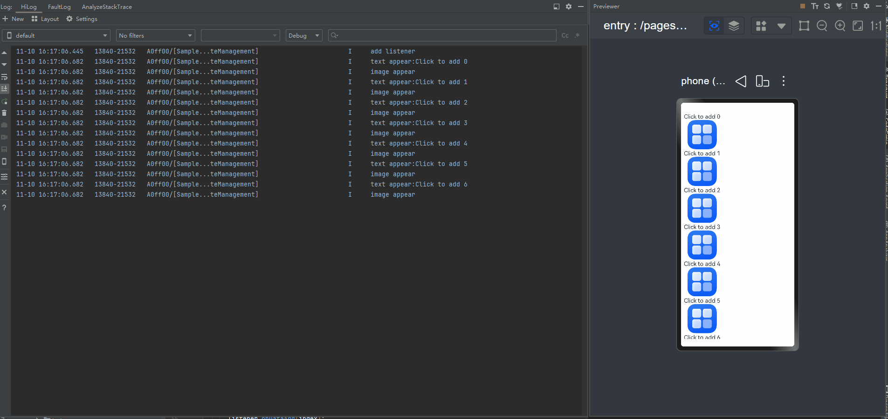
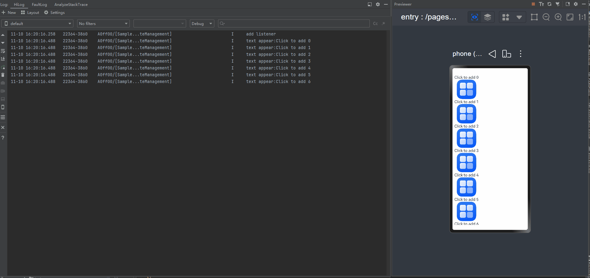

# In-Component State Management FAQs
<!--Kit: ArkUI-->
<!--Subsystem: ArkUI-->
<!--Owner: @zany_pink-->
<!--Designer: @s10021109-->
<!--Tester: @zhangwenhan12-->
<!--Adviser: @zhang_yixin13-->

In ArkUI application development, proper use of state management within components directly affects the application performance and development efficiency. However, developers often have insufficient understanding of the update mechanism in practice. As a result, the component behavior is abnormal or the rendering efficiency is reduced. This section describes the common problems and solutions of component state management.

## appfreeze Due to State Variable Changes in the build Function

State variables cannot be changed in **build()**. Doing so causes the state management framework to generate runtime error logs. Update state variables through event callbacks or asynchronous callbacks instead. For example, modify \@State variables in **onClick**.

The rendering process is as follows:

1. Create a custom component in **Index**.

2. Execute the **build** method of **Index** as follows:

   - Create a **Column** component.
   - Create a Text component. **This.count++** is triggered when the **Text** component is created.
   - The value change of **count** triggers the re-render of the **Text** component.
   - During the refresh, the component does not mark itself as dirty.
   - Return value of **Text** is 2.

<!-- @[state_problem_not_update_in_build_error_01](https://gitcode.com/openharmony/applications_app_samples/blob/master/code/DocsSample/ArkUISample/ParadigmStateManagement/entry/src/main/ets/pages/state/StateProblemNotUpdateInBuildError01.ets) --> 

``` TypeScript
@Entry
@Component
struct Index {
  @State count: number = 1;

  build() {
    Column() {
      // Avoid directly changing the value of count in the Text component.
      Text(`${this.count++}`)
        .width(50)
        .height(50)
    }
  }
}
```

During the initial creation of the component, the **Text** component is rendered multiple times, with the final display showing "2".

When the framework detects that a state variable is modified within the **build()** method, it generates the following error log:

```ts
FIX THIS APPLICATION ERROR: @Component 'Index': State variable 'count' has changed during render! It's illegal to change @Component state while build (initial render or re-render) is on-going. Application error!
```

In the preceding example, even though the **Text** component is rendered multiple times. This error does not cause immediate serious consequences and may be overlooked.

However, this behavior poses significant hidden risks that escalate as project complexity increases. Example:
<!-- @[state_problem_not_update_in_build_error_02](https://gitcode.com/openharmony/applications_app_samples/blob/master/code/DocsSample/ArkUISample/ParadigmStateManagement/entry/src/main/ets/pages/state/StateProblemNotUpdateInBuildError02.ets) -->  

``` TypeScript
@Entry
@Component
struct Index {
  @State message: number = 20;

  build() {
    Column() {
      Text(`${this.message++}`)
      Text(`${this.message++}`)
    }
    .height('100%')
    .width('100%')
  }
}
```

The rendering process in the preceding example is as follows:

1. Create the first Text component, trigger the change of this.message, and [mark the first Text component as dirty](./arkts-state-management-introduce.md#triggering-updates).
2. Create the second Text component, trigger the change of this.message, and mark the two Text components as dirty.
3. When the next frame arrives, the dirty system components are refreshed.
4. When the first Text component is refreshed, this.message is changed. Only the second Text component is marked dirty.
5. When the second Text component is refreshed, this.message is changed. Only the first Text component is marked dirty.
6. Steps 4 and 5 are repeated.
7. The system becomes unresponsive for an extended period, causing an application freeze.

Therefore, modifying state variables within the build method constitutes a critical error. When the error "FIX THIS APPLICATION ERROR: @Component ...has changed during render! It's illegal to change @Component state while build (initial render or re-render) is on-going. Application error!" log is found, immediate correction is required even if no immediate severe consequences are observed.

## The status variable is not deregistered during registration callback. As a result, memory leakage occurs.

You can register the arrow function in [aboutToAppear](../../reference/apis-arkui/arkui-ts/ts-custom-component-lifecycle.md#abouttoappear) to change the status variables in the component.

>**NOTE**
>
>The registered function needs to be left empty in [aboutToDisappear](../../reference/apis-arkui/arkui-ts/ts-custom-component-lifecycle.md#abouttodisappear) to prevent the arrow function from capturing the **this** instance of the custom component. As a result, the custom component cannot be released, causing memory leakage.

<!-- @[state_problem_unregister_state_callback](https://gitcode.com/openharmony/applications_app_samples/blob/master/code/DocsSample/ArkUISample/ParadigmStateManagement/entry/src/main/ets/pages/state/StateProblemUnregisterStateCallback.ets) --> 

``` TypeScript
import { common } from '@kit.AbilityKit';

class Model {
  private callback: (() => void) | undefined = () => {
  };

  add(callback: () => void): void {
    this.callback = callback;
  }

  delete(): void {
    this.callback = undefined;
  }

  call(): void {
    if (this.callback) {
      this.callback();
    }
  }
}

let model: Model = new Model();

@Entry
@Component
struct Test {
  @State count: number = 10;
  private context = this.getUIContext().getHostContext() as common.UIAbilityContext;

  aboutToAppear(): void {
    model.add(() => {
      this.count++;
    })
  }

  build() {
    Column() {
      // In the resources\base\element\string.json file, set name to state_countvalue_text1 and value to a non-null string.
      Text(this.context.resourceManager.getStringByNameSync('state_countvalue_text1') + `${this.count}`)
      Button('change')
        .onClick(() => {
          model.call();
        })
    }
  }

  aboutToDisappear(): void {
    model.delete();
  }
}
```

In addition, you can use LocalStorage to [change the state variable outside the custom component](./arkts-localstorage.md#changing-state-variables-outside-a-custom-component).

## Using the a.b(this.object) Pattern Fails to Trigger UI Re-rendering

In the **build** method, when an \@State decorated variable is an object and called in the **a.b(this.object)** format, the original object of **this.object** is passed to method b. Modifying properties of **this.object** within method b does not trigger UI re-rendering. In the following example, when the static method **Balloon.increaseVolume** or **this.reduceVolume** is used to change the **volume** of **Balloon**, the UI fails to update.

**Incorrect Usage**
<!-- @[state_problem_a_b_call_ui_refresh_opposite](https://gitcode.com/openharmony/applications_app_samples/blob/master/code/DocsSample/ArkUISample/ParadigmStateManagement/entry/src/main/ets/pages/state/StateProblemABCallUiRefreshOpposite.ets) --> 

``` TypeScript
class Balloon {
  public volume: number;

  constructor(volume: number) {
    this.volume = volume;
  }

  static increaseVolume(balloon: Balloon) {
    balloon.volume += 2;
  }
}

@Entry
@Component
struct Index {
  @State balloon: Balloon = new Balloon(10);

  reduceVolume(balloon: Balloon) {
    balloon.volume -= 1;
  }

  build() {
    Column({ space: 8 }) {
      Text(`The volume of the balloon is ${this.balloon.volume} cubic centimeters.`)
        .fontSize(30)
      Button(`increaseVolume`)
        .onClick(() => {
          // Static method calls will not trigger UI re-rendering.
          Balloon.increaseVolume(this.balloon);
        })
      Button(`reduceVolume`)
        .onClick(() => {
          // Internal component method calls using this will not trigger UI re-rendering.
          this.reduceVolume(this.balloon);
        })
    }
    .width('100%')
    .height('100%')
  }
}
```

State variables observe property changes through proxy objects. When **a.b(this.object)** is used, the framework converts the proxy object to its original form, losing observation capabilities. Consequently, property changes on the original object go undetected, preventing UI re-rendering. Use the following approaches to modify properties:

1. Assign **this.balloon** to a temporary variable.
2. Use the temporary variable to execute the original invocation logic.

   For details, see the correct usage.

**Correct Usage**
<!-- @[state_problem_a_b_call_ui_refresh_positive](https://gitcode.com/openharmony/applications_app_samples/blob/master/code/DocsSample/ArkUISample/ParadigmStateManagement/entry/src/main/ets/pages/state/StateProblemABCallUiRefreshPositive.ets) --> 

``` TypeScript
class Balloon {
  public volume: number;

  constructor(volume: number) {
    this.volume = volume;
  }

  static increaseVolume(balloon: Balloon) {
    balloon.volume += 2;
  }
}

@Entry
@Component
struct Index {
  @State balloon: Balloon = new Balloon(10);

  reduceVolume(balloon: Balloon) {
    balloon.volume -= 1;
  }

  build() {
    Column({ space: 8 }) {
      Text(`The volume of the balloon is ${this.balloon.volume} cubic centimeters.`)
        .fontSize(30)
      Button(`increaseVolume`)
        .onClick(() => {
          // Preserve the proxy by assigning a value to a temporary variable.
          let balloon1 = this.balloon;
          Balloon.increaseVolume(balloon1);
        })
      Button(`reduceVolume`)
        .onClick(() => {
          // Preserve the proxy by assigning a value to a temporary variable.
          let balloon2 = this.balloon;
          this.reduceVolume(balloon2);
        })
    }
    .width('100%')
    .height('100%')
  }
}
```

## Unnecessary Refreshing Occurs When a Complex Constant Is Repeatedly Assigned to a State Variable

### State Management (V1)

In state management V1, a layer of proxy is added to class objects decorated by \@Observed and objects of the Class, Date, Map, Set, and Array types decorated by state variables such as @State to observe the changes of layer-1 attributes or API calls. When a complex constant is repeatedly assigned to a state variable, the system may determine that the old and new values are different because a proxy is added. As a result, unnecessary update occurs.

<!-- @[state_problem_complex_constant_repeat_refresh](https://gitcode.com/openharmony/applications_app_samples/blob/master/code/DocsSample/ArkUISample/ParadigmStateManagement/entry/src/main/ets/pages/state/StateProblemComplexConstantRepeatRefresh.ets) --> 

``` TypeScript
import { hilog } from '@kit.PerformanceAnalysisKit';

class DataObj {
  public name: string = 'default name';

  constructor(name: string) {
    this.name = name;
  }
}

@Entry
@Component
struct Index {
  list: DataObj[] = [new DataObj('a'), new DataObj('b'), new DataObj('c')];
  @State dataObjFromList: DataObj = this.list[0];

  build() {
    Column() {
      ConsumerChild({ dataObj: this.dataObjFromList })
      Button('change to self').onClick(() => {
        this.dataObjFromList = this.list[0];
      })
    }
  }
}

@Component
struct ConsumerChild {
  @Link @Watch('onDataObjChange') dataObj: DataObj;

  onDataObjChange() {
    hilog.info(0xFF00, 'testTag', '%{public}s', 'dataObj changed');
  }

  getContent() {
    hilog.info(0xFF00, 'testTag', '%{public}s', `this.dataObj.name change: ${this.dataObj.name}`);
    return this.dataObj.name;
  }

  build() {
    Column() {
      Text(this.getContent()).fontSize(30)
    }
  }
}
```

In the preceding example, each time the **change to self** button is clicked, the same class instance is assigned to a state variable of the class type. This operation triggers re-rendering and logs **this.dataObj.name change: a**. When **list[0]** is assigned again, **dataObjFromList** is of the **Proxy** type, but **list[0]** is of the **Object** type. Therefore, the system determines that the two values are different and triggers value assignment and update.

To avoid unnecessary value changes and re-renders, use \@Observed to decorate the class, or use [UIUtils.getTarget()](./arkts-new-getTarget.md) to obtain the original value and compare it with the new value. If they are the same, skip the assignment.

Method 1: Apply the \@Observed decorator.
<!-- @[state_problem_complex_solution_01](https://gitcode.com/openharmony/applications_app_samples/blob/master/code/DocsSample/ArkUISample/ParadigmStateManagement/entry/src/main/ets/pages/state/StateProblemComplexSolution01.ets) --> 

``` TypeScript
import { hilog } from '@kit.PerformanceAnalysisKit';

@Observed
class DataObj {
  public name: string = 'default name';

  constructor(name: string) {
    this.name = name;
  }
}

@Entry
@Component
struct Index {
  list: DataObj[] = [new DataObj('a'), new DataObj('b'), new DataObj('c')];
  @State dataObjFromList: DataObj = this.list[0];

  build() {
    Column() {
      ConsumerChild({ dataObj: this.dataObjFromList })
      Button('change to self').onClick(() => {
        this.dataObjFromList = this.list[0];
      })
    }
  }
}

@Component
struct ConsumerChild {
  @Link @Watch('onDataObjChange') dataObj: DataObj;

  onDataObjChange() {
    hilog.info(0xFF00, 'testTag', '%{public}s', 'dataObj changed');
  }

  build() {
    Column() {
      Text(this.dataObj.name).fontSize(30)
    }
  }
}
```

In the preceding example, the class is decorated with the \@Observed decorator, making **list[0]** a Proxy instance. In this case, when the same value is reassigned, the identical object will not trigger re-rendering.

Method 2: Use [UIUtils.getTarget()](./arkts-new-getTarget.md) to obtain the original object.
<!-- @[state_problem_complex_solution_02](https://gitcode.com/openharmony/applications_app_samples/blob/master/code/DocsSample/ArkUISample/ParadigmStateManagement/entry/src/main/ets/pages/state/StateProblemComplexSolution02.ets) -->  

``` TypeScript
import { UIUtils } from '@kit.ArkUI';
import { hilog } from '@kit.PerformanceAnalysisKit';

class DataObj {
  public name: string = 'default name';

  constructor(name: string) {
    this.name = name;
  }
}

@Entry
@Component
struct Index {
  list: DataObj[] = [new DataObj('a'), new DataObj('b'), new DataObj('c')];
  @State dataObjFromList: DataObj = this.list[0];

  build() {
    Column() {
      ConsumerChild({ dataObj: this.dataObjFromList })
      Button('change to self').onClick(() => {
        // Obtain the original value and compare it with the new value.
        if (UIUtils.getTarget(this.dataObjFromList) !== this.list[0]) {
          this.dataObjFromList = this.list[0];
        }
      })
    }
  }
}

@Component
struct ConsumerChild {
  @Link @Watch('onDataObjChange') dataObj: DataObj;

  onDataObjChange() {
    hilog.info(0xFF00, 'testTag', '%{public}s', 'dataObj changed');
  }

  build() {
    Column() {
      Text(this.dataObj.name).fontSize(30)
    }
  }
}
```

In the preceding example, **getTarget** is used to obtain the original value of the corresponding state variable before value change. After comparison, if the original value is the same as the new value, re-rendering will not be triggered.

### State Management (V2)

In state management V2, a proxy is added to the Date, Map, Set, and Array decorated by state variables such as @Trace and @Local to observe the changes caused by API invoking. When a complex constant is repeatedly assigned to a state variable, the system may determine that the old and new values are different because a proxy is added. As a result, unnecessary update occurs.

<!-- @[Local_Question_Spark_Update](https://gitcode.com/openharmony/applications_app_samples/blob/master/code/DocsSample/ArkUISample/ParadigmStateManagement/entry/src/main/ets/pages/local/LocalQuestionSparkUpdate.ets) --> 

``` TypeScript
import { hilog } from '@kit.PerformanceAnalysisKit';

@Entry
@ComponentV2
struct Index {
  list: string[][] = [['a'], ['b'], ['c']];
  @Local dataObjFromList: string[] = this.list[0];

  @Monitor('dataObjFromList')
  onStrChange(monitor: IMonitor) {
    hilog.info(0xFF00, 'testTag', '%{public}s', 'dataObjFromList has changed');
  }

  build() {
    Column() {
      Button('change to self').onClick(() => {
        // The new value is the same as the locally initialized value.
        this.dataObjFromList = this.list[0];
      })
    }
  }
}
```

In the preceding example, every time the **Button('change to self')** component is clicked, assigning the same constant of type Array to a state variable of type Array triggers UI re-rendering. This is because when **list[0]** is assigned again, **dataObjFromList** is of the Proxy type, but **list[0]** is of the Array type. Due to the type mismatch, the assignment and re-rendering are triggered.

To avoid unnecessary assignments and re-renders, use [UIUtils.getTarget()](./arkts-new-getTarget.md) to obtain the original value and compare it with the new value. If they are the same, skip the assignment.

Example of using **UIUtils.getTarget()**:

<!-- @[Local_Question_UIUtils](https://gitcode.com/openharmony/applications_app_samples/blob/master/code/DocsSample/ArkUISample/ParadigmStateManagement/entry/src/main/ets/pages/local/LocalQuestionUIUtils.ets) --> 

``` TypeScript
import { UIUtils } from '@kit.ArkUI';
import { hilog } from '@kit.PerformanceAnalysisKit';

const DOMAIN = 0x0000;

@Entry
@ComponentV2
struct Index {
  list: string[][] = [['a'], ['b'], ['c']];
  @Local dataObjFromList: string[] = this.list[0];

  @Monitor('dataObjFromList')
  onStrChange(monitor: IMonitor) {
    hilog.info(DOMAIN, 'testTag', '%{public}s', 'dataObjFromList has changed');
  }

  build() {
    Column() {
      Button('change to self').onClick(() => {
        // Obtain the original value and compare it with the new value.
        if (UIUtils.getTarget(this.dataObjFromList) !== this.list[0]) {
          this.dataObjFromList = this.list[0];
        }
      })
    }
  }
}
```

## Unnecessary Deep Copy Caused by Using @Prop When Child Components Do Not Need to Modify State Variables

During application development, a parent component often transfers values to its child components. If the subcomponent does not need to modify the status variable, using the [@Prop](./arkts-prop.md) decorator will increase the component creation time and affect the performance. In this case, you are advised to use [@ObjectLink](./arkts-observed-and-objectlink.md) instead.

**Incorrect Usage**

<!-- @[deep_copy_reverse](https://gitcode.com/openharmony/applications_app_samples/blob/master/code/DocsSample/ArkUISample/StateManagement/entry/src/main/ets/pages/DeepCopyReverse.ets) --> 

``` TypeScript
@Observed
class DeepReMyClass {
  public num: number = 0;

  constructor(num: number) {
    this.num = num;
  }
}

@Component
struct DeepRePropChild {
  @Prop testClass: DeepReMyClass; // @Prop makes a deep copy.

  build() {
    Text(`PropChild testNum ${this.testClass.num}`)
  }
}

@Entry
@Component
struct DeepReParent {
  @State testClass: DeepReMyClass[] = [new DeepReMyClass(1)];

  build() {
    Column() {
      Text(`DeepReParent testNum ${this.testClass[0].num}`)
        .onClick(() => {
          this.testClass[0].num += 1;
        })

      // DeepRePropChild does not change the value of @Prop testClass: DeepReMyClass. Therefore, @ObjectLink is a better choice.
      DeepRePropChild({ testClass: this.testClass[0] })
    }
  }
}
```

In the preceding example, the DeepRePropChild component does not change the value of \@Prop testClass: MyClass. Therefore, it is more appropriate to use \@ObjectLink. @Prop causes performance overhead due to deep data copy. Therefore, \@ObjectLink is a better choice than \@Prop.

**Correct Usage**

<!-- @[deep_copy_correct](https://gitcode.com/openharmony/applications_app_samples/blob/master/code/DocsSample/ArkUISample/StateManagement/entry/src/main/ets/pages/DeepCopyCorrect.ets) --> 

``` TypeScript
@Observed
class MyClass {
  public num: number = 0;

  constructor(num: number) {
    this.num = num;
  }
}

@Component
struct PropChild {
  @ObjectLink testClass: MyClass; // @ObjectLink does not make a deep copy.

  build() {
    Text(`PropChild testNum ${this.testClass.num}`)
  }
}

@Entry
@Component
struct Parent {
  @State testClass: MyClass[] = [new MyClass(1)];

  build() {
    Column() {
      Text(`Parent testNum ${this.testClass[0].num}`)
        .onClick(() => {
          this.testClass[0].num += 1;
        })

      // When the subcomponent does not need to change the state locally, @ObjectLink is preferred because @Prop performs deep copy and causes performance overhead. In this case, @ObjectLink is a better choice than @Link and @Prop.
      PropChild({ testClass: this.testClass[0] })
    }
  }
}
```

## Performance Deteriorates Due to Too Many Components Associated with State Variables

It is recommended that the number of components associated with each state variable be less than 20. Precisely controlling the number of components associated with state variables can reduce unnecessary component updates and improve update efficiency. Sometimes, developers bind the same state variable to multiple component attributes at the same level. When the state changes, these components are updated synchronously, causing unnecessary updates. When the component complexity is high, the overall performance is greatly affected. On the contrary, binding the state variable to the parent components of these components can reduce the number of components that need to be refreshed and improve performance. During application development, you can use HiDumper to view the number of components associated with status variables.

**Incorrect Usage**

<!-- @[precise_control_counterexamples](https://gitcode.com/openharmony/applications_app_samples/blob/master/code/DocsSample/ArkUISample/StateManagement/entry/src/main/ets/pages/PreciseControlCounterexamples.ets) -->  

``` TypeScript
@Observed
class Translate {
  public translateX: number = 20;
}

@Component
struct Title {
  @ObjectLink translateObj: Translate;

  build() {
    Row() {
      // Replace $r('app.media.background') with the resource file you use.
      Image($r('app.media.background'))
        .width(50)
        .height(50)
        .translate({
          x: this.translateObj.translateX // this.translateObj.translateX is bound to the Image and Text components.
        })
      Text('Title')
        .fontSize(20)
        .translate({
          x: this.translateObj.translateX
        })
    }
  }
}

@Entry
@Component
struct Page {
  @State translateObj: Translate = new Translate();

  build() {
    Column() {
      Title({
        translateObj: this.translateObj
      })
      Stack() {
      }
      .backgroundColor('black')
      .width(200)
      .height(400)
      .translate({
        x: this.translateObj.translateX // this.translateObj.translateX is bound to the Stack and Button components.
      })
      Button('move')
        .translate({
          x: this.translateObj.translateX
        })
        .onClick(() => {
          this.getUIContext().animateTo({
            duration: 50
          }, () => {
            this.translateObj.translateX = (this.translateObj.translateX + 50) % 150;
          });
        })
    }
  }
}
```

In the preceding example, the state variable **this.translateObj.translateX** is used in multiple child components at the same level. When it changes, all these associated components are re-rendered. Since the changes of these components are the same, you can associate the state variable with their parent component to reduce the number of components re-rendered. After analysis, it is found that all subcomponents are located under Column of the Page component. Therefore, the same translate attribute of all subcomponents is unified to Column to accurately control the number of components associated with state variables.

**Correct Usage**

<!-- @[precise_control_positive_cases](https://gitcode.com/openharmony/applications_app_samples/blob/master/code/DocsSample/ArkUISample/StateManagement/entry/src/main/ets/pages/PreciseControlPositiveCases.ets) -->  

``` TypeScript
@Observed
class PageTranslate {
  public translateX: number = 20;
}

@Component
struct PageTitle {
  build() {
    Row() {
      // Replace $r('app.media.background') with the image resource file you use.
      Image($r('app.media.background'))
        .width(50)
        .height(50)
      Text('Title')
        .fontSize(20)
    }
  }
}

@Entry
@Component
struct Page1 {
  @State translateObj: PageTranslate = new PageTranslate();

  build() {
    Column() {
      PageTitle()
      Stack() {
      }
      .backgroundColor('black')
      .width(200)
      .height(400)
      Button('move')
        .onClick(() => {
          this.getUIContext().animateTo({
            duration: 50
          }, () => {
            this.translateObj.translateX = (this.translateObj.translateX + 50) % 150;
          });
        })
    }
    .translate({
      // The same translate attribute is set for the Stack and Button subcomponents. You can set the attribute on the Column subcomponent.
      x: this.translateObj.translateX
    })
  }
}
```

## State variables are frequently read in loop logic such as for and while. As a result, the performance deteriorates.

During application development, do not frequently read state variables in the loop logic. Instead, read state variables outside the loop.

**Incorrect Usage**

<!-- @[loop_state_inefficient](https://gitcode.com/openharmony/applications_app_samples/blob/master/code/DocsSample/ArkUISample/StateManagement/entry/src/main/ets/pages/LoopStateInefficient.ets) --> 

``` TypeScript
import { hilog } from '@kit.PerformanceAnalysisKit';

@Entry
@Component
struct Index {
  @State message: string = '';

  build() {
    Column() {
      Button('Click to print log')
        .onClick(() => {
          for (let i = 0; i < 10; i++) {
            hilog.info(0x0000, 'TAG', '%{public}s', this.message);
          }
        })
        .width('90%')
        .backgroundColor(Color.Blue)
        .fontColor(Color.White)
        .margin({
          top: 10
        })
    }
    .justifyContent(FlexAlign.Start)
    .alignItems(HorizontalAlign.Center)
    .margin({
      top: 15
    })
  }
}
```

**Correct Usage**

<!-- @[loop_state_optimized](https://gitcode.com/openharmony/applications_app_samples/blob/master/code/DocsSample/ArkUISample/StateManagement/entry/src/main/ets/pages/LoopStateOptimized.ets) --> 

``` TypeScript
import { hilog } from '@kit.PerformanceAnalysisKit';

@Entry
@Component
struct Index {
  @State message: string = '';

  build() {
    Column() {
      Button('Click to print log')
        .onClick(() => {
          let logMessage: string = this.message;
          for (let i = 0; i < 10; i++) {
            hilog.info(0x0000, 'TAG', '%{public}s', logMessage);
          }
        })
        .width('90%')
        .backgroundColor(Color.Blue)
        .fontColor(Color.White)
        .margin({
          top: 10
        })
    }
    .justifyContent(FlexAlign.Start)
    .alignItems(HorizontalAlign.Center)
    .margin({
      top: 15
    })
  }
}
```

## Performance Deterioration Caused by Frequent Modification of Status Variables

During application development, you should reduce direct value changes to the state variables and compute data by using temporary variables.

When a status variable changes, ArkUI queries the components that depend on the status variable and executes the update method of the components to complete component rendering. By using temporary variables instead of directly operating state variables, ArkUI can query and render components only when the last state variable changes, reducing unnecessary operations and improving application performance. For details about the behavior of state variables, see [@State Decorator: State Owned by Component](arkts-state.md).

**Incorrect Usage**

<!-- @[calculation_directState](https://gitcode.com/openharmony/applications_app_samples/blob/master/code/DocsSample/ArkUISample/StateManagement/entry/src/main/ets/pages/CalculationDirectState.ets) --> 

``` TypeScript
import { hiTraceMeter } from '@kit.PerformanceAnalysisKit';

@Entry
@Component
struct Index {
  @State message: string = '';

  appendMsg(newMsg: string) {
    // Performance Tracing
    hiTraceMeter.startTrace('StateVariable', 1);
    this.message += newMsg;
    this.message += ';';
    this.message += '<br/>';
    hiTraceMeter.finishTrace('StateVariable', 1);
  }

  build() {
    Column() {
      Button('Click to print log')
        .onClick(() => {
          this.appendMsg('Operating state variable');
        })
        .width('90%')
        .backgroundColor(Color.Blue)
        .fontColor(Color.White)
        .margin({
          top: 10
        })
    }
    .justifyContent(FlexAlign.Start)
    .alignItems(HorizontalAlign.Center)
    .margin({
      top: 15
    })
  }
}
```

Directly operate the status variable, trigger the calculation function for three times, and run the [time consumption](../ui-inspector-profiler.md#trace-debugging-capability) command. The result is as follows:


**Correct Usage**

<!-- @[calculation_temp_variable](https://gitcode.com/openharmony/applications_app_samples/blob/master/code/DocsSample/ArkUISample/StateManagement/entry/src/main/ets/pages/CalculationTempVariable.ets) --> 

``` TypeScript
import { hiTraceMeter } from '@kit.PerformanceAnalysisKit';

@Entry
@Component
struct Index {
  @State message: string = '';

  appendMsg(newMsg: string) {
    // Performance Tracing
    hiTraceMeter.startTrace('TemporaryVariable', 2);
    let message = this.message;
    message += newMsg;
    message += ';';
    message += '<br/>';
    this.message = message;
    hiTraceMeter.finishTrace('TemporaryVariable', 2);
  }

  build() {
    Column() {
      Button('Click to print log')
        .onClick(() => {
          this.appendMsg('Operating temporary variable');
        })
        .width('90%')
        .backgroundColor(Color.Blue)
        .fontColor(Color.White)
        .margin({
          top: 10
        })
    }
    .justifyContent(FlexAlign.Start)
    .alignItems(HorizontalAlign.Center)
    .margin({
      top: 15
    })
  }
}
```

Temporary variables are used to replace the calculation of state variables. The calculation function is triggered for three times. The time required for running the calculation function is as follows:


[Summary]

| **Computation Method**    | **Time Required (for Reference Only)**| **Remarks**                                         |
| ---------------- | ------------------------------------------ | ------------------------------------------------- |
| Changing state variables| 1.01ms                                     | Increases unnecessary query and rendering of ArkUI, causing poor performance.|
| Using temporary variables for computing| 0.63ms                                     | Streamlines ArkUI behaviors and improve application performance.              |

## Performance Deteriorates When the LazyForEach Rebuilding Mechanism Is Used to Refresh the UI

During development, [LazyForEach](../rendering-control/arkts-rendering-control-lazyforeach.md) and state variables are usually used together.

<!-- @[StateArrayLazy_start](https://gitcode.com/openharmony/applications_app_samples/blob/master/code/DocsSample/ArkUISample/statemanagementproject/entry/src/main/ets/pages/statemanagementguide/StateArrayLazy.ets) -->  

``` TypeScript
import { hilog } from '@kit.PerformanceAnalysisKit';

const DOMAIN_NUMBER: number = 0XFF00;
const TAG: string = '[Sample_StateManagement]';

class BasicDataSource implements IDataSource {
  private listeners: DataChangeListener[] = [];
  private originDataArray: StringData[] = [];

  public totalCount(): number {
    return 0;
  }

  public getData(index: number): StringData {
    return this.originDataArray[index];
  }

  registerDataChangeListener(listener: DataChangeListener): void {
    if (this.listeners.indexOf(listener) < 0) {
      hilog.info(DOMAIN_NUMBER, TAG, 'add listener');
      this.listeners.push(listener);
    }
  }

  unregisterDataChangeListener(listener: DataChangeListener): void {
    const pos = this.listeners.indexOf(listener);
    if (pos >= 0) {
      hilog.info(DOMAIN_NUMBER, TAG, 'remove listener');
      this.listeners.splice(pos, 1);
    }
  }

  notifyDataReload(): void {
    this.listeners.forEach(listener => {
      listener.onDataReloaded();
    })
  }

  notifyDataAdd(index: number): void {
    this.listeners.forEach(listener => {
      listener.onDataAdd(index);
    })
  }

  notifyDataChange(index: number): void {
    this.listeners.forEach(listener => {
      listener.onDataChange(index);
    })
  }

  notifyDataDelete(index: number): void {
    this.listeners.forEach(listener => {
      listener.onDataDelete(index);
    })
  }

  notifyDataMove(from: number, to: number): void {
    this.listeners.forEach(listener => {
      listener.onDataMove(from, to);
    })
  }
}

class MyDataSource extends BasicDataSource {
  private dataArray: StringData[] = [];

  public totalCount(): number {
    return this.dataArray.length;
  }

  public getData(index: number): StringData {
    return this.dataArray[index];
  }

  public addData(index: number, data: StringData): void {
    this.dataArray.splice(index, 0, data);
    this.notifyDataAdd(index);
  }

  public pushData(data: StringData): void {
    this.dataArray.push(data);
    this.notifyDataAdd(this.dataArray.length - 1);
  }

  public reloadData(): void {
    this.notifyDataReload();
  }
}

class StringData {
  public message: string;
  public imgSrc: Resource;

  constructor(message: string, imgSrc: Resource) {
    this.message = message;
    this.imgSrc = imgSrc;
  }
}

@Entry
@Component
struct MyComponent {
  private data: MyDataSource = new MyDataSource();

  aboutToAppear() {
    for (let i = 0; i <= 9; i++) {
      // 'app.media.icon' is only an example. Replace it with the actual one in use. Otherwise, the imageSource instance fails to be created, and subsequent operations cannot be performed.
      this.data.pushData(new StringData(`Click to add ${i}`, $r('app.media.icon')));
    }
  }

  build() {
    List({ space: 3 }) {
      LazyForEach(this.data, (item: StringData, index: number) => {
        ListItem() {
          Column() {
            Text(item.message).fontSize(20)
              .onAppear(() => {
                hilog.info(DOMAIN_NUMBER, TAG, 'text appear:' + item.message);
              })
            Image(item.imgSrc)
              .width(100)
              .height(100)
              .onAppear(() => {
                hilog.info(DOMAIN_NUMBER, TAG, 'image appear');
              })
          }.margin({ left: 10, right: 10 })
        }
        .onClick(() => {
          item.message += '0';
          this.data.reloadData();
        })
      }, (item: StringData, index: number) => JSON.stringify(item))
    }.cachedCount(5)
  }
}
```


Below you can see how the preceding code snippet works.



In this example, after you click to change **message**, the image flickers, and the onAppear log is generated for the image, indicating that the component is rebuilt. After **message** is changed, the key of the corresponding list item in **LazyForEach** changes. As a result, **LazyForEach** rebuilds the list item when executing **reloadData**. Though the **Text** component only has its content changed, it is rebuilt, not updated. The **Image** component under the list item is also rebuilt along with the list item, even though its content remains unchanged.

While both **LazyForEach** and state variables can trigger UI re-renders, their performance overheads are different. **LazyForEach** leads to component rebuilds and higher performance overheads, especially when there is a considerable number of components. By contrast, the use of state variables allows you to keep the update scope within the closely related components. In light of this, it is recommended that you use state variables to trigger component updates in **LazyForEach**, which requires custom components.

<!-- @[StateArrayLazy2_start](https://gitcode.com/openharmony/applications_app_samples/blob/master/code/DocsSample/ArkUISample/statemanagementproject/entry/src/main/ets/pages/statemanagementguide/StateArrayLazy2.ets) -->  

``` TypeScript
import { hilog } from '@kit.PerformanceAnalysisKit';

const DOMAIN_NUMBER: number = 0XFF00;
const TAG: string = '[Sample_StateManagement]';

class BasicDataSource implements IDataSource {
  private listeners: DataChangeListener[] = [];
  private originDataArray: StringData[] = [];

  public totalCount(): number {
    return 0;
  }

  public getData(index: number): StringData {
    return this.originDataArray[index];
  }

  registerDataChangeListener(listener: DataChangeListener): void {
    if (this.listeners.indexOf(listener) < 0) {
      hilog.info(DOMAIN_NUMBER, TAG, 'add listener');
      this.listeners.push(listener);
    }
  }

  unregisterDataChangeListener(listener: DataChangeListener): void {
    const pos = this.listeners.indexOf(listener);
    if (pos >= 0) {
      hilog.info(DOMAIN_NUMBER, TAG, 'remove listener');
      this.listeners.splice(pos, 1);
    }
  }

  notifyDataReload(): void {
    this.listeners.forEach(listener => {
      listener.onDataReloaded();
    })
  }

  notifyDataAdd(index: number): void {
    this.listeners.forEach(listener => {
      listener.onDataAdd(index);
    })
  }

  notifyDataChange(index: number): void {
    this.listeners.forEach(listener => {
      listener.onDataChange(index);
    })
  }

  notifyDataDelete(index: number): void {
    this.listeners.forEach(listener => {
      listener.onDataDelete(index);
    })
  }

  notifyDataMove(from: number, to: number): void {
    this.listeners.forEach(listener => {
      listener.onDataMove(from, to);
    })
  }
}

class MyDataSource extends BasicDataSource {
  private dataArray: StringData[] = [];

  public totalCount(): number {
    return this.dataArray.length;
  }

  public getData(index: number): StringData {
    return this.dataArray[index];
  }

  public addData(index: number, data: StringData): void {
    this.dataArray.splice(index, 0, data);
    this.notifyDataAdd(index);
  }

  public pushData(data: StringData): void {
    this.dataArray.push(data);
    this.notifyDataAdd(this.dataArray.length - 1);
  }
}

@Observed
class StringData {
  @Track public message: string;
  @Track public imgSrc: Resource;

  constructor(message: string, imgSrc: Resource) {
    this.message = message;
    this.imgSrc = imgSrc;
  }
}

@Entry
@Component
struct MyComponent {
  @State data: MyDataSource = new MyDataSource();

  aboutToAppear() {
    for (let i = 0; i <= 9; i++) {
      // 'app.media.icon' is only an example. Replace it with the actual one in use. Otherwise, the imageSource instance fails to be created, and subsequent operations cannot be performed.
      this.data.pushData(new StringData(`Click to add ${i}`, $r('app.media.icon')));
    }
  }

  build() {
    List({ space: 3 }) {
      LazyForEach(this.data, (item: StringData, index: number) => {
        ListItem() {
          ChildComponent({ data: item })
        }
        .onClick(() => {
          item.message += '0';
        })
      }, (item: StringData, index: number) => index.toString())
    }.cachedCount(5)
  }
}

@Component
struct ChildComponent {
  @ObjectLink data: StringData;

  build() {
    Column() {
      Text(this.data.message).fontSize(20)
        .onAppear(() => {
          hilog.info(DOMAIN_NUMBER, TAG, 'text appear:' + this.data.message);
        })
      Image(this.data.imgSrc)
        .width(100)
        .height(100)
    }.margin({ left: 10, right: 10 })
  }
}
```

Below you can see how the preceding code snippet works.



In this example, the UI is re-rendered properly: The image does not flicker, and no log is generated, which indicates that the **Text** and **Image** components are not rebuilt.

This is thanks to introduction of custom components, where state variables are directly changed through @Observed and @ObjectLink, instead of through **LazyForEach**. Decorate the **message** and **imgSrc** properties of the **StringData** type with [@Track](arkts-track.md) to further narrow down the render scope to the specified **Text** component.

## UI Is Not Refreshed Due to the Combination of ForEach and Object Arrays

During development, the object array and [ForEach](../rendering-control/arkts-rendering-control-foreach.md) are often used together. However, if the writing method is improper, the UI may not be refreshed.

<!-- @[StateArrayForeach_start](https://gitcode.com/openharmony/applications_app_samples/blob/master/code/DocsSample/ArkUISample/statemanagementproject/entry/src/main/ets/pages/statemanagementguide/StateArrayForeach.ets) -->  

``` TypeScript
import { hilog } from '@kit.PerformanceAnalysisKit';

const DOMAIN_NUMBER: number = 0XFF00;
const TAG: string = '[Sample_StateManagement]';

@Observed
class StyleList extends Array<TextStyles> {
}

@Observed
class TextStyles {
  public fontSize: number;

  constructor(fontSize: number) {
    this.fontSize = fontSize;
  }
}

@Entry
@Component
struct Page {
  @State styleList: StyleList = new StyleList();

  aboutToAppear() {
    for (let i = 15; i < 50; i++) {
      this.styleList.push(new TextStyles(i));
    }
  }

  build() {
    Column() {
      Text('Font Size List')
        .fontSize(50)
        .onClick(() => {
          for (let i = 0; i < this.styleList.length; i++) {
            this.styleList[i].fontSize++;
          }
          hilog.info(DOMAIN_NUMBER, TAG, 'change font size');
        })
      List() {
        ForEach(this.styleList, (item: TextStyles) => {
          ListItem() {
            Text('Hello World')
              .fontSize(item.fontSize)
          }
        })
      }
    }
  }
}
```


Below you can see how the preceding code snippet works.


The item generated in ForEach is a constant. Therefore, when you click to change the content in the item, the UI cannot be refreshed, although the log indicates that the value of the item has changed (this is reflected in the log of "change font size"). To fix this issue, you need to use custom components with @ObjectLink.

<!-- @[TextComponent_start](https://gitcode.com/openharmony/applications_app_samples/blob/master/code/DocsSample/ArkUISample/statemanagementproject/entry/src/main/ets/pages/statemanagementguide/StateArrayForeach2.ets) -->  

``` TypeScript
import { hilog } from '@kit.PerformanceAnalysisKit';

const DOMAIN_NUMBER: number = 0XFF00;
const TAG: string = '[Sample_StateManagement]';

@Observed
class StyleList extends Array<TextStyles> {
}

@Observed
class TextStyles {
  public fontSize: number;

  constructor(fontSize: number) {
    this.fontSize = fontSize;
  }
}

@Component
struct TextComponent {
  @ObjectLink textStyle: TextStyles;

  build() {
    Text('Hello World')
      .fontSize(this.textStyle.fontSize)
  }
}

@Entry
@Component
struct Page {
  @State styleList: StyleList = new StyleList();

  aboutToAppear() {
    for (let i = 15; i < 50; i++) {
      this.styleList.push(new TextStyles(i));
    }
  }

  build() {
    Column() {
      Text('Font Size List')
        .fontSize(50)
        .onClick(() => {
          for (let i = 0; i < this.styleList.length; i++) {
            this.styleList[i].fontSize++;
          }
          hilog.info(DOMAIN_NUMBER, TAG, 'change font size');
        })
      List() {
        ForEach(this.styleList, (item: TextStyles) => {
          ListItem() {
            TextComponent({ textStyle: item })
          }
        })
      }
    }
  }
}
```

Below you can see how the preceding code snippet works.


When @ObjectLink is used to accept the input item, the **textStyle** variable in the **TextComponent** component can be observed. For @ObjectLink, parameters are passed by reference. Therefore, when the value of **fontSize** in **styleList** is changed in the parent component, this update is properly observed and synced to the corresponding list item in **ForEach**, leading to UI re-rendering.

This is a practical mode of using state management for UI re-rendering.
