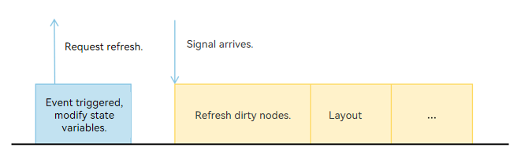
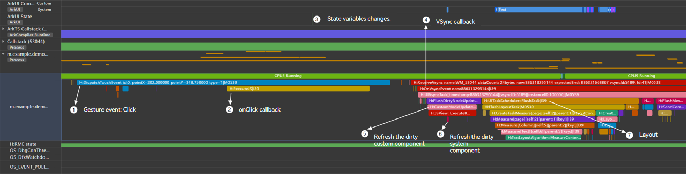
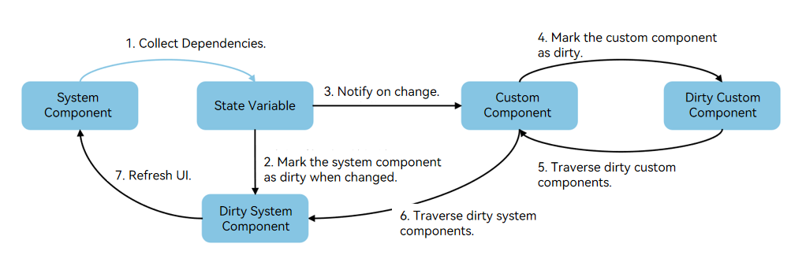

# State Management Principles
<!--Kit: ArkUI-->
<!--Subsystem: ArkUI-->
<!--Owner: @zany_pink-->
<!--Designer: @s10021109-->
<!--Tester: @zhangwenhan12-->
<!--Adviser: @zhang_yixin13-->

This section describes the basic principles of state management. The core logic of state management is to process the binding relationships between state variables, custom components, and system components. The working process is divided into two core phases: collecting dependencies and triggering updates.

## Collecting Dependencies

Collecting dependencies refers to establishing data binding relationships between state variables and components. During UI rendering, the state management framework observes which state variables are read and records the dependency. A UI may use multiple state variables. When a state variable is modified, only the components related to the state variable are refreshed. Other components that are not related to the state variable are not refreshed. Therefore, when refreshing the UI, you need to determine which components use the modified state variables to implement precise refreshing of these components.

```ts
@Entry
@Component
struct Index {
  @State name: string = 'Jack';
  @State age: number = 10;
  @State grade: number = 5;

  build() {
    Column() {
      Text(`${this.name}'s age is ${this.age}`) // Text1
      Text(`${this.name}'s grade is ${this.grade}`) // Text2
      Button('change age') // Button1
        .onClick(() => {
          this.age++;
        })
      Button('change grade') // Button2
        .onClick(() => {
          this.grade++;
        })
    }
  }
}
```

In the preceding sample code, the custom component Index defines three state variables **name**, **age**, and **grade**. The build function creates two Text system components and two Button system components. The steps for collecting dependencies are as follows:

1. The custom component Index is created, and the build method is called for the first time to create the component.
2. When the framework executes **Text(`${this.name}'s age is ${this.age}`)**, the values of this.name and this.age need to be read to display the text content.
3. **name** and **age** are state variables decorated by the @State decorator. When a state variable is read, the unique ID elementId of the system component that is being rendered is collected and stored in a Set. Therefore, the state variables name and age collect the unique ID elementId1 of Text1.
4. Similarly, when the framework executes **Text(`${this.name}'s grade is ${this.grade}`)**, the state variables name and grade collect the unique ID elementId2 of Text2.

Each state variable maintains a set to store the IDs of all system components bound to the state variable. In the preceding example, the dependency set of the state variable name stores the information about Text1 and Text2, the dependency set of the state variable age stores the information about Text1, and the dependency set of the state variable grade stores the information about Text2. In this way, the framework completes the process of collecting dependencies.

## Triggering Updates

When a state variable changes, the state management framework notifies all UI components that depend on the state variable of the change, recalculates the new value, and refreshes the components. This process is called triggering updates. The triggering update process can be divided into the following three steps:

- Calculates the new value of the state variable after the change.
- Changes the value of the state variable and marks the component bound to the state variable as dirty.
- Refreshes all dirty nodes, updates the UI, and collects dependencies again.

> **Description**
>
> The update is based on the custom component.

Similarly, for the preceding sample code, click the Button component to modify the state variable. The corresponding Text component is refreshed. The specific steps are as follows:

1. Click Button1 to trigger the onClick event.
2. Execute **this.age++** in the event handler. Since age is a state variable, the update operation of the state management module is executed during the value change.
3. In one UI update period, multiple state variables in a custom component may change, and the update is performed by custom component. Therefore, each custom component maintains a set of dirty system components (dirty system component set for short) to store element IDs of dirty system components in the current UI update period. In the update operation of the state variable age, the element ID of the system component in the dependency set is added to the dirty system component set of the custom component index to which the system component belongs.
4. After the system component is marked as dirty, the custom component index to which the state variable age belongs is marked as dirty, added to the dirty custom component node list (dirty custom component list for short), and a refresh signal is requested.
5. In the next UI update period, the framework traverses the dirty custom component list and re-invokes the rerender method (generated by the system) of the custom component. When the rerender method of the custom component index is executed, the framework traverses the dirty system components, refreshes the Text1 component, and updates the dependency.
6. Similarly, click Button2 to change the value of the status variable grade. The Text2 component is refreshed and the dependency is updated.

Triggering update is to find all affected components and mark them as dirty when the status variable changes based on the dependency collected by the status variable. In a UI update period, only the dirty components are updated to minimize the update.

## State Management Process in the Rendering Pipeline

The UI rendering process consists of the following steps:



1. When the status variable changes due to an event, the set method of the status variable is executed, the custom component and system component are marked as dirty, and a refresh signal is requested.
2. Refresh dirty nodes: Refresh the dirty custom components and system components.
3. Layout: Refresh the component tree based on the dirty nodes, and trigger the size measurement and position confirmation of nodes in the subtree.

Using the preceding sample code as an example, use the [Profiler tool](../ui-inspector-profiler.md) of DevEco Studio to click Button1 and capture the change of the status variable. The following figure shows the trace.



The following describes the marked points in the preceding figure one by one:

1. Click Button1 to generate the trace point of the gesture event.
2. The onClick callback is triggered.
3. Change the value of the state variable age in the onClick callback.
4. When the next frame signal arrives, the VSync callback is executed.
5. Refresh the dirty custom component index.
6. Iterate through the dirty system components in the custom component and re-render the Text1 component.
7. The subsequent layout process is executed.

The following figure shows the basic process of state management.



State management is executed cyclically in two steps: collecting dependencies and triggering updates. Collect the dependency between state variables and components. When the state variable changes, the state is marked as dirty, the corresponding UI is refreshed, and the dependency is updated.

Compared with state management V1, state management V2 asynchronously marks components as dirty when the state variable changes. For details, see [Differences Between State Management V1 and V2 Update Mechanisms](./arkts-v1-v2-update-difference.md).
