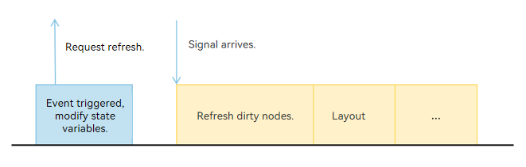
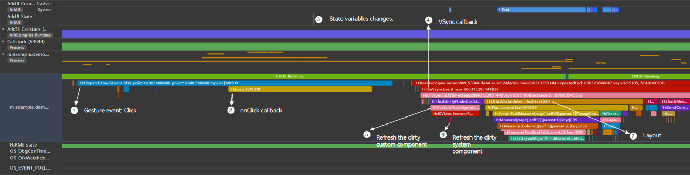
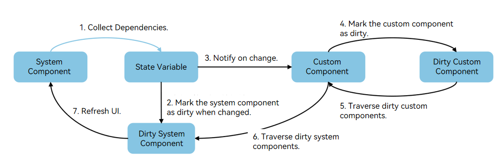

# State Management Principles
<!--Kit: ArkUI-->
<!--Subsystem: ArkUI-->
<!--Owner: @zany_pink-->
<!--Designer: @s10021109-->
<!--Tester: @zhangwenhan12-->
<!--Adviser: @zhang_yixin13-->

This document describes the basic principles of state management. The core logic of state management is to process the binding relationships between state variables, custom components, and system components. Its workflow can be summarized as two core phases: collecting dependencies and triggering updates.

## Collecting Dependencies

Collecting dependencies refers to establishing data binding relationships between state variables and components. During UI rendering, the state management framework will "observe" which state variables are read and record this "dependency relationship". A UI may use multiple state variables. When a state variable is modified, only the components related to the state variable are refreshed. Other components that are not related to the state variable are not refreshed. Therefore, during UI refresh, it is necessary to identify which components use the modified state variables so as to achieve the precise refresh of these components.

```ts
@Entry
@Component
struct Index {
  @State name: string = 'Jack';
  @State age: number = 10;
  @State grade: number = 5;

  build() {
    Column() {
      Text(`${this.name}'s age is ${this.age}`) // Text1
      Text(`${this.name}'s grade is ${this.grade}`) // Text2
      Button('change age') // Button1
        .onClick(() => {
          this.age++;
        })
      Button('change grade') // Button2
        .onClick(() => {
          this.grade++;
        })
    }
  }
}
```

In the above sample code, three state variables (**name**, **age**, and **grade**) are defined in the custom component **Index**, and two **Text** system components and two **Button** system components are created in the **build** function. The steps for collecting dependencies are as follows:

1. The custom component **Index** is created, and the **build** method is called for the first time to create the component.
2. When the framework executes **Text(`${this.name}'s age is ${this.age}`)**, the values of **this.name** and **this.age** need to be read to display the text content.
3. **name** and **age** are state variables decorated by the @State decorator. When a state variable is read, the unique identifier **elementId** of the system component that is being rendered is collected and stored in a **Set**. Therefore, the state variables **name** and **age** are both collected into **elementId1**, the unique identifier of **Text1**.
4. Similarly, when the framework executes **Text(`${this.name}'s grade is ${this.grade}`)**, the state variables **name** and **grade** collect the unique identifier **elementId2** of **Text2**.

Each state variable maintains a **Set** collection that stores the identification information of all system components bound to it. In the above example, the dependency collection of the state variable **name** stores the information of **Text1** and **Text2**, the dependency collection of the state variable **age** stores the information of **Text1**, and the dependency collection of the state variable **grade** stores the information of **Text2**. In this way, the framework completes the process of collecting dependencies.

## Triggering Updates

When a state variable changes, the state management framework will notify all UI components that depend on it to recalculate and refresh, which is called triggering updates. The triggering updates process can be divided into the following three steps:

- Calculate the new value of the state variable after the change.
- Change the value of the state variable and marks the component bound to the state variable as dirty.
- Refresh all dirty nodes, updates the UI, and collects dependencies again.

> **Description**
>
> The update is based on the custom component.

Similarly, for the above sample code, clicking the **Button** component modifies the state variable, and the corresponding **Text** component refreshes. The specific steps are as follows:

1. Click **Button1** to trigger the **onClick** event.
2. Execute **this.age++** in the event handler. Since **age** is a state variable, the internal update operations of the state management framework will be executed during the process of modifying its value.
3. Since multiple state variables in a custom component may change during a single UI update cycle, and updates are performed on a per-custom-component basis, each custom component maintains a collection of dirty-marked system components (dirty system component set for short), which is used to store the **elementId** of the dirty-marked system components in the current UI update cycle. In the update operation of the state variable **age**, the **elementId** of the system component in the dependency set is added to the dirty system component set of the custom component **Index** to which the system component belongs.
4. After the system component is marked as dirty, the custom component **Index** to which state variable **age** belongs is marked as dirty, added to the dirty custom component node list (dirty custom component list for short), and a refresh signal is requested for it.
5. In the next UI update period, the framework traverses the dirty custom component list and recalls the **rerender** method (generated by the system) of the custom component. When the **rerender** method of the custom component **Index** is executed, the framework traverses the dirty system components, refreshes the **Text1** component, and updates the dependencies.
6. Similarly, clicking **Button2** changes the value of the state variable **grade**, which triggers the refresh of the corresponding **Text2** component and updates the dependencies.

Triggering updates refers to the process where, based on the dependencies collected by the state variables, when the state variables change, all affected components are located and marked as dirty. In a UI update cycle, only the dirty components are refreshed to achieve minimal updates.

## State Management Process in the Rendering Pipeline

The UI rendering process consists of the following steps:



1. When the state variable changes due to an event, the **set** method of the state variable is executed, the custom component and system component are marked as dirty, and a refresh signal is requested.
2. Refresh dirty nodes: Refresh the dirty custom components and system components.
3. Layout: Refresh the component tree based on the dirty nodes, and trigger the size measurement and position confirmation of nodes in the subtree.

Similarly, taking the above sample code as an example, use the [Profiler tool](../ui-inspector-profiler.md#state-management-profiler) in DevEco Studio, click **Button1**, capture the change points of state variables, and the trace is shown in the figure below:



The following describes the marked points in the preceding figure one by one:

1. Click **Button1** to generate the trace point of the gesture event.
2. The **onClick** callback is triggered.
3. Change the value of the state variable **age** in the **onClick** callback.
4. When the next frame signal arrives, the VSync callback is executed.
5. Refresh the dirty custom component **Index**.
6. Iterate through the dirty system components in the custom component and re-render the **Text1** component.
7. Execute the subsequent layout process.

The following figure shows the basic process of state management.



State management is executed cyclically in two steps: collecting dependencies and triggering updates. Collect the dependencies between state variables and components. When a state variable changes, dirty marking is performed, the corresponding UI is refreshed, and the dependency relationships are updated simultaneously.

Compared with state management V1, state management V2 asynchronously marks components as dirty when the state variable changes. For details, see [Differences Between State Management V1 and V2 Update Mechanisms](./arkts-v1-v2-update-difference.md).
