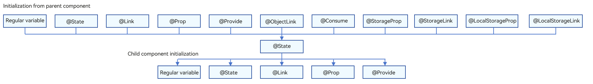
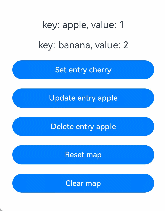
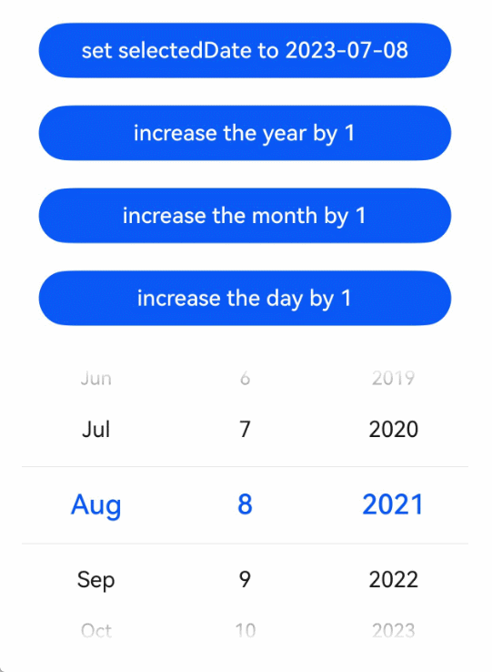

# \@State Decorator: State Owned by Component
<!--Kit: ArkUI-->
<!--Subsystem: ArkUI-->
<!--Owner: @jiyujia926-->
<!--Designer: @s10021109-->
<!--Tester: @TerryTsao-->
<!--Adviser: @zhang_yixin13-->

A variable decorated with a state decorator is called a state variable, enabling regular variables to possess state attributes. When a state variable changes, the UI components bound to it re-render and update accordingly.

Among state variable decorators, @State is the most fundamental and serves as the data source for most state management scenarios.

Before reading this topic, you are advised to read [State Management Overview](./arkts-state-management-overview.md) to have a basic understanding of the positioning of AppStorage in the state management framework. For best practices, see [State Management](https://developer.huawei.com/consumer/en/doc/best-practices/bpta-status-management). For FAQs, see [State Management Development](./arkts-state-management-faq.md).

> **Note:**
>
> This decorator can be used in ArkTS widgets since API version 9.
>
> This decorator can be used in atomic services since API version 11.

## Overview

An \@State decorated variable is private and accessible only within its component. The variable type must be explicitly specified and locally initialized during declaration. For initialization from parent components, use the named parameter mechanism to assign values.

\@State decorated variables have the following features:

- The lifecycle of the \@State decorated variable is the same as that of its owning custom component.

## Usage Rules

| \@State Decorator | Description                                                        |
| ------------------ | ------------------------------------------------------------ |
| Parameters        | None                                                          |
| Synchronization type          | Does not synchronize with any type of variable in the parent component.                            |
| Allowed variable types| object, class, string, number, Boolean, enum, and array of these types.<br>API version 10 and later: [Date type](#decorating-variables-of-the-date-type).<br>API version 11 and later: [Map](#decorating-variables-of-the-map-type), [Set](#decorating-variables-of-the-set-type), undefined, null, union types defined by the ArkUI framework, for example, [Length](../../reference/apis-arkui/arkui-ts/ts-types.md#length), [ResourceStr](../../reference/apis-arkui/arkui-ts/ts-types.md#resourcestr), and [ResourceColor](../../reference/apis-arkui/arkui-ts/ts-types.md#resourcecolor). For details, see [Using Union Types](#using-union-types).<br>For details about the supported types, see [Observed Changes](#observed-changes).|
| Disallowed variable types| Function.     |
| Initial value for the decorated variable| Required.     |

## Variable Transfer/Access Rules

| Transfer/Access         | Description                                                        |
| ------------------ | ------------------------------------------------------------ |
| Initialization from the parent component    | Supports initialization from the parent component or locally.<br>If the parent component passes a non-undefined value, the local initial value is overridden. Otherwise, the local initial value of \@State is used.<br>Accepts regular variables and decorated state variables from the parent component: \@State, [\@Link](arkts-link.md), [\@Prop](arkts-prop.md), [\@Provide](arkts-provide-and-consume.md), [\@Consume](arkts-provide-and-consume.md), [\@ObjectLink](arkts-observed-and-objectlink.md), [\@StorageLink](arkts-appstorage.md#storagelink), [\@StorageProp](arkts-appstorage.md#storageprop), [\@LocalStorageLink](arkts-localstorage.md#localstoragelink), [\@LocalStorageProp](arkts-localstorage.md#localstorageprop). Note: External variables from the parent component are used only as initial values; subsequent changes are not synchronized to \@State.|
| Child component initialization  | Supported. An \@State decorated variable can be used to initialize a regular variable or \@State, \@Link, \@Prop, or \@Provide decorated variable in the child component.|
| Access from outside the component| Private, accessible only within the component.                                  |

  **Figure 1** Initialization rule



## Observed Changes and Behavior

Not all changes to state variables cause UI updates. Only changes that can be observed by the framework do. This section describes what changes can be observed and how the framework triggers UI re-renders after the changes are observed, that is, how the framework behaves.

### Observed Changes

- When the decorated variable is of the Boolean, string, or number type, its value change can be observed.

  ```ts
  // Primitive type
  @State count: number = 0;
  // The value change can be observed.
  this.count = 1;
  ```

- When the decorated variable is of the class or Object type, object assignments and top-level property changes are observable. Top-level properties include all properties returned by **Object.keys(observedObject)**. Example:
  
  Declare the **Person** and **Model** classes.
  <!-- @[state_change_observation_object](https://gitcode.com/openharmony/applications_app_samples/blob/master/code/DocsSample/ArkUISample/ParadigmStateManagement/entry/src/main/ets/pages/state/StateChangeObservationObject.ets) -->
  
  ``` TypeScript
  class Person {
    public value: string;
  
    constructor(value: string) {
      this.value = value;
    }
  }
  
  class Model {
    public value: string;
    public name: Person;
  
    constructor(value: string, person: Person) {
      this.value = value;
      this.name = person;
    }
  }
  ```

  \@State The decorative type is Model.
    <!-- @[state_decorate_type_object](https://gitcode.com/openharmony/applications_app_samples/blob/master/code/DocsSample/ArkUISample/ParadigmStateManagement/entry/src/main/ets/pages/state/StateChangeObservationObject.ets) -->
  
    ``` TypeScript
    // Class type
    @State title: Model = new Model('Hello', new Person('World'));
    ```

  Assign a value to the \@State decorated variable.
    <!-- @[state_decorate_object_change_01](https://gitcode.com/openharmony/applications_app_samples/blob/master/code/DocsSample/ArkUISample/ParadigmStateManagement/entry/src/main/ets/pages/state/StateChangeObservationObject.ets) -->
  
    ``` TypeScript
    // Assign a value to the class object.
    this.title = new Model('Hi', new Person('ArkUI'));
    ```

  Assign a value to a property of the \@State decorated variable.
    <!-- @[state_decorate_object_change_02](https://gitcode.com/openharmony/applications_app_samples/blob/master/code/DocsSample/ArkUISample/ParadigmStateManagement/entry/src/main/ets/pages/state/StateChangeObservationObject.ets) -->
  
    ``` TypeScript
    // Assign a value to a property of the class object.
    this.title.value = 'Hi';
    ```

  The value assignment of the nested property cannot be observed.
    <!-- @[state_decorate_object_change_03](https://gitcode.com/openharmony/applications_app_samples/blob/master/code/DocsSample/ArkUISample/ParadigmStateManagement/entry/src/main/ets/pages/state/StateChangeObservationObject.ets) -->
  
    ``` TypeScript
    // The value assignment of the nested property cannot be observed.
    this.title.name.value = 'ArkUI';
    ```

- When the decorated object is of the Date type, the following changes can be observed: (1) complete **Date** object reassignment; (2) property changes caused by calling **Date** APIs **setFullYear**, **setMonth**, **setDate**, **setHours**, **setMinutes**, **setSeconds**, **setMilliseconds**, **setTime**, **setUTCFullYear**, **setUTCMonth**, **setUTCDate**, **setUTCHours**, **setUTCMinutes**, **setUTCSeconds**, or **setUTCMilliseconds**. The value assignment of the nested attribute in the array item cannot be observed. For details, see [Decorating Variables of the Array Type](#decorating-variables-of-the-array-type).

- When the decorated object is of the Date type, the following changes can be observed: (1) complete **Date** object reassignment; (2) property changes caused by calling **Date** APIs **setFullYear**, **setMonth**, **setDate**, **setHours**, **setMinutes**, **setSeconds**, **setMilliseconds**, **setTime**, **setUTCFullYear**, **setUTCMonth**, **setUTCDate**, **setUTCHours**, **setUTCMinutes**, **setUTCSeconds**, or **setUTCMilliseconds**.

- When the decorated object is of the **Map** type, the following changes can be observed: (1) complete **Map** object reassignment; (2) changes caused by calling **set**, **clear**, or **delete**. For details, see [Decorating Variables of the Map Type](#decorating-variables-of-the-map-type).

- When the decorated object is of the **Set** type, the following changes can be observed: (1) complete **Set** object reassignment; (2) changes caused by calling **add**, **clear**, or **delete**. For details, see [Decorating Variables of the Set Type](#decorating-variables-of-the-set-type).

### Framework Behavior

- When a state variable changes, the framework identifies all components that depend on this state variable.

- The framework executes update methods for dependent components, enabling component updates and re-rendering.

## Constraints

1. Variables decorated by \@State must be initialized. Otherwise, an error is reported during compilation.

    ```ts
    // Incorrect usage. An error is reported during compilation.
    @State count: number;
    
    // Correct usage.
    @State count: number = 10;
    ```

2. \@State cannot decorate variables of the Function type. Before API version 23, the framework throws a runtime error.

   Since API version 23, validation of \@State for variables of Function type is added, and a compilation error will be reported.

## When to Use

### Decorating Variables of Simple Types

In this example, \@State is used to decorate the **count** variable of the simple type, turning it into a state variable. The change of **count** causes the update of the **Button** component.

- When the state variable **count** changes, only the **Button** component is identified as dependent.

- The framework executes the update method of the **Button** component to implement on-demand updates.
    <!-- @[state_scene_simple_type](https://gitcode.com/openharmony/applications_app_samples/blob/master/code/DocsSample/ArkUISample/ParadigmStateManagement/entry/src/main/ets/pages/state/StateSceneSimpleType.ets) -->
    
    ``` TypeScript
    @Entry
    @Component
    struct MyComponent {
      @State count: number = 0; // @State decorated simple variables.
    
      build() {
        Row() {
          Column() {
            Button(`click times: ${this.count}`)
              .onClick(() => {
                this.count += 1;
              })
              .width(300)
          }
          .width('100%')
        }
        .height('100%')
      }
    }
    ```


### Decorating Variables of the Class Object Type

- In this example, \@State is used to decorate the variables **count** and **title** in the custom component **MyComponent**. The type of **title** is **Model**, a custom class. If the value of **count** or **title** changes, the framework searches for all **MyComponent** instances that depend on these variables and triggers re-rendering of them.

- The **EntryComponent** has multiple **MyComponent** instances. The internal state change of the first **MyComponent** instance does not affect the second **MyComponent** instance.

    <!-- @[state_scene_type_class](https://gitcode.com/openharmony/applications_app_samples/blob/master/code/DocsSample/ArkUISample/ParadigmStateManagement/entry/src/main/ets/pages/state/StateSceneTypeClass.ets) -->
    
    ``` TypeScript
    class Model {
      public value: string;
    
      constructor(value: string) {
        this.value = value;
      }
    }
    
    @Entry
    @Component
    struct EntryComponent {
      build() {
        Column() {
          // The parameters specified here will overwrite the default values defined locally during initial render. Not all parameters need to be initialized from the parent component.
          MyComponent({ count: 1, increaseBy: 2 })
            .width(300)
          MyComponent({ title: new Model('Hello World 2'), count: 7 })
        }
      }
    }
    
    @Component
    struct MyComponent {
      @State title: Model = new Model('Hello World');
      @State count: number = 0;
      increaseBy: number = 1;
    
      build() {
        Column() {
          Text(`${this.title.value}`)
            .margin(10)
          Button(`Click to change title`)
            .onClick(() => {
              // The update of the @State decorated variable triggers the update of the <Text> component.
              this.title.value = this.title.value === 'Hello ArkUI' ? 'Hello World' : 'Hello ArkUI';
            })
            .width(300)
            .margin(10)
    
          Button(`Click to increase count = ${this.count}`)
            .onClick(() => {
              // The update of the @State decorated variable triggers the update of the <Button> component.
              this.count += this.increaseBy;
            })
            .width(300)
            .margin(10)
        }
      }
    }
    ```


In the preceding example, the initialization mechanism of the \@State variable is as follows:

1. If no value is passed from the external, the default value is used for local initialization.

    <!-- @[state_scene_type_class_local_init](https://gitcode.com/openharmony/applications_app_samples/blob/master/code/DocsSample/ArkUISample/ParadigmStateManagement/entry/src/main/ets/pages/state/StateSceneTypeClass.ets) -->
    
    ``` TypeScript
    // No external value is passed to title. Use the local value new Model('Hello World') for initialization.
    MyComponent({ count: 1, increaseBy: 2 })
    // No external value is passed to increaseBy. Use the local value 1 for initialization.
    MyComponent({ title: new Model('Hello World 2'), count: 7 })
    ```

2. If a value is passed from the external, use this value for initialization.

    <!-- @[state_scene_type_class_out_value_init](https://gitcode.com/openharmony/applications_app_samples/blob/master/code/DocsSample/ArkUISample/ParadigmStateManagement/entry/src/main/ets/pages/state/StateSceneTypeClass.ets) -->
    
    ``` TypeScript
    // Used 1 and 2 passed from the external to initialize count and increaseBy.
    MyComponent({ count: 1, increaseBy: 2 })
    // Used new Model('Hello World 2') and 7 passed from the external to initialize title and count.
    MyComponent({ title: new Model('Hello World 2'), count: 7 })
    ```

### Decorating Variables of the Array Type

In this example, the **fruits** variable decorated with \@State is of the **Array\<Fruit\>** type. After the button is clicked, the value of **fruits** changes, and the UI is re-rendered.
<!-- @[state_scene_type_array](https://gitcode.com/openharmony/applications_app_samples/blob/master/code/DocsSample/ArkUISample/ParadigmStateManagement/entry/src/main/ets/pages/state/StateSceneTypeArray.ets) -->

``` TypeScript
class Fruit {
  public name: string;

  constructor(name: string) {
    this.name = name;
  }
}

@Entry
@Component
struct ArraySample {
  @State fruits: Fruit[] = [new Fruit('apple'), new Fruit('banana')]; // @State decorated variables of the Array type.

  build() {
    Row() {
      Column() {
        ForEach(this.fruits, (item: Fruit) => {
          Text(`${item.name}`)
            .fontSize(20)
            .margin(10)
        })
        // Reassign an array element, triggering UI update.
        Button('Set element at index 0')
          .onClick(() => {
            this.fruits[0] = new Fruit('orange');
          })
          .width(300)
          .margin(10)
        // Add an array element, triggering UI update.
        Button('Push element')
          .onClick(() => {
            this.fruits.push(new Fruit('cherry'));
          })
          .width(300)
          .margin(10)
        // Delete an array element, triggering UI update.
        Button('Pop element')
          .onClick(() => {
            this.fruits.pop();
          })
          .width(300)
          .margin(10)
        // Reassign an array, triggering UI update.
        Button('Reset array')
          .onClick(() => {
            this.fruits = [new Fruit('strawberry'), new Fruit('blueberry')];
          })
          .width(300)
          .margin(10)
        // Modify the nested property, which cannot trigger UI update.
        Button('Modify element[0] property')
          .onClick(() => {
            this.fruits[0].name = 'pineapple';
          })
          .width(300)
          .margin(10)
      }
      .width('100%')
    }
    .height('100%')
  }
}
```


### Decorating Variables of the Map Type

> **NOTE**
>
> Since API version 11, \@State supports the Map type.

In this example, the **fruits** variable decorated with \@State is of the **Map\<string, number\>** type. After the button is clicked, the value of **fruits** changes, and the UI is re-rendered.
<!-- @[state_scene_type_map](https://gitcode.com/openharmony/applications_app_samples/blob/master/code/DocsSample/ArkUISample/ParadigmStateManagement/entry/src/main/ets/pages/state/StateSceneTypeMap.ets) -->

``` TypeScript
@Entry
@Component
struct MapSample {
  @State fruits: Map<string, number> = new Map([['apple', 1], ['banana', 2]]); // @State decorated variables of the Map type.

  build() {
    Row() {
      Column() {
        ForEach(Array.from(this.fruits.entries()), (item: [string, number]) => {
          Text(`key: ${item[0]}, value: ${item[1]}`)
            .fontSize(20)
            .margin(10)
        })
        // Add a key-value pair, triggering UI update.
        Button('Set entry cherry')
          .onClick(() => {
            this.fruits.set('cherry', 3);
          })
          .width(300)
          .margin(10)
        // Update a key-value pair, triggering UI update.
        Button('Update entry apple')
          .onClick(() => {
            this.fruits.set('apple', 4);
          })
          .width(300)
          .margin(10)
        // Delete a key-value pair, triggering UI update.
        Button('Delete entry apple')
          .onClick(() => {
            this.fruits.delete('apple');
          })
          .width(300)
          .margin(10)
        // Reassign values to the entire Map, triggering UI update.
        Button('Reset map')
          .onClick(() => {
            this.fruits = new Map([['strawberry', 9], ['blueberry', 8]]);
          })
          .width(300)
          .margin(10)
        // Clear the values of the entire Map, triggering UI update.
        Button('Clear map')
          .onClick(() => {
            this.fruits.clear();
          })
          .width(300)
          .margin(10)
      }
      .width('100%')
    }
    .height('100%')
  }
}
```



### Decorating Variables of the Set Type

> **NOTE**
>
> Since API version 11, \@State supports the Set type.

In this example, the **fruits** variable decorated with \@State is of the **Set\<string\>** type. After the button is clicked, the value of **fruits** changes, and the UI is re-rendered.
<!-- @[state_scene_type_set](https://gitcode.com/openharmony/applications_app_samples/blob/master/code/DocsSample/ArkUISample/ParadigmStateManagement/entry/src/main/ets/pages/state/StateSceneTypeSet.ets) -->

``` TypeScript
@Entry
@Component
struct SetSample {
  @State fruits: Set<string> = new Set(['apple', 'banana']); // @State decorated variables of the Set type.

  build() {
    Row() {
      Column() {
        ForEach(Array.from(this.fruits.entries()), (item: [number, number]) => {
          Text(`${item[0]}`)
            .fontSize(20)
            .margin(10)
        })
        // Add an element, triggering UI update.
        Button('Add element')
          .onClick(() => {
            this.fruits.add('cherry');
          })
          .width(300)
          .margin(10)
        // Delete an element, triggering UI update.
        Button('Delete element apple')
          .onClick(() => {
            this.fruits.delete('apple');
          })
          .width(300)
          .margin(10)
        // Reassign values to the entire Set, triggering UI update.
        Button('Reset set')
          .onClick(() => {
            this.fruits = new Set(['strawberry', 'blueberry']);
          })
          .width(300)
          .margin(10)
        // Clear the values of the entire Set, triggering UI update.
        Button('Clear set')
          .onClick(() => {
            this.fruits.clear();
          })
          .width(300)
          .margin(10)
      }
      .width('100%')
    }
    .height('100%')
  }
}
```


### Decorating Variables of the Date Type

In this example, the **selectedDate** variable decorated by \@State is of the **Date** type. After the button is clicked, the value of **selectedDate** changes, and the UI is re-rendered.
<!-- @[state_scene_type_date](https://gitcode.com/openharmony/applications_app_samples/blob/master/code/DocsSample/ArkUISample/ParadigmStateManagement/entry/src/main/ets/pages/state/StateSceneTypeDate.ets) -->

``` TypeScript
@Entry
@Component
struct DatePickerExample {
  @State selectedDate: Date = new Date('2021-08-08'); // @State decorated variables of the Date type.

  build() {
    Row() {
      Column() {
        // Reassign a new Date instance to selectedDate, triggering UI update.
        Button('set selectedDate to 2023-07-08')
          .onClick(() => {
            this.selectedDate = new Date('2023-07-08');
          })
          .margin(10)
          .width(300)
        // Call the setFullYear API of Date to change the year, triggering UI update.
        Button('increase the year by 1')
          .onClick(() => {
            this.selectedDate.setFullYear(this.selectedDate.getFullYear() + 1);
          })
          .margin(10)
          .width(300)
        // Call the setMonth API of Date to change the month, triggering UI update.
        Button('increase the month by 1')
          .onClick(() => {
            this.selectedDate.setMonth(this.selectedDate.getMonth() + 1);
          })
          .margin(10)
          .width(300)
        // Call the setDate API of Date to change the date, triggering UI update.
        Button('increase the day by 1')
          .onClick(() => {
            this.selectedDate.setDate(this.selectedDate.getDate() + 1);
          })
          .margin(10)
          .width(300)
        DatePicker({
          start: new Date('1970-1-1'),
          end: new Date('2100-1-1'),
          selected: this.selectedDate
        }).margin(20)
      }
      .width('100%')
    }
    .height('100%')
  }
}
```



### Using Union Types

\@State supports **undefined**, **null**, and union types. In the following example, the type of **count** is **number | undefined**. If the property or type of **count** is changed when the button is clicked, the change will be synced to the view.
<!-- @[state_scene_joint_type_instance](https://gitcode.com/openharmony/applications_app_samples/blob/master/code/DocsSample/ArkUISample/ParadigmStateManagement/entry/src/main/ets/pages/state/StateSceneJointTypeInstance.ets) -->

``` TypeScript
@Entry
@Component
struct UnionTypeSample {
  @State count: number | undefined = 0; // @State decorated variables of the union type.

  build() {
    Row() {
      Column() {
        Text(`count: ${this.count}`)
        // Change the union variable from number to undefined, triggering the UI update.
        Button('change to undefined')
          .onClick(() => {
            this.count = undefined;
          })
          .width(300)
          .margin(10)
        // Change the union variable from undefined to number, triggering the UI update.
        Button('change to number')
          .onClick(() => {
            this.count = 10;
          })
          .width(300)
          .margin(10)
      }
      .width('100%')
    }
    .height('100%')
  }
}
```

