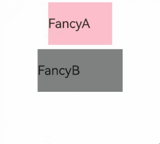

# \@Styles Decorator: Defining Reusable Component Styles
<!--Kit: ArkUI-->
<!--Subsystem: ArkUI-->
<!--Owner: @BlYynNe-->
<!--Designer: @VictorS67-->
<!--Tester: @TerryTsao-->
<!--Adviser: @BIYynNe-->
<!-- md-trans-meta sourceCommit=fffb4962633ed64c468b737162ba8ed5b542a65e translatedAt=2026-09-21T11:43:26.174Z pushedAt=2026-09-23T09:31:11.268Z -->

If the style of each component must be set separately, a large amount of repetitive style setup code is generated during development. Although you can copy and paste the code, ArkUI provides the [\@Styles](../../reference/apis-arkui/arkui-ts/ts-custom-component-decorator-styles.md#styles) decorator to extract common styles for reuse, keeping the code concise and easy to maintain.

\@Styles eliminates repetitive style setup by allowing you to apply preconfigured styles with a single method invocation.

> **NOTE**
>
> The APIs of this module are supported since API version 9.
>
> This decorator can be used in ArkTS widgets since API version 9.
>
> This decorator can be used in atomic services since API version 11.

## How to Use

- Currently, \@Styles supports only [universal attributes](../../reference/apis-arkui/arkui-ts/ts-component-general-attributes.md) and [universal events](../../reference/apis-arkui/arkui-ts/ts-component-general-events.md).

- \@Styles can be defined within a component or globally. When it is defined globally, the **function** keyword must precede the method name. When it is defined within a component, the **function** keyword is not required. For details, see [Using Component-Local and Global \@Styles](#using-component-local-and-global-styles).

- The priority of \@Styles defined within a component is higher than that of global \@Styles. The framework preferentially searches for \@Styles within the current component. If it is not found, the framework searches globally.

> **NOTE**
>
> \@Styles can be used only in the current file and cannot be exported.
>
> To export styles, you are advised to use [AttributeModifier](../../ui/arkts-user-defined-extension-attributeModifier.md).


\@Styles defined within a component can access the component's constants and state variables through **this**, and can change the values of state variables through events in \@Styles. The following is an example:

<!-- @[inner_style](https://gitcode.com/openharmony/applications_app_samples/blob/master/code/DocsSample/ArkUISample/ComponentExtension/entry/src/main/ets/pages/StylesDecorator/StylesDecorator2.ets) --> 

``` TypeScript
@Entry
@Component
struct FancyUse {
  @State heightValue: number = 50;

  @Styles
  fancy() {
    .height(this.heightValue)
    .backgroundColor(Color.Blue)
    .onClick(() => {
      this.heightValue = 100;
    })
  }

  build() {
    Column() {
      // Provide style settings for Button through fancy.
      Button('change height')
        .fancy()
    }
    .height('100%')
    .width('100%')
  }
}
```


## Constraints

- \@Styles does not support passing parameters. A compilation error will be thrown if parameters are provided.

``` TypeScript
  // Incorrect: @Styles does not support parameters. A compilation error will be thrown.
  @Styles
  function globalFancy (value: number) {
    .width(value)
  }

```

<!-- @[style_not_parameter](https://gitcode.com/openharmony/applications_app_samples/blob/master/code/DocsSample/ArkUISample/ComponentExtension/entry/src/main/ets/pages/StylesDecorator/StylesDecorator2.ets) --> 

``` TypeScript
// Correct usage.
  @Styles
  function globalFancy() {
    .width(100)
  }
```

- Conditional rendering statements are not supported in the \@Styles method. Attributes within conditional rendering statements do not take effect.

``` TypeScript
  // Incorrect usage.
  @Styles
  function backgroundColorStyle() {
    if (true) {
      .backgroundColor(Color.Red)
    }
  }

```

<!-- @[style_not_if](https://gitcode.com/openharmony/applications_app_samples/blob/master/code/DocsSample/ArkUISample/ComponentExtension/entry/src/main/ets/pages/StylesDecorator/StylesDecorator2.ets) -->

``` TypeScript
// Correct usage.
  @Styles
  function backgroundColorStyle() {
    .backgroundColor(Color.Red)
  }
```

## Use Scenarios

### Using Component-Local and Global \@Styles

<!-- @[global_style](https://gitcode.com/openharmony/applications_app_samples/blob/master/code/DocsSample/ArkUISample/ComponentExtension/entry/src/main/ets/pages/StylesDecorator/StylesDecorator1.ets) -->

``` TypeScript
// Styles encapsulated by @Styles defined globally.
@Styles
function globalFancy1() {
  .width(150)
  .height(100)
  .backgroundColor(Color.Pink)
}

@Entry
@Component
struct GlobalFancy {
  @State heightValue: number = 100;

  // Styles encapsulated by @Styles defined within the component.
  @Styles
  fancy() {
    .width(200)
    .height(this.heightValue)
    .backgroundColor(Color.Gray)
    .onClick(() => {
      this.heightValue = 200;
    })
  }

  build() {
    Column({ space: 10 }) {
      // Use styles encapsulated by global @Styles.
      Text('FancyA')
        .globalFancy1()
        .fontSize(30)
      // Use styles encapsulated by @Styles within the component.
      Text('FancyB')
        .fancy()
        .fontSize(30)
    }
    .width('100%')
  }
}
```
