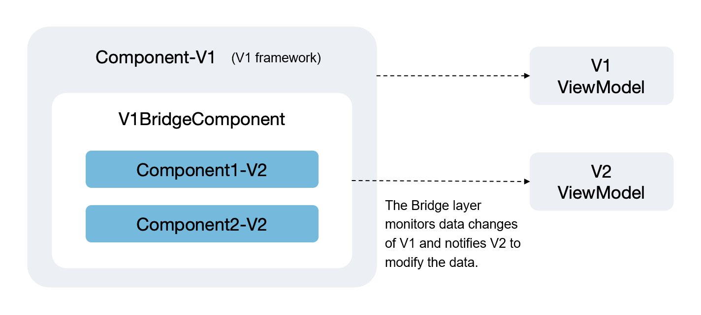

# Guidelines for Mixed Use of State Management V1 and V2 (Before API Version 19)

<!--Kit: ArkUI--> 
<!--Subsystem: ArkUI--> 
<!--Owner: @jiyujia926--> 
<!--Designer: @zhangboren--> 
<!--Tester: @TerryTsao--> 
<!--Adviser: @zhang_yixin13-->
<!-- md-trans-meta sourceCommit=5cbda8a742fe4c75db3800c28ccfc8ffcd9cebc0 translatedAt=2026-06-30T03:38:40.780Z pushedAt=2026-07-01T03:34:24.237Z -->

## Overview

> **NOTE**
> 
> In this document, "->" indicates the passing of variables. For example, "V1->V2" means a V1 state variable is passed to a V2 state variable.

Before API version 19, mixed usage scenarios are subject to relatively strict validation. The rules for mixing State Management V1 and V2 are as follows:

**1. Summary of V1->V2 Rules**

- V2 decorators cannot be used in V1 custom components; otherwise, a compilation error will occur.

- When no variables are passed between components, V2 custom components can be used in V1 custom components, including imported third-party custom components decorated with \@ComponentV2.

- When variables are passed between components, the following restrictions apply when passing V1 variables to V2 custom components:

  - Variables in V1 not decorated by any decorator (hereinafter referred to as regular variables): V2 can only receive them using \@Param.

  - Variables in V1 decorated by a decorator (hereinafter referred to as state variables): V2 can only receive them through the \@Param decorator, and this is limited to simple type data such as boolean, number, enum, string, undefined, and null.

**2. V2->V1 Rule Summary**

- V1 decorators cannot be used in V2 custom components; otherwise, a compilation error will occur.

- When there is no variable passing between components, V2 custom components can use V1 custom components, including imported third-party custom components decorated with \@Component.

- When there is variable passing between components, passing V2 variables to V1 custom components has the following restrictions:

  - Passing V2 regular variables (not decorated with state variable decorators) to V1 custom components:

     If V1 uses a state variable to receive this data, only the following three V1 state variable decorators can be used: [@State](./arkts-state.md), [@Prop](./arkts-prop.md), and [@Provide](./arkts-provide-and-consume.md).

  - V2 state variable (decorated with a state variable decorator) passed to a V1 custom component:

     If V1 uses a state variable decorator (again, only \@State, \@Prop, and \@Provide are supported) to decorate the received data, built-in type data such as Array, Set, Map, and Date are not supported. Note that V2 state variables support the Function type, but none of the V1 state variable decorators support the Function type. Passing a Function type will cause a runtime verification error. Taking \@State as an example, see [@State restrictions](./arkts-state.md#constraints) for details.

  - [@Link](./arkts-link.md) in V1 follows its original initialization rules and can only be initialized by a V1 state variable. For details, see [@Link initialization rule diagram](./arkts-link.md#variable-transferaccess-rules).

## Restrictions

- Mixing V1 and V2 decorators is not allowed.

  V1 component decorators are not supported in V2 custom components, and V2 component decorators are not supported in V1 custom components. A compilation error will occur.

- V1 decorators cannot be used together with [@ObservedV2](./arkts-new-observedV2-and-trace.md), otherwise a compilation error will occur.

- V2 decorators cannot be used together with [@Observed](./arkts-observed-and-objectlink.md), otherwise a compilation error will occur.

- Passing state variables from V1 to V2 only supports simple types. Passing complex type state variables is not allowed. For example, passing a class decorated by @Observed or a built-in type decorated by a decorator (Array, Map, Set, Date) will cause a compilation error.

- V2->V1 can pass simple type state variables and ordinary classes. If passing a class decorated by @ObservedV2 or a built-in type decorated by a decorator (Array, Map, Set, Date), a compilation error occurs.

- @ObjectLink in V1 only accepts initialization from classes decorated by @Observed.

- [@Link](./arkts-link.md) in V1 follows its original initialization rules and can only be initialized by V1 state variables. For details, see [@Link Initialization Rule Diagram](./arkts-link.md#variable-transferaccess-rules).

- Multiple decorators are not allowed to decorate the same variable (except @Watch, @Once, @Require).

  ```ts
  @State @Prop message: string = "";  // Multiple V1 decorators cannot decorate the same variable, resulting in a compilation error
  ```

  ```ts
  @Local @Param message: string = 'Hello World'; // Multiple V2 decorators are not allowed to decorate the same variable, resulting in a compilation error
  ```

Except for capability extension decorators such as \@Watch, \@Once, and \@Require, which can be used in conjunction with other decorators, other decorators are not allowed to decorate the same variable.

## Using V2 Custom Components in V1

### Without Passing Variables

When using a V2 custom component in V1, if no variables are passed, there is no impact. In the following example code, ChildSix is a V2 custom component that does not accept parameters, and IndexSix can directly use ChildSix.

<!-- @[v1_use_v2](https://gitcode.com/openharmony/applications_app_samples/blob/master/code/DocsSample/ArkUISample/CustomComponentsMixingUse/entry/src/main/ets/pages/MixingUseofCustomComponents/V2InV1.ets) -->

``` TypeScript
@ComponentV2
struct ChildSix {
  @Local message: string = 'hello';

  build() {
    Column() {
      Text(this.message)
        .fontSize(50)
        .fontWeight(FontWeight.Bold)
        .onClick(() => {
          this.message = 'world';
        })
    }
  }
}

@Entry
@Component
struct IndexSix {
  @State message: string = 'Hello World';

  build() {
    Column() {
      Text(this.message)
        .fontSize(50)
        .fontWeight(FontWeight.Bold)
        .onClick(() => {
          this.message = 'world hello';
        })
      Divider()
        .color(Color.Blue)
      // V2 components without parameters can be used directly.
      ChildSix()
    }
    .height('100%')
    .width('100%')
  }
}
```

### Passing undecorated variables

When a variable is not decorated by a decorator, it does not have the capability to be observed. When passing this variable to V2, note that V2 components have strict management of data input and must receive it through the [@Param](./arkts-new-param.md) decorator. The observation capability for receiving data in V2 is the \@Param capability. For received Class types, changes can only be observed through \@ObservedV2 and \@Trace.

In the following code example, ChildTwo is defined as a V2 component that accepts parameters such as message, undefinedVal, and info. The simple types message and undefinedVal received with \@Param in ChildTwo can be observed for changes; the Class type variable info is not decorated by \@ObservedV2 and \@Trace, so changes to its class attributes cannot be observed.

<!-- @[v1_to_v2_common_variables](https://gitcode.com/openharmony/applications_app_samples/blob/master/code/DocsSample/ArkUISample/CustomComponentsMixingUse/entry/src/main/ets/pages/MixingUseofCustomComponents/V1CommonVariablesToV2CustomComponent.ets) -->

``` TypeScript
class InfoTwo {
  public myId: number;
  public name: string;

  constructor(myId?: number, name?: string) {
    this.myId = myId || 0;
    this.name = name || 'aaa';
  }
}

@ComponentV2
struct ChildTwo {
  // V2 enforces strict data input management. When data is passed from a parent component, it must be received using the @Param decorator.
  @Param @Once message: string = 'hello'; // Changes can be observed, and synchronization back to the parent component depends on @Event. Using @Once allows modification of the variable decorated with @Param.
  @Param @Once undefinedVal: string | undefined = undefined; // Using @Once allows modification of the variable decorated with @Param.
  @Param info: InfoTwo = new InfoTwo(); // Class property changes cannot be observed.
  @Require @Param set: Set<number>;

  build() {
    Column() {
      Text(`child message:${this.message}`) // Display the message variable.
        .fontSize(30)
        .fontWeight(FontWeight.Bold)
        .onClick(() => {
          this.message = 'world'; // Refresh the current component.
        })

      Divider()
        .color(Color.Blue)
      Text(`undefinedVal:${this.undefinedVal}`) // Display the undefinedVal variable.
        .fontSize(30)
        .fontWeight(FontWeight.Bold)
        .onClick(() => {
          this.undefinedVal = 'change to define'; // Refresh the current component.
        })
      Divider()
        .color(Color.Blue)
      Text(`info id:${this.info.myId}`) // Display the info.myId variable.
        .fontSize(30)
        .fontWeight(FontWeight.Bold)
        .onClick(() => {
          this.info.myId++; // No refresh.
        })
      Divider()
        .color(Color.Blue)
      ForEach(Array.from(this.set.values()), (item: number) => { // Display the set variable.
        Text(`${item}`)
          .fontSize(30)
      })
    }
    .margin(5)
  }
}

@Entry
@Component
struct IndexTwo {
  message: string = 'Hello World'; // Primitive type.
  undefinedVal: undefined = undefined; // Primitive type, undefined.
  info: InfoTwo = new InfoTwo(); // Class type.
  set: Set<number> = new Set([10, 20]); // Built-in type.

  build() {
    Column() {
      Text(`message:${this.message}`)
        .fontSize(30)
        .fontWeight(FontWeight.Bold)
        .onClick(() => {
          this.message = 'world hello';
        })
      Divider()
        .color(Color.Blue)
      ChildTwo({
        message: this.message,
        undefinedVal: this.undefinedVal,
        info: this.info,
        set: this.set
      })
    }
    .height('100%')
    .width('100%')
  }
}
```

### Passing simple type state variables

When using a V2 component in V1, decorators in V1 components only support decorating simple type data, including: boolean, number, string, null, and undefined. V2 components use \@Param to receive parameters.

If a Class type or built-in type (Array, Map, Set, Date) decorated with \@State is passed when using a V2 component in V1, a compilation error will occur. In the following example code, the \@State decorator must be removed from the info and set variables. The behavior of \@Prop, \@Link, \@ObjectLink, \@Provide, \@Consume, \@StorageProp, \@StorageLink, \@LocalStorageProp, and \@LocalStorageLink is consistent with \@State.

<!-- @[v1_to_v2_state_variables](https://gitcode.com/openharmony/applications_app_samples/blob/master/code/DocsSample/ArkUISample/CustomComponentsMixingUse/entry/src/main/ets/pages/MixingUseofCustomComponents/V1StateVariablesToV2CustomComponent.ets) -->

``` TypeScript
class InfoFour {
  public myId: number;
  public name: string;

  constructor(myId?: number, name?: string) {
    this.myId = myId || 0;
    this.name = name || 'aaa';
  }
}

@ComponentV2
struct ChildFour {
  // V2 has strict management of data input. When data is passed from a parent component, the @Param decorator must be used to receive the data.
  @Param @Once message: string = 'hello';
  @Param @Once undefinedVal: string | undefined = undefined; // Using @Once allows modification of the variable decorated with @Param.
  @Param info: InfoFour = new InfoFour();
  @Require @Param set: Set<number>;

  build() {
    Column() {
      Text(`child message:${this.message}`) // Display the message variable.
        .fontSize(30)
        .fontWeight(FontWeight.Bold)
        .onClick(() => {
          this.message = 'world';
        })
      Divider()
        .color(Color.Blue)
      Text(`undefinedVal:${this.undefinedVal}`) // Display the undefinedVal variable.
        .fontSize(30)
        .fontWeight(FontWeight.Bold)
        .onClick(() => {
          this.undefinedVal = 'change to define';
        })
      Divider()
        .color(Color.Blue)
      Text(`info id:${this.info.myId}`) // Display the info.myId variable.
        .fontSize(30)
        .fontWeight(FontWeight.Bold)
        .onClick(() => {
          this.info.myId++;
        })
      Divider()
        .color(Color.Blue)
      ForEach(Array.from(this.set.values()), (item: number) => { // Display the set variable.
        Text(`${item}`)
          .fontSize(30)
      })
    }
    .margin(5)
  }
}

@Entry
@Component
struct IndexFour {
  @State message: string = 'Hello World'; // Primitive type, supported.
  @State undefinedVal: undefined = undefined; // Primitive type; undefined; supported
  @State info: InfoFour = new InfoFour(); // Class type is not supported for passing, resulting in a compilation error. Remove @State to eliminate the compilation error.
  @State set: Set<number> = new Set([10, 20]); // Built-in type is not supported for passing, resulting in a compilation error. Remove @State to eliminate the compilation error.

  build() {
    Column() {
      Text(`message:${this.message}`)
        .fontSize(30)
        .fontWeight(FontWeight.Bold)
        .onClick(() => {
          this.message = 'world hello';
        })
      Divider()
        .color(Color.Blue)
      ChildFour({
        message: this.message,
        undefinedVal: this.undefinedVal,
        info: this.info,
        set: this.set
      })
    }
    .height('100%')
    .width('100%')
  }
}
```

### Passing class type state variables

When using V2 components in V1 to pass parameters, V1 decorators only support decorating simple type data and do not support class types. The following provides a migration solution for scenarios involving class type data passing.

**Class decorated by \@Observed**

V2 decorators cannot be used together with @Observed. When V1 passes a class decorated by @Observed to a V2 custom component, do not directly use @Param to receive the data. As shown in the following figure, first define a V1BridgeComponent as the bridging layer. Listen to the data of the V1 component in the bridging layer and synchronize it to the singleton data defined in V2. The V1 component directly uses V1BridgeComponent, and the V2 custom component is introduced within V1BridgeComponent.



For specific implementation, refer to the following example code:

1. Use @ObservedV2 to decorate the class singleton ViewModelV2. The V2 component V2Comp directly uses the singleton ViewModelV2 instance for UI rendering.

2. Add a bridging component V1BridgeComponent decorated by @Component between the V1 component V1Comp and the V2 component V2Comp. Use @Watch to listen and assign the class data decorated by @Observed in V1 to the class data decorated by @ObservedV2 in V2.

3. Directly introduce the bridge component V1BridgeComponent in the V1 component V1Comp, and the bridge component V1BridgeComponent introduces the V2 component V2Comp.

<!-- @[v1_to_v2_observed_class](https://gitcode.com/openharmony/applications_app_samples/blob/master/code/DocsSample/ArkUISample/CustomComponentsMixingUse/entry/src/main/ets/pages/MixingUseofCustomComponents/V1ToV2_ObservedClass.ets) -->

``` TypeScript
@Observed
class ViewModelV1 {
  @Track public fontSize: number;

  constructor(fontSize: number) {
    this.fontSize = fontSize;
  }

  updateFontSize(fontSize: number) {
    this.fontSize = fontSize;
  }
}

// Existing V1 component
@Entry
@Component
struct V1Comp {
  build() {
    Column() {
      // ------------ V1 bridge component ------------
      V1BridgeComponent()

      // ....

    }
  }
}

// V1 bridge component
@Component
struct V1BridgeComponent {
  @State @Watch('onDirectionChange') viewModel: ViewModelV1 = new ViewModelV1(20);

  onDirectionChange() {
    // Convert V1 data to V2 data
    ViewModelV2.instance().fontSize = this.viewModel.fontSize;
  }

  build() {
    Column() {
      Text(`V1 component original data fontSize-${this.viewModel.fontSize}`)
        .fontSize(this.viewModel.fontSize)

      Button('V1 component modify font size').onClick(() => {
        this.viewModel.updateFontSize(10); // V1 V2 component refresh
      })

      // ------------ V2 business component ------------
      V2Comp()
    }
  }
}

@ObservedV2
class ViewModelV2 {
  // Singleton instance
  private static singleton_: ViewModelV2;
  @Trace public fontSize: number = 40;

  // private constructor (prohibits external new)
  private constructor() {
  }

  static instance(): ViewModelV2 {
    if (!ViewModelV2.singleton_) {
      ViewModelV2.singleton_ = new ViewModelV2();
    }
    return ViewModelV2.singleton_;
  }
}

// new V2 business component
@ComponentV2
struct V2Comp {
  // get V2 singleton instance (directly accessible within the component)
  private v2Model = ViewModelV2.instance();

  build() {
    Column() {
      Text(`V2 component fontSize-${this.v2Model.fontSize}`)
        .fontSize(this.v2Model.fontSize)

      Button('V2 component modify font size')
        .onClick(() => {
          this.v2Model.fontSize = 60; // V2 component refreshes
        })
    }
  }
}
```

**Class decorated by \@ObservedV2**

The observation capability of \@ObservedV2+\@Trace is supported in both V1 and V2 versions, but in V1, using V1 decorators together with instance objects decorated by \@ObservedV2 is not supported. In the following example code, if the info object is decorated by \@State, it will cause a compilation error, and the V1 decorator must be removed.

<!-- @[v1_to_v2_observedV2_trace](https://gitcode.com/openharmony/applications_app_samples/blob/master/code/DocsSample/ArkUISample/CustomComponentsMixingUse/entry/src/main/ets/pages/MixingUseofCustomComponents/V1ToV2_ObservedV2AndTrace.ets) -->

``` TypeScript
@ObservedV2
class InfoTen {
  @Trace public myId: number;
  public name: string;

  constructor(myId?: number, name?: string) {
    this.myId = myId || 0;
    this.name = name || 'aaa';
  }
}

@ComponentV2
struct ChildTen {
  // V2 has strict management of data input. When data is passed from a parent component, the \@Param decorator must be used to receive the data.
  @Param info: InfoTen = new InfoTen();

  build() {
    Column() {
      Text(`Child-V2 info id:${this.info.myId}`)
        .fontSize(30)
        .fontWeight(FontWeight.Bold)
        .onClick(() => {
          this.info.myId++; // Refresh.
        })
    }
  }
}

@Entry
@Component
struct IndexTen {
  // @State info: InfoTen = new InfoTen(); // Incorrect usage. Class type is not supported for passing, resulting in a compilation error. Remove @State to eliminate the compilation error.
  info: InfoTen = new InfoTen(); // Correct usage.

  build() {
    Column() {
      Text(`Parent-V1 info id:${this.info.myId}`)
        .fontSize(30)
        .fontWeight(FontWeight.Bold)
        .onClick(() => {
          this.info.myId++; // Refresh
        })

      ChildTen({
        info: this.info,
      })
    }
    .height('100%')
    .width('100%')
  }
}
```

### Passing nested objects

The observation capability of V1 decorators proxies the data itself. Therefore, when data is nested, V1 can only observe deep-level data by splitting child components using @Observed + @ObjectLink. However, V2 cannot receive objects decorated by @Observed, and @ObjectLink cannot be used in V2. @Observed does not have the powerful deep-level observation capability of @ObservedV2 + @Trace, so deep nesting of @Observed will not be discussed here; only the usage scenarios of @ObservedV2 in V1 will be discussed.

**Class decorated by \@Observed nested with class decorated by \@ObservedV2**

When \@ObservedV2 and \@Observed are used in a nested manner, whether the class object can be decorated by a V1 decorator depends on the decorator used by the outermost class. If the outermost class is decorated with \@Observed, it can be used with V1 decorators, such as \@State. \@State can only observe changes at the first level. For deep observation, it needs to be passed to \@ObjectLink.

In the following example code:

- The outermost MessageInfoNested1 class is decorated by \@Observed and can be decorated by \@State in the V1 component IndexOne. Changes at the second level of the data source \@State (the info and messageId attributes), although unable to trigger a refresh at this level, will be observed by \@ObjectLink and \@Param, triggering a refresh of their associated components.

- The messageInfo attribute is passed to the V1 component. The V1 component ChildOne must use \@ObjectLink to receive it, while the class of the info attribute passed to the V2 component GrandSon1 is decorated by \@ObservedV2.

- \@Track prevents the info in the MessageInfo1 class from being refreshed along with messageId changes. If the developer removes \@Track, they can observe the cascading refresh of info when messageId changes, but this is not the observation capability of \@ObjectLink.

<!-- @[observed_object_link](https://gitcode.com/openharmony/applications_app_samples/blob/master/code/DocsSample/ArkUISample/CustomComponentsMixingUse/entry/src/main/ets/pages/MixingUseofCustomComponents/ObserveNestedClasses_ObservedAndObjectLink.ets) -->

``` TypeScript
@ObservedV2
class InfoOne {
  @Trace public myId: number;
  public name: string;

  constructor(myId?: number, name?: string) {
    this.myId = myId || 0;
    this.name = name || 'aaa';
  }
}

@Observed
class MessageInfo1 { // One-level nesting.
  @Track public info: InfoOne; // Avoid unnecessary UI re-rendering of info when messageId changes.
  @Track public messageId: number; // Avoid unnecessary UI re-rendering of info when messageId changes.

  constructor(info?: InfoOne, messageId?: number) {
    this.info = info || new InfoOne();
    this.messageId = messageId || 0;
  }
}

@Observed
class MessageInfoNested1 { // Two-level nesting.
  public messageInfo: MessageInfo1;

  constructor(messageInfo?: MessageInfo1) {
    this.messageInfo = messageInfo || new MessageInfo1();
  }
}

@ComponentV2
struct GrandSon1 {
  @Param info: InfoOne = new InfoOne();

  build() {
    Column() {
      Text(`ObjectLink info info.myId:${this.info.myId}`) // The myId property is decorated with @Trace for change observation.
        .fontSize(30)
        .onClick(() => {
          this.info.myId++; // Both the current component and the parent component ChildOne are refreshed.
        })
    }
  }
}

@Component
struct ChildOne {
  @ObjectLink messageInfo: MessageInfo1;

  build() {
    Column() {
      Text(`ObjectLink MessageInfo messageId:${this.messageInfo.messageId}`) // After decomposition via @ObjectLink, one-level class property changes can be observed.
        .fontSize(30)
        .onClick(() => {
          this.messageInfo.messageId++; // The current component UI is refreshed.
        })
      Divider()
        .color(Color.Blue)
      Text(`ObjectLink MessageInfo info.myId:${this.messageInfo.info.myId}`) // The myId property is decorated with @Trace for change observation.
        .fontSize(30)
        .onClick(() => {
          this.messageInfo.info.myId++; // The UI of both the current component and GrandSon1 is refreshed.
        })
      GrandSon1({ info: this.messageInfo.info }); // Continue to pass down one more level to a child component.
    }
  }
}

@Entry
@Component
struct IndexOne {
  @State messageInfoNested: MessageInfoNested1 = new MessageInfoNested1(); // Three-level nested data. How to observe changes inside?

  build() {
    Column() {
      // Observe messageInfoNested. @State only has one-level observation capability so that changes cannot be detected at deeper levels.
      Text(`messageInfoNested messageId:${this.messageInfoNested.messageInfo.messageId}`)
        .fontSize(30)
        .onClick(() => {
          this.messageInfoNested.messageInfo.messageId++; // The current component is not refreshed, but the UI of the child component ChildOne is refreshed.
        })
      Divider()
        .color(Color.Blue)
      // Observe messageInfoId through @ObjectLink nesting.
      ChildOne({ messageInfo: this.messageInfoNested.messageInfo }) // After splitting, @ObjectLink can observe changes one level deeper.
      Divider()
        .color(Color.Blue)
    }
    .height('100%')
    .width('100%')
    .margin(10)
  }
}
```

**\@ObservedV2+\@Trace observing class nested classes**

\@ObservedV2+\@Trace implements observation capability on class attributes, so when a class attribute is marked with \@Trace, changes can be observed regardless of the nesting depth. In the following example code, the MessageInfoNested object and its attributes are all decorated with \@ObservedV2. When used in the V1 component Index, they cannot be used together with V1 decorators. The messageInfo attribute is passed from the V1 component to the V2 component, and the V2 component Child receives it through \@Param, and modifications can be observed.

<!-- @[observed_trace](https://gitcode.com/openharmony/applications_app_samples/blob/master/code/DocsSample/ArkUISample/CustomComponentsMixingUse/entry/src/main/ets/pages/MixingUseofCustomComponents/ObserveNestedClasses_ObsevedV2AndTrace.ets) -->

``` TypeScript
@ObservedV2
class Info {
  @Trace public myId: number;
  public name: string;

  constructor(myId?: number, name?: string) {
    this.myId = myId || 0;
    this.name = name || 'aaa';
  }
}

@ObservedV2
class MessageInfo { // One-level nesting
  @Trace public info: Info; // Prevent messageId changes from causing cascading refresh of info
  @Trace public messageId: number; // Prevent info changes from causing cascading refresh of messageId

  constructor(info?: Info, messageId?: number) {
    this.info = info || new Info(); // Use the passed-in info or create a new Info
    this.messageId = messageId || 0;
  }
}

@ObservedV2
class MessageInfoNested { // Two-level nesting. If MessageInfoNested is decorated by @ObservedV2, it cannot be decorated by V1 state variable update-related decorators, such as @State
  public messageInfo: MessageInfo;

  constructor(messageInfo?: MessageInfo) {
    this.messageInfo = messageInfo || new MessageInfo();
  }
}

@ComponentV2
struct Child {
  @Param messageInfo: MessageInfo =  new MessageInfo();

  build() {
    Column() {
      Text(`Child MessageInfo messageId:${this.messageInfo.messageId}`)
        .fontSize(30)
        .onClick(() => {
          this.messageInfo.messageId++; // Refresh
        })
    }
  }
}

@Entry
@Component
struct Index {
  messageInfoNested: MessageInfoNested = new MessageInfoNested(); // How to observe the interior of three-level nested data.

  build() {
    Column() {
      Text(`messageInfoNested messageId:${this.messageInfoNested.messageInfo.messageId}`)
        .fontSize(30)
        .onClick(() => {
          this.messageInfoNested.messageInfo.messageId++;
        })
      Divider()
        .color(Color.Blue)
      Text(`messageInfoNested name:${this.messageInfoNested.messageInfo.info.name}`) // Not decorated by @Trace, cannot be observed
        .fontSize(30)
        .onClick(() => {
          this.messageInfoNested.messageInfo.info.name += 'a';
        })
      Divider()
        .color(Color.Blue)
      Text(`messageInfoNested myId:${this.messageInfoNested.messageInfo.info.myId}`) // Decorated by @Trace, can be observed regardless of nesting depth
        .fontSize(30)
        .onClick(() => {
          this.messageInfoNested.messageInfo.info.myId++;
        })
      Divider()
        .color(Color.Blue)
      // Observe messageInfo through @ObservedV2 and @Trace
      Child({messageInfo: this.messageInfoNested.messageInfo})
    }
    .height('100%')
    .width('100%')
    .margin(10)
  }
}
```

## V2 Component Using V1 Component

When state variables from V2 are passed to custom components in V1, the following restrictions apply:

- V1 can receive data without using decorators. In V1 custom components, variables received without decorators are treated as regular variables.

- When V1 uses decorators to receive data, only @State, @Prop, and @Provide can be used.

- When V1 uses decorators to receive data, built-in type data is not supported; otherwise, a compilation error will occur.

### Passing simple type state variables

When passing simple type state variables from V2 to V1 custom components, V1 can only receive data through the \@State, \@Prop, and \@Provide decorators. In the following example code, the ThirdPartyComp component simulates a third-party library, receiving a boolean value from a V2 component.

<!-- @[v2_to_v1_simpleData](https://gitcode.com/openharmony/applications_app_samples/blob/master/code/DocsSample/ArkUISample/CustomComponentsMixingUse/entry/src/main/ets/pages/MixingUseofCustomComponents/V2ToV1_SimpleData.ets) -->

``` TypeScript
// Simulate a V1 component imported from a third-party library
@Component
struct ThirdPartyComp {
  // State variables received by V1 from V2 can only be received using @State, @Prop, or @Provide
  @State prop: boolean = true; // Changes can be observed

  build() {
    Column() {
      Text(`ThirdPartyComp: ${this.prop}`)
    }
  }
}

@Entry
@ComponentV2
struct V2Comp2 {
  @Local param: boolean = false;

  build() {
    Column() {
      Text(`V2Comp2: ${this.param}`)

      // V2 component passes a simple state variable to a V1 third-party library
      ThirdPartyComp({ prop: this.param })
    }
  }
}
```

### Passing class type

**Defining a regular class**

When passing data from V2 to V1 custom components, regular class types are supported. In the following example code, the `InfoFive` class is not decorated by `@ObservedV2`. When passed to the V1 component `ChildFive`, it can be received using `@State`. Modifying the `info` variable in the V1 component relies on the observation capability of `@State` to refresh the UI.

<!-- @[v2_to_v1_common_variables](https://gitcode.com/openharmony/applications_app_samples/blob/master/code/DocsSample/ArkUISample/CustomComponentsMixingUse/entry/src/main/ets/pages/MixingUseofCustomComponents/V2CommonVariablesToV1CustomComponent.ets) -->

``` TypeScript
class InfoFive {
  public myId: number;
  public name: string;

  constructor(myId?: number, name?: string) {
    this.myId = myId || 0;
    this.name = name || 'aaa';
  }
}

@Component
struct ChildFive {
  // State variables received by V1 from V2 can only be received using @State, @Prop, or @Provide
  @State info: InfoFive = new InfoFive(); // Can observe one-level class property changes

  build() {
    Column() {
      Text(`info id:${this.info.myId}`)
        .fontSize(30)
        .fontWeight(FontWeight.Bold)
        .onClick(() => {
          this.info.myId++; // Current component UI refreshes.
        })
    }
  }
}

@Entry
@ComponentV2
struct IndexFive {
  @Provider() info: InfoFive = new InfoFive(); // Class type, passing is supported

  build() {
    Column() {
      ChildFive({
        info: this.info,
      })
    }
    .height('100%')
    .width('100%')
  }
}
```

**Defining a Class Decorated with \@ObservedV2**

V1 decorators cannot be used together with \@ObservedV2. In the following example code, the **InfoNine** class is decorated with \@ObservedV2. When a V1 component receives a variable, the **info** variable cannot be decorated by a V1 decorator, but the UI can be refreshed through modification, relying on the observation capability of \@ObservedV2 + \@Trace.

<!-- @[v2_to_v1_observedV2_trace](https://gitcode.com/openharmony/applications_app_samples/blob/master/code/DocsSample/ArkUISample/CustomComponentsMixingUse/entry/src/main/ets/pages/MixingUseofCustomComponents/V2ToV1_ObservedV2AndTrace.ets) -->

``` TypeScript
@ObservedV2
class InfoNine {
  @Trace public myId: number;
  public name: string;

  constructor(myId?: number, name?: string) {
    this.myId = myId || 0;
    this.name = name || 'aaa';
  }
}

@Component
struct ChildNine {
  info: InfoNine = new InfoNine(); // V1 decorators cannot be used together with @ObservedV2.

  build() {
    Column() {
      Text(`info id:${this.info.myId}`) // Display the info.myId variable.
        .fontSize(30)
        .fontWeight(FontWeight.Bold)
        .onClick(() => {
          this.info.myId++; // The current component UI refreshes, relying on the capabilities of @ObservedV2+@Trace.
        })
    }
  }
}

@Entry
@ComponentV2
struct IndexNine {
  @Provider() info: InfoNine = new InfoNine();

  build() {
    Column() {
      ChildNine({
        info: this.info,
      })
    }
    .height('100%')
    .width('100%')
  }
}
```

### Passing common built-in types

When passing built-in types from V2 to V1, the decorator used to define the built-in type in V2 and the decorator used to receive the built-in type in V1 are mutually exclusive.

- When V1 uses a decorator to receive data, built-in types cannot be decorated with a decorator in V2.

- V1 can receive data without using a decorator. The received variable will be a regular variable within the V1-defined component, and it can be decorated with a decorator in V2.

In the following example code, V2 passes a set variable to a V1 custom component, and the V1 component uses \@Provide to receive it. Therefore, when defining the set variable in the V2 component IndexEight, to avoid a compilation error, the set variable cannot be decorated with \@Local.

<!-- @[v2_to_v1_common_buildIn_class](https://gitcode.com/openharmony/applications_app_samples/blob/master/code/DocsSample/ArkUISample/CustomComponentsMixingUse/entry/src/main/ets/pages/MixingUseofCustomComponents/V2ToV1_CommonBuildInClass.ets) -->

``` TypeScript
@Component
struct ChildEight {
  // State variables received by V1 from V2 can only be received using @State, @Prop, or @Provide.
  @Provide set: Set<number> = new Set();

  build() {
    Column() {
      ForEach(Array.from(this.set.values()), (item: number) => { // Display the set variable.
        Text(`${item}`)
          .fontSize(30)
      })
    }
  }
}

@Entry
@ComponentV2
struct IndexEight {
  // @Local set: Set<number> = new Set([10, 20]); // Incorrect usage. Built-in type state variables do not support passing. Remove @Local to eliminate the compilation error.
  set: Set<number> = new Set([10, 20]); // Correct usage.

  build() {
    Column() {
      ChildEight({
        set: this.set
      })
    }
    .height('100%')
    .width('100%')
  }
}
```

## Summary of mixed usage scenarios

After sorting out the mixed usage scenarios of V1 and V2, the following can be summarized:

- When V2 custom components are mixed into V1 (i.e., V1 components or class data are passed to V2), most V1 capabilities are prohibited in V2.

- When V1 custom components are mixed into V2 (i.e., V2 components or class data are passed to V1), some functionalities are enabled. For example: \@ObservedV2 and \@Trace, which also provide the greatest assistance for observing nested class data in V1.

Therefore, during code development, developers are not advised to mix V1 and V2 versions. However, in terms of code migration, V1 developers can gradually migrate code to V2 to steadily replace V1 functional code. At the same time, mixing V1 code within a V2 code architecture is not recommended.