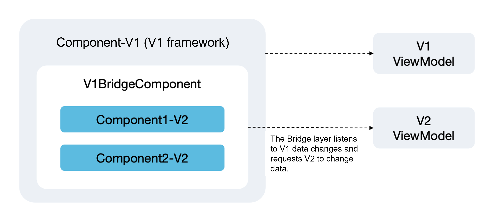

# Mixed Use of State Management V1 and V2 (Before API Version 19)
<!--Kit: ArkUI--> 
<!--Subsystem: ArkUI--> 
<!--Owner: @zzq212050299--> 
<!--Designer: @s10021109--> 
<!--Tester: @TerryTsao--> 
<!--Adviser: @zhang_yixin13-->

## Overview

> **NOTE**:
> 
> In this topic, the symbol "->" is used to indicate the transfer of variables. For example, "V1 -> V2" indicates that the state variable of V1 is transferred to the V2.

Before API version 19, there are strict checks on the mixed use of V1 and V2. The rules for mixed use of V1 and V2 state management are as follows:

**1. V1 -> V2 rules**

- The decorators of V2 cannot be used in the custom components of V1. Otherwise, an error is reported during compilation.

- When no variable is transferred between components, the custom components of V2 can be used in the custom components of V1, including the custom components decorated by the third-party \@ComponentV2.

- When variables are transferred between components, such as passing variables of V1 to the custom components of V2, constraints are as follows:
  - Variables that are not decorated in V1 (common variables): can be received only by using \@Param in V2.
  - Variables that are decorated in V1 (state variables): can be received only by the \@Param, and are limited to simple data such as **boolean**, **number**, **enum**, **string**, **undefined** and **null**.

**2. V2->V1 Rules**

- Decorators of V1 cannot be used in custom components of V2; otherwise, a compilation error will occur.

- When no variable is transferred between components, V2 custom components can use V1 custom components, including importing third-party custom components decorated with the \@Component decorator.

- When variables are transferred between components, such as passing variables of V2 to the custom components of V1, constraints are as follows:
  - Transferring V2 common variables (not using the state variable decorator) to V1 custom components:

     If V1 uses state variables to receive the data, only the following V1 state variable decorators can be used: [@State](./arkts-state.md), [@Prop](./arkts-prop.md), and [@Provide](./arkts-provide-and-consume.md).
  - Transferring V2 state variables (using the state variable decorator) to V1 custom components:

     If V1 uses a state variable decorator (also supported only by \@State, \@Prop, and \@Provide) to decorate received data, built-in data such as **Array**, **Set**, **Map**, and **Date** is not supported. Note that the V2 state variable supports the **Function** type, but the V1 state variable decorator does not support the **Function** type. If the **Function** type data is transferred, an error is reported during runtime verification. Take \@State as an example. For details, see [\@State Constraints](./arkts-state.md#constraints).
  - [\@Link](./arkts-link.md) in V1 complies with the original initialization rules and can be initialized only by V1 state variables. For details, see [\@Link Initialization Rules](./arkts-link.md#variable-transferaccess-rules).


## Constraints

- Mixed use of V1 and V2 decorators is not allowed.

  The intra-component decorators in V1 cannot be used in the custom components of V2, and the intra-component decorators in V2 cannot be used in the custom components of V1. Otherwise, an error is reported during compilation.

- V1 decorators cannot be used with [@ObservedV2](./arkts-new-observedV2-and-trace.md). Otherwise, an error is reported during compilation.

- V2 decorators cannot be used with [@Observed](./arkts-observed-and-objectlink.md). Otherwise, an error is reported during compilation.

- V1-&gt;V2 can only pass simple types of state variables. State variables of complex types cannot be passed. For example, if a class decorated with \@Observed or a built-in type (**Array**, **Map**, **Set**, or **Date**) decorated with the decorator is passed, an error is reported during compilation.

- V2-&gt;V1 can pass simple types of state variables and common classes. If a class decorated with \@ObservedV2 or a built-in type (**Array**, **Map**, **Set**, or **Date**) decorated with the decorator is passed, an error is reported during compilation.

- In V1, \@ObjectLink can be initialized only by a class decorated with \@Observed.

- [\@Link](./arkts-link.md) in V1 complies with the original initialization rules and can be initialized only by V1 state variables. For details, see [\@Link Initialization Rules](./arkts-link.md#variable-transferaccess-rules).

- Multiple decorators cannot decorate the same variable (except \@Watch, \@Once, and \@Require).

  ```ts
  @State @Prop message: string = "";  // Multiple decorators of V1 cannot decorate the same variable. Otherwise, an error is reported during compilation.
  ```

  ```ts
  @Local @Param message: string = 'Hello World'; // Multiple decorators of V2 cannot decorate the same variable. Otherwise, an error is reported during compilation.
  ```

  All decorators cannot decorate the same variable except extended decorators \@Watch, \@Once, and \@Require that can be used with other decorators.


## Using V2 Custom Components in V1


### Not Transferring Variables

When V2 custom components are used in V1, if no variable is transferred, there will be no impact. In the following sample code, **ChildSix** is a V2 custom component that does not accept parameters. **IndexSix** can directly use **ChildSix**.

<!-- @[v1_use_v2](https://gitcode.com/openharmony/applications_app_samples/blob/master/code/DocsSample/ArkUISample/CustomComponentsMixingUse/entry/src/main/ets/pages/MixingUseofCustomComponents/V2InV1.ets) -->

``` TypeScript
@ComponentV2
struct ChildSix {
  @Local message: string = 'hello';

  build() {
    Column() {
      Text(this.message)
        .fontSize(50)
        .fontWeight(FontWeight.Bold)
        .onClick(() => {
          this.message = 'world';
        })
    }
  }
}

@Entry
@Component
struct IndexSix {
  @State message: string = 'Hello World';

  build() {
    Column() {
      Text(this.message)
        .fontSize(50)
        .fontWeight(FontWeight.Bold)
        .onClick(() => {
          this.message = 'world hello';
        })
      Divider()
        .color(Color.Blue)
      // Use only V2 components with no parameters.
      ChildSix()
    }
    .height('100%')
    .width('100%')
  }
}
```


### Transferring Undecorated Variables

If a variable is not decorated, it cannot be observed. When transferring the variable to V2, note that V2 components have strict management on data input and the variable must be received through the [@Param](./arkts-new-param.md) decorator. In V2, the \@Param decorator is used to observe the received data. For the received **class**, you need to use the \@ObservedV2 and \@Trace decorators to observe the changes.

In the following sample code, **ChildTwo** is defined as a V2 component and accepts variables such as **message**, **undefinedVal**, and **info**. The simple variables **message** and **undefinedVal** received by \@Param in **ChildTwo** can observe changes. The class type variable **info** is not decorated with \@ObservedV2 and \@Trace, so it cannot observe class property changes.

<!-- @[v1_to_v2_common_variables](https://gitcode.com/openharmony/applications_app_samples/blob/master/code/DocsSample/ArkUISample/CustomComponentsMixingUse/entry/src/main/ets/pages/MixingUseofCustomComponents/V1CommonVariablesToV2CustomComponent.ets) -->

``` TypeScript
class InfoTwo {
  public myId: number;
  public name: string;

  constructor(myId?: number, name?: string) {
    this.myId = myId || 0;
    this.name = name || 'aaa';
  }
}

@ComponentV2
struct ChildTwo {
  // V2 has strict management on data input. When data is passed from the parent component, the @Param decorator must be used to receive the data.
  @Param @Once message: string = 'hello'; // The change can be observed. @Event is used to synchronize the change back to the parent component. @Once is used to modify variables decorated by @Param.
  @Param @Once undefinedVal: string | undefined = undefined; // @Once is used to modify variables decorated by @Param.
  @Param info: InfoTwo = new InfoTwo(); // The class property changes cannot be observed.
  @Require @Param set: Set<number>;

  build() {
    Column() {
      Text(`child message:${this.message}`) // Display the message variable.
        .fontSize(30)
        .fontWeight(FontWeight.Bold)
        .onClick(() => {
          this.message = 'world'; // Update the current component.
        })

      Divider()
        .color(Color.Blue)
      Text(`undefinedVal:${this.undefinedVal}`) // Display the undefinedVal variable.
        .fontSize(30)
        .fontWeight(FontWeight.Bold)
        .onClick(() => {
          this.undefinedVal = 'change to define'; // Update the current component.
        })
      Divider()
        .color(Color.Blue)
      Text(`info id:${this.info.myId}`) // Display the info.myId variable.
        .fontSize(30)
        .fontWeight(FontWeight.Bold)
        .onClick(() => {
          this.info.myId++; // The information is not refreshed.
        })
      Divider()
        .color(Color.Blue)
      ForEach(Array.from(this.set.values()), (item: number) => { // Display the set variable.
        Text(`${item}`)
          .fontSize(30)
      })
    }
    .margin(5)
  }
}

@Entry
@Component
struct IndexTwo {
  message: string = 'Hello World'; // Simple type.
  undefinedVal: undefined = undefined; // Simple type, undefined.
  info: InfoTwo = new InfoTwo(); // Class type.
  set: Set<number> = new Set([10, 20]); // Built-in type.

  build() {
    Column() {
      Text(`message:${this.message}`)
        .fontSize(30)
        .fontWeight(FontWeight.Bold)
        .onClick(() => {
          this.message = 'world hello';
        })
      Divider()
        .color(Color.Blue)
      ChildTwo({
        message: this.message,
        undefinedVal: this.undefinedVal,
        info: this.info,
        set: this.set
      })
    }
    .height('100%')
    .width('100%')
  }
}
```


### Transferring Simple State Variables

When V2 components are used in V1, the decorators in V1 components can only modify simple data types, including **boolean**, **number**, **string**, **null**, and **undefined**. The V2 component uses \@Param to receive parameters.

If **class** types or built-in types (Array, Map, Set, and Date) decorated by \@State are transferred during the use of V2 components in V1, a compilation error is reported. In the following sample code, the \@State decorator needs to be deleted from the **info** and **set** variables. The behavior of \@Prop, \@Link, \@ObjectLink, \@Provide, \@Consume, \@StorageProp, \@StorageLink, \@LocalStorageProp and \@LocalStorageLink is the same as that of \@State.

<!-- @[v1_to_v2_state_variables](https://gitcode.com/openharmony/applications_app_samples/blob/master/code/DocsSample/ArkUISample/CustomComponentsMixingUse/entry/src/main/ets/pages/MixingUseofCustomComponents/V1StateVariablesToV2CustomComponent.ets) -->

``` TypeScript
class InfoFour {
  public myId: number;
  public name: string;

  constructor(myId?: number, name?: string) {
    this.myId = myId || 0;
    this.name = name || 'aaa';
  }
}

@ComponentV2
struct ChildFour {
  // V2 has strict management on data input. When data is passed from the parent component, the @Param decorator must be used to receive the data.
  @Param @Once message: string = 'hello';
  @Param @Once undefinedVal: string | undefined = undefined; // @Once is used to modify variables decorated by @Param.
  @Param info: InfoFour = new InfoFour();
  @Require @Param set: Set<number>;

  build() {
    Column() {
      Text(`child message:${this.message}`) // Display the message variable.
        .fontSize(30)
        .fontWeight(FontWeight.Bold)
        .onClick(() => {
          this.message = 'world';
        })
      Divider()
        .color(Color.Blue)
      Text(`undefinedVal:${this.undefinedVal}`) // Display the undefinedVal variable.
        .fontSize(30)
        .fontWeight(FontWeight.Bold)
        .onClick(() => {
          this.undefinedVal = 'change to define';
        })
      Divider()
        .color(Color.Blue)
      Text(`info id:${this.info.myId}`) // Display the info.myId variable.
        .fontSize(30)
        .fontWeight(FontWeight.Bold)
        .onClick(() => {
          this.info.myId++;
        })
      Divider()
        .color(Color.Blue)
      ForEach(Array.from(this.set.values()), (item: number) => { // Display the set variable.
        Text(`${item}`)
          .fontSize(30)
      })
    }
    .margin(5)
  }
}

@Entry
@Component
struct IndexFour {
  @State message: string = 'Hello World'; // Simple type data. Supported.
  @State undefinedVal: undefined = undefined; // Simple type, undefined. Supported.
  @State info: InfoFour = new InfoFour(); // Class type. It cannot be passed. To eliminate the compilation error, delete @State.
  @State set: Set<number> = new Set([10, 20]); // Built-in type. Not supported. To eliminate the compilation error, delete @State.

  build() {
    Column() {
      Text(`message:${this.message}`)
        .fontSize(30)
        .fontWeight(FontWeight.Bold)
        .onClick(() => {
          this.message = 'world hello';
        })
      Divider()
        .color(Color.Blue)
      ChildFour({
        message: this.message,
        undefinedVal: this.undefinedVal,
        info: this.info,
        set: this.set
      })
    }
    .height('100%')
    .width('100%')
  }
}
```


### Transferring Class State Variables

Given that parameter transfer in V1 using V2 components supports only simple type data rather than **class** type data, the following describes the migration solution for the **class** data transfer scenario.

**\@Observed Decorated Class**

The V2 decorators cannot be used with \@Observed. When V1 transfers the \@Observed-decorated **class** type to the V2 custom component, the \@Param is not directly used to receive data. As shown in the following figure, the **V1BridgeComponent** is defined as the bridge layer. Listen to the data of the V1 component at the bridge layer and synchronize the data to the singleton data defined by V2. The V1 component directly uses **V1BridgeComponent** and introduces the V2 custom component in **V1BridgeComponent**.



The code snippet is as follows:

1. Decorate the **class** singleton ViewModelV2 with the \@ObservedV2 decorator, and the V2 component **V2Comp** directly uses the instantiated singleton of ViewModelV2 for UI rendering.
2. Add the bridge component **V1BridgeComponent** decorated with \@Component between the V1 component **V1Comp** and the V2 component **V2Comp**. Use \@Watch to listen to the data and assign the **class** data decorated with \@Observed in V1 to the **class** data decorated with \@ObservedV2 in V2.
3. The V1 component **V1Comp** directly imports the bridge component **V1BridgeComponent**, which in turn imports the V2 component **V2Comp**.

<!-- @[v1_to_v2_observed_class](https://gitcode.com/openharmony/applications_app_samples/blob/master/code/DocsSample/ArkUISample/CustomComponentsMixingUse/entry/src/main/ets/pages/MixingUseofCustomComponents/V1ToV2_ObservedClass.ets) -->

``` TypeScript
@Observed
class ViewModelV1 {
  @Track public fontSize: number;

  constructor(fontSize: number) {
    this.fontSize = fontSize;
  }

  updateFontSize(fontSize: number) {
    this.fontSize = fontSize;
  }
}

// Existing V1 component
@Entry
@Component
struct V1Comp {
  build() {
    Column() {
      // ------------ V1 bridge component ------------
      V1BridgeComponent()

      // ....

    }
  }
}

// V1 bridge component
@Component
struct V1BridgeComponent {
  @State @Watch('onDirectionChange') viewModel: ViewModelV1 = new ViewModelV1(20);

  onDirectionChange() {
    // Convert V1 data to V2 data.
    ViewModelV2.instance().fontSize = this.viewModel.fontSize;
  }

  build() {
    Column() {
      Text(`V1 component original data fontSize-${this.viewModel.fontSize}`)
        .fontSize(this.viewModel.fontSize)

      Button('V1 component font size change').onClick(() => {
        this.viewModel.updateFontSize(10); // V1 V2 component refresh.
      })

      // ------------ V2 service component ------------
      V2Comp()
    }
  }
}

@ObservedV2
class ViewModelV2 {
  // Singleton instance.
  private static singleton_: ViewModelV2;
  @Trace public fontSize: number = 40;

  // Private constructor instance (external new is prohibited).
  private constructor() {
  }

  static instance(): ViewModelV2 {
    if (!ViewModelV2.singleton_) {
      ViewModelV2.singleton_ = new ViewModelV2();
    }
    return ViewModelV2.singleton_;
  }
}

// Add a V2 service component.
@ComponentV2
struct V2Comp {
  // Obtain the V2 singleton instance (which can be directly accessed in the component).
  private v2Model = ViewModelV2.instance();

  build() {
    Column() {
      Text(`V2 component fontSize-${this.v2Model.fontSize}`)
        .fontSize(this.v2Model.fontSize)

      Button('V2 component font size change')
        .onClick(() => {
          this.v2Model.fontSize = 60; // V2 component update
        })
    }
  }
}
```

**\@ObservedV2 Decorated Class**

The observation capability of \@ObservedV2+\@Trace is supported in both V1 and V2. However, in V1, the V1 decorator cannot be used together with the instance object decorated by \@ObservedV2. In the following sample code, if the **info** object is decorated with \@State, a compilation error occurs. In this case, the decorator of V1 needs to be removed.

<!-- @[v1_to_v2_observedV2_trace](https://gitcode.com/openharmony/applications_app_samples/blob/master/code/DocsSample/ArkUISample/CustomComponentsMixingUse/entry/src/main/ets/pages/MixingUseofCustomComponents/V1ToV2_ObservedV2AndTrace.ets) -->

``` TypeScript
@ObservedV2
class InfoTen {
  @Trace public myId: number;
  public name: string;

  constructor(myId?: number, name?: string) {
    this.myId = myId || 0;
    this.name = name || 'aaa';
  }
}

@ComponentV2
struct ChildTen {
  // V2 has strict management on data input. When data is passed from the parent component, the @Param decorator must be used to receive the data.
  @Param info: InfoTen = new InfoTen();

  build() {
    Column() {
      Text(`Child-V2 info id:${this.info.myId}`)
        .fontSize(30)
        .fontWeight(FontWeight.Bold)
        .onClick(() => {
          this.info.myId++; // Update.
        })
    }
  }
}

@Entry
@Component
struct IndexTen {
  // @State info: InfoTen = new InfoTen(); // Incorrect. The class type cannot be passed, so the compiler reports an error. To eliminate the compilation error, delete @State.
  info: InfoTen = new InfoTen(); // Correct syntax.

  build() {
    Column() {
      Text(`Parent-V1 info id:${this.info.myId}`)
        .fontSize(30)
        .fontWeight(FontWeight.Bold)
        .onClick(() => {
          this.info.myId++; // Update.
        })

      ChildTen({
        info: this.info,
      })
    }
    .height('100%')
    .width('100%')
  }
}
```


### Transferring Nested Objects

The observation capability of the decorator of V1 is to function as a proxy for data. Therefore, when data is nested, the decorator of V1 can only disassemble the child component to observe lower-level data through \@Observed and \@ObjectLink. However, V2 cannot receive the object decorated by \@Observed, and \@ObjectLink cannot be used in V2. Lacking the deep-level observation capability as \@ObservedV2 combined with \@Trace has, the deep-level nesting of \@Observed is not discussed here; only the application scenarios of \@ObservedV2 in V1 are discussed.

**Class Decorated by \@Observed Nesting Class Decorated by \@ObservedV2**

When \@ObservedV2 and \@Observed are nested, whether the **class** object can be decorated by the decorator of V1 depends on the decorator used by the outermost **class**. If the outermost **class** is decorated by \@Observed, it can be used with the V2 decorator, for example, \@State. \@State can observe only the top-level changes. To perform in-depth observation, variables should be transferred to \@ObjectLink.

In the following sample code:

- The outermost **MessageInfoNested1** class is decorated with \@Observed and can be decorated with \@State in the V1 component **IndexOne**. The change of the second layer of \@State (**info** and **messageId** attributes) cannot trigger the refresh of the current layer. However, the change can be observed by \@ObjectLink and \@Param and triggers the re-render of the associated components.
- The **messageInfo** attribute is passed to the V1 component. The V1 component **ChildOne** is received by \@ObjectLink. The class of the **info** attribute passed to the V2 component **GrandSon1** is modified with \@ObservedV2.
- \@Track can prevent the **info** in the **MessageInfo1** class from being updated when the **messageId** is changed. When **messageId** is changed, the **info** is updated accordingly. However, this is not the observation capability of \@ObjectLink.

<!-- @[observed_object_link](https://gitcode.com/openharmony/applications_app_samples/blob/master/code/DocsSample/ArkUISample/CustomComponentsMixingUse/entry/src/main/ets/pages/MixingUseofCustomComponents/ObserveNestedClasses_ObservedAndObjectLink.ets) -->

``` TypeScript
@ObservedV2
class InfoOne {
  @Trace public myId: number;
  public name: string;

  constructor(myId?: number, name?: string) {
    this.myId = myId || 0;
    this.name = name || 'aaa';
  }
}

@Observed
class MessageInfo1 { // Top-level nesting.
  @Track public info: InfoOne; // Prevent the info from being updated due to the change of messageId.
  @Track public messageId: number; // Prevent the info from being updated when the messageId is changed.

  constructor(info?: InfoOne, messageId?: number) {
    this.info = info || new InfoOne();
    this.messageId = messageId || 0;
  }
}

@Observed
class MessageInfoNested1 { // Second-level nesting.
  public messageInfo: MessageInfo1;

  constructor(messageInfo?: MessageInfo1) {
    this.messageInfo = messageInfo || new MessageInfo1();
  }
}

@ComponentV2
struct GrandSon1 {
  @Param info: InfoOne = new InfoOne();

  build() {
    Column() {
      Text(`ObjectLink info info.myId:${this.info.myId}`) // The myId attribute is decorated with @Trace and can be observed.
        .fontSize(30)
        .onClick(() => {
          this.info.myId++; // The current component and parent component ChildOne are updated.
        })
    }
  }
}

@Component
struct ChildOne {
  @ObjectLink messageInfo: MessageInfo1;

  build() {
    Column() {
      Text(`ObjectLink MessageInfo messageId:${this.messageInfo.messageId}`) // After disassembling via @ObjectLink, changes to top-level class attributes can be observed.
        .fontSize(30)
        .onClick(() => {
          this.messageInfo.messageId++; // The UI of the current component is refreshed.
        })
      Divider()
        .color(Color.Blue)
      Text(`ObjectLink MessageInfo info.myId:${this.messageInfo.info.myId}`) // The myId attribute is decorated by @Trace and can be observed.
        .fontSize(30)
        .onClick(() => {
          this.messageInfo.info.myId++; // The UI of the current component and GrandSon1 child component is refreshed.
        })
      GrandSon1({ info: this.messageInfo.info }); // Continue to disassemble the top-level child components.
    }
  }
}

@Entry
@Component
struct IndexOne {
  @State messageInfoNested: MessageInfoNested1 = new MessageInfoNested1(); // How to observe the internal of third-level nested data.

  build() {
    Column() {
      // Observe messageInfoNested. @State can only observe the top-level data and cannot observe the changes.
      Text(`messageInfoNested messageId:${this.messageInfoNested.messageInfo.messageId}`)
        .fontSize(30)
        .onClick(() => {
          this.messageInfoNested.messageInfo.messageId++; // The current component is not updated, and the UI of the child component ChildOne is refreshed.
        })
      Divider()
        .color(Color.Blue)
      // Observe messageInfoId through @ObjectLink.
      ChildOne({ messageInfo: this.messageInfoNested.messageInfo }) // Using @ObjectLink for disassembling can view the deeper-level changes.
      Divider()
        .color(Color.Blue)
    }
    .height('100%')
    .width('100%')
    .margin(10)
  }
}
```


**Observing Class Nested Classes via \@ObservedV2 and \@Trace**

\@ObservedV2 combined with \@Trace implements the observation capability on class attributes. Therefore, when a class attribute is marked by \@Trace, changes can be observed no matter how many layers are nested. In the following example code, the **MessageInfoNested** object and its attributes are decorated with \@ObservedV2. When the **MessageInfoNested** object is used in the V1 component **Index**, it cannot be used with the V1 decorator. After the **messageInfo** attribute is transferred from the V1 component to the V2 component, the V2 component **Child** receives the attribute through \@Param, so that the changes can be observed.

<!-- @[observed_trace](https://gitcode.com/openharmony/applications_app_samples/blob/master/code/DocsSample/ArkUISample/CustomComponentsMixingUse/entry/src/main/ets/pages/MixingUseofCustomComponents/ObserveNestedClasses_ObsevedV2AndTrace.ets) -->

``` TypeScript
@ObservedV2
class Info {
  @Trace public myId: number;
  public name: string;

  constructor(myId?: number, name?: string) {
    this.myId = myId || 0;
    this.name = name || 'aaa';
  }
}

@ObservedV2
class MessageInfo { // Top-level nesting.
  @Trace public info: Info; // Prevent the info from being updated due to the change of messageId.
  @Trace public messageId: number; // Prevent the info from being updated due to the change of messageId.

  constructor(info?: Info, messageId?: number) {
    this.info = info || new Info(); // Use the input info or create an Info.
    this.messageId = messageId || 0;
  }
}

@ObservedV2
class MessageInfoNested { // Dual-level nesting. If MessageInfoNested is decorated by @ObservedV2, it cannot be decorated by the decorator related to V1 state variable update, for example, @State.
  public messageInfo: MessageInfo;

  constructor(messageInfo?: MessageInfo) {
    this.messageInfo = messageInfo || new MessageInfo();
  }
}

@ComponentV2
struct Child {
  @Param messageInfo: MessageInfo =  new MessageInfo();

  build() {
    Column() {
      Text(`Child MessageInfo messageId:${this.messageInfo.messageId}`)
        .fontSize(30)
        .onClick(() => {
          this.messageInfo.messageId++; // Update
        })
    }
  }
}

@Entry
@Component
struct Index {
  messageInfoNested: MessageInfoNested = new MessageInfoNested(); // For the data nested at three levels, you need to observe the internal data.

  build() {
    Column() {
      Text(`messageInfoNested messageId:${this.messageInfoNested.messageInfo.messageId}`)
        .fontSize(30)
        .onClick(() => {
          this.messageInfoNested.messageInfo.messageId++;
        })
      Divider()
        .color(Color.Blue)
      Text(`messageInfoNested name:${this.messageInfoNested.messageInfo.info.name}`) // Being not decorated by @Trace, it is not observable.
        .fontSize(30)
        .onClick(() => {
          this.messageInfoNested.messageInfo.info.name += 'a';
        })
      Divider()
        .color(Color.Blue)
      Text(`messageInfoNested myId:${this.messageInfoNested.messageInfo.info.myId}`) // Being decorated by @Trace, it can be observed no matter how many layers are nested.
        .fontSize(30)
        .onClick(() => {
          this.messageInfoNested.messageInfo.info.myId++;
        })
      Divider()
        .color(Color.Blue)
      // Observe messageInfo through @ObservedV2 and @Trace.
      Child({messageInfo: this.messageInfoNested.messageInfo})
    }
    .height('100%')
    .width('100%')
    .margin(10)
  }
}
```


## V2 Components Using V1 Components

When V2 state variables are transferred to V1 custom components, the following constraints exist:

- V1 can receive data without using the decorator. In the V1 custom component, the variables that are not received using the decorator are considered as common variables.

- If V1 uses a decorator to receive data, data can be received only through \@State, \@Prop, and \@Provide.

- When V1 uses a decorator to receive data, data of the built-in type is not supported. Otherwise, a compilation error is reported.


### Transferring Simple State Variables

When V2 transfers simple state variables to the V1 custom component, V1 can receive data only through the \@State, \@Prop, and \@Provide decorators. In the following example code, the **ThirdPartyComp** component simulates a third-party library and receives the Boolean value from the V2 component.

<!-- @[v2_to_v1_simpleData](https://gitcode.com/openharmony/applications_app_samples/blob/master/code/DocsSample/ArkUISample/CustomComponentsMixingUse/entry/src/main/ets/pages/MixingUseofCustomComponents/V2ToV1_SimpleData.ets) -->

``` TypeScript
// Simulate the V1 component imported from the third-party library.
@Component
struct ThirdPartyComp {
  // State variable received by V1 from V2. Only @State, @Prop, and @Provide can be used to receive the variable.
  @State prop: boolean = true; // Changes are observable.

  build() {
    Column() {
      Text(`ThirdPartyComp:${this.prop}`)
    }
  }
}

@Entry
@ComponentV2
struct V2Comp2 {
  @Local param: boolean = false;

  build() {
    Column() {
      Text(`V2Comp2:${this.param}`)

      // The V2 component transfers the simple state variable to the third-party library of V1.
      ThirdPartyComp({ prop: this.param })
    }
  }
}
```


### Transferring the Class Type

**Defining a Common Class**

When passing data from V2 to V1 custom components, common class is supported. In the following sample code, the **InfoFive** class is not decorated with \@ObservedV2. When the **InfoFive** class is passed to the V1 component **ChildFive**, it can be received using \@State. Modify the **info** variable in the V1 component and update the UI using the observation capability of \@State.

<!-- @[v2_to_v1_common_variables](https://gitcode.com/openharmony/applications_app_samples/blob/master/code/DocsSample/ArkUISample/CustomComponentsMixingUse/entry/src/main/ets/pages/MixingUseofCustomComponents/V2CommonVariablesToV1CustomComponent.ets) -->

``` TypeScript
class InfoFive {
  public myId: number;
  public name: string;

  constructor(myId?: number, name?: string) {
    this.myId = myId || 0;
    this.name = name || 'aaa';
  }
}

@Component
struct ChildFive {
  // State variable received by V1 from V2. Only @State, @Prop, and @Provide can be used to receive the variable.
  @State info: InfoFive = new InfoFive(); // Top-level class attribute changes are observable.

  build() {
    Column() {
      Text(`info id:${this.info.myId}`)
        .fontSize(30)
        .fontWeight(FontWeight.Bold)
        .onClick(() => {
          this.info.myId++; // The UI of the current component is refreshed.
        })
    }
  }
}

@Entry
@ComponentV2
struct IndexFive {
  @Provider() info: InfoFive = new InfoFive(); // Class type. It can be passed.

  build() {
    Column() {
      ChildFive({
        info: this.info,
      })
    }
    .height('100%')
    .width('100%')
  }
}
```


**Defining a Class Decorated with \@ObserveV2**

Decorators of V1 cannot be used together with \@ObservedV2. In the following sample code, the **InfoNine** class is decorated with \@observedV2. When the V1 component receives variables, the **info** variable cannot be decorated with the V1 decorator. However, the UI can be refreshed through modification, which depends on the observation capability of \@ObservedV2 and \@Trace.

<!-- @[v2_to_v1_observedV2_trace](https://gitcode.com/openharmony/applications_app_samples/blob/master/code/DocsSample/ArkUISample/CustomComponentsMixingUse/entry/src/main/ets/pages/MixingUseofCustomComponents/V2ToV1_ObservedV2AndTrace.ets) -->

``` TypeScript
@ObservedV2
class InfoNine {
  @Trace public myId: number;
  public name: string;

  constructor(myId?: number, name?: string) {
    this.myId = myId || 0;
    this.name = name || 'aaa';
  }
}

@Component
struct ChildNine {
  info: InfoNine = new InfoNine(); // Decorators of V1 cannot be used together with @ObservedV2.

  build() {
    Column() {
      Text(`info id:${this.info.myId}`) // Display the info.myId variable.
        .fontSize(30)
        .fontWeight(FontWeight.Bold)
        .onClick(() => {
          this.info.myId++; // The UI of the current component is refreshed, depending on the capability of @ObservedV2 and @Trace.
        })
    }
  }
}

@Entry
@ComponentV2
struct IndexNine {
  @Provider() info: InfoNine = new InfoNine();

  build() {
    Column() {
      ChildNine({
        info: this.info,
      })
    }
    .height('100%')
    .width('100%')
  }
}
```


### Transferring Common Built-in Types

When a built-in type is transferred from V2 to V1, the V2 decorator defining the built-in type and the V1 decorator receiving the built-in type are mutually exclusive.

- When V1 uses a decorator to receive data, the built-in type cannot be decorated in V2.
- V1 can receive data without using the decorator. The received variables are common variables in the V1-defined component and can be decorated in V2.

In the following sample code, V2 transfers the **set** variable to the V1 custom component, and the V1 component uses \@Provide to receive the **set** variable. Therefore, when defining the **set** variable in the V2 component **IndexEight**, the **set** variable cannot be decorated with \@Local to avoid compilation errors.

<!-- @[v2_to_v1_common_buildIn_class](https://gitcode.com/openharmony/applications_app_samples/blob/master/code/DocsSample/ArkUISample/CustomComponentsMixingUse/entry/src/main/ets/pages/MixingUseofCustomComponents/V2ToV1_CommonBuildInClass.ets) -->

``` TypeScript
@Component
struct ChildEight {
  // State variable received by V1 from V2. Only @State, @Prop, and @Provide can be used to receive the variable.
  @Provide set: Set<number> = new Set();

  build() {
    Column() {
      ForEach(Array.from(this.set.values()), (item: number) => { // Display the set variable.
        Text(`${item}`)
          .fontSize(30)
      })
    }
  }
}

@Entry
@ComponentV2
struct IndexEight {
  // @Local set: Set<number> = new Set([10, 20]); // Incorrect writing method. The built-in type state variable cannot be transferred. To eliminate compilation errors, delete @Local.
  set: Set<number> = new Set([10, 20]); // Correct writing method.

  build() {
    Column() {
      ChildEight({
        set: this.set
      })
    }
    .height('100%')
    .width('100%')
  }
}
```


## Summary

Based on the analysis of the scenarios where V1 and V2 are used together, the following conclusions are drawn:

- When V2 custom components are mixed in with V1 components (that is, when V1 components or class data are transferred to V2), most V1 capabilities are disabled in V2.

- When V1 custom components are mixed in with V2 components (that is, when V2 components or class data are transferred to V1), some features are opened. For example, \@ObservedV2 and \@Trace, which are the most helpful for observing V1 nested data.

Therefore, you are not advised to use V1 and V2 together during development. However, in terms of code migration, V1 developers can gradually migrate the code to V2 to steadily replace the V1 functional code. In addition, you are not advised to use V1 code in the V2 code architecture.
