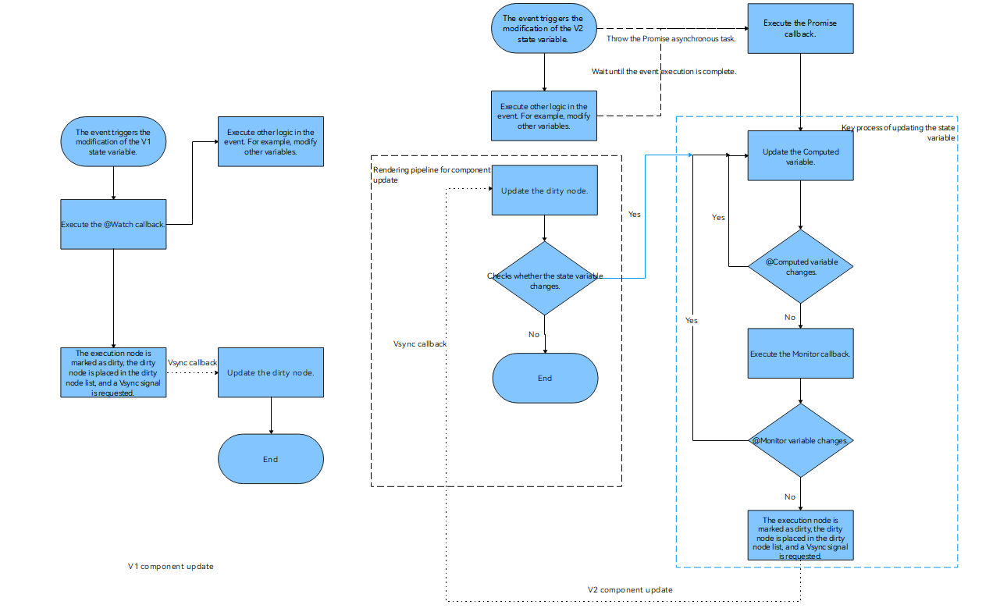

# Differences Between State Management V1 and V2 Update Mechanisms
<!--Kit: ArkUI-->
<!--Subsystem: ArkUI-->
<!--Owner: @s10021109-->
<!--Designer: @s10021109-->
<!--Tester: @zhangwenhan12-->
<!--Adviser: @zhang_yixin13-->

## Background of the Evolution from V1 State Management to V2 State Management

State Management V1 uses proxies to observe data. When creating state variables, a data proxy observer is created simultaneously. This observer can detect changes in the proxy but cannot accurately observe changes in the actual data. V1 state management has the following limitations:

- State variables cannot exist independently of the UI. When the same data is proxied by multiple views, the change in one view cannot be synchronized to other views.
- Only changes to top-level object properties can be detected; deep observation and listening are unavailable.
- Redundant updates occur when modifying properties in an object.
- Decorator usage is restrictive. The input and output of state variables are not specified in components, complicating componentization design.

For the preceding reasons, the state management V2 enhances the data observation capability, enabling the data itself to be observable. When data is changed, the corresponding view is updated. Compared with state management V1, state management V2 offers the following advantages:

- State variables are independent of the UI. Data changes automatically trigger updates to associated views.

- Deep observation and listening of objects are supported, with no performance impact from the deep observation mechanism.

- Precise property-level update of objects.

- Decorators are more user-friendly and scalable. Components explicitly define inputs and outputs, simplifying componentization.

## State Variable Changes Automatically Triggering UI Updates

When the state management framework detects a state change, it triggers a UI update. The state variable changes include the changes of observed object properties or observed array (or other built-in types) items.
- For V1, it has a top-level observation capability and can observe changes to object properties and data items.
- For V2, it has the capability of in-depth observation and can observe the changes of nested object properties or array items.

The following uses an example to describe the differences between V1 and V2 when the state variable is modified in [@Component](./arkts-create-custom-components.md#component) or [@ComponentV2](./arkts-create-custom-components.md#componentv2) and UI refresh is triggered.

```typescript
// The following code uses @ObservedV2 as an example. If V1 is used, @Observed and @Track are used.
@ObservedV2 
class ObsObjA {
  @Trace propA: string = 'propA';
  @Trace obsObjB: ObsObjB = new ObsObjB();
  constructor(propA: string) {
    this.propA = propA;
  }
}

@ObservedV2 
class ObsObjB {
  @Trace propB: string = 'propB';
}

@ObservedV2 
class ObsObjC {
  @Trace propC: string = 'propC';
  constructor(propC: string) {
    this.propC = propC;
  }
}

// The following code is written in @Component or @ComponentV2.
// simple is the state variable decorated by the V1 or V2 decorator, obsObjA is the complex state variable decorated by the V1 or V2 decorator, and arr is the array state variable decorated by the V1 or V2 decorator.
build() {
  Column() {
    Text(this.simple);  // The first line uses a simple state variable to bind the Text component.
    Text(JSON.stringify(this.obsObjA));  // The second line uses the complex object type state variable to bind the Text component.
    Text(this.obsObjA.propA); // The third line uses the complex object property state variable to bind the Text component.
    Text(this.obsObjA.obsObjB.propB); // The fourth line uses the nested complex object property state variable to bind the Text component.
    Text(JSON.stringify(this.arr)); // The fifth line uses the state variable of the array type to bind the Text component.
    Text(JSON.stringify(this.arr[0])); // The sixth line uses the state variable of item 0 in the array to bind the Text component.
    Text(JSON.stringify(this.arr[0].propC)); // The seventh line uses the state variable property of the element 0 in the array to bind the Text component.
  }
}
```

State Management frameworks for V1 and V2 trigger corresponding UI updates by observing the assignment of state variables. The differences in state variable updates between V1 and V2 are described as follows:

```typescript
Button('Change state variable')
  .onClick(() => {
    // this.simple is a simple variable decorated by the V1 or V2 decorator. Assigning a value to this variable will trigger the update of the text in line 1 regardless of the V1 or V2 decorator variable.
    this.simple = 'Welcome';
    // this.obsObjA is a complex object variable decorated by the V1 or V2 decorator. Assigning a value to this variable will trigger the update of the text in lines 2, 3, and 4 regardless of the V1 or V2 decorator variable.
    this.obsObjA = new ObsObjA('obsObjA++');
    // this.arr is an array variable decorated by the V1 or V2 decorator. Assigning a value to this variable will trigger the update of the text in lines 5, 6, and 7 regardless of the V1 or V2 decorator variable.
    this.arr = [new ObsObjC('propC1'), new ObsObjC('propC2')];
    // For V1, if this.obsObjA is a variable decorated by the V1 decorator (the property in obsObjA is not decorated by @Track or this.obsObjA.propA is decorated by @Track),
    // assigning a value to this variable will trigger the update of Text in line 3; for V2, this.obsObjA.propA must be decorated by a V2 decorator (for example, @Trace), so that assigning a value to this variable will trigger the update of Text in line 3.
    this.obsObjA.propA = 'propA3';
    // For V1, only top-level changes can be observed. Even if this.obsObjA.obsObjB.propB is decorated by the V1 decorator (@Track), the text in line 4 is not updated.
    // For V2, the text in line 4 can be updated as long as this.obsObjA.obsObjB.propB is decorated by the V2 decorator (@Trace).
    this.obsObjA.obsObjB.propB = 'propB3';
    // this.arr is decorated by the V1 or V2 decorator. Assigning a value to this variable (whether it is a variable decorated with a V1 decorator or a V2 decorator) will trigger the update of Text in lines 5 and 6.
    this.arr[0] = new ObsObjC('propC3');
    // For V1, this.arr is decorated by the V1 decorator. Because V1 can only observe top-level changes and the property assignment of the array item is the modification of the second level, the Text in line 7 is not updated.
    // For V2, this.arr is decorated by the V2 decorator, and propC is decorated by the V2 decorator (@Trace). Assigning a value to this variable will update the Text in line 7.
    this.arr[0].propC = 'propC4';
  })
```

## Differences Between @Watch in V1 and @Monitor in V2

For details about the differences between @Watch of V1 and @Monitor of V2, see [Comparing @Monitor with @Watch](./arkts-new-monitor.md#comparing-monitor-with-watch). The following uses an example to describe the differences.

### @Watch Synchronous Execution
Assignment to V1-decorated variables, as well as changes to object properties or array (Map, Set) items, will trigger the synchronous execution of @Watch. If the state variable is modified for multiple times, the @Watch function is executed for multiple times.

```typescript
@State @Watch('onVarNameChange') obsObjA: ObsObjA = new ObsObjA('propANew');

onVarNameChange() {  // The @Watch function is executed synchronously when obsObjA (the monitored V1-decorated variable) changes.
  console.info('obsObjA.propA change callback'); // Execution order: 3
}

Button('Change state variable')
  .onClick(() => {
    console.info('1'); // Execution order: 1
    this.obsObjA.propA = 'propA3'; // Execution order: 2
    console.info('2'); // Execution order: 4
  })
```
In the above code, when assigning a value to **this.obsObjA.propA**, the execution sequence is as follows: print the log '1', assign a value to the state variable, print the log 'obsObjA.propA change callback', and finally print the log '2'.

### @Monitor Asynchronous Execution
Assignment to V2-decorated variables, as well as changes of object properties or array (Map and Set) items, will trigger asynchronous execution of @Monitor. If the state variable is modified multiple times, the @Monitor function is executed only once.

```typescript
@Local arr: Array<ObsObjC> = [new ObsObjC('propC1')];

@Monitor('obsObjA.propA') onChange(mon : IMonitor) { // The @Monitor function is executed asynchronously when the monitored V2-decorated variable obsObjA changes.
  console.info(`${mon.dirty[0]}`); // Execution order 4: The onChange callback is executed only after the onClick-related logic is executed.
}

Button('Change state variable')
  .onClick(() => {
    console.info('1'); // Execution order: 1
    this.obsObjA.propA = 'propA3'; // Execution order: 2
    console.info('2'); // Execution order: 3
  })
```
In the preceding code, the @Monitor function is executed only after the current event logic is executed, for example, after **onClick** is executed. When assigning a value to **this.obsObjA.propA**, the execution sequence is as follows: print log '1', assign a value to the state variable, print log '2', execute **onChange** of @Monitor, and print'obsObjA.propA'.


## Differences Between V1 and V2 State Variable Updates

The following figure shows the flowchart of V1 component and V2 state variable update differences. Compared with V1 state management, V2 state management asynchronously marks components dirty when state variables change.



### V1 Components Updates

Step 1: Trigger an event to modify the V1 state variable and observe the change of the V1 state variable.

Step 2: Execute the @Watch callback to execute other logic in the event, for example, modifying other variables.

Step 3: The execution node is marked as dirty, the dirty node is placed in the dirty node list, and a Vsync signal is requested.

Step 4: Update the dirty node list. The update sequence is: first update the parent component, then update the child component.

Step 5: If the state variable changes again, step 4 is performed. The number of iterations of step 4 within a single Vsync cycle does not exceed 3 times. After the third iteration, the marked-dirty nodes will be added to the dirty node list, and the dirty node update will be performed when the next Vsync arrives.

### V2 Components Updates

Compared with V1 state management, V2 state management supports asynchronous execution of @Computed, @Monitor, and node dirty marking.

Step 1: The event triggers the modification of the V2 state variable and throws the [Promise](../../arkts-utils/async-concurrency-overview.md#promise) asynchronous task.

Step 2: Execute other remaining logic in the event, for example, modifying other variables. After the event logic (for example, the **onClick** event) is executed, execute the Promise callback.

Step 3: Update the @Computed variable.

Step 4: When the @Computed variable is updated, if the @Computed variable changes, go to step 3. Otherwise, go to step 5.

Step 5: Execute the @Monitor callback function.

Step 6: If a state variable changes in the @Monitor function callback, go to step 3. Otherwise, go to step 7.

Step 7: The execution node is marked as dirty, the dirty node is placed in the dirty node list, and a Vsync signal is requested.

Step 8: Update the dirty node list. The update sequence is: first update the parent component, then update the child component.

Step 9: If the state variable changes again during the update, step 8 is performed. The number of iterations of step 8 within a single Vsync cycle does not exceed 3 times. After the third iteration, the marked-dirty nodes will be added to the dirty node list, and the dirty node update will be performed when the next Vsync arrives.
