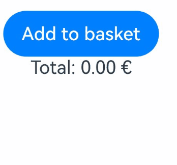
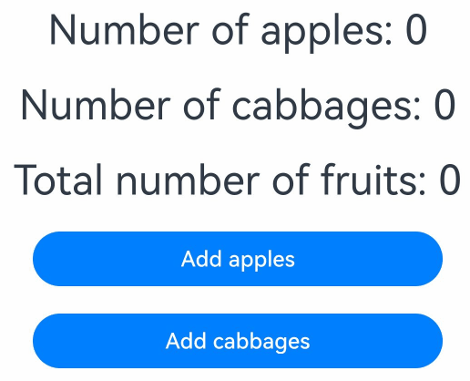

# \@Watch Decorator: Getting Notified of State Variable Changes

<!--Kit: ArkUI-->
<!--Subsystem: ArkUI-->
<!--Owner: @jiyujia926-->
<!--Designer: @zhangboren-->
<!--Tester: @TerryTsao-->
<!--Adviser: @zhang_yixin13-->
<!-- md-trans-meta sourceCommit=5cbda8a742fe4c75db3800c28ccfc8ffcd9cebc0 translatedAt=2026-06-30T03:38:47.692Z pushedAt=2026-07-01T09:00:11.832Z -->

@Watch is used to observe state variables. If you need to monitor whether the value of a particular state variable has changed, use @Watch to set a callback for that state variable.

\@Watch can only listen for changes that can be observed.

Before reading this topic, you are advised to read [\@State](./arkts-state.md) to have an understanding of the basic observation capabilities of state management.

> **NOTE**
>
> This decorator can be used in ArkTS widgets since API version 9.
>
> This decorator can be used in atomic services since API version 11.

## Overview

@Watch is used to listen for changes in state variables. When a state variable changes, the callback method registered with @Watch is invoked. Internally, the ArkUI framework determines whether a value has been updated using strict equality (===), adhering to strict equality semantics. The @Watch callback is triggered when the strict equality comparison evaluates to false (i.e., the values are not equal).

## Decorator Description

| \@Watch Decorator| Description                                      |
| -------------- | ---------------------------------------- |
| Decorator parameters         | Mandatory. Constant string, which is quoted. It is a reference to a custom member function method of type (string)&nbsp;=&gt;&nbsp;void.|
| Custom component variables that can be decorated   | All decorated state variables. Regular variables cannot be watched.              |
| Order of decorators        | The order of decorators does not affect the actual functions. You can determine it as required. It is recommended that the [\@State](./arkts-state.md), [\@Prop](./arkts-prop.md), and [\@Link](./arkts-link.md) decorators be placed before the \@Watch decorator, to keep the overall style consistent.|
| Called when| When using @Watch to observe state variable changes, the callback is triggered at the moment when the variable actually changes and is assigned a new value. For details, see [Time for \@Watch to be Called](#time-for-watch-to-be-called).|

## Syntax

| Type                                      | Description                                      |
| ---------------------------------------- | ---------------------------------------- |
| (changedPropertyName? : string) =&gt; void | This function is a member function of the custom component. **changedPropertyName** indicates the name of the watched attribute.<br>It is useful when you use the same function as a callback to several watched attributes.<br>It takes the attribute name as a string input parameter and returns nothing.|

## Observed Changes and Behavior

1. \@Watch callback is triggered when a change of a state variable (including the change of a key in [AppStorage](./arkts-appstorage.md) and [LocalStorage](./arkts-localstorage.md) that are bound in a two-way manner) is observed.

2. The \@Watch callback is executed synchronously after the variable change in the custom component.

3. If the \@Watch callback mutates other watched variables, their variable @Watch callbacks in the same and other custom components as well as state updates are triggered.

4. A \@Watch function is not called upon custom component variable initialization, because initialization is not considered as variable mutation. A \@Watch function is called upon change of the custom component variable.

## Constraints

- Pay attention to the risk of infinite loops. Loops can be caused by the \@Watch callback directly or indirectly mutating the same variable. To avoid loops, do not mutate the \@Watch decorated state variable inside the callback handler.

- Pay attention to performance. The attribute value update function delays component re-render (see the preceding behavior description). The callback should only perform quick computations.

- Calling **async await** from an \@Watch function is not recommended, because @Watch is designed for quick computations; asynchronous behavior may cause performance issues with re‑rendering speed.

- The \@Watch parameter is mandatory and must be of the string type. Otherwise, an error will be reported during compilation. You are not advised to pass undefined. If undefined is passed, no error is reported during compilation, which is equivalent to passing undefined.

```ts
// Incorrect usage. An error is reported during compilation.
@State @Watch() num: number = 10;
@State @Watch(change) num: number = 10;

// Correct usage.
@State @Watch('change') num: number = 10;
change() {
  console.info(`xxx`);
}
```

- The parameter in \@Watch must be the name of a declared method. Otherwise, an error will be reported during compilation.

```ts
// Incorrect format. No function with the corresponding name is available, and an error is reported during compilation.
@State @Watch('change') num: number = 10;
onChange() {
  console.info(`xxx`);
}

// Correct usage.
@State @Watch('change') num: number = 10;
change() {
  console.info(`xxx`);
}
```

- Common variables cannot be decorated by \@Watch. Otherwise, an error will be reported during compilation.

```ts
// Incorrect usage
@Watch('change') num: number = 10;
change() {
  console.info(`xxx`);
}

// Correct usage.
@State @Watch('change') num: number = 10;
change() {
  console.info(`xxx`);
}
```

## Use Cases

### \@Watch and Custom Component Update

This example is used to clarify the processing steps of custom component updates and \@Watch. **count** is decorated by \@State in **CountModifier** and \@Prop in **TotalView**.

<!-- @[count_modifier](https://gitcode.com/openharmony/applications_app_samples/blob/master/code/DocsSample/ArkUISample/Watch/entry/src/main/ets/pages/CountModifier.ets) --> 

``` TypeScript
@Component
struct TotalView {
  @Prop @Watch('onCountUpdated') count: number = 0;
  @State total: number = 0;

  // @Watch callback
  onCountUpdated(propName: string): void {
    this.total += this.count;
  }

  build() {
    Text(`Total: ${this.total}`)
      .fontSize(20)
      .margin(10)
  }
}

@Entry
@Component
struct CountModifier {
  @State count: number = 0;

  build() {
    Column() {
      Button('add to basket')
        .width(300)
        .margin(10)
        .onClick(() => {
          this.count++;
        })
      TotalView({ count: this.count })
    }
    .width('100%')
  }
}
```


Procedure:

1. The click event **Button.onClick** of the **CountModifier** custom component increases the value of **count**.

2. In response to the change of the @State decorated variable **count**, \@Prop in the child component **TotalView** is updated, and its **\@Watch('onCountUpdated')** callback is invoked, which updates the **total** variable in **TotalView**.

3. The **Text** component in the child component **TotalView** is re-rendered.

### Combination of \@Watch and \@Link

This example illustrates how to watch an \@Link decorated variable in a child component.

<!-- @[basket_modifier](https://gitcode.com/openharmony/applications_app_samples/blob/master/code/DocsSample/ArkUISample/Watch/entry/src/main/ets/pages/BasketModifier.ets) --> 

``` TypeScript
class PurchaseItem {
  public static nextId: number = 0;
  public id: number;
  public price: number;

  constructor(price: number) {
    this.id = PurchaseItem.nextId++;
    this.price = price;
  }
}

@Component
struct BasketViewer {
  @Link @Watch('onBasketUpdated') shopBasket: PurchaseItem[];
  @State totalPurchase: number = 0;

  updateTotal(): number {
    let total = this.shopBasket.reduce((sum, i) => sum + i.price, 0);
    // A discount is provided when the amount exceeds 100 euros.
    if (total >= 100) {
      total = 0.9 * total;
    }
    return total;
  }

  // @Watch callback
  onBasketUpdated(propName: string): void {
    this.totalPurchase = this.updateTotal();
  }

  build() {
    Column() {
      ForEach(this.shopBasket,
        (item: PurchaseItem) => {
          Text(`Price: ${item.price.toFixed(2)} €`)
        },
        (item: PurchaseItem) => item.id.toString()
      )
      Text(`Total: ${this.totalPurchase.toFixed(2)} €`)
    }
  }
}

@Entry
@Component
struct BasketModifier {
  @State shopBasket: PurchaseItem[] = [];

  build() {
    Column() {
      Button('Add to basket')
        .onClick(() => {
          this.shopBasket.push(new PurchaseItem(Math.round(100 * Math.random())));
        })
      BasketViewer({ shopBasket: $shopBasket })
    }
  }
}
```

The procedure is as follows:

1. **Button.onClick** of the **BasketModifier** component adds an item to **BasketModifier shopBasket**.

2. The value of the \@Link decorated variable **BasketViewer shopBasket** changes.

3. The state management framework calls the \@Watch function **BasketViewer onBasketUpdated** to update the value of **totalPurchase** in **BasketViewer**.

4. Because \@Link decorated shopBasket changes (a new item is added), the **ForEach** component executes the item Builder to render and build the new item. Because the @State decorated **totalPurchase** variable changes, the **Text** component is also re-rendered. Re-rendering happens asynchronously.

The following figure shows the effect:



### Time for \@Watch to be Called

To show that the triggering time of the \@Watch callback is based on the actual change time of the state variable, this example uses the \@Link and [\@ObjectLink](./arkts-observed-and-objectlink.md) decorators in the child component to observe different status objects. You can change the state variable in the parent component and observe the calling sequence of the \@Watch callback to learn the relationship between the time for calling, value assignment, and synchronization.

<!-- @[parent_component](https://gitcode.com/openharmony/applications_app_samples/blob/master/code/DocsSample/ArkUISample/Watch/entry/src/main/ets/pages/ParentComponent.ets) --> 

``` TypeScript
import { hilog } from '@kit.PerformanceAnalysisKit';
import { common } from '@kit.AbilityKit';

@Observed
class Task {
  public isFinished: boolean = false;

  constructor(isFinished: boolean) {
    this.isFinished = isFinished;
  }
}

const DOMAIN = 0x0000;

@Entry
@Component
struct ParentComponent {
  @State @Watch('onTaskAChanged') taskA: Task = new Task(false);
  @State @Watch('onTaskBChanged') taskB: Task = new Task(false);
  private context = this.getUIContext().getHostContext() as common.UIAbilityContext;
  // Replace $r('app.string.watch_text5') with the actual resource file. In this example, the value of the resource file is "Parent component task A status:".
  @State type1: string = this.context!.resourceManager.getStringSync($r('app.string.watch_text5').id);
  // Replace $r('app.string.watch_text6') with the actual resource file. In this example, the value of the resource file is "Parent component task B status:".
  @State type2: string = this.context!.resourceManager.getStringSync($r('app.string.watch_text6').id);

  onTaskAChanged(changedPropertyName: string): void {
    // Replace $r('app.string.watch_text12') with the actual resource file. In this example, the value of the resource file is "Observed parent component task attribute change:".
    hilog.info(DOMAIN, this.getUIContext()
      .getHostContext()!.resourceManager.getStringSync($r('app.string.watch_text12').id), changedPropertyName);
  }

  onTaskBChanged(changedPropertyName: string): void {
    // Replace $r('app.string.watch_text12') with the actual resource file. In this example, the value of the resource file is "Observed parent component task attribute change:"
    hilog.info(DOMAIN, this.getUIContext()
      .getHostContext()!.resourceManager.getStringSync($r('app.string.watch_text12').id), changedPropertyName);
  }

  build() {
    Column() {
      // Replace $r('app.string.watch_text7') with the actual resource file. In this example, the value of the resource file is "Completed".
      // Replace $r('app.string.watch_text8') with the actual resource file. In this example, the value of the resource file is "Not completed".
      Text(`${this.type1} ${this.taskA.isFinished ? this.getUIContext()
        .getHostContext()!.resourceManager.getStringSync($r('app.string.watch_text7').id) :
        this.getUIContext()
          .getHostContext()!.resourceManager.getStringSync($r('app.string.watch_text8').id)}`)
        .fontSize(20)
        .margin(10)
      Text(`${this.type2} ${this.taskB.isFinished ? this.getUIContext()
        .getHostContext()!.resourceManager.getStringSync($r('app.string.watch_text7').id) :
        this.getUIContext()
          .getHostContext()!.resourceManager.getStringSync($r('app.string.watch_text8').id)}`)
        .fontSize(20)
        .margin(10)
      ChildComponent({ taskA: this.taskA, taskB: this.taskB })
      // Replace $r('app.string.watch_text9') with the actual resource file. In this example, the value of the resource file is "Toggle task status".
      Button(this.getUIContext()
        .getHostContext()!.resourceManager.getStringSync($r('app.string.watch_text9').id))
        .width(300)
        .margin(10)
        .onClick(() => {
          this.taskB = new Task(!this.taskB.isFinished);
          this.taskA = new Task(!this.taskA.isFinished);
        })
    }
    .width('100%')
  }
}

@Component
struct ChildComponent {
  @ObjectLink @Watch('onObjectLinkTaskChanged') taskB: Task;
  @Link @Watch('onLinkTaskChanged') taskA: Task;
  private context = this.getUIContext().getHostContext() as common.UIAbilityContext;
  // Replace $r('app.string.watch_text10') with the actual resource file. In this example, the value of the resource file is "Child component task A status:".
  @State type1: string = this.context!.resourceManager.getStringSync($r('app.string.watch_text10').id);
  // Replace $r('app.string.watch_text11') with the actual resource file. In this example, the value of the resource file is "Child component task B status:".
  @State type2: string = this.context!.resourceManager.getStringSync($r('app.string.watch_text11').id);

  onObjectLinkTaskChanged(changedPropertyName: string): void {
    // Replace $r('app.string.watch_text13') with the actual resource file. In this example, the value of the resource file is "Observed child component @ObjectLink associated task attribute change:".
    hilog.info(DOMAIN, this.getUIContext()
      .getHostContext()!.resourceManager.getStringSync($r('app.string.watch_text13').id), changedPropertyName);
  }

  onLinkTaskChanged(changedPropertyName: string): void {
    // Replace $r('app.string.watch_text14') with the actual resource file. In this example, the value of the resource file is "Observed child component @Link associated task attribute change:".
    hilog.info(DOMAIN, this.getUIContext()
      .getHostContext()!.resourceManager.getStringSync($r('app.string.watch_text14').id), changedPropertyName);
  }

  build() {
    Column() {
      // Replace $r('app.string.watch_text7') with the actual resource file. In this example, the value of the resource file is "Completed".
      // Replace $r('app.string.watch_text8') with the actual resource file. In this example, the value of the resource file is "Not completed".
      Text(`${this.type1} ${this.taskA.isFinished ? this.getUIContext()
        .getHostContext()!.resourceManager.getStringSync($r('app.string.watch_text7').id) :
        this.getUIContext()
          .getHostContext()!.resourceManager.getStringSync($r('app.string.watch_text8').id)}`)
        .fontSize(20)
        .margin(10)
      Text(`${this.type2} ${this.taskB.isFinished ? this.getUIContext()
        .getHostContext()!.resourceManager.getStringSync($r('app.string.watch_text7').id) :
        this.getUIContext()
          .getHostContext()!.resourceManager.getStringSync($r('app.string.watch_text8').id)}`)
        .fontSize(20)
        .margin(10)
    }
    .width('100%')
  }
}
```


The procedure is as follows:

1. When you click the button to switch the task state, the parent component updates **taskB** associated with \@ObjectLink and **taskA** associated with \@Link.

2. The following information is displayed in sequence in logs:

    ```text
    Property of this parent component task is changed: taskB
    Property of this parent component task is changed: taskA
    Property of @Link associated task of the child component is changed: taskA
    Property of @ObjectLink associated task of the child component is changed: taskB
    ```

From the logs, it can be observed that the order of callbacks in the parent component matches the order of modifications. However, in the child component, the triggering order of callbacks for @Link and @ObjectLink differs from the order in which the parent component's variables are updated. This is because variable updates in the parent component are immediate, but the timing for child components to obtain updated data via @Link and @ObjectLink is different. The state update for @Link is synchronous, meaning that a state change immediately triggers the @Watch callback. In contrast, the update for @ObjectLink depends on the parent component's synchronization; the @Watch callback is triggered only when the parent component refreshes and passes the updated variable to the child component. Consequently, its triggering order is slightly later than that of @Link.

4. This is expected behavior and demonstrates that the triggering timing of the @Watch callback is determined by when the state variable actually changes. Since @Link synchronizes directly, while @ObjectLink must wait for the parent component to update the child component's variable, the callback for @ObjectLink fires slightly later. Similarly, when the parent component's data source changes, @Prop exhibits behavior similar to @ObjectLink, with its callback also being triggered slightly later.

### Using changedPropertyName for Different Logic Processing

The following example shows how to use **changedPropertyName** in the \@Watch function for different logic processing.

<!-- @[use_property_name](https://gitcode.com/openharmony/applications_app_samples/blob/master/code/DocsSample/ArkUISample/Watch/entry/src/main/ets/pages/UsePropertyName.ets) --> 

``` TypeScript
@Entry
@Component
struct UsePropertyName {
  @State @Watch('countUpdated') apple: number = 0;
  @State @Watch('countUpdated') cabbage: number = 0;
  @State fruit: number = 0;

  // @Watch callback
  countUpdated(propName: string): void {
    if (propName === 'apple') {
      this.fruit = this.apple;
    }
  }

  build() {
    Column() {
      Text(`Number of apples: ${this.apple.toString()}`)
        .fontSize(30)
        .margin(10)
      Text(`Number of cabbages: ${this.cabbage.toString()}`)
        .fontSize(30)
        .margin(10)
      Text(`Total number of fruits: ${this.fruit.toString()}`)
        .fontSize(30)
        .margin(10)
      Button('Add apples')
        .width(300)
        .margin(10)
        .onClick(() => {
          this.apple++;
        })
      Button('Add cabbages')
        .width(300)
        .margin(10)
        .onClick(() => {
          this.cabbage++;
        })
    }
    .width('100%')
  }
}
```



The procedure is as follows:

1. When the **Button('Add apples') is clicked, the value of **apple** changes.

2. The state management framework calls the \@Watch function **countUpdated** and the value of state variable **apple** is changed; the **if** logic condition is met, the value of **fruit** changes.

3. The **Text** components bound to **apple** and **fruit** are re-rendered.

4. When the **Button('Add cabbages')**is clicked, the value of **cabbage** changes.

5. The state management framework calls the \@Watch function **countUpdated** and the value of state variable **cabbage** is changed; the **if** logic condition is not met, the value of **fruit** does not change.

6. The **Text** components bound to **cabbage** are re-rendered.