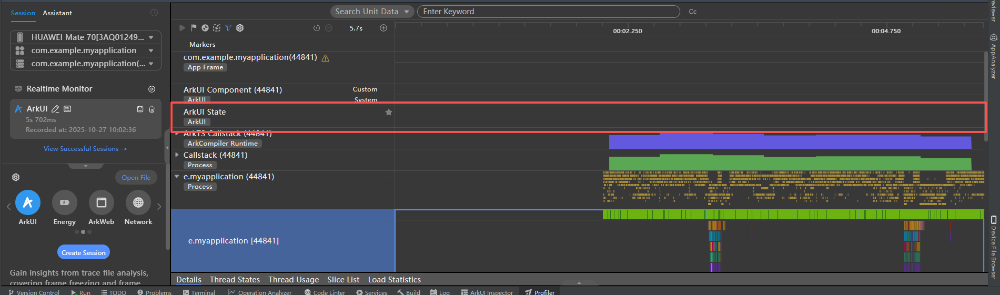
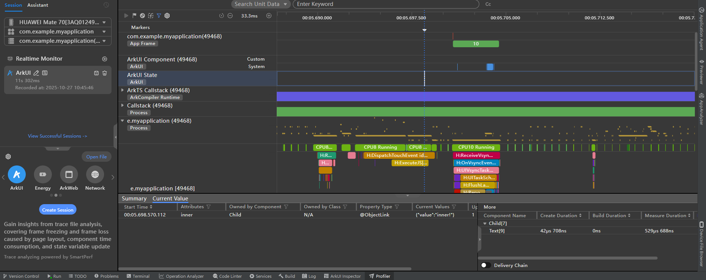
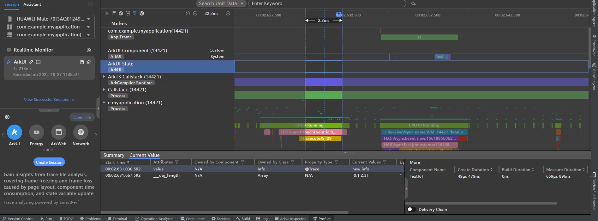

# Common Methods for Locating the Problem That Component Refresh Is Not Triggered When State Variables Change

<!--Kit: ArkUI-->
<!--Subsystem: ArkUI-->
<!--Owner: @liwenzhen3-->
<!--Designer: @zhangboren-->
<!--Tester: @zhangwenhan12-->
<!--Adviser: @zhang_yixin13-->
<!-- md-trans-meta sourceCommit=5cbda8a742fe4c75db3800c28ccfc8ffcd9cebc0 translatedAt=2026-06-30T03:38:48.362Z pushedAt=2026-07-01T07:48:07.698Z -->

In a declarative UI programming framework, the primary responsibility of state management is to trigger a refresh of the components associated with a state variable when that variable changes. Therefore, the most common issue when using state variables is that components fail to refresh. This document addresses two aspects of non-refresh problems that you may encounter when working with state variables.

- How to troubleshoot when a state variable change does not trigger a component refresh

- Common cases of non‑refresh issues

## Primary Methods for Troubleshooting State Variable Refresh Issues

A state variable triggers a UI refresh in two steps:

- Collecting dependencies: Collect the component ID associated with the state variable.

- Triggering updates: Mark the nodes that need updating and trigger their update.

This document only briefly describes the underlying principles. For details, see [State Management Principles](./arkts-state-management-introduce.md). Based on the preceding state variable-triggered UI refresh process, you can follow these five steps to troubleshoot UI refresh issues:

### Step 1: Collecting State Variable Dependencies

In the state management update process, the prerequisite for a state variable to trigger a UI component update is that the state variable has already collected the dependency of the UI component — specifically, the "read" operation of the state variable was triggered during component initialization.

You can use the following tools to check whether the state variable has collected the component ID:

- Use the ArkUI Inspector of DevEco Studio. For details, see [Inspector Debugging Capability](../ui-inspector-profiler.md#inspector-debugging-capability).

- Use the [hidumper](../../dfx/hidumper.md) tool. For details, see [State Management: hidumper](../ui-inspector-profiler.md#state-management-hidumper).

### Step 2: The state variable changes.

When a value is assigned to a state variable, the state management framework checks whether the value of the state variable is changed. If the value is not changed, the state management framework directly returns the value and does not perform any operation. The simplest troubleshooting method is to print the values before and after the state variable is modified and check whether the values change. Example:

```ts
@Entry
@Component
struct Index {
  @State message: string = 'Hello World';

  build() {
    Column() {
      Text(this.message)
        .onClick(() => {
          // Log output: print this.message before and after assignment
          console.info(`message set before ${this.message}`);
          this.message = 'Welcome';
          console.info(`message set after ${this.message}`);
        })
    }
  }
}
```

Check whether the output of **this.message** is changed. The log output is as follows:

```text
message set before Hello World
message set after Welcome
```

### Step 3: Check whether the value assignment of the state variable can be observed.

**State Management (V1)**

In state management V1, if you confirm that the value has changed before and after assignment but the UI refresh is not triggered, check whether the current assignment operation is observable (starting from API version 23, you can use the [canBeObserved](./arkts-new-canBeObserved.md) API to determine whether an object is observable). An example is shown below.

In the following example, the value assigned to **this.inner.value** cannot trigger the refresh of the **Text(`Child: inner value: ${this.inner.value}`)** component, check whether the current value assignment operation can be observed from the following aspects:

  - Whether the listening function of [\@Watch](./arkts-watch.md) is executed.

  - If the state variable is of the complex type and the attribute value change needs to be observed, you can use [getTarget](./arkts-new-getTarget.md) to determine whether the current variable is observable.

  - Use the Profiler tool of DevEco Studio to check whether any state variable changes are reported. For details, see [State Management: Profiler](../ui-inspector-profiler.md#state-management-profiler).

```ts
import { UIUtils } from '@kit.ArkUI';

class Outer {
  value: string = 'outer';
  inner: Inner = new Inner();
}

class Inner {
  value: string = 'inner';
}

@Entry
@Component
struct Index {
  @State outer: Outer = new Outer();

  build() {
    Column() {
      Text(`Index: outer value: ${this.outer.value}`)
      Child({ inner: this.outer.inner })
    }
  }
}

@Component
struct Child {
  // Writing error: The variable initialized by @ObjectLink is not an instance of the class decorated by @Observed.
  // The state management module prints error logs to notify developers.
  // FIX THIS APPLICATION ERROR: @ObjectLink inner owned by @Component Child set/init (method setValueInternal): assigned value is not be decorated by @Observed. Value changes will not be observed and UI will not update.
  @ObjectLink @Watch('onChange') inner: Inner;

  aboutToAppear(): void {
    // Use getTarget to obtain the original object of the state variable. If the two objects are the same, that is, the original object and the current object are the same object, the data is not observable.
    // If the two values are not equal, the object is an observable object.
    // The Inner does not have the @Observed decorator. Therefore, the following log information is displayed:
    // inner is not observed object
    console.info(`inner is ${UIUtils.getTarget(this.inner) === this.inner ? 'not observed object' :
      'observed object'}`);
  }

  onChange() {
    console.info(`inner property has been changed ${this.inner.value}`);
  }

  build() {
    Column() {
      Text(`Child: inner value: ${this.inner.value}`)
        .onClick(() => {
          this.inner.value += '!';
        })
    }
  }
}
```

In the preceding example, **Inner** is not decorated by [\@Observed](./arkts-observed-and-objectlink.md). Therefore, the value of the **value** attribute cannot be observed.

- The **@Watch ('onChange')** function is not executed.

- The log information "inner is not observed object" is displayed.

- The ArkUI State lane does not report state variable changes.

  

Note that not all class objects need to be decorated by \@Observed. By default, the [\@State](./arkts-state.md) decorator wraps the first-layer proxy for complex objects. For nested objects, the \@Observed decorator needs to be added to the class declaration of the inner object.

Correct:

```ts
import { UIUtils } from '@kit.ArkUI';

class Outer {
  value: string = 'outer';
  inner: Inner = new Inner();
}

@Observed
class Inner {
  value: string = 'inner';
}

@Entry
@Component
struct Index {
  @State outer: Outer = new Outer();

  build() {
    Column() {
      Text(`Index: outer value: ${this.outer.value}`)
      Child({ inner: this.outer.inner })
    }
  }
}

@Component
struct Child {
  @ObjectLink @Watch('onChange') inner: Inner;

  aboutToAppear(): void {
    // Log output: inner is observed object
    console.info(`inner is ${UIUtils.getTarget(this.inner) === this.inner ? 'not observed object' :
      'observed object'}`);
  }

  onChange() {
    console.info(`inner property has been changed ${this.inner.value}`)
  }

  build() {
    Column() {
      Text(`Child: inner value: ${this.inner.value}`)
        .onClick(() => {
          this.inner.value += '!';
        })
    }
  }
}
```

In the correct example:

- \@Watch The listening function is triggered normally.

- The message "inner is observed object" is displayed in the log.

- Report information about state variable changes in the ArkUI State lane.

  

**State Management (V2)**

In the state management V2, the observation of complex objects is classified into the following two types:

- Common:

  Different from the state management V1, the framework does not create a proxy object for the instance when the state management V2 observes the common class. Therefore, the getTarget cannot be used to determine whether the instance is a proxy object. You can use the following methods:

  - Check whether the attribute to be observed is decorated with [\@Trace](./arkts-new-observedV2-and-trace.md).

  - Check whether the ArkUI State lane reports state variable changes. For details, see [State Management: Profiler](../ui-inspector-profiler.md#state-management-profiler).

- Built-in types:

  In state management V2, Array, Map, and Set wrap proxy objects. You can call getTarget to check whether the current type is proxy data.

Specific examples are as follows:

```ts
import { UIUtils } from '@kit.ArkUI';

@ObservedV2
class Info {
  @Trace value: string = 'info';
  @Trace numberArr: number[] = [];
  count: number = 0;

  constructor(val: string) {
    this.value = val;
    this.numberArr = [0, 1, 2];
  }
}

@Entry
@ComponentV2
struct Index {
  info: Info = new Info('info');

  aboutToAppear(): void {
    // Log output: this.info.numberArr is observed array
    console.info(`this.info.numberArr is ${UIUtils.getTarget(this.info.numberArr) === this.info.numberArr ?
      'not observed array' :
      'observed array'}`);
  }

  build() {
    Column() {
      Text(`Index: info value: ${this.info.value}`)
      Text(`Index: info numberArr length: ${this.info.numberArr.length}`)
      Text(`Index: info count: ${this.info.count}`)

      Button('change info property').onClick(() => {
        this.info.value = 'new info';
        this.info.numberArr.push(3);
        this.info.count++;
      })
    }
  }
}
```

Based on the preceding example, observe the ArkUI State lane. Two state variable changes are reported, that is, **this.info.value** and **this.info.numberArr**. The **count** is not decorated by \@Trace. Therefore, the count is not observed and the change of the state variable is not reported in the profiler.



### Step 4: Check whether the data source is associated with the object to be synchronized.

In state management, the data source notifies the synchronization object through the bidirectional or unidirectional mechanism. If the data source is changed but the synchronization object is not notified, perform the following steps to locate the fault:
**State Management (V1)**

State management V1 supports the following synchronization modes:

  - Synchronization object (sync peer): for example, \@State, [\@Link](./arkts-link.md), [\@Provide](./arkts-provide-and-consume.md), and [\@Consume](./arkts-provide-and-consume.md). You can use the ArkUI Inspector of DevEco Studio to check whether there is a synchronization relationship between data sources and synchronization objects. For details, see [Inspector Debugging Capability](../ui-inspector-profiler.md#inspector-debugging-capability).

  - Dependency on the update functions of their owner components: For example, @State notifies @Prop of changes, and @State notifies @ObjectLink of changes. You can use breakpoint debugging tools or the [getHash](../../reference/apis-arkts/js-apis-util.md#utilgethash12) API to determine whether the data source and the synchronized object refer to the same object instance (note that the hashcode is not fixed; it should be based on the actual value printed).

**State Management (V2)**

State management V2 does not involve the concept of sync peer. The synchronization mode of [\@Local](./arkts-new-local.md) and [\@Param](./arkts-new-param.md) depends on the update function of the component to which the \@Param component belongs.

In this case, the common scenario is that the data source is disconnected from the synchronization object because the data source is used together with the [ForEach](../rendering-control/arkts-rendering-control-foreach.md) and [LazyForEach](../rendering-control/arkts-rendering-control-lazyforeach.md). Example:

```ts
import { UIUtils } from '@kit.ArkUI';
import { util } from '@kit.ArkTS';

@Observed
class Info {
  value: string = 'info';
}

@Entry
@Component
struct Index {
  @State infos: Info[] = [new Info()];

  build() {
    Column() {
      // Step 1: Click the button.
      // Trigger the update of ForEach. The key value does not change after ForEach comparison, and the update of Child is not triggered. Therefore, @ObjectLink info still points to the previous Info instance.
      // The @State infos and @ObjectLink info are disconnected.
      Button('change first item value').onClick(() => {
        this.infos[0] = new Info();
      })

      // Step 2: Click the button. The @Watch function of @ObjectLink info is not triggered.
      // Log information: this.infos[0] hashcode: 993656661
      // this.infos[0] and @ObjectLink info are not referenced by the same object. @State cannot instruct @ObjectLink to refresh.
      Button('change first item value').onClick(() => {
        this.infos[0].value += '1';
        console.info(`this.infos[0] hashcode: ${util.getHash(this.infos[0])}`);
      })
      ForEach(this.infos, (item: Info) => {
        Child({ info: item })
      })
    }
  }
}

@Component
struct Child {
  @ObjectLink @Watch('onChange') info: Info;

  aboutToAppear(): void {
    // Log output:
    // info is observed object, hashcode: 1806047025
    // The hashcode is not fixed. Use the hashcode printed by the developer.
    console.info(`info is ${UIUtils.getTarget(this.info) === this.info ? 'not observed object' :
      'observed object'}, hashcode: ${util.getHash(this.info)}`);
  }

  onChange() {
    console.info(`info property has been changed ${this.info.value}`);
  }

  build() {
    Column() {
      Text(`Child: info value: ${this.info.value}`)
        .onClick(() => {
          this.info.value += '2';
        })
    }
  }
}
```

Correct:

```ts
import { UIUtils } from '@kit.ArkUI';
import { util } from '@kit.ArkTS';

@Observed
class Info {
  value: string = 'info';
}

@Entry
@Component
struct Index {
  @State infos: Info[] = [new Info()];

  build() {
    Column() {
      // Step 1: Click the button.
      // Trigger the update of ForEach. ForEach compares the key values before and after the update and triggers the rebuilding of Child. @ObjectLink info points to the new Info instance.
      Button('change first item value').onClick(() => {
        this.infos[0] = new Info();
      })

      // Step 2: Click the button. The @Watch function of @ObjectLink info is triggered.
      // Log information: this.infos[0] hashcode: 358024053
      Button('change first item value').onClick(() => {
        this.infos[0].value += '1';
        console.info(`this.infos[0] hashcode: ${util.getHash(this.infos[0])}`);
      })

      ForEach(this.infos, (item: Info) => {
        Child({ info: item })
      }, (item: Info) => {
        // Random number key value
        return item.value + Math.random().toString();
      })
    }
  }
}

@Component
struct Child {
  @ObjectLink @Watch('onChange') info: Info;

  aboutToAppear(): void {
    // Log output:
    // Initial creation: info is observed object, hashcode: 2026693567
    // Click Button('change first item value') to trigger Child rebuilding: info is observed object, hashcode: 358024053
    console.info(`info is ${UIUtils.getTarget(this.info) === this.info ? 'not observed object' :
      'observed object'}, hashcode: ${util.getHash(this.info)}`);
  }

  onChange() {
    console.info(`info property has been changed ${this.info.value}`);
  }

  build() {
    Column() {
      Text(`Child: info value: ${this.info.value}`)
        .onClick(() => {
          this.info.value += '2';
        })
    }
  }
}
```

### Step 5: Determine whether to execute the component update function.

If the UI is still not refreshed after the first four steps are performed, check whether the update function is executed for the components that are not refreshed in the last step.

This problem often occurs when the developer changes the state variable in the synchronization callback of the component. As a result, the component that is being refreshed is added to the list of components to be refreshed again, and the state management framework ignores the refresh of the component. The [onComplete](../../reference/apis-arkui/arkui-ts/ts-basic-components-image.md#oncomplete) API of [Image](../../reference/apis-arkui/arkui-ts/ts-basic-components-image.md) is used as an example.

You can encapsulate the method for obtaining component attributes to check whether the current component is re-rendered. Example:

```ts
@Entry
@Component
struct Page {
  @State widthValue: number = 100;
  @State flag: boolean = true;

  // Encapsulate the getHeightValue method to check whether the image is re-rendered.
  getHeightValue(): number {
    console.info('Image render');
    return 500;
  }

  build() {
    Column() {
      Image(this.flag ? $r('app.media.startIcon') : $r('app.media.background'))
        .width(this.widthValue)
        .height(this.getHeightValue())
        .backgroundColor(Color.Pink)
        .onComplete((event) => {
          this.widthValue = 200;
          console.info(`Image onComplete ${this.widthValue} load status: ${event?.loadingStatus}`);
        })

      Button('change resource').onClick(() => {
        // Step 1: Change the flag so that the two Resource variables enter the cache of the Image component.
        // Step 3: Change the resource of the image again. In this case, onComplete is a synchronous callback.
        // Change the value of widthValue to 200 in the callback of onComplete.
        // Print error logs of state management: FIX THIS APPLICATION ERROR: @Component 'Page: State variable 'widthValue' has changed during render! It's illegal to change @Component state while build (initial render or re-render) is on-going. Application error!
        // No image render log is printed, and the image width does not change.
        this.flag = !this.flag;
      })

      Button('change widthValue').onClick(() => {
        // Step 2: Change the image width to 100.
        this.widthValue = 100;
      })
    }
    .height('100%')
    .width('100%')
  }
}
```

Step 3: Click **Button('change resource')**. The following log is displayed:

```text
Image render
FIX THIS APPLICATION ERROR: @Component 'Page: State variable 'widthValue' has changed during render! It's illegal to change @Component state while build (initial render or re-render) is on-going. Application error!
Image onComplete 200 load status: 0
Image onComplete 200 load status: 1
```

After the onComplete changes the state variable **widthValue**, the **Image render** log is not triggered. The change of the state variable does not trigger the update of the Image component.

Correct:

You can use **setTimeout** to convert the value assignment of the state variable in the synchronous callback of the component to asynchronous execution. The following is an example:

```ts
@Entry
@Component
struct Page {
  @State widthValue: number = 100;
  @State flag: boolean = true;

  getHeightValue(): number {
    console.info('Image render');
    return 500;
  }

  build() {
    Column() {
      Image(this.flag ? $r('app.media.startIcon') : $r('app.media.background'))
        .width(this.widthValue)
        .height(this.getHeightValue())
        .backgroundColor(Color.Pink)
        .onComplete((event) => {
          setTimeout(() =>{
            this.widthValue = 200;
            console.info(`Image onComplete ${this.widthValue} load status: ${event?.loadingStatus}`);
          });
        })

      Button('change resource').onClick(() => {
        // Step 1: Change the flag so that the two Resource variables enter the cache of the Image component.
        // Step 3: Change the resource of the image again. In this case, onComplete is a synchronous callback.
        // Asynchronously change the value of widthValue to 200 in the callback of onComplete.
        // Update the image width to 200.
        this.flag = !this.flag;
      })

      Button('change widthValue').onClick(() => {
        // Step 2: Change the image width to 100.
        this.widthValue = 100;
      })
    }
    .height('100%')
    .width('100%')
  }
}
```

Step 3: Click **Button('change resource')**. The following log is displayed:

```text
Image render
Image onComplete 200 load status: 0
Image onComplete 200 load status: 1
Image render
```

After **setTimeout** in **onComplete** changes the state variable **widthValue**, the **Image render** log is triggered and the image width is updated to 200.

## Summary

Based on the preceding process and example, the core roadmap for locating the update failure is as follows:

- Whether the state variable collects the ID of the component that needs to be refreshed.

- Whether the value of a state variable is an observable change.

- Whether the update function is executed for the component to be updated.

When encountering a problem that the code is not updated, developers can check the code based on the preceding locating process or with the preceding three questions to improve the fault locating efficiency.