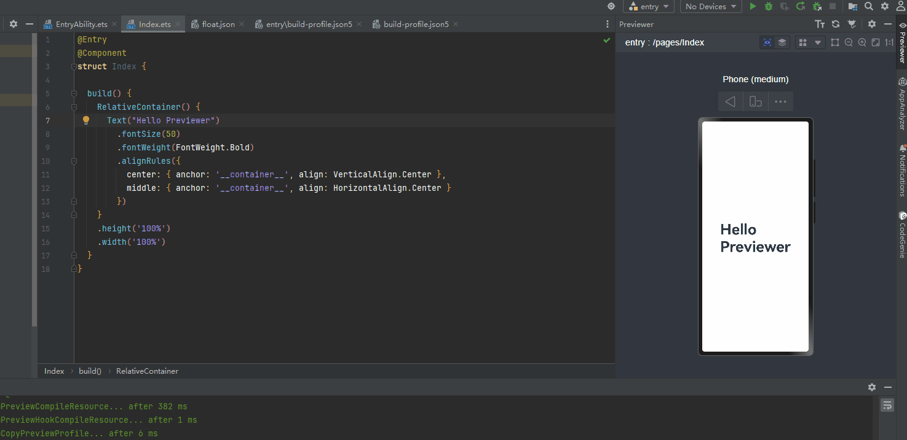
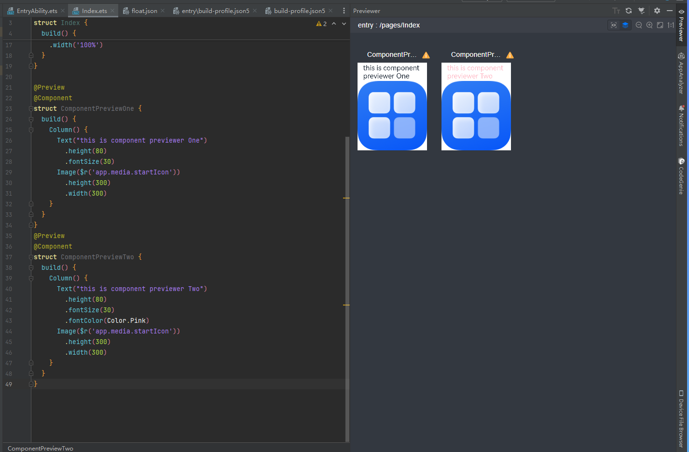
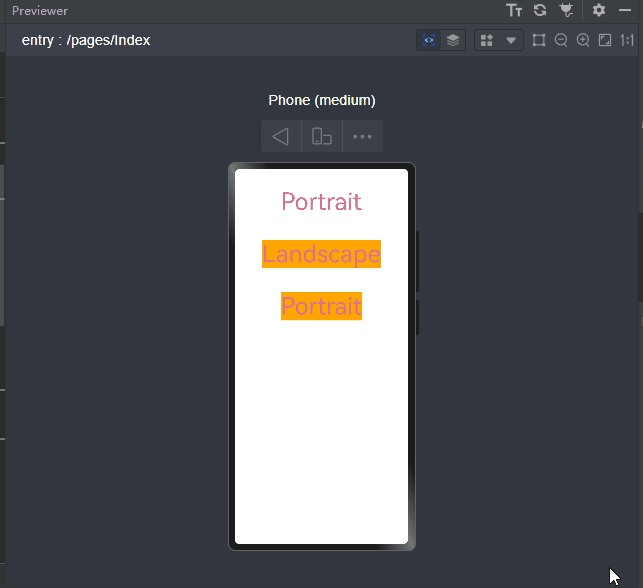

# UI Preview

<!--Kit: ArkUI-->
<!--Subsystem: ArkUI-->
<!--Owner: @huyisuo-->
<!--Designer: @zhangboren-->
<!--Tester: @TerryTsao-->
<!--Adviser: @zhang_yixin13-->

DevEco Studio provides the UI preview function, which allows you to view the UI effect and adjust the page layout at any time. You can preview both pages and components. The icon  on the left in Figure 1 indicates page preview, while the icon  on the right indicates component preview.

> **NOTE**
>
> Due to differences between the operating system and real devices, the preview effect may vary from the actual device performance. The preview is for reference only. Verify the actual performance on real devices.

**Figure 1** Preview icons


## Page Preview

Both ArkTS applications and atomic services support page preview. To preview a page, add the @Entry decorator to the custom component in the project's .ets file.

- To start page preview, select the target .ets page and click the Previewer button in the right sidebar.

- Hot reload: After starting page preview, you can add, delete, or modify UI components. Press **Ctrl+S** to save changes, and the Previewer will refresh without requiring a restart.

- Routing: You can switch between pages to preview different page effects.

In addition to basic page preview, the following enhanced features are available:

### Instant Preview

When modifying component attributes, you can view changes immediately without pressing **Ctrl+S**. Instant preview is enabled by default. To disable it, click  in the Previewer's upper right corner.

> **NOTE**
>
> Instant preview is not supported in the following scenarios:
> - Components that are not displayed
> - Adding or deleting components
> - Components containing private variables or untyped controllers
> - Components using decorators such as @Builder, @Style, and @Extend
> - Components importing external components or modules via **import**
> - Modifying state variables

Figure 2 shows the demonstration.

**Figure 2** Instant preview demonstration



### Inspector Bidirectional Preview

Bidirectional synchronization between the .ets file and Previewer is supported. Click the Previewer icon  to enable this feature.

When this feature is enabled, the code editor, UI preview, and component tree become interconnected:

1. Selecting a component in the Previewer highlights the corresponding component in the component tree and the relevant code block in the editor.

2. Selecting a code block in the editor highlights the corresponding component in both the Previewer and component tree.

3. Selecting a component in the component tree highlights the corresponding code block and Previewer component.

4. Modifications made in the Previewer's attribute panel are automatically synchronized to the code editor and reflected in real time. Similarly, code changes are immediately visible in the Previewer.

Figure 3 shows the demonstration.

**Figure 3** Inspector bidirectional preview demonstration


## Component Preview

Both ArkTS applications and atomic services support component preview. Add the [@Preview](../reference/apis-arkui/arkui-ts/ts-universal-component-previewer.md#preview-decorator) decorator before a custom component to enable preview. A single source file can contain up to 10 @Preview decorators. Startup modes:
- For components decorated with both \@Entry and \@Preview, clicking the Previewer button starts page preview. After loading, click [ide_previewer_003](figures/ide_previewer_003.png) to switch to component preview.
- For components decorated with only \@Preview, clicking the Previewer button directly starts component preview.

During component preview, the default attributes of the @Preview decorator are used. For details, see [PreviewParams](../reference/apis-arkui/arkui-ts/ts-universal-component-previewer.md#previewparams9). You can configure @Preview parameters to specify device attributes, including device type and screen shape.

Example of using the @Preview decorator:

```ts
@Preview
@Component
struct ComponentPreviewOne {
  build() {
    Column() {
      Text('this is component previewer One')
        .height(80)
        .fontSize(30)
      // Replace $r('app.media.startIcon') with the image resource file you use.
      Image($r('app.media.startIcon'))
        .height(300)
        .width(300)
    }
  }
}
@Preview
@Component
struct ComponentPreviewTwo {
  build() {
    Column() {
      Text('this is component previewer Two')
        .height(80)
        .fontSize(30)
        .fontColor(Color.Pink)
      // Replace $r('app.media.startIcon') with the image resource file you use.
      Image($r('app.media.startIcon'))
        .height(300)
        .width(300)
    }
  }
}
```

Figure 4 shows the demonstration.

**Figure 4** Component preview effect



## Dynamic Resolution Adjustment

Applications and atomic services can run on various devices with different screen resolutions, shapes, and sizes. The Previewer supports dynamic resolution changes, allowing you to check UI layouts and interactions across different devices.  \To use this feature: After starting page preview, click  in the upper right corner and drag the selection box to adjust the screen size dynamically.

Figure 5 shows the demonstration.

**Figure 5** Dynamic resolution adjustment effect


