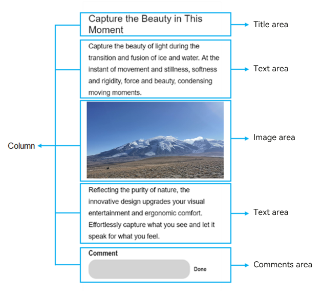
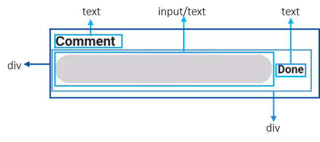

# Layout Description
<!--Kit: ArkUI-->
<!--Subsystem: ArkUI-->
<!--Owner: @fenglinbailu-->
<!--Designer: @lanshouren-->
<!--Tester: @liuli0427-->
<!--Adviser: @Brilliantry_Rui-->

The baseline width for page design is 720 logical pixels. The display width of a page element depends on the ratio of the screen width to the baseline width.

For example, when the width of a component is 100 px, its display width is converted as follows:

On a screen with the width of 720 physical pixels, the display width is 100 physical pixels. On a screen with the width of 1440 physical pixels, the display width is 200 physical pixels.

Basic UI elements include the title, text, and image areas, each containing multiple child elements. You can add components, such as buttons, switches, and progress bars, as required. When building the layout, consider the following for each basic element:

- Size and arrangement

- Overlapping with other elements

- Alignment, padding, and margin

- Sub-elements and their positions

- Container components and their types

Decomposing elements on a page and implementing each basic element in sequence can reduce visual and logical confusion caused by multi-layer nesting, improve code readability, and facilitate subsequent page adjustment. For example, as shown below, you disassemble the page elements and elements in the comment area.

**Figure 1** Page layout decomposition

**Figure 2** Layout of the comment area

