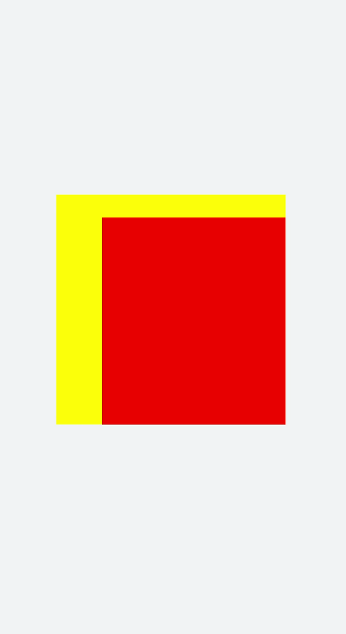

# Basics
<!--Kit: ArkUI-->
<!--Subsystem: ArkUI-->
<!--Owner: @liyujie43-->
<!--Designer: @weixin_52725220-->
<!--Tester: @xiong0104-->
<!--Adviser: @Brilliantry_Rui-->

The **\<svg>** component is used as the root node of the SVG canvas and can be nested in the SVG. For details, see [svg](../reference/apis-arkui/arkui-js/js-components-svg.md).


> **NOTE**
>
> The width and height must be defined for the **\<svg>** parent component or **\<svg>** component. Otherwise, the component is not drawn.


## Creating an \<svg> Component

Create an **\<svg>** component in the .hml file under **pages/index**.


```html
<!-- xxx.hml -->
<div class="container">
  <svg width="400" height="400">  </svg>
</div>
```


```css
/* xxx.css */
.container{
  width: 100%;
  height: 100%;
  flex-direction: column;
  align-items: center;
  justify-content: center;
  background-color: #F1F3F5;
}
svg{
  background-color: blue;
}
```


## Setting Attributes

Set the **width**, **height**, **x**, **y**, and **viewBox** attributes to define the width, height, x-coordinate, y-coordinate, and SVG viewport of the **\<svg>** component.


```html
<!-- xxx.hml -->
<div class="container">
  <svg width="400" height="400" viewBox="0 0 100 100">    
    <svg class="rect" width="100" height="100" x="20" y="10">    
    </svg>  
  </svg>
</div>
```


```css
/* xxx.css */
.container{
  width: 100%;
  height: 100%;
  flex-direction: column;
  align-items: center;
  justify-content: center;
  background-color: #F1F3F5;
}
svg{
  background-color: yellow;
}
.rect{
  background-color: red;
}
```



> **NOTE**
> - If the **\<svg>** component is the root node, the x-axis and y-axis attributes are invalid.
>
> - If the width and height of **viewBox** are inconsistent with those of the **\<svg>** component, the view box will be scaled in center-aligned mode.
