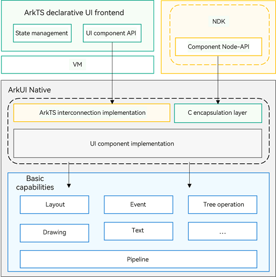

# UI Development (JavaScript-compatible Web-like Development Paradigm) Overview
<!--Kit: ArkUI-->
<!--Subsystem: ArkUI-->
<!--Owner: @yihao-lin-->
<!--Designer: @piggyguy-->
<!--Tester: @songyanhong-->
<!--Adviser: @Brilliantry_Rui-->

The JavaScript-compatible web-like development paradigm uses the classical three-stage programming model, in which HML is used for building layouts, CSS for defining styles, and JavaScript for adding processing logic. UI components are associated with data through one-way data-binding. This means that when data changes, the UI automatically updates with the new data. This development paradigm has a low learning curve for frontend web developers, allowing them to quickly transform existing web applications into ArkUI applications. It could be helpful if you are developing small- and medium-sized applications with simple UIs.

For details about the components to support better application development, see the <!--RP1-->JavaScript-compatible Web-like Development Paradigm APIs<!--RP1End-->.

## Overall Architecture

ArkUI with the JavaScript-compatible web-like development paradigm consists of the following layers: application layer, frontend framework layer, engine layer, and porting layer.

- **Application Layer**

  Contains applications with FAs you developed. The FA application in this document refers to the application with FAs developed using JavaScript.

- **Framework Layer**

  Parses UI pages and provides the Model-View-ViewModel (MVVM), page routing, custom components and more for front end development.

- **Engine Layer**

  Implements animation parsing, Document Object Model (DOM) building, layout computing, rendering command building and drawing, and event management.

- **Porting Layer**

  Abstracts the platform layer to provide abstract APIs to connect to the platform. For example, event interconnection, rendering pipeline interconnection, and lifecycle interconnection.

## ArkUI.Full and ArkUI.Lite

The JS-compatible web-like development paradigm is divided into two versions based on functional completeness and applicable scenarios: ArkUI.Full and ArkUI.Lite. ArkUI.Lite is a subset of ArkUI.Full. ArkUI.Full includes all capabilities of ArkUI.Lite while providing additional components and features. You can choose the appropriate version based on the complexity and resource requirements of your applications.

- **ArkUI.Full**: The complete web-like development paradigm, offering comprehensive UI development capabilities. It supports full container components, basic components, media components, canvas components, grid components, SVG components, and custom components. Designed for devices such as smartphones and tablets, it is suitable for developing feature-rich, highly interactive applications.<!--RP2--><!--RP2End-->

- **ArkUI.Lite**: A lightweight web-like development paradigm, which is a subset of ArkUI.Full. It only supports a selection of core container components, basic components, and basic canvas components. Designed for resource-constrained small devices such as sports watches, it is suitable for lightweight application development.<!--RP3--><!--RP3End-->
