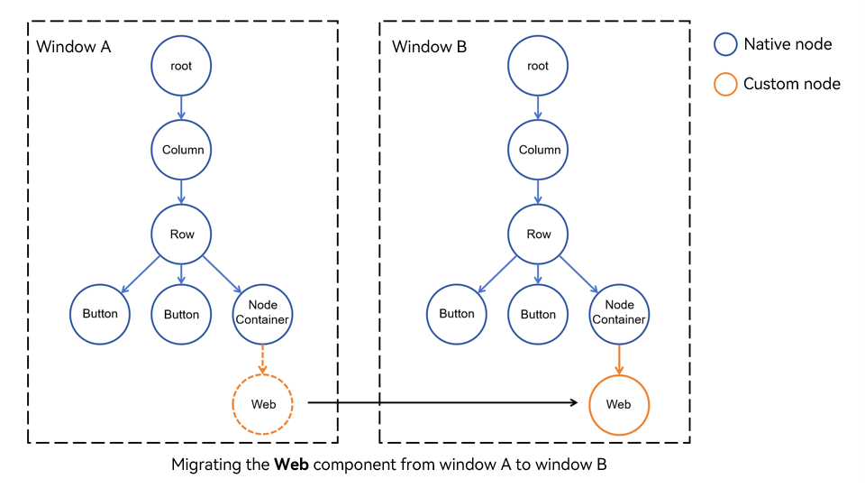

# Migrating Web Components Between Different Windows

The **Web** component can be attached to and detached from the component trees in different windows, which enables the same **Web** component to be migrated between different windows. For example, you can drag a tab page to an independent window or drag it to another window.

Web components are migrated between different windows based on the [Custom Node](../ui/arkts-user-defined-node.md) capability. You can use [BuilderNode](../ui/arkts-user-defined-arktsNode-builderNode.md) to create offline nodes for **Web** components and use [Custom Placeholder Node](../ui/arkts-user-defined-place-holder.md) to attach and detach web nodes. The **Web** component is migrated between windows by detaching the web node from one window and attaching it to another window.

In the following example, a **Web** component is created using a command when the main window Ability is started. You can use the functions and classes provided in **common.ets** to attach and detach the **Web** component. In addition, **Index.ets** provides an implementation method for attaching and detaching **Web** components. In this way, you can attach and detach **Web** components in different windows, in other words, migrate **Web** components between different windows. The following figure shows the migration process.



> **NOTE**
>
> Do not attach a **Web** component under two parent nodes at the same time. Otherwise, unexpected behavior occurs.

```ts
// Main window ability.
// EntryAbility.ets
import { createNWeb, defaultUrl } from '../pages/common'

// ...

  onWindowStageCreate(windowStage: window.WindowStage): void {
    hilog.info(0x0000, 'testTag', '%{public}s', 'Ability onWindowStageCreate');

    windowStage.loadContent('pages/Index', (err) => {
      if (err && err.code) {
        hilog.error(0x0000, 'testTag', 'Failed to load the content. Cause: %{public}s', JSON.stringify(err) ?? '');
        return;
      }
      // Create a dynamic Web component, in which UIContext should be passed. (The component can be created at any time after loadContent() is called, and only one Web component is created for the application.)
      createNWeb(defaultUrl, windowStage.getMainWindowSync().getUIContext());
      hilog.info(0x0000, 'testTag', 'Succeeded in loading the content.');
    });
  }

// ...
```

```ts
// Provide the capability for attaching Web components dynamically.
// pages/common.ets
import { UIContext, NodeController, BuilderNode, FrameNode } from '@kit.ArkUI';
import { webview } from '@kit.ArkWeb';
import { hilog } from '@kit.PerformanceAnalysisKit';

export const defaultUrl : string = 'https://www.example.com';

// Data is an input parameter of encapsulation class.
class Data{
  url: string = '';
  webController: webview.WebviewController | null = null;

  constructor(url: string, webController: webview.WebviewController) {
    this.url = url;
    this.webController = webController;
  }
}

// @Builder contains the specific information of the dynamic component.
@Builder
function WebBuilder(data:Data) {
  Web({ src: data.url, controller: data.webController })
    .width("100%")
    .height("100%")
    .borderStyle(BorderStyle.Dashed)
    .borderWidth(2)
}

let wrap = wrapBuilder<[Data]>(WebBuilder);

// Used to control and report the behavior of the node in NodeContainer. This function must be used together with NodeContainer.
export class MyNodeController extends NodeController {
  private builderNode: BuilderNode<[Data]> | null | undefined = null;
  private webController : webview.WebviewController | null | undefined = null;
  private rootNode : FrameNode | null = null;

  constructor(builderNode : BuilderNode<[Data]> | undefined, webController : webview.WebviewController | undefined) {
    super();
    this.builderNode = builderNode;
    this.webController = webController;
  }

  // This function must be overridden, which is used to construct the number of nodes, return the nodes and attach them to NodeContainer.
  // Call it or rebuild() to refresh when NodeContainer is created.
  makeNode(uiContext: UIContext): FrameNode | null {
    // This node will be attached to the parent node of NodeContainer.
    return this.rootNode;
  }

  // Attach the Webview.
  attachWeb() : void {
    if (this.builderNode) {
      let frameNode : FrameNode | null = this.builderNode.getFrameNode();
      if (frameNode?.getParent() != null) {
        // Check whether the custom node is attached before.
        hilog.error(0x0000, 'testTag', '%{public}s', 'The frameNode is already attached');
        return;
      }
      this.rootNode = this.builderNode.getFrameNode();
    }
  }

  // Detach the Webview.
  detachWeb() : void {
    this.rootNode = null;
  }

  getWebController() : webview.WebviewController | null | undefined {
    return this.webController;
  }
}

// Create a BuilderNode required for saving Map.
let builderNodeMap : Map<string, BuilderNode<[Data]> | undefined> = new Map();
// Create a webview.WebviewController required for saving Map.
let webControllerMap : Map<string, webview.WebviewController | undefined> = new Map();

// Use getUIContext() of the window or custom component to obtain the UIContext object required for initialization.
export const createNWeb = (url: string, uiContext: UIContext) => {
  // Create a WebviewController.
  let webController = new webview.WebviewController() ;
  // Create a BuilderNode.
  let builderNode : BuilderNode<[Data]> = new BuilderNode(uiContext);
  // Create a dynamic Web component.
  builderNode.build(wrap, new Data(url, webController));

  // Save the BuilderNode.
  builderNodeMap.set(url, builderNode);
  // Save the WebviewController.
  webControllerMap.set(url, webController);
}

// Customize the API for obtaining BuilderNode.
export const getBuilderNode = (url : string) : BuilderNode<[Data]> | undefined => {
  return builderNodeMap.get(url);
}
// Customize the API for obtaining WebviewController.
export const getWebviewController = (url : string) : webview.WebviewController | undefined => {
  return webControllerMap.get(url);
}

```

```ts
// Use the pages of NodeController.
// pages/Index.ets
import { getBuilderNode, MyNodeController, defaultUrl, getWebviewController } from "./common"

@Entry
@Component
struct Index {
  private nodeController : MyNodeController =
    new MyNodeController(getBuilderNode(defaultUrl), getWebviewController(defaultUrl));

  build() {
    Row() {
      Column() {
        Button("Attach Webview")
          .onClick(() => {
            // Do not attach the same node to different pages at the same time.
            this.nodeController.attachWeb();
            this.nodeController.rebuild();
          })
        Button("Detach Webview")
          .onClick(() => {
            this.nodeController.detachWeb();
            this.nodeController.rebuild();
          })
        // NodeContainer is used to bind to the NodeController node. Calling rebuild() triggers makeNode().
        // The Page is bound to NodeController() through NodeContainer(). As a result, the dynamic component page is successfully displayed.
        NodeContainer(this.nodeController)
          .height("80%")
          .width("80%")
      }
      .width('100%')
    }
    .height('100%')
  }
}

```
