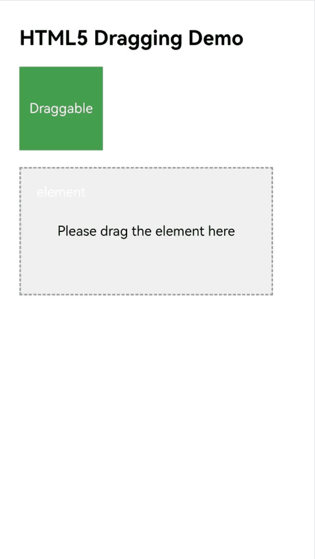
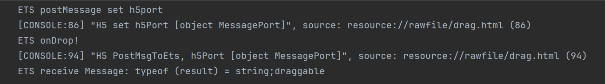
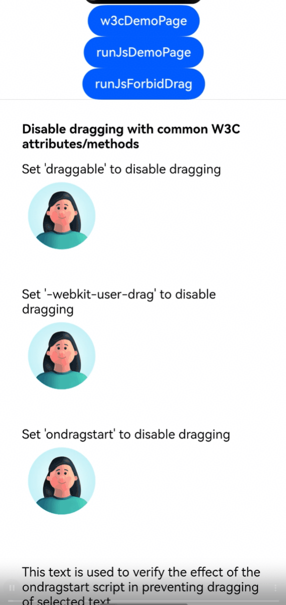

# Using Drag and Drop in Web Component to Interact with Web Pages

<!--Kit: ArkWeb-->
<!--Subsystem: Web-->
<!--Owner: @zourongchun-->
<!--Designer: @zhufenghao-->
<!--Tester: @ghiker-->
<!--Adviser: @HelloShuo-->
<!-- md-trans-meta sourceCommit=444d4b7458e1317b3c2f1a471488b9c4b8344c2e translatedAt=2026-06-03T07:21:15.760Z pushedAt=2026-06-03T10:34:22.303Z -->

ArkWeb's drag-and-drop feature enables applications to implement element dragging and dropping within web pages. Users can long-press a draggable element, drag it onto a droppable element, and then release to complete the drop. ArkWeb's drag-and-drop functionality within web content complies with H5 standards.

## Dragging Web Content to Other Applications

ArkWeb currently supports the following four data formats. By setting drag data in these formats according to H5 standards, applications can drag content to other applications.

| Data Format   | Description |
| ------------- | ----------- |
| text/plain    | Text        |
| text/uri-list | Link        |
| text/html     | HTML format |
| Files         | File        |

## Drag Event Notifications

ArkWeb drag differs from ArkUI's component-level drag. It is primarily designed for dragging web content, and therefore only supports listening methods for some drag events.

| Listening Method    | Description                                                  |
| ----------- | ----------------------------------------------------- |
| [onDragStart](../reference/apis-arkui/arkui-ts/ts-universal-events-drag-drop.md#ondragstart)  | Using this method is not recommended, as it may affect the drag behavior of the Web component, causing the drag logic to not meet expectations, such as failing to trigger H5 drag event listening, failing to create or incorrectly creating preview images, and being unable to preset drag data. |
|  [onDragEnter](../reference/apis-arkui/arkui-ts/ts-universal-events-drag-drop.md#ondragenter) | A dragged element enters the Web area. |
| [onDragMove](../reference/apis-arkui/arkui-ts/ts-universal-events-drag-drop.md#ondragmove)  | A dragged element moves within the Web area.  |
| [onDragLeave](../reference/apis-arkui/arkui-ts/ts-universal-events-drag-drop.md#ondragleave) | A dragged element leaves the Web area.          |
| [onDrop](../reference/apis-arkui/arkui-ts/ts-universal-events-drag-drop.md#ondrop15) | A dragged element is dropped into the Web area.        |
| [onDragEnd](../reference/apis-arkui/arkui-ts/ts-universal-events-drag-drop.md#ondragend10) | A drag initiated by Web ends.         |

## Implementing Drag-Related Logic on the ArkTS Side

In most cases, the drag functionality implemented by the application on the H5 side meets the requirements. If needed, refer to the following case to implement operations such as reading drag data on the ArkTS side.

1. [Establish a data channel between the application side and the frontend page](web-app-page-data-channel.md).

2. In the onDrop method, implement simple logic, such as temporarily storing some key data.

3. In the method that receives messages on the ArkTS side, add application processing logic, which can perform time-consuming tasks.

Since the onDrop method on the ArkTS side executes earlier than the drop event handler in H5 (droppable.addEventListener('drop') in the H5 example), performing operations such as page navigation in the onDrop method will cause the drop method in H5 to fail to execute correctly, leading to unexpected results. Therefore, a bidirectional communication mechanism should be established to notify the ArkTS side to execute the corresponding business logic after the drop method in H5 completes, ensuring the expected execution of the business logic.

<!-- @[DragArkTSPage](https://gitcode.com/openharmony/applications_app_samples/blob/master/code/DocsSample/ArkWeb/WebDragInteraction/entry/src/main/ets/pages/DragArkTSPage.ets) -->

``` TypeScript
import { webview } from '@kit.ArkWeb'
import { unifiedDataChannel, uniformTypeDescriptor } from '@kit.ArkData';

@Entry
@Component
struct DragDrop {
  private controller: webview.WebviewController = new webview.WebviewController()
  @State ports: Array<webview.WebMessagePort> = []
  @State dragData: Array<unifiedDataChannel.UnifiedRecord> = []

  build() {
    Column() {
      Web({
        src: $rawfile('drag.html'),
        controller: this.controller,
      }).onPageEnd((event) => {
        // Register the communication port
        this.ports = this.controller.createWebMessagePorts();
        this.ports[1].onMessageEvent((result: webview.WebMessage) => {
          // After ArkTS receives data from HTML, you can first log the message for confirmation. The message format for both ends can be customized, as long as it can be uniquely identified.
          console.info('ETS receive Message: typeof (result) = ' + typeof (result) + ';' + result);
          // Add the processing logic here after the message is received in the result, which can include time-consuming tasks.
        });
        console.info('ETS postMessage set h5port ');
        // After completing the communication port registration, send a registration completion message to the frontend to complete the bidirectional port binding.
        this.controller.postMessage('__init_port__', [this.ports[0]], '*');
      })// onDrop can be used for simple logic, such as temporarily storing some key data.
        .onDrop((dragEvent: DragEvent) => {
          console.info('ETS onDrop!')
          let data: UnifiedData = dragEvent.getData();
          if(!data) {
            return false;
          }
          let uriArr: unifiedDataChannel.UnifiedRecord[] = data.getRecords();
          if (!uriArr || uriArr.length <= 0) {
            return false;
          }
          // You can iterate through records to temporarily store data, or store data in other ways.
          for (let i = 0; i < uriArr.length; ++i) {
            if (uriArr[i].getType() === uniformTypeDescriptor.UniformDataType.PLAIN_TEXT) {
              let plainText = uriArr[i] as unifiedDataChannel.PlainText;
              if (plainText.textContent) {
                console.info('plainText.textContent: ', plainText.textContent);
              }
            }
          }
          return true
        })
    }

  }
}
```

H5 Example:

```html
<html lang="zh-CN">
<head>
    <meta charset="UTF-8">
    <meta name="viewport" content="width=device-width, initial-scale=1.0, user-scalable=no">
    <title>H5 Drag Demo</title>
</head>
<style>
    body {
      font-family: Arial, sans-serif;
      padding: 20px;
    }

    .draggable {
      width: 100px;
      height: 100px;
      background-color: #4CAF50;
      color: white;
      text-align: center;
      line-height: 100px;
      margin-bottom: 20px;
      cursor: grab;
    }

    .droppable {
      width: 300px;
      height: 150px;
      border: 2px dashed #999;
      background-color: #f0f0f0;
      text-align: center;
      line-height: 150px;
      font-size: 16px;
    }

    .success {
      background-color: #4CAF50;
      color: white;
    }
</style>
<body>

<h2>H5 Drag Demo</h2>

<div id="draggable" class="draggable" draggable="true">Draggable element</div>

<div id="droppable" class="droppable">Drop the square here</div>

<script>
    const draggable = document.getElementById('draggable');
    const droppable = document.getElementById('droppable');

    // Drag start event
    draggable.addEventListener('dragstart', function (e) {
      e.dataTransfer.setData('text/plain', this.id);
      this.style.opacity = '0.4';
    });

    // Drag end event
    draggable.addEventListener('dragend', function (e) {
      this.style.opacity = '1';
    });

    // Triggered when dragging into the target area
    droppable.addEventListener('dragover', function (e) {
      e.preventDefault(); // Must be called, otherwise the drop event cannot be triggerederwise, the drop event cannot be triggered
    });

    // Drop event
    droppable.addEventListener('drop', function (e) {
      e.preventDefault();
      const data = e.dataTransfer.getData('text/plain');
      // Passed to ArkTS
      PostMsgToArkTS(data);
      const draggableEl = document.getElementById(data);
      this.appendChild(draggableEl);
      this.classList.add('success');
      this.textContent = "Drop successful!";
    });

    // The scriptproxy port is set on the JS side
    var h5Port;
    window.addEventListener('message', function (event) {
    console.info("H5 receive settingPort message");
        if (event.data == '__init_port__') {
            if (event.ports[0] != null) {
                console.info("H5 set h5Port " + event.ports[0]);
                h5Port = event.ports[0];
            }
        }
    });

    // Sending data to the ArkTS side via scriptproxy
    function PostMsgToArkTS(data) {
        console.info("H5 PostMsgToArkTS, h5Port " + h5Port);
        if (h5Port) {
          h5Port.postMessage(data);
        } else {
          console.error("h5Port is null, Please initialize first");
        }
    }
</script>

</body>
</html>
```



Log output:



## FAQ

### Why is the H5 drag event not triggered?

Check whether the relevant CSS resources are properly configured. Some web pages perform UA detection and only apply CSS styles for specific device UAs. Consider setting a custom UA in the Web component to resolve this issue, for example:

<!-- @[SetUAPage](https://gitcode.com/openharmony/applications_app_samples/blob/master/code/DocsSample/ArkWeb/WebDragInteraction/entry/src/main/ets/pages/SetUAPage.ets) -->

``` TypeScript
import { webview } from '@kit.ArkWeb'

@Entry
@Component
struct Index {
  private webController: webview.WebviewController = new webview.WebviewController()
  build(){
    Column() {
      Web({
        src: 'example.com',
        controller: this.webController,
      }).onControllerAttached(() => {
        // Specific UA
        let customUA = 'android'
        this.webController.setCustomUserAgent(this.webController.getUserAgent() + customUA)
      })
    }
  }
}
```

### How to disable the drag capability of the Web component

Without special configuration, the Web component supports the drag function by default. If the drag function is not needed, refer to the following example to disable dragging.

There are two main ways to disable drag and drop:

1. Intercept/disable it on the web page side through W3C CSS and JS.

2. Intercept/disable it on the application side by injecting JS through the Web component's runJavaScriptExt API.

H5 Example 1:

```html
<html lang="zh-CN">
<head>
    <meta charset="UTF-8">
    <meta name="viewport" content="width=device-width, initial-scale=1.0, user-scalable=no">
    <title>Disable drag and drop by using W3C common attributes or methods</title>
</head>
<style>
    body {
      font-family: Arial, sans-serif;
      padding: 20px;
    }
    .normal {
      width: 100px;
      height: 100px;
      margin-bottom: 40px;
    }
    .undraggable {
      width: 100px;
      height: 100px;
      margin-bottom: 40px;
      -webkit-user-drag: none;
    }

</style>
<body>

<h2>Disable drag and drop by using W3C common attributes or methods</h2>

<!--1. Disable dragging for an element by explicitly setting the draggable attribute to false.-->
<!--This applies only to dragging of entire element nodes, such as img or div, and does not apply to selected text within a node.-->
<div>Disable drag and drop by setting draggable</div>
<br>

<!--2. Disable dragging by referencing a style class and setting -webkit-user-drag to none in the class.-->
<!--The scope of effect is the same as method 1.-->
<div>Disable drag and drop by setting -webkit-user-drag</div>
<br>

<!--3. Disable dragging by setting an ondragstart event listener and calling preventDefault.-->
<!--This applies to dragging of any content.-->
<!--You can disable drag and drop in a larger area by expanding the scope of the listener. For example, listening on window can disable drag and drop for the entire Web component.-->
<!--Because the effective node is processed relatively late, the drag operation has partially proceeded, which may affect menu functionality.-->
<div>Disable drag and drop by setting ondragstart</div>
<div ondragstart="dragstartHandler(event)">
    
    <p>
        This text is used to verify the effect of the ondragstart script in disabling drag and drop for selected text.
    </p>
</div>

<script>
    function dragstartHandler(event) {
        console.info('forbid drag when drag start');
        event.preventDefault();
    }
</script>

</body>
</html>
```



HTML example 2:

```html id="ld6n4a"
<html lang="zh-CN">
<head>
    <meta charset="UTF-8">
    <meta name="viewport" content="width=device-width, initial-scale=1.0, user-scalable=no">
    <title>Disable drag and drop by injecting JavaScript with runJavascriptExt</title>
</head>
<style>
    body {
      font-family: Arial, sans-serif;
      padding: 20px;
    }
    .normal {
      width: 100px;
      height: 100px;
      margin-bottom: 40px;
    }
</style>
<body>

<h2>Disable drag and drop by injecting JavaScript with runJavascriptExt</h2>

<div>
    
    <p>
        This text is used to verify the effect of JavaScript injected with runJavascriptExt in disabling drag and drop for selected text.
    </p>
</div>

</body>
</html>
```


ArkTS Example:

<!-- @[ForbidDragPage](https://gitcode.com/openharmony/applications_app_samples/blob/master/code/DocsSample/ArkWeb/WebDragInteraction/entry/src/main/ets/pages/ForbidDragPage.ets) -->

``` TypeScript
import { webview } from '@kit.ArkWeb';

@Entry
@Component
struct Index {
  webViewController: webview.WebviewController = new webview.WebviewController();

  build() {
    Column() {
      Button('w3cDemoPage')
        .onClick(() => {
          this.webViewController.loadUrl($rawfile('w3c-forbid.html'));
        })
      Button('runJsDemoPage')
        .onClick(() => {
          this.webViewController.loadUrl($rawfile('runJs-forbid.html'));
        })
      Button('runJsForbidDrag')
        .onClick(() => {
          try {
            // Use runJavaScriptExt to execute a script that adds a dragstart event listener to disable dragging.
            this.webViewController.runJavaScriptExt(
              'window.addEventListener(\'dragstart\', (ev) => {\n' +
                'ev.preventDefault();\n' +
                '});',
              (error, result) => {
                if (error) {
                  console.error(`run JavaScript error, ErrorCode: ${(error as BusinessError).code},  Message: ${(error as BusinessError).message}`)
                  return;
                }
              });
          } catch (resError) {
            console.error(`ErrorCode: ${(resError as BusinessError).code},  Message: ${(resError as BusinessError).message}`);
          }
        })
      Web({
        src: $rawfile('w3c-forbid.html'),
        controller: this.webViewController
      })
        .domStorageAccess(true)
        .javaScriptAccess(true)
        .fileAccess(true)
    }
    .height('100%')
    .width('100%')
  }
}
```