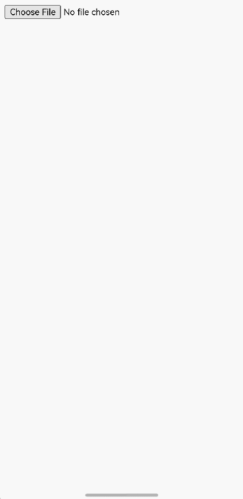
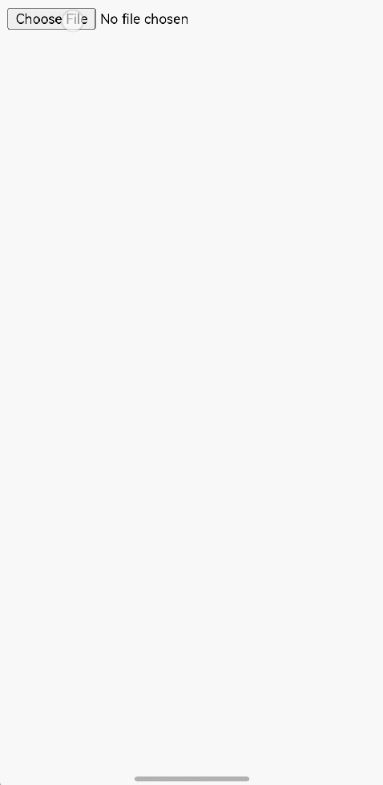
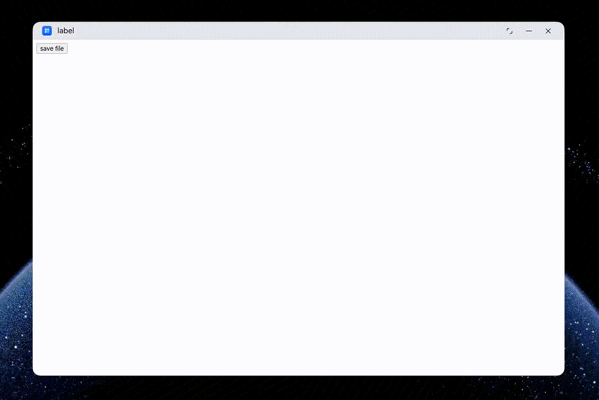

# Uploading Files
<!--Kit: ArkWeb-->
<!--Subsystem: Web-->
<!--Owner: @zourongchun-->
<!--Designer: @zhufenghao-->
<!--Tester: @ghiker-->
<!--Adviser: @HelloShuo-->

The **Web** component supports file uploading on a frontend page. You can use [onShowFileSelector()](../reference/apis-arkweb/arkts-basic-components-web-events.md#onshowfileselector9) to process file upload requests sent from a frontend page. If this API is not used, the **Web** component provides default processing for the requests sent from the frontend page. You can also customize the picker based on the obtained frontend data.

## Starting File Manager Using onShowFileSelector

In the following example, when a user clicks the **Upload** button on the frontend page, the application receives a file upload request through [onShowFileSelector()](../reference/apis-arkweb/arkts-basic-components-web-events.md#onshowfileselector9), which carries the path of the local file to be uploaded.


- Application code:

<!-- @[web_file_upload](https://gitcode.com/openharmony/applications_app_samples/blob/master/code/DocsSample/ArkWeb/ManageWebPageFileIO/entry/src/main/ets/pages/UploadFiles.ets) -->

``` TypeScript
import { webview } from '@kit.ArkWeb';
import { BusinessError } from '@kit.BasicServicesKit';
import { picker } from '@kit.CoreFileKit';

@Entry
@Component
struct WebComponent {
  controller: webview.WebviewController = new webview.WebviewController();

  build() {
    Column() {
      Web({ src: $rawfile('local.html'), controller: this.controller })
        .onShowFileSelector((event) => {
          console.info('MyFileUploader onShowFileSelector invoked');
          const documentSelectOptions = new picker.DocumentSelectOptions();
          let uri: string | null = null;
          const documentViewPicker = new picker.DocumentViewPicker();
          documentViewPicker.select(documentSelectOptions).then((documentSelectResult) => {
            uri = documentSelectResult[0];
            console.info('documentViewPicker.select to file succeed and uri is:' + uri);
            if (event) {
              event.result.handleFileList([uri]);
            }
          }).catch((err: BusinessError) => {
            console.error(`Invoke documentViewPicker.select failed, code is ${err.code}, message is ${err.message}`);
          })
          return true;
        })
    }
  }
}
```

- Code of the **local.html** page:
  
  ```html
  <!DOCTYPE html>
  <html>
  <head>
      <meta charset="utf-8">
      <meta name="viewport" content="width=device-width" />
      <title>Document</title>
  </head>

  <body>
  <!-- Click the Upload button -->
  <input type="file"><br>
  </body>
  </html>
  ```


## Starting Gallery Using onShowFileSelector

In the following example, when a user clicks the **Upload** button on the frontend page, the application receives a file upload request through [onShowFileSelector()](../reference/apis-arkweb/arkts-basic-components-web-events.md#onshowfileselector9), which carries the path of the local image to be uploaded.


- Application code:
  
  ```ts
  // xxx.ets
  import { webview } from '@kit.ArkWeb';
  import { photoAccessHelper } from '@kit.MediaLibraryKit';

  @Entry
  @Component
  struct WebComponent {
    controller: webview.WebviewController = new webview.WebviewController();

    async selectFile(result: FileSelectorResult): Promise<void> {
      let photoSelectOptions = new photoAccessHelper.PhotoSelectOptions();
      let photoPicker = new photoAccessHelper.PhotoViewPicker();
      // Set the mime file type to IMAGE_VIDEO.
      photoSelectOptions.MIMEType = photoAccessHelper.PhotoViewMIMETypes.IMAGE_VIDEO_TYPE;
      // Set the maximum number of media files that can be selected.
      photoSelectOptions.maxSelectNumber = 5;
      let chooseFile: photoAccessHelper.PhotoSelectResult = await photoPicker.select(photoSelectOptions);
      // Obtain the list of selected files.
      result.handleFileList(chooseFile.photoUris);
    }

    build() {
      Column() {
        Web({ src: $rawfile('local.html'), controller: this.controller })
          .onShowFileSelector((event) => {
            if (event) {
              this.selectFile(event.result);
            }
            return true;
          })
      }
    }
  }
  ```


- Code of the **local.html** page:
  
  ```html
  <!DOCTYPE html>
  <html>
  <head>
      <meta charset="utf-8">
      <meta name="viewport" content="width=device-width" />
      <title>Document</title>
  </head>

  <body>
  <!-- Click the Upload button -->
  <input type="file"><br>
  </body>
  </html>
  ```


## Starting Camera Using onShowFileSelector

The **Web** component allows the frontend page to call the camera to take photos when uploading image files. You can use the [onShowFileSelector()](../reference/apis-arkweb/arkts-basic-components-web-events.md#onshowfileselector9) API to process the request for uploading image files from the frontend page and start the camera. If no processing is performed, the **Web** component provides the default behavior to process the request for calling the camera.

In the following example, the application listens for the [onShowFileSelector](../reference/apis-arkweb/arkts-basic-components-web-events.md#onshowfileselector9) event and returns **true** to intercept the default ArkWeb dialog box and invoke the system **CameraPicker** to start the camera. The application can obtain **AcceptType** to filter target files of different types in a more refined manner.

```ts
// xxx.ets
import { webview } from '@kit.ArkWeb';
import { camera, cameraPicker } from '@kit.CameraKit';
import { BusinessError } from '@kit.BasicServicesKit';
import { common } from '@kit.AbilityKit';

async function openCamera(callback: Callback<string>, uiContext: UIContext) {
  let mContext = uiContext.getHostContext() as common.Context;
  try {
    let pickerProfile: cameraPicker.PickerProfile = {
      cameraPosition: camera.CameraPosition.CAMERA_POSITION_BACK
    };
    let pickerResult: cameraPicker.PickerResult = await cameraPicker.pick(mContext,
      [cameraPicker.PickerMediaType.PHOTO, cameraPicker.PickerMediaType.VIDEO], pickerProfile);
    callback(pickerResult.resultUri);
  } catch (error) {
    let err = error as BusinessError;
    console.error(`the pick call failed. error code: ${err.code}`);
  }
}

@Entry
@Component
struct Index {
  webviewController: webview.WebviewController = new webview.WebviewController();

  build() {
    Column() {
      Web({ src: $rawfile("webCamera.html"), controller: this.webviewController })
        .onShowFileSelector((event) => {
            //You can use event.fileSelector.getAcceptType() and event.fileSelector.isCapture() to determine the file type and filter files to start different file selectors.
            openCamera((result) => {
                if (event) {
                console.info('Title is ' + event.fileSelector.getTitle());
                console.info('Mode is ' + event.fileSelector.getMode());
                console.info('Accept types are ' + event.fileSelector.getAcceptType());
                console.info('Capture is ' + event.fileSelector.isCapture());
                event.result.handleFileList([result]);
                }
            }, this.getUIContext())
            return true;
        })
    }
    .height('100%')
    .width('100%')
  }
}
```

HTML page code:
```html
<!DOCTYPE html>
<html lang="en">
<head>
    <meta charset="UTF-8">
    <meta name="viewport" content="width=device-width, initial-scale=1.0">
    <title>WebCamera</title>
</head>
<body>
    <input type="file" name="photo" id="photo"><br>
    
    <script>
        let photo = document.getElementById("photo");
        photo.addEventListener("change", preViewImg)

        function preViewImg(event) {
            let fileReader = new FileReader();
            let img = document.getElementById("img");
            fileReader.addEventListener(
                "load",
                () => {
                    // Convert the image file into a Base64 string.
                    img.src = fileReader.result;
                    img.style.display = "block";
                },
                false
            );
            if (event.target.files && event.target.files[0]) {
              fileReader.readAsDataURL(event.target.files[0]);
            } else {
              console.error("File not exist.");
            }            
        }
    </script>
</body>
</html>
```


## Processing File Upload Requests Using the Default ArkWeb Mode

The **accept** attribute is a string that defines the file types that the file **input** component should accept. This string is a comma-separated list of unique file type specifiers. Because a given file type can be specified in many ways, it is important to provide a complete set of type specifiers when you need a file in a given format.

The **capture** attribute is a string used to specify the camera to obtain the data if the **accept** attribute specifies that the input is an image or video. **user** indicates that the front camera and/or microphone should be used. **environment** indicates that the rear camera and/or microphone should be used. If this attribute is absent, the user agent is free to decide what to do. If the preset mode of the request is not available, the user agent may use the default mode.

When the Boolean type attribute **multiple** is specified, the file **input** component allows users to select multiple files.

The sample page includes multiple file selectors, each with different **accept** and **capture** attributes. The impact of these attributes on the camera is as follows:

| accept                      | capture                     | Behavior of the File Selector                                    |
| --------------------------- | --------------------------- | -------------------------------------------------- |
| Only the image type             | **environment** or **user**| Starts the camera to take photos.                            |
| Only the image type              | Unspecified                     | Starts a dialog box. After the user chooses to take a photo, the camera is started to take a photo.      |
| Only the video type             | **environment** or **user**| Starts the camera to record videos.                            |
| Only the video type              | Unspecified                     | Starts a dialog box. After the user chooses to take a photo, the camera is started to record videos.      |
| Image and video types         | **environment** or **user**| Starts the camera to take photos and record videos.                    |
| Image and video types           | Unspecified                     | Starts a dialog box. After the user chooses to take a photo, the camera is started to take photos and record videos.|
| Unspecified       | **environment** or **user**| Starts the camera to take photos and record videos.                    |
| Unspecified         | Unspecified                     | Starts a dialog box. After the user chooses to take a photo, the camera is started to take photos and record videos.|
| Image and video types are excluded       | **environment** or **user**| Starts the file selection, but not the camera.                   |
| Image and video types are excluded         | Unspecified                     | Starts the file selection, but not the camera.                  |

> Currently, ArkWeb can identify the following file types:
>  - Image: tif, xbm, tiff, pjp, jfif, bmp, avif, apng, ico, webp, svg, gif, svgz, jpg, jpeg, png, pjpeg
>  - Video: mp4, mpg, mpeg, m4v, ogm, ogv, webm

>  **NOTE**
>
> By default, ArkWeb starts only the rear camera. The value **user** is not processed as starting the front camera. To start the front camera, use the [onShowFileSelector()](../reference/apis-arkweb/arkts-basic-components-web-events.md#onshowfileselector9) API on the application side.

HTML page code:
```html
<!DOCTYPE html>
<html lang="en">
<head>
    <meta charset="UTF-8">
    <meta name="viewport" content="width=device-width, initial-scale=1.0">
    <title>WebCamera</title>
</head>
<body>
    <input type="file" name="picture" id="picture" accept="image/*"><br>
    
    <script>
        let picture = document.getElementById("picture");
        picture.addEventListener("change", preViewImg)

        function preViewImg(event) {
            let fileReader = new FileReader();
            let img = document.getElementById("img");
            fileReader.addEventListener(
                "load",
                () => {
                    // Convert the image file into a Base64 string.
                    img.src = fileReader.result;
                    img.style.display = "block";
                },
                false
            );
            if (event.target.files && event.target.files[0]) {
              fileReader.readAsDataURL(event.target.files[0]);
            } else {
              console.error("File not exist.");
            }    
        }
    </script>
</body>
</html>
```

Code on the application side:
```ts
// xxx.ets
import { webview } from '@kit.ArkWeb';

@Entry
@Component
struct Index {
  webviewController: webview.WebviewController = new webview.WebviewController();

  build() {
    Column() {
      Web({ src: $rawfile("webCamera.html"), controller: this.webviewController })
    }
    .height('100%')
    .width('100%')
  }
}
```


## Customizing the File Request Initiated by the JavaScript API

Since API version 23, the **getSuggestedName()**, **getDefaultPath()**, **getDescriptions()**, and **isAcceptAllOptionExcluded()** APIs are added to **FileSelectorParam** of **OnShowFileSelectorEvent**.

With these APIs, ArkWeb's capability of uploading and saving files is enhanced to benchmark against the W3C capability. You can use them to obtain the data in the **option** parameter transferred by the HTML frontend using methods such as **showSaveFilePicker**, **showOpenFilePicker** and **showDirectoryPicker**. For details, see the loaded HTML file.

Since API version 23, the following members of **option** are added:

**suggestedName**: corresponds to the [getSuggestedName](../reference/apis-arkweb/arkts-basic-components-web-FileSelectorParam.md#getsuggestedname23) API.

**description**: corresponds to the [getDescriptions](../reference/apis-arkweb/arkts-basic-components-web-FileSelectorParam.md#getdescriptions23) API.

**excludeAcceptAllOption**: corresponds to the [isAcceptAllOptionExcluded](../reference/apis-arkweb/arkts-basic-components-web-FileSelectorParam.md#isacceptalloptionexcluded23) API.

**startIn**: corresponds to the [getDefaultPath](../reference/apis-arkweb/arkts-basic-components-web-FileSelectorParam.md#getdefaultpath23) API.

**types**: corresponds to the [getAcceptableFileTypes](../reference/apis-arkweb/arkts-basic-components-web-FileSelectorParam.md#getacceptablefiletypes23) API.

Code of the **index.html** page:
```html
<!DOCTYPE html>
<html>
<head>
    <title>File saving test</title>
</head>
<body>
<button onclick="saveFile()">Save File</button>
<div id="result"></div>

<script>
    async function saveFile() {
        const options = {
            startIn: 'documents',
            suggestedName: 'example.txt',
            types: [
                {
                    description: 'Text file',
                    accept: {'text/plain': ['.txt','.text','.doc','.docx'],
                             'video/mp4': ['.mp4','.avi','.av1','.vp9']}
                },
                {
                    description: 'Video',
                    accept: {'video/mp4': ['.mp4','.avi','.av1','.vp9']}
                }
            ],
            excludeAcceptAllOption: true
        };

        try {
            const fileHandle = await window.showSaveFilePicker(options);
        } catch (error) {
            if (error.name !== 'AbortError') {
                document.getElementById('result').innerHTML =
                    'Error: ${error.message}`;
            }
        }
    }
</script>
</body>
</html>
```

Application code:
```ts
// xxx.ets
import { webview } from '@kit.ArkWeb';
import { BusinessError } from '@kit.BasicServicesKit';
import { picker } from '@kit.CoreFileKit';
let defaultPublicPath = 'storage/Users/currentUser/';
let defaultBasePath = 'file://docs/';
let wellKnownDirectoryMap = new Map<string, string>([
    ['desktop', defaultPublicPath + 'desktop'],
    ['documents', defaultPublicPath + 'documents'],
    ['downloads', defaultPublicPath + 'download'],
    ['music', defaultPublicPath + 'music'],
    ['pictures', defaultPublicPath + 'images'],
    ['videos', defaultPublicPath + 'videos'],
]);

function getUri(path : string) {
  let publicDir = wellKnownDirectoryMap.get(path);
  if (publicDir !== undefined) {
    path = publicDir;
  }
  return defaultBasePath + path;
}

function getFileName(name : string) {
  let fileName = name;
  let lastDotIndex = name.lastIndexOf('.');
  if (lastDotIndex !== -1) {
    fileName = name.substring(0, lastDotIndex);
  }
  return fileName;
}

@Entry
@Component
struct WebComponent {
  controller: webview.WebviewController = new webview.WebviewController();

  build() {
    Column() {
      Web({ src: $rawfile('index.html'), controller: this.controller })
        .onShowFileSelector((event) => {
          console.info('onShowFileSelector Suggested Name is ' + event.fileSelector.getSuggestedName());
          console.info('onShowFileSelector Default Path is ' + event.fileSelector.getDefaultPath());
          console.info('onShowFileSelector Descriptions are ' + event.fileSelector.getDescriptions());
          console.info('onShowFileSelector AcceptAllOptionExcluded is ' + event.fileSelector.isAcceptAllOptionExcluded());
          const documentSaveOptions = new picker.DocumentSaveOptions();
          documentSaveOptions.newFileNames = new Array<string>();
          documentSaveOptions.newFileNames.push(getFileName(event.fileSelector.getSuggestedName()));
          documentSaveOptions.defaultFilePathUri = getUri(event.fileSelector.getDefaultPath());
          let accepts : Array<Array<AcceptableFileType>> = event.fileSelector.getAcceptableFileTypes();
          let descriptions : Array<string> = event.fileSelector.getDescriptions();
          documentSaveOptions.fileSuffixChoices = new Array<string>();
          let n = accepts.length;
          for (let i = 0; i < n; i++) {
            let m = accepts[i].length;
            let extList = Array<string>();
            for (let j = 0; j < m; j++) {
              extList.push(accepts[i][j].acceptableType.join(','));
            }
            let ext = extList.join(',');
            let desc = descriptions[i] + '(' + ext + ')' + '|';
            documentSaveOptions.fileSuffixChoices.push(desc + ext);
          }
          if (!event.fileSelector.isAcceptAllOptionExcluded()) {
            documentSaveOptions.fileSuffixChoices.push('All files(*.*)' + '|' + '*.*');
          }
          let uri: string | null = null;
          const documentViewPicker = new picker.DocumentViewPicker();
          documentViewPicker.save(documentSaveOptions).then((documentSelectResult) => {
            uri = documentSelectResult[0];
            console.info('documentViewPicker.select to file succeed and uri is:' + uri);
            if (event) {
              event.result.handleFileList([uri]);
            }
          }).catch((err: BusinessError) => {
            console.error(`Invoke documentViewPicker.select failed, code is ${err.code}, message is ${err.message}`);
          })
          return true;
        })
    }
  }
}
```


In this example, **showSaveFilePicker()** in HTML works with **documentViewPicker.save()** in the .ets file.

**NOTE**

1. The input parameter **option** of **showOpenFilePicker** and **showDirectoryPicker** in HTML has different members from that of **showSaveFilePicker**.

2. To call the **documentViewPicker.select()** method in the .ets file, use the **picker.DocumentSelectOptions** object instead of the **picker.DocumentSaveOptions** object to pass parameters for the picker.

## FAQs

### How to use onShowFileSelector together with the default ArkWeb dialog box?

After a user taps the file upload button, the program preferentially executes the callback in **onShowFileSelector** for logic processing. You can return **false** based on the processing result to start the default ArkWeb dialog box. In this case, you are not advised to start the pickers on the application side at the same time.

### What are the differences between getAcceptType and getMimeTypes in the callback?

**getAcceptType** returns a string array consisting of the file name extensions converted from the **accept** attribute value. **getMimeTypes** returns a string array consisting of the **accept** attribute value that is separated by commas (,).

For example, if the value of **accept** is **video/mp4, .png**, **getAcceptType** returns **.mp4, .m4v; .png**, and **getMimeTypes** returns **video/mp4; .png**.

### What is the default ArkWeb dialog box used for?

When a user selects **Image**, the gallery is started. The user can choose to upload images or videos based on the value of the **accept** attribute. When a user selects **Photo**, the camera is started. The user can choose to take photos or record videos based on the value of the **accept** attribute. When a user selects **File**, the file manager is started. The user can upload any content.

### How to use handleFileList?

This function submits the selected file path to ArkWeb. The input parameters are of two types.
1. File protocol path. Currently, only the public path whose prefix is **file://media/** or **file://docs/** and the application bundle name path of **file://\<packageName>/** are supported. Other file protocol paths do not have the permission.
2. Sandbox directory. For details, see [Application Sandbox](../file-management/app-sandbox-directory.md).
