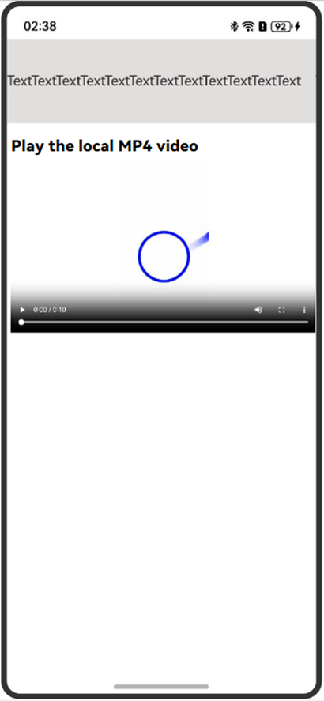

# Enabling Immersive Full-Screen Video Playback
<!--Kit: ArkWeb-->
<!--Subsystem: Web-->
<!--Owner: @zhangyao75477-->
<!--Designer: @gzweioh-->
<!--Tester: @ghiker-->
<!--Adviser: @HelloShuo-->
<!-- md-trans-meta sourceCommit=129e568b2e3d9e00a1a96f816f5b690da736d5ea translatedAt=2026-09-21T02:13:12.637Z pushedAt=2026-09-21T12:44:19.012Z -->

ArkWeb provides events for entering and exiting the full-screen mode. An application can listen for these events to enter and exit the immersive full-screen mode.

When a video loaded from a third-party H5 page in the **Web** component is played in full screen, the video expands only to the entire **Web** component area and cannot be displayed in system full screen (as shown in Figure 2). To achieve the immersive full-screen video playback effect at the system level (as shown in Figure 3), the app must listen for the event of entering the full-screen mode and adjust the attributes of other components on the UI.


| Figure 1 Exit full-screen mode | Figure 2 Non-immersive full-screen mode | Figure 3 Immersive full-screen mode |
| :--------------------------------------------: | :---------------------------------------------: | :---------------------------------------------: |
| |  |  |

The **Web** component can listen for the click event of the full-screen button through the [onFullScreenEnter](../reference/apis-arkweb/arkts-basic-components-web-events.md#onfullscreenenter9) and [onFullScreenExit](../reference/apis-arkweb/arkts-basic-components-web-events.md#onfullscreenexit9) callbacks. Specifically, onFullScreenEnter indicates that the **Web** component enters the full-screen mode, and onFullScreenExit indicates that the **Web** component exits the full-screen mode. In these two callbacks, you can adjust certain global variables as required, such as the visibility state of components and the margin attribute of components, to achieve the UI effect of exiting and entering the immersive full-screen mode, as shown in Figure 1 and Figure 3.

The [visibility](../reference/apis-arkui/arkui-ts/ts-universal-attributes-visibility.md#visibility) attribute is a common component attribute provided by ArkUI. You can control the visibility state of a component by setting different values of the component attribute visibility.

<!-- @[web_full_screen](https://gitcode.com/openharmony/applications_app_samples/blob/master/code/DocsSample/ArkWeb/ArkWebPictureInPicture/entry1/src/main/ets/pages/Index.ets) -->

``` TypeScript
import { webview } from '@kit.ArkWeb';

@Entry
@Component
struct ShortWebPage {
  controller: webview.WebviewController = new webview.WebviewController();
  CONSTANT_HEIGHT = 100;
  @State isVisible: boolean = true; // Define the custom flag isVisible to control whether the component is displayed.

  build() {
    Column() {
      Text('TextTextTextText')
        .width('100%')
        .height(this.CONSTANT_HEIGHT)
        .backgroundColor('#e1dede')
        .visibility(this.isVisible ? Visibility.Visible :
          Visibility.None) // When the isVisible flag is true, the component is visible; otherwise, the component is invisible and does not participate in layout or occupy space.
      Web({
        src: $rawfile('FullScreen.html'), // Sample URL
        controller: this.controller
      })
        .onFullScreenEnter((event) => {
          console.info('onFullScreenEnter...');
          // When entering full-screen mode, set the isVisible flag to false so that the component is invisible and does not participate in layout or occupy space.
          this.isVisible = false;
        })
        .onFullScreenExit(() => {
          console.info('onFullScreenExit...');
          // When exiting full-screen mode, set the isVisible flag to true so that the component is visible.
          this.isVisible = true;
        })
        .width('100%')
        .height('100%')
        .zIndex(10)
        .zoomAccess(true)
    }.width('100%').height('100%')
  }
}
```

## FAQs

The following are issues that may occur during full-screen playback.

### How to Switch Between Portrait and Landscape Orientation When Tapping the Full-Screen Button After the Web Component Loads a Video

**Symptom**

Tapping the full-screen button during video playback enters the immersive full-screen interface, but the screen does not switch to landscape orientation.

**Possible Causes**

Web component full-screen mode only changes the content layout and does not trigger the app window orientation switch.

**Solution**

When the Web component enters full-screen mode, the window orientation does not change automatically. You need to use the [onFullScreenEnter](../reference/apis-arkweb/arkts-basic-components-web-events.md#onfullscreenenter9) and [onFullScreenExit](../reference/apis-arkweb/arkts-basic-components-web-events.md#onfullscreenexit9) methods of the Web component to listen for the events of the Web component entering and exiting full-screen mode.

<!-- @[toggle fullscreen](https://gitcode.com/openharmony/applications_app_samples/blob/master/code/DocsSample/ArkWeb/ArkWebFullScreen/entry/src/main/ets/pages/Index.ets) -->

``` TypeScript
Web({
  src:$rawfile('video.html'), // Replace as needed
  controller: this.controller
})
  .domStorageAccess(true)
  .expandSafeArea([SafeAreaType.SYSTEM])
  .onFullScreenEnter(() => {
    this.isFullScreen = true;
    this.changeOrientation(true);
  })
  .onFullScreenExit(() => {
    this.isFullScreen = false;
    this.changeOrientation(false);
  })
```

Use the `setPreferredOrientation` method provided by `Window` to set the portrait and landscape orientation.

<!-- @[toggle screen orientation](https://gitcode.com/openharmony/applications_app_samples/blob/master/code/DocsSample/ArkWeb/ArkWebFullScreen/entry/src/main/ets/pages/Index.ets) -->

``` TypeScript
// Change the device orientation between landscape and portrait.
private changeOrientation(isLandscape: boolean) {
// Obtain the context information of the UIAbility instance.
let context: common.UIAbilityContext = this.getUIContext().getHostContext() as common.UIAbilityContext;
// Call this API to manually change the device orientation between landscape and portrait.
  window.getLastWindow(context).then((lastWindow) => {
    lastWindow.setPreferredOrientation(isLandscape ? window.Orientation.LANDSCAPE : window.Orientation.PORTRAIT);
  }).catch((err: Error) => {
    console.error(`Failed to obtain window: ${err.message}`);
  });
}
```

When customizing the swipe operation, determine whether the current video is in full-screen mode. If it is in full-screen mode, first execute the logic to exit full-screen mode by swiping.

<!-- @[exit full screen](https://gitcode.com/openharmony/applications_app_samples/blob/master/code/DocsSample/ArkWeb/ArkWebFullScreen/entry/src/main/ets/pages/Index.ets) -->

``` TypeScript
onBackPress(): boolean | void {
  if (this.isFullScreen) {
    this.isFullScreen = false;
    this.changeOrientation(false);
    return true;
  } else {
    router.back();
    return true;
  }
}
```

Complete sample code:

<!-- @[switch between portrait and landscape](https://gitcode.com/openharmony/applications_app_samples/blob/master/code/DocsSample/ArkWeb/ArkWebFullScreen/entry/src/main/ets/pages/Index.ets) -->

``` TypeScript
import { webview } from '@kit.ArkWeb';
import { window, router } from '@kit.ArkUI';
import { common } from '@kit.AbilityKit';

@Entry
@Component
struct WebVideo {
  controller: webview.WebviewController = new webview.WebviewController();
  @State isFullScreen: boolean = false;

  // Change the device orientation.
  private changeOrientation(isLandscape: boolean) {
  // Obtain the context information of the UIAbility instance.
  let context: common.UIAbilityContext = this.getUIContext().getHostContext() as common.UIAbilityContext;
  // Call this API to manually change the device orientation.
    window.getLastWindow(context).then((lastWindow) => {
      lastWindow.setPreferredOrientation(isLandscape ? window.Orientation.LANDSCAPE : window.Orientation.PORTRAIT);
    }).catch((err: Error) => {
      console.error(`Failed to obtain window: ${err.message}`);
    });
  }

  onBackPress(): boolean | void {
    if (this.isFullScreen) {
      this.isFullScreen = false;
      this.changeOrientation(false);
      return true;
    } else {
      router.back();
      return true;
    }
  }

  build() {
    Column() {
      Web({
        src:$rawfile('video.html'), // to be replaced
        controller: this.controller
      })
        .domStorageAccess(true)
        .expandSafeArea([SafeAreaType.SYSTEM])
        .onFullScreenEnter(() => {
          this.isFullScreen = true;
          this.changeOrientation(true);
        })
        .onFullScreenExit(() => {
          this.isFullScreen = false;
          this.changeOrientation(false);
        })
    }
    .height('100%')
    .width('100%')
    .backgroundColor('#000000')
  }
}
```

