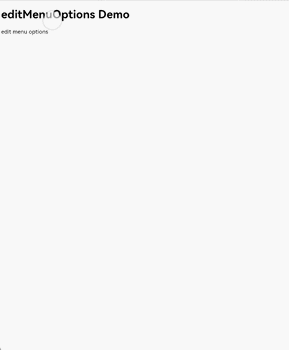
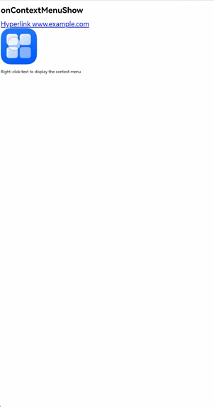
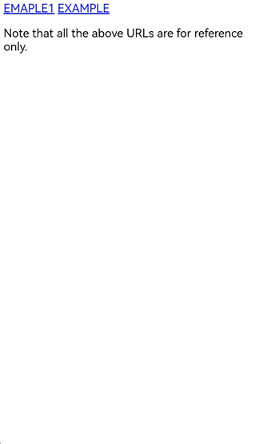
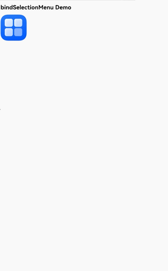
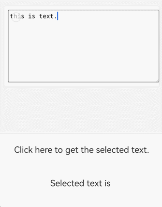

# Using Web Component Menus to Process Web Content

<!--Kit: ArkWeb-->
<!--Subsystem: Web-->
<!--Owner: @zourongchun-->
<!--Designer: @zhufenghao-->
<!--Tester: @ghiker-->
<!--Adviser: @HelloShuo-->
<!-- md-trans-meta sourceCommit=444d4b7458e1317b3c2f1a471488b9c4b8344c2e translatedAt=2026-06-03T07:21:14.978Z pushedAt=2026-06-03T11:31:57.555Z -->

As a key component of user interaction, menus serve to build a clear navigation system, presenting functional entries through structured layouts so that users can quickly find target content or perform operations. As an important hub for human-computer interaction, they significantly enhance the accessibility and user experience of Web components and are an indispensable part of application design. Web component menu types include [text selection menu](./web-menu.md#text-selection-menu), [context menu](./web-menu.md#context-menu), and [custom menu](./web-menu.md#custom-menu), allowing applications to choose flexibly based on specific needs.

|Menu Type|Target Element|Response Type|Customizable|
|----|----|----|----|
|[Text selection menu](./web-menu.md#text-selection-menu)|Text|Long press gesture|Menu items can be added or removed; menu style is not customizable|
|[Context menu](./web-menu.md#context-menu)|Hyperlinks, images, text|Long press gesture, right-click|Supports customization via menu components|
|[Custom menu](./web-menu.md#custom-menu)|Images|Long press gesture|Supports customization via menu components|

## Text Selection Menu

The text selection menu of the Web component is a context interaction component implemented through custom elements. It dynamically appears when the user selects text, providing semantic operations such as copy, share, and annotate. With standardized functionality and good extensibility, it is one of the core features for text operations on mobile devices. The text selection menu pops up when the user long-presses to select text or when a single handle appears after a long press in editing mode, with menu items arranged horizontally. The system provides a default menu implementation. Applications can customize the text selection menu through the [editMenuOptions](../reference/apis-arkweb/arkts-basic-components-web-attributes.md#editmenuoptions12) interface.

1. Customize menu items through the onCreateMenu method. By operating the Array<[TextMenuItem](../reference/apis-arkui/arkui-ts/ts-text-common.md#textmenuitem12)> array, you can add or remove displayed menu items. Define the menu item name, icon, ID, and other content in [TextMenuItem](../reference/apis-arkui/arkui-ts/ts-text-common.md#textmenuitem12).

2. Handle menu item click events through the onMenuItemClick method. When it returns false, the system default logic will be executed.

3. Create an [EditMenuOptions](../reference/apis-arkui/arkui-ts/ts-text-common.md#editmenuoptions) object, which includes the onCreateMenu and onMenuItemClick methods. Bind it to the Web component through the [editMenuOptions](../reference/apis-arkweb/arkts-basic-components-web-attributes.md#editmenuoptions12) interface of the Web component.

<!-- @[web_textMenuItem](https://gitcode.com/openharmony/applications_app_samples/blob/master/code/DocsSample/ArkWeb/ArkWebMenu/entry/src/main/ets/pages/WebTextMenuItem.ets) --> 

``` TypeScript
import { webview } from '@kit.ArkWeb';

@Entry
@Component
struct WebComponent {
  controller: webview.WebviewController = new webview.WebviewController();

  onCreateMenu(menuItems: Array<TextMenuItem>): Array<TextMenuItem> {
    let items = menuItems.filter((menuItem) => {
      // Filter the system menu items required by the user
      return (
        menuItem.id.equals(TextMenuItemId.CUT) ||
          menuItem.id.equals(TextMenuItemId.COPY) ||
          menuItem.id.equals(TextMenuItemId.PASTE)
      );
    });
    let customItem1: TextMenuItem = {
      content: 'customItem1',
      id: TextMenuItemId.of('customItem1'),
      // Please replace $r('app.media.startIcon') with the actual resource file
      icon: $r('app.media.startIcon')
    };
    let customItem2: TextMenuItem = {
      // Replace $r('app.string.EntryAbility_label') with the actual resource file. In this example, the value of this resource file is "label".
      content: $r('app.string.EntryAbility_label'),
      id: TextMenuItemId.of('customItem2'),
      // Replace $r('app.media.startIcon') with the actual resource file.
      icon: $r('app.media.startIcon')
    };
    items.push(customItem1); // Add a new option after the option listption after the option list
    items.unshift(customItem2); // Add an option before the option listion before the option list
    for (let i = 0; i < 5; i++) {
      items.push(customItem1); // Add options repeatedly to support displaying more menustedly to support displaying more menus
    }
    return items;
  }

  onMenuItemClick(menuItem: TextMenuItem, textRange: TextRange): boolean {
    if (menuItem.id.equals(TextMenuItemId.CUT)) {
      // User-defined behavior
      console.info('intercept id: CUT')
      return true; // Return true to not execute the system callbacko skip the system callback
    } else if (menuItem.id.equals(TextMenuItemId.COPY)) {
      // User-defined behavior
      console.info('Do not intercept id：COPY')
      return false; // Return false to execute the system callbackto execute the system callback
    } else if (menuItem.id.equals(TextMenuItemId.of('customItem1'))) {
      // User-defined behavior
      console.info('intercept id: customItem1')
      return true; // When the user-defined menu option returns true, the menu remains open after clicking; when it returns false, the menu closes.urns true, the menu remains open after clicking; when it returns false, the menu closes.
    } else if (menuItem.id.equals(TextMenuItemId.of('customItem2'))) {
      // User-defined behavior
      console.info('intercept id: customItem2')
      return true;
    }
    return false; // Returns the default value false.e default value false.
  }

  @State editMenuOptions: EditMenuOptions = { onCreateMenu: this.onCreateMenu, onMenuItemClick: this.onMenuItemClick }

  build() {
    Column() {
      Web({ src: $rawfile('index.html'), controller: this.controller })
        .editMenuOptions(this.editMenuOptions)
    }
  }
}
```

<!---->

  ```html
  <!--index.html-->
  <!DOCTYPE html>
  <html>
    <head>
        <title>Test web page</title>
    </head>
    <body>
      <h1>editMenuOptions Demo</h1>
      <span>edit menu options</span>
    </body>
  </html>
  ```

  

## Context Menu

A context menu is a shortcut menu triggered by a specific user action (such as right-clicking or long-pressing rich text), providing functional options related to the current operation object or interface element. Menu items are arranged vertically. The system does not provide a default implementation. If the application does not implement one, the context menu will not be displayed. The application needs to create a [Menu](../reference/apis-arkui/arkui-ts/ts-basic-components-menu.md) component and bind it to the Web component. When the menu pops up, detailed information about the context menu, including HTML element information and click position information, can be obtained through the [onContextMenuShow](../reference/apis-arkweb/arkts-basic-components-web-events.md#oncontextmenushow9) callback interface of the Web component.

1. The [Menu](../reference/apis-arkui/arkui-ts/ts-basic-components-menu.md) component serves as the pop-up menu, containing all menu item behaviors and styles.

2. Use the bindPopup method to bind the Menu component to the Web component. When the context menu pops up, the created Menu component will be displayed.

3. Obtain the context menu event information in the onContextMenuShow callback [onContextMenuShowEvent](../reference/apis-arkweb/arkts-basic-components-web-i.md#oncontextmenushowevent12). The param is of type [WebContextMenuParam](../reference/apis-arkweb/arkts-basic-components-web-WebContextMenuParam.md), which contains the HTML element information and position information corresponding to the click location. The result is of type [WebContextMenuResult](../reference/apis-arkweb/arkts-basic-components-web-WebContextMenuResult.md), which provides common menu capabilities.

<!-- @[web_ContextMenu](https://gitcode.com/openharmony/applications_app_samples/blob/master/code/DocsSample/ArkWeb/ArkWebMenu/entry/src/main/ets/pages/WebContextMenu.ets) --> 

``` TypeScript
// xxx.ets
import { webview } from '@kit.ArkWeb';
import { pasteboard } from '@kit.BasicServicesKit';

const TAG = 'ContextMenu';

@Entry
@Component
struct WebComponent {
  controller: webview.WebviewController = new webview.WebviewController();
  private result: WebContextMenuResult | undefined = undefined;
  @State linkUrl: string = '';
  @State offsetX: number = 0;
  @State offsetY: number = 0;
  @State showMenu: boolean = false;
  uiContext: UIContext = this.getUIContext();

  @Builder
  // Building a custom menu and triggering function interfaces
  MenuBuilder() {
    // A menu displayed in a vertical list format.
    Menu() {
      // Displays specific menu items within the Menu.
      MenuItem({
        content: 'Copy Image',
      })
        .width(100)
        .height(50)
        .onClick(() => {
          this.result?.copyImage();
          this.showMenu = false;
        })
      MenuItem({
        content: 'Cut',
      })
        .width(100)
        .height(50)
        .onClick(() => {
          this.result?.cut();
          this.showMenu = false;
        })
      MenuItem({
        content: 'Copy',
      })
        .width(100)
        .height(50)
        .onClick(() => {
          this.result?.copy();
          this.showMenu = false;
        })
      MenuItem({
        content: 'Paste',
      })
        .width(100)
        .height(50)
        .onClick(() => {
          this.result?.paste();
          this.showMenu = false;
        })
      MenuItem({
        content: 'Copy link',
      })
        .width(100)
        .height(50)
        .onClick(() => {
          let pasteData = pasteboard.createData(pasteboard.MIMETYPE_TEXT_PLAIN, this.linkUrl);
          pasteboard.getSystemPasteboard().setData(pasteData, (error) => {
            if (error) {
              return;
            }
          })
          this.showMenu = false;
        })
      MenuItem({
        content: 'Select All',
      })
        .width(100)
        .height(50)
        .onClick(() => {
          this.result?.selectAll();
          this.showMenu = false;
        })
    }
    .width(150)
    .height(300)
  }

  build() {
    Column() {
      Web({ src: $rawfile('index1.html'), controller: this.controller })
      // Triggering a custom pop-up
        .onContextMenuShow((event) => {
          if (event) {
            this.result = event.result
            console.info('x coord = ' + event.param.x());
            console.info('link url = ' + event.param.getLinkUrl());
            this.linkUrl = event.param.getLinkUrl();
          }
          console.info(TAG, `x: ${this.offsetX}, y: ${this.offsetY}`);
          this.showMenu = true;
          this.offsetX = 0;
          this.offsetY = Math.max(this.uiContext!.px2vp(event?.param.y() ?? 0) - 0, 0);
          return true;
        })
        .bindPopup(this.showMenu,
          {
            builder: this.MenuBuilder(),
            enableArrow: false,
            placement: Placement.LeftTop,
            offset: { x: this.offsetX, y: this.offsetY },
            mask: false,
            onStateChange: (e) => {
              if (!e.isVisible) {
                this.showMenu = false;
                this.result!.closeContextMenu();
              }
            }
          })
    }
  }
}
```

<!---->

```html
<!-- index.html -->
<!DOCTYPE html>
<html lang="en">
<body>
  <h1>onContextMenuShow</h1>
  <a href="http://www.example.com" style="font-size:27px">Hyperlink: www.example.com</a>
  <!--example.png is an image in the same directory as the HTML file.-->
  <div></div>
  <p>Select text and right-click it to display a menu.</p>
</body>
</html>
```



## Custom Menu

Custom menus give developers the flexibility to control the timing and visual presentation of menus, enabling applications to dynamically match functional entries based on user operation scenarios. This significantly simplifies interface adaptation during development while making the interactive experience more intuitive for users.

Developers can implement custom menu functionality through the [bindSelectionMenu](../reference/apis-arkweb/arkts-basic-components-web-attributes.md#bindselectionmenu13) API. Currently, additional support is provided for triggering custom menus and custom text menus via long press on images, links, and text.

1. Create a [Menu](../reference/apis-arkui/arkui-ts/ts-basic-components-menu.md) component as the menu popup.

2. Bind the MenuBuilder menu popup through the Web component's [bindSelectionMenu](../reference/apis-arkweb/arkts-basic-components-web-attributes.md#bindselectionmenu13) method. Set [WebElementType](../reference/apis-arkweb/arkts-basic-components-web-e.md#webelementtype13) to WebElementType.IMAGE and [responseType](../reference/apis-arkweb/arkts-basic-components-web-e.md#webresponsetype13) to WebResponseType.LONG_PRESS, indicating that the menu pops up when long pressing an image. Define the menu display callback onAppear, menu disappearance callback onDisappear, preview window preview, and menu type menuType in [options](../reference/apis-arkweb/arkts-basic-components-web-i.md#selectionmenuoptionsext13).

<!-- @[web_BindSelectionMenu](https://gitcode.com/openharmony/applications_app_samples/blob/master/code/DocsSample/ArkWeb/ArkWebMenu/entry/src/main/ets/pages/WebBindSelectionMenu.ets) -->

``` TypeScript
import { webview } from '@kit.ArkWeb';

interface PreviewBuilderParam {
  previewImage: Resource | string | undefined;
  width: number;
  height: number;
}

@Builder function previewBuilderGlobal($$: PreviewBuilderParam) {
  Column() {
    Image($$.previewImage)
      .objectFit(ImageFit.Fill)
      .autoResize(true)
  }.width($$.width).height($$.height)
}

@Entry
@Component
struct WebComponent {
  controller: webview.WebviewController = new webview.WebviewController();

  private result: WebContextMenuResult | undefined = undefined;
  @State previewImage: Resource | string | undefined = undefined;
  @State previewWidth: number = 0;
  @State previewHeight: number = 0;
  uiContext: UIContext = this.getUIContext();

  @Builder
  MenuBuilder() {
    Menu() {
      MenuItem({ content: 'Copy', })
        .onClick(() => {
          this.result?.copy();
          this.result?.closeContextMenu();
        })
      MenuItem({ content: 'Select All', })
        .onClick(() => {
          this.result?.selectAll();
          this.result?.closeContextMenu();
        })
    }
  }
  build() {
    Column() {
      Web({ src: $rawfile('index2.html'), controller: this.controller })
        .bindSelectionMenu(WebElementType.IMAGE, this.MenuBuilder, WebResponseType.LONG_PRESS,
          {
            onAppear: () => {},
            onDisappear: () => {
              this.result?.closeContextMenu();
            },
            preview: previewBuilderGlobal({
              previewImage: this.previewImage,
              width: this.previewWidth,
              height: this.previewHeight
            }),
            menuType: MenuType.PREVIEW_MENU
          })
        .onContextMenuShow((event) => {
          if (event) {
            this.result = event.result;
            if (event.param.getLinkUrl()) {
              return false;
            }
            this.previewWidth = this.uiContext!.px2vp(event.param.getPreviewWidth());
            this.previewHeight = this.uiContext!.px2vp(event.param.getPreviewHeight());
            if (event.param.getSourceUrl().indexOf('resource://rawfile/') == 0) {
              this.previewImage = $rawfile(event.param.getSourceUrl().substr(19));
            } else {
              this.previewImage = event.param.getSourceUrl();
            }
            return true;
          }
          return false;
        })
    }
  }
}
```

<!---->

```html
<!--index.html-->
<!DOCTYPE html>
<html>
  <head>
      <title>Test web page</title>
  </head>
  <body>
    <h1>bindSelectionMenu Demo</h1>
    <!--img.png is an image in the same directory as the HTML file.-->
    
  </body>
</html>
```


Since API version 20, binding a long press hyperlink menu is supported. Different custom menus can be bound for images and links.

In the following example, PreviewBuilder defines the pop-up content of the menu corresponding to the hyperlink, loads the hyperlink content using the Web component (note that the Web component in PreviewBuilder does not receive events), and displays the loading progress using the [Progress component](../ui/arkts-common-components-progress-indicator.md).

<!-- @[web_PreviewBuilder](https://gitcode.com/openharmony/applications_app_samples/blob/master/code/DocsSample/ArkWeb/ArkWebMenu/entry/src/main/ets/pages/WebPreviewBuilder.ets) -->

``` TypeScript
import { webview } from '@kit.ArkWeb';
import { pasteboard } from '@kit.BasicServicesKit';

interface PreviewBuilderParam {
  width: number;
  height: number;
  url:Resource | string | undefined;
}

interface PreviewBuilderParamForImage {
  previewImage: Resource | string | undefined;
  width: number;
  height: number;
}


@Builder function previewBuilderGlobalForImage($$: PreviewBuilderParamForImage) {
  Column() {
    Image($$.previewImage)
      .objectFit(ImageFit.Fill)
      .autoResize(true)
  }.width($$.width).height($$.height)
}

@Entry
@Component
struct SelectionMenuLongPress {
  controller: webview.WebviewController = new webview.WebviewController();
  previewController: webview.WebviewController = new webview.WebviewController();
  @Builder PreviewBuilder($$: PreviewBuilderParam){
    Column() {
      Stack(){
        Text('') // Choose whether to display the URL
          .padding(5)
          .width('100%')
          .textAlign(TextAlign.Start)
          .backgroundColor(Color.White)
          .copyOption(CopyOptions.LocalDevice)
          .maxLines(1)
          .textOverflow({overflow:TextOverflow.Ellipsis})
        Progress({ value: this.progressValue, total: 100, type: ProgressType.Linear }) // Display the progress bar
          .style({ strokeWidth: 3, enableSmoothEffect: true })
          .backgroundColor(Color.White)
          .opacity(this.progressVisible?1:0)
          .backgroundColor(Color.White)
      }.alignContent(Alignment.Bottom)
      Web({src:$$.url,controller: new webview.WebviewController()})
        .javaScriptAccess(true)
        .fileAccess(true)
        .onlineImageAccess(true)
        .imageAccess(true)
        .domStorageAccess(true)
        .onPageBegin(()=>{
          this.progressValue = 0;
          this.progressVisible = true;
        })
        .onProgressChange((event)=>{
          this.progressValue = event.newProgress;
        })
        .onPageEnd(()=>{
          this.progressVisible = false;
        })
        .hitTestBehavior(HitTestMode.None) // Make the preview Web component not respond to gestures
    }.width($$.width).height($$.height) // Set the preview width and height
  }

  private result: WebContextMenuResult | undefined = undefined;
  @State previewImage: Resource | string | undefined = undefined;
  @State previewWidth: number = 1;
  @State previewHeight: number = 1;
  @State previewWidthImage: number = 1;
  @State previewHeightImage: number = 1;
  @State linkURL:string = '';
  @State progressValue:number = 0;
  @State progressVisible:boolean = true;
  uiContext: UIContext = this.getUIContext();

  @Builder
  LinkMenuBuilder() {
    Menu() {
      MenuItem({ content: 'Copy link', })
        .onClick(() => {
          const pasteboardData = pasteboard.createData(pasteboard.MIMETYPE_TEXT_PLAIN, this.linkURL);
          const systemPasteboard = pasteboard.getSystemPasteboard();
          systemPasteboard.setData(pasteboardData);
        })
      MenuItem({content:'Open the link'})
        .onClick(()=>{
          this.controller.loadUrl(this.linkURL);
        })
    }
  }
  @Builder
  ImageMenuBuilder() {
    Menu() {
      MenuItem({ content: 'Copy Image', })
        .onClick(() => {
          this.result?.copyImage();
          this.result?.closeContextMenu();
        })
    }
  }
  build() {
    Column() {
      Web({ src: $rawfile('index3.html'), controller: this.controller })
        .javaScriptAccess(true)
        .fileAccess(true)
        .onlineImageAccess(true)
        .imageAccess(true)
        .domStorageAccess(true)
        .bindSelectionMenu(WebElementType.LINK, this.LinkMenuBuilder, WebResponseType.LONG_PRESS,
          {
            onAppear: () => {},
            onDisappear: () => {
              this.result?.closeContextMenu();
            },
            preview: this.PreviewBuilder({
              width: 500,
              height: 400,
              url:this.linkURL
            }),
            menuType: MenuType.PREVIEW_MENU,
          })
        .bindSelectionMenu(WebElementType.IMAGE, this.ImageMenuBuilder, WebResponseType.LONG_PRESS,
          {
            onAppear: () => {},
            onDisappear: () => {
              this.result?.closeContextMenu();
            },
            preview: previewBuilderGlobalForImage({
              previewImage: this.previewImage,
              width: this.previewWidthImage,
              height: this.previewHeightImage,
            }),
            menuType: MenuType.PREVIEW_MENU,
          })
        .zoomAccess(true)
        .onContextMenuShow((event) => {
          if (event) {
            this.result = event.result;
            this.previewWidthImage = this.uiContext!.px2vp(event.param.getPreviewWidth());
            this.previewHeightImage = this.uiContext!.px2vp(event.param.getPreviewHeight());
            if (event.param.getSourceUrl().indexOf('resource://rawfile/') == 0) {
              this.previewImage = $rawfile(event.param.getSourceUrl().substring(19));
            } else {
              this.previewImage = event.param.getSourceUrl();
            }
            this.linkURL = event.param.getLinkUrl()
            return true;
          }
          return false;
        })
    }

  }
  // Swipe Back
  onBackPress(): boolean | void {
    try {
      if (this.controller.accessStep(-1)) {
        this.controller.backward();
        return true;
      }
    } catch (err) {
      console.error(`onBackPress failed with error: ${err.code}, ${err.message}`);
    }
    return false;
  }
}
```

<!---->

HTML Example

```html
<html lang="en"><head>
    <meta charset="UTF-8">
    <meta name="viewport" content="width=device-width, initial-scale=1.0">
    <title>Comprehensive Information Page</title>
</head>
<body>
<div>
    <h1>Comprehensive Information and Contact Details</h1>
    <section>
        <a href="https://www.example.com">EXAMPLE</a>
        <br>
        <a href="https://www.example1.com/">EXAMPLE1</a>
    </section>
</div>
<footer>
    <p>Note that all URLs provided above are for demonstration purposes only.</p>
</footer>
</body>
</html>
```



## Saving Images from Web Menu

1. Create a MenuBuilder component as the menu popup, use the [SaveButton](../reference/apis-arkui/arkui-ts/ts-security-components-savebutton.md) component to implement image saving, and bind the MenuBuilder to Web through bindContextMenu.

2. In onContextMenuShow, obtain the image URL and save the image to the application sandbox using copyLocalPicToDir or copyUrlPicToDir.

3. Save the image from the application sandbox to the gallery using photoAccessHelper.

<!-- @[web_Save_Image](https://gitcode.com/openharmony/applications_app_samples/blob/master/code/DocsSample/ArkWeb/ArkWebMenu/entry/src/main/ets/pages/WebSaveImage.ets) --> 

``` TypeScript
import { webview } from '@kit.ArkWeb';
import { common } from '@kit.AbilityKit';
import { fileIo } from '@kit.CoreFileKit';
import { systemDateTime } from '@kit.BasicServicesKit';
import { http } from '@kit.NetworkKit';
import { photoAccessHelper } from '@kit.MediaLibraryKit';

@Entry
@Component
struct WebComponent {
  saveButtonOptions: SaveButtonOptions = {
    icon: SaveIconStyle.FULL_FILLED,
    text: SaveDescription.SAVE_IMAGE,
    buttonType: ButtonType.Capsule
  }
  controller: webview.WebviewController = new webview.WebviewController();
  @State showMenu: boolean = false;
  @State imgUrl: string = '';
  context = this.getUIContext().getHostContext() as common.UIAbilityContext;

  copyLocalPicToDir(rawfilePath: string, newFileName: string): string {
    try {
      let srcFileDes = this.context.resourceManager.getRawFdSync(rawfilePath);
      let dstPath = this.context.filesDir + '/' + newFileName;
      let dest: fileIo.File = fileIo.openSync(dstPath, fileIo.OpenMode.CREATE | fileIo.OpenMode.READ_WRITE);
      let bufsize = 4096;
      let buf = new ArrayBuffer(bufsize);
      let off = 0;
      let len = 0;
      let readedLen = 0;
      while ((len = fileIo.readSync(srcFileDes.fd, buf, { offset: srcFileDes.offset + off, length: bufsize })) != 0) {
        readedLen += len;
        fileIo.writeSync(dest.fd, buf, { offset: off, length: len });
        off = off + len;
        if ((srcFileDes.length - readedLen) < bufsize) {
          bufsize = srcFileDes.length - readedLen;
        }
      }
      fileIo.close(dest.fd);
      return dest.path;
    } catch (err) {
      console.error(`copyLocalPicToDir failed with error: ${err.code}, ${err.message}`);
      return '';
    }
  }

  async copyUrlPicToDir(picUrl: string, newFileName: string): Promise<string> {
    let uri = '';
    let httpRequest = http.createHttp();
    try {
      let data: http.HttpResponse = await (httpRequest.request(picUrl) as Promise<http.HttpResponse>);
      if (data?.responseCode == http.ResponseCode.OK) {
        let dstPath = this.context.filesDir + '/' + newFileName;
        let dest: fileIo.File = fileIo.openSync(dstPath, fileIo.OpenMode.CREATE | fileIo.OpenMode.READ_WRITE);
        let writeLen: number = fileIo.writeSync(dest.fd, data.result as ArrayBuffer);
        uri = dest.path;
      }
    } catch (err) {
      console.error(`copyUrlPicToDir failed with error: ${err.code}, ${err.message}`);
    } finally {
      httpRequest.destroy();
    }
    return uri;
  }

  @Builder
  MenuBuilder() {
    Column() {
      Row() {
        SaveButton(this.saveButtonOptions)
          .onClick(async (event, result: SaveButtonOnClickResult) => {
            if (result == SaveButtonOnClickResult.SUCCESS) {
              try {
                let context = this.context;
                let phAccessHelper = photoAccessHelper.getPhotoAccessHelper(context);
                let uri = '';
                if (this.imgUrl?.includes('rawfile')) {
                  let rawFileName: string = this.imgUrl.substring(this.imgUrl.lastIndexOf('/') + 1);
                  uri = this.copyLocalPicToDir(rawFileName, 'copyFile.png');
                } else if (this.imgUrl?.includes('http') || this.imgUrl?.includes('https')) {
                  uri = await this.copyUrlPicToDir(this.imgUrl, `onlinePic${systemDateTime.getTime()}.png`);
                }
                let assetChangeRequest: photoAccessHelper.MediaAssetChangeRequest =
                  photoAccessHelper.MediaAssetChangeRequest.createImageAssetRequest(context,  uri);
                await phAccessHelper.applyChanges(assetChangeRequest);
              } catch (err) {
                console.error(`create asset failed with error: ${err.code}, ${err.message}`);
              }
            } else {
              console.error(`SaveButtonOnClickResult create asset failed`);
            }
            this.showMenu = false;
          })
      }
      .margin({ top: 20, bottom: 20 })
      .justifyContent(FlexAlign.Center)
    }
    .width('80')
    .backgroundColor(Color.White)
    .borderRadius(10)
  }

  build() {
    Column() {
      Web({src: $rawfile('index4.html'), controller: this.controller})
        .onContextMenuShow((event) => {
          if (event) {
            let hitValue = this.controller.getLastHitTest();
            this.imgUrl = hitValue.extra;
          }
          this.showMenu = true;
          return true;
        })
        .bindContextMenu(this.MenuBuilder, ResponseType.LongPress)
        .fileAccess(true)
        .javaScriptAccess(true)
        .domStorageAccess(true)
    }
  }
}
```

<!---->

  ```html
  <!--index4.html-->
  <!DOCTYPE html>
  <html>
  <head>
      <title>SavePicture</title>
  </head>
  <body>
  <h1>SavePicture</h1>
  <br>
  <br>
  <br>
  <br>
  <br>
  <!--startIcon.png is an image in the same directory as the HTML file.-->
  
  </body>
  </html>
  ```



## Web Menu for Obtaining Selected Text

The [editMenuOptions](../reference/apis-arkweb/arkts-basic-components-web-attributes.md#editmenuoptions12) API of the Web component does not provide a way to obtain selected text. Developers can use [javaScriptProxy](../reference/apis-arkweb/arkts-basic-components-web-attributes.md#javascriptproxy) to obtain the selected text from JavaScript and implement custom menu logic.

1. Create a SelectClass class and register the SelectClass object with the Web component through [javaScriptProxy](../reference/apis-arkweb/arkts-basic-components-web-attributes.md#javascriptproxy).

2. Register a selection change listener on the HTML side, and when the selection changes, pass the selection to the ArkTS side through the SelectClass object.

<!-- @[web_EditMenuOptions](https://gitcode.com/openharmony/applications_app_samples/blob/master/code/DocsSample/ArkWeb/ArkWebMenu/entry/src/main/ets/pages/WebEditMenuOptions.ets) -->

``` TypeScript
import { webview } from '@kit.ArkWeb';
let selectText = '';

class SelectClass {
  constructor() {
  }

  setSelectText(param: string) {
    selectText = param.toString();
  }
}

@Entry
@Component
struct WebComponent {
  webController: webview.WebviewController = new webview.WebviewController();
  @State selectObj: SelectClass = new SelectClass();
  @State textStr: string = '';

  build() {
    Column() {
      Web({ src: $rawfile('index5.html'), controller: this.webController})
        .javaScriptProxy({
          object: this.selectObj,
          name: 'selectObjName',
          methodList: ['setSelectText'],
          controller: this.webController
        })
        .height('40%')
      Text('Click here to get the selected text.')
        .fontSize(20)
        .onClick(() => {
          this.textStr = selectText;
        })
        .height('10%')
      Text('Selected text is ' + this.textStr)
        .fontSize(20)
        .height('10%')
    }
  }
}
```

<!---->

  ```html
  <!DOCTYPE html>
  <html>
  <head>
      <title>Test Get Select</title>
      <style>
          body {
            margin: 40px;
            background-color: #f4f4f4;
          }
          .edit-container {
            padding: 20px;
            background-color: #fff;
            border-radius: 8px;
            box-shadow: 0 0 10px rgba(0,0,0,0.1);
            margin: auto;
          }
          textarea {
            width: 100%;
            height: 400px;
            font-size: 16px;
            padding: 10px;
            border: 1px solid #ccc;
            border-radius: 4px;
          }
      </style>
  </head>
  <body>
  <div class="edit-container">
      <textarea placeholder="Enter the text here and select it by long pressing."></textarea>
  </div>
  <script>
      document.addEventListener('selectionchange', () => {
        var selection = window.getSelection();
        if(selection.rangeCount > 0) {
          var selectedText = selection.toString();
          selectObjName.setSelectText(selectedText);
        }
      })
  </script>
  </body>
  </html>
  ```



<!--RP1-->
<!--RP1End-->

## FAQ

### How to Disable the Pop-up Menu on Long Press Selection

You can filter out all system default menus through the [editMenuOptions](../reference/apis-arkweb/arkts-basic-components-web-attributes.md#editmenuoptions12) API. When no menu items remain, the menu will not be displayed.

<!-- @[web_Disable_long_press](https://gitcode.com/openharmony/applications_app_samples/blob/master/code/DocsSample/ArkWeb/ArkWebMenu/entry/src/main/ets/pages/WebDisableLongPress.ets) --> 

``` TypeScript
import { webview } from '@kit.ArkWeb';

@Entry
@Component
struct WebComponent {
  controller: webview.WebviewController = new webview.WebviewController();

  onCreateMenu(menuItems: Array<TextMenuItem>): Array<TextMenuItem> {
    let items = menuItems.filter((menuItem) => {
      // Filter the system menu items required by the user
      return false;
    });
    return items;
  }

  onMenuItemClick(menuItem: TextMenuItem, textRange: TextRange): boolean {
    return false; // Return the default value false default value false
  }

  @State editMenuOptions: EditMenuOptions = { onCreateMenu: this.onCreateMenu, onMenuItemClick: this.onMenuItemClick }

  build() {
    Column() {
      Web({ src: $rawfile('index7.html'), controller: this.controller })
        .editMenuOptions(this.editMenuOptions)
    }
  }
}
```

<!---->

  ```html
  <!--index.html-->
  <!DOCTYPE html>
  <html>
    <head>
        <title>Test web page</title>
    </head>
    <body>
      <h1>editMenuOptions Demo</h1>
      <span>edit menu options</span>
    </body>
  </html>
  ```


### The handle menu is not displayed when a selection appears

You can check whether the selection has been manipulated through the JavaScript [selection-api](https://www.w3.org/TR/selection-api/). Currently, changing the selection in this way will cause the text selection menu not to be displayed.

### How to modify the style of the text selection menu

Starting from API version 21, applications can implement a custom text selection menu through the [bindSelectionMenu](../reference/apis-arkweb/arkts-basic-components-web-attributes.md#bindselectionmenu13) interface.

**Sample Code**

<!-- @[web_BindSelectionMenu_Text](https://gitcode.com/openharmony/applications_app_samples/blob/master/code/DocsSample/ArkWeb/ArkWebMenu/entry/src/main/ets/pages/WebBindSelectionMenuText.ets) --> 

``` TypeScript
import { webview } from '@kit.ArkWeb';
import { BusinessError } from '@kit.BasicServicesKit';

@Entry
@Component
struct WebComponent {
  controller: webview.WebviewController = new webview.WebviewController();

  clearSelection() {
    try {
      this.controller.runJavaScript(
        'clearSelection()',
        (error, result) => {
          if (error) {
            console.error(`run clearSelection JavaScript error, ErrorCode: ${(error as BusinessError).code}, Message: ${(error as BusinessError).message}`);
            return;
          }
          if (result) {
            console.info(`The clearSelection() return value is: ${result}`);
          }
        });
    } catch (error) {
      console.error(`ErrorCode: ${(error as BusinessError).code}, Message: ${(error as BusinessError).message}`);
    }
  }

  @Builder
  TextMenuBuilder() {
    Menu() {
      MenuItem({ content: 'Copy', })
        .onClick(() => {
          try {
            this.controller.runJavaScript(
              'copySelectedText()',
              (error, result) => {
                if (error) {
                  console.error(`run copySelectedText JavaScript error, ErrorCode: ${(error as BusinessError).code}, Message: ${(error as BusinessError).message}`);
                  return;
                }
                if (result) {
                  console.info(`The copySelectedText() return value is: ${result}`);
                }
              });
          } catch (error) {
            console.error(`ErrorCode: ${(error as BusinessError).code}, Message: ${(error as BusinessError).message}`);
          }
          this.clearSelection()
        }).backgroundColor(Color.Pink)
    }
  }
  build() {
    Column() {
      Web({ src: $rawfile('bindSelectionMenuText.html'), controller: this.controller })
        .javaScriptAccess(true)
        .fileAccess(true)
        .onlineImageAccess(true)
        .imageAccess(true)
        .domStorageAccess(true)
        .zoomAccess(true)
        .bindSelectionMenu(WebElementType.TEXT, this.TextMenuBuilder, WebResponseType.LONG_PRESS,
          {
            onAppear: () => {},
            onDisappear: () => {},
            menuType: MenuType.SELECTION_MENU,
          })
    }
  }
  onBackPress(): boolean | void {
    if (this.controller.accessStep(-1)) {
      this.controller.backward();
      return true;
    } else {
      return false;
    }
  }
}
```

<!---->

```html
<!--bindSelectionMenuText.html-->
<!DOCTYPE html>
<html lang="zh-CN">
<head>
    <meta charset="UTF-8">
    <meta name="viewport" content="width=device-width, initial-scale=1.0">
    <title>Custom Text Menu</title>
    <style>
        .container {
            background-color: white;
            padding: 30px;
            margin: 20px 0;
        }

        .context {
            line-height: 1.8;
            font-size: 18px;
        }

        .context span {
            border-radius: 8px;
            background-color: #f8f9fa;
        }
    </style>
</head>
<body>
<div class="container">
    <div class="context">
        <span>In the digital age, copying text has become increasingly important. Whether you want to quote a saying, save important information, or share interesting content, copying text is part of our daily routine.</span>
    </div>
</div>

<script>
  function copySelectedText() {
      const selectedText = window.getSelection().toString();
      if (selectedText.length > 0) {
          // Copying text using the Clipboard API
          navigator.clipboard.writeText(selectedText)
              .then(() => {
                  showNotification();
              })
              .catch(err => {
                  console.error('copy failed:', err);
              });
      }
  }
  function clearSelection() {
    if (window.getSelection) {
      window.getSelection().removeAllRanges();
    }
  }
</script>
</body>
</html>
```

