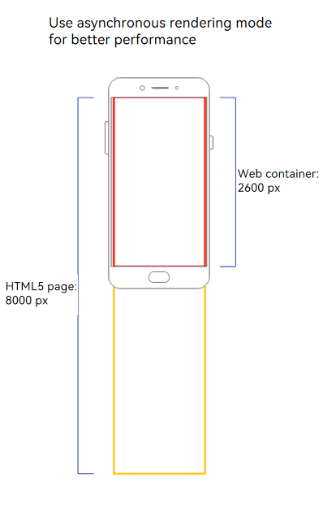
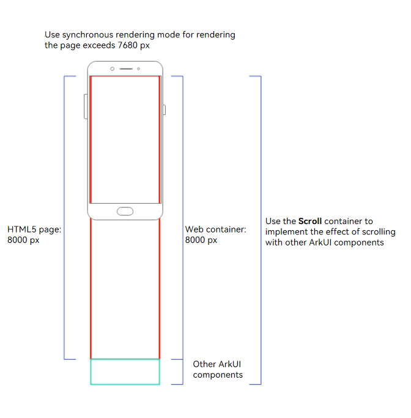

# Rendering Modes of the Web Component
<!--Kit: ArkWeb-->
<!--Subsystem: Web-->
<!--Owner: @pxlstrong-->
<!--Designer: @dzichou-->
<!--Tester: @ghiker-->
<!--Adviser: @HelloShuo-->
<!-- md-trans-meta sourceCommit=8b5408a78b1779be5394664afc53fc3cab8e1cce translatedAt=2026-09-21T02:29:25.960Z pushedAt=2026-09-21T14:00:09.191Z -->

The **Web** component provides two rendering modes, which can be adapted to different container sizes as required.

## Asynchronous Rendering Mode (Default)

In asynchronous rendering mode (renderMode: [RenderMode](../reference/apis-arkweb/arkts-basic-components-web-e.md#rendermode12).ASYNC_RENDER), the **Web** component is treated as a graphics surface node and is displayed independently. You are advised to use this mode on application pages that consist of only **Web** components to improve performance and reduce power consumption.

- The height of the **Web** component must not exceed 7,680 px (physical pixels); otherwise, a blank screen occurs.
- Dynamic mode switching is not supported.

As shown in Figure 1, if the Web component is intended to display the main content of an app page, its height is typically equal to or close to the screen height (for example, when embedded in Navigation). If the loaded H5 page is taller than the Web component, a scroll bar is displayed within the Web component, allowing users to swipe within the component to browse the H5 page. In this scenario, the Web component alone can be used to implement the main content of the app. Asynchronous rendering is recommended for better performance.

**Figure 1 Asynchronous rendering mode**



## Synchronous Rendering Mode

In synchronous rendering mode (renderMode: [RenderMode](../reference/apis-arkweb/arkts-basic-components-web-e.md#rendermode12).SYNC_RENDER), the **Web** component is treated as the graphics canvas node and is displayed together with the system component. In this case, longer **Web** component content can be rendered, but the performance consumption increases.

- DSS (Display Subsystem) composition is not supported.
- Dynamic mode switching is not supported.
- The maximum height of the **Web** component must not exceed 500,000 px (physical pixels).

If the Web component is intended to serve as a rich text container and form part of an app page, it can scroll together with other ArkUI components. As shown in Figure 2, the H5 page and the Web component have the same height. No scroll bar is generated within the Web component, which is displayed as an extra-long component. Scrolling within the app is handled by the [Scroll](../reference/apis-arkui/arkui-ts/ts-container-scroll.md) component, allowing users to smoothly browse both Web content and content from other ArkUI components. In this scenario, where the Web component forms part of the service content and needs to render an extra-long component without an internal scroll bar while working with other ArkUI components to lay out the page, synchronous rendering is recommended to support extra-long page rendering.

**Figure 2 Synchronous rendering mode**



## Sample Code

<!-- @[web_component_rendering_mode](https://gitcode.com/openharmony/applications_app_samples/blob/master/code/DocsSample/ArkWeb/WebRenderLayout/entry/src/main/ets/pages/RenderMode.ets) -->

``` TypeScript
import { webview } from '@kit.ArkWeb';

@Entry
@Component
struct WebHeightPage {
  private webviewController: WebviewController = new webview.WebviewController()

  build() {
    Column() {
      Web({
        src: 'www.example.com',
        controller: this.webviewController,
        renderMode: RenderMode.ASYNC_RENDER // Set the rendering mode.
      })
    }
  }
}
```

