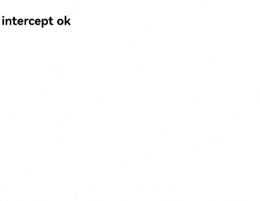
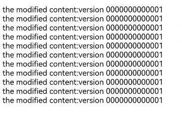

# Customizing Page Request Responses
<!--Kit: ArkWeb-->
<!--Subsystem: Web-->
<!--Owner: @aohui-->
<!--Designer: @yaomingliu-->
<!--Tester: @ghiker-->
<!--Adviser: @HelloCrease-->


The **Web** component supports customization of the response to intercepted page requests. You can call [onInterceptRequest()](../reference/apis-arkweb/arkts-basic-components-web-events.md#oninterceptrequest9) to customize web page responses, file resource responses, and more.  


When a resource loading request is initiated on a web page, the application layer will receive the request. The application layer then constructs a local resource response and sends it to the web kernel. On receiving the response, the web kernel parses the response and loads page resources accordingly.


In the following example, the **Web** component intercepts the web page request **https://www.example.com/test.html** and constructs a custom response in the application code.


- Code of the **index.html** page:

  ```html
  <!DOCTYPE html>
  <html>
  <head>
      <meta charset="utf-8">
  </head>
  <body>
  <!-- Page resource request -->
  <a href="https://www.example.com/test.html">intercept test!</a>
  </body>
  </html>
  ```

- Application code:

  ```ts
  // xxx.ets
  import { webview } from '@kit.ArkWeb';

  @Entry
  @Component
  struct WebComponent {
    controller: webview.WebviewController = new webview.WebviewController();
    responseResource: WebResourceResponse = new WebResourceResponse();
    // Customize a response.
    @State webData: string = '<!DOCTYPE html>\n' +
      '<html>\n' +
      '<head>\n' +
      '<title>intercept test</title>\n' +
      '</head>\n' +
      '<body>\n' +
      '<h1>intercept ok</h1>\n' +
      '</body>\n' +
      '</html>'

    build() {
      Column() {
        Web({ src: $rawfile('index.html'), controller: this.controller })
          .onInterceptRequest((event) => {
            if (event) {
              console.info('url:' + event.request.getRequestUrl());
              // Intercept the web page request.
              if (event.request.getRequestUrl() !== 'https://www.example.com/test.html') {
                return null;
              }
            }
            // Construct a custom response.
            this.responseResource.setResponseData(this.webData);
            this.responseResource.setResponseEncoding('utf-8');
            this.responseResource.setResponseMimeType('text/html');
            this.responseResource.setResponseCode(200);
            this.responseResource.setReasonMessage('OK');
            return this.responseResource;
          })
      }
    }
  }
  ```

- Page after being intercepted

  

Create a **CodeCache** object for a custom JS request response: If the resource of a custom request response is a JavaScript script, you can add the **ResponseDataID** field to the response header. After obtaining this field, the **Web** kernel generates a **CodeCache** object, which accelerates JavaScript execution. If **ResponseData** is updated, the **ResponseDataID** field must be updated. If the **ResponseDataID** field is not added, no **CodeCache** object is created by default.

In the following example, the **Web** component intercepts the web page request **https://www.example.com/test.js**; a custom response is constructed in the application code, with the **ResponseDataID** field added to the response header.

- Code of the **index.html** page:

  ```html
  <!DOCTYPE html>
  <html>
  <head>
      <meta charset="utf-8">
  </head>
  <body>
  
  <div id="div-1">this is a test div</div>
  <div id="div-2">this is a test div</div>
  <div id="div-3">this is a test div</div>
  <div id="div-4">this is a test div</div>
  <div id="div-5">this is a test div</div>
  <div id="div-6">this is a test div</div>
  <div id="div-7">this is a test div</div>
  <div id="div-8">this is a test div</div>
  <div id="div-9">this is a test div</div>
  <div id="div-10">this is a test div</div>
  <div id="div-11">this is a test div</div>
  
  <script src="https://www.example.com/test.js"></script>
  </body>
  </html>
  ```

- Application code:

  ```ts
  // xxx.ets
  import { webview } from '@kit.ArkWeb';

  @Entry
  @Component
  struct WebComponent {
    controller: webview.WebviewController = new webview.WebviewController();
    responseResource: WebResourceResponse = new WebResourceResponse();
    // Customize response data. (The CodeCache object is created only when the response data length is greater than or equal to 1024 bytes.)
    @State jsData: string = 'let text_msg = "the modified content:version 0000000000001";\n' +
      'let element1 = window.document.getElementById("div-1");\n' +
      'let element2 = window.document.getElementById("div-2");\n' +
      'let element3 = window.document.getElementById("div-3");\n' +
      'let element4 = window.document.getElementById("div-4");\n' +
      'let element5 = window.document.getElementById("div-5");\n' +
      'let element6 = window.document.getElementById("div-6");\n' +
      'let element7 = window.document.getElementById("div-7");\n' +
      'let element8 = window.document.getElementById("div-8");\n' +
      'let element9 = window.document.getElementById("div-9");\n' +
      'let element10 = window.document.getElementById("div-10");\n' +
      'let element11 = window.document.getElementById("div-11");\n' +
      'element1.innerHTML = text_msg;\n' +
      'element2.innerHTML = text_msg;\n' +
      'element3.innerHTML = text_msg;\n' +
      'element4.innerHTML = text_msg;\n' +
      'element5.innerHTML = text_msg;\n' +
      'element6.innerHTML = text_msg;\n' +
      'element7.innerHTML = text_msg;\n' +
      'element8.innerHTML = text_msg;\n' +
      'element9.innerHTML = text_msg;\n' +
      'element10.innerHTML = text_msg;\n' +
      'element11.innerHTML = text_msg;\n';

    build() {
      Column() {
        Web({ src: $rawfile('index.html'), controller: this.controller })
          .onInterceptRequest((event) => {
            // Intercept the web page request.
            if (event?.request.getRequestUrl() == 'https://www.example.com/test.js') {
              // Construct a custom response.
              this.responseResource.setResponseHeader([
                {
                  // The value is a string of a maximum of 13 digits. It is a JavaScript identifier and must be updated to maintain consistency with JavaScript.
                  headerKey: "ResponseDataID",
                  headerValue: "0000000000001"
                }]);
              this.responseResource.setResponseData(this.jsData);
              this.responseResource.setResponseEncoding('utf-8');
              this.responseResource.setResponseMimeType('application/javascript');
              this.responseResource.setResponseCode(200);
              this.responseResource.setReasonMessage('OK');
              return this.responseResource;
            }
            return null;
          })
      }
    }
  }
  ```

- Page after being intercepted

  
