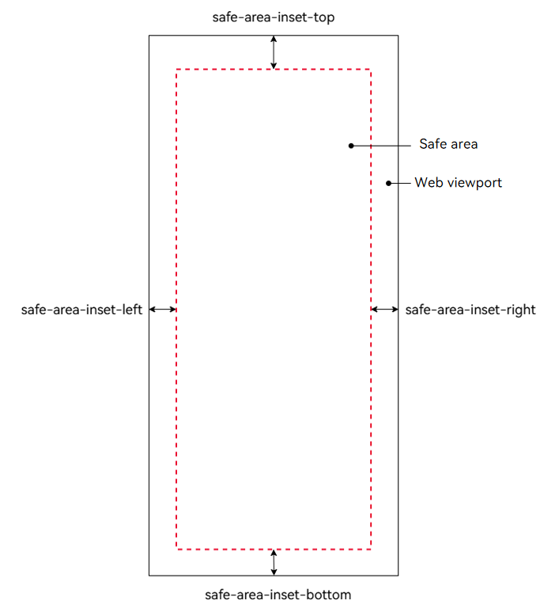
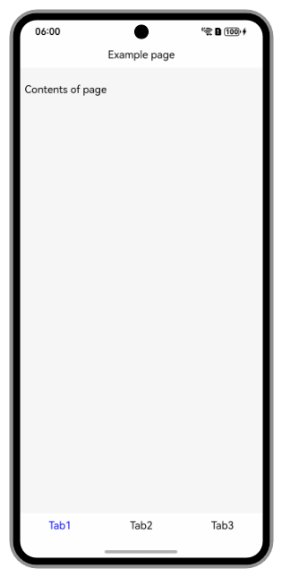

# Calculating and Adjusting Safe Area Insets

In earlier versions, the screen of most devices is rectangular, and the application UI can be completely displayed. With the popularization of irregular screens such as bezel-less screen and notch screen, rounded corners, cameras, or system navigation bars may appear on the edge of the screen. As a result, some parts of the screen are obscured.

A safe area is a region on the screen that is not obscured by device hardware or system UI elements. It is demarcated from non-safe areas, such as the status bar, notch area, and navigation bar. By default, the application layout is restricted to the safe area. However, the system provides the immersive layout capability, allowing the application to extend the UI to the non-safe area through configuration.

In an immersive experience, web page elements in a **Web** component may be obscured by the status bar, notch area, and navigation bar. In this case, you need to perform avoidance adaptation to ensure that key content, such as text, forms, and interactive components, on the web page avoids non-safe areas. This ensures that users can read and operate without obstruction.

The **Web** component provides the W3C CSS capability for calculating and adjusting safe area insets. By utilizing this capability to avoid obstructions, you can display web pages properly on devices with irregular screens in immersive mode.

## Enabling the Immersive Mode for the Web Component

**Web** components are displayed in the safe area by default. After the immersive mode is enabled, the web page is extended to the status bar and navigation bar to maximize the visible area of the screen, enhance visual continuity, and improve user experience. You can enable the immersive mode of **Web** components in the following ways:

- Use [setWindowLayoutFullScreen](../reference/apis-arkui/arkts-apis-window-Window.md#setwindowlayoutfullscreen9) to set the application window to full screen. When the window is displayed in full screen, the **Web** component can be displayed in non-safe areas.

  ```ts
  // EntryAbility.ets
  import { UIAbility } from '@kit.AbilityKit';
  import { window } from '@kit.ArkUI';

  export default class EntryAbility extends UIAbility {
    // ...
    onWindowStageCreate(windowStage: window.WindowStage): void {
      windowStage.getMainWindow().then(window => {
        // Set the window to full screen.
        window.setWindowLayoutFullScreen(true);
      });
    }
  }
  ```

  ```ts
  // xxx.ets
  import { webview } from '@kit.ArkWeb';

  @Entry
  @Component
  struct WebComponent {
    controller: webview.WebviewController = new webview.WebviewController();

    build() {
      Column() {
        Web({ src: 'www.example.com', controller: this.controller })
          .width('100%').height('100%')
      }
    }
  }
  ```

- Use [expandSafeArea](../reference/apis-arkui/arkui-ts/ts-universal-attributes-expand-safe-area.md) to expand the safe area for **Web** components. You can customize the expansion type and direction. In the following example, the **Web** component can be expanded to the status bar and navigation bar to achieve an immersive effect.

  ```ts
  // xxx.ets
  import { webview } from '@kit.ArkWeb';

  @Entry
  @Component
  struct WebComponent {
    controller: webview.WebviewController = new webview.WebviewController();

    build() {
      Column() {
        Web({ src: 'www.example.com', controller: this.controller })
          .width('100%').height('100%')
          // Expand the component to the default non-safe areas (status bar and navigation bar) and set that only the upper and lower areas are expanded.
          .expandSafeArea([SafeAreaType.SYSTEM], [SafeAreaEdge.TOP, SafeAreaEdge.BOTTOM])
      }
    }
  }
  ```

## Setting the Web Page Layout in a Viewport

Use **viewport-fit**, which is an attribute of the **\<meta name="viewport">** tag, to set the layout of a web page in a viewport as follows:

```html
<meta name='viewport' content='viewport-fit=cover'>
```

As shown in Table 1, the default value of **viewport-fit** is **auto**, which has the same effect as **contain**, indicating that all web page content is displayed within the safe area. **cover** indicates that the web page content completely covers the visible window and may overlap with the non-safe area.

**Table 1** Values of viewport-fit

| Value| Description| Scenario|
| - | - | - |
| auto | Default value, which has the same effect as **contain**.| Common web pages that do not require special adaptation.|
| contain | Restricts web page content within the safe area, and does not overlap with the non-safe area.| Web pages that need to be completely displayed.|
| cover | Covers the viewport completely and may overlap the non-safe area.| Web pages that need to render the maximum viewport and require avoidance adaptation.|

> **NOTE**
> 
> Currently, the **Web** component does not support the feature of restricting the web page content to the safe area when the immersive mode is enabled. Therefore, the value **contain** of **viewport-fit** has the same effect as **cover**, that is, the web page content completely fills the **Web** component area.

## Avoidance Adaptation of Web Page Elements

**safe-area-inset-*** is a group of CSS environment variables, which define the distance between the safe area and the edge of the viewport, that is, the distance needs to be avoided in the top, right, bottom, and left directions when the web page content needs to be completely displayed, as shown in the following figure. Unlike other CSS attributes, the attribute name of an environment variable is case sensitive.

**Figure 1** safe-area-inset-*



When **viewport-fit=cover** is set, the ArkWeb kernel continuously monitors the locations and sizes of **Web** components and system non-safe areas. It calculates the specific distances that need to be avoided in the four directions based on the overlapping parts and sets these distances to the environment variables **safe-area-inset-***. On a rectangular display (such as the screen of a regular PC/2-in-1 device), these values are zero. On a non-rectangular display (such as a circular watch face or a mobile device screen), an inner rectangular area defined by **safe-area-inset-*** is a safe area. Web page content is completely displayed in the safe area, to avoid being cropped by the non-rectangular display area.

The avoidance adaptation of web page elements depends on the CSS function **env()**, which is used to obtain the environment variables provided by the browser or system. You can use the **env()** function to obtain the value of **safe-area-inset-***. Through CSS **env(safe-area-inset-*)**, you can define the distance to be avoided on a web page to implement cross-device avoidance, without the need to pay attention to the location and size of the non-safe areas. The syntax is as follows:

```
/* Avoidance values in the top, right, bottom, and left directions. */
env(safe-area-inset-top);
env(safe-area-inset-right);
env(safe-area-inset-bottom);
env(safe-area-inset-left);

/* Set the avoidance value based on fallback. The second parameter indicates the fallback value when the environment variable does not exist. */
/* For details about the length unit, see https://developer.mozilla.org/en-US/docs/Web/CSS/length. */.
env(safe-area-inset-top, 20px);
env(safe-area-inset-right, 1em);
env(safe-area-inset-bottom, 0.5vh);
env(safe-area-inset-left, 1.4rem);

/* env() can be calculated based on some mathematical calculation functions `calc()`,`min()`,`max()`. */
calc(env(safe-area-inset-top) + 10px)
min(env(safe-area-inset-left), 50px)
max(env(safe-area-inset-bottom), 30px)
```

> **NOTE**
>
> When **env(safe-area-inset-*)** is used for avoidance, set **viewport-fit** to **cover**. When **viewport-fit** is set to **contain**, the value of **env(safe-area-inset-*)** is 0.

## Best Practices

When the immersive mode is enabled for the **Web** component, the rendered content may overlap with the non-safe area, affecting user browsing and interaction, as shown in Figure 2. Non-safe areas include the top status bar, notch area and bottom navigation bar. In the immersive mode, the title bar of the **index.html** web page is obscured by the notch area, and the bottom tab area overlaps the navigation bar.

**Figure 2** Web page elements obscured by non-safe areas when the immersive mode is enabled


```html
<!-- index.html -->
<!DOCTYPE html>
<html lang="en">
<head>
    <meta charset="UTF-8">
    <meta name="viewport" content="width=device-width, initial-scale=1.0, viewport-fit=cover">
    <style>
        body {
            margin: 0;
            background: #f6f6f6;
        }
        .edge {
            position: fixed;
            display: flex;
            width: 100%;
            background: #fefefe;
        }
        .title-bar {
            align-items: center;
            justify-content: center;
            top: 0;
            height: 40px;
        }
        .content {
            margin: 8px;
            padding-top: 40px;
        }
        .tabs {
            justify-content: space-around;
            bottom: 0;
            height: 40px;
        }
        .tab {
            padding: 10px;
        }
        .tab.active {
            color: Blue;
        }
    </style>
</head>
<body>
    <div>
        <div class="edge title-bar">Example page</div>
        <div class="content">
            <p>Contents of page</p>
        </div>
    </div>
    <div class="edge tabs">
        <div class="tab active">Tab1</div>
        <div class="tab">Tab2</div>
        <div class="tab">Tab3</div>
    </div>
</body>
</html>
```

You can use **env(safe-area-inset-*)** to define the CSS style, ensuring that texts, images, and interaction components avoid non-safe areas. In the following example, **env(safe-area-inset-*)** is used to update the CSS style of **index.html** so that the main content of the web page avoids the non-safe area, as shown in Figure 3.

```
.title-bar {
    align-items: center;
    justify-content: center;
    top: 0;
    height: 40px;
    padding-top: env(safe-area-inset-top); /* Set padding-top to avoid the upper non-safe area. */
}
.content {
    margin: 8px;
    padding-top: calc(env(safe-area-inset-top) + 40px); / * Set the title bar to increase the padding-top height. */
}
.tabs {
    justify-content: space-around;
    bottom: 0;
    height: calc(env(safe-area-inset-bottom) + 40px); /* Increase the height of the tab area to avoid the lower non-safe area. */
}
```

**Figure 3** Avoiding non-safe areas when the immersive mode is enabled


