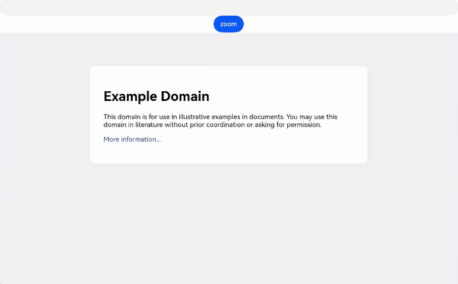
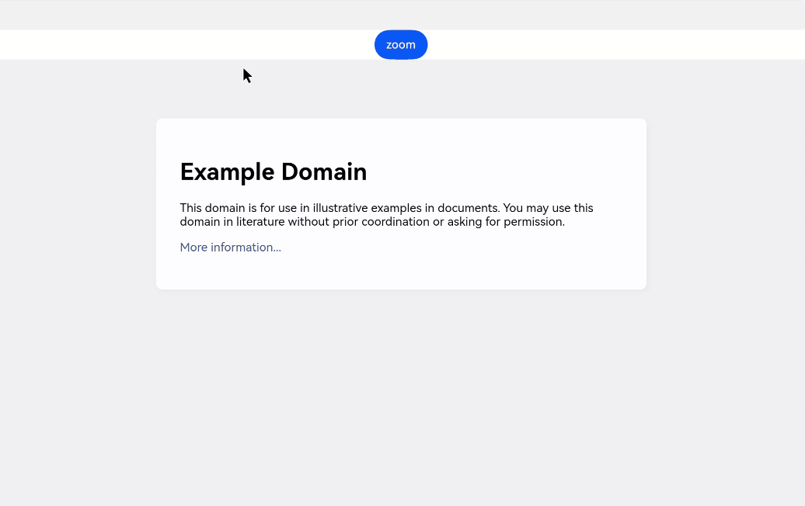

# Zooming Web Pages
<!--Kit: ArkWeb-->
<!--Subsystem: Web-->
<!--Owner: @zourongchun-->
<!--Designer: @zhufenghao-->
<!--Tester: @ghiker-->
<!--Adviser: @HelloShuo-->

ArkWeb supports gesture zoom, mouse wheel zoom, and keyboard zoom, allowing users to adjust the display to a comfortable size. It also provides the capability of listening for and controlling the page zoom scale for applications to achieve personalized visual effects.

## Setting Web Page Zoom

### Setting Gesture Zoom

You can use the [zoomAccess](../reference/apis-arkweb/arkts-basic-components-web-attributes.md#zoomaccess) attribute to set the web page zoom functionality. When this attribute is set to **false**, the web page cannot be zoomed in or out using gestures.

When `<meta name="viewport" id="viewport" content="user-scalable=no">` is set for the HTML web page, the web page cannot be zoomed in or out using gestures.

Gestures can be used to zoom in or out only when both the **zoomAccess** and **viewport** tags are set to allow zooming.

> **NOTE**
>
> On a PC or 2-in-1 device, the **viewport** tag does not take effect. You can only set **zoomAccess** to **false** to disable gesture zoom.
> 
> The preceding tags can only be used to enable or disable the zoom functionality. If **minimum-scale** and **maximum-scale** are set in the **viewport** tag, the zoom range is also restricted by the two attributes. When the maximum and minimum values are the same, the web page cannot be zoomed in or out. Currently, ArkWeb does not provide the capability of forcibly zooming in or out a page.
>
> In addition, the zoom-out scale is limited by the width of the web page.

<!-- @[ControlWebGestureZooming](https://gitcode.com/openharmony/applications_app_samples/blob/master/code/DocsSample/ArkWeb/WebManagementZooming/entry/src/main/ets/pages/ControlWebGestureZooming.ets) -->

``` TypeScript
import { webview } from '@kit.ArkWeb';

@Entry
@Component
struct WebComponent {
  controller: webview.WebviewController = new webview.WebviewController();

  build() {
    Column() {
      Web({ src: 'www.example.com', controller: this.controller })
        .zoomAccess(false)
    }
  }
}
```

### Setting Keyboard and Mouse Wheel Zoom

By default, ArkWeb supports zooming by pressing the **Ctrl**+**'-'/'+'** keys or using the mouse wheel with the **Ctrl** key. An application can intercept keyboard events to disable keyboard zoom. Currently, the application cannot disable mouse wheel zoom.

Example of intercepting keyboard events to disable keyboard zoom:

<!-- @[ControlMouseAndKeyBoardZooming](https://gitcode.com/openharmony/applications_app_samples/blob/master/code/DocsSample/ArkWeb/WebManagementZooming/entry/src/main/ets/pages/ControlMouseAndKeyBoardZooming.ets) -->

``` TypeScript
import { webview } from '@kit.ArkWeb';
import { KeyCode } from '@kit.InputKit';

@Entry
@Component
struct WebComponent {
  controller: webview.WebviewController = new webview.WebviewController();

  build() {
    Column() {
      Web({ src: 'www.example.com', controller: this.controller })
        .zoomAccess(true)
        .onKeyPreIme((event) => {
          if (event.type === KeyType.Down &&
          event.getModifierKeyState &&
          event.getModifierKeyState(['Ctrl']) &&
            (event.keyCode === KeyCode.KEYCODE_MINUS || event.keyCode === KeyCode.KEYCODE_EQUALS ||
              event.keyCode === KeyCode.KEYCODE_NUMPAD_SUBTRACT || event.keyCode === KeyCode.KEYCODE_NUMPAD_ADD)) {
            return true;
          }
          return false;
        })
    }
  }
}
```

You can also use the [zoomControlAccess](../reference/apis-arkweb/arkts-basic-components-web-attributes.md#zoomcontrolaccess22) attribute to set whether to allow zooming by using the combination keys (**Ctrl** + '**-**/**+**' or **Ctrl** + mouse wheel/touchpad).

```ts
// xxx.ets
import { webview } from '@kit.ArkWeb';

@Entry
@Component
struct WebComponent {
  controller: webview.WebviewController = new webview.WebviewController();

  build() {
    Column() {
      Web({ src: 'www.example.com', controller: this.controller })
        .zoomControlAccess(false)
    }
  }
}
```

## Listening for Page Zoom Scale Changes

The application can listen for page zoom scale changes through the [onScaleChange](../reference/apis-arkweb/arkts-basic-components-web-events.md#onscalechange9) API.
This API event corresponds to the gesture event (zoom with two fingers). **event.newScale** corresponds to the web page attribute **visualViewport.scale**.

<!-- @[MonitorZoomRatio](https://gitcode.com/openharmony/applications_app_samples/blob/master/code/DocsSample/ArkWeb/WebManagementZooming/entry/src/main/ets/pages/MonitorZoomRatio.ets) -->

``` TypeScript
import { webview } from '@kit.ArkWeb';
import hilog from '@ohos.hilog';
const TAG = '[Sample_WebManagementZooming]';
const DOMAIN = 0xF811;
const BUNDLE = 'WebManagementZooming_';
@Entry
@Component
struct WebComponent {
  controller: webview.WebviewController = new webview.WebviewController();

  build() {
    Column() {
      Web({ src: 'www.example.com', controller: this.controller })
        .onScaleChange((event) => {
          hilog.info(DOMAIN, TAG, BUNDLE, 'onScaleChange changed from ' + event.oldScale + ' to ' + event.newScale);
        })
    }
  }
}
```

## Controlling Page Zoom Scale

You can use the [initialScale](../reference/apis-arkweb/arkts-basic-components-web-attributes.md#initialscale9) attribute to set the initial page zoom scale.

You can call the [zoom](../reference/apis-arkweb/arkts-apis-webview-WebviewController.md#zoom), [zoomIn](../reference/apis-arkweb/arkts-apis-webview-WebviewController.md#zoomin) and [zoomOut](../reference/apis-arkweb/arkts-apis-webview-WebviewController.md#zoomout) APIs to control the page zoom scale.

 > **NOTE**
 >
 > When the preceding APIs are used to control page zooming, you must set **zoomAccess** to **true**. Otherwise, the **zoom** class APIs throw exception 17100004.

### Zooming at Fixed Scale

You can use **zoomIn** to zoom in the current web page by 25% or **zoomOut** to zoom out the current web page by 20%.

<!-- @[ControlZoomByFixedRatio](https://gitcode.com/openharmony/applications_app_samples/blob/master/code/DocsSample/ArkWeb/WebManagementZooming/entry/src/main/ets/pages/ControlZoomByFixedRatio.ets) -->

``` TypeScript
import { webview } from '@kit.ArkWeb';
import { BusinessError } from '@kit.BasicServicesKit';
import hilog from '@ohos.hilog';
const TAG = '[Sample_WebManagementZooming]';
const DOMAIN = 0xF811;
const BUNDLE = 'WebManagementZooming_';
@Entry
@Component
struct WebComponent {
  controller: webview.WebviewController = new webview.WebviewController();
  build() {
    Column() {
      Button('zoomIn')
        .onClick(() => {
          try {
            this.controller.zoomIn();
          } catch (error) {
            hilog.error(DOMAIN, TAG, BUNDLE, `ErrorCode: ${(error as BusinessError).code},  Message: ${(error as BusinessError).message}`);
          }
        })
      Button('zoomOut')
        .onClick(() => {
          try {
            this.controller.zoomOut();
          } catch (error) {
            hilog.error(DOMAIN, TAG, BUNDLE, `ErrorCode: ${(error as BusinessError).code},  Message: ${(error as BusinessError).message}`);
          }
        })
      Web({ src: 'www.example.com', controller: this.controller })
        .zoomAccess(true)
    }
  }
}
```

### Controlling Zoom Scale Based on Input Values

You can use **zoom** to zoom in or out on the current web page. When the input parameter is set to **1**, the default page size is used. When the input parameter is set to a value less than 1, the page is zoomed out. When the input parameter is set to a value greater than 1, the page is zoomed in. The value must be greater than 0.

<!-- @[ControlZoomByInput](https://gitcode.com/openharmony/applications_app_samples/blob/master/code/DocsSample/ArkWeb/WebManagementZooming/entry/src/main/ets/pages/ControlZoomByInput.ets) -->

``` TypeScript
import { webview } from '@kit.ArkWeb';
import { BusinessError } from '@kit.BasicServicesKit';
import hilog from '@ohos.hilog';
const TAG = '[Sample_WebManagementZooming]';
const DOMAIN = 0xF811;
const BUNDLE = 'WebManagementZooming_';
@Entry
@Component
struct WebComponent {
  controller: webview.WebviewController = new webview.WebviewController();
  @State factor: number = 1;

  build() {
    Column() {
      TextInput()
        .type(InputType.NUMBER_DECIMAL)
        .onChange((value)=>{
          this.factor = Number(value);
        })
      Button('zoom')
        .onClick(() => {
          try {
            this.controller.zoom(this.factor);
          } catch (error) {
            hilog.error(DOMAIN, TAG, BUNDLE, `ErrorCode: ${(error as BusinessError).code},  Message: ${(error as BusinessError).message}`);
          }
        })
      Web({ src: 'www.example.com', controller: this.controller })
        .zoomAccess(true)
    }
  }
}
```


### Zooming to Target Scale

You can call the **onScaleChange** API to obtain the current page zoom scale, and then call the **zoom** API to zoom in or out the page to the specified scale. You can calculate the input parameter of **zoom** based on **pageFactor** and **targetFactor** as follows:

```
factor = 100 * targetFactor / pageFactor
```

<!-- @[ControlZoomToFixedRatio](https://gitcode.com/openharmony/applications_app_samples/blob/master/code/DocsSample/ArkWeb/WebManagementZooming/entry/src/main/ets/pages/ControlZoomToFixedRatio.ets) -->

``` TypeScript
import { webview } from '@kit.ArkWeb';
import { BusinessError } from '@kit.BasicServicesKit';
import hilog from '@ohos.hilog';
const TAG = '[Sample_WebManagementZooming]';
const DOMAIN = 0xF811;
const BUNDLE = 'WebManagementZooming_';
@Entry
@Component
struct WebComponent {
  controller: webview.WebviewController = new webview.WebviewController();
  @State targetFactor: number = 1;
  // This represents the page zoom level
  @State pageFactor: number = 100;
  // Represents the integer 100
  intNumber: number = 100;

  build() {
    Column() {
      TextInput()
        .type(InputType.NUMBER_DECIMAL)
        .onChange((value)=>{
          this.targetFactor = Number(value);
        })
      Button('zoom')
        .onClick(() => {
          try {
            let factor = this.targetFactor * this.intNumber / this.pageFactor;
            this.controller.zoom(factor);
          } catch (error) {
            hilog.error(DOMAIN, TAG, BUNDLE, `ErrorCode: ${(error as BusinessError).code},  Message: ${(error as BusinessError).message}`);
          }
        })
      Web({ src: 'www.example.com', controller: this.controller })
        .zoomAccess(true)
        .onScaleChange((event) => {
          hilog.error(DOMAIN, TAG, BUNDLE, 'onScaleChange changed from ' + event.oldScale + ' to ' + event.newScale);
          this.pageFactor = event.newScale;
        })
    }
  }
}
```

