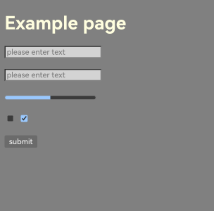
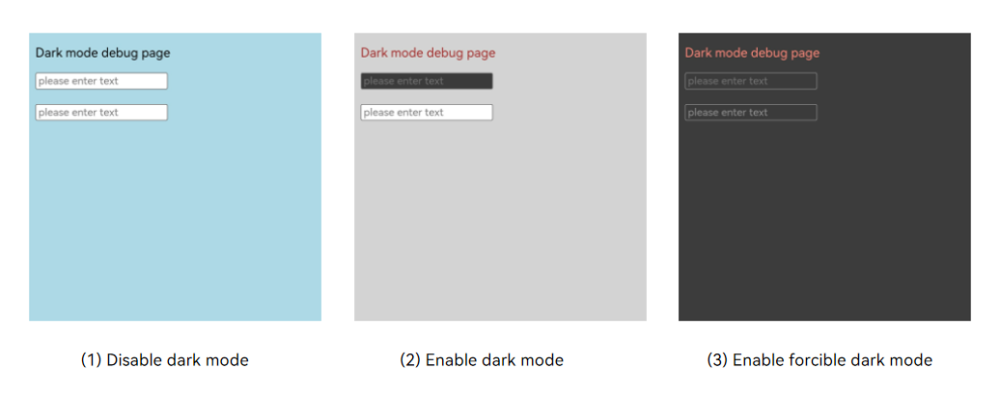

# Setting Dark Mode
<!--Kit: ArkWeb-->
<!--Subsystem: Web-->
<!--Owner: @KeeGitee-->
<!--Designer: @LongLie-->
<!--Tester: @ghiker-->
<!--Adviser: @HelloShuo-->

The system provides the light and dark theme modes for users. Dark mode reduces the screen brightness and visual stimulus in low-light environments, improving reading experience. The **Web** component is rendered based on the web page style. If the web page is not adapted to dark mode, it will be separated from the system theme. To ensure a consistent user experience, you need to consider users' theme preferences and adapt the web page to dark mode.

ArkWeb allows you to flexibly set dark mode for **Web** components without affecting the system. In addition, ArkWeb can enforce dark mode on different web pages to ensure compatibility with various system themes.

## Adapting Web Pages to Dark Mode
You can adapt web pages to dark mode using the **color-scheme** and **prefers-color-scheme** attributes.

- **color-scheme** is a CSS attribute that indicates the color scheme supported by a web page. It can affect the form, scroll bar, and CSS system color. The CSS system color refers to the built-in color of the **Web** component, which is the default color used when the style of some elements is not defined.

  When the dark color scheme is supported, the **Web** component applies dark mode to forms, scroll bars, and elements that use the CSS system color. If an element uses a custom color style, the custom color style is not affected by **color-scheme**.

  If **color-scheme** is not set, the default value is **normal**, indicating that no color scheme is specified. The default color scheme of the **Web** component is used, which is the same as that of **light**. Example:

  ```html
  /* Method 1: Use the meta tag for global settings */
  <meta name="color-scheme" content="light"> /* Only the light mode is supported */

  /* Method 2: Use style for global settings */
  :root {
    color-scheme: light dark; /* Light and dark modes are supported. The mode is switched based on the system. */
  }

  /* Method 3: Use style to set a specific element */
  div {
    color-scheme: light; /* Only the light mode is supported */
  }
  ```

  The following figure shows the rendering effect of the **color-scheme.html** page when dark mode is enabled and disabled. When dark mode is disabled, light color scheme is used for web pages, and a custom background style is used for **input2**. When dark mode is enabled, the web page uses dark color scheme, **input2** retains the custom style, and the colors of the web page background, font, form, progress bar, and buttons are automatically switched to the dark color.

  ```html
  <!-- color-scheme.html -->
  <!DOCTYPE html>
  <html>
  <head>
      <meta name="viewport" content="width=device-width, initial-scale=1.0, maximum-scale=1.0, user-scalable=no">
      <meta name="color-scheme" content="light dark">
  </head>
  <body>
    <h1>Example page</h1>
    <input name="input1" type="text" placeholder="please enter text">
    <br><br>
    <input name="input2" type="text" placeholder="please enter text" style="background-color: Lightgray;">
    <br><br>
    <progress value="50" max="100"></progress>
    <br><br>
    <input type="checkbox">
    <input type="checkbox" checked>
    <br><br>
    <button>submit</button>
  </body>
  </html>
  ```

  **Figure 1** Effect of color-scheme page

  

- **prefers-color-scheme** is a CSS media query feature that can detect the system theme color. You can use this feature to define different CSS styles for different system theme colors to adapt to users' theme preferences. Example:

  ```html
  <style>
    /* Default style */
    body { background-color: White; }

    /* Light style, which overwrites the default style when the dark style is disabled on the web page */
    @media (prefers-color-scheme: light) {
      body { background-color: Gray; }
    }

    /* Dark style, which overwrites the default style when the dark style is enabled on the web page */
    @media (prefers-color-scheme: dark) {
      body { background-color: Black; }
    }
  </style>
  ```

  You can use **color-scheme** to declare a web page color scheme and change the default style of web page elements. However, the application scope of **color-scheme** is limited. You can use **prefers-color-scheme** to define the dark style of web pages more flexibly. Moreover, **prefers-color-scheme** can be used together with **color-scheme**.

  For example, when the following style definition is added to **color-scheme.html** and the web dark mode is enabled, the web page uses the dark color scheme and the style defined in **@media (prefers-color-scheme: dark)**. Figure 2 shows the rendering effect.

  ```html
  <style>
    @media (prefers-color-scheme: dark) {
      body { background-color: Gray; color: LightYellow; }
      input { background-color: Lightgray; }
    }
  </style>
  ```

  **Figure 2** Effect of prefers-color-scheme

  


## Setting the Web Dark Mode

You can use the [darkMode()](../reference/apis-arkweb/arkts-basic-components-web-attributes.md#darkmode9) API to configure the web dark mode, which is disabled by default. [WebDarkMode.Auto](../reference/apis-arkweb/arkts-basic-components-web-e.md#webdarkmode9) can be set for applications to follow the system dark mode. You can also set [WebDarkMode.On](../reference/apis-arkweb/arkts-basic-components-web-e.md#webdarkmode9) or [WebDarkMode.Off](../reference/apis-arkweb/arkts-basic-components-web-e.md#webdarkmode9) to enable or disable dark mode.

If you set [WebDarkMode.On](../reference/apis-arkweb/arkts-basic-components-web-e.md#webdarkmode9) or [WebDarkMode.Auto](../reference/apis-arkweb/arkts-basic-components-web-e.md#webdarkmode9) and enable the system dark mode, the web page enters dark mode. When dark mode is enabled, the web page uses the dark style defined in **@media(prefers-color-scheme: dark)**. If the web page does not define a dark style, the original mode is retained.

To forcibly convert a web page that is not adapted to dark mode to the dark style, you can use the [forceDarkAccess()](../reference/apis-arkweb/arkts-basic-components-web-attributes.md#forcedarkaccess9) API. The forcible dark mode can overwrite the default style of the web page and convert the background and text colors of the web page to dark mode. The forcible dark mode cannot ensure that all color conversions meet the expectation.

In forcible dark mode, the high-brightness color value is converted to a color value suitable for a low-light environment, and the low-brightness color value remains unchanged. The specific color value conversion algorithm adheres to the Chromium kernel standard and is updated in tandem with the Chromium kernel. Color conversion applies only to elements that do not support dark color schemes. If the global declaration of a web page supports the dark color scheme, the color values of the entire web page will not be converted.

> **NOTE**
>
> If the dark style of an element is defined in **@media(prefers-color-scheme: dark)** but the dark color scheme is not declared by using **color-scheme**, the web page converts the color value based on the dark style, as shown in Table 1.

**Table 1** Relationship between dark mode, forcible dark mode, and color-scheme

| Dark Mode| Forcible Dark Mode| color-scheme | Expected Result|
| - | - | - | - |
| Disabled| No impact| - | The web page uses the color scheme supported by **color-scheme**.|
| Enabled| Disabled| - | The web page uses the color scheme supported by **color-scheme** and the style defined in **@media (prefers-color-scheme: dark)**.|
| Enabled| Enabled| Dark mode is supported| The web page uses the dark color scheme and the style defined in **@media (prefers-color-scheme: dark)**.|
| Enabled| Enabled| Dark mode is not supported| The web page converts the color value of the hight-brightness elements based on the algorithm. If a style is defined in **@media (prefers-color-scheme: dark)**, the color value is converted based on the defined style.|

The [forceDarkAccess()](../reference/apis-arkweb/arkts-basic-components-web-attributes.md#forcedarkaccess9) API takes effect only when the web dark mode is enabled. In the following example, the application sets the web dark mode to follow the system. When the system dark mode is enabled, the web page enters the forcible dark mode.

<!-- @[force_the_page_to_be_configured_to_dark_mode](https://gitcode.com/openharmony/applications_app_samples/blob/master/code/DocsSample/ArkWeb/SetBasicAttrsEvts/SetBasicAttrsEvtsOne/entry/src/main/ets/pages/DarkMode_two.ets) -->

``` TypeScript
import { webview } from '@kit.ArkWeb';

@Entry
@Component
struct WebComponent {
  controller: webview.WebviewController = new webview.WebviewController();
  @State mode: WebDarkMode = WebDarkMode.Auto;
  @State access: boolean = true;

  build() {
    Column() {
      Web({ src: $rawfile('darkModePage.html'), controller: this.controller })
        .darkMode(this.mode)
        .forceDarkAccess(this.access)
    }
  }
}
```

The code for the **darkModePage** page is as follows:

```html
<!-- darkModePage.html -->
<!DOCTYPE html>
<html>
<head>
    <meta name="viewport" content="width=device-width, initial-scale=1.0, maximum-scale=1.0, user-scalable=no">
    <style type="text/css">
        body { background: LightBlue; color: Black; }
        @media (prefers-color-scheme: dark) {
            body { background: LightGray; color: Brown; }
        }
    </style>
</head>
<body class="contentCss">
  <p>Dark mode debug page</p>
  <input name="input1" placeholder="please enter text" style="color-scheme: light dark;">
  <br><br>
  <input name="input2" placeholder="please enter text">
</body>
</html>
```

Figure 3 shows the style of the **darkModePage.html** page in three scenarios: dark mode disabled, dark mode enabled, and forcible dark mode enabled. When dark mode is disabled, the web page uses the default style. After dark mode is enabled, the color scheme of **input1** is switched to dark, and the gray background and brown text style defined in **@media (prefers-color-scheme: dark)** are used. When the forcible dark mode is enabled, the color scheme of **input1** is dark and is not converted by the web page. The web page background color, text color, and background color of **input2** are converted to those shown in (3) based on the color values in (2).

**Figure 3** Effects of the dark color mode and forcible dark color mode on the web page



## Adapting the Web Component Background Color to Dark Mode

When the **Web** component is rotated or its size changes, the web page size changes and the background color of the **Web** component may be displayed. In dark mode, you are advised to set the background color of the **Web** component to black to ensure a consistent experience with the web page background.

You can use [backgroundColor()](../reference/apis-arkui/arkui-ts/ts-universal-attributes-background.md#backgroundcolor) to set the background color of **Web** components. If no background color is set, the default background color white is used. In forcible dark mode, the default background color is black. If forcible dark mode is not enabled, you can use the following methods for adaptation.

- When [WebDarkMode.On](../reference/apis-arkweb/arkts-basic-components-web-e.md#webdarkmode9) and [WebDarkMode.Off](../reference/apis-arkweb/arkts-basic-components-web-e.md#webdarkmode9) are set on the application side to control dark mode, the background color of **Web** components changes accordingly.

  ```ts
  // xxx.ets
  import { webview } from '@kit.ArkWeb';

  @Entry
  @Component
  struct WebComponent {
    controller: webview.WebviewController = new webview.WebviewController();
    @State isDark: boolean = false;

    build() {
      Column() {
        Web({ src: $rawfile('darkModePage.html'), controller: this.controller })
          .darkMode(this.isDark ? WebDarkMode.On : WebDarkMode.Off)
          .backgroundColor(this.isDark ? Color.Black : Color.White)
      }
    }
  }
  ```

- When [WebDarkMode.Auto](../reference/apis-arkweb/arkts-basic-components-web-e.md#webdarkmode9) is set on the application side to follow the system dark mode, the background color of **Web** components changes with the system.

  ```ts
  // EntryAbility.ets
  export default class EntryAbility extends UIAbility {
    onCreate(want: Want, launchParam: AbilityConstant.LaunchParam): void {
      // Save the current colorMode to AppStorage.
      AppStorage.setOrCreate<ConfigurationConstant.ColorMode>('currentColorMode', this.context.config.colorMode);
      hilog.info(0x0000, 'testTag', '%{public}s', 'Ability onCreate');
    }

    // ...

    onConfigurationUpdate(newConfig: Configuration): void {
      // Dynamically update the color mode.
      const currentColorMode: ConfigurationConstant.ColorMode | undefined = AppStorage.get('currentColorMode');
      if (currentColorMode !== newConfig.colorMode) {
        AppStorage.setOrCreate<ConfigurationConstant.ColorMode>('currentColorMode', newConfig.colorMode);
      }
    }
  }
  ```

  ```ts
  // xxx.ets
  import { webview } from '@kit.ArkWeb';
  import { ConfigurationConstant } from '@kit.AbilityKit';

  @Entry
  @Component
  struct WebComponent {
    controller: webview.WebviewController = new webview.WebviewController();
    @State bgColor: Color = Color.White;
    @StorageProp('currentColorMode') @Watch('onCurrentColorModeChange')
    currentColorMode: ConfigurationConstant.ColorMode = ConfigurationConstant.ColorMode.COLOR_MODE_NOT_SET;

    build() {
      Column() {
        Web({ src: $rawfile('darkModePage.html'), controller: this.controller })
          .darkMode(WebDarkMode.Auto)
          .backgroundColor(this.bgColor)
      }
    }

    onCurrentColorModeChange(): void {
      // Switch the background color based on the system settings.
      if (this.currentColorMode === ConfigurationConstant.ColorMode.COLOR_MODE_DARK) {
        this.bgColor = Color.Black;
      } else {
        this.bgColor = Color.White;
      }
    }
  }
  ```


## FAQs

### What should I do if the web page is not switched to dark mode?

**Symptom**

The web page is not switched to dark mode.

**Solution**

There are multiple reasons for the switch failure. Perform the following steps to locate the fault:

1. Check whether dark mode is enabled on the web page. By default, [darkMode()](../reference/apis-arkweb/arkts-basic-components-web-attributes.md#darkmode9) is disabled. You need to explicitly declare [WebDarkMode.On](../reference/apis-arkweb/arkts-basic-components-web-e.md#webdarkmode9) or [WebDarkMode.Auto](../reference/apis-arkweb/arkts-basic-components-web-e.md#webdarkmode9) to enable dark mode.

2. If dark mode is enabled on the web page, check whether the dark style is defined for the web page.  If the dark style is not defined, the web page style remains unchanged even if dark mode is enabled on the web page. To enable forcible adaptation, use [forceDarkAccess()](../reference/apis-arkweb/arkts-basic-components-web-attributes.md#forcedarkaccess9) to enable the forcible dark mode.

3. If the forcible dark mode is enabled on the web page, check whether the web page supports the dark color scheme. If a web page supports the dark color scheme by using **color-scheme**, the color value will not be converted by the web page in forcible dark mode. In addition, color-scheme does not affect the custom color style of elements on the web page. Therefore, the web page is not switched to the dark style. In this case, you need to modify the dark mode configuration.

### What should I do if the web page style is abnormal after the forcible dark mode is enabled?

**Symptom**

When the forcible dark mode is enabled, the web page style conversion is abnormal. For example, the font is unclear, the style is not user-friendly, or the color is improper.

**Solution**

In forcible dark mode, the web page uses the Chromium color value conversion algorithm to automatically adjust the element color style. The layout and style of different web pages are different. The algorithm cannot ensure that all conversions meet the expectation. You are advised to customize the dark style.

### What should I do if the web page switches to a dark background when dark mode is not enabled?

**Symptom**

The dark mode is not enabled for the **Web** component, but the web page background becomes dark.

**Solution**

If no background color is set or the background color is set to transparent on the web page, the background color of the **Web** component is displayed. In this case, check whether [backgroundColor()](../reference/apis-arkui/arkui-ts/ts-universal-attributes-background.md#backgroundcolor) is set to a dark color for the **Web** component.
