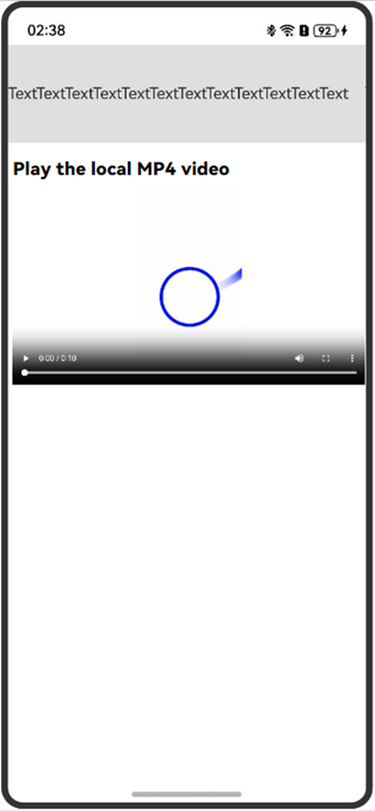
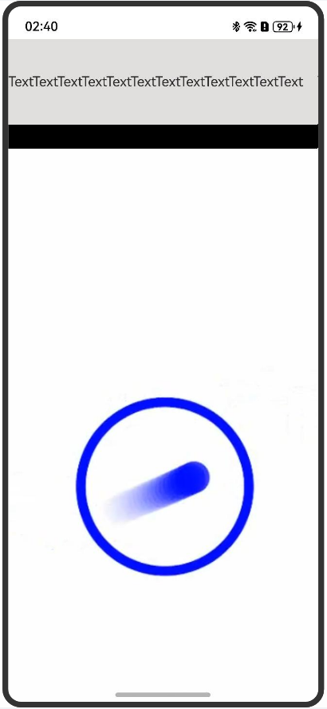
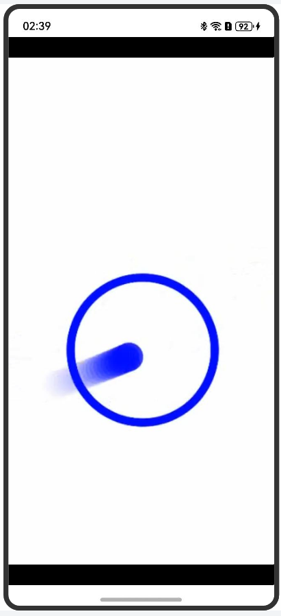

# Enabling Immersive Full-Screen Video Playback

<!--Kit: ArkWeb-->
<!--Subsystem: Web-->
<!--Owner: @zhangyao75477-->
<!--Designer: @gzweioh-->
<!--Tester: @ghiker-->
<!--Adviser: @HelloShuo-->
<!-- md-trans-meta sourceCommit=8ca7e424d5a57548a2c73f8e2ce0b0728333dffd translatedAt=2026-06-12T05:59:03.834Z pushedAt=2026-06-12T07:09:47.188Z -->

ArkWeb provides events for entering and exiting the full-screen mode. An application can listen for these events to enter and exit the immersive full-screen mode.

When a video loaded from a third-party HTML5 page referenced by the **Web** component is clicked for full-screen display, the video only expands to the entire **Web** component area and cannot achieve system-level full-screen display (as shown in Figure 2). To achieve the immersive video playback effect of system-level full-screen (as shown in Figure 3), the application needs to listen for the full-screen entry event and adjust the properties of other components on the UI.

| Figure 1 Exiting the full-screen mode| Figure 2 Non-immersive full-screen mode| Figure 3 Immersive full-screen mode|
| :--------------------------------------------: | :---------------------------------------------: | :---------------------------------------------: |
| |  |  |

The **Web** component can listen for the click event of the full-screen button through the [onFullScreenEnter](../reference/apis-arkweb/arkts-basic-components-web-events.md#onfullscreenenter9) and [onFullScreenExit](../reference/apis-arkweb/arkts-basic-components-web-events.md#onfullscreenexit9) callbacks. **onFullScreenEnter** indicates that the **Web** component enters full-screen mode, and **onFullScreenExit** indicates that the **Web** component exits full-screen mode. In these two listening events, you can adjust certain global variables based on specific service scenarios, such as the visibility status of components and the **margin** property of components, to achieve the UI effects of exiting and entering immersive full-screen mode, as shown in Figure 1 and Figure 3.

[Visibility](../reference/apis-arkui/arkui-ts/ts-universal-attributes-visibility.md#visibility) is a common component attribute provided by ArkUI. You can control the visibility status of a component by setting different values for the component's visibility attribute.

<!-- @[web_full_screen](https://gitcode.com/openharmony/applications_app_samples/blob/master/code/DocsSample/ArkWeb/ArkWebPictureInPicture/entry1/src/main/ets/pages/Index.ets) -->

``` TypeScript
import { webview } from '@kit.ArkWeb';

@Entry
@Component
struct ShortWebPage {
  controller: webview.WebviewController = new webview.WebviewController();
  CONSTANT_HEIGHT = 100;
  @State marginTop: number = this.CONSTANT_HEIGHT;
  @State isVisible: boolean = true; // Customize the isVisible flag to determine whether to display the component.

  build() {
    Column() {
      Text('TextTextTextText')
        .width('100%')
        .height(this.CONSTANT_HEIGHT)
        .backgroundColor('#e1dede') // When isVisible is set to true, the component is visible. Otherwise, the component is invisible, not involved in layout, and no placeholder is used for it.
        .visibility(this.isVisible ? Visibility.Visible :
          Visibility.None)
      Web({
        src: $rawfile('FullScreen.html'), // Example website.
        controller: this.controller
      })
        .onFullScreenEnter((event) => {
          console.info('onFullScreenEnter...');
          // When the full screen is displayed, the isVisible flag is false, the component is invisible, not involved in layout, and no placeholder is used for it.
          this.isVisible = false;
        })
        .onFullScreenExit(() => {
          console.info('onFullScreenExit...');
          // When the full screen is exited, the isVisible flag is true, and the component is visible.
          this.isVisible = true;
        })
        .width('100%')
        .height('100%')
        .zIndex(10)
        .zoomAccess(true)
    }.width('100%').height('100%')
  }
}
```