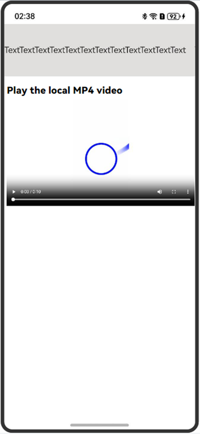
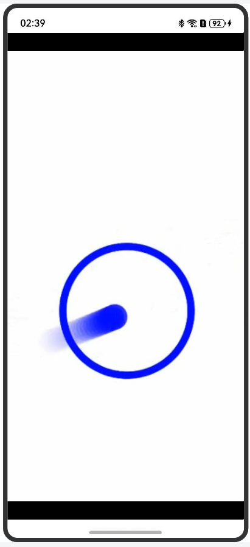

# Enabling Immersive Full-Screen Video Playback
<!--Kit: ArkWeb-->
<!--Subsystem: Web-->
<!--Owner: @GrowUpEveryday-->
<!--Designer: @qiu-gongkai-->
<!--Tester: @ghiker-->
<!--Adviser: @HelloShuo-->

ArkWeb provides events for entering and exiting the full-screen mode. An application can listen for these events to enter and exit the immersive full-screen mode.

When a **Web** component references a video loaded by a third-party HTML5 page and the video is displayed in full screen, the video is extended to the entire **Web** component area and cannot be displayed in full screen, as shown in Figure 2. To achieve the immersive full-screen video playback (as shown in Figure 3), an application needs to listen for the full-screen events and adjust the attributes of other components on the page.


| Figure 1 Exiting the full-screen mode| Figure 2 Non-immersive full-screen mode| Figure 3 Immersive full-screen mode|
| :--------------------------------------------: | :---------------------------------------------: | :---------------------------------------------: |
| |  |  |

The **Web** component can use [onFullScreenEnter](../reference/apis-arkweb/arkts-basic-components-web-events.md#onfullscreenenter9) and [onFullScreenExit](../reference/apis-arkweb/arkts-basic-components-web-events.md#onfullscreenexit9) to listen for full-screen button click events. **OnFullScreenEnter** indicates that the **Web** component enters the full-screen mode, and **onFullScreenExit** indicates that the **Web** component exits the full-screen mode. In these two events, you can adjust some global variables based on the specific service scenario, such as the display status and **margin** attribute of the component, to implement the page effect of exiting and entering the immersive full-screen mode, as shown in Figure 1 and Figure 3.

The [visibility](../reference/apis-arkui/arkui-ts/ts-universal-attributes-visibility.md) attribute is a common component attribute provided by ArkUI. You can control the visibility of a component by setting its **visibility** attribute.


```ts
import { webview } from '@kit.ArkWeb';

@Entry
@Component
struct ShortWebPage {
  controller: webview.WebviewController = new webview.WebviewController()
  CONSTANT_HEIGHT = 100;
  @State marginTop: number = this.CONSTANT_HEIGHT;
  @State isVisible: boolean = true; // Customize the isVisible flag to determine whether to display the component.

  build() {
    Column() {
      Text('TextTextTextText')
        .width('100%')
        .height(this.CONSTANT_HEIGHT)
        .backgroundColor('#e1dede') // When isVisible is set to true, the component is visible. Otherwise, the component is invisible, not involved in layout, and no placeholder is used for it.
        .visibility(this.isVisible ? Visibility.Visible :
        Visibility.None)
      Web({
        src: "http://www.example.com", // Example website
        controller: this.controller
      })
        .onFullScreenEnter((event) => {
          console.info("onFullScreenEnter...")
          // When the full screen is displayed, the isVisible flag is false, the component is invisible, not involved in layout, and no placeholder is used for it.
          this.isVisible = false;
        })
        .onFullScreenExit(() => {
          console.info("onFullScreenExit...")
          // When the full screen is exited, the isVisible flag is true, and the component is visible.
          this.isVisible = true;
        })
        .width('100%')
        .height("100%")
        .zIndex(10)
        .zoomAccess(true)
    }.width('100%').height('100%')
  }
}
```
