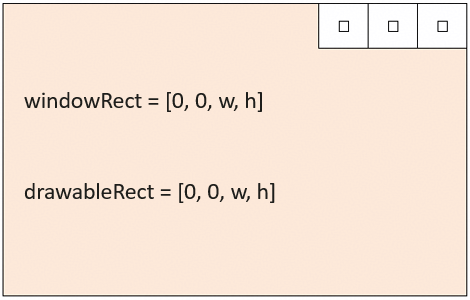
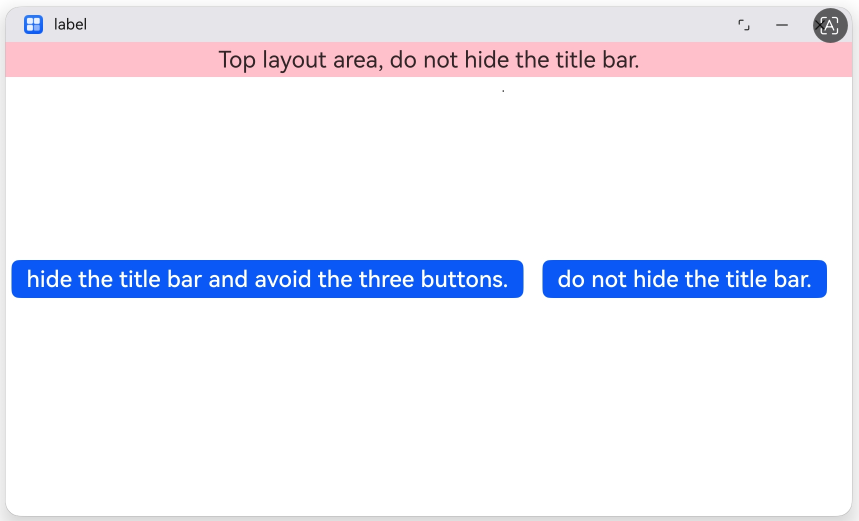
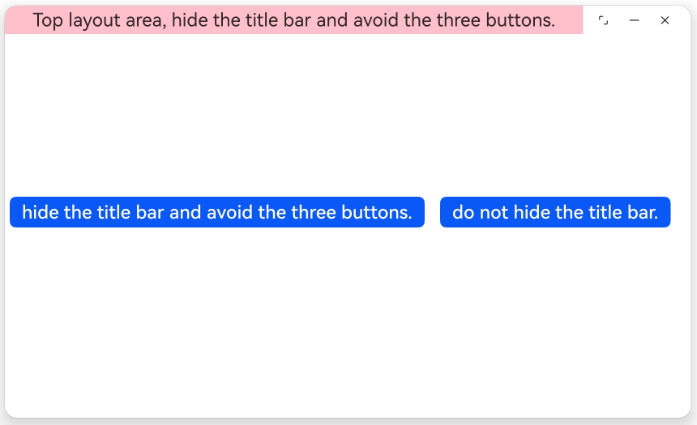

# App Adaptation for Freeform Windows

<!--Kit: ArkUI-->
<!--Subsystem: Window-->
<!--Owner: @hanxuebing1-->
<!--Designer: @chengyiyi-->
<!--Tester: @qinliwen0417-->
<!--Adviser: @ge-yafang-->
<!-- md-trans-meta sourceCommit=58ff40ad92758153f7b55166a9e6e0a0e9be5d28 translatedAt=2026-07-10T07:15:53.409Z pushedAt=2026-07-13T08:00:54.185Z -->

## When to Use

[Freeform windows](freeform-window-overview.md#freeform-window) support resizing by default, and the main window has a title bar by default, which differs from the non-freeform window state. To avoid issues such as UI truncation, occlusion, or control overlapping when the app is in the freeform window state, app adaptation is required.

This chapter lists possible layout issues that may occur in apps and provides corresponding solutions.

- If the app requires differentiated layouts in the freeform window state and non-freeform window state, it can [Querying whether the current window is in freeform window state](#querying-whether-the-current-window-is-in-freeform-window-state) via APIs.

- When the window is shrunk to an extreme, the app layout becomes disordered or content is truncated. This can be addressed by [restricting the freeform window size](#restricting-the-freeform-window-size) to avoid excessive scaling.

- The window size includes the title bar area and the drawable area within the window. If the app performs content layout by obtaining the window size, the title bar size must be considered. [Adjust the layout to avoid the title bar and window control buttons](#adjusting-the-layout-to-avoid-the-title-bar-and-window-control-buttons) to prevent the app layout from being squeezed downward by the title bar, causing content truncation.

- Video apps that cannot play videos in full-screen mode need to call an API to enable the [window to enter the full-screen display in freeform window state](#entering-full-screen-display-in-freeform-window-state).

## Querying Whether the Current Window Is in Freeform Window State

If the app requires differentiated layouts in freeform window state and non-freeform window state, it can query whether the current window is in freeform window state via an API.

| API | Function | Usage Scenario |
| -------- | -------- | -------- |
| [isInFreeWindowMode()](../reference/apis-arkui/arkts-apis-window-Window.md#isinfreewindowmode22) | Queries whether the current window is in freeform window state | Detects whether the window is in freeform window state, so that the layout or functions can be adjusted accordingly. |
| [on('freeWindowModeChange')](../reference/apis-arkui/arkts-apis-window-Window.md#onfreewindowmodechange22) | Enables listening for freeform window state change events | Notifies the app when the freeform window state changes, so that the layout or functions can be adjusted accordingly. |
| [off('freeWindowModeChange')](../reference/apis-arkui/arkts-apis-window-Window.md#offfreewindowmodechange22) | Disables listening for freeform window state change events | Disables listening for freeform window state change events before the app exits. |

## Restricting the Freeform Window Size

Adaptive layout can ensure that the page displays normally when the window size changes within a certain range. When the window size changes significantly, additional responsive layout capabilities (such as breakpoints) are needed to adjust the page structure to ensure normal display. Typically, each breakpoint requires careful adaptation by developers to achieve the best display effect. Considering practical constraints such as design and development costs, an app cannot adapt to all window widths from zero to infinity.

On different devices or under different device states, the adjustable range of the system's default freeform window size may vary. You can restrict the maximum and minimum size of the freeform window via the following three methods.

- Set the size restriction for the current app window via the [setWindowLimits(windowLimits: WindowLimits)](../reference/apis-arkui/arkts-apis-window-Window.md#setwindowlimits11) or [setWindowLimits(windowLimits: WindowLimits, isForcible: boolean)](../reference/apis-arkui/arkts-apis-window-Window.md#setwindowlimits15) API.  

  **maxWidth**: Maximum width of the window. The default unit is px.

  **maxHeight**: Maximum height of the window. The default unit is px.

  **minWidth**: Minimum width of the window. The default unit is px.

  **minHeight**: Minimum height of the window. The default unit is px.

  ```ts
  import { UIAbility } from '@kit.AbilityKit';
  import { window } from '@kit.ArkUI';
  export default class EntryAbility extends UIAbility {
    onWindowStageCreate(windowStage: window.WindowStage): void {
      windowStage.loadContent('pages/Index', (err) => {
        let windowClass = windowStage.getMainWindowSync();
        try {
          let windowLimits: window.WindowLimits = {
            maxWidth: 1500,
            maxHeight: 1000,
            minWidth: 600,
            minHeight: 500
          };
          let promise = windowClass.setWindowLimits(windowLimits);
          promise.then((data) => {
            console.info('Succeeded in changing the window limits. Cause:' + JSON.stringify(data));
          }).catch((err: BusinessError) => {
            console.error(`Failed to change the window limits. Cause code: ${err.code}, message: ${err.message}`);
          });
        } catch (exception) {
          console.error(`Failed to change the window limits. Cause code: ${exception.code}, message: ${exception.message}`);
        }
      });
    }
  }
  ```

- When an app uses the [startAbility()](../reference/apis-ability-kit/js-apis-inner-application-uiAbilityContext.md#startability-2) API to launch the main window, the main window size restriction can be specified via [StartOptions](../reference/apis-ability-kit/js-apis-app-ability-startOptions.md#startoptions).  

  **minWindowWidth**: The minimum width of the window, in vp.

  **minWindowHeight**: The minimum height of the window, in vp.

  **maxWindowWidth**: The maximum width of the window, in vp.

  **maxWindowHeight**: The maximum height of the window, in vp.

  ```ts
  // ets/entryability/EntryAbility.ets
  // Entry point of the sample application
  import { UIAbility } from '@kit.AbilityKit';
  import { window } from '@kit.ArkUI';
  export default class EntryAbility extends UIAbility {
    onWindowStageCreate(windowStage: window.WindowStage): void {
      windowStage.loadContent('pages/Index', (err) => {});
    }
  }
  ```

  ```ts
  // ets/pages/Index.ets
  // Main page of the sample application, used to create a button that calls the API to start the target Ability.
  import { common, StartOptions } from '@kit.AbilityKit';
  @Entry
  @Component
  struct Index {
    private context = this.getUIContext().getHostContext() as common.UIAbilityContext
    build() {
      Row() {
        Row() {
          Button('Start test window')
            .onClick(() => {
              // Define the want parameter of the target Ability
              let want: Want = {
                deviceId: '',
                bundleName: 'com.example.myapplication',
                moduleName: 'entry',
                abilityName: 'WindowTestAbility',
              }
              let options: StartOptions = {
                displayId: 0,
                minWindowWidth: 600,
                minWindowHeight: 500,
                maxWindowWidth: 1500,
                maxWindowHeight: 1000,
              };
              try {
                // Start the target Ability
                this.context.startAbility(want, options, (err: BusinessError) => {
                  if (err.code) {
                    // Handle business logic errors
                    console.error(`startAbility failed, code is ${err.code}, message is ${err.message}`);
                    return;
                  }
                  // Execute normal business logic
                  console.info('startAbility succeed');
                });
              } catch (err) {
                // Handle input parameter error exceptions.
                let code = (err as BusinessError).code;
                let message = (err as BusinessError).message;
                console.error(`startAbility failed, code is ${code}, message is ${message}`);
              }
            })
        }
      }
      .width('100%')
      .height('100%')
    }
  }
  ```

  ```ts
  // ets/windowtestability/WindowTestAbility.ets
  // Created UIAbility.
  import { window } from '@kit.ArkUI';
  import { UIAbility } from '@kit.AbilityKit';

  export default class WindowTestAbility extends UIAbility {
    onWindowStageCreate(windowStage: window.WindowStage): void {
      // Main window is created, set main page for this ability.
      windowStage.loadContent('pages/Index', (err) => {
        if (err.code) {
          console.info(`Failed to load the content. Cause: ${JSON.stringify(err)}`);
          return;
        }
        console.info('Succeeded in loading the content.');
      });
    }
  }
  ```

  ```json5
  // ets/module.json5
  // module.json5 configuration file, used to configure UIAbility attributes such as name and path.
  {
    "module": {
      "name": "entry",
      "type": "entry",
      "description": "$string:module_desc",
      "mainElement": "EntryAbility",
      "deviceTypes": [
        "phone",
        "tablet",
        "2in1"
      ],
      "deliveryWithInstall": true,
      "installationFree": false,
      "pages": "$profile:main_pages",
      "abilities": [
        {
          "name": "EntryAbility",
          "srcEntry": "./ets/entryability/EntryAbility.ets",
          "description": "$string:EntryAbility_desc",
          "icon": "$media:layered_image",
          "label": "$string:EntryAbility_label",
          "startWindowIcon": "$media:startIcon",
          "startWindowBackground": "$color:start_window_background",
          "exported": true,
          "skills": [
            {
              "entities": [
                "entity.system.home"
              ],
              "actions": [
                "ohos.want.action.home"
              ]
            }
          ]
        },
        {
          "name": "WindowTestAbility",
          "srcEntry": "./ets/windowtestability/WindowTestAbility.ets",
          "icon": "$media:layered_image",
          "startWindowIcon": "$media:startIcon",
          "startWindowBackground": "$color:start_window_background"
        }
      ],
      "extensionAbilities": [
        {
          "name": "EntryBackupAbility",
          "srcEntry": "./ets/entrybackupability/EntryBackupAbility.ets",
          "type": "backup",
          "exported": false,
          "metadata": [
            {
              "name": "ohos.extension.backup",
              "resource": "$profile:backup_config"
            }
          ],
        }
      ]
    }
  }
  ```

- The maximum and minimum size of the main window in freeform window state can be restricted via the [abilities tag](../quick-start/module-configuration-file.md#abilities) in the [module.json5 configuration file](../quick-start/module-configuration-file.md#tags-in-the-configuration-file).

  **maxWindowWidth**: The maximum window width supported by the current UIAbility component, in vp.

  **minWindowWidth**: The minimum window width supported by the current UIAbility component, in vp.

  **maxWindowHeight**: The maximum window height supported by the current UIAbility component, in vp.

  **minWindowHeight**: The minimum window height supported by the current UIAbility component, in vp.

  ```json5
  {
    // ...
      "abilities": [
        {
          "name": "EntryAbility",
          "srcEntry": "./ets/entryability/EntryAbility.ets",
          "launchType": "singleton",
          "description": "$string:description_main_ability",
          "icon": "$media:layered_image",
          "label": "$string:EntryAbility_label",
          "permissions": [],
          "metadata": [],
          "exported": true,
          "continuable": true,
          "skills": [
            {
              "actions": [
                "ohos.want.action.home"
              ],
              "entities": [
                "entity.system.home"
              ],
              "uris": []
            }
          ],
          "backgroundModes": [
            "dataTransfer"
          ],
          "startWindowIcon": "$media:icon",
          "startWindowBackground": "$color:red",
          "removeMissionAfterTerminate": true,
          "allowSelfRedirect": true,  // This label is supported from API version 23.
          "orientation": "$string:orientation",
          "supportWindowMode": [
            "fullscreen",
            "split",
            "floating"
          ],
          "maxWindowRatio": 3.5,
          "minWindowRatio": 0.5,
          "maxWindowWidth": 2560,
          "minWindowWidth": 1400,
          "maxWindowHeight": 300,
          "minWindowHeight": 200,
          "excludeFromMissions": false,
          "preferMultiWindowOrientation": "default",
          "isolationProcess": false,
          "continueType": [
            "continueType1",
            "continueType2"
          ],
          "continueBundleName": [
            "com.example.myapplication1",
            "com.example.myapplication2"
          ],
          "process": ":processTag"
        }
      ],
      // ...
  }
  ```

> **NOTE**
>
> - If you wish to configure different minimum values for different device types, this can be achieved via [multi-HAP projects](https://developer.huawei.com/consumer/en/doc/best-practices/bpta-modular-design#section1260019161216).
>
> - The final effective result of window size restrictions is obtained by taking the intersection of the default system restrictions, app configuration, and runtime settings. The priority from high to low is as follows:
>
>   1. The app sets the freeform window size restriction via [setWindowLimits()](../reference/apis-arkui/arkts-apis-window-Window.md#setwindowlimits11).
>
>   2. The app specifies the freeform window size restriction via [StartOptions](../reference/apis-ability-kit/js-apis-app-ability-startOptions.md#startoptions) when using the [startAbility()](../reference/apis-ability-kit/js-apis-inner-application-uiAbilityContext.md#startability-2) API to launch the main window.
>
>   3. The [abilities](../quick-start/module-configuration-file.md#abilities) in the [module.json5 configuration file](../quick-start/module-configuration-file.md#tags-in-the-configuration-file) is used to restrict the maximum and minimum size of the freeform window.
>
>   4. Default system restrictions (for different products and window types, the default system restrictions of **windowLimits** may vary).
>
> - In freeform window state, the main window can set the aspect ratio of the window content layout via [setAspectRatio(ratio: number)](../reference/apis-arkui/arkts-apis-window-Window.md#setaspectratio10). If [WindowLimits](../reference/apis-arkui/arkts-apis-window-i.md#windowlimits11) is set first and the subsequently set ratio conflicts with it, error code 401 will be returned. If the ratio is set first and the subsequently set [WindowLimits](../reference/apis-arkui/arkts-apis-window-i.md#windowlimits11) conflicts with it, the window's aspect ratio may not follow the set aspect ratio (ratio).

## Adjusting the Layout to Avoid the Title Bar and Window Control Buttons

In freeform window state, when the app dynamically lays out according to the window size, proper adaptation can ensure that page elements are displayed reasonably and can also resolve compatibility issues on different devices.

However, note that in freeform window state, the window size includes the title bar area and the drawable area within the window. When calculating the position of page elements relative to the window, it is necessary to consider avoiding the title bar.

**Title bar** refers to the app icon and title in the upper-left corner of the window, as well as the top area that is as wide as the window.

In the diagram, windowRect is the window size, with the type being [Rect](../reference/apis-arkui/arkts-apis-window-i.md#rect7); drawableRect is the drawable area size, with the type being [Rect](../reference/apis-arkui/arkts-apis-window-i.md#rect7); decorHeight is the title bar height, with the type being number and the unit being vp; density is the system display scaling factor of the screen where this window is located, with the type being number; w is the window width, with the type being number and the unit being px; h is the window height, with the type being number and the unit being px.


Typical scenarios and corresponding solutions are as follows:

If the bottom of the app page has function buttons with a fixed height, when calculating the position of the bottom function buttons, if only the window height minus the bottom function button height is used, the bottom function buttons will be offset downward by the height of the title bar, resulting in incomplete display.

There are three ways to solve the above problem:

- When the app performs layout based on the window size, the Y-axis coordinate of page elements must additionally subtract the title bar height. The title bar height can be obtained via the [getWindowDecorHeight()](../reference/apis-arkui/arkts-apis-window-Window.md#getwindowdecorheight11) API, and the unit is vp.

- Perform layout by obtaining the drawable area size within the window via the [getWindowProperties()](../reference/apis-arkui/arkts-apis-window-Window.md#getwindowproperties9) API.

- Hide the title bar via the [setWindowDecorVisible()](../reference/apis-arkui/arkts-apis-window-Window.md#setwindowdecorvisible11) API to implement an [immersive layout](immersive-window-feature.md#immersive-layout) for the freeform window.

**Window control buttons** refer to the three buttons in the upper right corner of the window: maximize/restore, minimize, and close.

If the app desires a larger drawable area within the window, it can hide the title bar and adapt to the position and size of the window control buttons.



Typical scenarios and corresponding solutions are as follows:

If an app draws a custom toolbar or tab bar at the top of the page alongside the window control buttons, it can be adapted by following these steps.

1. Hide the title bar via the [setWindowDecorVisible()](../reference/apis-arkui/arkts-apis-window-Window.md#setwindowdecorvisible11) API.

2. Obtain the position and size of the window control buttons via the [getTitleButtonRect()](../reference/apis-arkui/arkts-apis-window-Window.md#gettitlebuttonrect11) API or the [on('windowTitleButtonRectChange')](../reference/apis-arkui/arkts-apis-window-Window.md#onwindowtitlebuttonrectchange11) API, and exclude the area of the window control buttons when laying out the top elements of the page.

   ```ts
    // EntryAbility.ets
    // Entry of the sample app.
    import { UIAbility } from '@kit.AbilityKit';
    import { window } from '@kit.ArkUI';
    export default class EntryAbility extends UIAbility {
      onWindowStageCreate(windowStage: window.WindowStage): void {
        windowStage.loadContent('pages/Index', (err) => {
          if (err.code) {
            console.info('Failed to load the content. Cause: %{public}s', JSON.stringify(err));
            return;
          }
          AppStorage.setOrCreate<window.WindowStage>('windowStage', windowStage);
        });
      }
    }
   ```

   ```ts
    // Index.ets
    // Main page of the sample app.
    import { window } from '@kit.ArkUI';

    @Entry
    @Component
    struct Index {
      @State message: string = 'Top layout area, do not hide the title bar.';
      private mainWindow: window.Window | null = null;
      @State private topAreaHeight: number = 50;
      @State private topAreaWidth: number | string = '100%';
      @State private titleButtonRect: window.TitleButtonRect = {
        right: 0,
        top: 0,
        width: 0,
        height: 0
      };
      @State private windowSize: window.Size = { width: 0, height: 0 }

      aboutToAppear(): void {
        let windowStage = AppStorage.get<window.WindowStage>('windowStage');
        if (!windowStage) {
          return;
        }
        this.mainWindow = windowStage.getMainWindowSync();
        this.topAreaHeight = this.mainWindow.getWindowDecorHeight();
        this.mainWindow.on("windowSizeChange", (data) => {
          this.windowSize = data;
          this.topAreaWidth = this.getUIContext().px2vp(this.windowSize.width) - this.titleButtonRect.width;
        })
      }

      private updateTitleButtonRect(): void {
        if (!this.mainWindow) {
          return;
        }
        try {
          let WindowProperties = this.mainWindow.getWindowProperties();
          this.windowSize.width = WindowProperties.drawableRect.width;
          this.titleButtonRect = this.mainWindow.getTitleButtonRect();
          this.topAreaHeight = this.titleButtonRect.height;
          this.topAreaWidth = this.getUIContext().px2vp(this.windowSize.width) - this.titleButtonRect.width;
          console.info(`titleButtonRect: ${JSON.stringify(this.titleButtonRect)}`);
        } catch (exception) {
          console.error(`Failed to get the area of title buttons. Cause code: ${exception.code}, message: ${exception.message}`);
        }
      }

      build() {
        RelativeContainer() {
          Row() {
            Row() {
              Stack() {
                Row() {
                  Text(this.message)
                }.width('100%').height('100%')
                .justifyContent(FlexAlign.Center)
                .backgroundColor(Color.Pink)
              }.position({ x: 0, y: 0 })
              .width(this.topAreaWidth)
            }
            .position({ x: 0, y: 0 })
            .height(this.topAreaHeight)
            .width('100%')

            Row() {
              Button('hide the title bar and avoid the three buttons.')
                .onClick(() => {
                  if (!this.mainWindow) {
                    return;
                  }
                  this.message = 'Top layout area, hide the title bar and avoid the three buttons.';
                  this.mainWindow.setWindowDecorVisible(false);
                  this.updateTitleButtonRect();
                })
              Button('do not hide the title bar.')
                .onClick(() => {
                  if (!this.mainWindow) {
                    return;
                  }
                  this.message = 'Top layout area, do not hide the title bar.';
                  this.mainWindow.setWindowDecorVisible(true);
                  this.topAreaHeight = this.mainWindow.getWindowDecorHeight();
                  this.topAreaWidth = '100%';
                })
                .margin(20)
            }.height('50%')
            .width('100%')
            .alignItems(VerticalAlign.Center)
            .justifyContent(FlexAlign.Center)
          }
          .height('100%')
          .width('100%')
        }
        .height('100%')
        .width('100%')
      }
    }
   ```

The effect diagram of the sample code is as follows:

The following figure shows that when the title bar is not hidden, the topmost layout area (pink area) of the app can only be below the title bar.



The following figure shows the topmost area available for layout (pink area) after avoiding the window control buttons when the title bar is hidden.



## Entering Full-Screen Display in Freeform Window State

On PC/2-in-1 devices or tablet devices with desktop mode enabled, clicking the window maximize button displays the window in maximized mode by default, and the title bar and Dock bar are not automatically hidden. If the app needs to enter immersive full-screen display and hide the title bar and Dock bar, adaptation is required.

Typical scenarios and corresponding solutions are as follows:

- For video apps, in the freeform window state, some pages may need to hide the Dock bar and title bar to achieve full-screen video playback.

  You can add a video full-screen button on the app UI, and call the [maximize()](../reference/apis-arkui/arkts-apis-window-Window.md#maximize12) API in the button's [onClick](../reference/apis-arkui/arkui-ts/ts-universal-events-click.md#onclick12) event to enter full-screen display.

- When playing a PPT file, the page needs to hide the Dock bar and title bar and disable the hover effect on them to avoid affecting the PPT presentation effect.

  You can add a PPT playback button on the app UI, and call the [maximize()](../reference/apis-arkui/arkts-apis-window-Window.md#maximize12) API in the button's [onClick](../reference/apis-arkui/arkui-ts/ts-universal-events-click.md#onclick12) event, passing the parameter [ENTER_IMMERSIVE_DISABLE_TITLE_AND_DOCK_HOVER](../reference/apis-arkui/arkts-apis-window-e.md#maximizepresentation12) to enter full-screen display and disable hover on the Dock bar and title bar.

> **NOTE**
> 
> After entering full-screen playback, if you need to exit full-screen playback, there are two methods:
> 
> - Call the [recover()](../reference/apis-arkui/arkts-apis-window-Window.md#recover11) API to restore the window from full-screen mode to the floating window mode (that is, the window mode is **window.WindowStatusType.FLOATING**), and restore it to the size and position before entering this mode.
> 
> - Call the [maximize()](../reference/apis-arkui/arkts-apis-window-Window.md#maximize12) API, passing the parameter [EXIT_IMMERSIVE](../reference/apis-arkui/arkts-apis-window-e.md#maximizepresentation12), to change the window from full-screen to the maximized state.