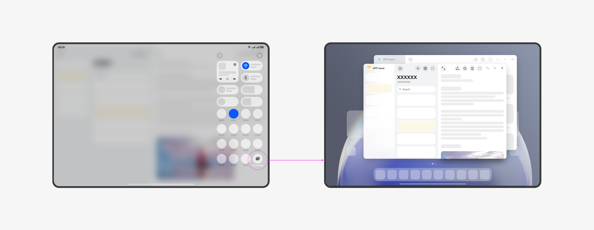

# Introduction to Freeform Windows

<!--Kit: ArkUI-->
<!--Subsystem: Window-->
<!--Owner: @hanxuebing1-->
<!--Designer: @chengyiyi-->
<!--Tester: @qinliwen0417-->
<!--Adviser: @ge-yafang-->
<!-- md-trans-meta sourceCommit=58ff40ad92758153f7b55166a9e6e0a0e9be5d28 translatedAt=2026-07-10T07:15:47.144Z pushedAt=2026-07-13T07:35:39.008Z -->

## Freeform Window

A freeform window is a window state that allows users to display content at any size and position on the same screen. Freeform windows support dragging, resizing, and split-screen combinations, enabling multitasking.

Freeform windows are stacked along the Z-axis in the order they are opened or gain focus. When a freeform window is clicked or touched, it will be raised higher on the Z‑axis and gain focus.

When a new freeform window is launched, it is displayed by default at a certain offset to the lower right of the previous window in a cascading manner.

Each freeform window displays a title bar at the top by default. The app icon is shown on the left side of the title bar, and the three-button control buttons (maximize/restore, minimize, and close) are shown on the right side. The window title bar also supports additional [immersive configuration](https://developer.huawei.com/consumer/cn/doc/best-practices/bpta-multi-device-window-immersive#section359241062916).

You can resize a freeform window by dragging its edges, and move it by dragging its title bar.

Supported devices:

- **PC/2-in-1 devices:** Windows on PC/2-in-1 devices are freeform windows by default.

- **Tablet devices:** Some tablets support enabling [free windows mode](#free-windows-mode) (by pulling down Control Panel and tapping the free windows button) and [desktop mode](#desktop-mode) (by pulling down Control Panel and tapping the desktop mode button). Once enabled, app windows are freeform windows by default.

- **Phone devices:** Some phone devices support enabling [free windows mode](#free-windows-mode) (by pulling down Control Panel and tapping the free windows button). Once this mode is enabled, app windows are freeform windows by default.

### Free Windows Mode

Freeform multi-window mode is an interaction method that supports users in performing multitasking on mobile devices.

In free windows mode, users are allowed to display multiple app windows simultaneously on one screen, and these app windows are [freeform windows](#freeform-window).

On some tablets, you can pull down Control Panel and tap the free windows button to enable the free windows mode.

On some phones, you can pull down Control Panel and tap the free windows button to enable the free windows mode.

### Desktop Mode

Desktop mode is an interaction method that allows users to perform multitasking on mobile devices.

In desktop mode, users can display multiple app windows on a single screen simultaneously, and these app windows are [freeform windows](#freeform-window).

On some tablets, you can enable desktop mode by pulling down Control Panel and tapping the desktop mode button.

## Typical Scenarios

Freeform windows are suitable for multitasking scenarios, allowing you to handle multiple window tasks on the same screen. For example:

- When attending an online class in a browser while taking notes in a note-taking app, the note-taking window is a freeform window. You can drag it to reposition, resize it, and more, so that it does not obscure the core content of the online class but provides a window of appropriate size for taking notes.

- When designing proposals, you can open multiple app windows simultaneously, adjust their positions and sizes, and display them on the same screen to compare multiple proposals without them overlapping each other.

Since freeform windows support resizing and the main window has a title bar by default, there are differences compared to the non-freeform window state. If an app calculates its layout based on screen width and height and is not adapted to window size changes, resizing the window may cause issues such as UI truncation, occlusion, or control overlapping. Therefore, freeform window adaptation is necessary. For details, see [App Adaptation for Freeform Windows](application-adaptation-freeform-window.md).