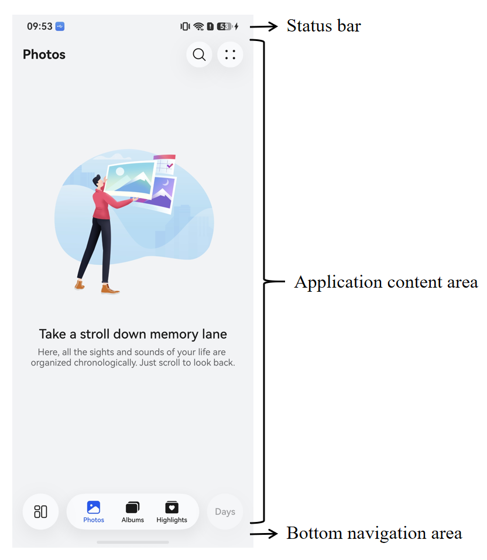
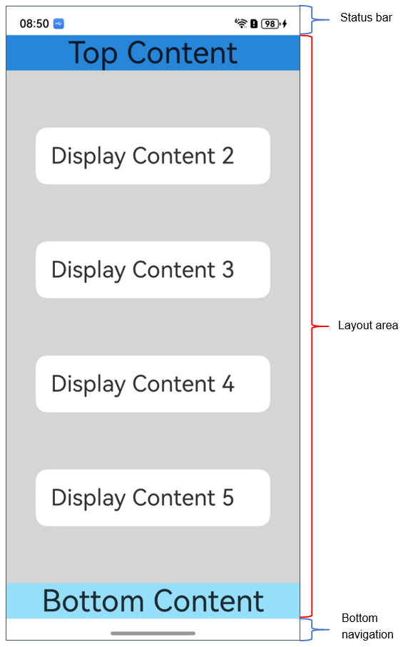
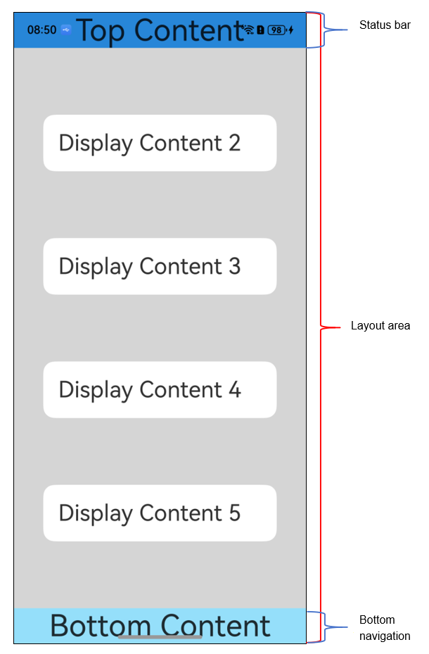
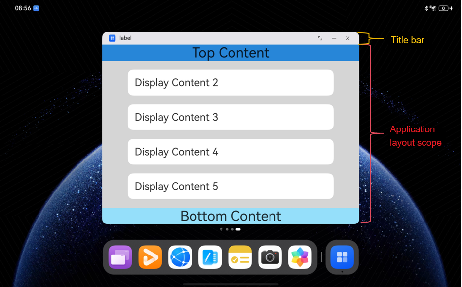
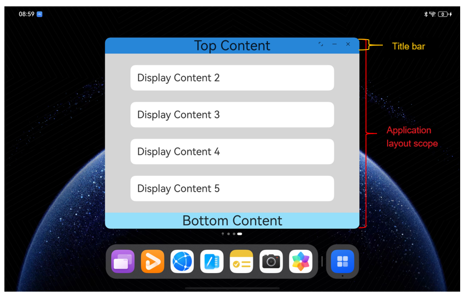
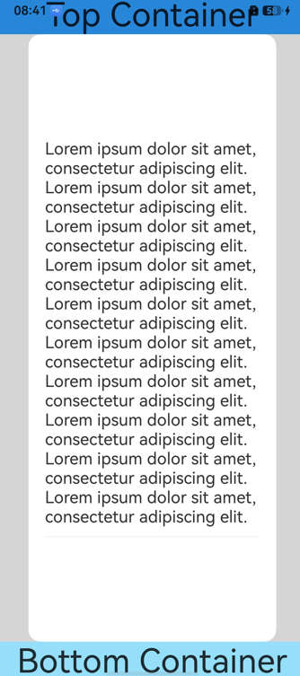

# Immersive Window

<!--Kit: ArkUI-->
<!--Subsystem: Window-->
<!--Owner: @fei_1007-->
<!--Designer: @gcw_sPCsris4-->
<!--Tester: @qinliwen0417-->
<!--Adviser: @ge-yafang-->
<!-- md-trans-meta sourceCommit=58ff40ad92758153f7b55166a9e6e0a0e9be5d28 translatedAt=2026-07-10T07:16:07.775Z pushedAt=2026-07-14T03:47:19.072Z -->

## When to Use

Immersive window refers to optimizing the app UI to make content the visual focus, minimizing distractions from irrelevant elements to achieve an immersive effect. Its implementation requires differentiated adaptation based on the screen characteristics, interaction logic, and system specifications of different devices.

## Immersive Effect

Typically, apps such as media, gaming, and office apps, in order to display content as full-screen as possible and reduce interference from other irrelevant UI elements, actively adjust the visibility or style of system UI elements to focus more on the app UI content.

Developing an app's immersive effect primarily involves adjusting the display of the status bar, app UI, and bottom navigation area to reduce the abruptness of system UIs such as the status bar and navigation area, thereby providing users with the best UI experience.

You can implement immersive effects within the app interface in three ways:

- [Hide system UI elements](#hiding-system-ui-elements-to-implement-an-immersive-effect) to make the app content fill the entire window display area.

- Set the window to [immersive layout](#immersive-layout), extending the app content to the entire window display area, and use [layout avoidance](#layout-avoidance) to prevent important components from overlapping with system UI elements.

- Use the component [safe area](../reference/apis-arkui/arkui-ts/ts-universal-attributes-expand-safe-area.md) capability to extend some components beyond the safe area. With this approach, UI elements are only extended for drawing and cannot be individually laid out in the status bar and navigation area. For scenarios where UI elements need to be individually laid out in the system UI element area, the above two approaches are recommended.

### UI Element Composition

A typical full-screen app window includes system UI elements and the app UI. The system UI elements include the status bar and navigation area, which are usually referred to as avoid areas in [immersive layout](#immersive-layout), while the area outside the avoid areas is called the safe area.



### Immersive Layout

Immersive layout is a state that allows the app's layout area to extend to the entire window display area.

- In non-immersive layout, the app interface content avoids the display area of the system UI by default, including the status bar and navigation area.

- In immersive layout, the available layout area within the app extends to the entire window size. In this case, the layout content of the app interface can overlap with the system UI, but the system interface elements are always displayed above the app interface content.

  You can use the [isImmersiveLayout()](../reference/apis-arkui/arkts-apis-window-Window.md#isimmersivelayout20) interface to determine whether the current window is in immersive layout.

For immersive development and implementation of different window forms in multi-device scenarios, refer to the [Window Immersion](https://developer.huawei.com/consumer/cn/doc/best-practices/bpta-multi-device-window-immersive) best practice.

> **NOTE**
>
> Immersive layout is the layout mode of elements within a window. Entering or exiting immersive layout does not change the window size or position; it only affects the layout of elements within the app interface.

The methods for implementing immersive layout differ between [freeform window](freeform-window-overview.md#freeform-window) and non-[freeform window](freeform-window-overview.md#freeform-window) states.

- In the non-freeform window state, you can use the [setWindowLayoutFullScreen()](../reference/apis-arkui/arkts-apis-window-Window.md#setwindowlayoutfullscreen9) or [setImmersiveModeEnabledState()](../reference/apis-arkui/arkts-apis-window-Window.md#setimmersivemodeenabledstate12) API to set the current window to enter or exit the immersive window layout.

  > **NOTE**
  > 
  > In the non-freeform window state, all window types except app subwindows are created in non-immersive layout by default, while subwindows are created in immersive layout by default.

  <!--@[HideDecorationBar_start](https://gitcode.com/openharmony/applications_app_samples/blob/master/code/DocsSample/ArkUISample/ArkUIWindowSamples/HideDecorationBar/entry/src/main/ets/entryability/EntryAbility.ets) -->

  ``` TypeScript
  import { AbilityConstant, ConfigurationConstant, UIAbility, Want } from '@kit.AbilityKit';
  import { hilog } from '@kit.PerformanceAnalysisKit';
  import { window } from '@kit.ArkUI';
  
  const DOMAIN = 0x0000;
  
  export default class EntryAbility extends UIAbility {
    // ...
  
    onWindowStageCreate(windowStage: window.WindowStage): void {
      windowStage.loadContent('pages/Index', async (err) => {
        if (err.code) {
          return;
        }
  
        try {
          const mainWindow: window.Window = windowStage.getMainWindowSync();  // Get the app's main window
          await mainWindow.setWindowLayoutFullScreen(true); // Enter the immersive window layout (non-freeform window state).
          mainWindow.setWindowDecorVisible(false);  // Hide the window title bar and enter immersive layout (freeform window state).
        } catch (e) {
          console.error(`Failed to set status bar to invisible`);
        }
      });
    }
  // ...
  ```

  | Non-immersive Layout of a Non-freeform Window | Immersive Layout of a Non-freeform Window |
  | -------- | -------- |
  |   |  |

- In the freeform window state, you can control the visibility of the window title bar through the [setWindowDecorVisible()](../reference/apis-arkui/arkts-apis-window-Window.md#setwindowdecorvisible11) API. When the title bar is hidden, the window is in immersive layout.  

  | Non-immersive Layout of a Freeform Window | Immersive Layout of a Freeform Window |
  | -------- | -------- |
  |  |   |

### Layout Avoidance

In the immersive layout state, the window's layoutable area can overlap with the display area of system UI elements. To prevent the app UI from being obscured by overlapping system UI elements such as the status bar and navigation area, additional layout avoidance is required during component layout.

The overlapping area between the window and the system UI element display is called the **avoid area**. Within the app, layout avoidance is used to position key display components away from the avoid area, thereby achieving an immersive effect.

The types of avoid areas supported by the system are represented by the [AvoidAreaType](../reference/apis-arkui/arkts-apis-window-e.md#avoidareatype7) enum.

### Calculation Method for the Avoid Area (AvoidArea)

The data structure of the avoid area [AvoidArea](../reference/apis-arkui/arkts-apis-window-i.md#avoidarea7) is as follows:

```txt
interface AvoidArea {
  visible: boolean;
  leftRect: Rect;
  topRect: Rect;
  rightRect: Rect;
  bottomRect: Rect;
}

interface Rect {
  left: number;
  top: number;
  width: number;
  height: number;
}
```

- It contains four sets of **Rect** information, indicating the direction of this type of avoid area relative to the window center point and the specific rectangular area position.

- The **visible** attribute does not represent the visibility of any system UI and has no actual meaning. **Please avoid using this attribute**.

In the calculation of the avoid area, the window is divided into four triangular areas along its diagonals. When the position (rectangle center point) of the corresponding system UI element falls within a triangular area in a certain direction, the provided avoid area will be in the corresponding **Rect**. As shown in the figure below, the entire rectangle is the window area, with the upper left corner of the window as the origin, the horizontal right direction as the positive X-axis direction, and the vertical downward direction as the positive Y-axis direction. The two diagonals of the window rectangle divide the entire rectangle into four directional **Rect** areas, used to represent the geometric position of the avoid area relative to the window.


Each **Rect** is a quadruple consisting of (X, Y, Width, Height), representing a unique rectangular area with the **upper left corner of the window as the origin**.

As shown in the figure below, the punch-hole area is represented as **[topRect, (x1, y1, w1, h1)]**, and the bottom navigation area is represented as **[bottomRect, (0, H-h2, W, h2)]**.


## Hiding System UI Elements to Implement an Immersive Effect

You can implement an immersive effect by hiding system UI elements, which is suitable for scenarios such as games and movies. For example, hide the status bar on a camera's full-screen image page to achieve an immersive image viewing effect.

> **NOTE**
> 
> The APIs for controlling the display of system UI elements, such as [setSpecificSystemBarEnabled()](../reference/apis-arkui/arkts-apis-window-Window.md#setspecificsystembarenabled11) and [setWindowSystemBarEnable()](../reference/apis-arkui/arkts-apis-window-Window.md#setwindowsystembarenable9), are only supported for calling on the main window in a non-[freeform window](freeform-window-overview.md#freeform-window) state. Calling them in an [auxiliary window](window-type-overview.md#auxiliary-window) or in a [freeform window](freeform-window-overview.md#freeform-window) state does not take effect. Calling them when the main window is not in full-screen or maximized mode does not take effect immediately; the configuration takes effect after the app enters full-screen or maximized mode.


1. Call the [setWindowLayoutFullScreen()](../reference/apis-arkui/arkts-apis-window-Window.md#setwindowlayoutfullscreen9) API to set the window to enter immersive layout.  

2. Call [setSpecificSystemBarEnabled()](../reference/apis-arkui/arkts-apis-window-Window.md#setspecificsystembarenabled11) to hide the status bar.  

  <!--@[SystemBarEnabled_start](https://gitcode.com/openharmony/applications_app_samples/blob/master/code/DocsSample/ArkUISample/ArkUIWindowSamples/SystemBarEnabled/entry/src/main/ets/entryability/EntryAbility.ets) --> 

  ``` TypeScript
  import { AbilityConstant, ConfigurationConstant, UIAbility, Want } from '@kit.AbilityKit';
  import { hilog } from '@kit.PerformanceAnalysisKit';
  import { window } from '@kit.ArkUI';
  
  const DOMAIN = 0x0000;
  
  export default class EntryAbility extends UIAbility {
      // ...
  
    onWindowStageCreate(windowStage: window.WindowStage): void {
      windowStage.loadContent('pages/Index', async (err) => {
        if (err.code) {
          return;
        }
  
        try {
          const mainWindow: window.Window = windowStage.getMainWindowSync();  // Get the main window of the app.
          await mainWindow.setWindowLayoutFullScreen(true);  // Set the window to enter immersion.
          await mainWindow.setSpecificSystemBarEnabled('status', false);  // Hide the status bar.
        } catch (e) {
          console.error(`Failed to set status bar to invisible`);
        }
      });
    }
    // ...
  ```

## Adapting Immersive Layout to Achieve Immersive Effects

> **NOTE**
>
> Global floating windows, dialog windows, and system windows do not have the ability to obtain avoid areas. If you need to adapt layout avoidance in these windows, use the [setSystemAvoidAreaEnabled()](../reference/apis-arkui/arkts-apis-window-Window.md#setsystemavoidareaenabled18) API to enable the avoid area capability before performing layout avoidance.

1. Call the [setWindowLayoutFullScreen()](../reference/apis-arkui/arkts-apis-window-Window.md#setwindowlayoutfullscreen9) API to set the window to enter immersive layout.

2. Obtain and listen for window avoid areas, and update the app's internal layout when the avoid area is updated.

   Here, obtaining and listening to the avoid areas of the status bar, bottom navigation area, and cutout area is used as an example.

   - You can use the [getWindowAvoidArea()](../reference/apis-arkui/arkts-apis-window-Window.md#getwindowavoidarea9) API to obtain the avoid area of the current window. Use the [on('avoidAreaChange')](../reference/apis-arkui/arkts-apis-window-Window.md#onavoidareachange9) API to listen for dynamic changes to the avoid area.

     Common scenarios that trigger the avoid area callback include: switching an app window between full-screen mode, floating mode, and split-screen mode; rotating an app window; switching a multi-foldable device between the folded and unfolded screen states; and transferring an app window across multiple devices.

     <!--@[ImmersiveLayout_start](https://gitcode.com/openharmony/applications_app_samples/blob/master/code/DocsSample/ArkUISample/ArkUIWindowSamples/ImmersiveLayout/entry/src/main/ets/entryability/EntryAbility.ets) -->

     ``` TypeScript
     import { AbilityConstant, ConfigurationConstant, UIAbility, Want } from '@kit.AbilityKit';
     import { hilog } from '@kit.PerformanceAnalysisKit';
     import { window } from '@kit.ArkUI';
     
     const DOMAIN = 0x0000;
     
     export default class EntryAbility extends UIAbility {
       // ...
     
       private async initializeMainWindow(windowStage: window.WindowStage): Promise<void> {
         try {
           this.mainWindow = windowStage.getMainWindowSync();
           AppStorage.setOrCreate('mainWindow', this.mainWindow);
           await this.mainWindow.setWindowLayoutFullScreen(true);
           this.initSafeArea(this.mainWindow);
           this.mainWindow.on('avoidAreaChange', (option) => {
             switch (option.type) {
               // Listen for the status bar avoid area.
               case window.AvoidAreaType.TYPE_SYSTEM: {
                 const topHeight = Math.max(option.area.topRect.height, AppStorage.get<number>('topAvoidHeight') ?? 0);
                 AppStorage.setOrCreate('topAvoidHeight', topHeight);
                 break;
               }
               // Listen for the cutout avoid area.
               case window.AvoidAreaType.TYPE_CUTOUT: {
                 this.handleCutoutAvoidArea(option.area);
                 break;
               }
               // Listen for the avoid area of the bottom navigation area.
               case window.AvoidAreaType.TYPE_NAVIGATION_INDICATOR: {
                 const bottomHeight = Math.max(option.area.bottomRect.height, AppStorage.get<number>('bottomAvoidHeight') ?? 0);
                 AppStorage.setOrCreate('bottomAvoidHeight', bottomHeight);
                 break;
               }
               default: {
                 break;
               }
             }
           });
         } catch (err) {
           hilog.error(DOMAIN, 'testTag', 'Failed to initialize avoid area listener. Cause: %{public}s', JSON.stringify(err));
         }
       }
     
       private initSafeArea(win: window.Window): void {
         try {
           // Get the avoid area of the status bar.
           const systemAvoidArea = win.getWindowAvoidArea(window.AvoidAreaType.TYPE_SYSTEM);
           // Get the avoid area of the bottom navigation area.
           const navigationAvoidArea = win.getWindowAvoidArea(window.AvoidAreaType.TYPE_NAVIGATION_INDICATOR);
           // Get the avoid area of the cutout area.
           const cutoutAvoidArea = win.getWindowAvoidArea(window.AvoidAreaType.TYPE_CUTOUT);
     
           AppStorage.setOrCreate('topAvoidHeight', systemAvoidArea.topRect.height);
           AppStorage.setOrCreate('bottomAvoidHeight', navigationAvoidArea.bottomRect.height);
           AppStorage.setOrCreate('leftAvoidWidth', 0);
           AppStorage.setOrCreate('rightAvoidWidth', 0);
           this.handleCutoutAvoidArea(cutoutAvoidArea);
         } catch (err) {
           hilog.error(DOMAIN, 'testTag', 'Failed to init safe area. Cause: %{public}s', JSON.stringify(err));
         }
       }
     
       private handleCutoutAvoidArea(cutoutAvoidArea: window.AvoidArea): void {
         if (cutoutAvoidArea.topRect.height > 0) {
           const topHeight = Math.max(AppStorage.get<number>('topAvoidHeight') ?? 0, cutoutAvoidArea.topRect.height);
           AppStorage.setOrCreate('topAvoidHeight', topHeight);
         }
         if (cutoutAvoidArea.bottomRect.height > 0) {
           const bottomHeight = Math.max(AppStorage.get<number>('bottomAvoidHeight') ?? 0, cutoutAvoidArea.bottomRect.height);
           AppStorage.setOrCreate('bottomAvoidHeight', bottomHeight);
         }
         if (cutoutAvoidArea.leftRect.width > 0) {
           AppStorage.setOrCreate('leftAvoidWidth', cutoutAvoidArea.leftRect.width);
         }
         if (cutoutAvoidArea.rightRect.width > 0) {
           AppStorage.setOrCreate('rightAvoidWidth', cutoutAvoidArea.rightRect.width);
         }
       }
     }
     ```

   - You can also use the responsive environment variable decorator [@Env](../reference/apis-arkui/arkui-ts/ts-env-system-property.md) to obtain and listen for the avoid area.

You can use the responsive environment variable decorator @Env (@Env(SystemProperties.WINDOW_AVOID_AREA) or @Env(SystemProperties.WINDOW_AVOID_AREA_PX)) to obtain and listen for the avoid area information of the current window.

When the avoid area changes due to landscape/portrait switching, system bar visibility, window form changes, and other reasons, the @Env variable is automatically updated and triggers the refresh of related components, thereby implementing dynamic adaptation of the immersive layout. The sample code is as follows:

     <!--@[ImmersiveLayoutEnv_start](https://gitcode.com/openharmony/applications_app_samples/blob/master/code/DocsSample/ArkUISample/ArkUIWindowSamples/ImmersiveLayoutEnv/entry/src/main/ets/pages/Index.ets) -->

     ``` TypeScript
     import { window } from '@kit.ArkUI';
     import { hilog } from '@kit.PerformanceAnalysisKit';
     
     const DOMAIN = 0x0000;
     
     @Entry
     @Component
     struct Index {
       @Env(SystemProperties.WINDOW_AVOID_AREA) avoidAreasVp: window.UIEnvWindowAvoidAreaInfoVP;
       @StorageProp('topAvoidHeight')
       topAvoidHeight: number = 0;
       @StorageProp('bottomAvoidHeight')
       bottomAvoidHeight: number = 0;
       @StorageProp('leftAvoidWidth')
       leftAvoidWidth: number = 0;
       @StorageProp('rightAvoidWidth')
       rightAvoidWidth: number = 0;
       @StorageLink('mainWindow')
       mainWindow: window.Window | undefined = undefined;
       // ...
     }
     ```

3. System UI elements in the layout need to avoid the status bar and navigation area; otherwise, issues such as overlapping UI elements may occur.

> **NOTE**
>
> The avoid area can have a size of 0. When the obtained avoid area is 0, you need to pay attention to targeted adaptation of the page area and layout at this time to avoid issues such as edge-sticking and content clipping, ensuring that that the application UI displays normally and remains visually appealing.

You can avoid system UI elements by adding **padding** or placeholder components. Here, adding **padding** is used as an example (the specific value is the avoidance height + 10 vp to prevent layout content from sticking to the edge when system UI elements are hidden. You can change this based on actual requirements). Set **padding** on the top of the control to avoid the status bar; set **padding** on the bottom to avoid the bottom navigation area; set **padding** on the left and right sides to avoid the cutout area.

   - An example of avoiding the avoid area obtained using the **getWindowAvoidArea** API is as follows:

      <!--@[ImmersiveLayout_start](https://gitcode.com/openharmony/applications_app_samples/blob/master/code/DocsSample/ArkUISample/ArkUIWindowSamples/ImmersiveLayout/entry/src/main/ets/pages/Index.ets) -->

      ``` TypeScript
      import { window } from '@kit.ArkUI';
      import { hilog } from '@kit.PerformanceAnalysisKit';
      
      const DOMAIN = 0x0000;
      
      @Entry
      @Component
      struct Index {
        // ...
        build() {
          Column() {
            // Avoid the top and cutout areas.
            Row() {
              Text('Top Container')
                .fontSize(40)
                .textAlign(TextAlign.Center)
                .width('100%')
            }
            .backgroundColor('#2786d9')
            .padding({
              top: this.getUIContext().px2vp(this.topAvoidHeight) + 10,
              bottom: 10,
              // Avoid the cutout area.
              left: this.getUIContext().px2vp(this.leftAvoidWidth),
              right: this.getUIContext().px2vp(this.rightAvoidWidth)
            })
      
            Scroll() {
              Column({ space: 12 }) {
                Row() {
                  Text(this.text)
                    .fontSize(20)
                }
      
                Divider()
      
                Text(`topAvoidHeight: ${this.topAvoidHeight}`)
                Text(`bottomAvoidHeight: ${this.bottomAvoidHeight}`)
                Text(`leftAvoidWidth: ${this.leftAvoidWidth}`)
                Text(`rightAvoidWidth: ${this.rightAvoidWidth}`)
                Text(`preferredOrientation: ${this.orientationText}`)
                Text(this.statusText)
                  .fontColor('#666666')
      
                Row({ space: 8 }) {
                  Button('Auto Rotation')
                    .layoutWeight(1)
                    .onClick(() => {
                      void this.setOrientation(window.Orientation.AUTO_ROTATION, 'AUTO_ROTATION');
                    })
      
                  Button('Portrait')
                    .layoutWeight(1)
                    .backgroundColor('#0A7A5A')
                    .onClick(() => {
                      void this.setOrientation(window.Orientation.PORTRAIT, 'PORTRAIT');
                    })
      
                  Button('Landscape')
                    .layoutWeight(1)
                    .backgroundColor('#AD5C00')
                    .onClick(() => {
                      void this.setOrientation(window.Orientation.LANDSCAPE, 'LANDSCAPE');
                    })
                }
                .width('100%')
      
                Text('Cutout test: rotate the app and observe whether leftAvoidWidth / rightAvoidWidth change on a cutout device.')
                  .fontColor('#666666')
              }
              .width('100%')
            }
            .backgroundColor(Color.White)
            .padding(20)
            .borderRadius(15)
            .width('80%')
            .margin({
              left: this.getUIContext().px2vp(this.leftAvoidWidth),
              right: this.getUIContext().px2vp(this.rightAvoidWidth)
            })
            .layoutWeight(1)
            // Avoid the bottom and cutout areas.
            Row() {
              Text('Bottom Container')
                .fontSize(40)
                .textAlign(TextAlign.Center)
                .width('100%')
            }
            .backgroundColor('#96dffa')
            .padding({
              top: 10,
              bottom: this.getUIContext().px2vp(this.bottomAvoidHeight) + 10,
              // Avoid the cutout area.
              left: this.getUIContext().px2vp(this.leftAvoidWidth),
              right: this.getUIContext().px2vp(this.rightAvoidWidth)
            })
          }
          .width('100%')
          .height('100%')
          .padding({
            left: this.getUIContext().px2vp(this.leftAvoidWidth),
            right: this.getUIContext().px2vp(this.rightAvoidWidth)
          })
          .alignItems(HorizontalAlign.Center)
          .backgroundColor('#d5d5d5')
          .justifyContent(FlexAlign.SpaceBetween)
        }
      }
      ```

    - The sample code for avoiding the avoid area obtained using @Env(SystemProperties.WINDOW_AVOID_AREA) is as follows:

      <!--@[ImmersiveLayoutEnv3_start](https://gitcode.com/openharmony/applications_app_samples/blob/master/code/DocsSample/ArkUISample/ArkUIWindowSamples/ImmersiveLayoutEnv/entry/src/main/ets/pages/Index.ets) -->

      ``` TypeScript
       // ...
        build() {
          Column() {
            Row() {
              Text('Top Container')
                .fontSize(40)
                .textAlign(TextAlign.Center)
                .width('100%')
            }
            .backgroundColor('#2786d9')
            .padding({
              top: this.avoidAreasVp.statusBar.topRect.height + 10,
              bottom: 10,
              left: this.avoidAreasVp.cutout.leftRect.width,
              right: this.avoidAreasVp.cutout.rightRect.width
            })
      
            Scroll() {
              Column({ space: 12 }) {
                Row() {
                  Text(this.text)
                    .fontSize(20)
                }
      
                Divider()
      
                Text(`topAvoidHeight: ${this.topAvoidHeight}`)
                Text(`bottomAvoidHeight: ${this.bottomAvoidHeight}`)
                Text(`leftAvoidWidth: ${this.leftAvoidWidth}`)
                Text(`rightAvoidWidth: ${this.rightAvoidWidth}`)
                Text(`preferredOrientation: ${this.orientationText}`)
                Text(this.statusText)
                  .fontColor('#666666')
      
                Row({ space: 8 }) {
                  Button('Auto Rotation')
                    .layoutWeight(1)
                    .onClick(() => {
                      void this.setOrientation(window.Orientation.AUTO_ROTATION, 'AUTO_ROTATION');
                    })
      
                  Button('Portrait')
                    .layoutWeight(1)
                    .backgroundColor('#0A7A5A')
                    .onClick(() => {
                      void this.setOrientation(window.Orientation.PORTRAIT, 'PORTRAIT');
                    })
      
                  Button('Landscape')
                    .layoutWeight(1)
                    .backgroundColor('#AD5C00')
                    .onClick(() => {
                      void this.setOrientation(window.Orientation.LANDSCAPE, 'LANDSCAPE');
                    })
                }
                .width('100%')
      
                Text('Cutout test: rotate the app and observe whether leftAvoidWidth / rightAvoidWidth change on a cutout device.')
                  .fontColor('#666666')
              }
              .width('100%')
            }
            .backgroundColor(Color.White)
            .padding(20)
            .borderRadius(15)
            .width('80%')
            .margin({
              left: this.avoidAreasVp.cutout.leftRect.width,
              right: this.avoidAreasVp.cutout.rightRect.width
            })
            .layoutWeight(1)
      
            Row() {
              Text('Bottom Container')
                .fontSize(40)
                .textAlign(TextAlign.Center)
                .width('100%')
            }
            .backgroundColor('#96dffa')
            .padding({
              top: 10,
              bottom: this.avoidAreasVp.navigationIndicator.bottomRect.height + 10,
              left: this.avoidAreasVp.cutout.leftRect.width,
              right: this.avoidAreasVp.cutout.rightRect.width
            })
          }
          .width('100%')
          .height('100%')
          .padding({
            left: this.avoidAreasVp.cutout.leftRect.width,
            right: this.avoidAreasVp.cutout.rightRect.width
          })
          .alignItems(HorizontalAlign.Center)
          .backgroundColor('#d5d5d5')
          .justifyContent(FlexAlign.SpaceBetween)
        }
      }
      ```

4. Based on the actual UI display or the background color of related UI elements, you can also set the text color and background color of the status bar, or set the display or hiding of the navigation area as needed, so that the UI effect appears harmonious. The status bar and navigation area are transparent by default, showing the background color of the app UI.

   In this example, the UI colors are relatively simple, so the status bar text color and background color are not set, and the navigation area is not hidden.

| Not Adapted to Immersive Layout and Avoid Area | Adapted to Immersive Layout and Avoid Area |
| -------- | -------- |
|  | |

