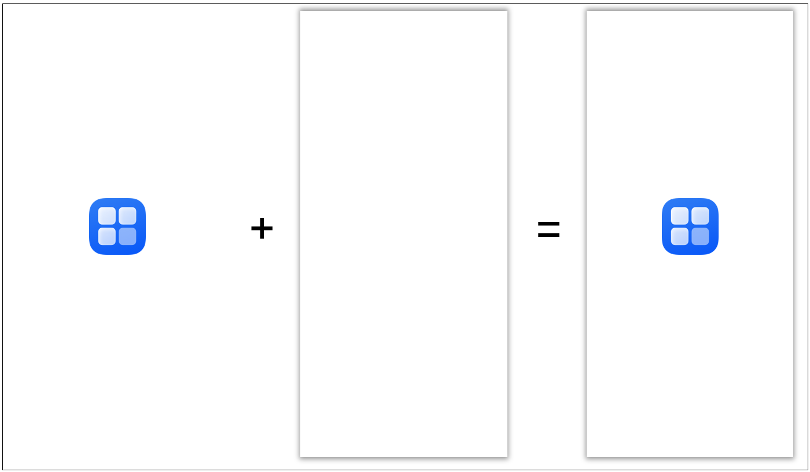
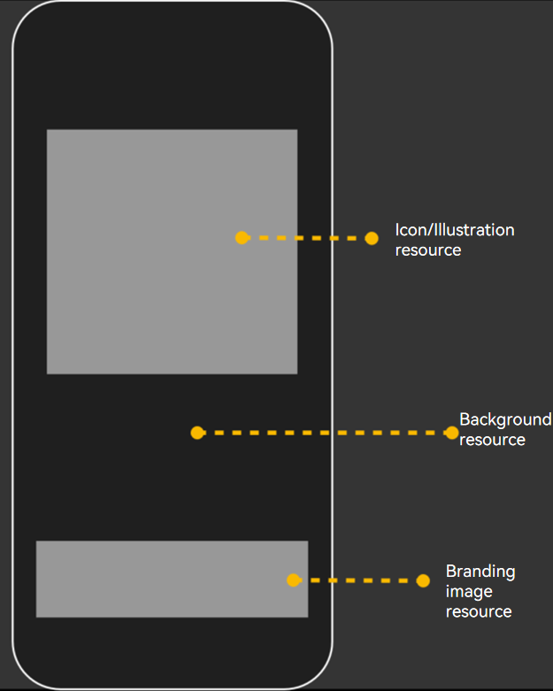

# Configuring the Application Starting Window

<!--Kit: ArkUI-->
<!--Subsystem: Window-->
<!--Owner: @waterwin-->
<!--Designer: @nyankomiya-->
<!--Tester: @qinliwen0417-->
<!--Adviser: @ge-yafang-->
<!-- md-trans-meta sourceCommit=e3c52b80ea412371fb2dea52b278788d7531f840 translatedAt=2026-07-16T06:48:11.211Z pushedAt=2026-07-16T08:16:49.635Z -->

## Classification and Implementation of Starting Windows

Starting windows are divided into two categories: simple starting windows and enhanced starting windows. You can configure starting window resources through the [abilities tag](../quick-start/module-configuration-file.md#abilities) in the **module.json5** file. The following table describes the involved fields.

| Field| Type| Optional| Description|
| -------- | -------- | -------- | -------- |
| startWindowIcon | string | No | Index of the simple starting window icon resource file for the current UIAbility component. The value is a string of no more than 255 bytes.<br>This icon resource is displayed centered at its actual size on the starting window.<br>This field becomes invalid when **startWindow** is configured. |
| startWindowBackground | string | No | Index of the simple starting window background color resource file for the current UIAbility component. The value is a string of no more than 255 bytes.<br>Considering the display effect of the starting window in various scenarios and the continuity of system animations, using a transparent color is not recommended.<br>This field becomes invalid when **startWindow** is configured. |
| startWindow | string | Yes | Index of the enhanced starting window configuration resource JSON file for the current UIAbility component. The value is a string of no more than 255 bytes.<br>Points to a secondary configuration JSON file. When the application needs to configure an enhanced starting window, fill in this field to provide richer starting window resource configuration items.<br><!--RP1-->Starting from API version 20, the **startWindow** field can be used to configure the enhanced starting window.<!--RP1End--> |

## Configuring a Simple Starting Window

A simple starting window is mandatory for every UIAbility. You can set the **startWindowIcon** and **startWindowBackground** fields in the [abilities tag](../quick-start/module-configuration-file.md#abilities) of the **module.json5** file to configure a simple starting window.

> **NOTE**
>
> - **startWindowIcon** is used to display the application icon, which is not scaled with the window size. You should avoid configuring **startWindowIcon** tailored to the full-screen size of a single device, as this can lead to improper display on devices of other sizes.
>
> - For details about full-screen resource display, see [Configuring an Enhanced Starting Window](#configuring-an-enhanced-starting-window).

In the created UIAbility template, the default configuration for the simple starting window fields is as follows:

<!-- @[startWindow](https://gitcode.com/openharmony/applications_app_samples/blob/master/code/DocsSample/ArkUISample/StartWindow/sampleForStartWindow/entry/src/main/module.json5) -->

``` JSON5
"startWindowIcon": "$media:startIcon",
"startWindowBackground": "$color:start_window_background",
```

The following figure shows the default starting window.

**Figure 1** Default starting window



You can customize the icon and color resources as required.

## Configuring an Enhanced Starting Window

<!--RP1-->Starting from API version 20, the **startWindow** field can be used to configure enhanced starting windows.<!--RP1End-->

The **startWindow** field provides enhanced capabilities for configuring starting windows with more complex elements. In addition, the corresponding resources can be scaled based on the window size, which facilitates multi-device deployment with a set of code.

> **NOTE**
>
> - The creation of the application process includes decoding of the starting window image resources. Therefore, using images with appropriate resolution is key to reduce the application startup latency. If you have high requirements on the startup experience, you are advised to use image resources with a resolution of no more than 256\*256.
> 
> - The image resources on the starting window support the same file formats as the [Image](../reference/apis-arkui/arkui-ts/ts-basic-components-image.md) component. To ensure decoding performance and display quality, you are advised to use JPG or PNG images.

1. In the created UIAbility template, add the **startWindow** field to point to a level-2 JSON file to enable enhanced configuration for the starting window.

   You are advised to create a JSON file named **start_window.json** and place it in the **resources/base/profile** directory. In this case, configure the following field in the **abilities** tag of the **module.json5** file:

   <!-- @[enhancedStartWindow](https://gitcode.com/openharmony/applications_app_samples/blob/master/code/DocsSample/ArkUISample/StartWindow/EnhancedStartingWindow/entry/src/main/module.json5) -->

   ``` JSON5
   "startWindow": "$profile:start_window",
   ```

2. Configure the fields in the level-2 JSON file. The starting window resources are mainly displayed in the upper and lower areas on the screen. If the resources for the corresponding areas are not configured, they will be left blank, and the positions and sizes of other areas will not be affected.

   The following describes the fields that can be configured and shows the final effect of the enhanced starting window.

   | Field | Type | Optional | Description |
   | -------- | -------- | -------- | -------- |
   | startWindowType | string | Yes | Whether to hide the starting window for the current UIAbility component.<br>Currently only supported in free windows mode on PC/2-in-1 devices or tablets.<br>The values are as follows:<br>\- "REQUIRED_SHOW": Force display of the starting window. This is not affected by the [Ability management service (i.e., the hideStartWindow field in StartOptions)](../reference/apis-ability-kit/js-apis-app-ability-startOptions.md#startoptions).<br>\- "REQUIRED_HIDE": Force hiding of the starting window. This is not affected by the [Ability management service (i.e., the **hideStartWindow** field in StartOptions)](../reference/apis-ability-kit/js-apis-app-ability-startOptions.md#startoptions).<br>\- "OPTIONAL_SHOW": Optional display. The default behavior is to display the starting window. If the [Ability management service (i.e., the hideStartWindow field in StartOptions)](../reference/apis-ability-kit/js-apis-app-ability-startOptions.md#startoptions) is set to hide the starting window, the starting window will be hidden.<br>\- If this field is not configured, the default value is "REQUIRED_SHOW", meaning the starting window is forcibly displayed.<br>This field is supported since API version 20. |
   | startWindowAppIcon | string | Yes | Index of the icon resource file for the enhanced starting window of the current UIAbility component. The value is a string of no more than 255 bytes.<br>Displayed in the upper part of the window. The resource is scaled by the system to fit fully within the display area while maintaining the aspect ratio.<br>The size of the icon resource display area is selected by the system based on the window size, with possible values of 128 vp \* 128 vp, 192 vp \* 192 vp, or 256 vp \* 256 vp.<br>When configured together with the illustration resource startWindowIllustration, only the icon resource is displayed.<br><!--RP2-->This field is supported since API version 20.<!--RP2End--> |
   | startWindowIllustration | string | Yes | Index of the illustration resource file for the enhanced starting window of the current UIAbility component. The value is a string of no more than 255 bytes.<br>Displayed in the upper part of the window. If the resource dimensions exceed the display area, the system scales it down while maintaining the aspect ratio so that the resource fits fully within the display area; otherwise, its dimensions remain unchanged.<br>The aspect ratio of the illustration resource display area is 1.<br>When configured together with the icon resource **startWindowAppIcon**, only the icon resource is displayed.<br><!--RP2-->This field is supported since API version 20.<!--RP2End--> |
   | startWindowBrandingImage | string | Yes | Index of the branding image resource file for the enhanced starting window of the current UIAbility component. The value is a string of no more than 255 bytes.<br>Displayed in the lower part of the window. If the resource dimensions exceed the display area, the system scales it down while maintaining the aspect ratio so that the resource fits fully within the display area; otherwise, its dimensions remain unchanged.<br>If the window height is less than 300 vp, this resource will be hidden.<br><!--RP2-->This field is supported since API version 20.<!--RP2End--> |
   | startWindowBackgroundColor | string | No | Index of the background color resource file for the enhanced starting window of the current UIAbility component. The value is a string of no more than 255 bytes.<br>The background color fills the entire window and is at the lowest display layer. Transparent colors are not recommended.<br>If this field is not configured, the enhanced starting window configuration file does not take effect, and the simple starting window configuration is used instead.<br><!--RP2-->This field is supported since API version 20.<!--RP2End--> |
   | startWindowBackgroundImage | string | Yes | Index of the background image resource file for the enhanced starting window of the current UIAbility component. The value is a string of no more than 255 bytes.<br>The entire window serves as the container, and the fill mode is specified by the **startWindowBackgroundImageFit** field.<br><!--RP2-->This field is supported since API version 20.<!--RP2End--> |
   | startWindowBackgroundImageFit | string | Yes | Fill mode of the background image for the enhanced starting window of the current UIAbility component. The supported values are:<br>- **"Contain"**: Scales the image up or down while maintaining the aspect ratio so that the image fits fully within the display boundary.<br>- **"Cover"**: Scales the image up or down while maintaining the aspect ratio so that both sides of the image are greater than or equal to the display boundary.<br>- **"Auto"**: Scales the image appropriately based on its own dimensions and the component dimensions to fill the view while maintaining the aspect ratio.<br>- **"Fill"**: Scales the image up or down without maintaining the aspect ratio so that the image fills the display boundary.<br>- **"ScaleDown"**: Displays the image while maintaining the aspect ratio, scaling it down or keeping it unchanged.<br>- **"None"**: Displays the image at its original dimensions.<br>If this field is not configured, the default fill mode is **"Cover"**.<br><!--RP2-->This field is supported since API version 20.<!--RP2End--> |

   <!--RP3--><!--RP3End-->

**Figure 2** Enhanced starting window



Example:

   <!--RP4-->

   ```json
   {
     "startWindowType": "REQUIRED_SHOW",
     "startWindowAppIcon": "$media:icon",
     "startWindowIllustration": "$media:illustration",
     "startWindowBrandingImage": "$media:brand",
     "startWindowBackgroundColor": "$color:start_window_background",
     "startWindowBackgroundImage": "$media:bgImage",
     "startWindowBackgroundImageFit": "Contain"
   }
   ```

   <!--RP4End-->